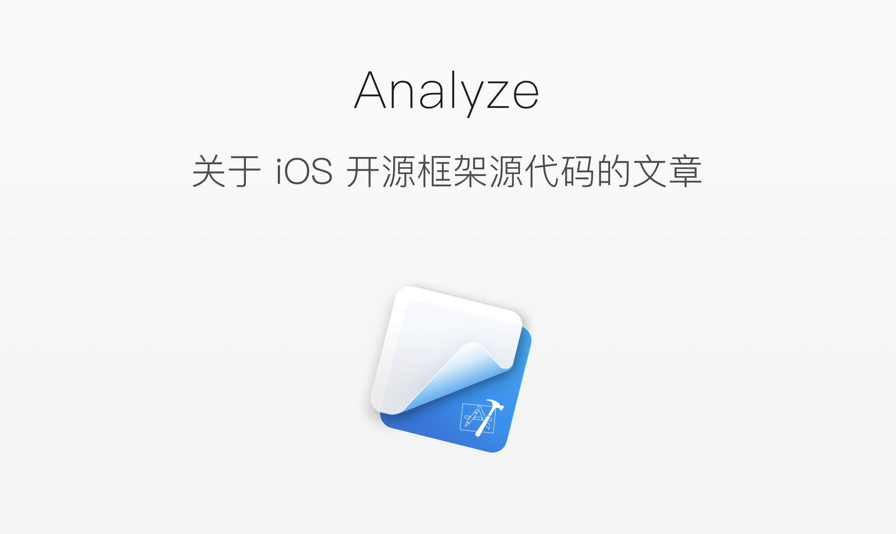

# iOS-Source-Code-Analyze

  
  <em>Banner designed by <a href="https://dribbble.com/levine" alt="iOS Source code analyze">Levine</a></em>

## 为什么要建这个仓库

世人都说阅读开源框架的源代码对于功力有显著的提升，所以我也尝试阅读开源框架的源代码，并对其内容进行详细地分析和理解。在这里将自己阅读开源框架源代码的心得记录下来，希望能对各位开发者有所帮助。我会不断更新这个仓库中的文章，如果想要关注可以点 `star`。

## 目录

> Latest：[检测 NSObject 对象持有的强指针](https://github.com/Draveness/iOS-Source-Code-Analyze/blob/master/FBRetainCycleDetector/检测%20NSObject%20对象持有的强指针.md)

| Project | Version | Article |
|:-------:|:-------:|:------|
| FBRetainCycleDetector | 0.1.2 | [如何在 iOS 中解决循环引用的问题](https://github.com/Draveness/iOS-Source-Code-Analyze/blob/master/FBRetainCycleDetector/如何在%20iOS%20中解决循环引用的问题.md)  [检测 NSObject 对象持有的强指针](https://github.com/Draveness/iOS-Source-Code-Analyze/blob/master/FBRetainCycleDetector/检测%20NSObject%20对象持有的强指针.md)|
| fishhook | 0.2 |[动态修改 C 语言函数的实现](https://github.com/Draveness/iOS-Source-Code-Analyze/blob/master/fishhook/动态修改%20C%20语言函数的实现.md) |
| libextobjc |  |[如何在 Objective-C 的环境下实现 defer](https://github.com/Draveness/iOS-Source-Code-Analyze/blob/master/libextobjc/如何在%20Objective-C%20的环境下实现%20defer.md) |
| IQKeyboardManager | 4.0.3 |[『零行代码』解决键盘遮挡问题（iOS）](https://github.com/Draveness/iOS-Source-Code-Analyze/blob/master/IQKeyboardManager/『零行代码』解决键盘遮挡问题（iOS）.md) |
|  ObjC   |         | [从 NSObject 的初始化了解 isa](https://github.com/Draveness/iOS-Source-Code-Analyze/blob/master/objc/从%20NSObject%20的初始化了解%20isa.md)   [深入解析 ObjC 中方法的结构](https://github.com/Draveness/iOS-Source-Code-Analyze/blob/master/objc/深入解析%20ObjC%20中方法的结构.md)   [从源代码看 ObjC 中消息的发送](https://github.com/Draveness/iOS-Source-Code-Analyze/blob/master/objc/从源代码看%20ObjC%20中消息的发送.md)   [你真的了解 load 方法么？](https://github.com/Draveness/iOS-Source-Code-Analyze/blob/master/objc/你真的了解%20load%20方法么？.md)   [上古时代 Objective-C 中哈希表的实现](https://github.com/Draveness/iOS-Source-Code-Analyze/blob/master/objc/上古时代%20Objective-C%20中哈希表的实现.md)   [自动释放池的前世今生](https://github.com/Draveness/iOS-Source-Code-Analyze/blob/master/objc/自动释放池的前世今生.md) [黑箱中的 retain 和 release](https://github.com/Draveness/iOS-Source-Code-Analyze/blob/master/objc/黑箱中的%20retain%20和%20release.md)   [关联对象 AssociatedObject 完全解析](https://github.com/Draveness/iOS-Source-Code-Analyze/blob/master/objc/关联对象%20AssociatedObject%20完全解析.md) [懒惰的 initialize 方法](https://github.com/Draveness/iOS-Source-Code-Analyze/blob/master/objc/懒惰的%20initialize%20方法.md)|
| DKNightVersion | 2.3.0 | [成熟的夜间模式解决方案](https://github.com/Draveness/iOS-Source-Code-Analyze/blob/master/DKNightVersion/成熟的夜间模式解决方案.md) |
| AFNetworking | 3.0.4 | [AFNetworking 概述（一）](https://github.com/Draveness/iOS-Source-Code-Analyze/blob/master/AFNetworking/AFNetworking%20概述（一）.md)   [AFNetworking 的核心 AFURLSessionManager（二）](https://github.com/Draveness/iOS-Source-Code-Analyze/blob/master/AFNetworking/AFNetworking%20的核心%20AFURLSessionManager（二）.md)   [处理请求和响应 AFURLSerialization（三）](https://github.com/Draveness/iOS-Source-Code-Analyze/blob/master/AFNetworking/处理请求和响应%20AFURLSerialization（三）.md)   [AFNetworkReachabilityManager 监控网络状态（四）](https://github.com/Draveness/iOS-Source-Code-Analyze/blob/master/AFNetworking/AFNetworkReachabilityManager%20监控网络状态（四）.md)  [验证 HTTPS 请求的证书（五）](https://github.com/Draveness/iOS-Source-Code-Analyze/blob/master/AFNetworking/验证%20HTTPS%20请求的证书（五）.md) |
| BlocksKit | 2.2.5 | [神奇的 BlocksKit（一）遍历、KVO 和分类](https://github.com/Draveness/iOS-Source-Code-Analyze/blob/master/BlocksKit/神奇的%20BlocksKit%20（一）.md)   [神奇的 BlocksKit（二）动态代理的实现 ](https://github.com/Draveness/iOS-Source-Code-Analyze/blob/master/BlocksKit/神奇的%20BlocksKit%20（二）.md) |
| Alamofire |   | [iOS 源代码分析 --- Alamofire](https://github.com/Draveness/iOS-Source-Code-Analyze/blob/master/Alamofire/iOS%20源代码分析%20----%20Alamofire.md) |
| SDWebImage |   | [iOS 源代码分析 --- SDWebImage](https://github.com/Draveness/iOS-Source-Code-Analyze/blob/master/SDWebImage/iOS%20源代码分析%20---%20SDWebImage.md) |
| MBProgressHUD |   | [iOS 源代码分析 --- MBProgressHUD](https://github.com/Draveness/iOS-Source-Code-Analyze/blob/master/MBProgressHUD/iOS%20源代码分析%20---%20MBProgressHUD.md) |
| Masonry |   | [iOS 源代码分析 --- Masonry](https://github.com/Draveness/iOS-Source-Code-Analyze/blob/master/Masonry/iOS%20源代码分析%20---%20Masonry.md) |

## 勘误

+ 如果在文章中发现了问题，欢迎提交 PR 或者 issue

## 转载

 本作品由 <a xmlns:cc="http://creativecommons.org/ns#" href="https://github.com/Draveness/iOS-Source-Code-Analyze" property="cc:attributionName" rel="cc:attributionURL">Draveness</a> 创作，采用<a rel="license" href="http://creativecommons.org/licenses/by/4.0/">知识共享署名 4.0 国际许可协议</a>进行许可。

