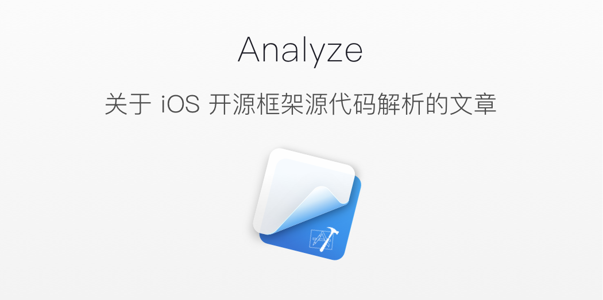

# Analyze

  
  <em>Banner designed by <a href="https://dribbble.com/levine" alt="iOS Source code analyze">Levine</a></em>

## 为什么要建这个仓库

欢迎使用 RSS 订阅我的博客 [点击订阅](http://draveness.me/feed.xml)

世人都说阅读开源框架的源代码对于功力有显著的提升，所以我也尝试阅读开源框架的源代码，并对其内容进行详细地分析和理解。在这里将自己阅读开源框架源代码的心得记录下来，希望能对各位开发者有所帮助。我会不断更新这个仓库中的文章，如果想要关注可以点 `star`。

## 目录

Latest：

+ [谈谈 MVX 中的 Model](contents/architecture/mvx-model.md)
+ [谈谈 MVX 中的 View](contents/architecture/mvx-view.md) 
+ [谈谈 MVX 中的 Controller](contents/architecture/mvx-controller.md)
+ [浅谈 MVC、MVP 和 MVVM 架构模式](contents/architecture/mvx.md)

| Project | Version | Article |
|:-------:|:-------:|:------|
| Architecture | | [谈谈 MVX 中的 Model](contents/architecture/mvx-model.md)   [谈谈 MVX 中的 View](contents/architecture/mvx-view.md)   [谈谈 MVX 中的 Controller](contents/architecture/mvx-controller.md)   [浅谈 MVC、MVP 和 MVVM 架构模式](contents/architecture/mvx.md) |
| ReactiveObjC | 2.1.2 | [『状态』驱动的世界：ReactiveCocoa](contents/ReactiveObjC/RACSignal.md)   [Pull-Driven 的数据流 RACSequence](contents/ReactiveObjC/RACSequence.md)  [『可变』的热信号 RACSubject](contents/ReactiveObjC/RACSubject.md)   [优雅的 RACCommand](contents/ReactiveObjC/RACCommand.md)   [用于多播的 RACMulticastConnection](contents/ReactiveObjC/RACMulticastConnection.md)   [RAC 中的双向数据绑定 RACChannel](contents/ReactiveObjC/RACChannel.md)   [理解 RACScheduler 的实现](contents/ReactiveObjC/RACScheduler.md)   [从代理到 RACSignal](contents/ReactiveObjC/RACDelegateProxy.md)|
|  ObjC   |         | [从 NSObject 的初始化了解 isa](contents/objc/从%20NSObject%20的初始化了解%20isa.md)   [深入解析 ObjC 中方法的结构](contents/objc/深入解析%20ObjC%20中方法的结构.md)   [从源代码看 ObjC 中消息的发送](contents/objc/从源代码看%20ObjC%20中消息的发送.md)   [你真的了解 load 方法么？](contents/objc/你真的了解%20load%20方法么？.md)   [上古时代 Objective-C 中哈希表的实现](contents/objc/上古时代%20Objective-C%20中哈希表的实现.md)   [自动释放池的前世今生](contents/objc/自动释放池的前世今生.md) [黑箱中的 retain 和 release](contents/objc/黑箱中的%20retain%20和%20release.md)   [关联对象 AssociatedObject 完全解析](contents/objc/关联对象%20AssociatedObject%20完全解析.md) [懒惰的 initialize 方法](contents/objc/懒惰的%20initialize%20方法.md) [对象是如何初始化的（iOS）](contents/objc/对象是如何初始化的（iOS）.md)|
| KVOController | 1.2.0 | [如何优雅地使用 KVO](contents/KVOController/KVOController.md) |
| AsyncDisplayKit | 1.9.81 | [提升 iOS 界面的渲染性能](contents/AsyncDisplayKit/提升%20iOS%20界面的渲染性能%20.md)  [从 Auto Layout 的布局算法谈性能](contents/AsyncDisplayKit/从%20Auto%20Layout%20的布局算法谈性能.md)  [预加载与智能预加载（iOS）](contents/AsyncDisplayKit/预加载与智能预加载（iOS）.md)|
| CocoaPods | 1.1.0 | [CocoaPods 都做了什么？](contents/CocoaPods/CocoaPods%20都做了什么？.md)   [谈谈 DSL 以及 DSL 的应用（以 CocoaPods 为例）](contents/CocoaPods/谈谈%20DSL%20以及%20DSL%20的应用（以%20CocoaPods%20为例）.md)|
| OHHTTPStubs | 5.1.0 | [iOS 开发中使用 NSURLProtocol 拦截 HTTP 请求](contents/OHHTTPStubs/iOS%20开发中使用%20NSURLProtocol%20拦截%20HTTP%20请求.md)   [如何进行 HTTP Mock（iOS）](contents/OHHTTPStubs/如何进行%20HTTP%20Mock（iOS）.md) |
| ProtocolKit | | [如何在 Objective-C 中实现协议扩展](contents/ProtocolKit/如何在%20Objective-C%20中实现协议扩展.md) |
| FBRetainCycleDetector | 0.1.2 | [如何在 iOS 中解决循环引用的问题](contents/FBRetainCycleDetector/如何在%20iOS%20中解决循环引用的问题.md)  [检测 NSObject 对象持有的强指针](contents/FBRetainCycleDetector/检测%20NSObject%20对象持有的强指针.md)   [如何实现 iOS 中的 Associated Object](contents/FBRetainCycleDetector/如何实现%20iOS%20中的%20Associated%20Object.md) [iOS 中的 block 是如何持有对象的](contents/FBRetainCycleDetector/iOS%20中的%20block%20是如何持有对象的.md)|
| fishhook | 0.2 |[动态修改 C 语言函数的实现](contents/fishhook/动态修改%20C%20语言函数的实现.md) |
| libextobjc |  |[如何在 Objective-C 的环境下实现 defer](contents/libextobjc/如何在%20Objective-C%20的环境下实现%20defer.md) |
| IQKeyboardManager | 4.0.3 |[『零行代码』解决键盘遮挡问题（iOS）](contents/IQKeyboardManager/『零行代码』解决键盘遮挡问题（iOS）.md) |
| DKNightVersion | 2.3.0 | [成熟的夜间模式解决方案](contents/DKNightVersion/成熟的夜间模式解决方案.md) |
| AFNetworking | 3.0.4 | [AFNetworking 概述（一）](contents/AFNetworking/AFNetworking%20概述（一）.md)   [AFNetworking 的核心 AFURLSessionManager（二）](contents/AFNetworking/AFNetworking%20的核心%20AFURLSessionManager（二）.md)   [处理请求和响应 AFURLSerialization（三）](contents/AFNetworking/处理请求和响应%20AFURLSerialization（三）.md)   [AFNetworkReachabilityManager 监控网络状态（四）](contents/AFNetworking/AFNetworkReachabilityManager%20监控网络状态（四）.md)  [验证 HTTPS 请求的证书（五）](contents/AFNetworking/验证%20HTTPS%20请求的证书（五）.md) |
| BlocksKit | 2.2.5 | [神奇的 BlocksKit（一）遍历、KVO 和分类](contents/BlocksKit/神奇的%20BlocksKit%20（一）.md)   [神奇的 BlocksKit（二）动态代理的实现 ](contents/BlocksKit/神奇的%20BlocksKit%20（二）.md) |
| Alamofire |   | [iOS 源代码分析 --- Alamofire](contents/Alamofire/iOS%20源代码分析%20----%20Alamofire.md) |
| SDWebImage |   | [iOS 源代码分析 --- SDWebImage](contents/SDWebImage/iOS%20源代码分析%20---%20SDWebImage.md) |
| MBProgressHUD |   | [iOS 源代码分析 --- MBProgressHUD](contents/MBProgressHUD/iOS%20源代码分析%20---%20MBProgressHUD.md) |
| Masonry |   | [iOS 源代码分析 --- Masonry](contents/Masonry/iOS%20源代码分析%20---%20Masonry.md) |
| Redis | 3.2.5  | [Redis 和 I/O 多路复用](contents/Redis/redis-io-multiplexing.md)   [Redis 中的事件循环](contents/Redis/redis-eventloop.md)    [Redis 是如何处理命令的（客户端）](contents/Redis/redis-cli)|

## 勘误

+ 如果在文章中发现了问题，欢迎提交 PR 或者 issue

## 转载

 本作品由 <a xmlns:cc="http://creativecommons.org/ns#" href="https://github.com/Draveness/iOS-Source-Code-Analyze" property="cc:attributionName" rel="cc:attributionURL">Draveness</a> 创作，采用<a rel="license" href="http://creativecommons.org/licenses/by/4.0/">知识共享署名 4.0 国际许可协议</a>进行许可。

