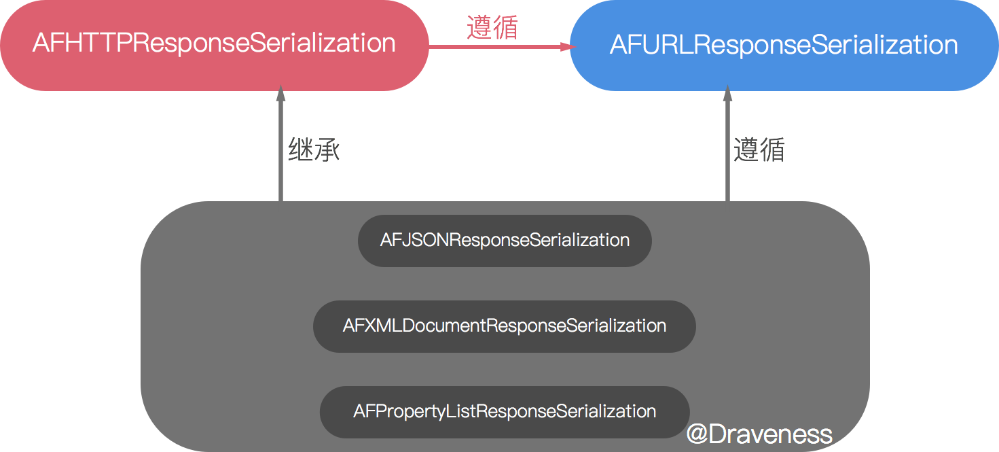

# 处理请求和响应 AFURLSerialization（三）

Blog: [Draveness](http://draveness.me)

<iframe src="http://ghbtns.com/github-btn.html?user=draveness&type=follow&size=large" height="30" width="240" frameborder="0" scrolling="0" style="width:240px; height: 30px;" allowTransparency="true"></iframe>

在前面两个部分已经分析过 `AFNetworking` 是对 `NSURLSession` 的封装，也了解了它是如何发出请求的，在这里我们**对发出请求以及接收响应的过程**进行序列化，这涉及到两个**模块**：

+ [AFURLResponseSerialization](#afurlresponseserialization)
+ [AFURLRequestSerialization](#afurlrequestserialization)

前者是处理响应的模块，将请求返回的数据解析成对应的格式。而后者的主要作用是修改请求（主要是 HTTP 请求）的头部，提供了一些语义明确的接口设置 HTTP 头部字段。

我们首先会对 `AFURLResponseSerialization` 进行简单的介绍，因为这个模块使用在 `AFURLSessionManager` 也就是核心类中，而后者 `AFURLRequestSerialization` 主要用于 `AFHTTPSessionManager` 中，因为它主要用于**修改 HTTP 头部**。

## AFURLResponseSerialization

其实在整个 `AFNetworking` 项目中并不存在 `AFURLResponseSerialization` 这个类，这只是一个协议，**遵循这个协议的类会将数据解码成更有意义的表现形式**。

协议的内容也非常简单，只有一个必须实现的方法。

```objectivec
@protocol AFURLResponseSerialization <NSObject, NSSecureCoding, NSCopying>

- (nullable id)responseObjectForResponse:(nullable NSURLResponse *)response
                           data:(nullable NSData *)data
                          error:(NSError * _Nullable __autoreleasing *)error NS_SWIFT_NOTHROW;

@end
```

遵循这个协议的类同时也要遵循 NSObject、NSSecureCoding 和 NSCopying 这三个协议，实现安全编码、拷贝以及 Objective-C 对象的基本行为。

仅看 `AFURLResponseSerialization` 协议对类的要求还是十分的简单，返回**对特定响应的数据解码后的对象**.

在具体了解模块中类的实现之前，先看一下这个小模块的结构：



+ 模块中的所有类都遵循 `AFURLResponseSerialization` 协议
+ `AFHTTPResponseSerializer` 为模块中最终要的根类

### AFHTTPResponseSerializer

下面我们对模块中最重要的根类的实现进行分析，也就是 `AFHTTPResponseSerializer`。它是在 `AFURLResponseSerialization` 模块中最基本的类（因为 `AFURLResponseSerialization` 只是一个协议）

#### 初始化

首先是这个类的实例化方法：

```objectivec
+ (instancetype)serializer {
    return [[self alloc] init];
}

- (instancetype)init {
    self = [super init];
    if (!self) {
        return nil;
    }

    self.stringEncoding = NSUTF8StringEncoding;

    self.acceptableStatusCodes = [NSIndexSet indexSetWithIndexesInRange:NSMakeRange(200, 100)];
    self.acceptableContentTypes = nil;

    return self;
}
```

因为是对 HTTP 响应进行序列化，所以这里设置了 `stringEncoding` 为 `NSUTF8StringEncoding` 而且没有对接收的内容类型加以限制。

将 `acceptableStatusCodes` 设置为从 200 到 299 之间的状态码, 因为只有这些状态码表示**获得了有效的响应**。

#### 验证响应的有效性

`AFHTTPResponseSerializer` 中方法的实现最长，并且最重要的就是 `- [AFHTTPResponseSerializer validateResponse:data:error:]` 

```objectivec
- (BOOL)validateResponse:(NSHTTPURLResponse *)response
                    data:(NSData *)data
                   error:(NSError * __autoreleasing *)error
{
    BOOL responseIsValid = YES;
    NSError *validationError = nil;

    if (response && [response isKindOfClass:[NSHTTPURLResponse class]]) {
        if (self.acceptableContentTypes && ![self.acceptableContentTypes containsObject:[response MIMEType]]) {
			#1: 返回内容类型无效
        }

        if (self.acceptableStatusCodes && ![self.acceptableStatusCodes containsIndex:(NSUInteger)response.statusCode] && [response URL]) {
			#2: 返回状态码无效
        }
    }

    if (error && !responseIsValid) {
        *error = validationError;
    }

    return responseIsValid;
}
```

这个方法根据在初始化方法中初始化的属性 `acceptableContentTypes` 和 `acceptableStatusCodes` 来判断当前响应是否有效。

```objectivec
if ([data length] > 0 && [response URL]) {
    NSMutableDictionary *mutableUserInfo = [@{
                                              NSLocalizedDescriptionKey: [NSString stringWithFormat:NSLocalizedStringFromTable(@"Request failed: unacceptable content-type: %@", @"AFNetworking", nil), [response MIMEType]],
                                              NSURLErrorFailingURLErrorKey:[response URL],
                                              AFNetworkingOperationFailingURLResponseErrorKey: response,
                                            } mutableCopy];
    if (data) {
        mutableUserInfo[AFNetworkingOperationFailingURLResponseDataErrorKey] = data;
    }

    validationError = AFErrorWithUnderlyingError([NSError errorWithDomain:AFURLResponseSerializationErrorDomain code:NSURLErrorCannotDecodeContentData userInfo:mutableUserInfo], validationError);
}

responseIsValid = NO;
```

其中第一、二部分的代码非常相似，出现错误时通过 `AFErrorWithUnderlyingError` 生成格式化之后的错误，最后设置 `responseIsValid`。


```objectivec
NSMutableDictionary *mutableUserInfo = [@{
                                   NSLocalizedDescriptionKey: [NSString stringWithFormat:NSLocalizedStringFromTable(@"Request failed: %@ (%ld)", @"AFNetworking", nil), [NSHTTPURLResponse localizedStringForStatusCode:response.statusCode], (long)response.statusCode],
                                   NSURLErrorFailingURLErrorKey:[response URL],
                                   AFNetworkingOperationFailingURLResponseErrorKey: response,
                           } mutableCopy];

if (data) {
    mutableUserInfo[AFNetworkingOperationFailingURLResponseDataErrorKey] = data;
}

validationError = AFErrorWithUnderlyingError([NSError errorWithDomain:AFURLResponseSerializationErrorDomain code:NSURLErrorBadServerResponse userInfo:mutableUserInfo], validationError);

responseIsValid = NO;
```

第二部分的代码就不说了，实现上都是差不多的。

#### 协议的实现

首先是对 `AFURLResponseSerialization` 协议的实现

```objectivec
- (id)responseObjectForResponse:(NSURLResponse *)response
                           data:(NSData *)data
                          error:(NSError *__autoreleasing *)error
{
    [self validateResponse:(NSHTTPURLResponse *)response data:data error:error];

    return data;
}
```

调用上面的方法对响应进行验证，然后返回数据，实在是没什么难度。

之后对 `NSSecureCoding` 还有 `NSCopying` 协议的实现也都是大同小异，跟我们实现这些协议没什么区别，更没什么值得看的地方。

### AFJSONResponseSerializer

接下来，看一下 `AFJSONResponseSerializer` 这个继承自 `AFHTTPResponseSerializer` 类的实现。

初始化方法只是在调用父类的初始化方法之后更新了 `acceptableContentTypes` 属性：

```objectivec
- (instancetype)init {
    self = [super init];
    if (!self) {
        return nil;
    }

    self.acceptableContentTypes = [NSSet setWithObjects:@"application/json", @"text/json", @"text/javascript", nil];

    return self;
}
```

#### 协议的实现

这个类中与父类差别最大的就是对 `AFURLResponseSerialization` 协议的实现。

```objectivec
- (id)responseObjectForResponse:(NSURLResponse *)response
                           data:(NSData *)data
                          error:(NSError *__autoreleasing *)error
{
	#1: 验证请求

	#2: 解决一个由只包含一个空格的响应引起的 bug, 略

	#3: 序列化 JSON
	
	#4: 移除 JSON 中的 null

    if (error) {
        *error = AFErrorWithUnderlyingError(serializationError, *error);
    }

    return responseObject;
}
```

1. 验证请求的有效性

	```objectivec
	NSStringEncoding stringEncoding = self.stringEncoding;
	if (response.textEncodingName) {
	    CFStringEncoding encoding = CFStringConvertIANACharSetNameToEncoding((CFStringRef)response.textEncodingName);
	    if (encoding != kCFStringEncodingInvalidId) {
	        stringEncoding = CFStringConvertEncodingToNSStringEncoding(encoding);
	    }
	}
	```

2. 解决一个空格引起的 [bug](https://github.com/rails/rails/issues/1742)
3. 序列化 JSON

	```objectivec
	id responseObject = nil;
	NSError *serializationError = nil;
	@autoreleasepool {
	    NSString *responseString = [[NSString alloc] initWithData:data encoding:stringEncoding];
	    if (responseString && ![responseString isEqualToString:@" "]) {
	        // Workaround for a bug in NSJSONSerialization when Unicode character escape codes are used instead of the actual character
	        // See http://stackoverflow.com/a/12843465/157142
	        data = [responseString dataUsingEncoding:NSUTF8StringEncoding];
	
	        if (data) {
	            if ([data length] > 0) {
	                responseObject = [NSJSONSerialization JSONObjectWithData:data options:self.readingOptions error:&serializationError];
	            } else {
	                return nil;
	            }
	        } else {
	            NSDictionary *userInfo = @{
	                                       NSLocalizedDescriptionKey: NSLocalizedStringFromTable(@"Data failed decoding as a UTF-8 string", @"AFNetworking", nil),
	                                       NSLocalizedFailureReasonErrorKey: [NSString stringWithFormat:NSLocalizedStringFromTable(@"Could not decode string: %@", @"AFNetworking", nil), responseString]
	                                       };
	
	            serializationError = [NSError errorWithDomain:AFURLResponseSerializationErrorDomain code:NSURLErrorCannotDecodeContentData userInfo:userInfo];
	        }
	    }
	}
	```

4. 移除 JSON 中的 null

	```objectivec
	if (self.removesKeysWithNullValues && responseObject) {
	    responseObject = AFJSONObjectByRemovingKeysWithNullValues(responseObject, self.readingOptions);
	}
	``` 

其中移除 JSON 中 null 的函数 `AFJSONObjectByRemovingKeysWithNullValues` 是一个递归调用的函数：

```objectivec
static id AFJSONObjectByRemovingKeysWithNullValues(id JSONObject, NSJSONReadingOptions readingOptions) {
    if ([JSONObject isKindOfClass:[NSArray class]]) {
        NSMutableArray *mutableArray = [NSMutableArray arrayWithCapacity:[(NSArray *)JSONObject count]];
        for (id value in (NSArray *)JSONObject) {
            [mutableArray addObject:AFJSONObjectByRemovingKeysWithNullValues(value, readingOptions)];
        }

        return (readingOptions & NSJSONReadingMutableContainers) ? mutableArray : [NSArray arrayWithArray:mutableArray];
    } else if ([JSONObject isKindOfClass:[NSDictionary class]]) {
        NSMutableDictionary *mutableDictionary = [NSMutableDictionary dictionaryWithDictionary:JSONObject];
        for (id <NSCopying> key in [(NSDictionary *)JSONObject allKeys]) {
            id value = (NSDictionary *)JSONObject[key];
            if (!value || [value isEqual:[NSNull null]]) {
                [mutableDictionary removeObjectForKey:key];
            } else if ([value isKindOfClass:[NSArray class]] || [value isKindOfClass:[NSDictionary class]]) {
                mutableDictionary[key] = AFJSONObjectByRemovingKeysWithNullValues(value, readingOptions);
            }
        }

        return (readingOptions & NSJSONReadingMutableContainers) ? mutableDictionary : [NSDictionary dictionaryWithDictionary:mutableDictionary];
    }

    return JSONObject;
}
```

其中移除 `null` 靠的就是 `[mutableDictionary removeObjectForKey:key]` 这一行代码。

## AFURLRequestSerialization

`AFURLRequestSerialization` 的主要工作是对发出的 HTTP 请求进行处理，它有几部分的工作需要完成。

而这个文件中的大部分类都是为 `AFHTTPRequestSerializer` 服务的：

1. 处理查询的 URL 参数
2. 设置 HTTP 头部字段
3. 设置请求的属性
4. 分块上传

> 这篇文章不会对其中涉及分块上传的部分进行分析，因为其中涉及到了多个类的功能，比较复杂，如果有兴趣可以研究一下。

### 处理查询参数

处理查询参数这部分主要是通过 `AFQueryStringPair` 还有一些 C 函数来完成的，这个类有两个属性 `field` 和 `value` 对应 HTTP 请求的查询 URL 中的参数。

```objectivec
@interface AFQueryStringPair : NSObject
@property (readwrite, nonatomic, strong) id field;
@property (readwrite, nonatomic, strong) id value;

- (instancetype)initWithField:(id)field value:(id)value;

- (NSString *)URLEncodedStringValue;
@end
```

初始化方法也不必多看，其中的 `- [AFQueryStringPair URLEncodedStringValue]` 方法会返回 `key=value` 这种格式，同时使用 `AFPercentEscapedStringFromString` 函数来对 `field` 和 `value` 进行处理，将其中的 `:#[]@!$&'()*+,;=` 等字符转换为百分号表示的形式。

这一部分代码还负责返回查询参数，将 `AFQueryStringPair` 或者 `key` `value` 转换为以下这种形式：

```
username=dravenss&password=123456&hello[world]=helloworld
```

它的实现主要依赖于一个递归函数 `AFQueryStringPairsFromKeyAndValue`，如果当前的 `value` 是一个集合类型的话，那么它就会不断地递归调用自己。


```objectivec
NSArray * AFQueryStringPairsFromKeyAndValue(NSString *key, id value) {
    NSMutableArray *mutableQueryStringComponents = [NSMutableArray array];

    NSSortDescriptor *sortDescriptor = [NSSortDescriptor sortDescriptorWithKey:@"description" ascending:YES selector:@selector(compare:)];

    if ([value isKindOfClass:[NSDictionary class]]) {
        NSDictionary *dictionary = value;
        // Sort dictionary keys to ensure consistent ordering in query string, which is important when deserializing potentially ambiguous sequences, such as an array of dictionaries
        for (id nestedKey in [dictionary.allKeys sortedArrayUsingDescriptors:@[ sortDescriptor ]]) {
            id nestedValue = dictionary[nestedKey];
            if (nestedValue) {
                [mutableQueryStringComponents addObjectsFromArray:AFQueryStringPairsFromKeyAndValue((key ? [NSString stringWithFormat:@"%@[%@]", key, nestedKey] : nestedKey), nestedValue)];
            }
        }
    } else if ([value isKindOfClass:[NSArray class]]) {
        NSArray *array = value;
        for (id nestedValue in array) {
            [mutableQueryStringComponents addObjectsFromArray:AFQueryStringPairsFromKeyAndValue([NSString stringWithFormat:@"%@[]", key], nestedValue)];
        }
    } else if ([value isKindOfClass:[NSSet class]]) {
        NSSet *set = value;
        for (id obj in [set sortedArrayUsingDescriptors:@[ sortDescriptor ]]) {
            [mutableQueryStringComponents addObjectsFromArray:AFQueryStringPairsFromKeyAndValue(key, obj)];
        }
    } else {
        [mutableQueryStringComponents addObject:[[AFQueryStringPair alloc] initWithField:key value:value]];
    }

    return mutableQueryStringComponents;
}
```

最后返回一个数组

```objectivec
[
	username=draveness,
	password=123456,
	hello[world]=helloworld
]
```

得到这个数组之后就会调用 `AFQueryStringFromParameters` 使用 `&` 来拼接它们。

```objectivec
static NSString * AFQueryStringFromParameters(NSDictionary *parameters) {
    NSMutableArray *mutablePairs = [NSMutableArray array];
    for (AFQueryStringPair *pair in AFQueryStringPairsFromDictionary(parameters)) {
        [mutablePairs addObject:[pair URLEncodedStringValue]];
    }

    return [mutablePairs componentsJoinedByString:@"&"];
}
```

### 设置 HTTP 头部字段

`AFHTTPRequestSerializer` 在头文件中提供了一些属性方便我们设置 HTTP 头部字段。同时，在类的内部，它提供了 `- [AFHTTPRequestSerializer setValue:forHTTPHeaderField:]` 方法来设置 HTTP 头部，其实它的实现都是基于一个名为 `mutableHTTPRequestHeaders` 的属性的：

```objectivec
- (void)setValue:(NSString *)value
forHTTPHeaderField:(NSString *)field
{
	[self.mutableHTTPRequestHeaders setValue:value forKey:field];
}

- (NSString *)valueForHTTPHeaderField:(NSString *)field {
    return [self.mutableHTTPRequestHeaders valueForKey:field];
}
```

在设置 HTTP 头部字段时，都会存储到这个可变字典中。而当真正使用时，会用 `HTTPRequestHeaders` 这个方法，来获取对应版本的不可变字典。

```objectivec
- (NSDictionary *)HTTPRequestHeaders {
    return [NSDictionary dictionaryWithDictionary:self.mutableHTTPRequestHeaders];
}
```

到了这里，可以来分析一下，这个类是如何设置一些我们平时常用的头部字段的。首先是 `User-Agent`，在 `AFHTTPRequestSerializer` 刚刚初始化时，就会根据当前编译的平台生成一个 `userAgent` 字符串：

```objectivec
userAgent = [NSString stringWithFormat:@"%@/%@ (%@; iOS %@; Scale/%0.2f)", [[NSBundle mainBundle] infoDictionary][(__bridge NSString *)kCFBundleExecutableKey] ?: [[NSBundle mainBundle] infoDictionary][(__bridge NSString *)kCFBundleIdentifierKey], [[NSBundle mainBundle] infoDictionary][@"CFBundleShortVersionString"] ?: [[NSBundle mainBundle] infoDictionary][(__bridge NSString *)kCFBundleVersionKey], [[UIDevice currentDevice] model], [[UIDevice currentDevice] systemVersion], [[UIScreen mainScreen] scale]];

[self setValue:userAgent forHTTPHeaderField:@"User-Agent"];
```

设置验证字段时，可以使用 `- [AFHTTPRequestSerializer setAuthorizationHeaderFieldWithUsername:password:]` 方法

```objectivec
- (void)setAuthorizationHeaderFieldWithUsername:(NSString *)username
                                       password:(NSString *)password
{
    NSData *basicAuthCredentials = [[NSString stringWithFormat:@"%@:%@", username, password] dataUsingEncoding:NSUTF8StringEncoding];
    NSString *base64AuthCredentials = [basicAuthCredentials base64EncodedStringWithOptions:(NSDataBase64EncodingOptions)0];
    [self setValue:[NSString stringWithFormat:@"Basic %@", base64AuthCredentials] forHTTPHeaderField:@"Authorization"];
}
```

### 设置请求的属性

还有一写 `NSURLRequest` 的属性是通过另一种方式来设置的，AFNetworking 为这些功能提供了接口

```objectivec
@property (nonatomic, assign) BOOL allowsCellularAccess;

@property (nonatomic, assign) NSURLRequestCachePolicy cachePolicy;

@property (nonatomic, assign) BOOL HTTPShouldHandleCookies;

@property (nonatomic, assign) BOOL HTTPShouldUsePipelining;

@property (nonatomic, assign) NSURLRequestNetworkServiceType networkServiceType;

@property (nonatomic, assign) NSTimeInterval timeoutInterval;
```

它们都会通过 `AFHTTPRequestSerializerObservedKeyPaths` 的调用而返回。

```objectivec
static NSArray * AFHTTPRequestSerializerObservedKeyPaths() {
    static NSArray *_AFHTTPRequestSerializerObservedKeyPaths = nil;
    static dispatch_once_t onceToken;
    dispatch_once(&onceToken, ^{
        _AFHTTPRequestSerializerObservedKeyPaths = @[NSStringFromSelector(@selector(allowsCellularAccess)), NSStringFromSelector(@selector(cachePolicy)), NSStringFromSelector(@selector(HTTPShouldHandleCookies)), NSStringFromSelector(@selector(HTTPShouldUsePipelining)), NSStringFromSelector(@selector(networkServiceType)), NSStringFromSelector(@selector(timeoutInterval))];
    });

    return _AFHTTPRequestSerializerObservedKeyPaths;
}
```

在这些属性被设置时，会触发 KVO，然后将新的属性存储在一个名为 `mutableObservedChangedKeyPaths` 的字典中：

```objectivec
- (void)observeValueForKeyPath:(NSString *)keyPath
                      ofObject:(__unused id)object
                        change:(NSDictionary *)change
                       context:(void *)context
{
    if (context == AFHTTPRequestSerializerObserverContext) {
        if ([change[NSKeyValueChangeNewKey] isEqual:[NSNull null]]) {
            [self.mutableObservedChangedKeyPaths removeObject:keyPath];
        } else {
            [self.mutableObservedChangedKeyPaths addObject:keyPath];
        }
    }
}
```

然后会在生成 `NSURLRequest` 的时候设置这些属性。

```objectivec
NSMutableURLRequest *mutableRequest = [[NSMutableURLRequest alloc] initWithURL:url];
mutableRequest.HTTPMethod = method;

for (NSString *keyPath in AFHTTPRequestSerializerObservedKeyPaths()) {
    if ([self.mutableObservedChangedKeyPaths containsObject:keyPath]) {
        [mutableRequest setValue:[self valueForKeyPath:keyPath] forKey:keyPath];
    }
}
```

关于这个方法的的具体实现会在下一节中介绍。

### 工作流程

`AFHTTPRequestSerializer` 会在 `AHHTTPSessionManager` 初始化时一并初始化，这时它会根据当前系统环境预设置一些 HTTP 头部字段 `Accept-Language` `User-Agent`。

```objectivec
- (instancetype)init {
    self = [super init];
    if (!self) {
        return nil;
    }

    self.stringEncoding = NSUTF8StringEncoding;

    self.mutableHTTPRequestHeaders = [NSMutableDictionary dictionary];


	#1: 设置接收语言，用户代理，略

    // HTTP Method Definitions; see http://www.w3.org/Protocols/rfc2616/rfc2616-sec9.html
    self.HTTPMethodsEncodingParametersInURI = [NSSet setWithObjects:@"GET", @"HEAD", @"DELETE", nil];

    self.mutableObservedChangedKeyPaths = [NSMutableSet set];
    for (NSString *keyPath in AFHTTPRequestSerializerObservedKeyPaths()) {
        if ([self respondsToSelector:NSSelectorFromString(keyPath)]) {
            [self addObserver:self forKeyPath:keyPath options:NSKeyValueObservingOptionNew context:AFHTTPRequestSerializerObserverContext];
        }
    }

    return self;
}
```

同时它还对一些属性进行 KVO，确保它们在改变后更新 `NSMutableURLRequest` 中对应的属性。

在初始化之后，如果调用了 `- [AFHTTPSessionManager dataTaskWithHTTPMethod:URLString:parameters:uploadProgress:downloadProgress:success:failure:]`，就会进入 `AFHTTPRequestSerializer` 的这一方法：

```objectivec

- (NSMutableURLRequest *)requestWithMethod:(NSString *)method
                                 URLString:(NSString *)URLString
                                parameters:(id)parameters
                                     error:(NSError *__autoreleasing *)error
{
    NSParameterAssert(method);
    NSParameterAssert(URLString);

    NSURL *url = [NSURL URLWithString:URLString];

    NSParameterAssert(url);

    NSMutableURLRequest *mutableRequest = [[NSMutableURLRequest alloc] initWithURL:url];
    mutableRequest.HTTPMethod = method;

    for (NSString *keyPath in AFHTTPRequestSerializerObservedKeyPaths()) {
        if ([self.mutableObservedChangedKeyPaths containsObject:keyPath]) {
            [mutableRequest setValue:[self valueForKeyPath:keyPath] forKey:keyPath];
        }
    }

    mutableRequest = [[self requestBySerializingRequest:mutableRequest withParameters:parameters error:error] mutableCopy];

	return mutableRequest;
}
```

1. 对参数进行检查
2. 设置 HTTP 方法

	```objectivec
	mutableRequest.HTTPMethod = method;
	```

3. 通过 `mutableObservedChangedKeyPaths` 字典设置 `NSMutableURLRequest` 的属性

	```objectivec
	for (NSString *keyPath in AFHTTPRequestSerializerObservedKeyPaths()) {
	    if ([self.mutableObservedChangedKeyPaths containsObject:keyPath]) {
	        [mutableRequest setValue:[self valueForKeyPath:keyPath] forKey:keyPath];
	    }
	}
	```

4. 调用 `- [AFHTTPRequestSerializer  requestBySerializingRequest:withParameters:error:]` **设置 HTTP 头部字段和查询参数**。

`- [AFHTTPRequestSerializer  requestBySerializingRequest:withParameters:error:]` 方法主要做了两件事情

```objectivec
- (NSURLRequest *)requestBySerializingRequest:(NSURLRequest *)request
                               withParameters:(id)parameters
                                        error:(NSError *__autoreleasing *)error
{
    NSParameterAssert(request);

    NSMutableURLRequest *mutableRequest = [request mutableCopy];

    [self.HTTPRequestHeaders enumerateKeysAndObjectsUsingBlock:^(id field, id value, BOOL * __unused stop) {
        if (![request valueForHTTPHeaderField:field]) {
            [mutableRequest setValue:value forHTTPHeaderField:field];
        }
    }];

    NSString *query = nil;
    if (parameters) {
        if (self.queryStringSerialization) {
            NSError *serializationError;
            query = self.queryStringSerialization(request, parameters, &serializationError);

            if (serializationError) {
                if (error) {
                    *error = serializationError;
                }

                return nil;
            }
        } else {
            switch (self.queryStringSerializationStyle) {
                case AFHTTPRequestQueryStringDefaultStyle:
                    query = AFQueryStringFromParameters(parameters);
                    break;
            }
        }
    }

    if ([self.HTTPMethodsEncodingParametersInURI containsObject:[[request HTTPMethod] uppercaseString]]) {
        if (query) {
            mutableRequest.URL = [NSURL URLWithString:[[mutableRequest.URL absoluteString] stringByAppendingFormat:mutableRequest.URL.query ? @"&%@" : @"?%@", query]];
        }
    } else {
        // #2864: an empty string is a valid x-www-form-urlencoded payload
        if (!query) {
            query = @"";
        }
        if (![mutableRequest valueForHTTPHeaderField:@"Content-Type"]) {
            [mutableRequest setValue:@"application/x-www-form-urlencoded" forHTTPHeaderField:@"Content-Type"];
        }
        [mutableRequest setHTTPBody:[query dataUsingEncoding:self.stringEncoding]];
    }

    return mutableRequest;
}
```

1. 通过 `HTTPRequestHeaders` 字典设置头部字段

	```objectivec
	[self.HTTPRequestHeaders enumerateKeysAndObjectsUsingBlock:^(id field, id value, BOOL * __unused stop) {
	    if (![request valueForHTTPHeaderField:field]) {
	        [mutableRequest setValue:value forHTTPHeaderField:field];
	    }
	}];
	```

2. 调用 `AFQueryStringFromParameters` 将参数转换为查询参数

	```objectivec
	query = AFQueryStringFromParameters(parameters);
	```

2. 将 parameters 添加到 URL 或者 HTTP body 中

	```objectivec
	if ([self.HTTPMethodsEncodingParametersInURI containsObject:[[request HTTPMethod] uppercaseString]]) {
	    if (query) {
	        mutableRequest.URL = [NSURL URLWithString:[[mutableRequest.URL absoluteString] stringByAppendingFormat:mutableRequest.URL.query ? @"&%@" : @"?%@", query]];
	    }
	} else {
	    // #2864: an empty string is a valid x-www-form-urlencoded payload
	    if (!query) {
	        query = @"";
	    }
	    if (![mutableRequest valueForHTTPHeaderField:@"Content-Type"]) {
	        [mutableRequest setValue:@"application/x-www-form-urlencoded" forHTTPHeaderField:@"Content-Type"];
	    }
	    [mutableRequest setHTTPBody:[query dataUsingEncoding:self.stringEncoding]];
	}
	```

	+ 如果 HTTP 方法为 `GET` `HEAD` 或者 `DELETE`，也就是在初始化方法中设置的，那么参数会追加到 URL 后面。否则会被放入 HTTP body 中。
4. 最后这个方法会返回一个 `NSMutableURLRequest`

## 小结

1. `AFURLResponseSerialization` 负责对返回的数据进行序列化
2. `AFURLRequestSerialization` 负责生成 `NSMutableURLRequest`，为请求设置 HTTP 头部，管理发出的请求

## 相关文章

关于其他 AFNetworking 源代码分析的其他文章：

+ [AFNetworking 概述（一）](https://github.com/Draveness/iOS-Source-Code-Analyze/blob/master/contents/AFNetworking/AFNetworking%20概述（一）.md)
+ [AFNetworking 的核心 AFURLSessionManager（二）](https://github.com/Draveness/iOS-Source-Code-Analyze/blob/master/contents/AFNetworking/AFNetworking%20的核心%20AFURLSessionManager（二）.md)
+ [处理请求和响应 AFURLSerialization（三）](https://github.com/Draveness/iOS-Source-Code-Analyze/blob/master/contents/AFNetworking/处理请求和响应%20AFURLSerialization（三）.md)
+ [AFNetworkReachabilityManager 监控网络状态（四）](https://github.com/Draveness/iOS-Source-Code-Analyze/blob/master/contents/AFNetworking/AFNetworkReachabilityManager%20监控网络状态（四）.md)
+ [验证 HTTPS 请求的证书（五）](https://github.com/Draveness/iOS-Source-Code-Analyze/blob/master/contents/AFNetworking/验证%20HTTPS%20请求的证书（五）.md)

<iframe src="http://ghbtns.com/github-btn.html?user=draveness&type=follow&size=large" height="30" width="240" frameborder="0" scrolling="0" style="width:240px; height: 30px;" allowTransparency="true"></iframe>

Follow: [@Draveness](https://github.com/Draveness)


