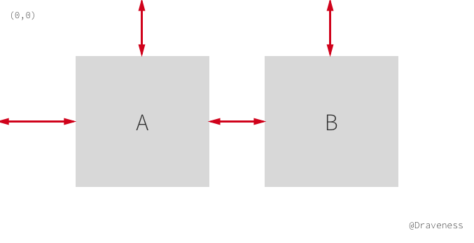
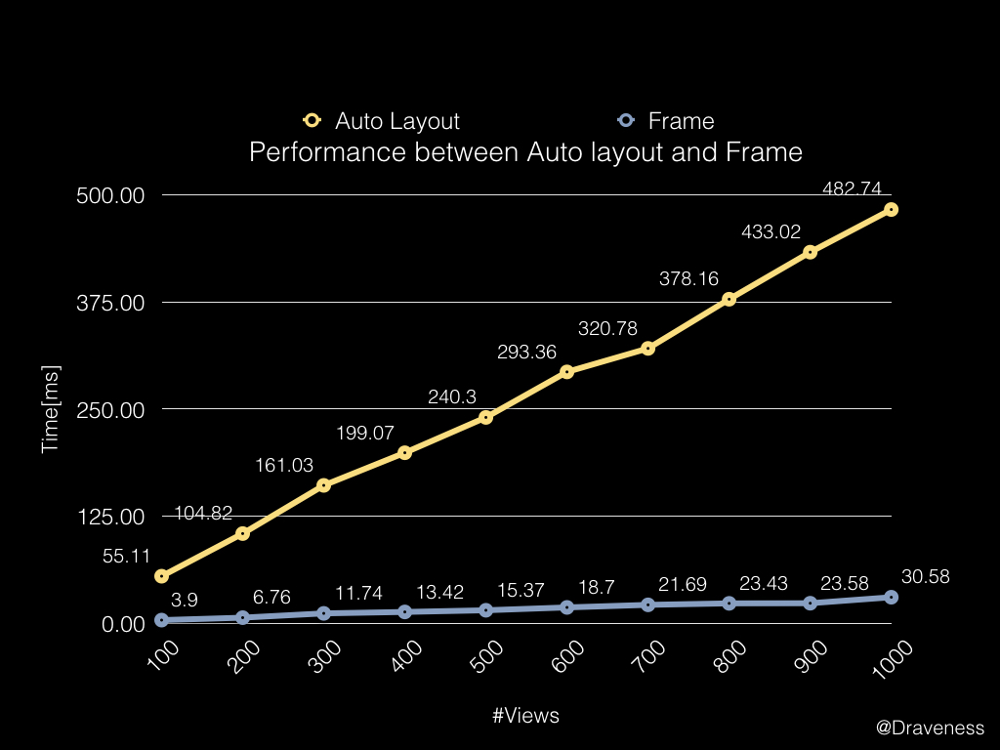
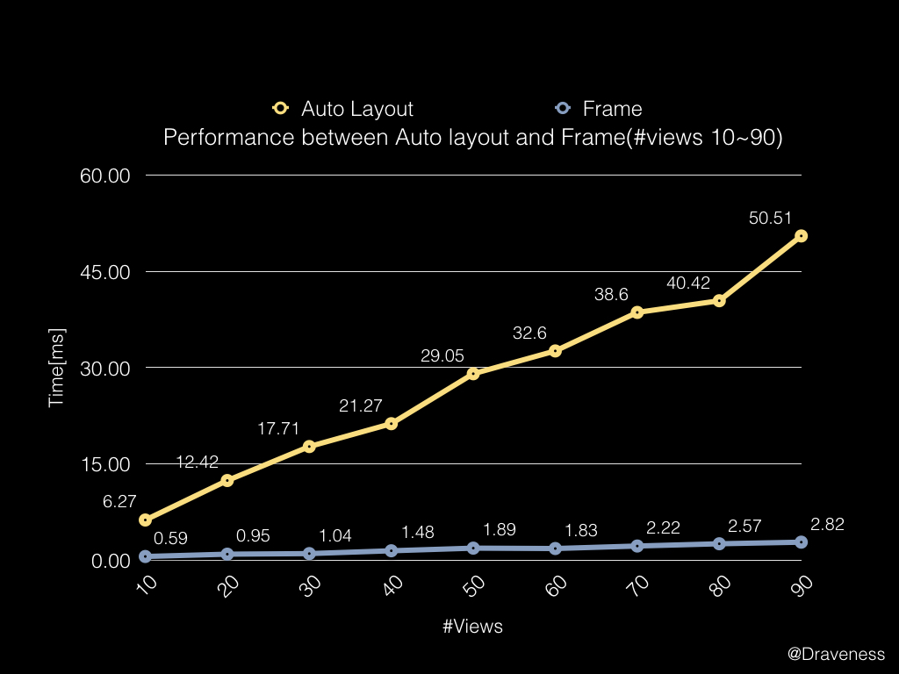
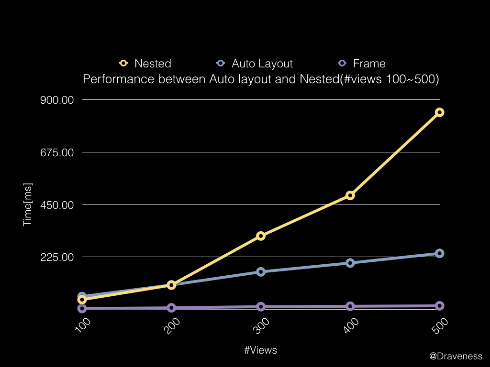
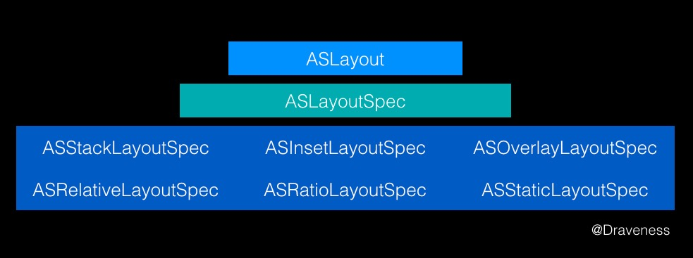
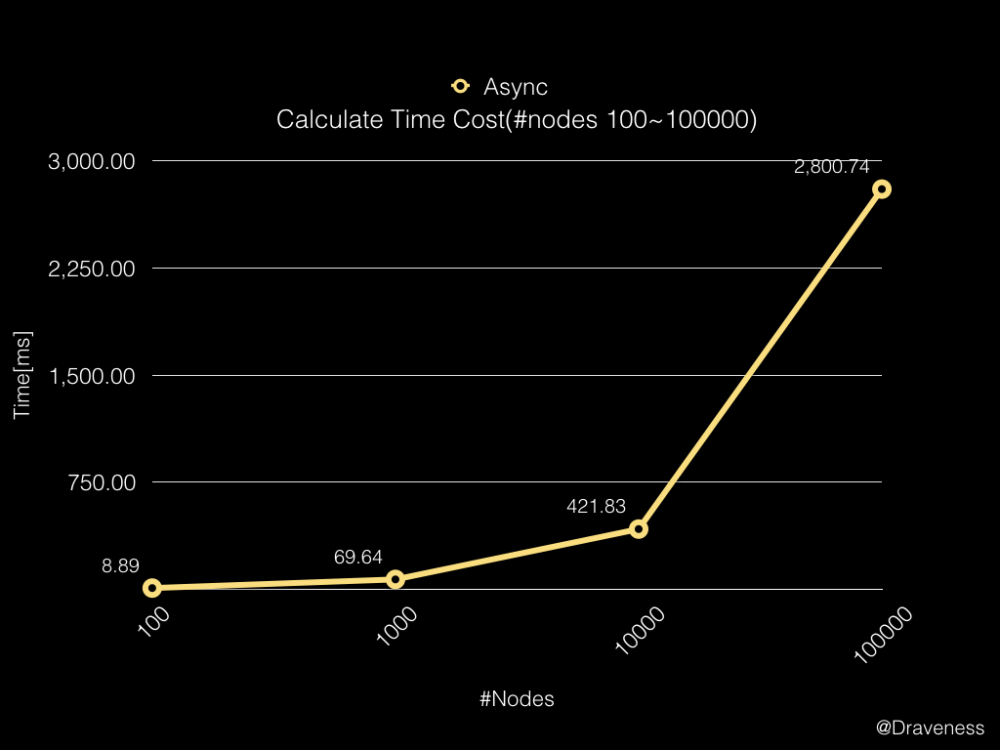

# 从 Auto Layout 的布局算法谈性能

> 这是使用 ASDK 性能调优系列的第二篇文章，前一篇文章中讲到了如何提升 iOS 应用的渲染性能，你可以点击 [这里](https://github.com/Draveness/iOS-Source-Code-Analyze/blob/master/contents/AsyncDisplayKit/提升%20iOS%20界面的渲染性能.md) 了解这部分的内容。

在上一篇文章中，我们提到了 iOS 界面的渲染过程以及如何对渲染过程进行优化。ASDK 的做法是将渲染绘制的工作抛到后台线程进行，并在每次 Runloop 结束时，将绘制结果交给 `CALayer` 进行展示。

而这篇文章就要从 iOS 中影响性能的另一大杀手，也就是万恶之源 Auto Layout（自动布局）来分析如何对 iOS 应用的性能进行优化以及 Auto Layout 到底为什么会影响性能？


## 把 Auto Layout 批判一番

由于在 2012 年苹果发布了 4.0 寸的 iPhone5，在 iOS 平台上出现了不同尺寸的移动设备，使得原有的 `frame` 布局方式无法很好地适配不同尺寸的屏幕，所以，为了解决这一问题 Auto Layout 就诞生了。

Auto Layout 的诞生并没有如同苹果的其它框架一样收到开发者的好评，它自诞生的第一天起就饱受 iOS 开发者的批评，其蹩脚、冗长的语法使得它在刚刚面世就被无数开发者吐槽，写了几个屏幕的代码都不能完成一个简单的布局，哪怕是 VFL（Visual Format Language）也拯救不了它。

真正使 Auto Layout 大规模投入使用的应该还是 [Masonry](https://github.com/SnapKit/Masonry)，它使用了链式的语法对 Auto Layout 进行了很好的封装，使得 Auto Layout 更加简单易用；时至今日，开发者也在日常使用中发现了 Masonry 的各种问题，于是出现了各种各样的布局框架，不过这都是后话了。


## Auto Layout 的原理和 Cassowary

Auto Layout 的原理其实非常简单，在这里通过一个例子先简单的解释一下：



iOS 中视图所需要的布局信息只有两个，分别是 `origin/center` 和 `size`，在这里我们以 `origin & size` 为例，也就是 `frame` 时代下布局的需要的两个信息；这两个信息由四部分组成：

+ `x` & `y`
+ `width` & `height`

以左上角的 `(0, 0)` 为坐标的原点，找到坐标 `(x, y)`，然后绘制一个大小为 `(width, height)` 的矩形，这样就完成了一个最简单的布局。而 Auto Layout 的布局方式与上面所说的 `frame` 有些不同，`frame` 的原理是与父视图之间的绝对距离，但是 Auto Layout 中大部分的约束都是**描述性的**，表示视图间相对距离，以上图为例：

```objectivec
A.left = Superview.left + 50
A.top  = Superview.top + 30
A.width  = 100
A.height = 100

B.left = (A.left + A.width)/(A.right) + 30
B.top  = A.top
B.width  = A.width
B.height = A.height
```

虽然上面的约束很好的表示了各个视图之间的关系，但是 Auto Layout 实际上并没有改变原有的 Hard-Coded 形式的布局方式，只是将原有没有太多意义的 `(x, y)` 值，变成了描述性的代码。

我们仍然需要知道布局信息所需要的四部分 `x`、`y`、`width` 以及 `height`。换句话说，我们要求解上述的**八元一次**方程组，将每个视图所需要的信息解出来；Cocoa 会在运行时求解上述的方程组，最终使用 `frame` 来绘制视图。


### Cassowary 算法

在上世纪 90 年代，一个名叫 [Cassowary](https://en.wikipedia.org/wiki/Cassowary_(software)) 的布局算法解决了用户界面的布局问题，它通过将布局问题抽象成线性等式和不等式约束来进行求解。

Auto Layout 其实就是对 Cassowary 算法的一种实现，但是这里并不会对它展开介绍，有兴趣的读者可以在文章最后的 Reference 中了解一下 Cassowary 算法相关的文章。

> Auto Layout 的原理就是对**线性方程组或者不等式**的求解。

## Auto Layout 的性能

在使用 Auto Layout 进行布局时，可以指定一系列的约束，比如视图的高度、宽度等等。而每一个约束其实都是一个简单的线性等式或不等式，整个界面上的所有约束在一起就**明确地（没有冲突）**定义了整个系统的布局。

> 在涉及冲突发生时，Auto Layout 会尝试 break 一些优先级低的约束，尽量满足最多并且优先级最高的约束。

因为布局系统在最后仍然需要通过 `frame` 来进行，所以 Auto Layout 虽然为开发者在描述布局时带来了一些好处，不过它相比原有的布局系统加入了从约束计算 `frame` 的过程，而在这里，我们需要了解 Auto Layout 的布局性能如何。


因为使用 Cassowary 算法解决约束问题就是对线性等式或不等式求解，所以其时间复杂度就是**多项式时间**的，不难推测出，在处理极其复杂的 UI 界面时，会造成性能上的巨大损失。

在这里我们会对 Auto Layout 的性能进行测试，为了更明显的展示  Auto Layout 的性能，我们通过 `frame` 的性能建立一条基准线**以消除对象的创建和销毁、视图的渲染、视图层级的改变带来的影响**。

> 你可以在 [这里](https://github.com/Draveness/iOS-Source-Code-Analyze/tree/master/contents/AsyncDisplayKit/Layout) 找到这次对 Layout 性能测量使用的代码。

代码分别使用 Auto Layout 和 `frame` 对 N 个视图进行布局，测算其运行时间。

使用 AutoLayout 时，每个视图会随机选择两个视图对它的 `top` 和 `left` 进行约束，随机生成一个数字作为 `offset`；同时，还会用几个优先级高的约束保证视图的布局不会超出整个 `keyWindow`。

而下图就是对 100~1000 个视图布局所需要的时间的折线图。

> 这里的数据是在 OS X EL Captain，Macbook Air (13-inch Mid 2013）上的 iPhone 6s Plus 模拟器上采集的， Xcode 版本为 7.3.1。在其他设备上可能不会获得一致的信息，由于笔者的 iPhone 升级到了 iOS 10，所以没有办法真机测试，最后的结果可能会有一定的偏差。



从图中可以看到，使用 Auto Layout 进行布局的时间会是只使用 `frame` 的 **16 倍**左右，虽然这里的测试结果可能**受外界条件影响差异**比较大，不过 Auto Layout 的性能相比 `frame` 确实差很多，如果去掉设置 `frame` 的过程消耗的时间，Auto Layout 过程进行的计算量也是非常巨大的。

在上一篇文章中，我们曾经提到，想要让 iOS 应用的视图保持 60 FPS 的刷新频率，我们必须在 **1/60 = 16.67 ms** 之内完成包括布局、绘制以及渲染等操作。

也就是说如果当前界面上的视图大于 100 的话，使用 Auto Layout 是很难达到绝对流畅的要求的；而在使用 `frame` 时，同一个界面下哪怕有 500 个视图，也是可以在 16.67 ms 之内完成布局的。不过在一般情况下，在 iOS 的整个 `UIWindow` 中也不会一次性出现如此多的视图。

我们更关心的是，在日常开发中难免会使用 Auto Layout 进行布局，既然有 16.67 ms 这个限制，那么在界面上出现了多少个视图时，我才需要考虑其它的布局方式呢？在这里，我们将需要布局的视图数量减少一个量级，重新绘制一个图表：



从图中可以看出，当对 **30 个左右视图**使用 Auto Layout 进行布局时，所需要的时间就会在 16.67 ms 左右，当然这里不排除一些其它因素的影响；到目前为止，会得出一个大致的结论，使用 Auto Layout 对复杂的 UI 界面进行布局时（大于 30 个视图）就会对性能有严重的影响（同时与设备有关，文章中不会考虑设备性能的差异性）。

上述对 Auto Layout 的使用还是比较简单的，而在日常使用中，使用嵌套的视图层级又非常正常。

> 在笔者对嵌套视图层级中使用 Auto Layout 进行布局时，当视图的数量超过了 500 时，模拟器直接就 crash 了，所以这里没有超过 500 个视图的数据。

我们对嵌套视图数量在 100~500 之间布局时间进行测量，并与 Auto Layout 进行比较：



在视图数量大于 200 之后，随着视图数量的增加，使用 Auto Layout 对嵌套视图进行布局的时间相比非嵌套的布局成倍增长。

虽然说 Auto Layout 为开发者在多尺寸布局上提供了遍历，而且**支持跨越视图层级**的约束，但是由于其实现原理导致其时间复杂度为**多项式时间**，其性能损耗是仅使用 `frame` 的十几倍，所以在处理庞大的 UI 界面时表现差强人意。

> 在三年以前，有一篇关于 Auto Layout 性能分析的文章，可以点击这里了解这篇文章的内容 [Auto Layout Performance on iOS](http://floriankugler.com/2013/04/22/auto-layout-performance-on-ios/)。

## ASDK 的布局引擎

Auto Layout 不止在复杂 UI 界面布局的表现不佳，它还会强制视图在主线程上布局；所以在 ASDK 中提供了另一种可以在后台线程中运行的布局引擎，它的结构大致是这样的：



`ASLayoutSpec` 与下面的所有的 Spec 类都是继承关系，在视图需要布局时，会调用 `ASLayoutSpec` 或者它的子类的 `- measureWithSizeRange:` 方法返回一个用于布局的对象 [ASLayout](#aslayout)。

> `ASLayoutable` 是 ASDK 中一个协议，遵循该协议的类实现了一系列的布局方法。

当我们使用 ASDK 布局时，需要做下面四件事情中的一件：

+ 提供 `layoutSpecBlock`
+ 覆写 `- layoutSpecThatFits:` 方法
+ 覆写 `- calculateSizeThatFits:` 方法
+ 覆写 `- calculateLayoutThatFits:` 方法

只有做上面四件事情中的其中一件才能对 ASDK 中的视图或者说结点进行布局。

方法 `- calculateSizeThatFits:` 提供了手动布局的方式，通过在该方法内对 `frame` 进行计算，返回一个当前视图的 `CGSize`。

而 `- layoutSpecThatFits:` 与 `layoutSpecBlock` 其实没什么不同，只是前者通过覆写方法返回 `ASLayoutSpec`；后者通过 block 的形式提供一种不需要子类化就可以完成布局的方法，两者可以看做是完全等价的。

`- calculateLayoutThatFits:` 方法有一些不同，它把上面的两种布局方式：手动布局和 Spec 布局封装成了一个接口，这样，无论是 `CGSize` 还是 `ASLayoutSpec` 最后都会以 `ASLayout` 的形式返回给方法调用者。

### 手动布局

这里简单介绍一下手动布局使用的 `-[ASDisplayNode calculatedSizeThatFits:]` 方法，这个方法与 `UIView` 中的 `-[UIView sizeThatFits:]` 非常相似，其区别只是在 ASDK 中，所有的计算出的大小都会通过缓存来提升性能。

```objectivec
- (CGSize)calculateSizeThatFits:(CGSize)constrainedSize {
  return _preferredFrameSize;
}
```

子类可以在这个方法中进行计算，通过覆写这个方法返回一个合适的大小，不过一般情况下都不会使用手动布局的方式。

### 使用 ASLayoutSpec 布局

在 ASDK 中，更加常用的是使用 `ASLayoutSpec` 布局，在上面提到的 `ASLayout` 是一个保存布局信息的媒介，而真正计算视图布局的代码都在 `ASLayoutSpec` 中；所有 ASDK 中的布局（手动 / Spec）都是由 `-[ASLayoutable measureWithSizeRange:]` 方法触发的，在这里我们以 `ASDisplayNode` 的调用栈为例看一下方法的执行过程：

```objectivec
-[ASDisplayNode measureWithSizeRange:]
	-[ASDisplayNode shouldMeasureWithSizeRange:]
	-[ASDisplayNode calculateLayoutThatFits:]
		-[ASDisplayNode layoutSpecThatFits:]
		-[ASLayoutSpec measureWithSizeRange:]
		+[ASLayout layoutWithLayoutableObject:constrainedSizeRange:size:sublayouts:]
		-[ASLayout filteredNodeLayoutTree]
```

ASDK 的文档中推荐在子类中覆写 `- layoutSpecThatFits:` 方法，返回一个用于布局的 `ASLayoutSpec` 对象，然后使用 `ASLayoutSpec` 中的 `- measureWithSizeRange:` 方法对它指定的视图进行布局，不过通过覆写 [ASDK 的布局引擎](#asdk-的布局引擎) 一节中的其它方法也都是可以的。

如果我们使用 `ASStackLayoutSpec` 对视图进行布局的话，方法调用栈大概是这样的：

```objectivec
-[ASDisplayNode measureWithSizeRange:]
	-[ASDisplayNode shouldMeasureWithSizeRange:]
	-[ASDisplayNode calculateLayoutThatFits:]
		-[ASDisplayNode layoutSpecThatFits:]
		-[ASStackLayoutSpec measureWithSizeRange:]
			ASStackUnpositionedLayout::compute
			ASStackPositionedLayout::compute			ASStackBaselinePositionedLayout::compute		+[ASLayout layoutWithLayoutableObject:constrainedSizeRange:size:sublayouts:]
		-[ASLayout filteredNodeLayoutTree]
```

这里只是执行了 `ASStackLayoutSpec` 对应的 `- measureWithSizeRange:` 方法，对其中的视图进行布局。在 `- measureWithSizeRange:` 中调用了一些 C++ 方法 `ASStackUnpositionedLayout`、`ASStackPositionedLayout` 以及 `ASStackBaselinePositionedLayout` 的 `compute` 方法，这些方法完成了对 `ASStackLayoutSpec` 中视图的布局。

相比于 Auto Layout，ASDK 实现了一种完全不同的布局方式；比较类似与前端开发中的 `Flexbox` 模型，而 ASDK 其实就实现了 `Flexbox` 的一个子集。

在 ASDK 1.0 时代，很多开发者都表示希望 ASDK 中加入 ComponentKit 的布局引擎；而现在，ASDK 布局引擎的大部分代码都是从 [ComponentKit](http://componentkit.org) 中移植过来的（ComponentKit 是另一个 Facebook 团队开发的用于布局的框架）。

#### ASLayout

`ASLayout` 表示当前的结点在布局树中的大小和位置；当然，它还有一些其它的奇怪的属性：

```objectivec
@interface ASLayout : NSObject

@property (nonatomic, weak, readonly) id<ASLayoutable> layoutableObject;
@property (nonatomic, readonly) CGSize size;
@property (nonatomic, readwrite) CGPoint position;
@property (nonatomic, readonly) NSArray<ASLayout *> *sublayouts;
@property (nonatomic, readonly) CGRect frame;

...

@end
```

代码中的 `layoutableObject` 表示当前的对象，`sublayouts` 表示当前视图的子布局 `ASLayout` 数组。

整个类的实现都没有什么值得多说的，除了大量的构造方法，唯一一个做了一些事情的就是 `-[ASLayout filteredNodeLayoutTree]` 方法了：

```objectivec
- (ASLayout *)filteredNodeLayoutTree {
  NSMutableArray *flattenedSublayouts = [NSMutableArray array];
  struct Context {
	ASLayout *layout;
	CGPoint absolutePosition;
  };
  std::queue<Context> queue;
  queue.push({self, CGPointMake(0, 0)});
  while (!queue.empty()) {
	Context context = queue.front();
	queue.pop();

	if (self != context.layout && context.layout.type == ASLayoutableTypeDisplayNode) {
	  ASLayout *layout = [ASLayout layoutWithLayout:context.layout position:context.absolutePosition];
	  layout.flattened = YES;
	  [flattenedSublayouts addObject:layout];
	}
	
	for (ASLayout *sublayout in context.layout.sublayouts) {
	  if (sublayout.isFlattened == NO) queue.push({sublayout, context.absolutePosition + sublayout.position});
  }

  return [ASLayout layoutWithLayoutableObject:_layoutableObject
						 constrainedSizeRange:_constrainedSizeRange
										 size:_size
								   sublayouts:flattenedSublayouts];
}
```

而这个方法也只是将 `sublayouts` 中的内容展平，然后实例化一个新的 `ASLayout` 对象。

#### ASLayoutSpec

`ASLayoutSpec` 的作用更像是一个抽象类，在真正使用 ASDK 的布局引擎时，都不会直接使用这个类，而是会用类似 `ASStackLayoutSpec`、`ASRelativeLayoutSpec`、`ASOverlayLayoutSpec` 以及 `ASRatioLayoutSpec` 等子类。

笔者不打算一行一行代码深入讲解其内容，简单介绍一下最重要的 `ASStackLayoutSpec`。


`ASStackLayoutSpec` 从 `Flexbox` 中获得了非常多的灵感，比如说 `justifyContent`、`alignItems` 等属性，它和苹果的 `UIStackView` 比较类似，不过底层并没有使用 Auto Layout 进行计算。如果没有接触过 `ASStackLayoutSpec` 的开发者，可以通过这个小游戏 [Foggy-ASDK-Layout](http://nguyenhuy.github.io/froggy-asdk-layout/) 快速学习 `ASStackLayoutSpec` 的使用。

### 关于缓存以及异步并发

因为计算视图的 `CGRect` 进行布局是一种非常昂贵的操作，所以 ASDK 在这里面加入了缓存机制，在每次执行 `- measureWithSizeRange:` 方法时，都会通过 `-shouldMeasureWithSizeRange:` 判断是否需要重新计算布局：

```objectivec
- (BOOL)shouldMeasureWithSizeRange:(ASSizeRange)constrainedSize {
  return [self _hasDirtyLayout] || !ASSizeRangeEqualToSizeRange(constrainedSize, _calculatedLayout.constrainedSizeRange);
}

- (BOOL)_hasDirtyLayout {
  return _calculatedLayout == nil || _calculatedLayout.isDirty;
}
```

在一般情况下，只有当前结点被标记为 `dirty` 或者这一次布局传入的 `constrainedSize` 不同时，才需要进行重新计算。在不需要重新计算布局的情况下，只需要直接返回 `_calculatedLayout` 布局对象就可以了。

因为 ASDK 实现的布局引擎其实只是对 `frame` 的计算，所以无论是在主线程还是后台的异步并发进程中都是可以执行的，也就是说，你可以在任意线程中调用 `- measureWithSizeRange:` 方法，ASDK 中的一些 `ViewController` 比如：`ASDataViewController` 就会在后台并发进程中执行该方法：

```objectivec
- (NSArray<ASCellNode *> *)_layoutNodesFromContexts:(NSArray<ASIndexedNodeContext *> *)contexts {
  ...

  dispatch_queue_t queue = dispatch_get_global_queue(DISPATCH_QUEUE_PRIORITY_DEFAULT, 0);
  dispatch_apply(nodeCount, queue, ^(size_t i) {
	ASIndexedNodeContext *context = contexts[i];
	ASCellNode *node = [context allocateNode];
	if (node == nil) node = [[ASCellNode alloc] init];

	CGRect frame = CGRectZero;
	frame.size = [node measureWithSizeRange:context.constrainedSize].size;
	node.frame = frame;

	[ASDataController _didLayoutNode];
  });

  ...

  return nodes;
}
```

> 上述代码做了比较大的修改，将原有一些方法调用放到了当前方法中，并省略了大量的代码。

### 关于性能的对比

由于 ASDK 的布局引擎的问题，其性能比较难以测试，在这里只对 ASDK 使用 `ASStackLayoutSpec` 的**布局计算时间**进行了测试，不包括视图的渲染以及其它时间：



测试结果表明 `ASStackLayoutSpec` 花费的布局时间与结点的数量成正比，哪怕计算 100 个视图的布局也只需要 **8.89 ms**，虽然这里没有包括视图的渲染时间，不过与 Auto Layout 相比性能还是有比较大的提升。

## 总结

其实 ASDK 的布局引擎大部分都是对 ComponentKit 的封装，不过由于摆脱了 Auto Layout 这一套低效但是通用的布局方式，ASDK 的布局计算不仅在后台并发线程中进行、而且通过引入 `Flexbox` 提升了布局的性能，但是 ASDK 的使用相对比较复杂，如果只想对布局性能进行优化，更推荐单独使用 ComponentKit 框架。

## References

+ [Cassowary, Cocoa Auto Layout, and enaml constraints](http://stacks.11craft.com/cassowary-cocoa-autolayout-and-enaml-constraints.html)
+ [Solving constraint systems](http://cassowary.readthedocs.io/en/latest/topics/theory.html)
+ [Auto Layout Performance on iOS](http://floriankugler.com/2013/04/22/auto-layout-performance-on-ios/)
+ [The Cassowary Linear Arithmetic Constraint Solving Algorithm: Interface and Implementation](https://constraints.cs.washington.edu/cassowary/cassowary-tr.pdf)
+ [The Cassowary Linear Arithmetic Constraint Solving Algorithm](http://constraints.cs.washington.edu/solvers/cassowary-tochi.pdf)
+ [Solving Linear Arithmetic Constraints for User Interface Applications](http://constraints.cs.washington.edu/solvers/uist97.pdf)
+ [AsyncDisplayKit 介绍（二）布局系统](https://medium.com/@jasonyuh/asyncdisplaykit介绍-二-布局系统-1f1a674cf644#.8jskykm15)

> Github Repo：[iOS-Source-Code-Analyze](https://github.com/draveness/iOS-Source-Code-Analyze)
> 
> Follow: [Draveness · GitHub](https://github.com/Draveness)
>
> Source: http://draveness.me/layout-performance


