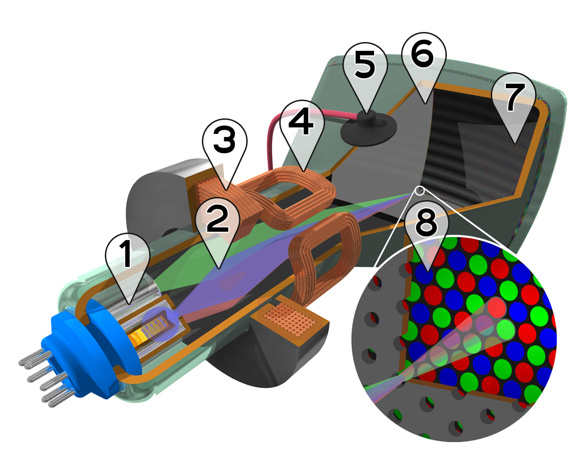
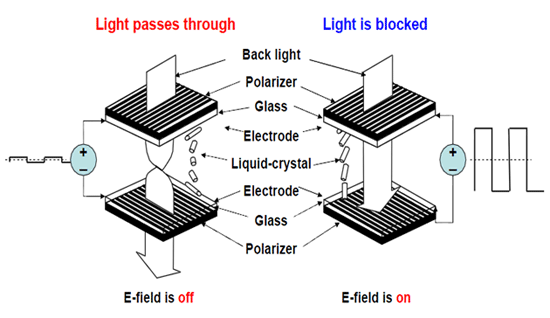
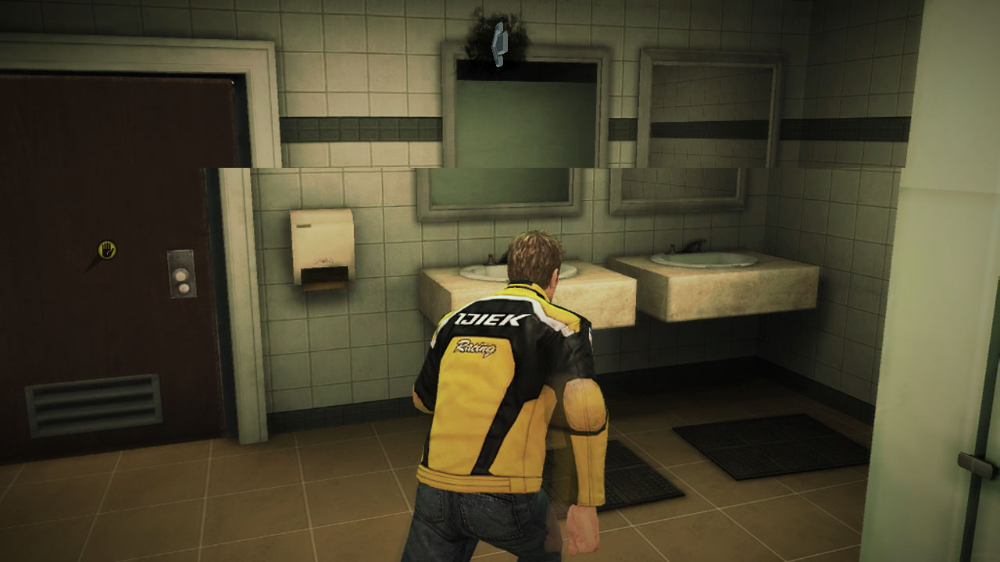
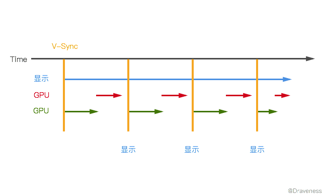
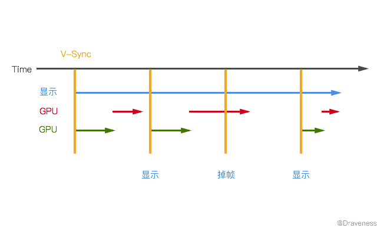
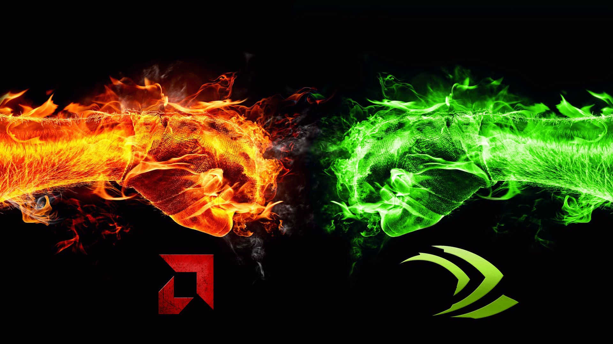
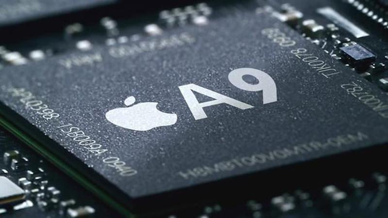
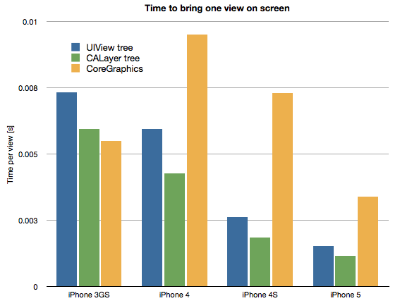
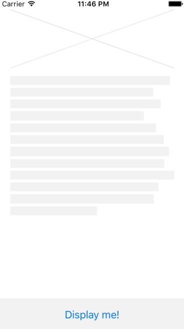

# 使用 ASDK 性能调优 - 提升 iOS 界面的渲染性能

> 这一系列的文章会从几个方面对 [ASDK](http://asyncdisplaykit.org) 在性能调优方面策略的实现进行分析，帮助读者理解 ASDK 如何做到使复杂的 UI 界面达到 60 FPS 的刷新频率的；本篇文章会从视图的渲染层面讲解 ASDK 对于渲染过程的优化并对 ASDK 进行概述。

在客户端或者前端开发中，对于性能的优化，尤其是 UI，往往都不是最先考虑的问题。

因为在大多数场景下，使用更加复杂的高性能代码替代可用的代码经常会导致代码的可维护性下降，所以更需要我们开发者对优化的时间点以及原因有一个比较清楚的认识，避免过度优化带来的问题。

对 iOS 开发比较熟悉的开发者都知道，iOS 中的性能问题大多是阻塞主线程导致用户的交互反馈出现可以感知的延迟。


详细说起来，大体有三种原因：

1. UI 渲染需要时间较长，无法按时提交结果；
2. 一些需要**密集计算**的处理放在了主线程中执行，导致主线程被阻塞，无法渲染 UI 界面；
3. 网络请求由于网络状态的问题响应较慢，UI 层由于没有模型返回无法渲染。

上面的这些问题都会影响应用的性能，最常见的表现就是 `UITableView` 在滑动时没有达到 **60 FPS**，用户能感受到明显的卡顿。

## 屏幕的渲染

相信点开这篇文章的大多数开发者都知道 FPS 是什么，那么如果才能优化我们的 App 使其达到 60 FPS 呢？在具体了解方法之前，我们先退一步，提出另一个问题，屏幕是如何渲染的？

> 对于第一个问题，可能需要几篇文章来回答，希望整个系列的文章能给你一个满意的答案。3

### CRT 和 LCD

屏幕的渲染可能要从 [CRT（Cathode ray tube） 显示器](https://en.wikipedia.org/wiki/Cathode_ray_tube)和 [LCD（Liquid-crystal display） 显示器](https://en.wikipedia.org/wiki/Liquid-crystal_display)讲起。



CRT 显示器是比较古老的技术，它使用阴极电子枪发射电子，在阴极高压的作用下，电子由电子枪射向荧光屏，使荧光粉发光，将图像显示在屏幕上，这也就是用磁铁靠近一些老式电视机的屏幕会让它们变色的原因。

而 FPS 就是 CRT 显示器的刷新频率，电子枪每秒会对显示器上内容进行 60 - 100 次的刷新，哪怕在我们看来没有任何改变。




但是 LCD 的原理与 CRT 非常不同，LCD 的成像原理跟光学有关：

+ 在不加电压下，光线会沿着液晶分子的间隙前进旋转 90°，所以光可以通过；
+ 在加入电压之后，光沿着液晶分子的间隙直线前进，被滤光板挡住。

如果你可以翻墙，相信下面的视频会更好得帮助你理解 LCD 的工作原理：

<a href="https://www.youtube.com/watch?v=Bf3547WB5qs"></a>

LCD 的成像原理虽然与 CRT 截然不同，每一个像素的颜色可以**在需要改变时**才去改变电压，也就是不需要刷新频率，但是由于一些历史原因，LCD 仍然需要按照一定的刷新频率向 GPU 获取新的图像用于显示。

### 屏幕撕裂

但是显示器只是用于将图像显示在屏幕上，谁又是图像的提供者呢？图像都是我们经常说的 GPU 提供的。

而这导致了另一个问题，由于 GPU 生成图像的频率与显示器刷新的频率是不相关的，那么在显示器刷新时，GPU 没有准备好需要显示的图像怎么办；或者 GPU 的渲染速度过快，显示器来不及刷新，GPU 就已经开始渲染下一帧图像又该如何处理？



如果解决不了这两个问题，就会出现上图中的*屏幕撕裂*（Screen Tearing）现象，屏幕中一部分显示的是上一帧的内容，另一部分显示的是下一帧的内容。

我们用两个例子来说明可能出现屏幕撕裂的两种情况：

+ 如果显示器的刷新频率为 75 Hz，GPU 的渲染速度为 100 Hz，那么在两次屏幕刷新的间隔中，GPU 会渲染 4/3 个帧，后面的 1/3 帧会覆盖已经渲染好的帧栈，最终会导致屏幕在 1/3 或者 2/3 的位置出现屏幕撕裂效果；
+ 那么 GPU 的渲染速度小于显示器呢，比如说 50 Hz，那么在两次屏幕刷新的间隔中，GPU 只会渲染 2/3 帧，剩下的 1/3 会来自上一帧，与上面的结果完全相同，在同样的位置出现撕裂效果。

到这里，有人会说，如果显示器的刷新频率与 GPU 的渲染速度完全相同，应该就会解决屏幕撕裂的问题了吧？其实并不是。显示器从 GPU 拷贝帧的过程依然需要消耗一定的时间，如果屏幕在拷贝图像时刷新，仍然会导致屏幕撕裂问题。


引入多个缓冲区可以有效地**缓解**屏幕撕裂，也就是同时使用一个*帧缓冲区*（frame buffer）和多个*后备缓冲区*（back buffer）；在每次显示器请求内容时，都会从**帧缓冲区**中取出图像然后渲染。

虽然缓冲区可以减缓这些问题，但是却不能解决；如果后备缓冲区绘制完成，而帧缓冲区的图像没有被渲染，后备缓冲区中的图像就会覆盖帧缓冲区，仍然会导致屏幕撕裂。

解决这个问题需要另一个机制的帮助，也就是垂直同步（Vertical synchronization），简称 V-Sync 来解决。

### V-Sync

V-Sync 的主要作用就是保证**只有在帧缓冲区中的图像被渲染之后，后备缓冲区中的内容才可以被拷贝到帧缓冲区中**，理想情况下的 V-Sync 会按这种方式工作：



每次 V-Sync 发生时，CPU 以及 GPU 都已经完成了对图像的处理以及绘制，显示器可以直接拿到缓冲区中的帧。但是，如果 CPU 或者 GPU 的处理需要的时间较长，就会发生掉帧的问题：




在 V-Sync 信号发出时，CPU 和 GPU 并没有准备好需要渲染的帧，显示器就会继续使用当前帧，这就**加剧**了屏幕的显示问题，而每秒显示的帧数会少于 60。

由于会发生很多次掉帧，在开启了 V-Sync 后，40 ~ 50 FPS 的渲染频率意味着显示器输出的画面帧率会从 60 FPS 急剧下降到 30 FPS，原因在这里不会解释，读者可以自行思考。

其实到这里关于屏幕渲染的内容就已经差不多结束了，根据 V-Sync 的原理，优化应用性能、提高 App 的 FPS 就可以从两个方面来入手，优化 CPU 以及 GPU 的处理时间。

> 读者也可以从 [iOS 保持界面流畅的技巧](http://blog.ibireme.com/2015/11/12/smooth_user_interfaces_for_ios/)这篇文章中了解更多的相关内容。

## 性能调优的策略

CPU 和 GPU 在每次 V-Sync 时间点到达之前都在干什么？如果，我们知道了它们各自负责的工作，通过优化代码就可以提升性能。



很多 CPU 的操作都会延迟 GPU 开始渲染的时间：

+ 布局的计算 - 如果你的视图层级太过于复杂，或者视图需要重复多次进行布局，尤其是在使用 Auto Layout 进行自动布局时，对性能影响尤为严重；
+ 视图的惰性加载 - 在 iOS 中只有当视图控制器的视图显示到屏幕时才会加载；
+ 解压图片 - iOS 通常会在真正绘制时才会解码图片，对于一个较大的图片，无论是直接或间接使用 `UIImageView` 或者绘制到 Core Graphics 中，都需要对图片进行解压；
+ ...

宽泛的说，大多数的 `CALayer` 的属性都是由 GPU 来绘制的，比如图片的圆角、变换、应用纹理；但是过多的几何结构、重绘、离屏绘制（Offscrren）以及过大的图片都会导致 GPU 的性能明显降低。

> 上面的内容出自 [CPU vs GPU · iOS 核心动画高级技巧](https://zsisme.gitbooks.io/ios-/content/chapter12/cpu-versus-gpu.html)，你可以在上述文章中对 CPU 和 GPU 到底各自做了什么有一个更深的了解。

也就是说，如果我们解决了上述问题，就能加快应用的渲染速度，大大提升用户体验。

## AsyncDisplayKit

文章的前半部分已经从屏幕的渲染原理讲到了性能调优的几个策略；而 [AsyncDisplayKit](http://asyncdisplaykit.org) 就根据上述的策略帮助我们对应用性能进行优化。


AsyncDisplayKit（以下简称 ASDK）是由 Facebook 开源的一个 iOS 框架，能够帮助最复杂的 UI 界面保持流畅和快速响应。

ASDK 从开发到开源大约经历了一年多的时间，它其实并不是一个简单的框架~~它是一个复杂的框架~~，更像是对 UIKit 的重新实现，把整个 UIKit 以及 CALayer 层封装成一个一个 `Node`，**将昂贵的渲染、图片解码、布局以及其它 UI 操作移出主线程**，这样主线程就可以对用户的操作及时做出反应。

很多分析 ASDK 的文章都会有这么一张图介绍框架中的最基本概念：


在 ASDK 中最基本的单位就是 `ASDisplayNode`，每一个 node 都是对 `UIView` 以及 `CALayer` 的抽象。但是与 `UIView` 不同的是，`ASDisplayNode` 是线程安全的，它可以在后台线程中完成初始化以及配置工作。

如果按照 60 FPS 的刷新频率来计算，每一帧的渲染时间只有 16ms，在 16ms 的时间内要完成对 `UIView` 的创建、布局、绘制以及渲染，CPU 和 GPU 面临着巨大的压力。



但是从 A5 处理器之后，多核的设备成为了主流，原有的将所有操作放入主线程的实践已经不能适应复杂的 UI 界面，所以 **ASDK 将耗时的 CPU 操作以及 GPU 渲染纹理（Texture）的过程全部放入后台进程，使主线程能够快速响应用户操作**。

ASDK 通过独特的渲染技巧、代替 AutoLayout 的布局系统、智能的预加载方式等模块来实现对 App 性能的优化。

## ASDK 的渲染过程

ASDK 中到底使用了哪些方法来对视图进行渲染呢？本文主要会从渲染的过程开始分析，了解 ASDK 底层如何提升界面的渲染性能。

在 ASDK 中的渲染围绕 `ASDisplayNode` 进行，其过程总共有四条主线：

+ 初始化 `ASDisplayNode` 对应的 `UIView` 或者 `CALayer`；
+ 在当前视图进入视图层级时执行 `setNeedsDisplay`；
+ `display` 方法执行时，向后台线程派发绘制事务；
+ 注册成为 `RunLoop` 观察者，在每个 `RunLoop` 结束时回调。

### UIView 和 CALayer 的加载

当我们运行某一个使用 ASDK 的工程时，`-[ASDisplayNode _loadViewOrLayerIsLayerBacked:]` 总是 ASDK 中最先被调用的方法，而这个方法执行的原因往往就是 `ASDisplayNode` 对应的 `UIView` 和 `CALayer` 被引用了：

```objectivec
- (CALayer *)layer {
	if (!_layer) {
		ASDisplayNodeAssertMainThread();

		if (!_flags.layerBacked) return self.view.layer;
		[self _loadViewOrLayerIsLayerBacked:YES];
	}
	return _layer;
}

- (UIView *)view {
	if (_flags.layerBacked) return nil;
	if (!_view) {
		ASDisplayNodeAssertMainThread();
		[self _loadViewOrLayerIsLayerBacked:NO];
	}
	return _view;
}
```

这里涉及到一个 ASDK 中比较重要的概念，如果 `ASDisplayNode` 是 `layerBacked` 的，它不会渲染对应的 `UIView` 以此来提升性能：

```objectivec
- (void)_loadViewOrLayerIsLayerBacked:(BOOL)isLayerBacked {
	if (isLayerBacked) {
		_layer = [self _layerToLoad];
		_layer.delegate = (id<CALayerDelegate>)self;
	} else {
		_view = [self _viewToLoad];
		_view.asyncdisplaykit_node = self;
		_layer = _view.layer;
	}
	_layer.asyncdisplaykit_node = self;

	self.asyncLayer.asyncDelegate = self;
}
```

因为 `UIView` 和 `CALayer` 虽然都可以用于展示内容，不过由于 `UIView` 可以用于处理用户的交互，所以如果不需要使用 `UIView` 的特性，直接使用 `CALayer` 进行渲染，能够节省大量的渲染时间。

> 如果你使用 Xcode 查看过视图的层级，那么你应该知道，`UIView` 在 Debug View Hierarchy 中是有层级的；而 `CALayer` 并没有，它门的显示都在一个平面上。

上述方法中的 `-[ASDisplayNode _layerToLoad]` 以及 `[ASDisplayNode _viewToLoad]` 都只会根据当前节点的 `layerClass` 或者 `viewClass` 初始化一个对象。

> [Layer Trees vs. Flat Drawing – Graphics Performance Across iOS Device Generations](http://floriankugler.com/2013/05/24/layer-trees-vs-flat-drawing-graphics-performance-across-ios-device-generations/) 这篇文章比较了 `UIView` 和 `CALayer` 的渲染时间。



`-[ASDisplayNode asyncLayer]` 只是对当前 `node` 持有的 `layer` 进行封装，确保会返回一个 `_ASDisplayLayer` 的实例：

```objectivec
- (_ASDisplayLayer *)asyncLayer {
	ASDN::MutexLocker l(_propertyLock);
	return [_layer isKindOfClass:[_ASDisplayLayer class]] ? (_ASDisplayLayer *)_layer : nil;
}
```

最重要的是 `-[ASDisplayNode _loadViewOrLayerIsLayerBacked:]` 方法会将当前节点设置为 `asyncLayer` 的代理，在后面会使用 `ASDisplayNode` 为 `CALayer` 渲染内容。

### 视图层级

在初始化工作完成之后，当 `ASDisplayNode` 第一次被加入到视图的层级时，`-[_ASDisplayView willMoveToWindow:]` 就会被调用。

#### _ASDisplayView 和 _ASDisplayLayer

`_ASDisplayView` 和 `_ASDisplayLayer` 都是私有类，它们之间的对应关系其实和 `UIView` 与 `CALayer` 完全相同。

```objectivec
+ (Class)layerClass {
	return [_ASDisplayLayer class];
}
```

`_ASDisplayView` 覆写了很多跟视图层级改变有关的方法：

+ `-[_ASDisplayView willMoveToWindow:]`
+ `-[_ASDisplayView didMoveToWindow]`
+ `-[_ASDisplayView willMoveToSuperview:]`
+ `-[_ASDisplayView didMoveToSuperview]`

它们用于在视图的层级改变时，通知对应 `ASDisplayNode` 作出相应的反应，比如 `-[_ASDisplayView willMoveToWindow:]` 方法会在视图被加入层级时调用：

```objectivec
- (void)willMoveToWindow:(UIWindow *)newWindow {
	BOOL visible = (newWindow != nil);
	if (visible && !_node.inHierarchy) {
		[_node __enterHierarchy];
	}
}
```

#### setNeedsDisplay

当前视图如果不在视图层级中，就会通过 `_node` 的实例方法 `-[ASDisplayNode __enterHierarchy]` 加入视图层级：

```objectivec
- (void)__enterHierarchy {
	if (!_flags.isInHierarchy && !_flags.visibilityNotificationsDisabled && ![self __selfOrParentHasVisibilityNotificationsDisabled]) {
		_flags.isEnteringHierarchy = YES;
		_flags.isInHierarchy = YES;

		if (_flags.shouldRasterizeDescendants) {
			[self _recursiveWillEnterHierarchy];
		} else {
			[self willEnterHierarchy];
		}
		_flags.isEnteringHierarchy = NO;

		# 更新 layer 显示的内容
	}
}
		
```

> `_flags` 是 `ASDisplayNodeFlags` 结构体，用于标记当前 `ASDisplayNode` 的一些 BOOL 值，比如，异步显示、栅格化子视图等等，你不需要知道都有什么，根据这些值的字面意思理解就已经足够了。

上述方法的前半部分只是对 `_flags` 的标记，如果需要将当前视图的子视图栅格化，也就是**将它的全部子视图与当前视图压缩成一个图层**，就会向这些视图递归地调用 `-[ASDisplayNode willEnterHierarchy]` 方法通知目前的状态：

```objectivec
- (void)_recursiveWillEnterHierarchy {
  _flags.isEnteringHierarchy = YES;
  [self willEnterHierarchy];
  _flags.isEnteringHierarchy = NO;

  for (ASDisplayNode *subnode in self.subnodes) {
	[subnode _recursiveWillEnterHierarchy];
  }
}
```

而 `-[ASDisplayNode willEnterHierarchy]` 会修改当前节点的 `interfaceState` 到 `ASInterfaceStateInHierarchy`，表示当前节点不包含在 `cell` 或者其它，但是在 `window` 中。

```objectivec
- (void)willEnterHierarchy {
  if (![self supportsRangeManagedInterfaceState]) {
	self.interfaceState = ASInterfaceStateInHierarchy;
  }
}
```

当前结点需要被显示在屏幕上时，如果其内容 `contents` 为空，就会调用 `-[CALayer setNeedsDisplay]` 方法将 `CALayer` 标记为脏的，通知系统需要在下一个绘制循环中重绘视图：

```objectivec
- (void)__enterHierarchy {
	 if (!_flags.isInHierarchy && !_flags.visibilityNotificationsDisabled && ![self __selfOrParentHasVisibilityNotificationsDisabled]) {

		# 标记节点的 flag
		
		if (self.contents == nil) {
			CALayer *layer = self.layer;
			[layer setNeedsDisplay];

			if ([self _shouldHavePlaceholderLayer]) {
				[CATransaction begin];
				[CATransaction setDisableActions:YES];
				[self _setupPlaceholderLayerIfNeeded];
				_placeholderLayer.opacity = 1.0;
				[CATransaction commit];
				[layer addSublayer:_placeholderLayer];
			}
		}
	}
}
```

在将 `CALayer` 标记为 dirty 之后，在绘制循环中就会执行 `-[CALayer display]` 方法，对它要展示的内容进行绘制；如果当前视图需要一些占位图，那么就会在这里的代码中，为当前 `node` 对应的 `layer` 添加合适颜色的占位层。



### 派发异步绘制事务

在上一节中调用 `-[CALayer setNeedsDisplay]` 方法将当前节点标记为 dirty 之后，在下一个绘制循环时就会对所有需要重绘的 `CALayer` 执行 `-[CALayer display]`，这也是这一小节需要分析的方法的入口：

```objectivec
- (void)display {
  [self _hackResetNeedsDisplay];

  ASDisplayNodeAssertMainThread();
  if (self.isDisplaySuspended) return;

  [self display:self.displaysAsynchronously];
}
```

这一方法的调用栈比较复杂，在具体分析之前，笔者会先给出这个方法的调用栈，给读者一个关于该方法实现的简要印象：

```objectivec
-[_ASDisplayLayer display]
	-[_ASDisplayLayer display:] // 将绘制工作交给 ASDisplayNode 处理
		-[ASDisplayNode(AsyncDisplay) displayAsyncLayer:asynchronously:]
			-[ASDisplayNode(AsyncDisplay) _displayBlockWithAsynchronous:isCancelledBlock:rasterizing:]
				-[ASDisplayNode(AsyncDisplay) _recursivelyRasterizeSelfAndSublayersWithIsCancelledBlock:displayBlocks:]            
			-[CALayer(ASDisplayNodeAsyncTransactionContainer) asyncdisplaykit_parentTransactionContainer]
			-[CALayer(ASDisplayNodeAsyncTransactionContainer) asyncdisplaykit_asyncTransaction]
				-[_ASAsyncTransaction initWithCallbackQueue:completionBlock:]
				-[_ASAsyncTransactionGroup addTransactionContainer:]
			-[_ASAsyncTransaction addOperationWithBlock:priority:queue:completion:]
				ASAsyncTransactionQueue::GroupImpl::schedule(NSInteger priority, dispatch_queue_t queue, dispatch_block_t block)
					void dispatch_async(dispatch_queue_t queue, dispatch_block_t block);
```

`-[_ASDisplayLayer display]` 在调用栈中其实会创建一个 `displayBlock`，它其实是一个使用 Core Graphics 进行图像绘制的过程，整个绘制过程是通过事务的形式进行管理的；而 `displayBlock` 会被 GCD 分发到后台的并发进程来处理。

调用栈中的第二个方法 `-[_ASDisplayLayer display]` 会将异步绘制的工作交给自己的 `asyncDelegate`，也就是[第一部分](#uiview-和-calayer-的加载)中设置的 `ASDisplayNode`：

```objectivec
- (void)display:(BOOL)asynchronously {
  [_asyncDelegate displayAsyncLayer:self asynchronously:asynchronously];
}
```

#### ASDisplayNode(AsyncDisplay)

这里省略了一部分 `-[ASDisplayNode(AsyncDisplay) displayAsyncLayer:asynchronously:]` 方法的实现：

```objectivec
- (void)displayAsyncLayer:(_ASDisplayLayer *)asyncLayer asynchronously:(BOOL)asynchronously {
  ASDisplayNodeAssertMainThread();

  ...

  asyncdisplaykit_async_transaction_operation_block_t displayBlock = [self _displayBlockWithAsynchronous:asynchronously isCancelledBlock:isCancelledBlock rasterizing:NO];
  
  if (!displayBlock) return;
  
  asyncdisplaykit_async_transaction_operation_completion_block_t completionBlock = ^(id<NSObject> value, BOOL canceled){
	ASDisplayNodeCAssertMainThread();
	if (!canceled && !isCancelledBlock()) {
	  UIImage *image = (UIImage *)value;
	  _layer.contentsScale = self.contentsScale;
	  _layer.contents = (id)image.CGImage;
	}
  };

  if (asynchronously) {
	CALayer *containerLayer = _layer.asyncdisplaykit_parentTransactionContainer ? : _layer;
	_ASAsyncTransaction *transaction = containerLayer.asyncdisplaykit_asyncTransaction;
	[transaction addOperationWithBlock:displayBlock priority:self.drawingPriority queue:[_ASDisplayLayer displayQueue] completion:completionBlock];
  } else {
	UIImage *contents = (UIImage *)displayBlock();
	completionBlock(contents, NO);
  }
}
```

省略后的代码脉络非常清晰，`-[ASDisplayNode(AsyncDisplay) _displayBlockWithAsynchronous:isCancelledBlock:rasterizing:]` 返回一个用于 `displayBlock`，然后构造一个 `completionBlock`，在绘制结束时执行，在主线程中设置当前 `layer` 的内容。

如果当前的渲染是异步的，就会将 `displayBlock` 包装成一个事务，添加到队列中执行，否则就会同步执行当前的 block，并执行 `completionBlock` 回调，通知 `layer` 更新显示的内容。

同步显示的部分到这里已经很清楚了，我们更关心的其实还是异步绘制的部分，因为这部分才是 ASDK 提升效率的关键；而这就要从获取 `displayBlock` 的方法开始了解了。

#### displayBlock 的构建

`displayBlock` 的创建一般分为三种不同的方式：

1. 将当前视图的子视图压缩成一层绘制在当前页面上
2. 使用 `- displayWithParameters:isCancelled:` 返回一个 `UIImage`，对图像节点 `ASImageNode` 进行绘制
3. 使用 `- drawRect:withParameters:isCancelled:isRasterizing:` 在 CG 上下文中绘制文字节点 `ASTextNode`

这三种方式都通过 ASDK 来优化视图的渲染速度，这些操作最后都会扔到后台的并发线程中进行处理。

> 下面三个部分的代码经过了删减，省略了包括取消绘制、通知代理、控制并发数量以及用于调试的代码。

##### 栅格化子视图

如果当前的视图需要栅格化子视图，就会进入启用下面的构造方式创建一个 block，它会递归地将子视图绘制在父视图上：

```objectivec
- (asyncdisplaykit_async_transaction_operation_block_t)_displayBlockWithAsynchronous:(BOOL)asynchronous isCancelledBlock:(asdisplaynode_iscancelled_block_t)isCancelledBlock rasterizing:(BOOL)rasterizing {
  asyncdisplaykit_async_transaction_operation_block_t displayBlock = nil;
  ASDisplayNodeFlags flags = _flags;

  if (!rasterizing && self.shouldRasterizeDescendants) {
	NSMutableArray *displayBlocks = [NSMutableArray array];
	[self _recursivelyRasterizeSelfAndSublayersWithIsCancelledBlock:isCancelledBlock displayBlocks:displayBlocks];

	CGFloat contentsScaleForDisplay = self.contentsScaleForDisplay;
	BOOL opaque = self.opaque && CGColorGetAlpha(self.backgroundColor.CGColor) == 1.0f;

	displayBlock = ^id{

	  UIGraphicsBeginImageContextWithOptions(bounds.size, opaque, contentsScaleForDisplay);

	  for (dispatch_block_t block in displayBlocks) {
		block();
	  }

	  UIImage *image = UIGraphicsGetImageFromCurrentImageContext();
	  UIGraphicsEndImageContext();

	  return image;
	};
  } else if (flags.implementsInstanceImageDisplay || flags.implementsImageDisplay) {
	#：绘制 UIImage
  } else if (flags.implementsInstanceDrawRect || flags.implementsDrawRect) {
	#：提供 context，使用 CG 绘图
  }

  return [displayBlock copy];
}
```

在压缩视图层级的过程中就会调用 `-[ASDisplayNode(AsyncDisplay) _recursivelyRasterizeSelfAndSublayersWithIsCancelledBlock:displayBlocks:]` 方法，获取子视图的所有 `displayBlock`，在得到 `UIGraphicsBeginImageContextWithOptions` 需要的参数之后，创建一个新的 context，执行了所有的 `displayBlock` 将子视图的绘制到当前图层之后，使用 `UIGraphicsGetImageFromCurrentImageContext` 取出图层的内容并返回。

`-[ASDisplayNode(AsyncDisplay) _recursivelyRasterizeSelfAndSublayersWithIsCancelledBlock:displayBlocks:]` 的实现还是有些繁琐的，它主要的功能就是使用 Core Graphics 进行绘图，将背景颜色、仿射变换、位置大小以及圆角等参数绘制到当前的上下文中，而且这个过程是递归的，直到不存在或者不需要绘制子节点为止。

##### 绘制图片

`displayBlock` 的第二种绘制策略更多地适用于图片节点 `ASImageNode` 的绘制：

```objectivec
- (asyncdisplaykit_async_transaction_operation_block_t)_displayBlockWithAsynchronous:(BOOL)asynchronous isCancelledBlock:(asdisplaynode_iscancelled_block_t)isCancelledBlock rasterizing:(BOOL)rasterizing {
  asyncdisplaykit_async_transaction_operation_block_t displayBlock = nil;
  ASDisplayNodeFlags flags = _flags;

  if (!rasterizing && self.shouldRasterizeDescendants) {
	#：栅格化
  } else if (flags.implementsInstanceImageDisplay || flags.implementsImageDisplay) {
	id drawParameters = [self drawParameters];
	
	displayBlock = ^id{
	  UIImage *result = nil;
	  if (flags.implementsInstanceImageDisplay) {
		result = [self displayWithParameters:drawParameters isCancelled:isCancelledBlock];
	  } else {
		result = [[self class] displayWithParameters:drawParameters isCancelled:isCancelledBlock];
	  }
	  return result;
	};
  } else if (flags.implementsInstanceDrawRect || flags.implementsDrawRect) {
	#：提供 context，使用 CG 绘图
  }

  return [displayBlock copy];
}
```

通过 `- displayWithParameters:isCancelled:` 的执行返回一个图片，不过这里的绘制也离不开 Core Graphics 的一些 C 函数，你会在 `-[ASImageNode displayWithParameters:isCancelled:]` 中看到对于 CG 的运用，它会使用 `drawParameters` 来修改并绘制自己持有的 `image` 对象。

##### 使用 CG 绘图

文字的绘制一般都会在 `- drawRect:withParameters:isCancelled:isRasterizing:` 进行，这个方法只是提供了一个合适的用于绘制的上下文，该方法不止可以绘制文字，只是在这里绘制文字比较常见：

```objectivec
- (asyncdisplaykit_async_transaction_operation_block_t)_displayBlockWithAsynchronous:(BOOL)asynchronous isCancelledBlock:(asdisplaynode_iscancelled_block_t)isCancelledBlock rasterizing:(BOOL)rasterizing {
  asyncdisplaykit_async_transaction_operation_block_t displayBlock = nil;
  ASDisplayNodeFlags flags = _flags;

  if (!rasterizing && self.shouldRasterizeDescendants) {
	#：栅格化
  } else if (flags.implementsInstanceImageDisplay || flags.implementsImageDisplay) {
	#：绘制 UIImage
  } else if (flags.implementsInstanceDrawRect || flags.implementsDrawRect) {
	  if (!rasterizing) {
		UIGraphicsBeginImageContextWithOptions(bounds.size, opaque, contentsScaleForDisplay);
	  }

	  if (flags.implementsInstanceDrawRect) {
		[self drawRect:bounds withParameters:drawParameters isCancelled:isCancelledBlock isRasterizing:rasterizing];
	  } else {
		[[self class] drawRect:bounds withParameters:drawParameters isCancelled:isCancelledBlock isRasterizing:rasterizing];
	  }
	  
	  UIImage *image = nil;
	  if (!rasterizing) {
		image = UIGraphicsGetImageFromCurrentImageContext();
		UIGraphicsEndImageContext();
	  }

	  return image;
	};
  }

  return [displayBlock copy];
}
```

上述代码跟第一部分比较像，区别是这里不会栅格化子视图；代码根据情况会决定是否重新开一个新的上下文，然后通过 `- drawRect:withParameters:isCancelled:isRasterizing:` 方法实现绘制。

#### 管理绘制事务

ASDK 提供了一个私有的管理事务的机制，由三部分组成 `_ASAsyncTransactionGroup`、`_ASAsyncTransactionContainer` 以及 `_ASAsyncTransaction`，这三者各自都有不同的功能：

+ `_ASAsyncTransactionGroup` 会在初始化时，向 Runloop 中注册一个回调，在每次 Runloop 结束时，执行回调来提交 `displayBlock` 执行的结果
+ `_ASAsyncTransactionContainer` 为当前 `CALayer` 提供了用于保存事务的容器，并提供了获取新的 `_ASAsyncTransaction` 实例的便利方法
+ `_ASAsyncTransaction` 将异步操作封装成了轻量级的事务对象，使用 C++ 代码对 GCD 进行了封装

从上面的小节中，我们已经获取到了用于绘制的 `displayBlock`，然后就需要将 block 添加到绘制事务中：

```objectivec
- (void)displayAsyncLayer:(_ASDisplayLayer *)asyncLayer asynchronously:(BOOL)asynchronously {
  ...

  if (asynchronously) {
	CALayer *containerLayer = _layer.asyncdisplaykit_parentTransactionContainer ? : _layer;
	_ASAsyncTransaction *transaction = containerLayer.asyncdisplaykit_asyncTransaction;
	[transaction addOperationWithBlock:displayBlock priority:self.drawingPriority queue:[_ASDisplayLayer displayQueue] completion:completionBlock];
  } else {
	...
  }
}
```

前两行代码是获取 `_ASAsyncTransaction` 实例的过程，这个实例会包含在一个 `layer` 的哈希表中，最后调用的实例方法 `-[_ASAsyncTransaction addOperationWithBlock:priority:queue:completion:]` 会把用于绘制的 `displayBlock` 添加到后台并行队列中：

```objectivec
+ (dispatch_queue_t)displayQueue {
  static dispatch_queue_t displayQueue = NULL;
  static dispatch_once_t onceToken;
  dispatch_once(&onceToken, ^{
	displayQueue = dispatch_queue_create("org.AsyncDisplayKit.ASDisplayLayer.displayQueue", DISPATCH_QUEUE_CONCURRENT);
	dispatch_set_target_queue(displayQueue, dispatch_get_global_queue(DISPATCH_QUEUE_PRIORITY_HIGH, 0));
  });

  return displayQueue;
}
```

这个队列是一个并行队列，并且优先级是 `DISPATCH_QUEUE_PRIORITY_HIGH`，**确保 UI 的渲染会在其它异步操作执行之前进行**，而 `-[_ASAsyncTransaction addOperationWithBlock:priority:queue:completion:]` 中会初始化 `ASDisplayNodeAsyncTransactionOperation` 的实例，然后传入 `completionBlock`，在绘制结束时回调：

```objectivec
- (void)addOperationWithBlock:(asyncdisplaykit_async_transaction_operation_block_t)block priority:(NSInteger)priority queue:(dispatch_queue_t)queue completion:(asyncdisplaykit_async_transaction_operation_completion_block_t)completion {
  ASDisplayNodeAssertMainThread();

  [self _ensureTransactionData];

  ASDisplayNodeAsyncTransactionOperation *operation = [[ASDisplayNodeAsyncTransactionOperation alloc] initWithOperationCompletionBlock:completion];
  [_operations addObject:operation];
  _group->schedule(priority, queue, ^{
	@autoreleasepool {
	  operation.value = block();
	}
  });
}
```

`schedule` 方法是一个 C++ 方法，它会向 `ASAsyncTransactionQueue::Group` 中派发一个 block，这个 block 中会执行 `displayBlock`，然后将结果传给 `operation.value`：

```objectivec
void ASAsyncTransactionQueue::GroupImpl::schedule(NSInteger priority, dispatch_queue_t queue, dispatch_block_t block) {
  ASAsyncTransactionQueue &q = _queue;
  ASDN::MutexLocker locker(q._mutex);
  
  DispatchEntry &entry = q._entries[queue];
  
  Operation operation;
  operation._block = block;
  operation._group = this;
  operation._priority = priority;
  entry.pushOperation(operation);
  
  ++_pendingOperations;
  
  NSUInteger maxThreads = [NSProcessInfo processInfo].activeProcessorCount * 2;

  if ([[NSRunLoop mainRunLoop].currentMode isEqualToString:UITrackingRunLoopMode])
	--maxThreads;
  
  if (entry._threadCount < maxThreads) {
	bool respectPriority = entry._threadCount > 0;
	++entry._threadCount;
	
	dispatch_async(queue, ^{
	  while (!entry._operationQueue.empty()) {
		Operation operation = entry.popNextOperation(respectPriority);
		{
		  if (operation._block) {
			operation._block();
		  }
		  operation._group->leave();
		  operation._block = nil;
		}
	  }
	  --entry._threadCount;
	  
	  if (entry._threadCount == 0) {
		q._entries.erase(queue);
	  }
	});
  }
}
```

`ASAsyncTransactionQueue::GroupImpl` 其实现其实就是对 GCD 的封装，同时添加一些最大并发数、线程锁的功能。通过 `dispatch_async` 将 block 分发到 `queue` 中，立刻执行 block，将数据传回 `ASDisplayNodeAsyncTransactionOperation` 实例。

### 回调

在 `_ASAsyncTransactionGroup` 调用 `mainTransactionGroup` 类方法获取单例时，会通过 `+[_ASAsyncTransactionGroup registerTransactionGroupAsMainRunloopObserver]` 向 Runloop 中注册回调：

```objectivec
+ (void)registerTransactionGroupAsMainRunloopObserver:(_ASAsyncTransactionGroup *)transactionGroup {
  static CFRunLoopObserverRef observer;
  CFRunLoopRef runLoop = CFRunLoopGetCurrent();
  CFOptionFlags activities = (kCFRunLoopBeforeWaiting | kCFRunLoopExit);
  CFRunLoopObserverContext context = {0, (__bridge void *)transactionGroup, &CFRetain, &CFRelease, NULL};

  observer = CFRunLoopObserverCreate(NULL, activities, YES, INT_MAX, &_transactionGroupRunLoopObserverCallback, &context);
  CFRunLoopAddObserver(runLoop, observer, kCFRunLoopCommonModes);
  CFRelease(observer);
}
```

上述代码会在即将退出 Runloop 或者 Runloop 开始休眠时执行回调 `_transactionGroupRunLoopObserverCallback`，而这个回调方法就是这一条主线的入口：

```objectivec
static void _transactionGroupRunLoopObserverCallback(CFRunLoopObserverRef observer, CFRunLoopActivity activity, void *info) {
  ASDisplayNodeCAssertMainThread();
  _ASAsyncTransactionGroup *group = (__bridge _ASAsyncTransactionGroup *)info;
  [group commit];
}
```

上一节中只是会将绘制代码提交到后台的并发进程中，而这里才会将结果提交，也就是在每次 Runloop 循环结束时开始绘制内容，而 `-[_operationCompletionBlock commit]` 方法的调用栈能够帮助我们理解内容是如何提交的，又是如何传回 `node` 持有的 `layer` 的：

```objectivec
-[_ASAsyncTransactionGroup commit]
	-[_ASAsyncTransaction commit]
		ASAsyncTransactionQueue::GroupImpl::notify(dispatch_queue_t, dispatch_block_t)
			_notifyList.push_back(GroupNotify)
```

`-[_ASAsyncTransactionGroup commit]` 方法的调用完成了对绘制事务的提交，而在 `-[_ASAsyncTransaction commit]` 中会调用 `notify` 方法，在上一节中的 `displayBlock` 执行结束后调用这里传入的 block 执行 `-[_ASAsyncTransaction completeTransaction]` 方法：

```objectivec
- (void)commit {
  ASDisplayNodeAssertMainThread();
  __atomic_store_n(&_state, ASAsyncTransactionStateCommitted, __ATOMIC_SEQ_CST);
	
  _group->notify(_callbackQueue, ^{
	ASDisplayNodeAssertMainThread();
	[self completeTransaction];
  });
}
```

我们按照时间顺序来分析在上面的 block 执行之前，方法是如何调用的，以及 block 是如何被执行的；这就不得不回到派发绘制事务的部分了，在 `ASAsyncTransactionQueue::GroupImpl::schedule` 方法中，使用了 `dispatch_async` 将派发 block：

```objectivec
void ASAsyncTransactionQueue::GroupImpl::schedule(NSInteger priority, dispatch_queue_t queue, dispatch_block_t block) {
  ...
  if (entry._threadCount < maxThreads) {
	...    
	dispatch_async(queue, ^{
	  ...
	  while (!entry._operationQueue.empty()) {
		Operation operation = entry.popNextOperation(respectPriority);
		{
		  ASDN::MutexUnlocker unlock(q._mutex);
		  if (operation._block) {
			operation._block();
		  }
		  operation._group->leave();
		  operation._block = nil;
		}
	  }
	  ...
	});
  }
}
```

在 `displayBlock` 执行之后，会调用的 `group` 的 `leave` 方法：

```objectivec
void ASAsyncTransactionQueue::GroupImpl::leave() {
  if (_pendingOperations == 0) {
	std::list<GroupNotify> notifyList;
	_notifyList.swap(notifyList);
	
	for (GroupNotify & notify : notifyList) {
	  dispatch_async(notify._queue, notify._block);
	}
  }
}
```

这里终于执行了在 `- commit` 中加入的 block，也就是 `-[_ASAsyncTransaction completeTransaction]` 方法：

```objectivec
- (void)completeTransaction {
  if (__atomic_load_n(&_state, __ATOMIC_SEQ_CST) != ASAsyncTransactionStateComplete) {
	BOOL isCanceled = (__atomic_load_n(&_state, __ATOMIC_SEQ_CST) == ASAsyncTransactionStateCanceled);
	for (ASDisplayNodeAsyncTransactionOperation *operation in _operations) {
	  [operation callAndReleaseCompletionBlock:isCanceled];
	}
	
	__atomic_store_n(&_state, ASAsyncTransactionStateComplete, __ATOMIC_SEQ_CST);
  }
}
```

最后的最后，`-[ASDisplayNodeAsyncTransactionOperation callAndReleaseCompletionBlock:]` 方法执行了回调将 `displayBlock` 执行的结果传回了 CALayer:

```objectivec
- (void)callAndReleaseCompletionBlock:(BOOL)canceled; {
  if (_operationCompletionBlock) {
	_operationCompletionBlock(self.value, canceled);
	self.operationCompletionBlock = nil;
  }
}
```

也就是在  `-[ASDisplayNode(AsyncDisplay) displayAsyncLayer:asynchronously:]` 方法中构建的 `completionBlock`：

```objectivec
asyncdisplaykit_async_transaction_operation_completion_block_t completionBlock = ^(id<NSObject> value, BOOL canceled){
  ASDisplayNodeCAssertMainThread();
  if (!canceled && !isCancelledBlock()) {
	UIImage *image = (UIImage *)value;
	BOOL stretchable = !UIEdgeInsetsEqualToEdgeInsets(image.capInsets, UIEdgeInsetsZero);
	if (stretchable) {
	  ASDisplayNodeSetupLayerContentsWithResizableImage(_layer, image);
	} else {
	  _layer.contentsScale = self.contentsScale;
	  _layer.contents = (id)image.CGImage;
	}
	[self didDisplayAsyncLayer:self.asyncLayer];
  }
};
```

这一部分进行的大量的数据传递都是通过 block 进行的，从 Runloop 中对事务的提交，以及通过 `notify` 方法加入的 block，都是为了最后将绘制的结果传回 `CALayer` 对象，而到这里可以说整个 ASDK 对于视图内容的绘制过程就结束了。

## 总结

ASDK 对于绘制过程的优化有三部分：分别是栅格化子视图、绘制图像以及绘制文字。

它拦截了视图加入层级时发出的通知 `- willMoveToWindow:` 方法，然后手动调用 `- setNeedsDisplay`，强制所有的 `CALayer` 执行 `- display` 更新内容；

然后将上面的操作全部抛入了后台的并发线程中，并在 Runloop 中注册回调，在每次 Runloop 结束时，对已经完成的事务进行 `- commit`，以图片的形式直接传回对应的 `layer.content` 中，完成对内容的更新。

从它的实现来看，确实从主线程移除了很多昂贵的 CPU 以及 GPU 操作，有效地加快了视图的绘制和渲染，保证了主线程的流畅执行。

## References

+ [How VSync works, and why people loathe it](https://hardforum.com/threads/how-vsync-works-and-why-people-loathe-it.928593/)
+ [脑洞大开：为啥帧率达到 60 fps 就流畅？](http://www.jianshu.com/p/71cba1711de0)
+ [iOS 保持界面流畅的技巧](http://blog.ibireme.com/2015/11/12/smooth_user_interfaces_for_ios/)
+ [CADiplayLink Class Reference - Developer- Apple](https://en.wikipedia.org/wiki/Analog_television#Vertical_synchronization)
+ [CPU vs GPU · iOS 核心动画高级技巧](https://zsisme.gitbooks.io/ios-/content/chapter12/cpu-versus-gpu.html)
+ [理解 UIView 的绘制](http://vizlabxt.github.io/blog/2012/10/22/UIView-Rendering/)
+ [Introduce to AsyncDisplayKit](http://vizlabxt.github.io/blog/2015/01/09/Behind-AsyncDisplayKit/)
+ [AsyncDisplayKit Tutorial: Achieving 60 FPS scrolling](https://www.raywenderlich.com/86365/asyncdisplaykit-tutorial-achieving-60-fps-scrolling)
+ [Layer Trees vs. Flat Drawing – Graphics Performance Across iOS Device Generations](http://floriankugler.com/2013/05/24/layer-trees-vs-flat-drawing-graphics-performance-across-ios-device-generations/)
+ [深入理解 RunLoop](http://blog.ibireme.com/2015/05/18/runloop/)

## 其它

> Github Repo：[iOS-Source-Code-Analyze](https://github.com/draveness/iOS-Source-Code-Analyze)
> 
> Follow: [Draveness · Github](https://github.com/Draveness)
>
> Source: http://draveness.me/asdk-rendering


