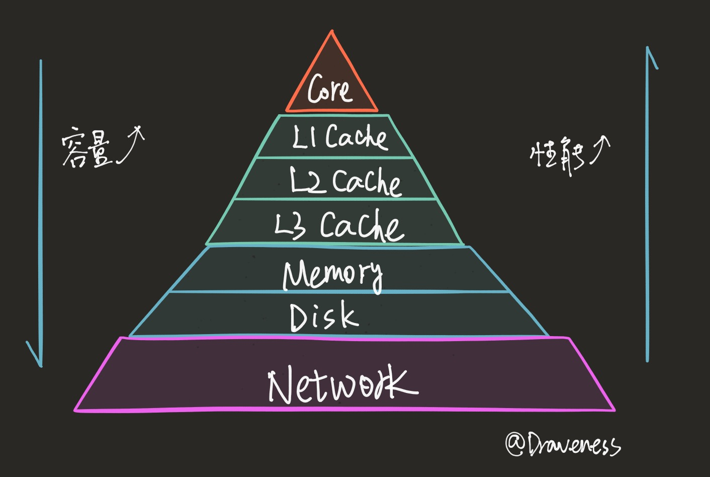
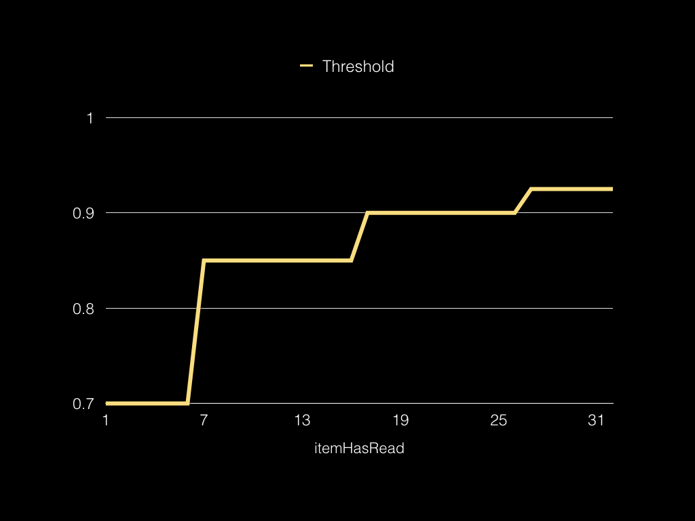
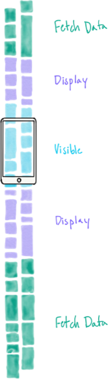
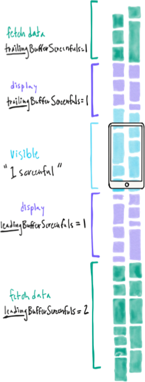
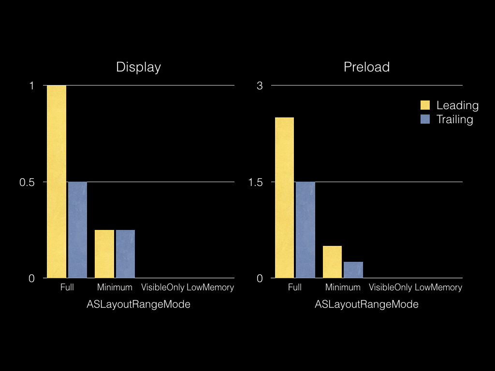
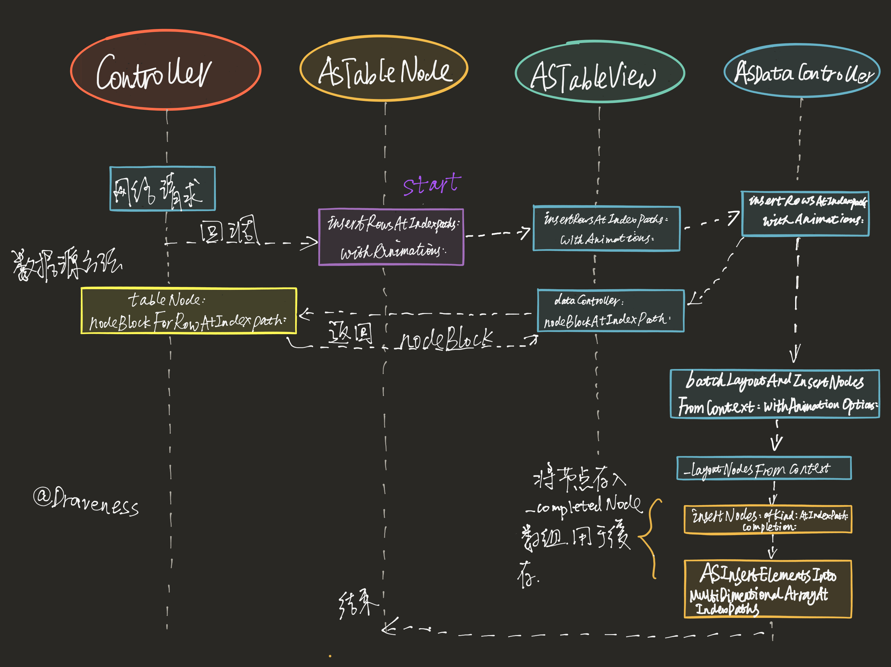
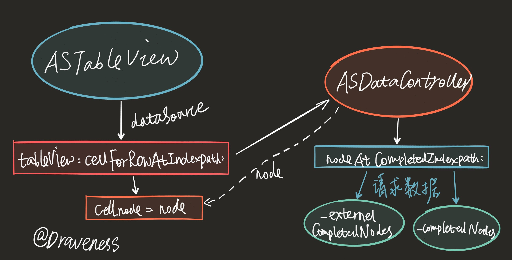
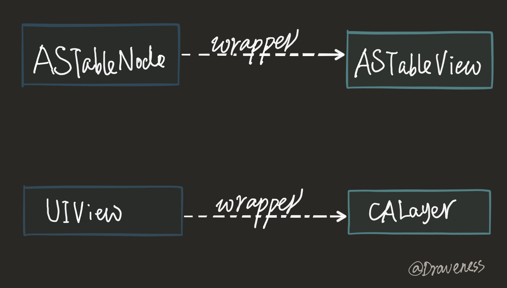
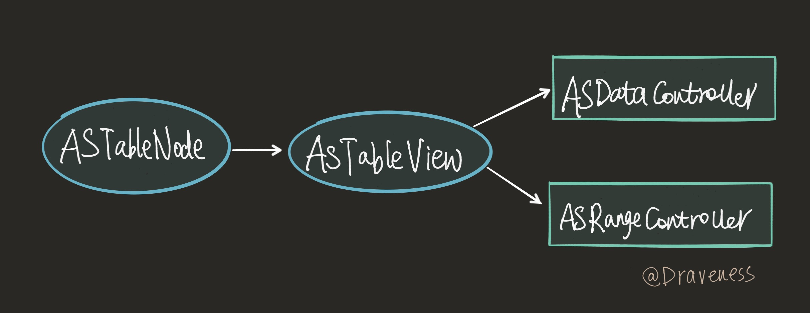
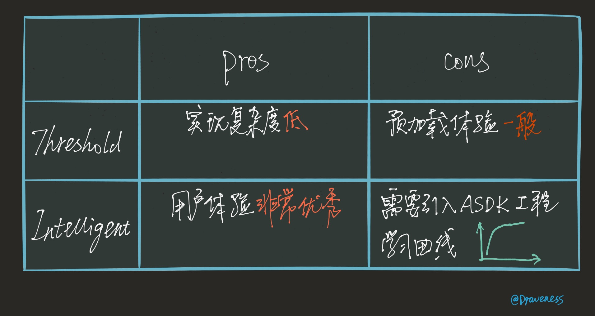

# 预加载与智能预加载（iOS）

> 前两次的分享分别介绍了 ASDK 对于渲染的优化以及 ASDK 中使用的另一种布局模型；这两个新机制的引入分别解决了 iOS 在主线程渲染视图以及 Auto Layout 的性能问题，而这一次讨论的主要内容是 ASDK 如何预先请求服务器数据，达到看似无限滚动列表的效果的。

这篇文章是 ASDK 系列中的最后一篇，文章会介绍 iOS 中几种*预加载*的方案，以及 ASDK 中是如何处理预加载的。

不过，在介绍 ASDK 中实现**智能预加载**的方式之前，文章中会介绍几种简单的预加载方式，方便各位开发者进行对比，选择合适的机制实现预加载这一功能。

## 网络与性能

ASDK 通过在渲染视图和布局方面的优化已经可以使应用在任何用户的疯狂操作下都能保持 60 FPS 的流畅程度，也就是说，我们已经充分的利用了当前设备的性能，调动各种资源加快视图的渲染。

但是，仅仅在 CPU 以及 GPU 方面的优化往往是远远不够的。在目前的软件开发中，很难找到一个**没有任何网络请求**的应用，哪怕是一个记账软件也需要服务器来同步保存用户的信息，防止资料的丢失；所以，只在渲染这一层面进行优化还不能让用户的体验达到最佳，因为网络请求往往是一个应用**最为耗时以及昂贵**的操作。


每一个应用程序在运行时都可以看做是 CPU 在底层利用各种资源疯狂做加减法运算，其中最耗时的操作并不是进行加减法的过程，而是**资源转移**的过程。

> 举一个不是很恰当的例子，主厨（CPU）在炒一道菜（计算）时往往需要的时间并不多，但是菜的采购以及准备（资源的转移）会占用大量的时间，如果在每次炒菜之前，都由帮厨提前准备好所有的食材（缓存），那么做一道菜的时间就大大减少了。

而提高资源转移的效率的最佳办法就是使用多级缓存：



从上到下，虽然容量越来越大，直到 Network 层包含了整个互联网的内容，但是访问时间也是直线上升；在 Core 或者三级缓存中的资源可能访问只需要几个或者几十个时钟周期，但是网络中的资源就**远远**大于这个数字，几分钟、几小时都是有可能的。

更糟糕的是，因为天朝的网络情况及其复杂，运营商劫持 DNS、404 无法访问等问题导致网络问题极其严重；而如何加速网络请求成为了很多移动端以及 Web 应用的重要问题。

## 预加载

本文就会提供一种**缓解网络请求缓慢导致用户体验较差**的解决方案，也就是预加载；在本地真正需要渲染界面之前就通过网络请求获取资源存入内存或磁盘。

> 预加载并不能彻底解决网络请求缓慢的问题，而是通过提前发起网络请求**缓解**这一问题。

那么，预加载到底要关注哪些方面的问题呢？总结下来，有以下两个关注点：

+ 需要预加载的资源
+ 预加载发出的时间

文章会根据上面的两个关注点，分别分析四种预加载方式的实现原理以及优缺点：

1. 无限滚动列表
2. threshold
3. 惰性加载
4. 智能预加载

### 无限滚动列表

其实，无限滚动列表并不能算是一种预加载的实现原理，它只是提供一种分页显示的方法，在每次滚动到 `UITableView` 底部时，才会开始发起网络请求向服务器获取对应的资源。

虽然这种方法并不是预加载方式的一种，放在这里的主要作用是作为对比方案，看看如果不使用预加载的机制，用户体验是什么样的。


很多客户端都使用了分页的加载方式，并没有添加额外的预加载的机制来提升用户体验，虽然这种方式并不是不能接受，不过每次滑动到视图底部之后，总要等待网络请求的完成确实对视图的流畅性有一定影响。

虽然仅仅使用无限滚动列表而不提供预加载机制会在一定程度上影响用户体验，不过，这种**需要用户等待几秒钟**的方式，在某些时候确实非常好用，比如：投放广告。


> QQ 空间就是这么做的，它们**投放的广告基本都是在整个列表的最底端**，这样，当你滚动到列表最下面的时候，就能看到你急需的租房、租车、同城交友、信用卡办理、只有 iPhone 能玩的游戏以及各种奇奇怪怪的辣鸡广告了，很好的解决了我们的日常生活中的各种需求。（哈哈哈哈哈哈哈哈哈哈哈哈哈）

### Threshold

使用 Threshold 进行预加载是一种最为常见的预加载方式，知乎客户端就使用了这种方式预加载条目，而其原理也非常简单，根据当前 `UITableView` 的所在位置，除以目前整个 `UITableView.contentView` 的高度，来判断当前是否需要发起网络请求：

```swift
let threshold: CGFloat = 0.7
var currentPage = 0

override func scrollViewDidScroll(_ scrollView: UIScrollView) {
    let current = scrollView.contentOffset.y + scrollView.frame.size.height
    let total = scrollView.contentSize.height
    let ratio = current / total

    if ratio >= threshold {
        currentPage += 1
        print("Request page \(currentPage) from server.")
    }
}
```

上面的代码在当前页面已经划过了 70% 的时候，就请求新的资源，加载数据；但是，仅仅使用这种方法会有另一个问题，尤其是当列表变得很长时，十分明显，比如说：用户从上向下滑动，总共加载了 5 页数据：

| Page | Total | Threshold | Diff |
| :-: | :-: | :-: | :-: |
| 1 | 10 | 7 | 7 |
| 2 | 20 | 14 | 4 |
| 3 | 30 | 21 | 1 |
| 4 | 40 | 28 | -2 |
| 5 | 50 | 35 | -5 |

+ Page 当前总页数；
+ Total 当前 `UITableView` 总元素个数；
+ Threshold 网络请求触发时间；
+ Diff 表示最新加载的页面被浏览了多少；

当 Threshold 设置为 70% 的时候，其实并不是单页 70%，这就会导致**新加载的页面都没有看，应用就会发出另一次请求，获取新的资源**。

#### 动态的 Threshold

解决这个问题的办法，还是比较简单的，通过修改上面的代码，将 Threshold 变成一个动态的值，随着页数的增长而增长：

```swift
let threshold:   CGFloat = 0.7
let itemPerPage: CGFloat = 10
var currentPage: CGFloat = 0

override func scrollViewDidScroll(_ scrollView: UIScrollView) {
    let current = scrollView.contentOffset.y + scrollView.frame.size.height
    let total = scrollView.contentSize.height
    let ratio = current / total

    let needRead = itemPerPage * threshold + currentPage * itemPerPage
    let totalItem = itemPerPage * (currentPage + 1)
    let newThreshold = needRead / totalItem

    if ratio >= newThreshold {
        currentPage += 1
        print("Request page \(currentPage) from server.")
    }
}
```

通过这种方法获取的 `newThreshold` 就会随着页数的增长而动态的改变，解决了上面出现的问题：



### 惰性加载

使用 Threshold 进行预加载其实已经适用于大多数应用场景了；但是，下面介绍的方式，*惰性加载*能够有针对性的加载用户“会看到的” Cell。

> *惰性加载*，就是在用户滚动的时候会对用户滚动结束的区域进行计算，只加载目标区域中的资源。

用户在飞速滚动中会看到巨多的空白条目，因为用户并不想阅读这些条目，所以，我们并不需要真正去加载这些内容，只需要在 `ASTableView/ASCollectionView` 中只根据用户滚动的目标区域惰性加载资源。


惰性加载的方式不仅仅减少了网络请求的冗余资源，同时也减少了渲染视图、数据绑定的耗时。

计算用户滚动的目标区域可以直接使用下面的代理方法获取：

```swift
let markedView = UIView()
let rowHeight: CGFloat = 44.0

override func scrollViewWillEndDragging(_ scrollView: UIScrollView, withVelocity velocity: CGPoint, targetContentOffset: UnsafeMutablePointer<CGPoint>) {
    let targetOffset = targetContentOffset.pointee
    let targetRect = CGRect(origin: targetOffset, size: scrollView.frame.size)

    markedView.frame = targetRect
    markedView.backgroundColor = UIColor.black.withAlphaComponent(0.1)
    tableView.addSubview(markedView)

    var indexPaths: [IndexPath] = []

    let startIndex = Int(targetRect.origin.y / rowHeight)
    let endIndex = Int((targetRect.origin.y + tableView.frame.height) / rowHeight)

    for index in startIndex...endIndex {
        indexPaths.append(IndexPath(row: index, section: 0))
    }

    print("\(targetRect) \(indexPaths)")
}
```

> 以上代码只会大致计算出目标区域内的 `IndexPath` 数组，并不会展开新的 page，同时会使用浅黑色标记目标区域。

当然，惰性加载的实现也并不只是这么简单，不仅需要客户端的工作，同时因为需要**加载特定 offset 资源**，也需要服务端提供相应 API 的支持。

虽然惰性加载的方式能够按照用户的需要请求对应的资源，但是，在用户滑动 `UITableView` 的过程中会看到大量的空白条目，这样的用户体验是否可以接受又是值得考虑的问题了。

### 智能预加载

终于到了智能预加载的部分了，当我第一次得知 ASDK 可以通过滚动的方向预加载不同数量的内容，感觉是非常神奇的。



如上图所示 ASDK 把正在滚动的 ` ASTableView/ASCollectionView` 划分为三种状态：

+ Fetch Data
+ Display
+ Visible

上面的这三种状态都是由 ASDK 来管理的，而每一个 `ASCellNode` 的状态都是由 `ASRangeController` 控制，所有的状态都对应一个 `ASInterfaceState`：

+ `ASInterfaceStatePreload` 当前元素貌似要显示到屏幕上，需要从磁盘或者网络请求数据；
+ `ASInterfaceStateDisplay` 当前元素非常可能要变成可见的，需要进行异步绘制；
+ `ASInterfaceStateVisible` 当前元素最少在屏幕上显示了 1px

当用户滚动当前视图时，`ASRangeController` 就会修改不同区域内元素的状态：



上图是用户在向下滑动时，`ASCellNode` 是如何被标记的，假设**当前视图可见的范围高度为 1**，那么在默认情况下，五个区域会按照上图的形式进行划分：

| Buffer | Size |
| :-: | :-: |
| Fetch Data Leading Buffer | 2 |
| Display Leading Buffer | 1 |
| Visible | 1 |
| Display Trailing Buffer | 1 |
| Fetch Data Trailing Buffer | 1 |

在滚动方向（Leading）上 Fetch Data 区域会是非滚动方向（Trailing）的两倍，ASDK 会根据滚动方向的变化实时改变缓冲区的位置；在向下滚动时，下面的 Fetch Data 区域就是上面的两倍，向上滚动时，上面的 Fetch Data 区域就是下面的两倍。

> 这里的两倍并不是一个确定的数值，ASDK 会根据当前设备的不同状态，改变不同区域的大小，但是**滚动方向的区域总会比非滚动方向大一些**。

智能预加载能够根据当前的滚动方向，自动改变当前的工作区域，选择合适的区域提前触发请求资源、渲染视图以及异步布局等操作，让视图的滚动达到真正的流畅。

#### 原理

在 ASDK 中整个智能预加载的概念是由三个部分来统一协调管理的：

+ `ASRangeController`
+ `ASDataController`
+ `ASTableView` 与 `ASTableNode`

对智能预加载实现的分析，也是根据这三个部分来介绍的。

#### 工作区域的管理

`ASRangeController` 是 `ASTableView` 以及 `ASCollectionView` 内部使用的控制器，主要用于监控视图的可见区域、维护工作区域、触发网络请求以及绘制、单元格的异步布局。

以 `ASTableView` 为例，在视图进行滚动时，会触发 `-[UIScrollView scrollViewDidScroll:]` 代理方法：

```objectivec
- (void)scrollViewDidScroll:(UIScrollView *)scrollView {
  ASInterfaceState interfaceState = [self interfaceStateForRangeController:_rangeController];
  if (ASInterfaceStateIncludesVisible(interfaceState)) {
    [_rangeController updateCurrentRangeWithMode:ASLayoutRangeModeFull];
  }
  ...
}
```

> 每一个 `ASTableView` 的实例都持有一个 `ASRangeController` 以及 `ASDataController` 用于管理工作区域以及数据更新。

ASRangeController 最重要的私有方法 `-[ASRangeController _updateVisibleNodeIndexPaths]` 一般都是因为上面的方法间接调用的：

```objectivec
-[ASRangeController updateCurrentRangeWithMode:]
    -[ASRangeController setNeedsUpdate]
        -[ASRangeController updateIfNeeded]
            -[ASRangeController _updateVisibleNodeIndexPaths]
```

调用栈中间的过程其实并不重要，最后的私有方法的主要工作就是计算不同区域内 Cell 的 `NSIndexPath` 数组，然后更新对应 Cell 的状态 `ASInterfaceState` 触发对应的操作。

我们将这个私有方法的实现分开来看：

```objectivec
- (void)_updateVisibleNodeIndexPaths {
  NSArray<NSArray *> *allNodes = [_dataSource completedNodes];
  NSUInteger numberOfSections = [allNodes count];

  NSArray<NSIndexPath *> *visibleNodePaths = [_dataSource visibleNodeIndexPathsForRangeController:self];

  ASScrollDirection scrollDirection = [_dataSource scrollDirectionForRangeController:self];
  if (_layoutControllerImplementsSetViewportSize) {
    [_layoutController setViewportSize:[_dataSource viewportSizeForRangeController:self]];
  }
  
  if (_layoutControllerImplementsSetVisibleIndexPaths) {
    [_layoutController setVisibleNodeIndexPaths:visibleNodePaths];
  }
  ...
}
```

当前 `ASRangeController` 的数据源以及代理就是 `ASTableView`，这段代码首先就获取了完成计算和布局的 `ASCellNode` 以及可见的 `ASCellNode` 的 `NSIndexPath`：

```objectivec
- (void)_updateVisibleNodeIndexPaths {  
  NSArray<ASDisplayNode *> *currentSectionNodes = nil;
  NSInteger currentSectionIndex = -1;
  NSUInteger numberOfNodesInSection = 0;
  
  NSSet<NSIndexPath *> *visibleIndexPaths = [NSSet setWithArray:visibleNodePaths];
  NSSet<NSIndexPath *> *displayIndexPaths = nil;
  NSSet<NSIndexPath *> *preloadIndexPaths = nil;
  
  NSMutableOrderedSet<NSIndexPath *> *allIndexPaths = [[NSMutableOrderedSet alloc] initWithSet:visibleIndexPaths];
  
  ASLayoutRangeMode rangeMode = _currentRangeMode;

  ASRangeTuningParameters parametersPreload = [_layoutController tuningParametersForRangeMode:rangeMode
                                                                                      rangeType:ASLayoutRangeTypePreload];
  if (ASRangeTuningParametersEqualToRangeTuningParameters(parametersPreload, ASRangeTuningParametersZero)) {
    preloadIndexPaths = visibleIndexPaths;
  } else {
    preloadIndexPaths = [_layoutController indexPathsForScrolling:scrollDirection
                                                          rangeMode:rangeMode
                                                          rangeType:ASLayoutRangeTypePreload];
  }
  
  #: displayIndexPaths 的计算和 preloadIndexPaths 非常类似
  
  [allIndexPaths unionSet:displayIndexPaths];
  [allIndexPaths unionSet:preloadIndexPaths];
  ...
}
```

预加载以及展示部分的 `ASRangeTuningParameters` 都是以二维数组的形式保存在 `ASAbstractLayoutController` 中的：



在获取了 `ASRangeTuningParameters` 之后，ASDK 也会通过 `ASFlowLayoutController` 的方法 `-[ASFlowLayoutController indexPathsForScrolling:rangeMode:rangeType:]` 获取 `NSIndexPath` 对象的集合：

```objectivec
- (NSSet *)indexPathsForScrolling:(ASScrollDirection)scrollDirection rangeMode:(ASLayoutRangeMode)rangeMode rangeType:(ASLayoutRangeType)rangeType {
  #: 获取 directionalBuffer 以及 viewportDirectionalSize
  ASIndexPath startPath = [self findIndexPathAtDistance:(-directionalBuffer.negativeDirection * viewportDirectionalSize)
                                          fromIndexPath:_visibleRange.start];
  ASIndexPath endPath   = [self findIndexPathAtDistance:(directionalBuffer.positiveDirection * viewportDirectionalSize)
                                          fromIndexPath:_visibleRange.end];

  NSMutableSet *indexPathSet = [[NSMutableSet alloc] init];
  NSArray *completedNodes = [_dataSource completedNodes];
  ASIndexPath currPath = startPath;
  while (!ASIndexPathEqualToIndexPath(currPath, endPath)) {
    [indexPathSet addObject:[NSIndexPath indexPathWithASIndexPath:currPath]];
    currPath.row++;

    while (currPath.row >= [(NSArray *)completedNodes[currPath.section] count] && currPath.section < endPath.section) {
      currPath.row = 0;
      currPath.section++;
    }
  }
  [indexPathSet addObject:[NSIndexPath indexPathWithASIndexPath:endPath]];
  return indexPathSet;
}
```

方法的执行过程非常简单，根据 `ASRangeTuningParameters` 获取该滚动方向上的缓冲区大小，在区域内遍历所有的 `ASCellNode` 查看其是否在当前区域内，然后加入数组中。

到这里，所有工作区域 `visibleIndexPaths` `displayIndexPaths` 以及 `preloadIndexPaths` 都已经获取到了；接下来，就到了遍历 `NSIndexPath`，修改结点状态的过程了；

```objectivec
- (void)_updateVisibleNodeIndexPaths {
  ...
  for (NSIndexPath *indexPath in allIndexPaths) {
    ASInterfaceState interfaceState = ASInterfaceStateMeasureLayout;
    
    if (ASInterfaceStateIncludesVisible(selfInterfaceState)) {
      if ([visibleIndexPaths containsObject:indexPath]) {
        interfaceState |= (ASInterfaceStateVisible | ASInterfaceStateDisplay | ASInterfaceStatePreload);
      } else {
        if ([preloadIndexPaths containsObject:indexPath]) {
          interfaceState |= ASInterfaceStatePreload;
        }
        if ([displayIndexPaths containsObject:indexPath]) {
          interfaceState |= ASInterfaceStateDisplay;
        }
      }
    }
```

根据当前 `ASTableView` 的状态以及 `NSIndexPath` 所在的区域，打开 `ASInterfaceState` 对应的位。

```objectivec
    NSInteger section = indexPath.section;
    NSInteger row     = indexPath.row;
    
    if (section >= 0 && row >= 0 && section < numberOfSections) {
      if (section != currentSectionIndex) {
        currentSectionNodes = allNodes[section];
        numberOfNodesInSection = [currentSectionNodes count];
        currentSectionIndex = section;
      }
      
      if (row < numberOfNodesInSection) {
        ASDisplayNode *node = currentSectionNodes[row];
        
        if (node.interfaceState != interfaceState) {
          BOOL nodeShouldScheduleDisplay = [node shouldScheduleDisplayWithNewInterfaceState:interfaceState];
          [node recursivelySetInterfaceState:interfaceState];
          
          if (nodeShouldScheduleDisplay) {
            [self registerForNodeDisplayNotificationsForInterfaceStateIfNeeded:selfInterfaceState];
            if (_didRegisterForNodeDisplayNotifications) {
              _pendingDisplayNodesTimestamp = CFAbsoluteTimeGetCurrent();
            }
          }
        }
      }
    }
  }
  ...
}
```

后面的一部分代码就会递归的设置结点的 `interfaceState`，并且在当前 `ASRangeController` 的 `ASLayoutRangeMode` 发生改变时，发出通知，调用 `-[ASRangeController _updateVisibleNodeIndexPaths]` 私有方法，更新结点的状态。

```objectivec
- (void)scheduledNodesDidDisplay:(NSNotification *)notification {
  CFAbsoluteTime notificationTimestamp = ((NSNumber *) notification.userInfo[ASRenderingEngineDidDisplayNodesScheduledBeforeTimestamp]).doubleValue;
  if (_pendingDisplayNodesTimestamp < notificationTimestamp) {
    [[NSNotificationCenter defaultCenter] removeObserver:self name:ASRenderingEngineDidDisplayScheduledNodesNotification object:nil];
    _didRegisterForNodeDisplayNotifications = NO;
    
    [self setNeedsUpdate];
  }
}
```

#### 数据的加载和更新

`ASTableNode` 既然是对 `ASTableView` 的封装，那么表视图中显示的数据仍然需要数据源来提供，而在 ASDK 中这一机制就比较复杂：



整个过程是由四部分协作完成的，`Controller`、`ASTableNode`、`ASTableView` 以及 `ASDataController`，网络请求发起并返回数据之后，会调用 `ASTableNode` 的 API 执行插入行的方法，最后再通过 `ASTableView` 的同名方法，执行管理和更新节点数据的 `ASDataController` 的方法：

```objectivec
- (void)insertRowsAtIndexPaths:(NSArray *)indexPaths withAnimationOptions:(ASDataControllerAnimationOptions)animationOptions {
  dispatch_group_wait(_editingTransactionGroup, DISPATCH_TIME_FOREVER);

  NSArray *sortedIndexPaths = [indexPaths sortedArrayUsingSelector:@selector(compare:)];
  NSMutableArray<ASIndexedNodeContext *> *contexts = [[NSMutableArray alloc] initWithCapacity:indexPaths.count];

  __weak id<ASEnvironment> environment = [self.environmentDelegate dataControllerEnvironment];
  
  for (NSIndexPath *indexPath in sortedIndexPaths) {
    ASCellNodeBlock nodeBlock = [_dataSource dataController:self nodeBlockAtIndexPath:indexPath];
    ASSizeRange constrainedSize = [self constrainedSizeForNodeOfKind:ASDataControllerRowNodeKind atIndexPath:indexPath];
    [contexts addObject:[[ASIndexedNodeContext alloc] initWithNodeBlock:nodeBlock
                                                              indexPath:indexPath
                                               supplementaryElementKind:nil
                                                        constrainedSize:constrainedSize
                                                            environment:environment]];
  }
  ASInsertElementsIntoMultidimensionalArrayAtIndexPaths(_nodeContexts[ASDataControllerRowNodeKind], sortedIndexPaths, contexts);
  dispatch_group_async(_editingTransactionGroup, _editingTransactionQueue, ^{
    [self _batchLayoutAndInsertNodesFromContexts:contexts withAnimationOptions:animationOptions];
  });
}
```

上面的方法总共做了几件事情：

1. 遍历所有要插入的 `NSIndexPath` 数组，然后从数据源中获取对应的 `ASCellNodeBlock`；
2. 获取每一个 `NSIndexPath` 对应的单元的大小 `constrainedSize`（在图中没有表现出来）；
3. 初始化一堆 `ASIndexedNodeContext` 实例，然后加入到控制器维护的 `_nodeContexts` 数组中；
4. 将节点插入到 `_completedNodes` 中，用于之后的缓存，以及提供给 `ASTableView` 的数据源代理方法使用；

`ASTableView` 会将数据源协议的代理设置为自己，而最常见的数据源协议在 `ASTableView` 中的实现是这样的：

```objectivec
- (UITableViewCell *)tableView:(UITableView *)tableView cellForRowAtIndexPath:(NSIndexPath *)indexPath {
  _ASTableViewCell *cell = [self dequeueReusableCellWithIdentifier:kCellReuseIdentifier forIndexPath:indexPath];
  cell.delegate = self;

  ASCellNode *node = [_dataController nodeAtCompletedIndexPath:indexPath];
  if (node) {
    [_rangeController configureContentView:cell.contentView forCellNode:node];
    cell.node = node;
    cell.backgroundColor = node.backgroundColor;
    cell.selectionStyle = node.selectionStyle;
    cell.clipsToBounds = node.clipsToBounds;
  }

  return cell;
}
```

上面的方法会从 `ASDataController` 中的 `_completedNodes` 中获取元素的数量信息：



> 在内部 `_externalCompletedNodes` 与 `_completedNodes` 作用基本相同，在这里我们不对它们的区别进行分析以及解释。

当 `ASTableView` 向数据源请求数据时，ASDK 就会从对应的 `ASDataController` 中取回最新的 `node`，添加在 `_ASTableViewCell` 的实例上显示出来。

#### ASTableView 和 ASTableNode

`ASTableView` 和 `ASTableNode` 的关系，其实就相当于 `CALayer` 和 `UIView` 的关系一样，后者都是前者的一个包装：



`ASTableNode` 为开发者提供了非常多的接口，其内部实现往往都是直接调用 `ASTableView` 的对应方法，在这里简单举几个例子：

```objectivec
- (void)insertSections:(NSIndexSet *)sections withRowAnimation:(UITableViewRowAnimation)animation {
  [self.view insertSections:sections withRowAnimation:animation];
}

- (void)deleteSections:(NSIndexSet *)sections withRowAnimation:(UITableViewRowAnimation)animation {
  [self.view deleteSections:sections withRowAnimation:animation];
}
```

如果你再去看 `ASTableView` 中方法的实现的话，会发现很多方法都是由 `ASDataController` 和 `ASRangeController` 驱动的，上面的两个方法的实现就是这样的：

```objectivec
- (void)insertSections:(NSIndexSet *)sections withRowAnimation:(UITableViewRowAnimation)animation {
  if (sections.count == 0) { return; }
  [_dataController insertSections:sections withAnimationOptions:animation];
}

- (void)deleteSections:(NSIndexSet *)sections withRowAnimation:(UITableViewRowAnimation)animation {
  if (sections.count == 0) { return; }
  [_dataController deleteSections:sections withAnimationOptions:animation];
}
```

到这里，整个智能预加载的部分就结束了，从*需要预加载的资源*以及*预加载发出的时间*两个方面来考虑，ASDK 在不同工作区域中合理标记了需要预加载的资源，并在节点状态改变时就发出请求，在用户体验上是非常优秀的。

## 总结

ASDK 中的表视图以及智能预加载其实都是通过下面这四者共同实现的，上层只会暴露出 `ASTableNode` 的接口，所有的数据的批量更新、工作区域的管理都是在幕后由 `ASDataController` 以及 `ASRangeController` 这两个控制器协作完成。



智能预加载的使用相比其它实现可能相对复杂，但是在笔者看来，ASDK 对于这一套机制的实现还是非常完善的，同时也提供了极其优秀的用户体验，不过同时带来的也是相对较高的学习成本。

如果真正要选择预加载的机制，笔者觉得最好从 Threshold 以及智能预加载两种方式中选择：



这两种方式的选择，其实也就是实现复杂度和用户体验之间的权衡了。

> Github Repo：[iOS-Source-Code-Analyze](https://github.com/draveness/iOS-Source-Code-Analyze)
> 
> Follow: [Draveness · GitHub](https://github.com/Draveness)
>
> Source: http://draveness.me/preload


