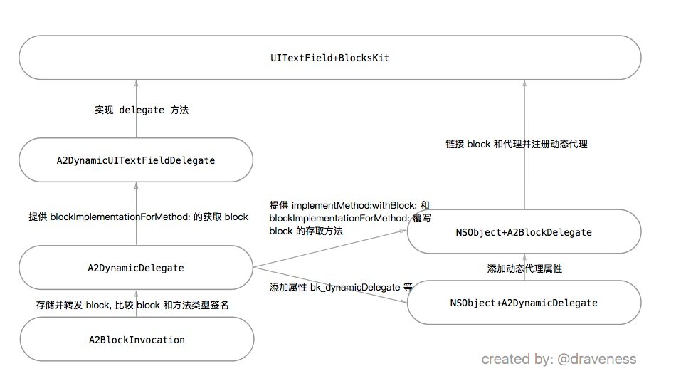

# 神奇的 BlocksKit （二）

Blog: [Draveness](http://draveness.me)

这篇文章『神奇的 BlocksKit』的第二部分，关于第一部分的内容在这里：

+ [神奇的 BlocksKit（一）](https://github.com/Draveness/iOS-Source-Code-Analyze/blob/master/contents/BlocksKit/神奇的%20BlocksKit%20（一）.md)
+ [神奇的 BlocksKit（二）](https://github.com/Draveness/iOS-Source-Code-Analyze/blob/master/contents/BlocksKit/神奇的%20BlocksKit%20（二）.md)


## 动态代理

动态代理这部分可以说是 BlocksKit 的精华。它**使用 block 属性替换 UIKit 中的所有能够通过代理完成的事件**，省略了设置代理和实现方法的过程，让对象自己实现代理方法，而且这个功能的实现是极其动态的。

> 其实不是对象自己实现的代理方法，只是框架为我们提供的便捷方法，不需要构造其它对象就能完成代理方法的实现，具体我们会在后面详细地解释。

下面是这部分几个关键的类：

+ `A2BlockInvocation` 的主要作用是存储和转发 block
+ `A2DynamicDelegate` 用来实现类的代理和数据源，它是 `NSProxy` 的子类
+ `NSObject+A2DynamicDelegate` 负责为返回 `bk_dynamicDelegate` 和 `bk_dynamicDataSource` 等 `A2DynamicDelegate` 类型的实例，为 `NSObject` 提供主要的接口
+ `NSObject+A2BlockDelegate` 提供了一系列接口将代理方法映射到 block 上
+ 其他的 UIKit 的分类提供对应的属性，并在对应的 `A2DynamicDelegate` 子类中实现代理方法

这里是我对这部分代码结构的理解：



这篇文成首先会从上到下对整个工作原理进行概述，然后再从底层到顶层详细地解释这个框架的机制和原理。

### 动态代理工作概述

在这里我们要对这部分的实现进行一个简单的概述，从上到下跟踪 BlocksKit 的调用过程。

以 `UIImagePickerController` 为例，因为这个文件中的代码较少，能省去很多不必要的实现细节。

在头文件中声明了两个属性，也就是 `UIImagePickerController` 代理方法的对应 block 属性：

```objectivec
@property (nonatomic，copy) void(^bk_didFinishPickingMediaBlock)(UIImagePickerController *，NSDictionary *);
@property (nonatomic，copy) void(^bk_didCancelBlock)(UIImagePickerController *);
```

然后在实现文件中动态生成这两个方法的存取方法

```objectivec
@dynamic bk_didFinishPickingMediaBlock;
@dynamic bk_didCancelBlock;
```

你可以看到在这个名为 `BlocksKit` 的分类中只添加了一个方法：

```objectivec
+ (void)load
{
	@autoreleasepool {
		[self bk_registerDynamicDelegate];
		[self bk_linkDelegateMethods:@{ @"bk_didFinishPickingMediaBlock": @"imagePickerController:didFinishPickingMediaWithInfo:",
                                        @"bk_didCancelBlock": @"imagePickerControllerDidCancel:" }];
	}
}
```

在 `load` 中实现这个方法，能够减少其中两个方法的调用次数，在 `autoreleasepool` 块中调用方法，使得其它地方的代码不会受到这里注册代理，链接代理方法中产生的对象的影响。

`bk_registerDynamicDelegate` 方法是 `NSObject+A2BlockDelegate` 分类中添加的方法，用于修改原有属性 `delegate` 方法的实现（**动态替换 delegate 方法实现**）。在这里就是与 `UIImagePickerController+BlocksKit` 处于同一文件下的 `A2DynamicUIImagePickerControllerDelegate`，先不说这个文件的功能，会在之后介绍。

在 `NSObject+A2DynamicDelegate` 分类中的 `bk_registerDynamicDelegateNamed:forProtocol:` 修改 `@selector(delegate)` 和 `@selector(setDelegate:)` 的实现，使用 `A2DynamicUIImagePickerControllerDelegate` 替换原有的 `delegate`

```objectivec
IMP setterImplementation = imp_implementationWithBlock(^(NSObject *delegatingObject，id delegate) {
	A2DynamicDelegate *dynamicDelegate = getDynamicDelegate(delegatingObject，protocol，infoAsPtr，YES);
	if ([delegate isEqual:dynamicDelegate]) {
		delegate = nil;
	}
	dynamicDelegate.realDelegate = delegate;
});

IMP getterImplementation = imp_implementationWithBlock(^(NSObject *delegatingObject) {
    return [delegatingObject bk_dynamicDelegateForProtocol:a2_protocolForDelegatingObject(delegatingObject，protocol)];
});
```

在获取 `delegate` 属性时，就会获取 `A2DynamicUIImagePickerControllerDelegate`， `realDelegate` 相当于原有的 `delegate` 属性，会在下面的小节中具体分析。

在 `load` 方法中调用下一个方法是 `bk_linkDelegateMethods:` 这个方法会把代理方法和对应的 block 属性链接起来，这样可以通过代理方法的选择子查找对应的 block。

```objectivec
IMP getterImplementation = imp_implementationWithBlock(^(NSObject *delegatingObject) {
	A2DynamicDelegate *delegate = getDynamicDelegate(delegatingObject，protocol，info，NO);
	return [delegate blockImplementationForMethod:selector];
});

IMP setterImplementation = imp_implementationWithBlock(^(NSObject *delegatingObject，id block) {
	A2DynamicDelegate *delegate = getDynamicDelegate(delegatingObject，protocol，info，YES);
	[delegate implementMethod:selector withBlock:block];
});
```

通过调用 `A2DynamicDelegate` 的实例方法 `blockImplementationForMethod:` 和 `implementMethod:withBlock:` 动态实现 block 的存取方法。

当代理方法 `imagePickerController:didFinishPickingMediaWithInfo:` 被调用时，因为 `A2DynamicUIImagePickerControllerDelegate` 是 `UIImagePickerController` 的代理，所以会调用它的方法：

```objectivec
- (void)imagePickerController:(UIImagePickerController *)picker didFinishPickingMediaWithInfo:(NSDictionary *)info {
	id realDelegate = self.realDelegate;
	if (realDelegate && [realDelegate respondsToSelector:@selector(imagePickerController:didFinishPickingMediaWithInfo:)])
		[realDelegate imagePickerController:picker didFinishPickingMediaWithInfo:info];

	void (^block)(UIImagePickerController *，NSDictionary *) = [self blockImplementationForMethod:_cmd];
	if (block) block(picker，info);
}
```

通过 `blockImplementationForMethod:` 方法获取在上面存储的 block，然后传入参数执行该代码块。

1. 在 `load` 方法注册动态代理并链接代理方法
2. 在运行时修改原有的 `delegate` 属性的存取方法，使用 `A2DynamicDelegate` 替换原有的 `delegate`，原有的 `delegate` 换为 `realDelegate`
3. 为 block 属性动态实现存取方法，返回对应 `A2DynamicDelegate` 子类中存储的 block
4. 在代理方法真正被调用时，查找 `realDelegate` 中是否对代理方法做出响应，无论是否响应，都通过选择子查找对应的 `block`，然后传入相应参数执行 block

### 自底向上分析动态代理的工作

我们已经自顶向下分析了 BlocksKit 的工作过程，也对这个部分有一个基本的了解，接下来我们将从底层到顶层分析整个 BlocksKit，我们再来看一下整个框架的结构图：


我们将以下面的顺序来依次介绍这些模块，其中的 `UITextField` 可以换成其它的类：

1. A2BlockInvocation
2. A2DynamicDelegate
3. NSObject+A2DynamicDelegate
4. A2DynamicUITextFieldDelegate
5. UITextField+BlocksKit

#### A2BlockInvocation

`A2BlockInvocation` 使用来对闭包，也就是 block 进行存储和转发的类。

先介绍这个的是因为 `A2BlockInvocation` 的功能比较底层，涉及的内容也都比较奇葩，所以想先简单介绍一下，避免之后一个类分几部分介绍。

在 Objective-C 中，每一个方法甚至 block 都是有类型签名的：

```objectivec
@interface NSMethodSignature : NSObject {

...

@property (readonly) NSUInteger numberOfArguments;

...

@property (readonly) const char *methodReturnType NS_RETURNS_INNER_POINTER;

...

@end
```

它们有返回类型、参数数字和参数类型等等。

##### Block 结构体

block 的签名没有哪个函数能够直接获取，它存储在 block 的结构体中，就像这样：

```objectivec
typedef NS_OPTIONS(int，BKBlockFlags) {
	BKBlockFlagsHasCopyDisposeHelpers = (1 << 25),
	BKBlockFlagsHasSignature          = (1 << 30)
};

typedef struct _BKBlock {
	__unused Class isa;
	BKBlockFlags flags;
	__unused int reserved;
	void (__unused *invoke)(struct _BKBlock *block，...);
	struct {
		unsigned long int reserved;
		unsigned long int size;
		// requires BKBlockFlagsHasCopyDisposeHelpers
		void (*copy)(void *dst，const void *src);
		void (*dispose)(const void *);
		// requires BKBlockFlagsHasSignature
		const char *signature;
		const char *layout;
	} *descriptor;
	// imported variables
} *BKBlockRef;
```

这部分其实就是 block 实际存储在内存中的数据接口，可以在 runtime 中的源代码中看到这里的代码。

##### typeSignatureForBlock

上面的 `signature` 就是 block 的签名，下面实现方法来获取这个签名

```objectivec
+ (NSMethodSignature *)typeSignatureForBlock:(id)block __attribute__((pure，nonnull(1)))
{
	BKBlockRef layout = (__bridge void *)block;

	// 如果 block 没有签名直接返回空
	if (!(layout->flags & BKBlockFlagsHasSignature))
		return nil;

	void *desc = layout->descriptor;
	desc += 2 * sizeof(unsigned long int);

	if (layout->flags & BKBlockFlagsHasCopyDisposeHelpers)
		desc += 2 * sizeof(void *);

	if (!desc)
		return nil;

	const char *signature = (*(const char **)desc);

	return [NSMethodSignature signatureWithObjCTypes:signature];
}
```

知道了这个方法的作用再理解它的实现就非常简单了，根据`flag` 来移动指针，最终 `signature` 所在的内存空间。

>  Unlike a typical method signature，a block type signature has no `self` (`'@'`)
 or `_cmd` (`':'`) parameter，but instead just one parameter for the block itself
 (`'@?'`)。

在这里所涉及的 `@`、`:` 和`@?` 可以看这里的文档 [类型编码](https://developer.apple.com/library/mac/documentation/Cocoa/Conceptual/ObjCRuntimeGuide/Articles/ocrtTypeEncodings.html)

在一般的方法签名中 block 的类型签名是没有 `self` (`'@'`) 或者 `_cmd` (`':'`) 的，只有一个参数代表 block 自己 (`'@?'`).

+ `^(UIActionSheet *) {}`
	+ 参数类型：`@?(@"UIActionSheet")`
	+ 返回类型：`v`
+ `- (void)willPresentActionSheet:(UIActionSheet *)actionSheet`
	+ 参数类型：`@:@`
	+ 返回类型：`v`

为什么要把 `@"UIActionSheet"` 标记上括号？因为它们属于同一个参数。

同时因为 `UIActionSheet` 也是 `id` 类型，所以它的类型编码也是 `@`。

当调用 `initWithBlock:` 方法时，会先调用上面说的方法 `typeSignatureForBlock:` 获取 block 的类型签名：

```objectivec
- (instancetype)initWithBlock:(id)block
{
	NSParameterAssert(block);
	NSMethodSignature *blockSignature = [[self class] typeSignatureForBlock:block];
	NSMethodSignature *methodSignature = [[self class] methodSignatureForBlockSignature:blockSignature];
	NSAssert(methodSignature，@"Incompatible block: %@"，block);
	return (self = [self initWithBlock:block methodSignature:methodSignature blockSignature:blockSignature]);
}
```

##### methodSignatureForBlockSignature

然后调用 `methodSignatureForBlockSignature:` 方法构造一个可以兼容的方法签名：

```objectivec
+ (NSMethodSignature *)methodSignatureForBlockSignature:(NSMethodSignature *)original
{
	#1: 检查方法签名的参数，省略

	NSMutableString *signature = [[NSMutableString alloc] initWithCapacity:original.numberOfArguments + 1];

	const char *retTypeStr = original.methodReturnType;
	// 返回类型，id 类型(self @)，选择子类型(SEL :)
	[signature appendFormat:@"%s%s%s"，retTypeStr，@encode(id)，@encode(SEL)];
	// signature = (返回类型)@:
	
	for (NSUInteger i = 1; i < original.numberOfArguments; i++) {
		const char *typeStr = [original getArgumentTypeAtIndex:i];
		NSString *type = [[NSString alloc] initWithBytesNoCopy:(void *)typeStr length:strlen(typeStr) encoding:NSUTF8StringEncoding freeWhenDone:NO];
		[signature appendString:type];
	}
	
	// signature = (返回类型)@:(参数类型)

	return [NSMethodSignature signatureWithObjCTypes:signature.UTF8String];
}
```

具体的实现细节我们就省略了，它的工作原理是把 `@?(@"UIActionSheet")` 类型签名转换成 `@:@`，然后返回方法签名。

关于代码中的 `@encode` 可以看这里 [声明方法的属性](https://gcc.gnu.org/onlinedocs/gcc-3.2/gcc/Function-Attributes.html)

##### isSignature:compatibleWithSignature:

在这个类中最后一个重要的方法就是 `isSignature:compatibleWithSignature:`，这个方法是判断传入的 block 和方法的类型签名是否兼容。

```objectivec
+ (BOOL)isSignature:(NSMethodSignature *)signatureA compatibleWithSignature:(NSMethodSignature *)signatureB __attribute__((pure))
{
	#1: 参数检查，省略
	
	...
	
	#2: 判断返回值是否相同，省略
	if (signatureA.methodReturnType[0] != signatureB.methodReturnType[0]) return NO;
	
	#3: 设置 methodSignature 和 blockSignature
	
	...
	
	#4: 比较 methodSignature 和 blockSignature

	return YES;
}
```

第 `#3` 部分设置 `methodSignature` 和 `blockSignature`。

因为**方法签名会比 block 类型签名多一个默认参数**，所以，这里会将参数多的设置为 `methodSignature`，如果把为 block 类型签名的设置给了 `methodSignature` 也不会有问题，在 `#4` 部分会判断出来并返回 `NO`。

> 方法默认参数：`self，SEL`，block 默认类型参数: `block`

```objectivec
NSMethodSignature *methodSignature = nil，*blockSignature = nil;
if (signatureA.numberOfArguments > signatureB.numberOfArguments) {
    methodSignature = signatureA;
    blockSignature = signatureB;
} else if (signatureB.numberOfArguments > signatureA.numberOfArguments) {
    methodSignature = signatureB;
    blockSignature = signatureA;
} else {
    return NO;
}
```

第 `#4` 部分就是一次比较各个类型签名，也没什么复杂的，需要注意的就是选择正确的 index

```objectivec
NSUInteger numberOfArguments = methodSignature.numberOfArguments;
for (NSUInteger i = 2; i < numberOfArguments; i++) {
    if ([methodSignature getArgumentTypeAtIndex:i][0] != [blockSignature getArgumentTypeAtIndex:i - 1][0])
        return NO;
}
```

##### invokeWithInvocation:returnValue:outReturnValue:

这一节主要介绍的是，当 `A2BlockInvocation` 对象具体需要执行某一个 `NSInvocation` 时是如何工作的，其实这个方法还是很容易理解的。

```objectivec
- (BOOL)invokeWithInvocation:(NSInvocation *)outerInv returnValue:(out NSValue **)outReturnValue setOnInvocation:(BOOL)setOnInvocation
{
	#1: 参数以及类型签名是否匹配的检查，省略

	NSInvocation *innerInv = [NSInvocation invocationWithMethodSignature:self.blockSignature];

	#2: 设置 innerInv 参数
	
	...

	[innerInv invokeWithTarget:self.block];

	#3: 获取返回值

	free(argBuf);

	return YES;
}
```

第 `#2`、`#3` 部分的代码是为了设置 `innerInv` 的参数，获取返回值：

```objectivec
void *argBuf = NULL;

for (NSUInteger i = 2; i < sig.numberOfArguments; i++) {
	const char *type = [sig getArgumentTypeAtIndex:i];
	NSUInteger argSize;
	NSGetSizeAndAlignment(type，&argSize，NULL);

	if (!(argBuf = reallocf(argBuf，argSize))) {
		return NO;
	}

	[outerInv getArgument:argBuf atIndex:i];
	[innerInv setArgument:argBuf atIndex:i - 1];
}

// 执行 block

NSUInteger retSize = sig.methodReturnLength;
if (retSize) {
    if (outReturnValue || setOnInvocation) {
        if (!(argBuf = reallocf(argBuf，retSize))) {
            return NO;
        }

        [innerInv getReturnValue:argBuf];

        if (setOnInvocation) {
            [outerInv setReturnValue:argBuf];
        }

        if (outReturnValue) {
            *outReturnValue = [NSValue valueWithBytes:argBuf objCType:sig.methodReturnType];
        }
    }
} else {
    if (outReturnValue) {
        *outReturnValue = nil;
    }
}
```

`A2BlockInvocation` 这一节就到这里了，接下来要说一下 `A2DynamicDelegate`。

#### A2DynamicDelegate

`A2DynamicDelegate` 可以说是 BlocksKit 实现动态代理的关键，是这个框架中很重要的类，它通过 block 实现了类的代理和数据源等协议。

`A2DynamicDelegate` 它的父类是 `NSProxy`，而 `NSProxy` 出现的目的就是为了代理一个对象的。

```objectivec
@interface NSProxy <NSObject>
```

我们不具体解释这里的 `NSProxy`，如果想要更详细的信息，请看[这里](https://developer.apple.com/library/prerelease/ios/documentation/Cocoa/Reference/Foundation/Classes/NSProxy_Class/index.html)。

`A2DynamicDelegate` 作为 `NSProxy` 的子类，必须实现 `forwardInvocation:` `methodSignatureForSelector:` 方法进行对象转发，这是在苹果官方文档中说明的。

##### 覆写必要的方法 methodSignatureForSelector: 和 forwardInvocation:

我们首先来看一下 `methodSignatureForSelector:`，它为一个选择子返回合适的方法签名：

```objectivec
- (NSMethodSignature *)methodSignatureForSelector:(SEL)aSelector
{
	A2BlockInvocation *invocation = nil;
	if ((invocation = [self.invocationsBySelectors bk_objectForSelector:aSelector]))
		return invocation.methodSignature;
	else if ([self.realDelegate methodSignatureForSelector:aSelector])
		return [self.realDelegate methodSignatureForSelector:aSelector];
	else if (class_respondsToSelector(object_getClass(self)，aSelector))
		return [object_getClass(self) methodSignatureForSelector:aSelector];
	return [[NSObject class] methodSignatureForSelector:aSelector];
}
```

这里的逻辑如下：

1. 判断 `invocationsBySelectors` 属性中是否存储了该选择子对应的 `A2BlockInvocation`，直接返回这个 `invocation` 对象的类型签名，也就是说自己实现了该选择子对应的方法
2. 在真正的 `realDelegate` 中查找原有的代理(不是当前的动态代理 `A2DynamicDelegate`)是否实现了该选择子，并返回方法签名

	> 在这里的 `realDelegate` 是对象真正的代理，例如 
	
	```objectivec
	self.tableView.delegate = [[UIViewController alloc] init];
	```
	
	其中 `realDelegate` 是视图控制器，但是在我们设置时，不需要这么设置 
	
	```objectivec
	self.tableView.realDelegate = [[UIViewController alloc] init];
	```
	
	因为在 `NSObject+A2BlockDelegate` 中会进行**方法调剂**，修改原有方法的实现，每次在设置 `delegate` 时，会将这个值设置传到 `realDelegate` 中。
	
3. 在自己的类中查找该方法的选择子
4. 如果上面三个步骤都没有得到相应，那么调用 `NSObject` 对象的 `methodSignatureForSelector:` 方法获取方法签名，当然可能返回空值

====

`forwardInvocation:` 的实现其实跟上面的方法的思路差不多

```objectivec
- (void)forwardInvocation:(NSInvocation *)outerInv
{
	SEL selector = outerInv.selector;
	A2BlockInvocation *innerInv = nil;
	if ((innerInv = [self.invocationsBySelectors bk_objectForSelector:selector])) {
		[innerInv invokeWithInvocation:outerInv];
	} else if ([self.realDelegate respondsToSelector:selector]) {
		[outerInv invokeWithTarget:self.realDelegate];
	}
}
```

1. 判断 `invocationsBySelectors` 属性中是否存储了该选择子对应的 `A2BlockInvocation`，然后调用 `invokeWithInvocation:` 传入 `outerInv` 转发这个方法，最终会调用 `- [A2BlockInvocation invokeWithInvocation:returnValue:setOnInvocation:]
`

2. 判断 `realDelegate` 是否实现了该方法，如果真正的代理能做出响应，将方法转发给 `realDelegate`

##### Block 实现方法 blockImplementationForMethod: 和 implementMethod:withBlock:

这部分的代码其实相当于平时的 Getter/Setter 

```objectivec
- (id)blockImplementationForMethod:(SEL)selector
{
	A2BlockInvocation *invocation = nil;
	if ((invocation = [self.invocationsBySelectors bk_objectForSelector:selector]))
		return invocation.block;
	return NULL;
}
```

因为 block 都是在 `A2BlockInvocation` 中封装的，所以在通过选择子查找 block 的时候，实际上是查找对应的 `A2BlockInvocation`，然后返回它的 block。

```objectivec
- (void)implementMethod:(SEL)selector withBlock:(id)block
{

	#1: 参数检查，省略

	if (!block) {
		[self.invocationsBySelectors bk_removeObjectForSelector:selector];
		return;
	}
	
	#2: 实例化 A2BlockInvocation

	[self.invocationsBySelectors bk_setObject:inv forSelector:selector];
}
```

如果能获取到方法的描述，那么就可以得到对应的方法签名，然后调用不同的初始化方法实例一个 `A2Blockinvocation` 对象。

```objectivec
	struct objc_method_description methodDescription = protocol_getMethodDescription(self.protocol，selector，YES，!isClassMethod);
	if (!methodDescription.name) methodDescription = protocol_getMethodDescription(self.protocol，selector，NO，!isClassMethod);
	
	A2BlockInvocation *inv = nil;
	if (methodDescription.name) {
	    NSMethodSignature *protoSig = [NSMethodSignature signatureWithObjCTypes:methodDescription.types];
	    inv = [[A2BlockInvocation alloc] initWithBlock:block methodSignature:protoSig];
	} else {
	    inv = [[A2BlockInvocation alloc] initWithBlock:block];
	}
```

这两个方法的实现，主要目的是**为子类实现代理方法提供支持**。

#### NSObject+A2DynamicDelegate 为对象添加动态代理

这个分类是为所有的对象提供简单快捷的接口找到对应的动态代理:

```objectivec
@property (readonly，strong) id bk_dynamicDataSource;
@property (readonly，strong) id bk_dynamicDelegate;
- (id)bk_dynamicDelegateForProtocol:(Protocol *)protocol;
```

以 `UITableView` 为例:

+ 访问 `tableView.bk_dynamicDataSource` 那么它就会寻找 `A2DynamicUITableViewDataSource` 的对象
+ 访问 `tableView.bk_dynamicDelegate` 那么它就会寻找 `A2DynamicUITableViewDelegate` 的对象

这些对象都是在后台进程中惰性初始化的：

```objectivec
- (id)bk_dynamicDelegateWithClass:(Class)cls forProtocol:(Protocol *)protocol
{
	__block A2DynamicDelegate *dynamicDelegate;

	dispatch_sync(a2_backgroundQueue()，^{
		dynamicDelegate = objc_getAssociatedObject(self，(__bridge const void *)protocol);

		if (!dynamicDelegate)
		{
			dynamicDelegate = [[cls alloc] initWithProtocol:protocol];
			objc_setAssociatedObject(self，(__bridge const void *)protocol，dynamicDelegate，OBJC_ASSOCIATION_RETAIN_NONATOMIC);
		}
	});

	return dynamicDelegate;
}
```

#### NSObject+A2BlockDelegate

我们在概述的一部分实际上已经接触过这个分类里面的重要方法 `bk_linkProtocol:methods:`，它动态实现所有添加的 block 属性的存取方法，比如说 `bk_didFinishPickingMediaBlock` `bk_didCancelBlock`

```objectivec
		IMP getterImplementation = imp_implementationWithBlock(^(NSObject *delegatingObject) {
			A2DynamicDelegate *delegate = getDynamicDelegate(delegatingObject，protocol，info，NO);
			return [delegate blockImplementationForMethod:selector];
		});

		IMP setterImplementation = imp_implementationWithBlock(^(NSObject *delegatingObject，id block) {
			A2DynamicDelegate *delegate = getDynamicDelegate(delegatingObject，protocol，info，YES);
			[delegate implementMethod:selector withBlock:block];
		});
```

方法调剂之后的存取方法如下

+ getter: 以 selector 为键在动态代理中查找对应的 block
+ setter: 以 selector 也就是代理方法为键，通过 `implementMethod:withBlock:` 方法以 `A2BlockInvocation` 的形式存储 block

另一个方法 `bk_registerDynamicDelegateNamed:forProtocol:`，它主要功能就是修改 getter 和 setter 方法，将原有的 `delegate` 转发到 `realDelegate`，修改原有的 `delegate` 的实现，实现的方法就是喜闻乐见的方法调节：

```objectivec
	IMP setterImplementation = imp_implementationWithBlock(^(NSObject *delegatingObject，id delegate) {
		A2DynamicDelegate *dynamicDelegate = getDynamicDelegate(delegatingObject，protocol，infoAsPtr，YES);
		if ([delegate isEqual:dynamicDelegate]) {
			delegate = nil;
		}
		dynamicDelegate.realDelegate = delegate;
	});

	IMP getterImplementation = imp_implementationWithBlock(^(NSObject *delegatingObject) {
		return [delegatingObject bk_dynamicDelegateForProtocol:a2_protocolForDelegatingObject(delegatingObject，protocol)];
	});
```

注意，在这里省略了一些与脉络无关的实现细节，在调剂过后 `delegate` 的存取方法如下：

+ getter：返回一个动态代理对象
+ setter：设置代理并不会改变 `delegate` 中存储的动态代理，只会修改 `realDelegate`

我们现在有了通过 runtime 实现 block 的 getter/setter，修改原有的 `delegate` 属性的方法将对象的代理设置为动态代理，接下来要在子类化动态代理，使用动态代理的子类实现所有的代理方法。

#### A2DynamicUITextFieldDelegate

`A2DynamicUITextFieldDelegate` 和 `UITextField+BlocksKit` 位于统一文件下，它是一个私有类，我们选取其中一个简单的代理方法：

```objectivec
- (void)textFieldDidEndEditing:(UITextField *)textField
{
	id realDelegate = self.realDelegate;
	if (realDelegate && [realDelegate respondsToSelector:@selector(textFieldDidEndEditing:)])
		[realDelegate textFieldDidEndEditing:textField];
	void (^block)(UITextField *) = [self blockImplementationForMethod:_cmd];
	if (block)
		block(textField);
}
```

1. 当 `realDelegate` 实现了该代理方法时，首先调用代理的方法
2. 当该代理方法对应的 block 存在的话，也会调用该 block


#### UITextField+BlocksKit 分类和 load 方法

在最后就是对 `NSObject+A2BlockDelegate` 分类中方法的调用

```objectivec
+ (void)load {
    [self bk_registerDynamicDelegate];
    [self bk_linkDelegateMethods: @{
        @"bk_shouldBeginEditingBlock": @"textFieldShouldBeginEditing:",
        @"bk_didBeginEditingBlock": @"textFieldDidBeginEditing:",
        @"bk_shouldEndEditingBlock": @"textFieldShouldEndEditing:",
        @"bk_didEndEditingBlock" : @"textFieldDidEndEditing:",
        @"bk_shouldChangeCharactersInRangeWithReplacementStringBlock" : @"textField:shouldChangeCharactersInRange:replacementString:",
        @"bk_shouldClearBlock" : @"textFieldShouldClear:",
        @"bk_shouldReturnBlock" : @"textFieldShouldReturn:",
    }];
}
```

为什么在 `load` 方法中调用这两个方法？原因有两个：

+ 每个文件中的该方法都只会调用一次，减少了调用的次数
+ 该方法只会在文件被引入 `ObjC 运行时` 的时候调用

其中的 `autoreleasepool` 的作用在上面已经介绍过了，它使得其它地方的代码不会受到这里注册代理，链接代理方法中产生的对象的影响。

`UIKit+BlocksKit` 这些分类的另一作用就是提供 block 回调接口，声明属性，然后使用 `@dynamic` 表明属性是动态生成的。

```objectivec
@property (nonatomic，copy，nullable) BOOL(^bk_shouldBeginEditingBlock)(UITextField *textField);
@property (nonatomic，copy，nullable) void(^bk_didBeginEditingBlock)(UITextField *textField);

...

@dynamic bk_shouldBeginEditingBlock，bk_didBeginEditingBlock ...;
```

## End

到这里对于 BlocksKit 的实现机制就基本上已经看完了。我们再来看一下 整个 BlocksKit 的结构图：


我写这篇文章大约用了七天的时间，如果你对其中的内容有些疑问，可以发邮件或者在下面留言。

+ [神奇的 BlocksKit（一）](https://github.com/Draveness/iOS-Source-Code-Analyze/blob/master/contents/BlocksKit/神奇的%20BlocksKit%20（一）.md)
+ [神奇的 BlocksKit（二）](https://github.com/Draveness/iOS-Source-Code-Analyze/blob/master/contents/BlocksKit/神奇的%20BlocksKit%20（二）.md)

<iframe src="http://ghbtns.com/github-btn.html?user=draveness&type=follow&size=large" height="30" width="240" frameborder="0" scrolling="0" style="width:240px; height: 30px;" allowTransparency="true"></iframe>

Follow: [@Draveness](https://github.com/Draveness)

