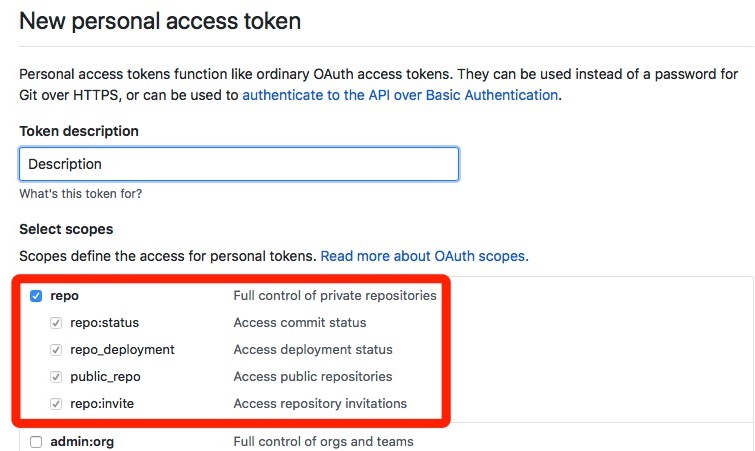

# 如何自动初始化 Gitalk/Gitment 评论

之前的博客一直都使用 Disqus 作为评论系统，然后因为 Disqus 在国内无法访问，很多读者都只能通过邮件的方式咨询一些问题，昨天觉得长痛不如短痛，直接将博客的评论迁移到了 [Gitalk](https://github.com/gitalk/gitalk)，最开始选择了使用 Gitment 作为评论系统，但是由于其开发者很久没有维护、代码七个月也没有更新，所以就选择了有更多人维护的 Gitalk 作为目前博客的评论系统。

无论是 Gitalk 还是 Gitment 都只能手动初始化所有文章的评论或者一个一个点开界面，作者觉得这件事情非常麻烦，所以手动抓了一下 Gitalk 和 Gitment 在初始化评论时发出的网络请求后写了一个用于自动化初始评论的脚本。

## 获得权限

在使用该脚本之前首先要在 GitHub 创建一个新的 [Personal access tokens](https://github.com/settings/tokens)，选择 `Generate new token` 后，在当前的页面中为 Token 添加所有 Repo 的权限：



在这里创建之后，点击界面最下的面 `Generate token` 按钮获得一个新的 token：


> 作者已经把这个 token 删掉了，不要想着用这个 token 就能获得到作者 GitHub 的权限。

## 脚本

作者在抓取了 Gitalk 和 Gitment 的 API 请求发现，这两个评论服务是**通过 GitHub 提供的 API 创建含有相应标签的 issue**，所以我们应该也可以直接使用 GitHub 的 API 创建所有博客文章对应的 issue，这与通过评论插件创建 issue 是完全一样的，在创建之后无论是 Gitalk 还是 Gitment 都可以通过对应的标签直接在仓库中找到对应的 issue 了。

本文中提供的自动化脚本使用的是 Ruby 代码，请确定自己的机器上已经安装了 Ruby，并且使用如下的命令安装脚本所需要的所有依赖：

```ruby
$ sudo gem install faraday activesupport sitemap-parser
```

### 使用 sitemap 文件

如果我们使用的博客服务是 Jekyll，那么就可以通过 [jekyll-sitemap](https://github.com/jekyll/jekyll-sitemap) 插件为博客创建对应的 sitemap 文件，例如：https://draveness.me/sitemap.xml。

有 sitemap 文件之后就非常好办了，在任意目录下创建 `comment.rb` 文件后，将下面的代码粘贴到文件中：

```ruby
username = "draveness" # GitHub 用户名
new_token = "xxxxxxx"  # GitHub Token
repo_name = "github-comments-repo" # 存放 issues
sitemap_url = "https://draveness.me/sitemap.xml" # sitemap
kind = "Gitalk" # "Gitalk" or "gitment"

require 'open-uri'
require 'faraday'
require 'active_support'
require 'active_support/core_ext'
require 'sitemap-parser'

sitemap = SitemapParser.new sitemap_url
urls = sitemap.to_a

conn = Faraday.new(:url => "https://api.github.com/repos/#{username}/#{repo_name}/issues") do |conn|
  conn.basic_auth(username, token)
  conn.adapter  Faraday.default_adapter
end

urls.each_with_index do |url, index|
  title = open(url).read.scan(/<title>(.*?)<\/title>/).first.first.force_encoding('UTF-8')
  response = conn.post do |req|
    req.body = { body: url, labels: [kind, url], title: title }.to_json
  end
  puts response.body
  sleep 15 if index % 20 == 0
end
```

在这里有 5 个配置项，分别是 GitHub 用户名、在上一步获得的 Token、存放 issues 的仓库、sitemap 的地址以及最后你在博客中使用了哪个评论插件，不同的插件拥有标签，可以选择 `"Gitalk"` 或者 `"gitment"`，对于其他评论的插件应该如何设置，作者就并不清楚了。

> 需要注意的是，在使用上述的代码为博客创建 issue 时，会为博客中 sitemap 包含的**全部界面创建对应的 issue**，其中包括例如首页、标签界面等，这对于作者来说不是太大的问题，但是对这个问题敏感的读者可以使用下一小节中的代码。

在配置完成后就可以在命令行中的当前目录下输入以下命令：

```ruby
$ ruby comment.rb
```

然后当前脚本就会运行并初始化所有的评论了。

### 无 sitemap 或自定义

如果博客中不包含任何的 sitemap 文件，或者想要手动选择想要初始化的一些文章其实也是可以的，可以使用简化的代码**批量初始化指定博客**的评论：

```ruby
username = "draveness" # GitHub 用户名
new_token = "xxxxxxx"  # GitHub Token
repo_name = "github-comments-repo" # 存放 issues
kind = "Gitalk" # "Gitalk" or "gitment"
urls = ["xxxxx"]

require 'open-uri'
require 'faraday'
require 'active_support'
require 'active_support/core_ext'

conn = Faraday.new(:url => "https://api.github.com/repos/#{username}/#{repo_name}/issues") do |conn|
  conn.basic_auth(username, token)
  conn.adapter  Faraday.default_adapter
end

urls.each_with_index do |url, index|
  title = open(url).read.scan(/<title>(.*?)<\/title>/).first.first.force_encoding('UTF-8')
  response = conn.post do |req|
    req.body = { body: url, labels: [kind, url], title: title }.to_json
  end
  puts response.body
  sleep 15 if index % 20 == 0
end
```

在这里就需要**手动填入需要初始化文章的数组**了，当然如果你有 sitemap 文件，其实可以在 irb 中运行以下的代码得到全部的文章数组，再手动从其中剔除不想要创建评论的页面：

```ruby
$ irb
2.3.3 :001 > require 'sitemap-parser'
 => true
2.3.3 :002 > sitemap_url = "https://draveness.me/sitemap.xml"
 => "https://draveness.me/sitemap.xml"
2.3.3 :003 > SitemapParser.new(sitemap_url).to_a
 => ["https://draveness.me/prolog-ji-chu-1", "https://draveness.me/prolog-pi-pei-2", "https://draveness.me/prolog-di-gui-3", ..., "https://draveness.me/dynamo"]
 ```

当我们将上述结果中不想要创建评论的文章删除之后，将结果填到 `urls` 这个临时变量中，运行下面的命令就可以了。

```ruby
$ ruby comment.rb
```

## 其他

由于 GitHub 会脚本的请求会做一定的限制，所以在连续请求接口，批量创建 issues 的过程中可能会出现创建失败的情况，你可以通过命令中打印的结果看到，不过在脚本中已经在每 20 次创建时休眠 15 秒，所以应该也不会遇到这个问题。

另外，GitHub 中 issue 的可以创建但是并不能删除，所以在配置时请一定检查好所有的配置项是否正确，否则会批量创建一些无用的 issue 虽然没有什么影响，但是看起来非常头疼。

## 总结

手动初始化每一篇文章的评论确实是非常痛苦的，放弃 Disqus 确实也考虑了比较久的事件，Disqus 中也确实有一些有价值的评论，但是本着长痛不如短痛的原则，还是选择迁移到 Gitalk，当然作者也希望 Gitalk 官方能够提供更好地使用体验。

