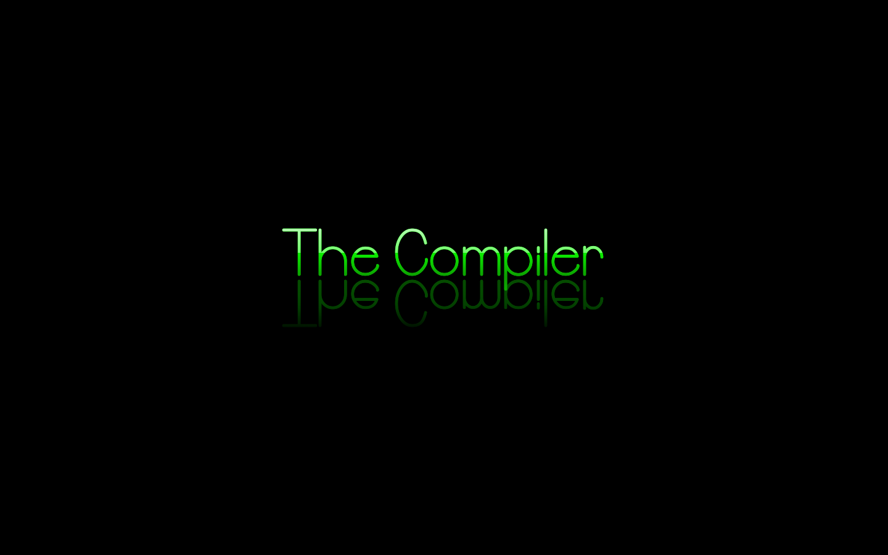
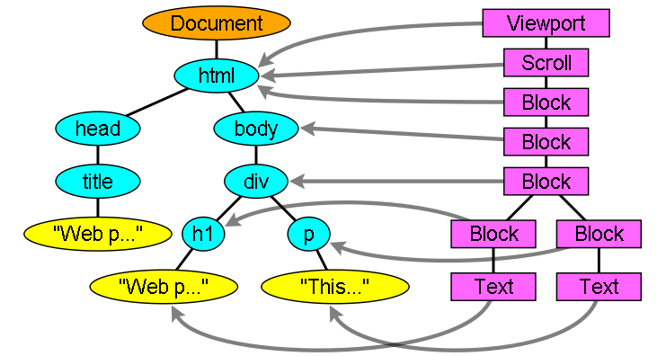
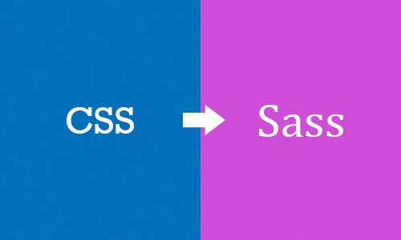
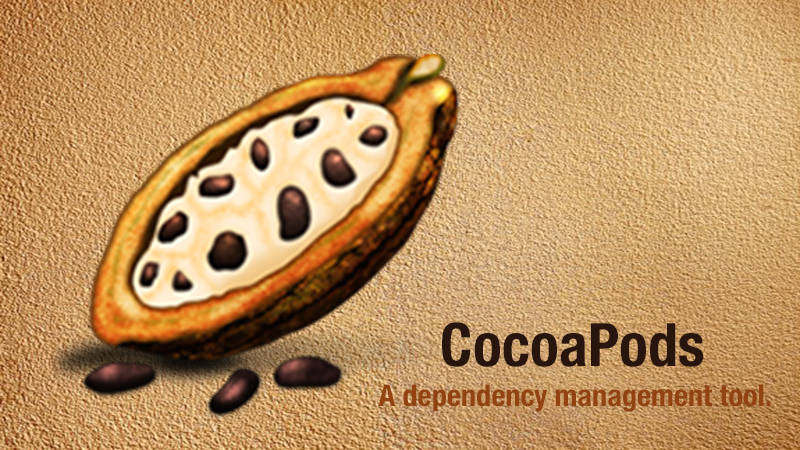
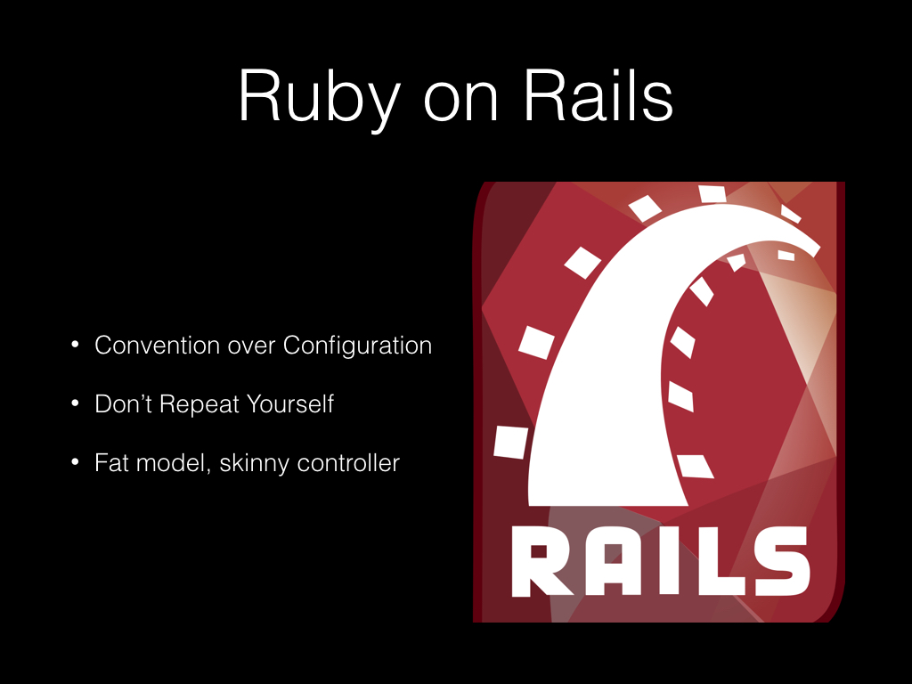

# 谈谈 DSL 以及 DSL 的应用（以 CocoaPods 为例）

> 因为 DSL 以及 DSL 的界定本身就是一个比较模糊的概念，所以难免有与他人观点意见相左的地方，如果有不同的意见，我们可以具体讨论。

最近在公司做了一次有关 DSL 在 iOS 开发中的应用的分享，这篇文章会简单介绍这次分享的内容。

这次文章的题目虽然是谈谈 DSL 以及 DSL 的应用，不过文章中主要侧重点仍然是 DSL，会简单介绍 DSL 在 iOS 开发中（CocoaPods）是如何应用的。

## 没有银弹？

1987 年，IBM 大型电脑之父 Fred Brooks 发表了一篇关于软件工程中的论文 [No Silver Bullet—Essence and Accidents of Software Engineering](No Silver Bullet—Essence and Accidents of Software Engineering) 文中主要围绕这么一个观点：没有任何一种技术或者方法能使软件工程的生产力在十年之内提高十倍。

> There is no single development, in either technology or management technique, which by itself promises even one order-of-magnitude improvement within a decade in productivity, in reliability, in simplicity.

时至今日，我们暂且不谈银弹在软件工程中是否存在（~~这句话在老板或者项目经理要求加快项目进度时，还是十分好用的~~），作为一个开发者也不是很关心这种抽象的理论，我们更关心的是开发效率能否有实质的提升。


而今天要介绍的 DSL 就可以真正的提升生产力，减少不必要的工作，在一些领域帮助我们更快的实现需求。

## DSL 是什么？

笔者是在两年以前，在大一的一次分享上听到 DSL 这个词的，但是当时并没有对这个名词有多深的理解与认识，听过也就忘记了，但是最近做的一些开源项目让我重新想起了 DSL，也是这次分享题目的由来。

DSL 其实是 Domain Specific Language 的缩写，中文翻译为*领域特定语言*（下简称 DSL）；而与 DSL 相对的就是 GPL，这里的 GPL 并不是我们知道的开源许可证，而是 General Purpose Language 的简称，即*通用编程语言*，也就是我们非常熟悉的 Objective-C、Java、Python 以及 C 语言等等。

[Wikipedia](https://en.wikipedia.org/wiki/Domain-specific_language) 对于 DSL 的定义还是比较简单的：

> A specialized computer language designed for a specific task.
> 
> 为了解决某一类任务而专门设计的计算机语言。

与 GPL 相对，DSL 与传统意义上的通用编程语言 C、Python 以及 Haskell 完全不同。通用的计算机编程语言是可以用来编写任意计算机程序的，并且能表达任何的**可被计算**的逻辑，同时也是 [图灵完备](https://en.wikipedia.org/wiki/Turing_completeness) 的。

> 这一小节中的 DSL 指外部 DSL，下一节中会介绍 [内部 DSL/嵌入式 DSL](#embedded-dsl嵌入式-dsl)

但是在里所说的 DSL 并不是图灵完备的，它们的**表达能力有限**，只是在特定领域解决特定任务的。

> A computer programming language of limited expressiveness focused on a particular domain.

另一个世界级软件开发大师 Martin Fowler 对于领域特定语言的定义在笔者看来就更加具体了，**DSL 通过在表达能力上做的妥协换取在某一领域内的高效**。

而有限的表达能力就成为了 GPL 和 DSL 之间的一条界限。

### 几个栗子

最常见的 DSL 包括 Regex 以及 HTML & CSS，在这里会对这几个例子进行简单介绍

+ Regex
	+ 正则表达式仅仅指定了字符串的 pattern，其引擎就会根据 pattern 判断当前字符串跟正则表达式是否匹配。
    
+ SQL
	+ SQL 语句在使用时也并没有真正的执行，我们输入的 SQL 语句最终还要交给数据库来进行处理，数据库会从 SQL 语句中**读取**有用的信息，然后从数据库中返回使用者期望的结果。
+ HTML & CSS
	+ HTML 和 CSS 只是对 Web 界面的结构语义和样式进行描述，虽然它们在构建网站时非常重要，但是它们并非是一种编程语言，正相反，我们可以认为 HTML 和 CSS 是在 Web 中的领域特定语言。

### Features

上面的几个🌰明显的缩小了通用编程语言的概念，但是它们确实在自己领域表现地非常出色，因为这些 DSL 就是根据某一个特定领域的特点塑造的；而通用编程语言相比领域特定语言，在设计时是为了解决更加抽象的问题，而关注点并不只是在某一个领域。

上面的几个例子有着一些共同的特点：

+ 没有计算和执行的概念；
+ 其本身并不需要直接表示计算；
+ 使用时只需要声明规则、事实以及某些元素之间的层级和关系；

虽然了解了 DSL 以及 DSL 的一些特性，但是，到目前为止，我们对于如何构建一个 DSL 仍然不是很清楚。

### 构建 DSL

DSL 的构建与编程语言其实比较类似，想想我们在重新实现编程语言时，需要做那些事情；实现编程语言的过程可以简化为定义语法与语义，然后实现编译器或者解释器的过程，而 DSL 的实现与它也非常类似，我们也需要对 DSL 进行语法与语义上的设计。



总结下来，实现 DSL 总共有这么两个需要完成的工作：

1. 设计语法和语义，定义 DSL 中的元素是什么样的，元素代表什么意思
2. 实现 parser，对 DSL 解析，最终通过解释器来执行

以 HTML 为例，HTML 中所有的元素都是包含在尖括号 `<>` 中的，尖括号中不同的元素代表了不同的标签，而这些标签会被浏览器**解析**成 DOM 树，再经过一系列的过程调用 Native 的图形 API 进行绘制。



再比如，我们使用下面这种方式对一个模型进行定义，实现一个 ORM 领域的 DSL：

```ruby
define :article do
  attr :name
  attr :content
  attr :upvotes, :int
  
  has_many :comments
end
```

在上面的 DSL 中，使用 `define` 来定义一个新的模型，使用 `attr` 来为模型添加属性，使用 `has_many` 建立数据模型中的一对多关系；我们可以使用 DSL 对这段“字符串”进行解析，然后交给代码生成器来生成代码。

```swift
public struct Article {
    public var title: String
    public var content: String
    public var createdAt: Date
    
    public init(title: String, content: String, createdAt: Date)

    static public func new(title: String, content: String, createdAt: Date) -> Article
    static public func create(title: String, content: String, createdAt: Date) -> Article?
    ...
}
```

这里创建的 DSL 中的元素数量非常少，只有 `define` `attr` 以及 `has_many` 等几个关键字，但是通过这几个关键字就可以完成在模型层需要表达的绝大部分语义。

### 设计原则和妥协

DSL 最大的设计原则就是**简单**，通过简化语言中的元素，降低使用者的负担；无论是 Regex、SQL 还是 HTML 以及 CSS，其说明文档往往只有几页，非常易于学习和掌握。但是，由此带来的问题就是，DSL 中缺乏抽象的概念，比如：模块化、变量以及方法等。

> 抽象的概念并不是某个领域所关注的问题，就像 Regex 并不需要有模块、变量以及方法等概念。

由于抽象能力的缺乏，在我们的项目规模变得越来越大时，DSL 往往满足不了开发者的需求；我们仍然需要编程语言中的模块化等概念对 DSL 进行补充，以此解决 DSL 并不是真正编程语言的问题。



在当今的 Web 前端项目中，我们在开发大规模项目时往往不会直接手写 CSS 文件，而是会使用 Sass 或者 Less 为 CSS 带来更强大的抽象能力，比如嵌套规则，变量，混合以及继承等特性。

```css
nav {
  ul {
    margin: 0;
    padding: 0;
    list-style: none;
  }

  li { display: inline-block; }

  a {
    display: block;
    padding: 6px 12px;
    text-decoration: none;
  }
}
```

也就是说，在使用 DSL 的项目规模逐渐变大时，开发者会通过增加抽象能力的方式，对已有的 DSL 进行拓展；但是这种扩展往往需要重新实现通用编程语言中的特性，所以一般情况下都是比较复杂的。

## Embedded DSL（嵌入式 DSL）

那么，是否有一种其它的方法为 DSL 快速添加抽象能力呢？而这也就是这一小节的主题，嵌入式 DSL。

在上一节讲到的 DSL 其实可以被称为外部 DSL；而这里即将谈到的嵌入式 DSL 也有一个别名，内部 DSL。

这两者最大的区别就是，内部 DSL 的实现往往是嵌入一些编程语言的，比如 iOS 的依赖管理组件 CocoaPods 和 Android 的主流编译工具 Gradle，前者的实现是基于 Ruby 语言的一些特性，而后者基于 Groovy。



CocoaPods 以及其它的嵌入式 DSL 使用了宿主语言（host language）的抽象能力，并且省去了实现复杂语法分析器（Parser）的过程，并不需要重新实现模块、变量等特性。

嵌入式 DSL 的产生其实模糊了框架和 DSL 的边界，不过这两者看起来也没有什么比较明显的区别；不过，DSL 一般会使用宿主语言的特性进行创造，在设计 DSL 时，也不会考虑宿主语言中有哪些 API 以及方法，而框架一般都是对语言中的 API 进行组合和再包装。

> 我们没有必要争论哪些是框架，哪些是 DSL，因为这些争论并没有什么意义。

### Rails 和 Embedded DSL

最出名也最成功的嵌入式 DSL 应该就是 Ruby on Rails 了，虽然对于 Rails 是否是 DSL 有争议，不过 Rails 为 Web 应用的创建提供大量的内置的支撑，使我们在开发 Web 应用时变得非常容易。



## Ruby、 DSL 和 iOS

> 为了保证这篇文章的完整性，这一小节中有的一些内容都出自上一篇文章 [CocoaPods 都做了什么？](https://github.com/Draveness/iOS-Source-Code-Analyze/blob/master/contents/CocoaPods/CocoaPods%20都做了什么？.md)。

笔者同时作为 iOS 和 Rails 开发者接触了非常多的 DSL，而在 iOS 开发中最常见的 DSL 就是 CocoaPods 了，而这里我们以 CocoaPods 为例，介绍如何使用 Ruby 创造一个嵌入式 DSL。

### Why Ruby？

看到这里有人可能会问了，为什么使用 Ruby 创造嵌入式 DSL，而不是使用 C、Java、Python 等等语言呢，这里大概有四个原因：

+ 一切皆对象的特性减少了语言中的元素，不存在基本类型、操作符；
+ 向 Ruby 方法中传入代码块非常方便；
+ 作为解释执行的语言，eval 模糊了数据和代码的边界；
+ 不对代码的格式进行约束，同时一些约定减少了代码中的噪音。

#### 一切皆对象

在许多语言，比如 Java 中，数字与其他的基本类型都不是对象，而在 Ruby 中所有的元素，包括基本类型都是对象，同时也不存在运算符的概念，所谓的 `1 + 1`，其实只是 `1.+(1)` 的语法糖而已。

得益于一切皆对象的概念，在 Ruby 中，你可以向任意的对象发送 `methods` 消息，在运行时自省，所以笔者在每次忘记方法时，都会直接用 `methods` 来“查阅文档”：

```ruby
2.3.1 :003 > 1.methods
 => [:%, :&, :*, :+, :-, :/, :<, :>, :^, :|, :~, :-@, :**, :<=>, :<<, :>>, :<=, :>=, :==, :===, :[], :inspect, :size, :succ, :to_s, :to_f, :div, :divmod, :fdiv, :modulo, ...]
```

比如在这里向对象 `1` 调用 `methods` 就会返回它能响应的所有方法。

一切皆对象不仅减少了语言中类型的数量，消灭了基本数据类型与对象之间的边界；这一概念同时也简化了组成语言的元素，这样 Ruby 中只有对象和方法，这两个概念，极大降低了这门语言的复杂度：

+ 使用对象存储状态
+ 对象之间通过方法通信

#### block

Ruby 对函数式编程范式的支持是通过 block，这里的 block 和 Objective-C 中的 block 有些不同。

首先 Ruby 中的 block 也是一种对象，即 `Proc` 类的实例，也就是所有的 block 都是 first-class 的，可以作为参数传递，返回。

下面的代码演示了两种向 Ruby 方法中传入代码块的方式：

```ruby
def twice(&proc)
	2.times { proc.call() } if proc
end

def twice
	2.times { yield } if block_given?
end
```

`yield` 会调用外部传入的 block，`block_given?` 用于判断当前方法是否传入了 `block`。

```ruby
twice do 
	puts "Hello"
end

twice { puts "hello" }
```

向 `twice` 方法传入 block 也非常简单，使用 `do`、`end` 或者 `{`、`}` 就可以向任何的 Ruby 方法中传入代码块。

#### eval

早在几十年前的 Lisp 语言就有了 `eval` 这个方法，这个方法会将字符串当做代码来执行，也就是说 `eval` 模糊了代码与数据之间的边界。

```ruby
> eval "1 + 2 * 3"
 => 7
```

有了 `eval` 方法，我们就获得了更加强大的动态能力，在运行时，使用字符串来改变控制流程，执行代码并可以直接利用当前语言的解释器；而不需要去手动解析字符串然后执行代码。

#### 格式和约定

编写 Ruby 脚本时并不需要像 Python 一样对代码的格式有着严格的规定，没有对空行、Tab 的要求，完全可以想怎么写就怎么写，这样极大的增加了 DSL 设计的可能性。

同时，在一般情况下，Ruby 在方法调用时并不需要添加括号：

```ruby
puts "Wello World!"
puts("Hello World!")
```

这样减少了 DSL 中的噪音，能够帮助我们更加关心语法以及语义上的设计，降低了使用者出错的可能性。

最后，Ruby 中存在一种特殊的数据格式 `Symbol`：

```ruby
> :symbol.to_s
 => "symbol"
> "symbol".to_sym
 => :symbol
```

Symbol 可以通过 Ruby 中内置的方法与字符串之间无缝转换。那么作为一种字符串的替代品，它的使用也能够降低使用者出错的成本并提升使用体验，我们并不需要去写两边加上引号的字符串，只需要以 `:` 开头就能创建一个 Symbol 对象。

### Podfile 是什么

对 Ruby 有了一些了解之后，我们就可以再看一下使用 CocoaPods 的工程中的 Podfile 到底是什么了：

```ruby
source 'https://github.com/CocoaPods/Specs.git'

target 'Demo' do
	pod 'Mantle', '~> 1.5.1'
	...
end
```

> 如果不了解 iOS 开发后者没有使用过 CocoaPods，笔者在这里简单介绍一下这个文件中的一些信息。
> 
> `source` 可以看作是存储依赖元信息（包括依赖的对应的  GitHub 地址）的源地址；
> 
> `target` 表示需要添加依赖的工程的名字；
> 
> `pod` 表示依赖，`Mantle` 为依赖的框架，后面是版本号。

上面是一个使用 Podfile 定义依赖的一个例子，不过 Podfile 对约束的描述其实是这样的：

```ruby
source('https://github.com/CocoaPods/Specs.git')

target('Demo') do
	pod('Mantle', '~> 1.5.1')
	...
end
```

Podfile 中对于约束的描述，其实都可以看作是代码的简写，在解析时会当做 Ruby 代码来执行。

### 简单搞个 Embedded DSL

使用 Ruby 实现嵌入式 DSL 一般需要三个步骤，这里以 CocoaPods 为例进行简单介绍：

+ 创建一个 Podfile 中“代码”执行的上下文，也就是一些方法；
+ 读取 Podfile 中的内容到脚本中；
+ 使用 `eval` 在上下文中执行 Podfile 中的“代码”；

#### 原理

CocoaPods 对于 DSL 的实现基本上就是我们创建一个 DSL 的过程，定义一系列必要的方法，比如 `source`、`pod` 等等，创造一个执行的上下文；然后去读存储 DSL 的文件，并且使用 `eval` 执行。

**信息的传递一般都是通过参数**来进行的，比如：

```ruby
source 'https://github.com/CocoaPods/Specs.git'
```

`source` 方法的参数就是依赖元信息 `Specs` 的 Git 地址，在 `eval` 执行时就会被读取到 CocoaPods 中，然后进行分析。

#### 实现

下面是一个非常常见的 Podfile 内容：

```ruby
source 'http://source.git'
platform :ios, '8.0'

target 'Demo' do
    pod 'AFNetworking'
    pod 'SDWebImage'
    pod 'Masonry'
    pod "Typeset"
    pod 'BlocksKit'
    pod 'Mantle'
    pod 'IQKeyboardManager'
    pod 'IQDropDownTextField'
end
```

因为这里的 `source`、`platform`、`target` 以及 `pod` 都是方法，所以在这里我们需要构建一个包含上述方法的上下文：

```ruby
# eval_pod.rb
$hash_value = {}

def source(url)
end

def target(target)
end

def platform(platform, version)
end

def pod(pod)
end
```

使用一个全局变量 `hash_value` 存储 Podfile 中指定的依赖，并且构建了一个 Podfile 解析脚本的骨架；我们先不去完善这些方法的实现细节，先尝试一下读取 Podfile 中的内容并执行 `eval` 看看会不会有问题。

在 `eval_pod.rb` 文件的最下面加入这几行代码：

```ruby
content = File.read './Podfile'
eval content
p $hash_value
```

这里读取了 Podfile 文件中的内容，并把其中的内容当做字符串执行，最后打印 `hash_value` 的值。

```shell
$ ruby eval_pod.rb
```

运行这段 Ruby 代码虽然并没有什么输出，但是并没有报出任何的错误，接下来我们就可以完善这些方法了：

```ruby
def source(url)
    $hash_value['source'] = url
end

def target(target)
    targets = $hash_value['targets']
    targets = [] if targets == nil
    targets << target
    $hash_value['targets'] = targets
    yield if block_given?
end

def platform(platform, version)
end

def pod(pod)
    pods = $hash_value['pods']
    pods = [] if pods == nil
    pods << pod
    $hash_value['pods'] = pods
end
```

在添加了这些方法的实现之后，再次运行脚本就会得到 Podfile 中的依赖信息了，不过这里的实现非常简单的，很多情况都没有处理：

```shell
$ ruby eval_pod.rb
{"source"=>"http://source.git", "targets"=>["Demo"], "pods"=>["AFNetworking", "SDWebImage", "Masonry", "Typeset", "BlocksKit", "Mantle", "IQKeyboardManager", "IQDropDownTextField"]}
```

不过使用 Ruby 构建一个嵌入式 DSL 的过程大概就是这样，使用语言内建的特性来进行创作，创造出一个在使用时看起来并不像代码的 DSL。

## 写在后面

在最后，笔者想说的是，当我们在某一个领域经常需要解决重复性问题时，可以考虑实现一个 DSL 专门用来解决这些类似的问题。

而使用嵌入式 DSL 来解决这些问题是一个非常好的办法，我们并不需要重新实现解释器，也可以利用宿主语言的抽象能力。

同时，在嵌入式 DSL 扩展了 DSL 的范畴之后，不要纠结于某些东西到底是框架还是领域特定语言，这些都不重要，重要的是，在遇到了某些问题时，我们能否跳出来，使用文中介绍的方法减轻我们的工作量。

## Reference

+ [No Silver Bullet—Essence and Accidents of Software Engineering](No Silver Bullet—Essence and Accidents of Software Engineering)
+ [Domain-specific language](https://en.wikipedia.org/wiki/Domain-specific_language)
+ [DomainSpecificLanguage](http://martinfowler.com/bliki/DomainSpecificLanguage.html)
+ [How browsers work](http://taligarsiel.com/Projects/howbrowserswork1.htm)

## 其它

> GitHub Repo：[iOS-Source-Code-Analyze](https://github.com/draveness/iOS-Source-Code-Analyze)
> 
> Follow: [Draveness · GitHub](https://github.com/Draveness)
>
> Source: http://draveness.me/dsl


