# 浅谈数据库并发控制 - 锁和 MVCC

在学习几年编程之后，你会发现所有的问题都没有简单、快捷的解决方案，很多问题都需要权衡和妥协，而本文介绍的就是数据库在并发性能和可串行化之间做的权衡和妥协 - 并发控制机制。

如果数据库中的所有事务都是串行执行的，那么它非常容易成为整个应用的性能瓶颈，虽然说没法水平扩展的节点在最后都会成为瓶颈，但是串行执行事务的数据库会加速这一过程；而并发（Concurrency）使一切事情的发生都有了可能，它能够解决一定的性能问题，但是它会带来更多诡异的错误。

引入了并发事务之后，如果不对事务的执行进行控制就会出现各种各样的问题，你可能没有享受到并发带来的性能提升就已经被各种奇怪的问题折磨的欲仙欲死了。

## 概述

如何控制并发是数据库领域中非常重要的问题之一，不过到今天为止事务并发的控制已经有了很多成熟的解决方案，而这些方案的原理就是这篇文章想要介绍的内容，文章中会介绍最为常见的三种并发控制机制：

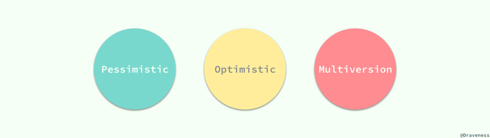

分别是悲观并发控制、乐观并发控制和多版本并发控制，其中悲观并发控制其实是最常见的并发控制机制，也就是锁；而乐观并发控制其实也有另一个名字：乐观锁，乐观锁其实并不是一种真实存在的锁，我们会在文章后面的部分中具体介绍；最后就是多版本并发控制（MVCC）了，与前两者对立的命名不同，MVCC 可以与前两者中的任意一种机制结合使用，以提高数据库的读性能。

既然这篇文章介绍了不同的并发控制机制，那么一定会涉及到不同事务的并发，我们会通过示意图的方式分析各种机制是如何工作的。

## 悲观并发控制

控制不同的事务对同一份数据的获取是保证数据库的一致性的最根本方法，如果我们能够让事务在同一时间对同一资源有着独占的能力，那么就可以保证操作同一资源的不同事务不会相互影响。

最简单的、应用最广的方法就是使用锁来解决，当事务需要对资源进行操作时需要先获得资源对应的锁，保证其他事务不会访问该资源后，在对资源进行各种操作；在悲观并发控制中，数据库程序对于数据被修改持悲观的态度，在数据处理的过程中都会被锁定，以此来解决竞争的问题。

### 读写锁

为了最大化数据库事务的并发能力，数据库中的锁被设计为两种模式，分别是共享锁和互斥锁。当一个事务获得共享锁之后，它只可以进行读操作，所以共享锁也叫读锁；而当一个事务获得一行数据的互斥锁时，就可以对该行数据进行读和写操作，所以互斥锁也叫写锁。

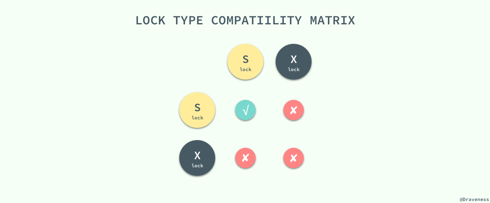

共享锁和互斥锁除了限制事务能够执行的读写操作之外，它们之间还有『共享』和『互斥』的关系，也就是多个事务可以同时获得某一行数据的共享锁，但是互斥锁与共享锁和其他的互斥锁并不兼容，我们可以很自然地理解这么设计的原因：多个事务同时写入同一数据难免会发生各种诡异的问题。

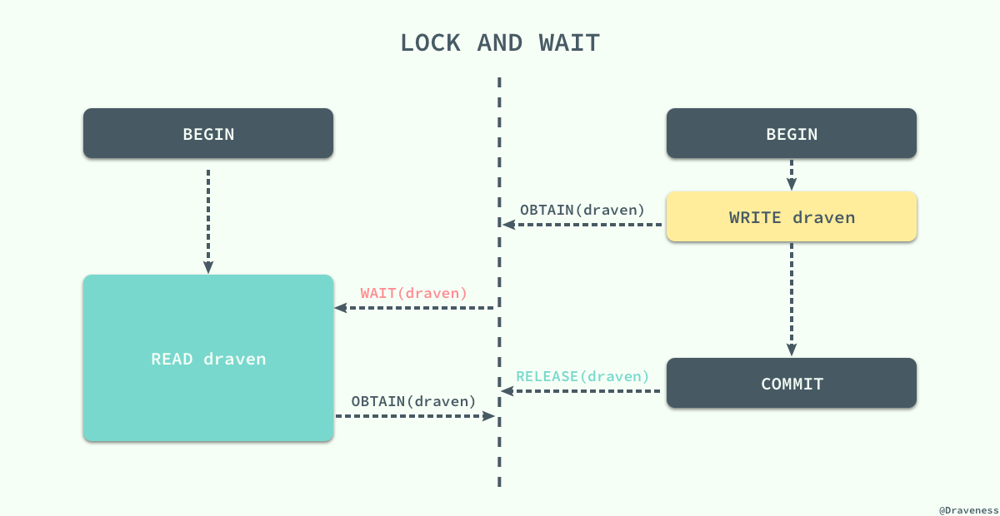

如果当前事务没有办法获取该行数据对应的锁时就会陷入等待的状态，直到其他事务将当前数据对应的锁释放才可以获得锁并执行相应的操作。

### 两阶段锁协议

两阶段锁协议（2PL）是一种能够保证事务可串行化的协议，它将事务的获取锁和释放锁划分成了增长（Growing）和缩减（Shrinking）两个不同的阶段。

在增长阶段，一个事务可以获得锁但是不能释放锁；而在缩减阶段事务只可以释放锁，并不能获得新的锁，如果只看 2PL 的定义，那么到这里就已经介绍完了，但是它还有两个变种：

1. **Strict 2PL**：事务持有的**互斥**锁必须在提交后再释放；
2. **Rigorous 2PL**：事务持有的**所有**锁必须在提交后释放；

虽然锁的使用能够为我们解决不同事务之间由于并发执行造成的问题，但是两阶段锁的使用却引入了另一个严重的问题，死锁；不同的事务等待对方已经锁定的资源就会造成死锁，我们在这里举一个简单的例子：

两个事务在刚开始时分别获取了 draven 和 beacon 资源上面的锁，然后再请求对方已经获得的锁时就会发生死锁，双方都没有办法等到锁的释放，如果没有死锁的处理机制就会无限等待下去，两个事务都没有办法完成。

### 死锁的处理

死锁在多线程编程中是经常遇到的事情，一旦涉及多个线程对资源进行争夺就需要考虑当前的几个线程或者事务是否会造成死锁；解决死锁大体来看有两种办法，一种是从源头杜绝死锁的产生和出现，另一种是允许系统进入死锁的状态，但是在系统出现死锁时能够及时发现并且进行恢复。

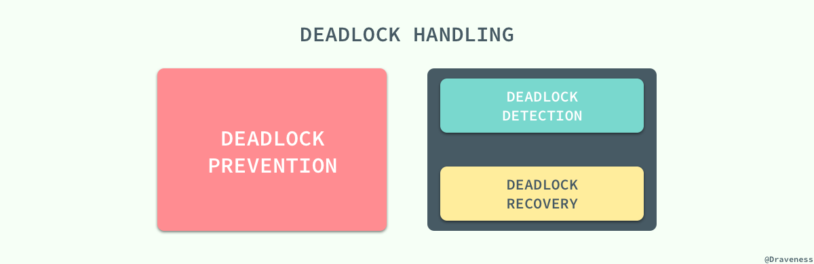

#### 预防死锁

有两种方式可以帮助我们预防死锁的出现，一种是保证事务之间的等待不会出现环，也就是事务之间的等待图应该是一张**有向无环图**，没有循环等待的情况或者保证一个事务中想要获得的所有资源都在事务开始时以原子的方式被锁定，所有的资源要么被锁定要么都不被锁定。

但是这种方式有两个问题，在事务一开始时很难判断哪些资源是需要锁定的，同时因为一些很晚才会用到的数据被提前锁定，数据的利用率与事务的并发率也非常的低。一种解决的办法就是按照一定的顺序为所有的数据行加锁，同时与 2PL 协议结合，在加锁阶段保证所有的数据行都是从小到大依次进行加锁的，不过这种方式依然需要事务提前知道将要加锁的数据集。

另一种预防死锁的方法就是使用抢占加事务回滚的方式预防死锁，当事务开始执行时会先获得一个时间戳，数据库程序会根据事务的时间戳决定事务应该等待还是回滚，在这时也有两种机制供我们选择，一种是 wait-die 机制：

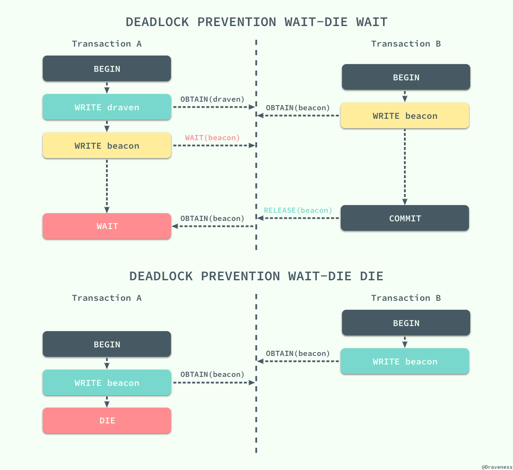

当执行事务的时间戳小于另一事务时，即事务 A 先于 B 开始，那么它就会等待另一个事务释放对应资源的锁，否则就会保持当前的时间戳并回滚。

另一种机制叫做 wound-wait，这是一种抢占的解决方案，它和 wait-die 机制的结果完全相反，当前事务如果先于另一事务执行并请求了另一事务的资源，那么另一事务会立刻回滚，将资源让给先执行的事务，否则就会等待其他事务释放资源：

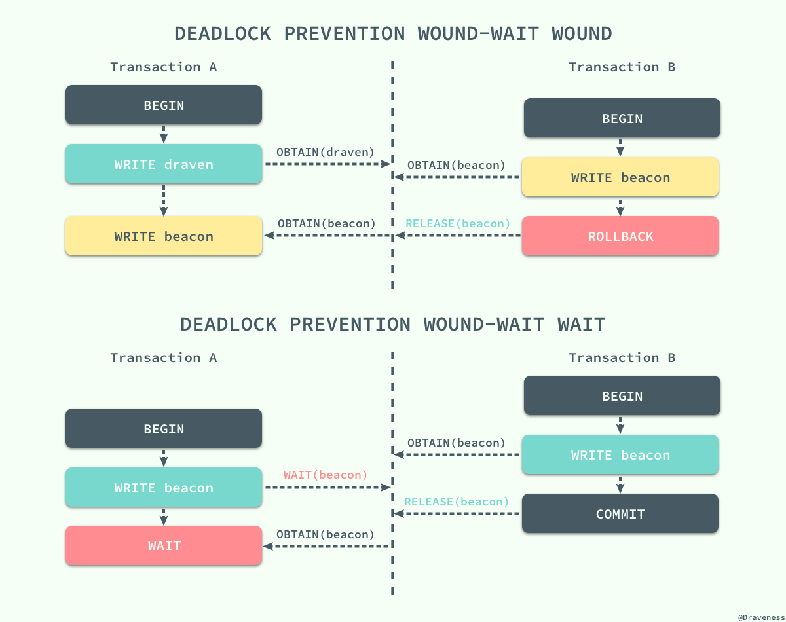

两种方法都会造成不必要的事务回滚，由此会带来一定的性能损失，更简单的解决死锁的方式就是使用超时时间，但是超时时间的设定是需要仔细考虑的，否则会造成耗时较长的事务无法正常执行，或者无法及时发现需要解决的死锁，所以它的使用还是有一定的局限性。

### 死锁检测和恢复

如果数据库程序无法通过协议从原理上保证死锁不会发生，那么就需要在死锁发生时及时检测到并从死锁状态恢复到正常状态保证数据库程序可以正常工作。在使用检测和恢复的方式解决死锁时，数据库程序需要维护数据和事务之间的引用信息，同时也需要提供一个用于判断当前数据库是否进入死锁状态的算法，最后需要在死锁发生时提供合适的策略及时恢复。

在上一节中我们其实提到死锁的检测可以通过一个有向的等待图来进行判断，如果一个事务依赖于另一个事务正在处理的数据，那么当前事务就会等待另一个事务的结束，这也就是整个等待图中的一条边：

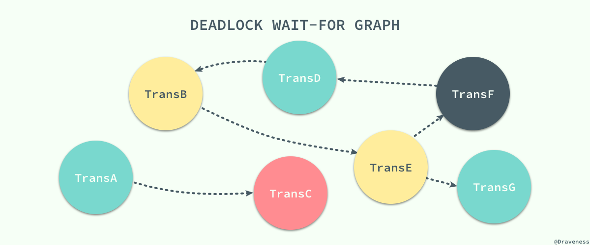

如上图所示，如果在这个有向图中出现了环，就说明当前数据库进入了死锁的状态 `TransB -> TransE -> TransF -> TransD -> TransB`，在这时就需要死锁恢复机制接入了。

如何从死锁中恢复其实非常简单，最常见的解决办法就是选择整个环中一个事务进行回滚，以打破整个等待图中的环，在整个恢复的过程中有三个事情需要考虑：

每次出现死锁时其实都会有多个事务被波及，而选择其中哪一个任务进行回滚是必须要做的事情，在选择牺牲品（Victim）时的黄金原则就是**最小化代价**，所以我们需要综合考虑事务已经计算的时间、使用的数据行以及涉及的事务等因素；当我们选择了牺牲品之后就可以开始回滚了，回滚其实有两种选择一种是全部回滚，另一种是部分回滚，部分回滚会回滚到事务之前的一个检查点上，如果没有检查点那自然没有办法进行部分回滚。

> 在死锁恢复的过程中，其实还可能出现某些任务在多次死锁时都被选择成为牺牲品，一直都不会成功执行，造成饥饿（Starvation），我们需要保证事务会在有穷的时间内执行，所以要在选择牺牲品时将时间戳加入考虑的范围。

### 锁的粒度

到目前为止我们都没有对不同粒度的锁进行讨论，一直以来我们都讨论的都是数据行锁，但是在有些时候我们希望将多个节点看做一个数据单元，使用锁直接将这个数据单元、表甚至数据库锁定起来。这个目标的实现需要我们在数据库中定义不同粒度的锁：

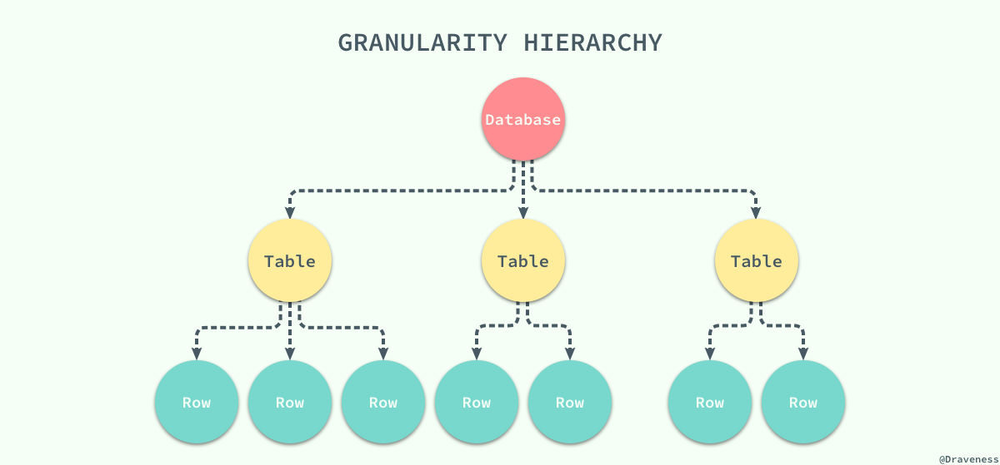

当我们拥有了不同粒度的锁之后，如果某个事务想要锁定整个数据库或者整张表时只需要简单的锁住对应的节点就会在当前节点加上显示（explicit）锁，在所有的子节点上加隐式（implicit）锁；虽然这种不同粒度的锁能够解决父节点被加锁时，子节点不能被加锁的问题，但是我们没有办法在子节点被加锁时，立刻确定父节点不能被加锁。

在这时我们就需要引入*意向锁*来解决这个问题了，当需要给子节点加锁时，先给所有的父节点加对应的意向锁，意向锁之间是完全不会互斥的，只是用来帮助父节点快速判断是否可以对该节点进行加锁：

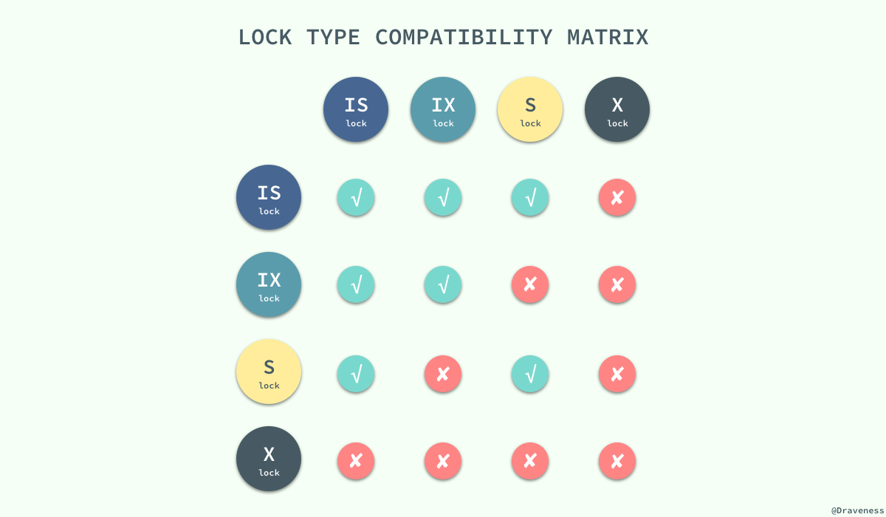

这里是一张引入了两种意向锁，*意向共享锁*和*意向互斥锁*之后所有的锁之间的兼容关系；到这里，我们通过不同粒度的锁和意向锁加快了数据库的吞吐量。

## 乐观并发控制

除了悲观并发控制机制 - 锁之外，我们其实还有其他的并发控制机制，*乐观并发控制*（Optimistic Concurrency Control）。乐观并发控制也叫乐观锁，但是它并不是真正的锁，很多人都会误以为乐观锁是一种真正的锁，然而它只是一种并发控制的思想。

在这一节中，我们将会先介绍*基于时间戳的并发控制机制*，然后在这个协议的基础上进行扩展，实现乐观的并发控制机制。

### 基于时间戳的协议

锁协议按照不同事务对同一数据项请求的时间依次执行，因为后面执行的事务想要获取的数据已将被前面的事务加锁，只能等待锁的释放，所以基于锁的协议执行事务的顺序与获得锁的顺序有关。在这里想要介绍的基于时间戳的协议能够在事务执行之前先决定事务的执行顺序。

每一个事务都会具有一个全局唯一的时间戳，它即可以使用系统的时钟时间，也可以使用计数器，只要能够保证所有的时间戳都是唯一并且是随时间递增的就可以。

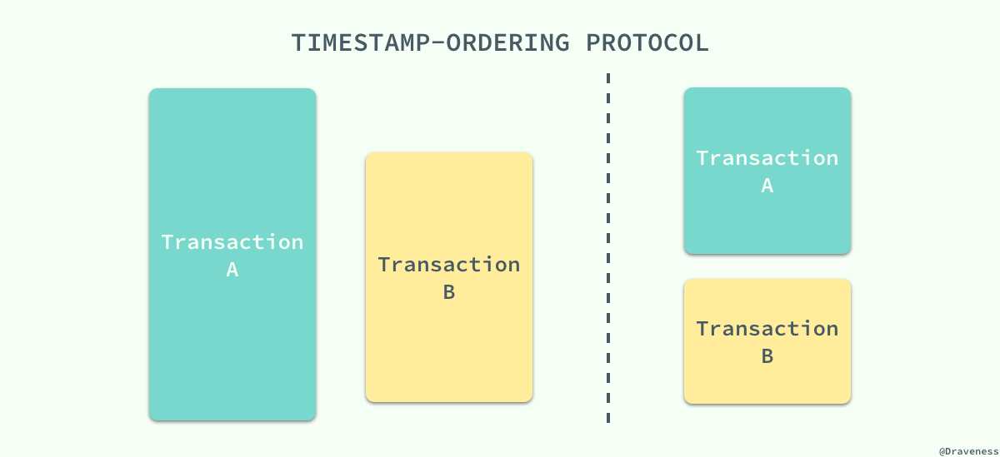

基于时间戳的协议能够保证事务并行执行的顺序与事务按照时间戳串行执行的效果完全相同；每一个数据项都有两个时间戳，读时间戳和写时间戳，分别代表了当前成功执行对应操作的事务的时间戳。

该协议能够保证所有冲突的读写操作都能按照时间戳的大小串行执行，在执行对应的操作时不需要关注其他的事务只需要关心数据项对应时间戳的值就可以了：

无论是读操作还是写操作都会从左到右依次比较读写时间戳的值，如果小于当前值就会直接被拒绝然后回滚，数据库系统会给回滚的事务添加一个新的时间戳并重新执行这个事务。

### 基于验证的协议

*乐观并发控制*其实本质上就是基于验证的协议，因为在多数的应用中只读的事务占了绝大多数，事务之间因为写操作造成冲突的可能非常小，也就是说大多数的事务在不需要并发控制机制也能运行的非常好，也可以保证数据库的一致性；而并发控制机制其实向整个数据库系统添加了很多的开销，我们其实可以通过别的策略降低这部分开销。

而验证协议就是我们找到的解决办法，它根据事务的只读或者更新将所有事务的执行分为两到三个阶段：

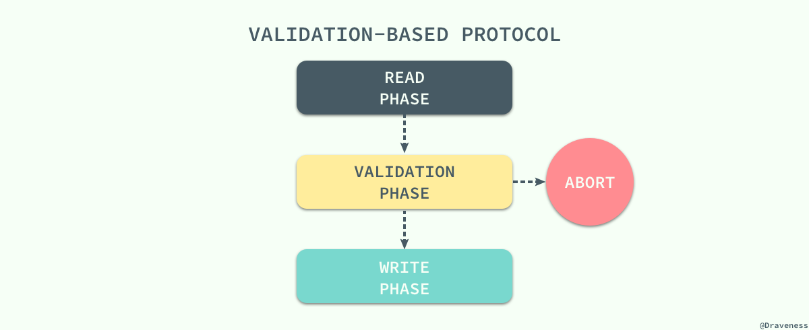

在读阶段，数据库会执行事务中的**全部读操作和写操作**，并将所有写后的值存入临时变量中，并不会真正更新数据库中的内容；在这时候会进入下一个阶段，数据库程序会检查当前的改动是否合法，也就是是否有其他事务在 RAED PHASE 期间更新了数据，如果通过测试那么直接就进入 WRITE PHASE 将所有存在临时变量中的改动全部写入数据库，没有通过测试的事务会直接被终止。

为了保证乐观并发控制能够正常运行，我们需要知道一个事务不同阶段的发生时间，包括事务开始时间、验证阶段的开始时间以及写阶段的结束时间；通过这三个时间戳，我们可以保证任意冲突的事务不会同时写入数据库，一旦由一个事务完成了验证阶段就会立即写入，其他读取了相同数据的事务就会回滚重新执行。

作为乐观的并发控制机制，它会假定所有的事务在最终都会通过验证阶段并且执行成功，而锁机制和基于时间戳排序的协议是悲观的，因为它们会在发生冲突时强制事务进行等待或者回滚，哪怕有不需要锁也能够保证事务之间不会冲突的可能。

## 多版本并发控制

到目前为止我们介绍的并发控制机制其实都是通过延迟或者终止相应的事务来解决事务之间的竞争条件（Race condition）来保证事务的可串行化；虽然前面的两种并发控制机制确实能够从根本上解决并发事务的可串行化的问题，但是在实际环境中数据库的事务大都是只读的，读请求是写请求的很多倍，如果写请求和读请求之前没有并发控制机制，那么最坏的情况也是读请求读到了已经写入的数据，这对很多应用完全是可以接受的。

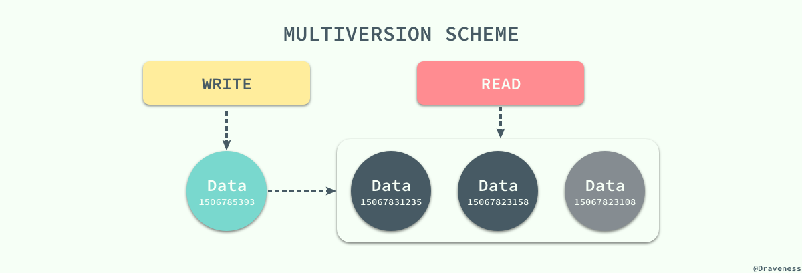

在这种大前提下，数据库系统引入了另一种并发控制机制 - *多版本并发控制*（Multiversion Concurrency Control），每一个写操作都会创建一个新版本的数据，读操作会从有限多个版本的数据中挑选一个最合适的结果直接返回；在这时，读写操作之间的冲突就不再需要被关注，而管理和快速挑选数据的版本就成了 MVCC 需要解决的主要问题。

MVCC 并不是一个与乐观和悲观并发控制对立的东西，它能够与两者很好的结合以增加事务的并发量，在目前最流行的 SQL 数据库 MySQL 和 PostgreSQL 中都对 MVCC 进行了实现；但是由于它们分别实现了悲观锁和乐观锁，所以 MVCC 实现的方式也不同。

### MySQL 与 MVCC

MySQL 中实现的多版本两阶段锁协议（Multiversion 2PL）将 MVCC 和 2PL 的优点结合了起来，每一个版本的数据行都具有一个唯一的时间戳，当有读事务请求时，数据库程序会直接从多个版本的数据项中具有最大时间戳的返回。

更新操作就稍微有些复杂了，事务会先读取最新版本的数据计算出数据更新后的结果，然后创建一个新版本的数据，新数据的时间戳是目前数据行的最大版本 `＋1`：

数据版本的删除也是根据时间戳来选择的，MySQL 会将版本最低的数据定时从数据库中清除以保证不会出现大量的遗留内容。

### PostgreSQL 与 MVCC

与 MySQL 中使用悲观并发控制不同，PostgreSQL 中都是使用乐观并发控制的，这也就导致了 MVCC 在于乐观锁结合时的实现上有一些不同，最终实现的叫做多版本时间戳排序协议（Multiversion Timestamp Ordering），在这个协议中，所有的的事务在执行之前都会被分配一个唯一的时间戳，每一个数据项都有读写两个时间戳：

当 PostgreSQL 的事务发出了一个读请求，数据库直接将最新版本的数据返回，不会被任何操作阻塞，而写操作在执行时，事务的时间戳一定要大或者等于数据行的读时间戳，否则就会被回滚。

这种 MVCC 的实现保证了读事务永远都不会失败并且不需要等待锁的释放，对于读请求远远多于写请求的应用程序，乐观锁加 MVCC 对数据库的性能有着非常大的提升；虽然这种协议能够针对一些实际情况做出一些明显的性能提升，但是也会导致两个问题，一个是每一次读操作都会更新读时间戳造成两次的磁盘写入，第二是事务之间的冲突是通过回滚解决的，所以如果冲突的可能性非常高或者回滚代价巨大，数据库的读写性能还不如使用传统的锁等待方式。

## 总结

数据库的并发控制机制到今天已经有了非常成熟、完善的解决方案，我们并不需要自己去设计一套新的协议来处理不同事务之间的冲突问题，从数据库的并发控制机制中学习到的相关知识，无论是锁还是乐观并发控制在其他的领域或者应用中都被广泛使用，所以了解、熟悉不同的并发控制机制的原理是很有必要的。

> 原文链接：[浅谈数据库并发控制 - 锁和 MVCC · 面向信仰编程](https://draveness.me/database-concurrency-control.html)
> Follow: [Draveness · GitHub](https://github.com/Draveness)

## Reference

+ [浅谈数据库并发控制 - 锁和 MVCC · 面向信仰编程](https://draveness.me/database-concurrency-control.html)
+ [PESSIMISTIC vs. OPTIMISTIC concurrency control](https://www.ibm.com/support/knowledgecenter/en/SSPK3V_7.0.0/com.ibm.swg.im.soliddb.sql.doc/doc/pessimistic.vs.optimistic.concurrency.control.html)
+ [PostgreSQL Concurrency with MVCC](https://devcenter.heroku.com/articles/postgresql-concurrency)
+ [Well-known Databases Use Different Approaches for MVCC](https://www.enterprisedb.com/well-known-databases-use-different-approaches-mvcc)
+ [Serializability](http://www.cs.unc.edu/~dewan/242/s01/notes/trans/node3.html)
+ [Race condition](https://en.wikipedia.org/wiki/Race_condition)

