# 分布式键值存储 Dynamo 的实现原理

在最近的一周时间里，一直都在研究和阅读 Amazon 的一篇论文 [Dynamo: Amazon’s Highly Available Key-value Store](http://www.allthingsdistributed.com/files/amazon-dynamo-sosp2007.pdf)，论文中描述了 Amazon 的高可用分布式键值存储服务 Dynamo 的实现原理。

之前在阅读 Google 的 [Bigtable: A Distributed Storage System for Structured Data](https://static.googleusercontent.com/media/research.google.com/en//archive/bigtable-osdi06.pdf) 时写了一篇 [浅析 Bigtable 和 LevelDB 的实现](https://draveness.me/bigtable-leveldb) 文章分析了 Bigtable 的单机版 LevelDB 的实现原理；在研究 Dynamo 时，作者发现 Dynamo 虽然和 Bigtable 同为 NoSQL，但是它们的实现却有着很大的不同，最主要的原因来自不同的应用场景和不同的目的。

## Bigtable 和 Dynamo

Bigtable 和 Dynamo 两者分别是 Google 和 Amazon 两大巨头给出的存储海量数据的解决方法，作为 NoSQL 两者都具有分布式、容错以及可扩展的几大特性。

虽然两者都是 NoSQL，并且有着相似的特性，但是它们在侧重的方向上有非常明显的不同，从两个数据库论文的标题中，我们就能看到 Amazon 的 Dynamo 追求的是高可用性并且提供的是类似 MongoDB 的 Key-value 文档存储，而 Bigtable 中描述的数据库却可以用于结构化的数据存储。

由于 Bigtable 和 Dynamo 都属于同一个类别 - NoSQL，所以它们经常会被放在一起进行对比，这篇文章不仅会介绍 Dynamo 的设计理念以及架构等问题，还会就其中的部分问题与 Bigtable 中相对应的概念进行对比，这样能够让我们更加清楚地了解不同的数据库对不同问题，因设计理念的差异做出的权衡。

## 架构

在数据库领域中尤其是分布式数据库，最重要的就是服务的架构，多数的分布式系统在设计时都会假设服务运行在廉价的节点上，并没有出众的性能和也不能提供稳定的服务，所以水平扩展和容错的能力是分布式数据库的标配；但是不同的分布式数据库选用了不同的架构来组织大量的节点。

很多的分布式服务例如 GFS 和 Bigtable 都使用了带有主节点的架构来维护整个系统中的元数据，包括节点的位置等信息，而 Dynamo 的实现不同于这些中心化的分布式服务，在 Dynamo 中所有的节点都有着完全相同的职责，会对外界提供同样的服务，所以在整个系统中并不会出现单点故障的问题。

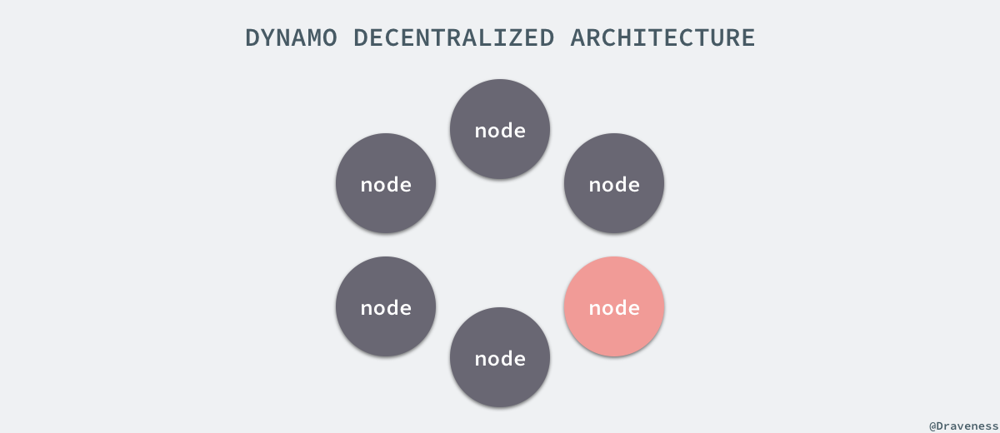

去中心化的架构使得系统的水平扩展非常容易，节点可以在任何时候直接加入到整个 Dynamo 的集群中，并且只会造成集群中少量数据的迁移。

Bigtable 使用了中心化的架构，通过主节点来维护整个系统中全部的元数据信息，但是 Bigtable 本身其实并不会处理来自客户端的读写请求，所有请求都会由客户端直接和从节点通信，不过由于有了中心化的主节点，所以主节点一旦发生故障宕机就会造成服务的不可用，虽然 Bigtable 以及类似的服务通过其他方式解决这个问题，但是这个问题仍然是中心化的设计所造成的。

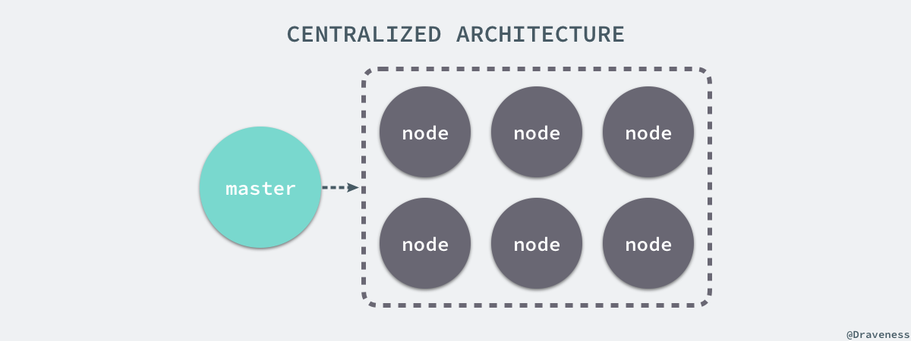

中心化或者去中心化并不是一个绝对好或者绝对坏的选择，选择中心化的解决方案能够降低系统实现的复杂度，而去中心化的方式能够避免单点故障，让系统能够更好更快地增加新的节点，提供优秀的水平扩展能力。

## 分片和复制

Dynamo 在设计之初就定下了**增量扩展**（Incremental Scalability）的核心需求，这也就需要一种能够在一组节点中动态分片的机制，Dynamo 的分片策略依赖于*一致性哈希*，通过这种策略 Dynamo 能够将负载合理的分配到不同的存储节点上。

所有的键在存储之前都会通过哈希函数得到一个唯一的值，哈希函数的输出被看做是一个固定长度的环，也就是其输出的最大值和最小值是『连接』到一起的：

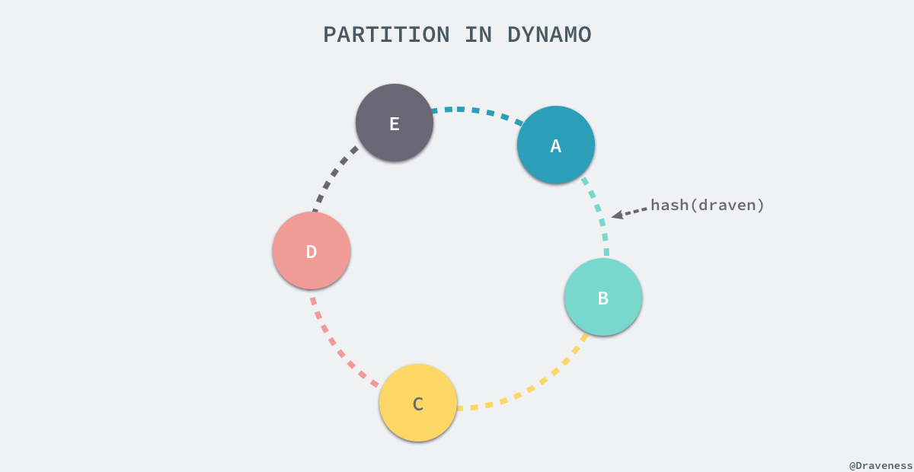

每一个节点都会被 Dynamo 在这个环中分配一个随机的位置，而这个节点会处理从哈希的输出在当前节点前的所有键；假设我们有一个键值对 `(draven, developer)`，`Hash(draven)` 的结果位于上图中的绿色区域，从环中的位置开始按照**顺时针**的顺序寻找，找到的以第一个节点 B 就会成为协调者（coordinator）负责处理当前的键值对，上图中的每一个节点都会负责与其颜色相同的部分。

由于 Dynamo 系统中的每一个节点在刚刚加入当前的集群时，会被分配一个随机的位置，所以由于算法的随机性可能会导致不同节点处理的范围有所不同，最终每一个节点的负载也并不相同；为了解决这个问题，Dynamo 使用了一致性哈希算法的变种，将同一个物理节点分配到环中的多个位置（标记），成为多个虚拟节点，但是在这种策略下，如果当前的 Dynamo 节点一天处理上百万的请求，那么新增节点为了不影响已有节点的性能，会在后台进行启动，整个过程大约会**消耗一整天**的时间，这其实是很难接受的，除此之外这种策略还会造成系统进行日常归档极其缓慢。

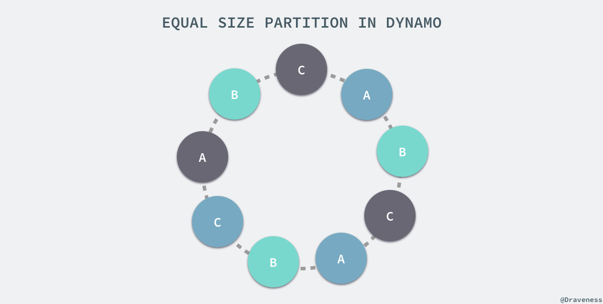

为了解决负载的不均衡的问题，除了上面使用虚拟节点的策略之外，Dynamo 论文中还提供了另外两种策略，其中性能相对较好的是将数据的哈希分成 Q 个大小相等的区域，S 个节点每一个处理 Q/S 个分区，当某一个节点因为故障或者其他原因需要退出集群时，会将它处理的数据分片随机分配给其它的节点，当有节点加入系统时，会从其它的节点中『接管』对应的数据分片。上图只是对这种策略下的分片情况简单展示，在真实环境中分片数 Q 的值远远大于节点数 S。

Dynamo 为了达到高可用性和持久性，防止由于节点宕机故障或者数据丢失，将同一份数据在协调者和随后的 `N-1` 个节点上备份了多次，N 是一个可以配置的值，在一般情况下都为 3。

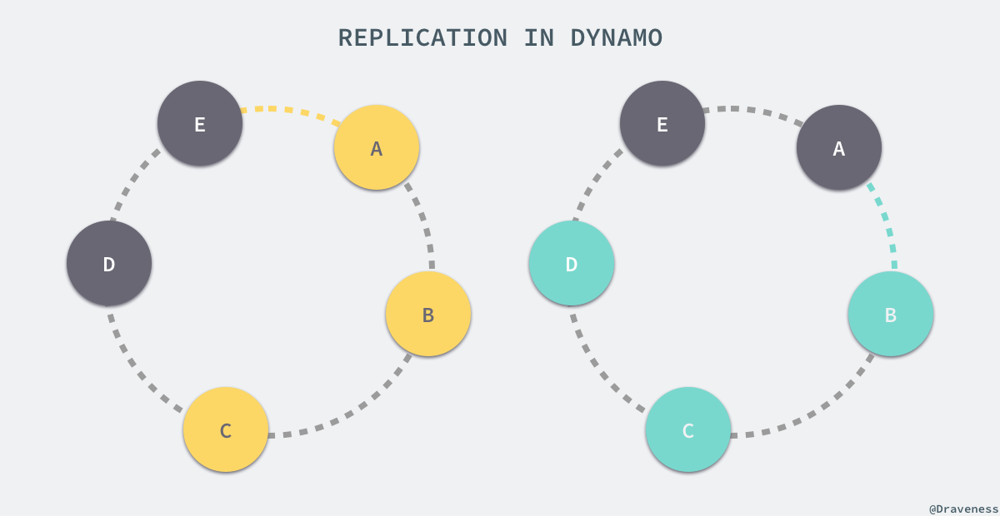

也就是说，上图中黄色区域的值会存储在三个节点 A、B 和 C 中，绿色的区域会被 B、C、D 三个节点处理，从另一个角度来看，A 节点会处理范围在 `(C, A]` 之间的值，而 B 节点会处理从 `(D, B]` 区域内的值。

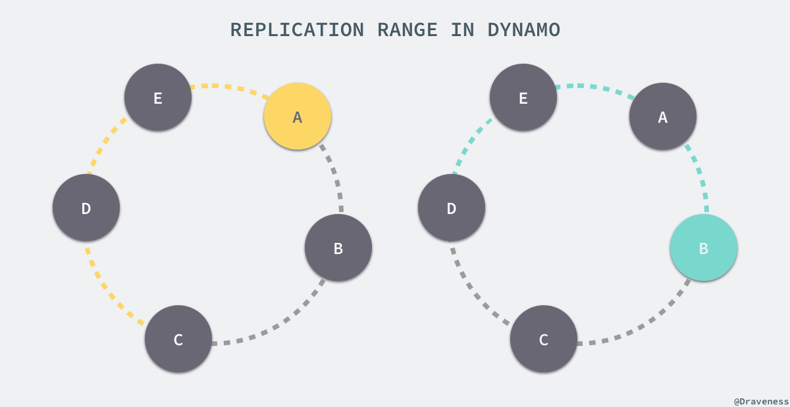

负责存储某一个特定键值对的节点列表叫做偏好列表（preference list），因为虚拟节点在环中会随机存在，为了保证出现节点故障时不会影响可用性和持久性，偏好列表中的全部节点必须都为**不同的物理节点**。

Bigtable 中对分片和复制的实现其实就与 Dynamo 中完全不同，这不仅是因为 Bigtable 的节点有主从之分，还因为 Bigtable 的设计理念与 Dynamo 完全不同。在 Bigtable 中，数据是按照键的顺序存储的，数据存储的单位都是 tablet，每一张表都由多个 tablet 组成，而每一个的 tablet 都有一个 tablet 服务器来处理，而 tablet 的位置都存储在 METADATA 表中。

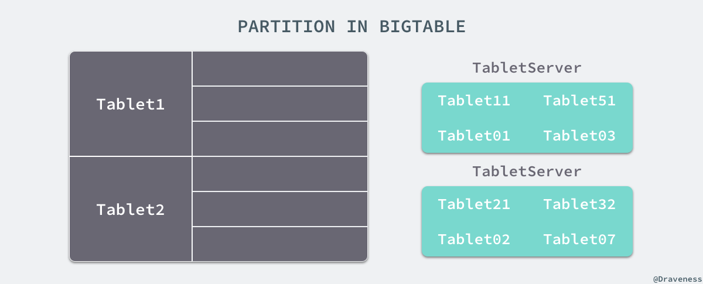

在 Bigtable 中，所有的 tablet 都在 GFS 中以 SSTable 的格式存储起来，这些 SSTable 都被分成了固定大小的块在 chunkserver 上存储，而每一个块也都会在存储在多个 chunkserver 中。

## 读写请求的执行

Dynamo 集群中的任意节点都能够接受来自客户端的对于任意键的读写请求，所有的请求都通过 RPC 调用执行，客户端在选择节点时有两种不同的策略：一种是通过一个负载均衡器根据负载选择不同的节点，另一种是通过一个清楚当前集群分片的库直接请求相应的节点。

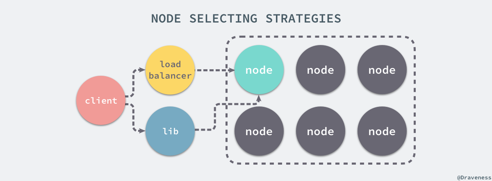

从上面我们就已经知道了处理读写请求的节点就叫做协调者（coordinator），前 N 个『健康』的节点会参与读写请求的处理；Dynamo 使用了 Quorum 一致性协议来保证系统中的一致性，协议中有两个可以配置的值：R 和 W，其中 R 是成功参与一个读请求的最小节点数，而 W 是成功参与写请求的最小节点数。

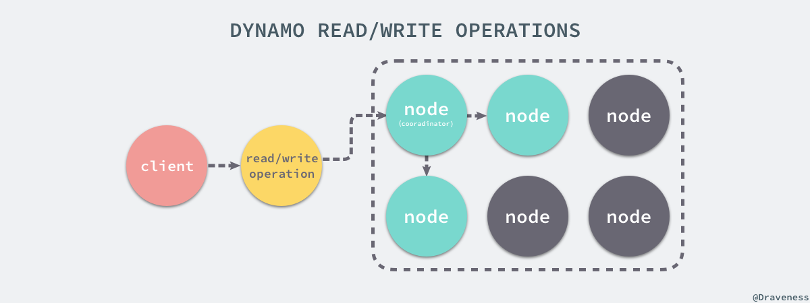

当 R = 2 时，所有的读请求必须等待两个节点成功返回对应键的结果，才认为当前的请求结束了，也就是说读请求的时间取决于返回最慢的节点，对于写请求来说也是完全相同的；当协调者接收到了来自客户端的写请求 `put()` 时，它会创建一个新的向量时钟（vector clock），然后将新版本的信息存储在本地，之后向偏好列表（preference list）中的前 `N-1` 个节点发送消息，直到其中的 `W-1` 个返回这次请求才成功结束，读请求 `get()` 与上述请求的唯一区别就是，如果协调者发现节点中的数据出现了冲突，就会对冲突尝试进行解决并将结果重新写回对应的节点。

## 冲突和向量时钟

Dynamo 与目前的绝大多数分布式系统一样都提供了**最终一致性**，最终一致性能够允许我们异步的更新集群中的节点，`put()` 请求可能会在所有的节点后更新前就返回对应的结果了，在这时随后的 `get()` 就可能获取到过期的数据。

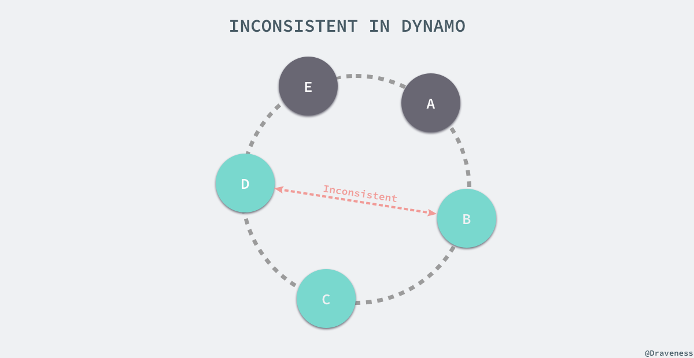

如果在系统中出现了节点故障宕机，那么数据的更新可能在一段时间内都不会到达失效的节点，这也是在使用 Dynamo 或者使用相似原理的系统时会遇到的问题，Amazon 中的很多应用虽然都能够忍受这种数据层面可能发生的不一致性，但是有些对业务数据一致性非常高的应用在选择 Dynamo 时就需要好好考虑了。

因为 Dynamo 在工作的过程中不同的节点可能会发生数据不一致的问题，这种问题肯定是需要解决的，Dynamo 能够确保**一旦数据之间发生了冲突不会丢失**，但是可能会有**已被删除的数据重新出现**的问题。

在多数情况下，Dynamo 中的最新版本的数据都会取代之前的版本，系统在这时可以通过语法调解（syntactic reconcile）数据库中的正确版本。但是版本也可能会出现分支，在这时，Dynamo 就会返回所有它无法处理的数据版本，由客户端在多个版本的数据中选择或者创建（collapse）合适的版本返回给 Dynamo，其实这个过程比较像出现冲突的 `git merge` 操作，git 没有办法判断当前的哪个版本是合适的，所以只能由开发者对分支之间的冲突进行处理。

上图中的每一个对象的版本 Dx 中存储着一个或多个向量时钟 `[Sn, N]`，每次 Dynamo 对数据进行写入时都会更新向量时钟的版本，节点 Sx 第一次写入时向量时钟为 `[Sx, 1]`，第二次为 `[Sx, 2]`，在这时假设节点 Sy 和 Sz 都不知道 Sx 已经对节点进行写入了，它们接收到了来自其他客户端的请求，在本地也对同样键做出了写入并分别生成了不同的时钟 `[Sy, 1]` 和 `[Sz, 1]`，当客户端再次使用 `get()` 请求时就会发现数据出现了冲突，由于 Dynamo 无法根据向量时钟自动解决，所以它需要手动合并三个不同的数据版本。

论文中对 24 小时内的请求进行了统计，其中 99.94% 的请求仅会返回一个版本，0.00057% 的请求会返回两个版本，0.00047 的请求会返回三个版本，0.000009% 的请求会返回四个版本，虽然论文中说：

> This shows that divergent versions are created rarely.

但是作者仍然认为在海量的数据面前 99.94% 并不是一个特别高的百分比，处理分歧的数据版本仍然会带来额外的工作量和负担。虽然在这种情况下，数据库本身确实没有足够的信息来解决数据的不一致问题，也确实只能由客户端去解决冲突，但是这种将问题抛给上层去解决的方式并不友好，论文中也提到了 Amazon 中使用 Dynamo 的应用程序也都是能够适应并解决这些数据不一致的问题的，不过对于作者来说，仅仅这一个问题就成为不选择 Dynamo 的理由了。

## 节点的增删

因为在分布式系统中节点的失效是非常常见的事情，而节点也很少会因为某些原因永久失效，往往大部分节点会临时宕机然后快速重新加入系统；由于这些原因，Dynamo 选择使用了显式的机制向系统中添加和移除节点。

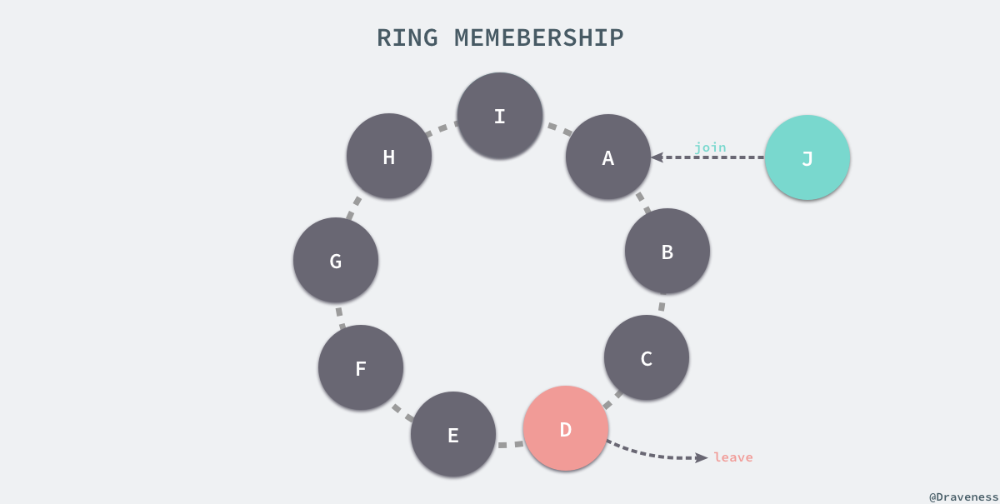

添加节点时可以使用命令行工具或者浏览器连接 Dynamo 中的任意节点后触发一个成员变动的事件，这个事件会从当前的环中移除或者向环中添加一个新的节点，当节点的信息发生改变时，该节点会通过 Gossip 协议通知它所能通知的最多的节点。

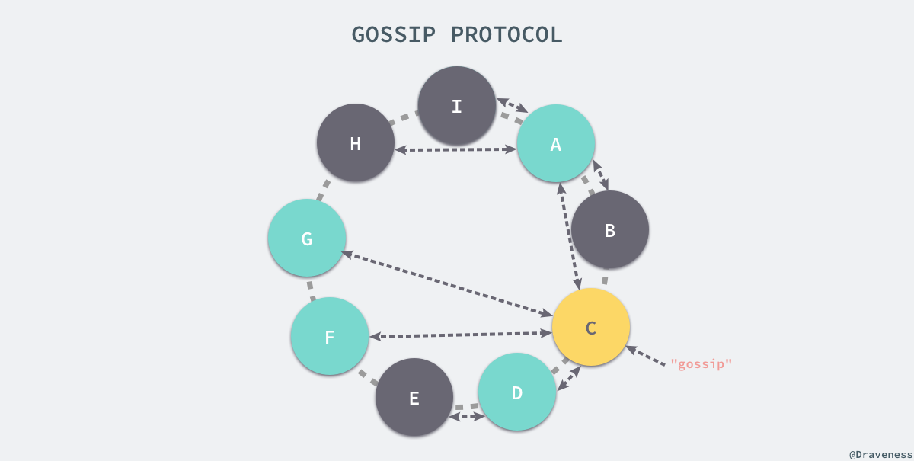

在 Gossip 协议中，每次通讯的两个节点会对当前系统中的节点信息达成一致；通过节点之间互相传递成员信息，最终整个 Dyanmo 的集群中所有的节点都会就成员信息达成一致，如上图所示，"gossip" 首先会被 C 节点接收，然后它会传递给它能接触到的最多的节点 A、D、F、G 四个节点，然后 "gossip" 会进行二次传播传递给系统中的灰色节点，到此为止系统中的所有节点都得到了最新的 "gossip" 消息。

当我们向 Dynamo 中加入了新的节点时，会发生节点之间的分片转移，假设我们连接上了 Dynamo 数据库，然后添加了一个 X 节点，该节点被分配到了如下图所示的 A 和 B 节点之间。

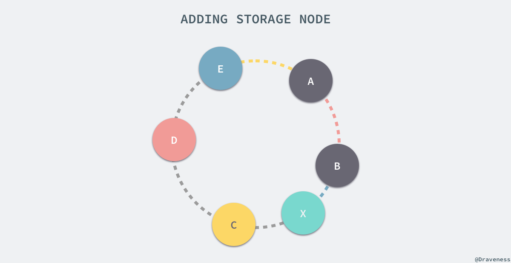

新引入的节点 X 会从三个节点 C、D、E 中接受它们管理的分片的一部分，也就是上图中彩色的 `(E, A]`、`(A, B]` 和 `(B, X]` 三个部分，在 X 节点加入集群之前分别属于与其颜色相同的节点管理。

Dynamo 由于其去中心化的架构，节点增删的事件都需要通过 Gossip 协议进行传递，然而拥有主从节点之分的 Bigtable 就不需要上述的方式对集群中的节点进行增删了，它可以直接通过用于管理其他从节点的服务直接注册新的节点或者撤下已有的节点。

## 副本同步

在 Dynamo 运行的过程中，由于一些情况会造成不同节点中的数据不一致的问题，Dynamo 使用了反信息熵（anti-entropy）的策略保证所有的副本存储的信息都是同步的。

为了快速确认多个副本之间的数据的一致性并避免大量的数据传输，Dynamo 使用了 [Merkle tree](https://en.wikipedia.org/wiki/Merkle_tree) 对不同节点中的数据进行快速验证。

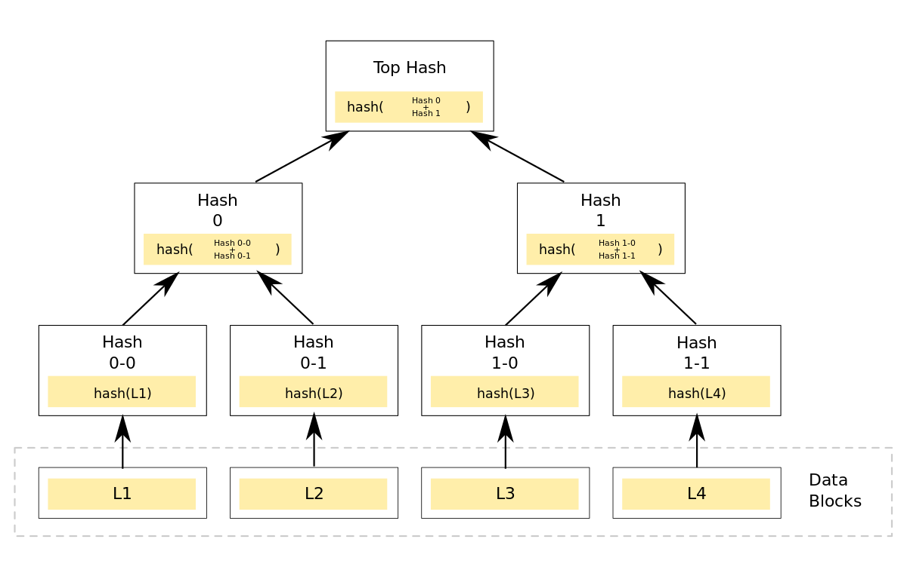

在 Merkle 树中，所有父节点中的内容都是叶子节点的哈希，通过这种方式构建的树形结构能够保证整棵树不会被篡改，任何的改动都能被立刻发现。

Dynamo 中的每一个节点都为其持有的键的范围维护了一颗 Merkle 树，在验证两份节点中的数据是否相同时，只需要发送根节点中的哈希值，如果相同那么说明两棵树的内容全部相同，否则就会依次对比不同层级节点中的内容，直到找出不同的副本，这种做法虽然能够减少数据的传输并能够快速找到副本之间的不同，但是当有新的节点加入或者旧的节点退出时会导致大量的 Merkle 树重新计算。

## 总结

在 Dynamo 的论文公开之后，有一篇文章将 Dynamo 的设计称作 ["A flawed architecture"](http://jsensarma.com/blog/?p=55)，这篇文章的作者在文中对 Dynamo 的实现进行了分析，主要对其最终一致性和 Quorom 机制进行了批评，它在 [HackerNews](https://news.ycombinator.com/item?id=915212) 上也引起了广泛的讨论，帖子中的很多内容都值得一看，能够帮助我们了解 Dynamo 的设计原理，而 Amazon 的 CTO 对于这篇文章也发了一条 Twitter：

不管如何，Dynamo 作为支撑亚马逊业务的底层服务，其实现原理和思想对于整个社区都是非常有价值的，然而它使用的去中心化的策略也带了很多问题，虽然作者可能会因为这个原因在选择数据库时不会 Dynamo，不过相信它也是有合适的应用场景的。

> 原文链接：[理解 ActiveRecord](https://draveness.me/dynamo)
> 
> Follow: [Draveness · GitHub](https://github.com/Draveness)

## Reference

+ [Dynamo: Amazon’s Highly Available Key-value Store](http://www.allthingsdistributed.com/files/amazon-dynamo-sosp2007.pdf)
+ [Dynamo: A flawed architecture – Part I](http://jsensarma.com/blog/?p=55)
+ [Dynamo – Part I: a followup and re-rebuttals](http://jsensarma.com/blog/?p=64)
+ [Dynamo and BigTable - Review and Comparison](https://www.slideshare.net/GrishaWeintraub/presentation-46722530)
+ [DynamoDB vs. BigTable · vsChart](http://vschart.com/compare/dynamo-db/vs/bigtable)
+ [Merkle tree](https://en.wikipedia.org/wiki/Merkle_tree)
+ [A Digital Signature Based on a Conventional Encryption Function](https://link.springer.com/content/pdf/10.1007/3-540-48184-2_32.pdf)
+ [Dynamo 的实现技术和去中心化](http://www.raychase.net/2396)
+ [浅析 Bigtable 和 LevelDB 的实现](https://draveness.me/bigtable-leveldb)

