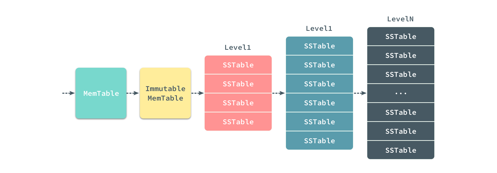

# 浅析 Bigtable 和 LevelDB 的实现

在 2006 年的 OSDI 上，Google 发布了名为 [Bigtable: A Distributed Storage System for Structured Data](https://static.googleusercontent.com/media/research.google.com/en//archive/bigtable-osdi06.pdf) 的论文，其中描述了一个用于管理结构化数据的分布式存储系统  - Bigtable 的数据模型、接口以及实现等内容。


本文会先对 Bigtable 一文中描述的分布式存储系统进行简单的描述，然后对 Google 开源的 KV 存储数据库 [LevelDB](https://github.com/google/leveldb) 进行分析；LevelDB 可以理解为单点的 Bigtable 的系统，虽然其中没有 Bigtable 中与 tablet 管理以及一些分布式相关的逻辑，不过我们可以通过对 LevelDB 源代码的阅读增加对 Bigtable 的理解。

## Bigtable

Bigtable 是一个用于管理**结构化数据**的分布式存储系统，它有非常优秀的扩展性，可以同时处理上千台机器中的 PB 级别的数据；Google 中的很多项目，包括 Web 索引都使用 Bigtable 来存储海量的数据；Bigtable 的论文中声称它实现了四个目标：

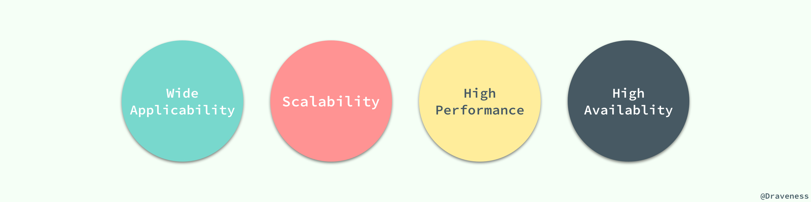

在作者看来这些目标看看就好，其实并没有什么太大的意义，所有的项目都会对外宣称它们达到了高性能、高可用性等等特性，我们需要关注的是 Bigtable 到底是如何实现的。

### 数据模型

Bigtable 与数据库在很多方面都非常相似，但是它提供了与数据库不同的接口，它并没有支持全部的关系型数据模型，反而使用了简单的数据模型，使数据可以被更灵活的控制和管理。

在实现中，Bigtable 其实就是一个稀疏的、分布式的、多维持久有序哈希。

> A Bigtable is a sparse, distributed, persistent multi-dimensional sorted map.

它的定义其实也就决定了其数据模型非常简单并且易于实现，我们使用 `row`、`column` 和 `timestamp` 三个字段作为这个哈希的键，值就是一个字节数组，也可以理解为字符串。


这里最重要的就是 `row` 的值，它的长度最大可以为 64KB，对于同一 `row` 下数据的读写都可以看做是原子的；因为 Bigtable 是按照 `row` 的值使用字典顺序进行排序的，每一段 `row` 的范围都会被 Bigtable 进行分区，并交给一个 tablet 进行处理。

### 实现

在这一节中，我们将介绍 Bigtable 论文对于其本身实现的描述，其中包含很多内容：tablet 的组织形式、tablet 的管理、读写请求的处理以及数据的压缩等几个部分。

#### tablet 的组织形式

我们使用类似 B+ 树的三层结构来存储 tablet 的位置信息，第一层是一个单独的 [Chubby](https://static.googleusercontent.com/media/research.google.com/en//archive/chubby-osdi06.pdf) 文件，其中保存了根 tablet 的位置。

> Chubby 是一个分布式锁服务，我们可能会在后面的文章中介绍它。

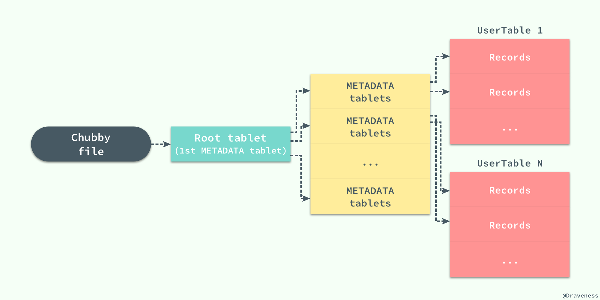

每一个 METADATA tablet 包括根节点上的 tablet 都存储了 tablet 的位置和该 tablet 中 key 的最小值和最大值；每一个 METADATA 行大约在内存中存储了 1KB 的数据，如果每一个 METADATA tablet 的大小都为 128MB，那么整个三层结构可以存储 2^61 字节的数据。

#### tablet 的管理

既然在整个 Bigtable 中有着海量的 tablet 服务器以及数据的分片 tablet，那么 Bigtable 是如何管理海量的数据呢？Bigtable 与很多的分布式系统一样，使用一个主服务器将 tablet 分派给不同的服务器节点。

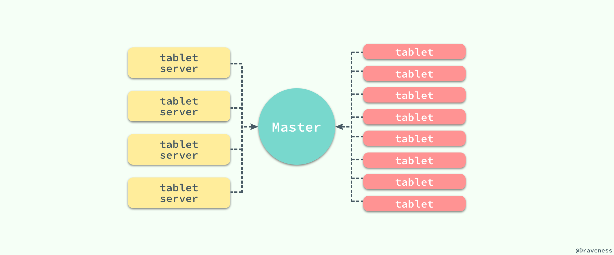

为了减轻主服务器的负载，所有的客户端仅仅通过 Master 获取 tablet 服务器的位置信息，它并不会在每次读写时都请求 Master 节点，而是直接与 tablet 服务器相连，同时客户端本身也会保存一份 tablet 服务器位置的缓存以减少与 Master 通信的次数和频率。

#### 读写请求的处理

从读写请求的处理，我们其实可以看出整个 Bigtable 中的各个部分是如何协作的，包括日志、memtable 以及 SSTable 文件。

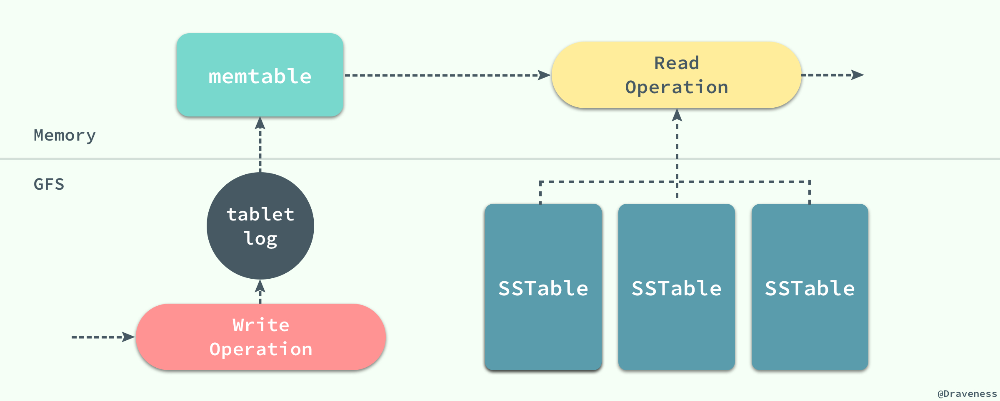

当有客户端向 tablet 服务器发送写操作时，它会先向 tablet 服务器中的日志追加一条记录，在日志成功追加之后再向 memtable 中插入该条记录；这与现在大多的数据库的实现完全相同，通过顺序写向日志追加记录，然后再向数据库随机写，因为随机写的耗时远远大于追加内容，如果直接进行随机写，可能由于发生设备故障造成数据丢失。

当 tablet 服务器接收到读操作时，它会在 memtable 和 SSTable 上进行合并查找，因为 memtable 和 SSTable 中对于键值的存储都是字典顺序的，所以整个读操作的执行会非常快。

#### 表的压缩

随着写操作的进行，memtable 会随着事件的推移逐渐增大，当 memtable 的大小超过一定的阈值时，就会将当前的 memtable 冻结，并且创建一个新的 memtable，被冻结的 memtable 会被转换为一个 SSTable 并且写入到 GFS 系统中，这种压缩方式也被称作 *Minor Compaction*。

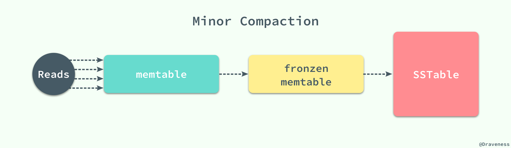

每一个 Minor Compaction 都能够创建一个新的 SSTable，它能够有效地降低内存的占用并且降低服务进程异常退出后，过大的日志导致的过长的恢复时间。既然有用于压缩 memtable 中数据的 Minor Compaction，那么就一定有一个对应的 Major Compaction 操作。

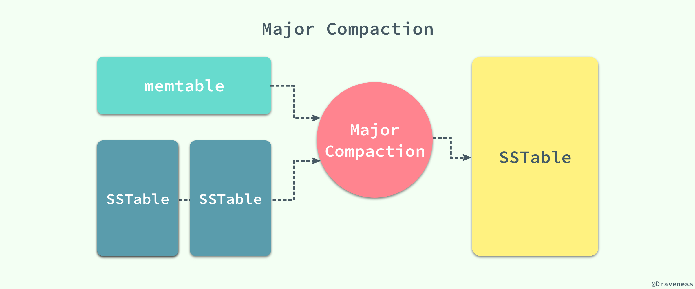

Bigtable 会在**后台周期性**地进行 *Major Compaction*，将 memtable 中的数据和一部分的 SSTable 作为输入，将其中的键值进行归并排序，生成新的 SSTable 并移除原有的 memtable 和 SSTable，新生成的 SSTable 中包含前两者的全部数据和信息，并且将其中一部分标记未删除的信息彻底清除。

#### 小结

到这里为止，对于 Google 的 Bigtable 论文的介绍就差不多完成了，当然本文只介绍了其中的一部分内容，关于压缩算法的实现细节、缓存以及提交日志的实现等问题我们都没有涉及，想要了解更多相关信息的读者，这里强烈推荐去看一遍 Bigtable 这篇论文的原文 [Bigtable: A Distributed Storage System for Structured Data](https://static.googleusercontent.com/media/research.google.com/en//archive/bigtable-osdi06.pdf) 以增强对其实现的理解。

## LevelDB

文章前面对于 Bigtable 的介绍其实都是对 [LevelDB](https://github.com/google/leveldb) 这部分内容所做的铺垫，当然这并不是说前面的内容就不重要，LevelDB 是对 Bigtable 论文中描述的键值存储系统的单机版的实现，它提供了一个极其高速的键值存储系统，并且由 Bigtable 的作者 [Jeff Dean](https://research.google.com/pubs/jeff.html) 和 [Sanjay Ghemawat](https://research.google.com/pubs/SanjayGhemawat.html) 共同完成，可以说高度复刻了 Bigtable 论文中对于其实现的描述。

因为 Bigtable 只是一篇论文，同时又因为其实现依赖于 Google 的一些不开源的基础服务：GFS、Chubby 等等，我们很难接触到它的源代码，不过我们可以通过 LevelDB 更好地了解这篇论文中提到的诸多内容和思量。

### 概述

LevelDB 作为一个键值存储的『仓库』，它提供了一组非常简单的增删改查接口：

```cpp
class DB {
 public:
  virtual Status Put(const WriteOptions& options, const Slice& key, const Slice& value) = 0;
  virtual Status Delete(const WriteOptions& options, const Slice& key) = 0;
  virtual Status Write(const WriteOptions& options, WriteBatch* updates) = 0;
  virtual Status Get(const ReadOptions& options, const Slice& key, std::string* value) = 0;
}
```

> `Put` 方法在内部最终会调用 `Write` 方法，只是在上层为调用者提供了两个不同的选择。

`Get` 和 `Put` 是 LevelDB 为上层提供的用于读写的接口，如果我们能够对读写的过程有一个非常清晰的认知，那么理解 LevelDB 的实现就不是那么困难了。

在这一节中，我们将先通过对读写操作的分析了解整个工程中的一些实现，并在遇到问题和新的概念时进行解释，我们会在这个过程中一步一步介绍 LevelDB 中一些重要模块的实现以达到掌握它的原理的目标。

### 从写操作开始

首先来看 `Get` 和 `Put` 两者中的写方法：

```cpp
Status DB::Put(const WriteOptions& opt, const Slice& key, const Slice& value) {
  WriteBatch batch;
  batch.Put(key, value);
  return Write(opt, &batch);
}

Status DBImpl::Write(const WriteOptions& options, WriteBatch* my_batch) {
    ...
}
```

正如上面所介绍的，`DB::Put` 方法将传入的参数封装成了一个 `WritaBatch`，然后仍然会执行 `DBImpl::Write` 方法向数据库中写入数据；写入方法 `DBImpl::Write` 其实是一个是非常复杂的过程，包含了很多对上下文状态的判断，我们先来看一个写操作的整体逻辑：

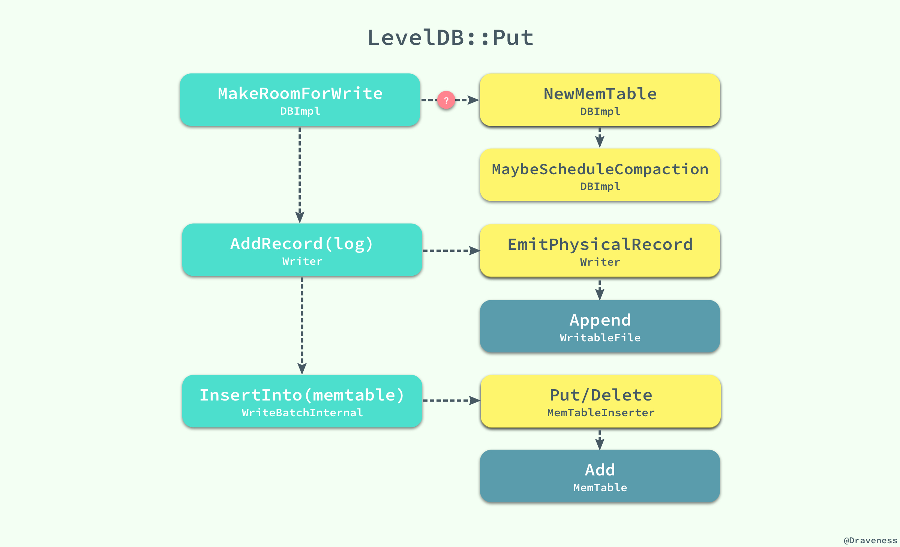

从总体上看，LevelDB 在对数据库执行写操作时，会有三个步骤：

1. 调用 `MakeRoomForWrite` 方法为即将进行的写入提供足够的空间；
    + 在这个过程中，由于 memtable 中空间的不足可能会冻结当前的 memtable，发生 Minor Compaction 并创建一个新的 `MemTable` 对象；
    + 在某些条件满足时，也可能发生 Major Compaction，对数据库中的 SSTable 进行压缩；
2. 通过 `AddRecord` 方法向日志中追加一条写操作的记录；
3. 再向日志成功写入记录后，我们使用 `InsertInto` 直接插入 memtable 中，完成整个写操作的流程；

在这里，我们并不会提供 LevelDB 对于 `Put` 方法实现的全部代码，只会展示一份精简后的代码，帮助我们大致了解一下整个写操作的流程：

```cpp
Status DBImpl::Write(const WriteOptions& options, WriteBatch* my_batch) {
  Writer w(&mutex_);
  w.batch = my_batch;

  MakeRoomForWrite(my_batch == NULL);
  
  uint64_t last_sequence = versions_->LastSequence();
  Writer* last_writer = &w;
  WriteBatch* updates = BuildBatchGroup(&last_writer);
  WriteBatchInternal::SetSequence(updates, last_sequence + 1);
  last_sequence += WriteBatchInternal::Count(updates);

  log_->AddRecord(WriteBatchInternal::Contents(updates));
  WriteBatchInternal::InsertInto(updates, mem_);

  versions_->SetLastSequence(last_sequence);
  return Status::OK();
}
```

#### 不可变的 memtable

在写操作的实现代码 `DBImpl::Put` 中，写操作的准备过程 `MakeRoomForWrite` 是我们需要注意的一个方法：

```cpp
Status DBImpl::MakeRoomForWrite(bool force) {
  uint64_t new_log_number = versions_->NewFileNumber();
  WritableFile* lfile = NULL;
  env_->NewWritableFile(LogFileName(dbname_, new_log_number), &lfile);

  delete log_;
  delete logfile_;
  logfile_ = lfile;
  logfile_number_ = new_log_number;
  log_ = new log::Writer(lfile);
  imm_ = mem_;
  has_imm_.Release_Store(imm_);
  mem_ = new MemTable(internal_comparator_);
  mem_->Ref();
  MaybeScheduleCompaction();
  return Status::OK();
}
```

当 LevelDB 中的 memtable 已经被数据填满导致内存已经快不够用的时候，我们会开始对 memtable 中的数据进行冻结并创建一个新的 `MemTable` 对象。


你可以看到，与 Bigtable 中论文不同的是，LevelDB 中引入了一个不可变的 memtable 结构 imm，它的结构与 memtable 完全相同，只是其中的所有数据都是不可变的。

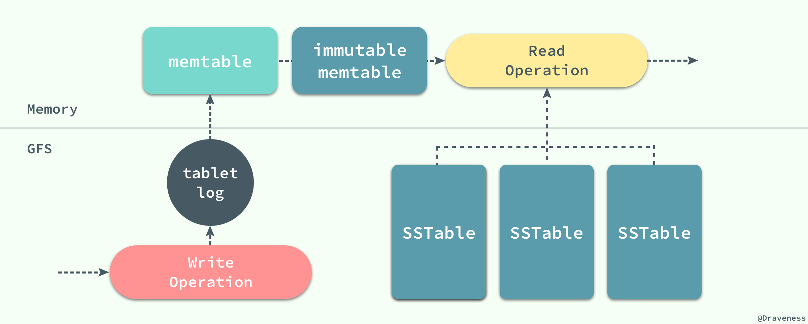

在切换到新的 memtable 之后，还可能会执行 `MaybeScheduleCompaction` 来触发一次 Minor Compaction 将 imm 中数据固化成数据库中的 SSTable；imm 的引入能够解决由于 memtable 中数据过大导致压缩时不可写入数据的问题。

引入 imm 后，如果 memtable 中的数据过多，我们可以直接将 memtable 指针赋值给 imm，然后创建一个新的 MemTable 实例，这样就可以继续接受外界的写操作，不再需要等待 Minor Compaction 的结束了。

#### 日志记录的格式

作为一个持久存储的 KV 数据库，LevelDB 一定要有日志模块以支持错误发生时恢复数据，我们想要深入了解 LevelDB 的实现，那么日志的格式是一定绕不开的问题；这里并不打算展示用于追加日志的方法 `AddRecord` 的实现，因为方法中只是实现了对表头和字符串的拼接。

日志在 LevelDB 是以块的形式存储的，每一个块的长度都是 32KB，**固定的块长度**也就决定了日志可能存放在块中的任意位置，LevelDB 中通过引入一位 `RecordType` 来表示当前记录在块中的位置：

```cpp
enum RecordType {
  // Zero is reserved for preallocated files
  kZeroType = 0,
  kFullType = 1,
  // For fragments
  kFirstType = 2,
  kMiddleType = 3,
  kLastType = 4
};
```

日志记录的类型存储在该条记录的头部，其中还存储了 4 字节日志的 CRC 校验、记录的长度等信息：

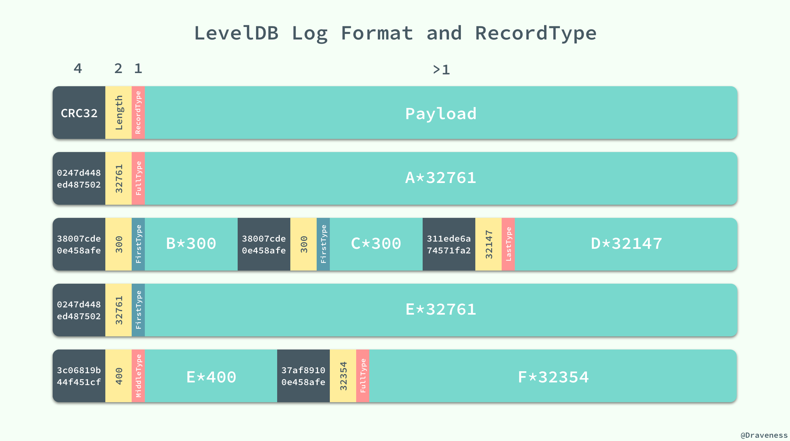

上图中一共包含 4 个块，其中存储着 6 条日志记录，我们可以通过 `RecordType` 对每一条日志记录或者日志记录的一部分进行标记，并在日志需要使用时通过该信息重新构造出这条日志记录。

```cpp
virtual Status Sync() {
  Status s = SyncDirIfManifest();
  if (fflush_unlocked(file_) != 0 ||
      fdatasync(fileno(file_)) != 0) {
    s = Status::IOError(filename_, strerror(errno));
  }
  return s;
}
```

因为向日志中写新记录都是顺序写的，所以它写入的速度非常快，当在内存中写入完成时，也会直接将缓冲区的这部分的内容 `fflush` 到磁盘上，实现对记录的持久化，用于之后的错误恢复等操作。

#### 记录的插入

当一条数据的记录写入日志时，这条记录仍然无法被查询，只有当该数据写入 memtable 后才可以被查询，而这也是这一节将要介绍的内容，无论是数据的插入还是数据的删除都会向 memtable 中添加一条记录。

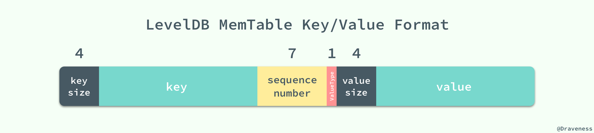

添加和删除的记录的区别就是它们使用了不用的 `ValueType` 标记，插入的数据会将其设置为 `kTypeValue`，删除的操作会标记为 `kTypeDeletion`；但是它们实际上都向 memtable 中插入了一条数据。

```cpp
virtual void Put(const Slice& key, const Slice& value) {
  mem_->Add(sequence_, kTypeValue, key, value);
  sequence_++;
}
virtual void Delete(const Slice& key) {
  mem_->Add(sequence_, kTypeDeletion, key, Slice());
  sequence_++;
}
```

我们可以看到它们都调用了 memtable 的 `Add` 方法，向其内部的数据结构 skiplist 以上图展示的格式插入数据，这条数据中既包含了该记录的键值、序列号以及这条记录的种类，这些字段会在拼接后存入 skiplist；既然我们并没有在 memtable 中对数据进行删除，那么我们是如何保证每次取到的数据都是最新的呢？首先，在 skiplist 中，我们使用了自己定义的一个 `comparator`：

```cpp
int InternalKeyComparator::Compare(const Slice& akey, const Slice& bkey) const {
  int r = user_comparator_->Compare(ExtractUserKey(akey), ExtractUserKey(bkey));
  if (r == 0) {
    const uint64_t anum = DecodeFixed64(akey.data() + akey.size() - 8);
    const uint64_t bnum = DecodeFixed64(bkey.data() + bkey.size() - 8);
    if (anum > bnum) {
      r = -1;
    } else if (anum < bnum) {
      r = +1;
    }
  }
  return r;
}
```

> 比较的两个 key 中的数据可能包含的内容都不完全相同，有的会包含键值、序列号等全部信息，但是例如从 `Get` 方法调用过来的 key 中可能就只包含键的长度、键值和序列号了，但是这并不影响这里对数据的提取，因为我们只从每个 key 的头部提取信息，所以无论是完整的 key/value 还是单独的 key，我们都不会取到 key 之外的任何数据。

该方法分别从两个不同的 key 中取出键和序列号，然后对它们进行比较；比较的过程就是使用 `InternalKeyComparator` 比较器，它通过 `user_key` 和 `sequence_number` 进行排序，其中 `user_key` 按照递增的顺序排序、`sequence_number` 按照递减的顺序排序，因为随着数据的插入序列号是不断递增的，所以我们可以保证先取到的都是最新的数据或者删除信息。

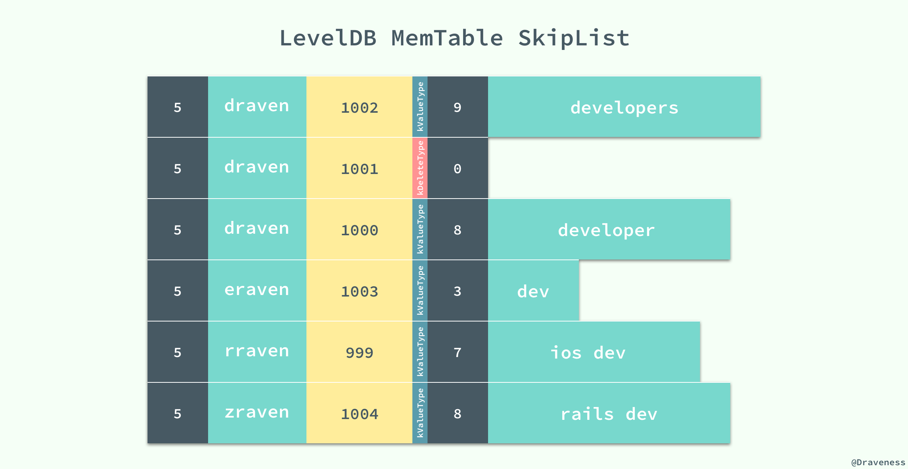

在序列号的帮助下，我们并不需要对历史数据进行删除，同时也能加快写操作的速度，提升 LevelDB 的写性能。

### 数据的读取

从 LevelDB 中读取数据其实并不复杂，memtable 和 imm 更像是两级缓存，它们在内存中提供了更快的访问速度，如果能直接从内存中的这两处直接获取到响应的值，那么它们一定是最新的数据。

> LevelDB 总会将新的键值对写在最前面，并在数据压缩时删除历史数据。

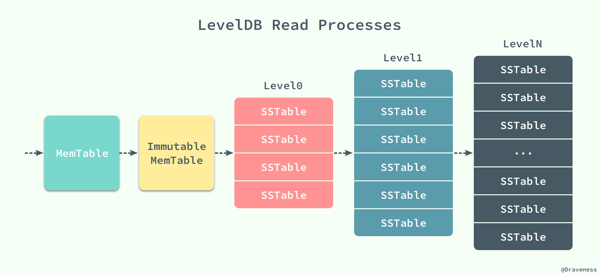

数据的读取是按照 MemTable、Immutable MemTable 以及不同层级的 SSTable 的顺序进行的，前两者都是在内存中，后面不同层级的 SSTable 都是以 `*.ldb` 文件的形式持久存储在磁盘上，而正是因为有着不同层级的 SSTable，所以我们的数据库的名字叫做 LevelDB。

精简后的读操作方法的实现代码是这样的，方法的脉络非常清晰，作者相信这里也不需要过多的解释：

```cpp
Status DBImpl::Get(const ReadOptions& options, const Slice& key, std::string* value) {
  LookupKey lkey(key, versions_->LastSequence());
  if (mem_->Get(lkey, value, NULL)) {
    // Done
  } else if (imm_ != NULL && imm_->Get(lkey, value, NULL)) {
    // Done
  } else {
    versions_->current()->Get(options, lkey, value, NULL);
  }

  MaybeScheduleCompaction();
  return Status::OK();
}
```

当 LevelDB 在 memtable 和 imm 中查询到结果时，如果查询到了数据并不一定表示当前的值一定存在，它仍然需要判断 `ValueType` 来确定当前记录是否被删除。

#### 多层级的 SSTable

当 LevelDB 在内存中没有找到对应的数据时，它才会到磁盘中多个层级的 SSTable 中进行查找，这个过程就稍微有一点复杂了，LevelDB 会在多个层级中逐级进行查找，并且不会跳过其中的任何层级；在查找的过程就涉及到一个非常重要的数据结构 `FileMetaData`：

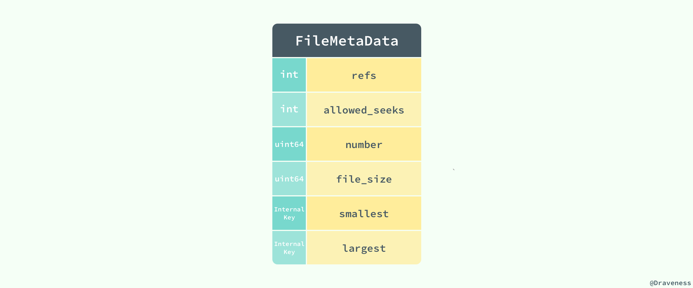

`FileMetaData` 中包含了整个文件的全部信息，其中包括键的最大值和最小值、允许查找的次数、文件被引用的次数、文件的大小以及文件号，因为所有的 `SSTable` 都是以固定的形式存储在同一目录下的，所以我们可以通过文件号轻松查找到对应的文件。


查找的顺序就是从低到高了，LevelDB 首先会在 Level0 中查找对应的键。但是，与其他层级不同，Level0 中多个 SSTable 的键的范围有重合部分的，在查找对应值的过程中，会依次查找 Level0 中固定的 4 个 SSTable。

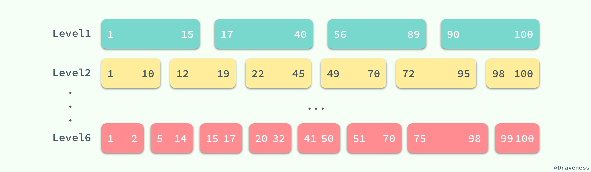

但是当涉及到更高层级的 SSTable 时，因为同一层级的 SSTable 都是没有重叠部分的，所以我们在查找时可以利用已知的 SSTable 中的极值信息 `smallest/largest` 快速查找到对应的 SSTable，再判断当前的 SSTable 是否包含查询的 key，如果不存在，就继续查找下一个层级直到最后的一个层级 `kNumLevels`（默认为 7 级）或者查询到了对应的值。

#### SSTable 的『合并』

既然 LevelDB 中的数据是通过多个层级的 SSTable 组织的，那么它是如何对不同层级中的 SSTable 进行合并和压缩的呢；与 Bigtable 论文中描述的两种 Compaction 几乎完全相同，LevelDB 对这两种压缩的方式都进行了实现。

无论是读操作还是写操作，在执行的过程中都可能调用 `MaybeScheduleCompaction` 来尝试对数据库中的 SSTable 进行合并，当合并的条件满足时，最终都会执行 `BackgroundCompaction` 方法在后台完成这个步骤。

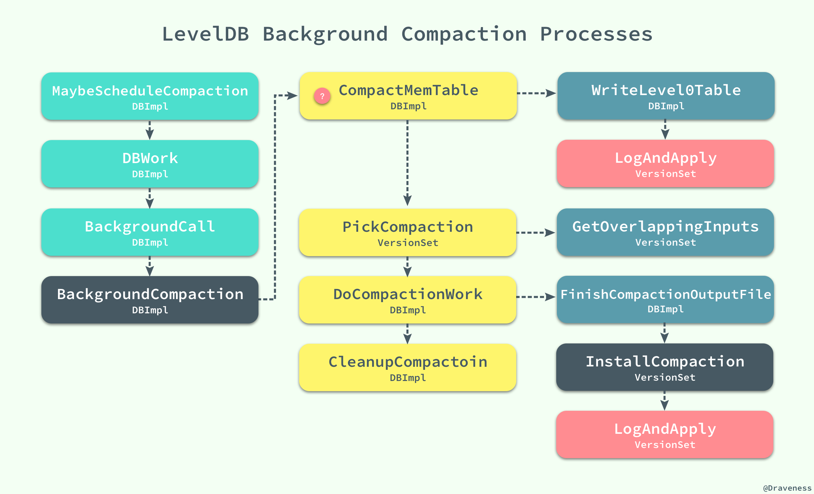

这种合并分为两种情况，一种是 Minor Compaction，即内存中的数据超过了 memtable 大小的最大限制，改 memtable 被冻结为不可变的 imm，然后执行方法 `CompactMemTable()` 对内存表进行压缩。

```cpp
void DBImpl::CompactMemTable() {
  VersionEdit edit;
  Version* base = versions_->current();
  WriteLevel0Table(imm_, &edit, base);
  versions_->LogAndApply(&edit, &mutex_);
  DeleteObsoleteFiles();
}
```

`CompactMemTable` 会执行 `WriteLevel0Table` 将当前的 imm 转换成一个 Level0 的 SSTable 文件，同时由于 Level0 层级的文件变多，可能会继续触发一个新的 Major Compaction，在这里我们就需要在这里选择需要压缩的合适的层级：

```cpp
Status DBImpl::WriteLevel0Table(MemTable* mem, VersionEdit* edit, Version* base) {
  FileMetaData meta;
  meta.number = versions_->NewFileNumber();
  Iterator* iter = mem->NewIterator();
  BuildTable(dbname_, env_, options_, table_cache_, iter, &meta);

  const Slice min_user_key = meta.smallest.user_key();
  const Slice max_user_key = meta.largest.user_key();
  int level = base->PickLevelForMemTableOutput(min_user_key, max_user_key);
  edit->AddFile(level, meta.number, meta.file_size, meta.smallest, meta.largest);
  return Status::OK();
}
```

所有对当前 SSTable 数据的修改由一个统一的 `VersionEdit` 对象记录和管理，我们会在后面介绍这个对象的作用和实现，如果成功写入了就会返回这个文件的元数据 `FileMetaData`，最后调用 `VersionSet` 的方法 `LogAndApply` 将文件中的全部变化如实记录下来，最后做一些数据的清理工作。

当然如果是 Major Compaction 就稍微有一些复杂了，不过整理后的 `BackgroundCompaction` 方法的逻辑非常清晰：

```cpp
void DBImpl::BackgroundCompaction() {
  if (imm_ != NULL) {
    CompactMemTable();
    return;
  }

  Compaction* c = versions_->PickCompaction();
  CompactionState* compact = new CompactionState(c);
  DoCompactionWork(compact);
  CleanupCompaction(compact);
  DeleteObsoleteFiles();
}
```

我们从当前的 `VersionSet` 中找到需要压缩的文件信息，将它们打包存入一个 `Compaction` 对象，该对象需要选择两个层级的 SSTable，低层级的表很好选择，只需要选择大小超过限制的或者查询次数太多的 SSTable；当我们选择了低层级的一个 SSTable 后，就在更高的层级选择与该 SSTable 有重叠键的 SSTable 就可以了，通过 `FileMetaData` 中数据的帮助我们可以很快找到待压缩的全部数据。

> 查询次数太多的意思就是，当客户端调用多次 `Get` 方法时，如果这次 `Get` 方法在某个层级的 SSTable 中找到了对应的键，那么就算做上一层级中包含该键的 SSTable 的一次查找，也就是这次查找由于不同层级键的覆盖范围造成了更多的耗时，每个 SSTable 在创建之后的 `allowed_seeks` 都为 100 次，当 `allowed_seeks < 0` 时就会触发该文件的与更高层级和合并，以减少以后查询的查找次数。

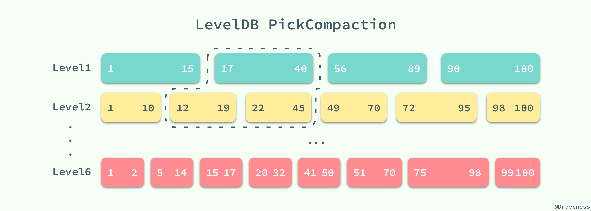

LevelDB 中的 `DoCompactionWork` 方法会对所有传入的 SSTable 中的键值使用归并排序进行合并，最后会在高高层级（图中为 Level2）中生成一个新的 SSTable。

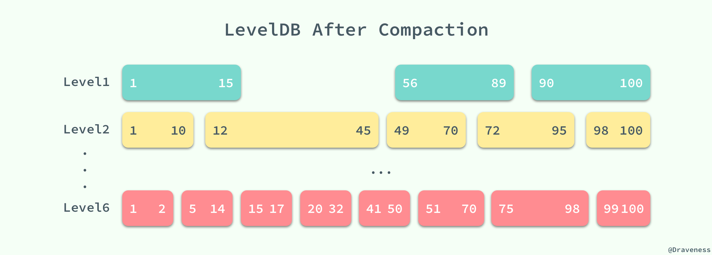

这样下一次查询 17~40 之间的值时就可以减少一次对 SSTable 中数据的二分查找以及读取文件的时间，提升读写的性能。

#### 存储 db 状态的 VersionSet

LevelDB 中的所有状态其实都是被一个 `VersionSet` 结构所存储的，一个 `VersionSet` 包含一组 `Version` 结构体，所有的 `Version` 包括历史版本都是通过双向链表连接起来的，但是只有一个版本是当前版本。

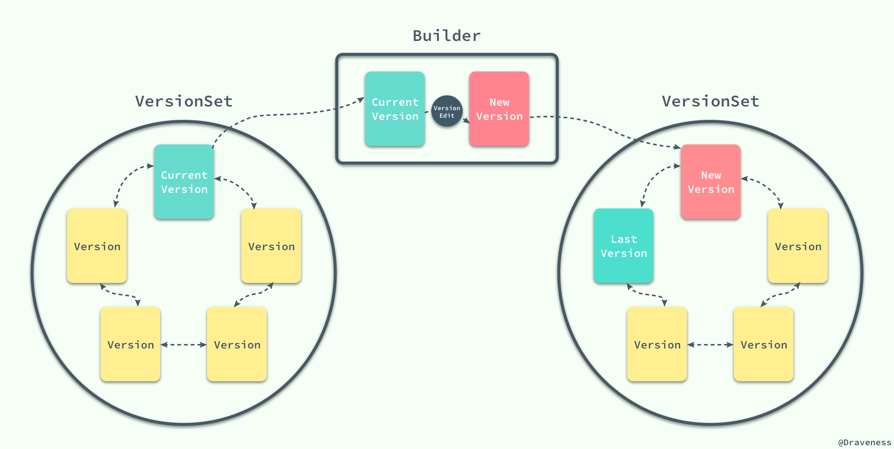

当 LevelDB 中的 SSTable 发生变动时，它会生成一个 `VersionEdit` 结构，最终执行 `LogAndApply` 方法：

```cpp
Status VersionSet::LogAndApply(VersionEdit* edit, port::Mutex* mu) {
  Version* v = new Version(this);
  Builder builder(this, current_);
  builder.Apply(edit);
  builder.SaveTo(v);

  std::string new_manifest_file;
  new_manifest_file = DescriptorFileName(dbname_, manifest_file_number_);
  env_->NewWritableFile(new_manifest_file, &descriptor_file_);

  std::string record;
  edit->EncodeTo(&record);
  descriptor_log_->AddRecord(record);
  descriptor_file_->Sync();

  SetCurrentFile(env_, dbname_, manifest_file_number_);
  AppendVersion(v);

  return Status::OK();
}
```

该方法的主要工作是使用当前版本和 `VersionEdit` 创建一个新的版本对象，然后将 `Version` 的变更追加到 MANIFEST 日志中，并且改变数据库中全局当前版本信息。

> MANIFEST 文件中记录了 LevelDB 中所有层级中的表、每一个 SSTable 的 Key 范围和其他重要的元数据，它以日志的格式存储，所有对文件的增删操作都会追加到这个日志中。

#### SSTable 的格式

SSTable 中其实存储的不只是数据，其中还保存了一些元数据、索引等信息，用于加速读写操作的速度，虽然在 Bigtable 的论文中并没有给出 SSTable 的数据格式，不过在 LevelDB 的实现中，我们可以发现 SSTable 是以这种格式存储数据的：


当 LevelDB 读取 SSTable 存在的 `ldb` 文件时，会先读取文件中的 `Footer` 信息。


整个 `Footer` 在文件中占用 48 个字节，我们能在其中拿到 MetaIndex 块和 Index 块的位置，再通过其中的索引继而找到对应值存在的位置。

`TableBuilder::Rep` 结构体中就包含了一个文件需要创建的全部信息，包括数据块、索引块等等：

```cpp
struct TableBuilder::Rep {
  WritableFile* file;
  uint64_t offset;
  BlockBuilder data_block;
  BlockBuilder index_block;
  std::string last_key;
  int64_t num_entries;
  bool closed;
  FilterBlockBuilder* filter_block;
  ...
}
```

到这里，我们就完成了对整个数据读取过程的解析了；对于读操作，我们可以理解为 LevelDB 在它内部的『多级缓存』中依次查找是否存在对应的键，如果存在就会直接返回，唯一与缓存不同可能就是，在数据『命中』后，它并不会把数据移动到更近的地方，而是会把数据移到更远的地方来减少下一次的访问时间，虽然这么听起来却是不可思议，不过仔细想一下确实是这样。

## 小结

在这篇文章中，我们通过对 LevelDB 源代码中读写操作的分析，了解了整个框架的绝大部分实现细节，包括 LevelDB 中存储数据的格式、多级 SSTable、如何进行合并以及管理版本等信息，不过由于篇幅所限，对于其中的一些问题并没有展开详细地进行介绍和分析，例如错误恢复以及缓存等问题；但是对 LevelDB 源代码的阅读，加深了我们对 Bigtable 论文中描述的分布式 KV 存储数据库的理解。

LevelDB 的源代码非常易于阅读，也是学习 C++ 语言非常优秀的资源，如果对文章的内容有疑问，可以翻墙后在博客下面的 Disqus 中留言。

## Reference

+ [Bigtable: A Distributed Storage System for Structured Data](https://static.googleusercontent.com/media/research.google.com/en//archive/bigtable-osdi06.pdf)
+ [LevelDB](https://github.com/google/leveldb)
+ [The Chubby lock service for loosely-coupled distributed systems](https://static.googleusercontent.com/media/research.google.com/en//archive/chubby-osdi06.pdf)
+ [LevelDB · Impl](https://github.com/google/leveldb/blob/master/doc/impl.md)
+ [leveldb 中的 SSTable](http://bean-li.github.io/leveldb-sstable/)


