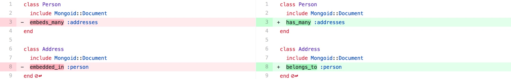
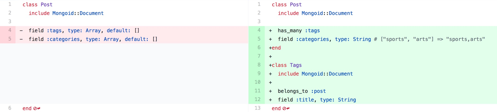
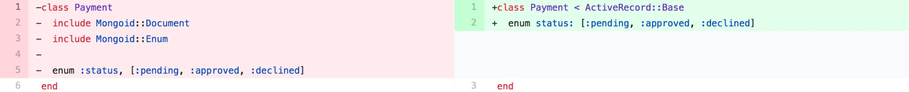
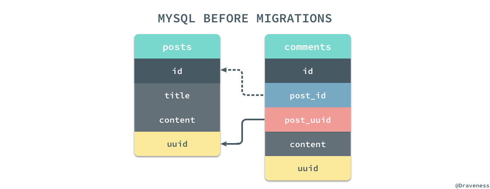
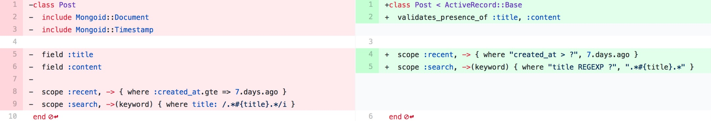

# 如何从 MongoDB 迁移到 MySQL

最近的一个多月时间其实都在做数据库的迁移工作，我目前在开发的项目其实在上古时代是使用 MySQL 作为主要数据库的，后来由于一些业务上的原因从 MySQL 迁移到了 MongoDB，使用了几个月的时间后，由于数据库服务非常不稳定，再加上无人看管，同时 MongoDB 本身就是无 Schema 的数据库，最后导致数据库的脏数据问题非常严重。目前团队的成员没有较为丰富的 Rails 开发经验，所以还是希望使用 ActiveRecord 加上 Migration 的方式对数据进行一些强限制，保证数据库中数据的合法。


文中会介绍作者在迁移数据库的过程中遇到的一些问题，并为各位读者提供需要**停机**迁移数据库的可行方案，如果需要不停机迁移数据库还是需要别的方案来解决，在这里提供的方案用于百万数据量的 MongoDB，预计的停机时间在两小时左右，如果数据量在千万级别以上，过长的停机时间可能是无法接受的，应该设计不停机的迁移方案；无论如何，作者希望这篇文章能够给想要做数据库迁移的开发者带来一些思路，少走一些坑。

## 从关系到文档

虽然这篇文章的重点是从 MongoDB 迁移到 MySQL，但是作者还是想简单提一下从 MySQL 到 MongoDB 的迁移，如果我们仅仅是将 MySQL 中的全部数据导入到 MongoDB 中其实是一间比较简单的事情，其中最重要的原因就是 **MySQL 支持的数据类型是 MongoDB 的子集**：


在迁移的过程中可以将 MySQL 中的全部数据以 csv 的格式导出，然后再将所有 csv 格式的数据使用 `mongoimport` 全部导入到 MongoDB 中：

```
$ mysqldump -u<username> -p<password> \
    -T <output_directory> \
    --fields-terminated-by ',' \
    --fields-enclosed-by '\"' \
    --fields-escaped-by '\' \
    --no-create-info <database_name>

$ mongoimport --db <database_name> --collection <collection_name> \
    --type csv \
    --file <data.csv> \
    --headerline
```

虽然整个过程看起来只需要两个命令非常简单，但是等到你真要去做的时候你会遇到非常多的问题，作者没有过从 MySQL 或者其他关系型数据库迁移到 MongoDB 的经验，但是 Google 上相关的资料特别多，所以这总是一个有无数前人踩过坑的问题，而前人的经验也能够帮助我们节省很多时间。


> 使用 csv 的方式导出数据在绝大多数的情况都不会出现问题，但是如果数据库中的某些文档中存储的是富文本，那么虽然在导出数据时不会出现问题，最终导入时可能出现一些比较奇怪的错误。

## 从文档到关系

相比于从 MySQL 到 MongoDB 的迁移，反向的迁移就麻烦了不止一倍，这主要是因为 MongoDB 中的很多数据类型和集合之间的关系在 MySQL 中都并不存在，比如嵌入式的数据结构、数组和哈希等集合类型、多对多关系的实现，很多的问题都不是仅仅能通过数据上的迁移解决的，我们需要在对数据进行迁移之前先对部分数据结构进行重构，本文中的后半部分会介绍需要处理的数据结构和逻辑。


当我们准备将数据库彻底迁移到 MySQL 之前，需要做一些准备工作，将最后迁移所需要的工作尽可能地减少，保证停机的时间不会太长，准备工作的目标就是尽量消灭工程中复杂的数据结构。

### 数据的预处理

在进行迁移之前要做很多准备工作，第一件事情是要把所有嵌入的数据结构改成非嵌入式的数据结构：



也就是把所有 `embeds_many` 和 `embeds_one` 的关系都改成 `has_many` 和 `has_one`，同时将 `embedded_in` 都替换成 `belongs_to`，同时我们需要将工程中对应的测试都改成这种引用的关系，然而只改变代码中的关系并没有真正改变 MongoDB 中的数据。

```ruby
def embeds_many_to_has_many(parent, child)
  child_key_name = child.to_s.underscore.pluralize
  parent.collection.find({}).each do |parent_document|
    next unless parent_document[child_key_name]
    parent_document[child_key_name].each do |child_document|
      new_child = child_document.merge "#{parent.to_s.underscore}_id": parent_document['_id']
      child.collection.insert_one new_child
    end
  end
  parent.all.unset(child_key_name.to_sym)
end

embeds_many_to_has_many(Person, Address)
```

我们可以使用上述的代码将关系为嵌入的模型都转换成引用，拍平所有复杂的数据关系，这段代码的运行时间与嵌入关系中的两个模型的数量有关，需要注意的是，MongoDB 中嵌入模型的数据可能因为某些原因出现相同的 `_id` 在插入时会发生冲突导致崩溃，你可以对 `insert_one` 使用 `resuce` 来保证这段代码的运行不会因为上述原因而停止。


通过这段代码我们就可以轻松将原有的嵌入关系全部展开变成引用的关系，将嵌入的关系变成引用除了做这两个改变之外，不需要做其他的事情，无论是数据的查询还是模型的创建都不需要改变代码的实现，不过记得为子模型中父模型的外键**添加索引**，否则会导致父模型在获取自己持有的全部子模型时造成**全表扫描**：

```ruby
class Comment
  include Mongoid::Document
  index post_id: 1
  belongs_to :post
end
```

在处理了 MongoDB 中独有的嵌入式关系之后，我们就需要解决一些复杂的集合类型了，比如数组和哈希，如果我们使用 MySQL5.7 或者 PostgreSQL 的话，其实并不需要对他们进行处理，因为最新版本的 MySQL 和 PostgreSQL 已经提供了对 JSON 的支持，不过作者还是将项目中的数组和哈希都变成了常见的数据结构。

在这个可选的过程中，其实并没有什么标准答案，我们可以根据需要将不同的数据转换成不同的数据结构：



比如，将数组变成字符串或者一对多关系，将哈希变成当前文档的键值对等等，如何处理这些集合数据其实都要看我们的业务逻辑，在改变这些字段的同时尽量为上层提供一个与原来直接 `.tags` 或者 `.categories` 结果相同的 API：

```ruby
class Post
  ...
  def tag_titles
    tags.map(&:title)
  end
  
  def split_categories
    categories.split(',')
  end
end
```

这一步其实也是可选的，上述代码只是为了减少其他地方的修改负担，当然如果你想使用 MySQL5.7 或者 PostgreSQL 数据库对 JSON 的支持也没有什么太大的问题，只是在查询集合字段时有一些不方便。

### Mongoid 的『小兄弟』们

在使用 Mongoid 进行开发期间难免会用到一些相关插件，比如 [mongoid-enum](https://github.com/thetron/mongoid-enum)、[mongoid-slug](https://github.com/mongoid/mongoid-slug) 和 [mongoid-history](https://github.com/mongoid/mongoid-history) 等，这些插件的实现与 ActiveRecord 中具有相同功能的插件在实现上有很大的不同。

对于有些插件，比如 mongoid-slug 只是在引入插件的模型的文档中插入了 `_slugs` 字段，我们只需要在进行数据迁移忽略这些添加的字段并将所有的 `#slug` 方法改成 `#id`，不需要在预处理的过程中做其它的改变。而枚举的实现在 Mongoid 的插件和 ActiveRecord 中就截然不同了：


mongoid-enum 使用字符串和 `_status` 来保存枚举类型的字段，而 ActiveRecord 使用整数和 `status` 表示枚举类型，两者在底层数据结构的存储上有一些不同，我们会在之后的迁移脚本中解决这个问题。



如果在项目中使用了很多 Mongoid 的插件，由于其实现不同，我们也只能根据不同的插件的具体实现来决定如何对其进行迁移，如果使用了一些支持特殊功能的插件可能很难在 ActiveRecord 中找到对应的支持，在迁移时可以考虑暂时将部分不重要的功能移除。

### 主键与 UUID

我们希望从 MongoDB 迁移到 MySQL 的另一个重要原因就是 MongoDB 每一个文档的主键实在是太过冗长，一个 32 字节的 `_id` 无法给我们提供特别多的信息，只能增加我们的阅读障碍，再加上项目中并没有部署 MongoDB 集群，所以没能享受到用默认的 UUID 生成机制带来的好处。


我们不仅没有享受到 UUID 带来的有点，它还在迁移 MySQL 的过程中为我们带来了很大的麻烦，一方面是因为 ActiveRecord 的默认主键是整数，不支持 32 字节长度的 UUID，如果我们想要不改变 MongoDB 的 UUID，直接迁移到 MySQL 中使用其实也没有什么问题，只是我们要将默认的整数类型的主键变成字符串类型，同时要使用一个 UUID 生成器来保证所有的主键都是根据时间递增的并且不会冲突。

如果准备使用 UUID 加生成器的方式，其实会省去很多迁移的时间，不过看起来确实不是特别的优雅，如何选择还是要权衡和评估，但是如果我们选择了使用 `integer` 类型的自增主键时，就需要做很多额外的工作了，首先是为所有的表添加 `uuid` 字段，同时为所有的外键例如 `post_id` 创建对应的 `post_uuid` 字段，通过 `uuid` 将两者关联起来：



在数据的迁移过程中，我们会将原有的 `_id` 映射到 `uuid` 中，`post_id` 映射到 `post_uuid` 上，我们通过保持 `uuid` 和 `post_uuid` 之间的关系保证模型之间的关系没有丢失，在迁移数据的过程中 `id` 和 `post_id` 是完全不存在任何联系的。

当我们按照 `_id` 的顺序遍历整个文档，将文档中的数据被插入到表中时，MySQL 会为所有的数据行自动生成的递增的主键 `id`，而 `post_id` 在这时都为空。


在全部的数据都被插入到 MySQL 之后，我们通过 `#find_by_uuid` 查询的方式将 `uuid` 和 `post_uuid` 中的关系迁移到 `id` 和 `post_id` 中，并将与 `uuid` 相关的字段全部删除，这样我们能够保证模型之间的关系不会消失，并且数据行的相对位置与迁移前完全一致。

### 代码的迁移

Mongoid 在使用时都是通过 `include` 将相关方法加载到当前模型中的，而 ActiveRecord 是通过继承 `ActiveRecord::Base` 的方式使用的，完成了对数据的预处理，我们就可以对现有模型层的代码进行修改了。

首先当然是更改模型的『父类』，把所有的 `Mongoid::Document` 都改成 `ActiveRecord::Base`，然后创建类对应的 Migration 迁移文件：

```ruby
# app/models/post.rb
class Post < ActiveRecord::Base
  validate_presence_of :title, :content
end

# db/migrate/20170908075625_create_posts.rb
class CreatePosts < ActiveRecord::Migration[5.1]
  def change
    create_table :posts do |t|
      t.string :title, null: false
      t.text :content, null: false
      t.string :uuid, null: false

      t.timestamps null: false
    end
    
    add_index :posts, :uuid, unique: true
  end
end
```

> 注意：要为每一张表添加类型为字符串的 `uuid` 字段，同时为 `uuid` 建立唯一索引，以加快通过 `uuid` 建立不同数据模型之间关系的速度。

除了建立数据库的迁移文件并修改基类，我们还需要修改一些 `include` 的模块和 Mongoid 中独有的查询，比如使用 `gte` 或者 `lte` 的日期查询和使用正则进行模式匹配的查询，这些查询在 ActiveRecord 中的使用方式与 Mongoid 中完全不同，我们需要通过手写 SQL 来解决这些问题。



除此之外，我们也需要处理一些复杂的模型关系，比如 Mongoid 中的 `inverse_of` 在 ActiveRecord 中叫做  `foreign_key` 等等，这些修改其实都并不复杂，只是如果想要将这部分的代码全部处理掉，就需要对业务逻辑进行详细地测试以保证不会有遗留的问题，这也就对我们项目的测试覆盖率有着比较高的要求了，不过我相信绝大多数的 Rails 工程都有着非常好的测试覆盖率，能够保证这一部分代码和逻辑能够顺利迁移，但是如果项目中完全没有测试或者测试覆盖率很低，就只能人肉进行测试或者自求多福了，或者**就别做迁移了，多写点测试再考虑这些重构的事情吧**。

### 数据的迁移

为每一个模型创建对应的迁移文件并建表其实一个不得不做的体力活，虽然有一些工作我们没法省略，但是我们可以考虑使用自动化的方式为所有的模型添加 `uuid` 字段和索引，同时也为类似 `post_id` 的字段添加相应的 `post_uuid` 列：

```ruby
class AddUuidColumns < ActiveRecord::Migration[5.1]
  def change
    Rails.application.eager_load!
    ActiveRecord::Base.descendants.map do |klass|
      # add `uuid` column and create unique index on `uuid`.
      add_column klass.table_name, :uuid, :string, unique: true
      add_index klass.table_name, unique: true
      
      # add `xxx_uuid` columns, ex: `post_uuid`, `comment_uuid` and etc.
      uuids = klass.attribute_names
        .select { |attr| attr.include? '_id' }
        .map    { |attr| attr.gsub '_id', '_uuid' }
      next unless uuids.present?
      uuids.each do |uuid|
        add_column klass.table_name, uuid, :string
      end
    end
  end
end
```

在添加 `uuid` 列并建立好索引之后，我们就可以开始对数据库进行迁移了，如果我们决定在迁移的过程中改变原有数据的主键，那么我们会将迁移分成两个步骤，数据的迁移和关系的重建，前者仅指将 MongoDB 中的所有数据全部迁移到 MySQL 中对应的表中，并将所有的 `_id` 转换成 `uuid`、`xx_id` 转换成 `xx_uuid`，而后者就是前面提到的：通过 `uuid` 和 `xx_uuid` 的关联重新建立模型之间的关系并在最后删除所有的 `uuid` 字段。

我们可以使用如下的代码对数据进行迁移，这段代码从 MongoDB 中遍历某个集合 Collection 中的全部数据，然后将文档作为参数传入 block，然后再分别通过 `DatabaseTransformer#delete_obsolete_columns` 和 `DatabaseTransformer#update_rename_columns` 方法删除部分已有的列、更新一些数据列最后将所有的 `id` 列都变成 `uuid`：

```ruby
module DatabaseTransformer
  def import(collection_name, *obsolete_columns, **rename_columns)
    collection = Mongoid::Clients.default.collections.select do |c|
      c.namespace == "#{database}.#{collection_name.to_s.pluralize}"
    end.first

    unless collection.present?
      STDOUT.puts "#{collection_name.to_s.yellow}: skipped"
      STDOUT.puts
      return
    end

    constant = collection_name.to_s.singularize.camelcase.constantize
    reset_callbacks constant

    DatabaseTransformer.profiling do
      collection_count = collection.find.count
      collection.find.each_with_index do |document, index|
        document = yield document if block_given?
        delete_obsolete_columns document, obsolete_columns
        update_rename_columns document, rename_columns
        update_id_columns document

        insert_record constant, document
        STDOUT.puts "#{index}/#{collection_count}\n" if (index % 1000).zero?
      end
    end
  end
end
```

当完成了对文档的各种操作之后，该方法会直接调用 `DatabaseTransformer#insert_record` 将数据插入 MySQL 对应的表中；我们可以直接使用如下的代码将某个 Collection 中的全部文档迁移到 MySQL 中：

```ruby
transformer = DatabaseTransformer.new 'draven_production'
transformer.import :post, :_slugs, name: :title, _status: :status
```

上述代码会在迁移时将集合每一个文档的 `_slugs` 字段全部忽略，同时将 `name` 重命名成 `title`、`_status` 重命名成 `status`，虽然作为枚举类型的字段 mongoid-enum 和 ActiveRecord 的枚举类型完全不同，但是在这里可以直接插入也没有什么问题，ActiveRecord 的模型在创建时会自己处理字符串和整数之间的转换：

```ruby
def insert_record(constant, params)
  model = constant.new params
  model.save! validate: false
rescue Exception => exception
  STDERR.puts "Import Error: #{exception}"
  raise exception
end
```

为了加快数据的插入速度，同时避免所有由于插入操作带来的副作用，我们会在数据迁移期间重置所有的回调：

```ruby
def reset_callbacks(constant)
  %i(create save update).each do |callback|
    constant.reset_callbacks callback
  end
end
```

这段代码的作用仅在这个脚本运行的过程中才会生效，不会对工程中的其他地方造成任何的影响；同时，该脚本会在每 1000 个模型插入成功后向标准输出打印当前进度，帮助我们快速发现问题和预估迁移的时间。

> 你可以在 [database_transformer.rb](https://gist.github.com/Draveness/10476fe67a10128a37ba27a4c6967d07) 找到完整的数据迁移代码。

将所有的数据全部插入到 MySQL 的表之后，模型之间还没有任何显式的关系，我们还需要将通过 `uuid` 连接的模型转换成使用 `id` 的方式，对象之间的关系才能通过点语法直接访问，关系的建立其实非常简单，我们获得当前类所有结尾为 `_uuid` 的属性，然后遍历所有的数据行，根据 `uuid` 的值和 `post_uuid` 属性中的 "post" 部分获取到表名，最终得到对应的关联模型，在这里我们也处理了类似多态的特殊情况：

```ruby
module RelationBuilder
  def build_relations(class_name, polymorphic_associations = [], rename_associations = {})
    uuids = class_name.attribute_names.select { |name| name.end_with? '_uuid' }

    unless uuids.present?
      STDOUT.puts "#{class_name.to_s.yellow}: skipped"
      STDOUT.puts
      return
    end

    reset_callbacks class_name

    RelationBuilder.profiling do
      models_count = class_name.count
      class_name.unscoped.all.each_with_index do |model, index|
        update_params = uuids.map do |uuid|
          original_association_name = uuid[0...-5]

          association_model = association_model(
            original_association_name,
            model[uuid],
            polymorphic_associations,
            rename_associations
          )

          [original_association_name.to_s, association_model]
        end.compact

        begin
          Hash[update_params].each do |key, value|
            model.send "#{key}=", value
          end
          model.save! validate: false
        rescue Exception => e
          STDERR.puts e
          raise e
        end

        STDOUT.puts "#{index}/#{models_count}\n" if (counter % 1000).zero?
      end
    end
  end
end
```

在查找到对应的数据行之后就非常简单了，我们调用对应的 `post=` 等方法更新外键最后直接将外键的值保存到数据库中，与数据的迁移过程一样，我们在这段代码的执行过程中也会打印出当前的进度。

在初始化 `RelationBuilder` 时，如果我们传入了 `constants`，那么在调用 `RelationBuilder#build!` 时就会重建其中的全部关系，但是如果没有传入就会默认加载 ActiveRecord 中所有的子类，并去掉其中包含 `::` 的模型，也就是 ActiveRecord 中使用 `has_and_belongs_to_many` 创建的中间类，我们会在下一节中介绍如何单独处理多对多关系：

```ruby
def initialize(constants = [])
  if constants.present?
    @constants = constants
  else
    Rails.application.eager_load!
    @constants = ActiveRecord::Base.descendants
        .reject { |constant| constant.to_s.include?('::') }
  end
end
```

> 跟关系重建相关的代码可以在 [relation_builder.rb](https://gist.github.com/Draveness/c0798fb1272f483a176fa67741a3f1ee) 找到完整的用于关系迁移的代码。

```ruby
builder = RelationBuilder.new([Post, Comment])
builder.build!
```

通过这数据迁移和关系重建两个步骤就已经可以解决绝大部分的数据迁移问题了，但是由于 MongoDB 和 ActiveRecord 中对于多对多关系的处理比较特殊，所以我们需要单独进行解决，如果所有的迁移问题到这里都已经解决了，那么我们就可以使用下面的迁移文件将数据库中与 `uuid` 有关的全部列都删除了：

```ruby
class RemoveAllUuidColumns < ActiveRecord::Migration[5.1]
  def change
    Rails.application.eager_load!
    ActiveRecord::Base.descendants.map do |klass|
      attrs = klass.attribute_names.select { |n| n.include? 'uuid' }
      next unless attrs.present?
      remove_columns klass.table_name, *attrs
    end
  end
end
```

到这里位置整个迁移的过程就基本完成了，接下来就是跟整个迁移过程中有关的其他事项，例如：对多对关系、测试的重要性等话题。

### 多对多关系的处理

多对多关系在数据的迁移过程中其实稍微有一些复杂，在 Mongoid 中使用 `has_and_belongs_to_many` 会在相关的文档下添加一个 `tag_ids` 或者 `post_ids` 数组：

```ruby
# The post document.
{
  "_id" : ObjectId("4d3ed089fb60ab534684b7e9"),
  "tag_ids" : [
    ObjectId("4d3ed089fb60ab534684b7f2"), 
    ObjectId("4d3ed089fb60ab53468831f1")
  ],
  "title": "xxx",
  "content": "xxx"
}
```

而 ActiveRecord 中会建立一张单独的表，表的名称是两张表名按照字母表顺序的拼接，如果是 `Post` 和 `Tag`，对应的多对多表就是 `posts_tags`，除了创建多对多表，`has_and_belongs_to_many` 还会创建两个 `ActiveRecord::Base` 的子类 `Tag::HABTM_Posts` 和 `Post::HABTM_Tags`，我们可以使用下面的代码简单实验一下：

```ruby
require 'active_record'

class Tag < ActiveRecord::Base; end
class Post < ActiveRecord::Base
  has_and_belongs_to_many :tags
end
class Tag < ActiveRecord::Base
  has_and_belongs_to_many :posts
end
puts ActiveRecord::Base.descendants
# => [Tag, Post, Post::HABTM_Tags, Tag::HABTM_Posts]
```

上述代码打印出了两个 `has_and_belongs_to_many` 生成的类 `Tag::HABTM_Posts` 和 `Post::HABTM_Tags`，它们有着完全相同的表 `posts_tags`，处理多对多关系时，我们只需要在使用 `DatabaseTransformer` 导入表中的所有的数据之后，再通过遍历 `posts_tags` 表中的数据更新多对多的关系表就可以了：

```ruby
class PostsTag < ActiveRecord::Base; end

# migrate data from mongodb to mysql.
transformer = DatabaseTransformer.new 'draven_production'
transformer.import :posts_tags

# establish association between posts and tags.
PostsTag.unscoped.all.each do |model|
  post = Post.find_by_uuid model.post_uuid
  tag = Tag.find_by_uuid model.tag_uuid
  next unless post.present? && tag.present?
  model.update_columns post_id: post.id, tag_id: tag.id
end
```

所有使用 `has_and_belongs_to_many` 的多对多关系都需要通过上述代码进行迁移，这一步需要在删除数据库中的所有 `uuid` 字段之前完成。

### 测试的重要性

在真正对线上的服务进行停机迁移之前，我们其实需要对数据库已有的数据进行部分和全量测试，在部分测试阶段，我们可以在本地准备一个数据量为生产环境数据量 1/10 或者 1/100 的 MongoDB 数据库，通过在本地模拟 MongoDB 和 MySQL 的环境进行预迁移，确保我们能够尽快地发现迁移脚本中的错误。


准备测试数据库的办法是通过关系删除一些主要模型的数据行，在删除时可以通过 MongoDB 中的 `dependent: :destroy` 删除相关的模型，这样可以尽可能的保证数据的一致性和完整性，但是在对线上数据库进行迁移之前，我们依然需要对 MongoDB 中的全部数据进行全量的迁移测试，这样可以发现一些更加隐蔽的问题，保证真正上线时可以出现更少的状况。

数据库的迁移其实也属于重构，在进行 MongoDB 的数据库迁移之前一定要保证项目有着完善的测试体系和测试用例，这样才能让我们在项目重构之后，确定不会出现我们难以预料的问题，整个项目才是可控的，如果工程中没有足够的测试甚至没有测试，那么就不要再说重构这件事情了 -- **单元测试是重构的基础**。

## 总结

如何从 MongoDB 迁移到 MySQL 其实是一个工程问题，我们需要在整个过程中不断寻找可能出错的问题，将一个比较复杂的任务进行拆分，在真正做迁移之前尽可能地减少迁移对服务可用性以及稳定性带来的影响。


除此之外，MongoDB 和 MySQL 之间的选择也不一定是非此即彼，我们将项目中的大部分数据都迁移到了 MySQL 中，但是将一部分用于计算和分析的数据留在了 MongoDB，这样就可以保证 MongoDB 宕机之后仍然不会影响项目的主要任务，同时，MySQL 的备份和恢复速度也会因为数据库变小而非常迅速。

最后一点，测试真的很重要，如果没有测试，没有人能够做到在**修改大量的业务代码的过程中不丢失任何的业务逻辑**，甚至如果没有测试，很多业务逻辑可能在开发的那一天就已经丢失了。

如果对文章的内容有疑问或者有 MongoDB 迁移相关的问题，可以在评论中留言，评论系统使用 Disqus 需要梯子。

> 原文链接：[如何从 MongoDB 迁移到 MySQL · 面向信仰编程](https://draveness.me/mongodb-to-mysql.html)
>
> Follow: [Draveness · GitHub](https://github.com/Draveness)

## Reference

+ [How do I migrate data from a MongoDB to MySQL database? · Quora](https://www.quora.com/How-do-I-migrate-data-from-a-MongoDB-to-MySQL-database-Can-it-be-done-in-a-real-time-scenario-What-are-the-pros-and-cons-for-each-migration-Which-one-do-you-advice-What-is-your-experience-Any-reference-DB-expert-who-can-do-it)

