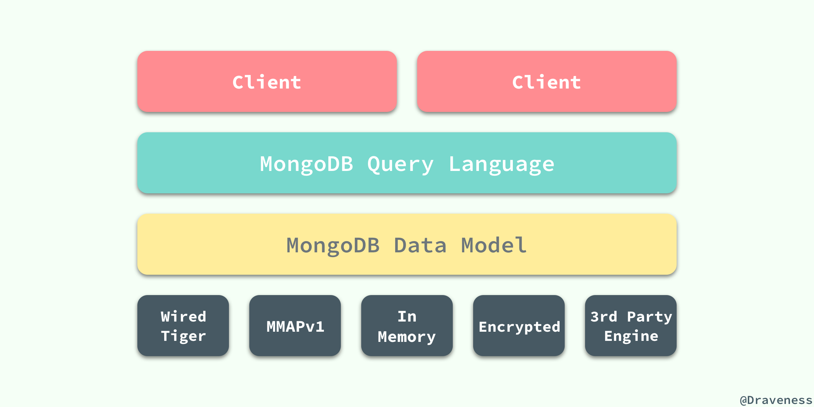
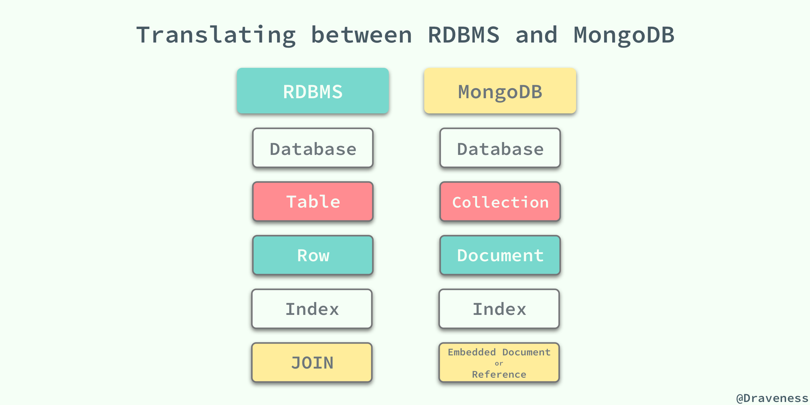
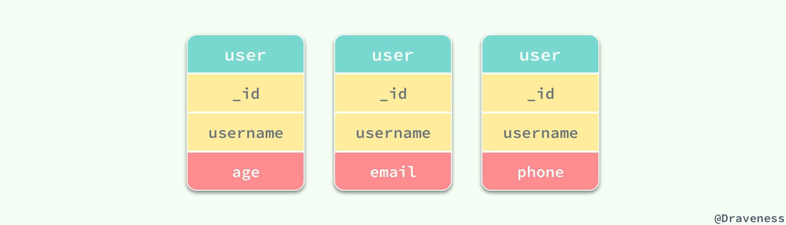
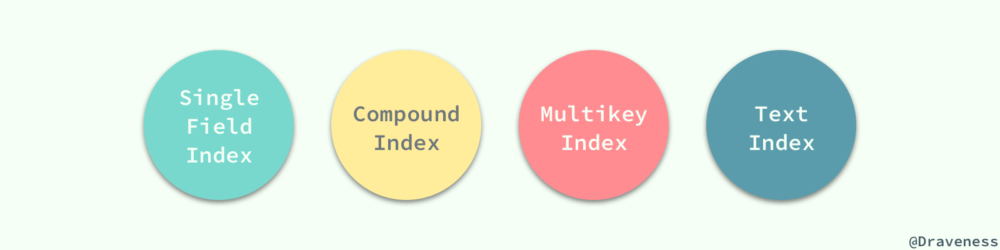
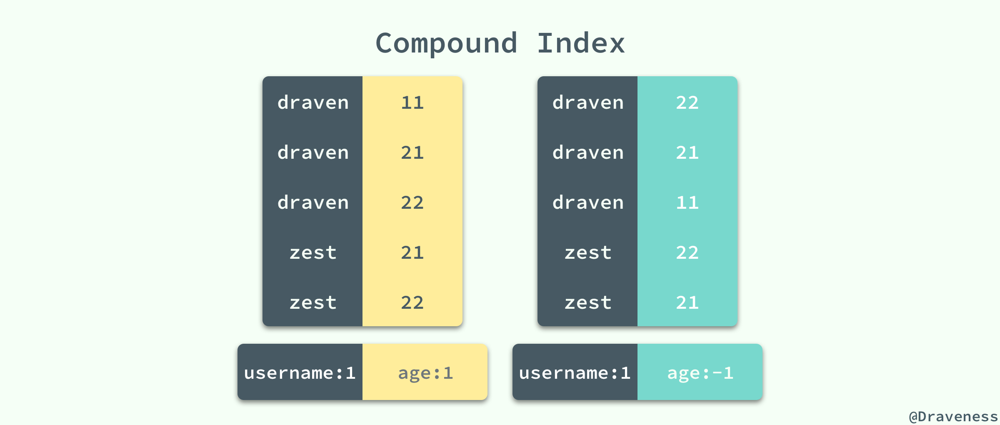
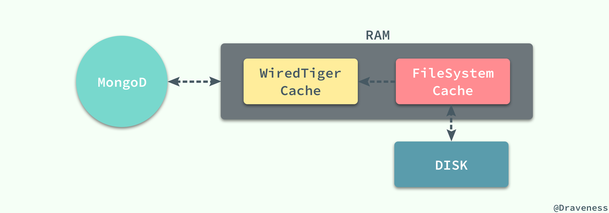

# 『浅入浅出』MongoDB 和 WiredTiger


MongoDB 是目前主流的 NoSQL 数据库之一，与关系型数据库和其它的 NoSQL 不同，MongoDB 使用了面向文档的数据存储方式，将数据以类似 JSON 的方式存储在磁盘上，因为项目上的一些历史遗留问题，作者在最近的工作中也不得不经常与 MongoDB 打交道，这也是这篇文章出现的原因。


虽然在之前也对 MongoDB 有所了解，但是真正在项目中大规模使用还是第一次，使用过程中也暴露了大量的问题，不过在这里，我们主要对 MongoDB 中的一些重要概念的原理进行介绍，也会与 MySQL 这种传统的关系型数据库做一个对比，让读者自行判断它们之间的优势和劣势。

## 概述

MongoDB 虽然也是数据库，但是它与传统的 RDBMS 相比有着巨大的不同，很多开发者都认为或者被灌输了一种思想，MongoDB 这种无 Scheme 的数据库相比 RDBMS 有着巨大的性能提升，这个判断其实是一种误解；因为数据库的性能不止与数据库本身的设计有关系，还与开发者对表结构和索引的设计、存储引擎的选择和业务有着巨大的关系，如果认为**仅进行了数据库的替换就能得到数量级的性能提升**，那还是太年轻了。


### 架构

现有流行的数据库其实都有着非常相似的架构，MongoDB 其实就与 MySQL 中的架构相差不多，底层都使用了『可插拔』的存储引擎以满足用户的不同需要。



用户可以根据表中的数据特征选择不同的存储引擎，它们可以在同一个 MongoDB 的实例中使用；在最新版本的 MongoDB 中使用了 WiredTiger 作为默认的存储引擎，WiredTiger 提供了不同粒度的并发控制和压缩机制，能够为不同种类的应用提供了最好的性能和存储效率。

在不同的存储引擎上层的就是 MongoDB 的数据模型和查询语言了，与关系型数据库不同，由于 MongoDB 对数据的存储与 RDBMS 有较大的差异，所以它创建了一套不同的查询语言；虽然 MongoDB 查询语言非常强大，支持的功能也很多，同时也是可编程的，不过其中包含的内容非常繁杂、API 设计也不是非常优雅，所以还是需要一些学习成本的，对于长时间使用 MySQL 的开发者肯定会有些不习惯。

```js
db.collection.updateMany(
   <filter>,
   <update>,
   {
     upsert: <boolean>,
     writeConcern: <document>,
     collation: <document>
   }
)
```

查询语言的复杂是因为 MongoDB 支持了很多的数据类型，同时每一条数据记录也就是文档有着非常复杂的结构，这点是从设计上就没有办法避免的，所以还需要使用 MongoDB 的开发者花一些时间去学习各种各样的 API。

### RDBMS 与 MongoDB

MongoDB 使用面向文档的的数据模型，导致很多概念都与 RDBMS 有一些差别，虽然从总体上来看两者都有相对应的概念，不过概念之间细微的差别其实也会影响我们对 MongoDB 的理解：
 


传统的 RDBMS 其实使用 `Table` 的格式将数据逻辑地存储在一张二维的表中，其中不包括任何复杂的数据结构，但是由于 MongoDB 支持嵌入文档、数组和哈希等多种复杂数据结构的使用，所以它最终将所有的数据以 [BSON](http://bsonspec.org) 的数据格式存储起来。

RDBMS 和 MongoDB 中的概念都有着相互对应的关系，数据库、表、行和索引的概念在两中数据库中都非常相似，唯独最后的 `JOIN` 和 `Embedded Document` 或者 `Reference` 有着巨大的差别。这一点差别其实也影响了在使用 MongoDB 时对集合（Collection）Schema 的设计，如果我们在 MongoDB 中遵循了与 RDBMS 中相同的思想对 Collection 进行设计，那么就不可避免的使用很多的 "JOIN" 语句，而 MongoDB 是不支持 "JOIN" 的，在应用内做这种查询的性能非常非常差，在这时使用嵌入式的文档其实就可以解决这种问题了，嵌入式的文档虽然可能会造成很多的数据冗余导致我们在更新时会很痛苦，但是查询时确实非常迅速。

```js
{
  _id: <ObjectId1>,
  name: "draveness",
  books: [
    {
      _id: <ObjectId2>,
      name: "MongoDB: The Definitive Guide"
    },
    {
      _id: <ObjectId3>,
      name: "High Performance MySQL"
    }
  ]
}
```

在 MongoDB 的使用时，我们一定要忘记很多 RDBMS 中对于表设计的规则，同时想清楚 MongoDB 的优势，仔细思考如何对表进行设计才能利用 MongoDB 提供的诸多特性提升查询的效率。

## 数据模型

MongoDB 与 RDBMS 之间最大的不同，就是数据模型的设计有着非常明显的差异，数据模型的不同决定了它有着非常不同的特性，存储在 MongoDB 中的数据有着非常灵活的 Schema，我们不需要像 RDBMS 一样，在插入数据之前就决定并且定义表中的数据结构，MongoDB 的结合不对 Collection 的数据结构进行任何限制，但是在实际使用中，同一个 Collection 中的大多数文档都具有类似的结构。



在为 MongoDB 应用设计数据模型时，如何表示数据模型之间的关系其实是需要开发者需要仔细考虑的，MongoDB 为表示文档之间的关系提供了两种不同的方法：引用和嵌入。

### 标准化数据模型

引用（Reference）在 MongoDB 中被称为标准化的数据模型，它与 MySQL 的外键非常相似，每一个文档都可以通过一个 `xx_id` 的字段『链接』到其他的文档：


但是 MongoDB 中的这种引用不像 MySQL 中可以直接通过 JOIN 进行查找，我们需要使用额外的查询找到该引用对应的模型，这虽然提供了更多的灵活性，不过由于增加了客户端和 MongoDB 之间的交互次数（Round-Trip）也会导致查询变慢，甚至非常严重的性能问题。

MongoDB 中的引用并不会对引用对应的数据模型是否真正存在做出任何的约束，所以如果在应用层级没有对文档之间的关系有所约束，那么就可能会出现引用了指向不存在的文档的问题：


虽然引用有着比较严重的性能问题并且在数据库层面没有对模型是否被删除加上限制，不过它提供的一些特点是嵌入式的文档无法给予了，当我们需要表示多对多关系或者更加庞大的数据集时，就可以考虑使用标准化的数据模型 — 引用了。

### 嵌入式数据模型

除了与 MySQL 中非常相似的引用，MongoDB 由于其独特的数据存储方式，还提供了嵌入式的数据模型，嵌入式的数据模型也被认为是不标准的数据模型：


因为 MongoDB 使用 BSON 的数据格式对数据进行存储，而嵌入式数据模型中的子文档其实就是父文档中的另一个值，只是其中存储的是一个对象：

```javascript
{
  _id: <ObjectId1>,
  username: "draveness",
  age: 20,
  contact: [
    {
      _id: <ObjectId2>,
      email: "i@draveness.me"
    }
  ]
}
```

嵌入式的数据模型允许我们将有相同的关系的信息存储在同一个数据记录中，这样应用就可以更快地对相关的数据进行查询和更新了；当我们的数据模型中有『包含』这样的关系或者模型经常需要与其他模型一起出现（查询）时，比如文章和评论，那么就可以考虑使用嵌入式的关系对数据模型进行设计。

总而言之，嵌入的使用让我们在更少的请求中获得更多的相关数据，能够为读操作提供更高的性能，也为在同一个写请求中同时更新相关数据提供了支持。

> MongoDB 底层的 WiredTiger 存储引擎能够保证对于同一个文档的操作都是原子的，任意一个写操作都不能原子性地影响多个文档或者多个集合。

## 主键和索引

在这一节中，我们将主要介绍 MongoDB 中不同类型的索引，当然也包括每个文档中非常重要的字段 `_id`，可以**理解**为 MongoDB 的『主键』，除此之外还会介绍单字段索引、复合索引以及多键索引等类型的索引。

MongoDB 中索引的概念其实与 MySQL 中的索引相差不多，无论是底层的数据结构还是基本的索引类型都几乎完全相同，两者之间的区别就在于因为 MongoDB 支持了不同类型的数据结构，所以也理所应当地提供了更多的索引种类。



### 默认索引

MySQL 中的每一个数据行都具有一个主键，数据库中的数据都是按照以主键作为键物理地存储在文件中的；除了用于数据的存储，主键由于其特性也能够加速数据库的查询语句。

而 MongoDB 中所有的文档也都有一个唯一的 `_id` 字段，在默认情况下所有的文档都使用一个长 12 字节的 `ObjectId` 作为默认索引：


前四位代表当前 `_id` 生成时的 Unix 时间戳，在这之后是三位的机器标识符和两位的处理器标识符，最后是一个三位的计数器，初始值就是一个随机数；通过这种方式代替递增的 `id` 能够解决分布式的 MongoDB 生成唯一标识符的问题，同时可以在一定程度上保证 `id` 的的增长是递增的。

### 单字段索引（Single Field）

除了 MongoDB 提供的默认 `_id` 字段之外，我们还可以建立其它的单键索引，而且其中不止支持顺序的索引，还支持对索引倒排：

```javasciprt
db.users.createIndex( { age: -1 } )
```

MySQL8.0 之前的索引都只能是正序排列的，在 8.0 之后才引入了逆序的索引，单一字段索引可以说是 MySQL 中的辅助（Secondary）索引的一个子集，它只是对除了 `_id` 外的任意单一字段建立起正序或者逆序的索引树。


### 复合索引（Compound）

除了单一字段索引这种非常简单的索引类型之外，MongoDB 还支持多个不同字段组成的复合索引（Compound Index），由于 MongoDB 中支持对同一字段的正逆序排列，所以相比于 MySQL 中的辅助索引就会出现更多的情况：

```javascript
db.users.createIndex( { username: 1, age: -1 } )
db.users.createIndex( { username: 1, age: 1 } )
```

上面的两个索引是完全不同的，在磁盘上的 B+ 树其实也按照了完全不同的顺序进行存储，虽然 `username` 字段都是升序排列的，但是对于 `age` 来说，两个索引的处理是完全相反的：



这也就造成了在使用查询语句对集合中数据进行查找时，如果约定了正逆序，那么其实是会使用不同的索引的，所以在索引创建时一定要考虑好使用的场景，避免创建无用的索引。

### 多键索引（Multikey）

由于 MongoDB 支持了类似数组的数据结构，所以也提供了名为多键索引的功能，可以将数组中的每一个元素进行索引，索引的创建其实与单字段索引没有太多的区别：

```javascript
db.collection.createIndex( { address: 1 } )
```

如果一个字段是值是数组，那么在使用上述代码时会自动为这个字段创建一个多键索引，能够加速对数组中元素的查找。

### 文本索引（Text）

文本索引是 MongoDB 为我们提供的另一个比较实用的功能，不过在这里也只是对这种类型的索引提一下，也不打算深入去谈谈这东西的性能如何，如果真的要做全文索引的话，还是推荐使用 Elasticsearch 这种更专业的东西来做，而不是使用 MongoDB 提供的这项功能。

## 存储

如何存储数据就是一个比较重要的问题，在前面我们已经提到了 MongoDB 与 MySQL 一样都提供了插件化的存储引擎支持，作为 MongoDB 的主要组件之一，存储引擎全权负责了 MongoDB 对数据的管理。


### WiredTiger

MongoDB3.2 之后 WiredTiger 就是默认的存储引擎了，如果对各个存储引擎并不了解，那么还是不要改变 MongoDB 的默认存储引擎；它有着非常多的优点，比如拥有效率非常高的缓存机制：



WiredTiger 还支持在内存中和磁盘上对索引进行压缩，在压缩时也使用了前缀压缩的方式以减少 RAM 的使用，在后面的文章中我们会详细介绍和分析 WiredTiger 存储引擎是如何对各种数据进行存储的。

### Journaling

为了在数据库宕机保证 MongoDB 中数据的持久性，MongoDB 使用了 Write Ahead Logging 向磁盘上的 journal 文件预先进行写入；除了 journal 日志，MongoDB 还使用检查点（Checkpoint）来保证数据的一致性，当数据库发生宕机时，我们就需要 Checkpoint 和 journal 文件协作完成数据的恢复工作：

1. 在数据文件中查找上一个检查点的标识符；
2. 在 journal 文件中查找标识符对应的记录；
3. 重做对应记录之后的全部操作；

MongoDB 会每隔 60s 或者在 journal 数据的写入达到 2GB 时设置一次检查点，当然我们也可以通过在写入时传入 `j: true` 的参数强制 journal 文件的同步。


这篇文章并不会介绍 Journal 文件的格式以及相关的内容，作者可能会在之后介绍分析 WiredTiger 的文章中简单分析其存储格式以及一些其它特性。

## 总结

这篇文章中只是对 MongoDB 的一些基本特性以及数据模型做了简单的介绍，虽然『无限』扩展是 MongoDB 非常重要的特性，但是由于篇幅所限，我们并没有介绍任何跟 MongoDB 集群相关的信息，不过会在之后的文章中专门介绍多实例的 MongoDB 是如何协同工作的。

在这里，我想说的是，如果各位读者接收到了类似 MongoDB 比 MySQL 性能好很多的断言，但是在使用 MongoDB 的过程中仍然遵循以往 RDBMS 对数据库的设计方式，那么我相信性能在最终也不会有太大的提升，反而可能会不升反降；只有真正理解 MongoDB 的数据模型，并且根据业务的需要进行设计才能很好地利用类似嵌入式文档等特性并提升 MongoDB 的性能。

## References

+ [MongoDB Architecture](https://www.mongodb.com/mongodb-architecture)
+ [Thinking in Documents: Part 1](https://www.mongodb.com/blog/post/thinking-documents-part-1?jmp=docs)
+ [DB-Engines Ranking](https://db-engines.com/en/ranking)
+ [Data Modeling Introduction](https://docs.mongodb.com/manual/core/data-modeling-introduction/)
+ [Building Applications with MongoDB's Pluggable Storage Engines: Part 1](https://www.mongodb.com/blog/post/building-applications-with-mongodbs-pluggable-storage-engines-part-1?jmp=docs)

