# 『浅入浅出』MySQL 和 InnoDB

作为一名开发人员，在日常的工作中会难以避免地接触到数据库，无论是基于文件的 sqlite 还是工程上使用非常广泛的 MySQL、PostgreSQL，但是一直以来也没有对数据库有一个非常清晰并且成体系的认知，所以最近两个月的时间看了几本数据库相关的书籍并且阅读了 MySQL 的官方文档，希望对各位了解数据库的、不了解数据库的有所帮助。


本文中对于数据库的介绍以及研究都是在 MySQL 上进行的，如果涉及到了其他数据库的内容或者实现会在文中单独指出。

## 数据库的定义

很多开发者在最开始时其实都对数据库有一个比较模糊的认识，觉得数据库就是一堆数据的集合，但是实际却比这复杂的多，数据库领域中有两个词非常容易混淆，也就是*数据库*和*实例*：

+ 数据库：物理操作文件系统或其他形式文件类型的集合；
+ 实例：MySQL 数据库由后台线程以及一个共享内存区组成；

> 对于数据库和实例的定义都来自于 [MySQL 技术内幕：InnoDB 存储引擎](https://book.douban.com/subject/24708143/) 一书，想要了解 InnoDB 存储引擎的读者可以阅读这本书籍。

### 数据库和实例

在 MySQL 中，实例和数据库往往都是一一对应的，而我们也无法直接操作数据库，而是要通过数据库实例来操作数据库文件，可以理解为数据库实例是数据库为上层提供的一个专门用于操作的接口。


在 Unix 上，启动一个 MySQL 实例往往会产生两个进程，`mysqld` 就是真正的数据库服务守护进程，而 `mysqld_safe` 是一个用于检查和设置 `mysqld` 启动的控制程序，它负责监控 MySQL 进程的执行，当 `mysqld` 发生错误时，`mysqld_safe` 会对其状态进行检查并在合适的条件下重启。

### MySQL 的架构

MySQL 从第一个版本发布到现在已经有了 20 多年的历史，在这么多年的发展和演变中，整个应用的体系结构变得越来越复杂：


最上层用于连接、线程处理的部分并不是 MySQL 『发明』的，很多服务都有类似的组成部分；第二层中包含了大多数 MySQL 的核心服务，包括了对 SQL 的解析、分析、优化和缓存等功能，存储过程、触发器和视图都是在这里实现的；而第三层就是 MySQL 中真正负责数据的存储和提取的存储引擎，例如：[InnoDB](https://en.wikipedia.org/wiki/InnoDB)、[MyISAM](https://en.wikipedia.org/wiki/MyISAM) 等，文中对存储引擎的介绍都是对 InnoDB 实现的分析。

## 数据的存储

在整个数据库体系结构中，我们可以使用不同的存储引擎来存储数据，而绝大多数存储引擎都以二进制的形式存储数据；这一节会介绍 InnoDB 中对数据是如何存储的。

在 InnoDB 存储引擎中，所有的数据都被**逻辑地**存放在表空间中，表空间（tablespace）是存储引擎中最高的存储逻辑单位，在表空间的下面又包括段（segment）、区（extent）、页（page）：

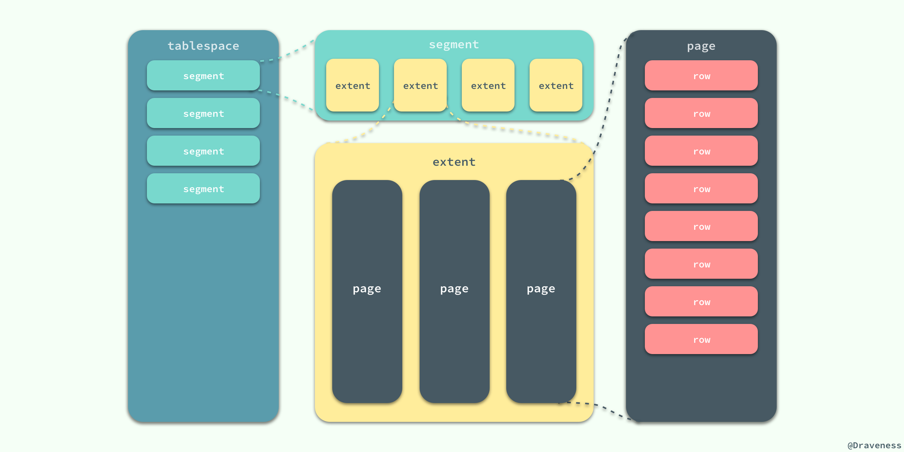

同一个数据库实例的所有表空间都有相同的页大小；默认情况下，表空间中的页大小都为 16KB，当然也可以通过改变 `innodb_page_size` 选项对默认大小进行修改，需要注意的是不同的页大小最终也会导致区大小的不同：


从图中可以看出，在 InnoDB 存储引擎中，一个区的大小最小为 1MB，页的数量最少为 64 个。

### 如何存储表

MySQL 使用 InnoDB 存储表时，会将**表的定义**和**数据索引**等信息分开存储，其中前者存储在 `.frm` 文件中，后者存储在 `.ibd` 文件中，这一节就会对这两种不同的文件分别进行介绍。


#### .frm 文件

无论在 MySQL 中选择了哪个存储引擎，所有的 MySQL 表都会在硬盘上创建一个 `.frm` 文件用来描述表的格式或者说定义；`.frm` 文件的格式在不同的平台上都是相同的。

```sql
CREATE TABLE test_frm(
    column1 CHAR(5), 
    column2 INTEGER
);
```

当我们使用上面的代码创建表时，会在磁盘上的 `datadir` 文件夹中生成一个 `test_frm.frm` 的文件，这个文件中就包含了表结构相关的信息：


> MySQL 官方文档中的 [11.1 MySQL .frm File Format](https://dev.mysql.com/doc/internals/en/frm-file-format.html) 一文对于 `.frm` 文件格式中的二进制的内容有着非常详细的表述，在这里就不展开介绍了。

#### .ibd 文件

InnoDB 中用于存储数据的文件总共有两个部分，一是系统表空间文件，包括 `ibdata1`、`ibdata2` 等文件，其中存储了 InnoDB 系统信息和用户数据库表数据和索引，是所有表公用的。

当打开 `innodb_file_per_table` 选项时，`.ibd` 文件就是每一个表独有的表空间，文件存储了当前表的数据和相关的索引数据。

### 如何存储记录

与现有的大多数存储引擎一样，InnoDB 使用页作为磁盘管理的最小单位；数据在 InnoDB 存储引擎中都是按行存储的，每个 16KB 大小的页中可以存放 2-200 行的记录。

当 InnoDB 存储数据时，它可以使用不同的行格式进行存储；MySQL 5.7 版本支持以下格式的行存储方式：

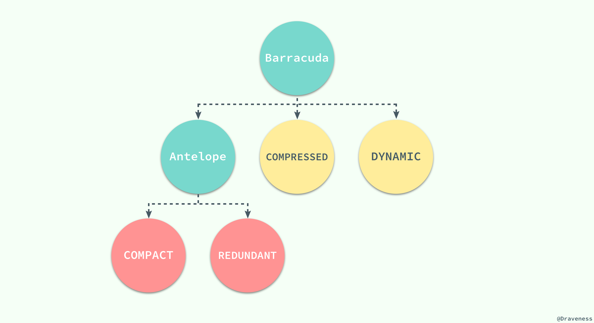

> Antelope 是 InnoDB 最开始支持的文件格式，它包含两种行格式 Compact 和 Redundant，它最开始并没有名字；Antelope 的名字是在新的文件格式 Barracuda 出现后才起的，Barracuda 的出现引入了两种新的行格式 Compressed 和 Dynamic；InnoDB 对于文件格式都会向前兼容，而官方文档中也对之后会出现的新文件格式预先定义好了名字：Cheetah、Dragon、Elk 等等。

两种行记录格式 Compact 和 Redundant 在磁盘上按照以下方式存储：

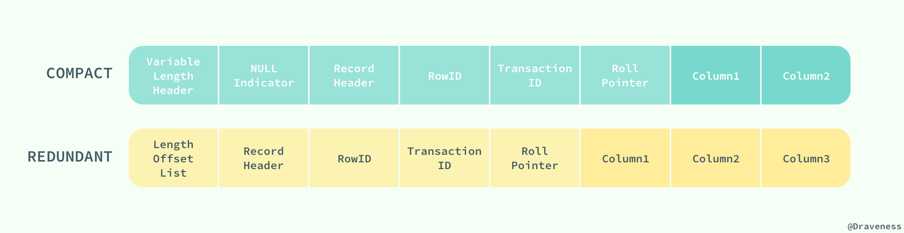

Compact 和 Redundant 格式最大的不同就是记录格式的第一个部分；在 Compact 中，行记录的第一部分倒序存放了一行数据中列的长度（Length），而 Redundant 中存的是每一列的偏移量（Offset），从总体上上看，Compact 行记录格式相比 Redundant 格式能够减少 20% 的存储空间。

#### 行溢出数据

当 InnoDB 使用 Compact 或者 Redundant 格式存储极长的 VARCHAR 或者 BLOB 这类大对象时，我们并不会直接将所有的内容都存放在数据页节点中，而是将行数据中的前 768 个字节存储在数据页中，后面会通过偏移量指向溢出页。


但是当我们使用新的行记录格式 Compressed 或者 Dynamic 时都只会在行记录中保存 20 个字节的指针，实际的数据都会存放在溢出页面中。


当然在实际存储中，可能会对不同长度的 TEXT 和 BLOB 列进行优化，不过这就不是本文关注的重点了。

> 想要了解更多与 InnoDB 存储引擎中记录的数据格式的相关信息，可以阅读 [InnoDB Record Structure](https://dev.mysql.com/doc/internals/en/innodb-record-structure.html)

### 数据页结构

页是 InnoDB 存储引擎管理数据的最小磁盘单位，而 B-Tree 节点就是实际存放表中数据的页面，我们在这里将要介绍页是如何组织和存储记录的；首先，一个 InnoDB 页有以下七个部分：


每一个页中包含了两对 header/trailer：内部的 Page Header/Page Directory 关心的是页的状态信息，而 Fil Header/Fil Trailer 关心的是记录页的头信息。

在页的头部和尾部之间就是用户记录和空闲空间了，每一个数据页中都包含 Infimum 和 Supremum 这两个**虚拟**的记录（可以理解为占位符），Infimum 记录是比该页中任何主键值都要小的值，Supremum 是该页中的最大值：


User Records 就是整个页面中真正用于存放行记录的部分，而 Free Space 就是空余空间了，它是一个链表的数据结构，为了保证插入和删除的效率，整个页面并不会按照主键顺序对所有记录进行排序，它会自动从左侧向右寻找空白节点进行插入，行记录在物理存储上并不是按照顺序的，它们之间的顺序是由 `next_record` 这一指针控制的。

B+ 树在查找对应的记录时，并不会直接从树中找出对应的行记录，它只能获取记录所在的页，将整个页加载到内存中，再通过 Page Directory 中存储的稀疏索引和 `n_owned`、`next_record` 属性取出对应的记录，不过因为这一操作是在内存中进行的，所以通常会忽略这部分查找的耗时。

InnoDB 存储引擎中对数据的存储是一个非常复杂的话题，这一节中也只是对表、行记录以及页面的存储进行一定的分析和介绍，虽然作者相信这部分知识对于大部分开发者已经足够了，但是想要真正消化这部分内容还需要很多的努力和实践。

## 索引

索引是数据库中非常非常重要的概念，它是存储引擎能够快速定位记录的秘密武器，对于提升数据库的性能、减轻数据库服务器的负担有着非常重要的作用；**索引优化是对查询性能优化的最有效手段**，它能够轻松地将查询的性能提高几个数量级。

### 索引的数据结构

在上一节中，我们谈了行记录的存储和页的存储，在这里我们就要从更高的层面看 InnoDB 中对于数据是如何存储的；InnoDB 存储引擎在绝大多数情况下使用 B+ 树建立索引，这是关系型数据库中查找最为常用和有效的索引，但是 B+ 树索引并不能找到一个给定键对应的具体值，它只能找到数据行对应的页，然后正如上一节所提到的，数据库把整个页读入到内存中，并在内存中查找具体的数据行。

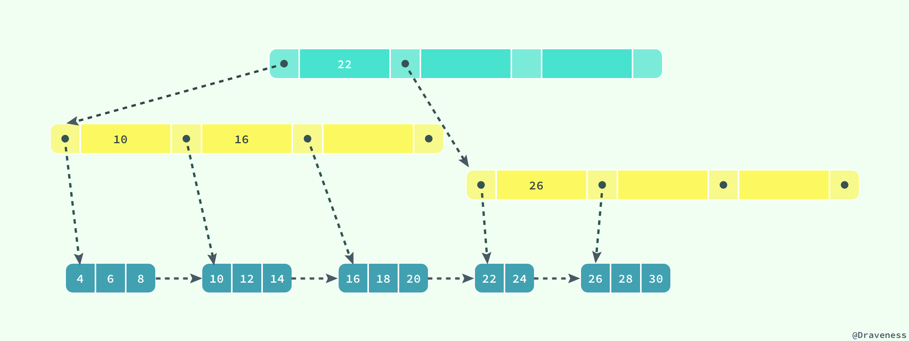

B+ 树是平衡树，它查找任意节点所耗费的时间都是完全相同的，比较的次数就是 B+ 树的高度；在这里，我们并不会深入分析或者动手实现一个 B+ 树，只是对它的特性进行简单的介绍。

### 聚集索引和辅助索引

数据库中的 B+ 树索引可以分为聚集索引（clustered index）和辅助索引（secondary index），它们之间的最大区别就是，聚集索引中存放着一条行记录的全部信息，而辅助索引中只包含索引列和一个用于查找对应行记录的『书签』。

#### 聚集索引

InnoDB 存储引擎中的表都是使用索引组织的，也就是按照键的顺序存放；聚集索引就是按照表中主键的顺序构建一颗 B+ 树，并在叶节点中存放表中的行记录数据。

```sql
CREATE TABLE users(
    id INT NOT NULL,
    first_name VARCHAR(20) NOT NULL,
    last_name VARCHAR(20) NOT NULL,
    age INT NOT NULL,
    PRIMARY KEY(id),
    KEY(last_name, first_name, age)
    KEY(first_name)
);
```

如果使用上面的 SQL 在数据库中创建一张表，B+ 树就会使用 `id` 作为索引的键，并在叶子节点中存储一条记录中的**所有**信息。

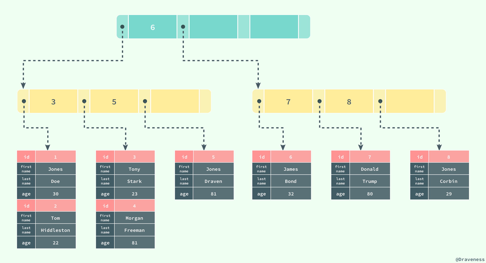

> 图中对 B+ 树的描述与真实情况下 B+ 树中的数据结构有一些差别，不过这里想要表达的主要意思是：聚集索引叶节点中保存的是整条行记录，而不是其中的一部分。

聚集索引与表的物理存储方式有着非常密切的关系，所有正常的表应该**有且仅有一个**聚集索引（绝大多数情况下都是主键），表中的所有行记录数据都是按照**聚集索引**的顺序存放的。

当我们使用聚集索引对表中的数据进行检索时，可以直接获得聚集索引所对应的整条行记录数据所在的页，不需要进行第二次操作。

#### 辅助索引

数据库将所有的非聚集索引都划分为辅助索引，但是这个概念对我们理解辅助索引并没有什么帮助；辅助索引也是通过 B+ 树实现的，但是它的叶节点并不包含行记录的全部数据，仅包含索引中的所有键和一个用于查找对应行记录的『书签』，在 InnoDB 中这个书签就是当前记录的主键。

辅助索引的存在并不会影响聚集索引，因为聚集索引构成的 B+ 树是数据实际存储的形式，而辅助索引只用于加速数据的查找，所以一张表上往往有多个辅助索引以此来提升数据库的性能。

> 一张表一定包含一个聚集索引构成的 B+ 树以及若干辅助索引的构成的 B+ 树。


如果在表 `users` 中存在一个辅助索引 `(first_name, age)`，那么它构成的 B+ 树大致就是上图这样，按照 `(first_name, age)` 的字母顺序对表中的数据进行排序，当查找到主键时，再通过聚集索引获取到整条行记录。

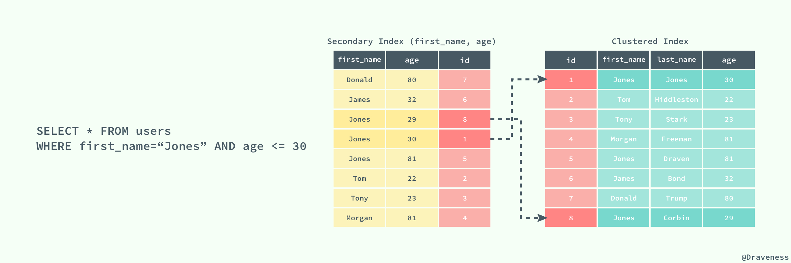

上图展示了一个使用辅助索引查找一条表记录的过程：通过辅助索引查找到对应的主键，最后在聚集索引中使用主键获取对应的行记录，这也是通常情况下行记录的查找方式。

### 索引的设计

索引的设计其实是一个非常重要的内容，同时也是一个非常复杂的内容；索引的设计与创建对于提升数据库的查询性能至关重要，不过这不是本文想要介绍的内容，有关索引的设计与优化可以阅读 [数据库索引设计与优化](数据库索引设计与优化) 一书，书中提供了一种非常科学合理的方法能够帮助我们在数据库中建立最适合的索引，当然作者也可能会在之后的文章中对索引的设计进行简单的介绍和分析。

## 锁

我们都知道锁的种类一般分为乐观锁和悲观锁两种，InnoDB 存储引擎中使用的就是悲观锁，而按照锁的粒度划分，也可以分成行锁和表锁。

### 并发控制机制

乐观锁和悲观锁其实都是并发控制的机制，同时它们在原理上就有着本质的差别；

+ 乐观锁是一种思想，它其实并不是一种真正的『锁』，它会先尝试对资源进行修改，在写回时判断资源是否进行了改变，如果没有发生改变就会写回，否则就会进行重试，在整个的执行过程中其实都**没有对数据库进行加锁**；
+ 悲观锁就是一种真正的锁了，它会在获取资源前对资源进行加锁，确保同一时刻只有有限的线程能够访问该资源，其他想要尝试获取资源的操作都会进入等待状态，直到该线程完成了对资源的操作并且释放了锁后，其他线程才能重新操作资源；

虽然乐观锁和悲观锁在本质上并不是同一种东西，一个是一种思想，另一个是一种真正的锁，但是它们都是一种并发控制机制。

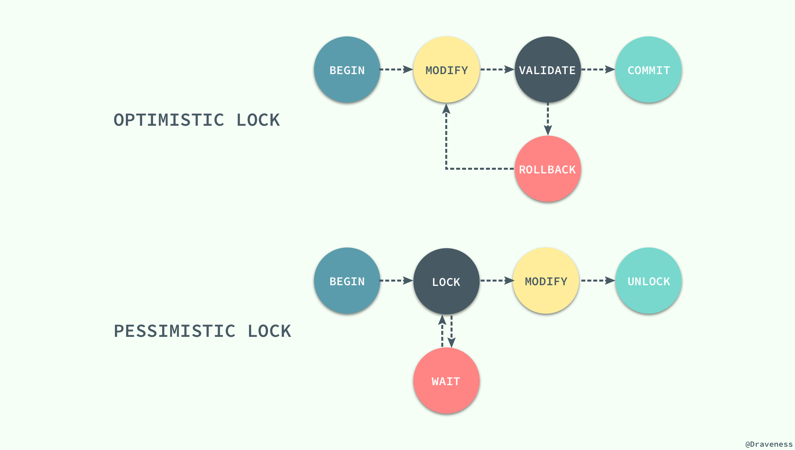

乐观锁不会存在死锁的问题，但是由于更新后验证，所以当**冲突频率**和**重试成本**较高时更推荐使用悲观锁，而需要非常高的**响应速度**并且**并发量**非常大的时候使用乐观锁就能较好的解决问题，在这时使用悲观锁就可能出现严重的性能问题；在选择并发控制机制时，需要综合考虑上面的四个方面（冲突频率、重试成本、响应速度和并发量）进行选择。

### 锁的种类

对数据的操作其实只有两种，也就是读和写，而数据库在实现锁时，也会对这两种操作使用不同的锁；InnoDB 实现了标准的行级锁，也就是共享锁（Shared Lock）和互斥锁（Exclusive Lock）；共享锁和互斥锁的作用其实非常好理解：

+ **共享锁（读锁）**：允许事务对一条行数据进行读取；
+ **互斥锁（写锁）**：允许事务对一条行数据进行删除或更新；

而它们的名字也暗示着各自的另外一个特性，共享锁之间是兼容的，而互斥锁与其他任意锁都不兼容：

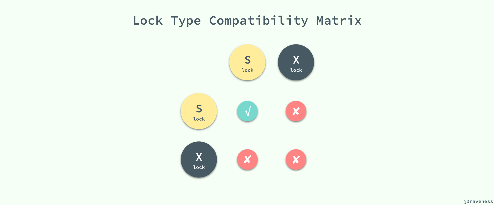

稍微对它们的使用进行思考就能想明白它们为什么要这么设计，因为共享锁代表了读操作、互斥锁代表了写操作，所以我们可以在数据库中**并行读**，但是只能**串行写**，只有这样才能保证不会发生线程竞争，实现线程安全。

### 锁的粒度

无论是共享锁还是互斥锁其实都只是对某一个数据行进行加锁，InnoDB 支持多种粒度的锁，也就是行锁和表锁；为了支持多粒度锁定，InnoDB 存储引擎引入了意向锁（Intention Lock），意向锁就是一种表级锁。

与上一节中提到的两种锁的种类相似的是，意向锁也分为两种：

+ **意向共享锁**：事务想要在获得表中某些记录的共享锁，需要在表上先加意向共享锁；
+ **意向互斥锁**：事务想要在获得表中某些记录的互斥锁，需要在表上先加意向互斥锁；

随着意向锁的加入，锁类型之间的兼容矩阵也变得愈加复杂：

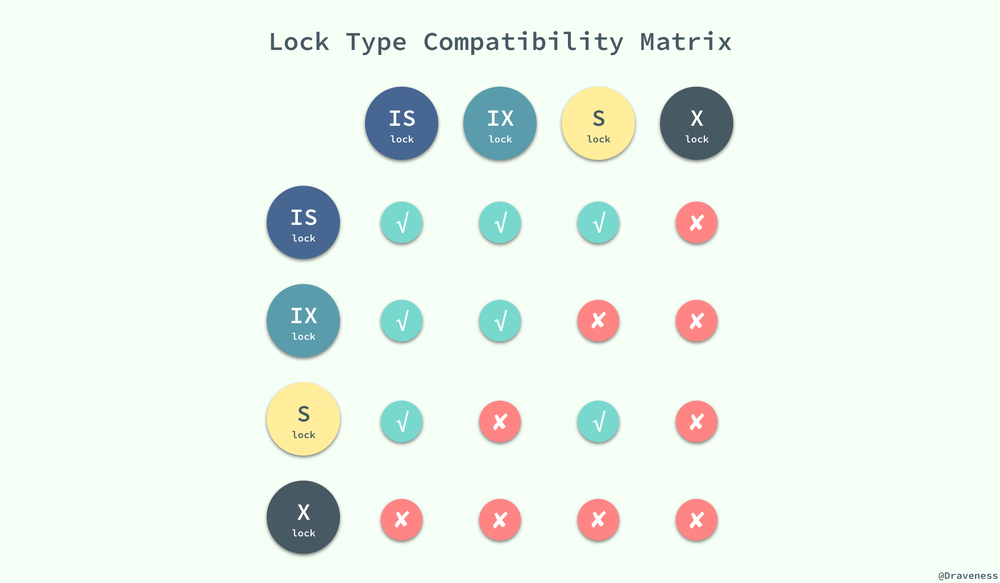

意向锁其实不会阻塞全表扫描之外的任何请求，它们的主要目的是为了表示**是否有人请求锁定表中的某一行数据**。

> 有的人可能会对意向锁的目的并不是完全的理解，我们在这里可以举一个例子：如果没有意向锁，当已经有人使用行锁对表中的某一行进行修改时，如果另外一个请求要对全表进行修改，那么就需要对所有的行是否被锁定进行扫描，在这种情况下，效率是非常低的；不过，在引入意向锁之后，当有人使用行锁对表中的某一行进行修改之前，会先为表添加意向互斥锁（IX），再为行记录添加互斥锁（X），在这时如果有人尝试对全表进行修改就不需要判断表中的每一行数据是否被加锁了，只需要通过等待意向互斥锁被释放就可以了。

### 锁的算法

到目前为止已经对 InnoDB 中锁的粒度有一定的了解，也清楚了在对数据库进行读写时会获取不同的锁，在这一小节将介绍锁是如何添加到对应的数据行上的，我们会分别介绍三种锁的算法：Record Lock、Gap Lock 和 Next-Key Lock。

#### Record Lock

记录锁（Record Lock）是加到**索引记录**上的锁，假设我们存在下面的一张表 `users`：

```sql
CREATE TABLE users(
    id INT NOT NULL AUTO_INCREMENT,
    last_name VARCHAR(255) NOT NULL,
    first_name VARCHAR(255),
    age INT,
    PRIMARY KEY(id),
    KEY(last_name),
    KEY(age)
);
```

如果我们使用 `id` 或者 `last_name` 作为 SQL 中 `WHERE` 语句的过滤条件，那么 InnoDB 就可以通过索引建立的 B+ 树找到行记录并添加索引，但是如果使用 `first_name` 作为过滤条件时，由于 InnoDB 不知道待修改的记录具体存放的位置，也无法对将要修改哪条记录提前做出判断就会锁定整个表。

#### Gap Lock

记录锁是在存储引擎中最为常见的锁，除了记录锁之外，InnoDB 中还存在间隙锁（Gap Lock），间隙锁是对索引记录中的一段连续区域的锁；当使用类似 `SELECT * FROM users WHERE id BETWEEN 10 AND 20 FOR UPDATE;` 的 SQL 语句时，就会阻止其他事务向表中插入 `id = 15` 的记录，因为整个范围都被间隙锁锁定了。

> 间隙锁是存储引擎对于性能和并发做出的权衡，并且只用于某些事务隔离级别。

虽然间隙锁中也分为共享锁和互斥锁，不过它们之间并不是互斥的，也就是不同的事务可以同时持有一段相同范围的共享锁和互斥锁，它唯一阻止的就是**其他事务向这个范围中添加新的记录**。

#### Next-Key Lock

Next-Key 锁相比前两者就稍微有一些复杂，它是记录锁和记录前的间隙锁的结合，在 `users` 表中有以下记录：

```sql
+------+-------------+--------------+-------+
|   id | last_name   | first_name   |   age |
|------+-------------+--------------+-------|
|    4 | stark       | tony         |    21 |
|    1 | tom         | hiddleston   |    30 |
|    3 | morgan      | freeman      |    40 |
|    5 | jeff        | dean         |    50 |
|    2 | donald      | trump        |    80 |
+------+-------------+--------------+-------+
```

如果使用 Next-Key 锁，那么 Next-Key 锁就可以在需要的时候锁定以下的范围：

```sql
(-∞, 21]
(21, 30]
(30, 40]
(40, 50]
(50, 80]
(80, ∞)
```

> 既然叫 Next-Key 锁，锁定的应该是当前值和后面的范围，但是实际上却不是，Next-Key 锁锁定的是当前值和前面的范围。

当我们更新一条记录，比如 `SELECT * FROM users WHERE age = 30 FOR UPDATE;`，InnoDB 不仅会在范围 `(21, 30]` 上加 Next-Key 锁，还会在这条记录后面的范围 `(30, 40]` 加间隙锁，所以插入 `(21, 40]` 范围内的记录都会被锁定。

Next-Key 锁的作用其实是为了解决幻读的问题，我们会在下一节谈事务的时候具体介绍。

### 死锁的发生

既然 InnoDB 中实现的锁是悲观的，那么不同事务之间就可能会互相等待对方释放锁造成死锁，最终导致事务发生错误；想要在 MySQL 中制造死锁的问题其实非常容易：

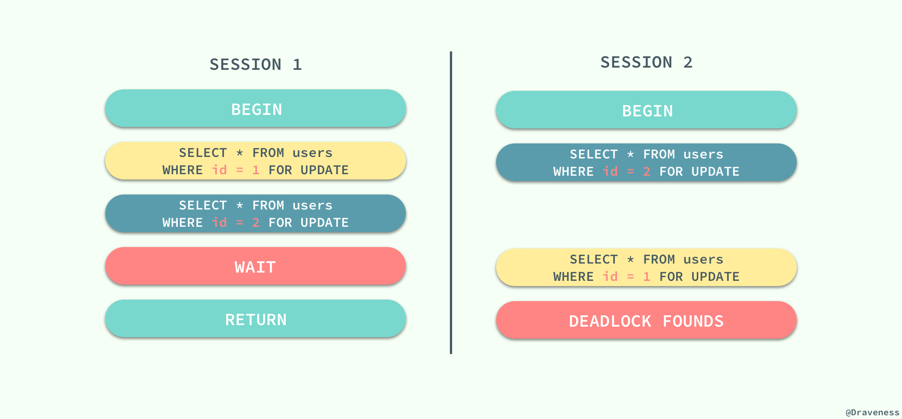

两个会话都持有一个锁，并且尝试获取对方的锁时就会发生死锁，不过 MySQL 也能在发生死锁时及时发现问题，并保证其中的一个事务能够正常工作，这对我们来说也是一个好消息。

## 事务与隔离级别

在介绍了锁之后，我们再来谈谈数据库中一个非常重要的概念 —— 事务；相信只要是一个合格的软件工程师就对事务的特性有所了解，其中被人经常提起的就是事务的原子性，在数据提交工作时，要么保证所有的修改都能够提交，要么就所有的修改全部回滚。

但是事务还遵循包括原子性在内的 ACID 四大特性：原子性（Atomicity）、一致性（Consistency）、隔离性（Isolation）和持久性（Durability）；文章不会对这四大特性全部展开进行介绍，相信你能够通过 Google 和数据库相关的书籍轻松获得有关它们的概念，本文最后要介绍的就是事务的四种隔离级别。

### 几种隔离级别

事务的隔离性是数据库处理数据的几大基础之一，而隔离级别其实就是提供给用户用于在性能和可靠性做出选择和权衡的配置项。

ISO 和 ANIS SQL 标准制定了四种事务隔离级别，而 InnoDB 遵循了 SQL:1992 标准中的四种隔离级别：`READ UNCOMMITED`、`READ COMMITED`、`REPEATABLE READ` 和 `SERIALIZABLE`；每个事务的隔离级别其实都比上一级多解决了一个问题：

+ `RAED UNCOMMITED`：使用查询语句不会加锁，可能会读到未提交的行（Dirty Read）；
+ `READ COMMITED`：只对记录加记录锁，而不会在记录之间加间隙锁，所以允许新的记录插入到被锁定记录的附近，所以再多次使用查询语句时，可能得到不同的结果（Non-Repeatable Read）；
+ `REPEATABLE READ`：多次读取同一范围的数据会返回第一次查询的快照，不会返回不同的数据行，但是可能发生幻读（Phantom Read）；
+ `SERIALIZABLE`：InnoDB 隐式地将全部的查询语句加上共享锁，解决了幻读的问题；

MySQL 中默认的事务隔离级别就是 `REPEATABLE READ`，但是它通过 Next-Key 锁也能够在某种程度上解决幻读的问题。

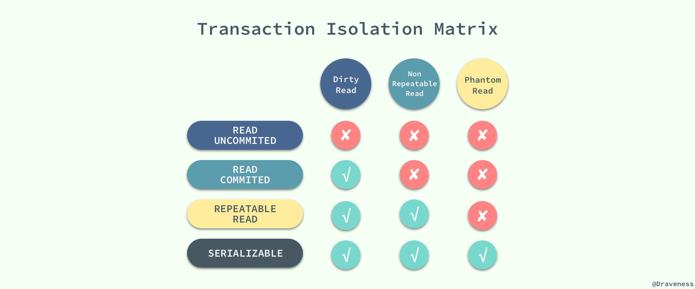

接下来，我们将数据库中创建如下的表并通过个例子来展示在不同的事务隔离级别之下，会发生什么样的问题：

```sql
CREATE TABLE test(
    id INT NOT NULL,
    UNIQUE(id)
);
```

### 脏读

当事务的隔离级别为 `READ UNCOMMITED` 时，我们在 `SESSION 2` 中插入的**未提交**数据在 `SESSION 1` 中是可以访问的。

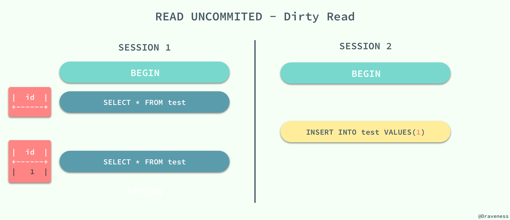

### 不可重复读

当事务的隔离级别为 `READ COMMITED` 时，虽然解决了脏读的问题，但是如果在 `SESSION 1` 先查询了一个范围的数据，在这之后 `SESSION 2` 中插入一条数据并且提交了修改，在这时，如果 `SESSION 1` 中再次使用相同的查询语句，就会发现两次查询的结果不一样。

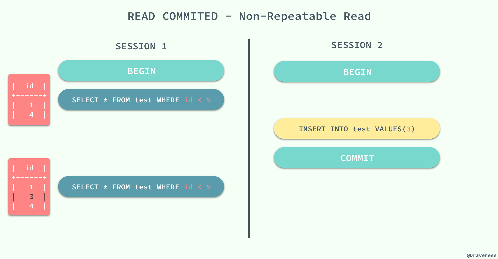

不可重复读的原因就是，在 `READ COMMITED` 的隔离级别下，存储引擎不会在查询记录时添加间隙锁，锁定 `id < 5` 这个范围。

### 幻读

重新开启了两个会话 `SESSION 1` 和 `SESSION 2`，在 `SESSION 1` 中我们查询全表的信息，没有得到任何记录；在 `SESSION 2` 中向表中插入一条数据并提交；由于 `REPEATABLE READ` 的原因，再次查询全表的数据时，我们获得到的仍然是空集，但是在向表中插入同样的数据却出现了错误。

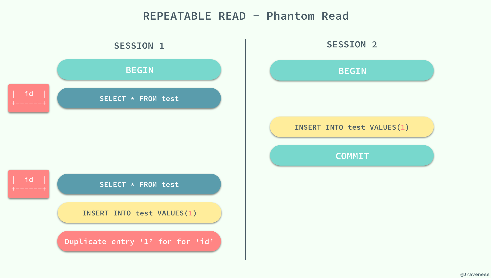

这种现象在数据库中就被称作幻读，虽然我们使用查询语句得到了一个空的集合，但是插入数据时却得到了错误，好像之前的查询是幻觉一样。

在标准的事务隔离级别中，幻读是由更高的隔离级别 `SERIALIZABLE` 解决的，但是它也可以通过 MySQL 提供的 Next-Key 锁解决：

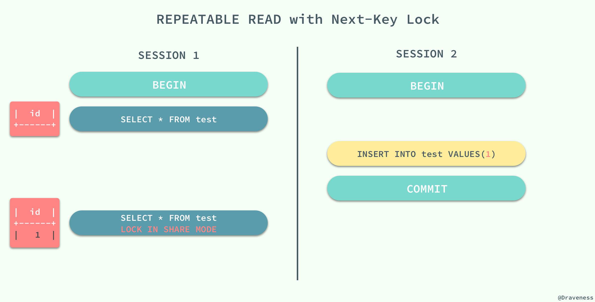

`REPERATABLE READ` 和 `READ UNCOMMITED` 其实是矛盾的，如果保证了前者就看不到已经提交的事务，如果保证了后者，就会导致两次查询的结果不同，MySQL 为我们提供了一种折中的方式，能够在 `REPERATABLE READ` 模式下加锁访问已经提交的数据，其本身并不能解决幻读的问题，而是通过文章前面提到的 Next-Key 锁来解决。

## 总结

> 文章中的内容大都来自于 [高性能 MySQL](https://book.douban.com/subject/23008813/)、[MySQL 技术内幕：InnoDB 存储引擎](https://book.douban.com/subject/24708143/)、[数据库索引设计与优化](https://book.douban.com/subject/26419771/) 以及 MySQL 的 [官方文档](https://dev.mysql.com/doc/)。

由于篇幅所限仅能对数据库中一些重要内容进行简单的介绍和总结，文中内容难免有所疏漏，如果对文章内容的有疑问，可以在博客下面评论留言（评论系统使用 Disqus，需要翻墙）。

## Reference

+ [mysqld_safe version different than mysqld?](https://dba.stackexchange.com/questions/35962/mysqld-safe-version-different-than-mysqld)
+ [File Space Management](https://dev.mysql.com/doc/refman/5.7/en/innodb-file-space.html)
+ [Externally Stored Fields in InnoDB](http://mysqlserverteam.com/externally-stored-fields-in-innodb/)
+ [InnoDB Record Structure](https://dev.mysql.com/doc/internals/en/innodb-record-structure.html)
+ [InnoDB Page Structure](https://dev.mysql.com/doc/internals/en/innodb-page-structure.html)
+ [Difference between clustered and nonclustered index](https://stackoverflow.com/questions/5070529/difference-between-clustered-and-nonclustered-index)
+ [InnoDB Locking](https://dev.mysql.com/doc/refman/5.7/en/innodb-locking.html)
+ [乐观锁与悲观锁的区别](http://www.cnblogs.com/Bob-FD/p/3352216.html)
+ [Optimistic concurrency control](https://en.wikipedia.org/wiki/Optimistic_concurrency_control)
+ [MySQL 四种事务隔离级的说明](http://www.cnblogs.com/zhoujinyi/p/3437475.html)

