# MySQL 索引设计概要

在关系型数据库中设计索引其实并不是复杂的事情，很多开发者都觉得设计索引能够提升数据库的性能，相关的知识一定非常复杂。


然而这种想法是不正确的，索引其实并不是一个多么高深莫测的东西，只要我们掌握一定的方法，理解索引的实现就能在不需要 DBA 的情况下设计出高效的索引。

本文会介绍 [数据库索引设计与优化](https://www.amazon.cn/图书/dp/B00ZH27RH0) 中设计索引的一些方法，让各位读者能够快速的在现有的工程中设计出合适的索引。

## 磁盘 IO

一个数据库必须保证其中存储的所有数据都是可以随时读写的，同时因为 MySQL 中所有的数据其实都是以文件的形式存储在磁盘上的，而从磁盘上**随机访问**对应的数据非常耗时，所以数据库程序和操作系统提供了缓冲池和内存以提高数据的访问速度。


除此之外，我们还需要知道数据库对数据的读取并不是以行为单位进行的，无论是读取一行还是多行，都会将该行或者多行所在的页全部加载进来，然后再读取对应的数据记录；也就是说，读取所耗费的时间与行数无关，只与页数有关。


在 MySQL 中，页的大小一般为 16KB，不过也可能是 8KB、32KB 或者其他值，这跟 MySQL 的存储引擎对数据的存储方式有很大的关系，文中不会展开介绍，不过**索引或行记录是否在缓存池中极大的影响了访问索引或者数据的成本**。

### 随机读取

数据库等待一个页从磁盘读取到缓存池的所需要的成本巨大的，无论我们是想要读取一个页面上的多条数据还是一条数据，都需要消耗**约** 10ms 左右的时间：

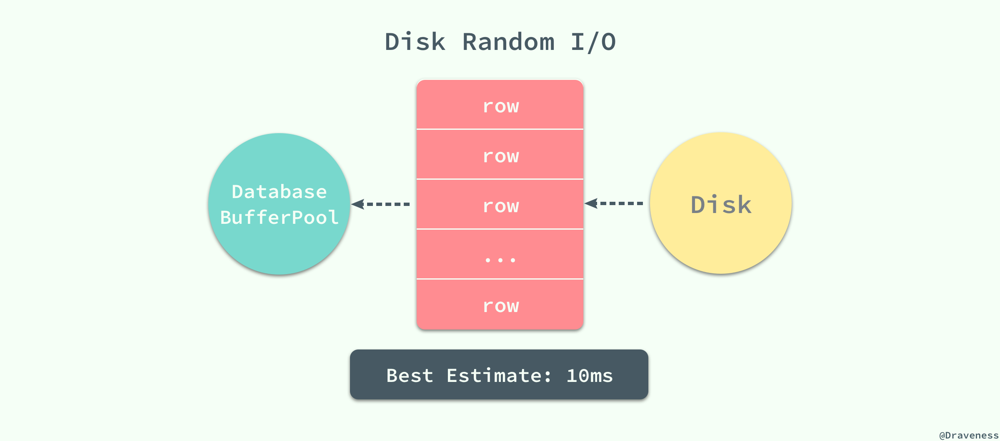

10ms 的时间在计算领域其实是一个非常巨大的成本，假设我们使用脚本向装了 SSD 的磁盘上顺序写入字节，那么在 10ms 内可以写入大概 3MB 左右的内容，但是数据库程序在 10ms 之内只能将一页的数据加载到数据库缓冲池中，从这里可以看出随机读取的代价是巨大的。

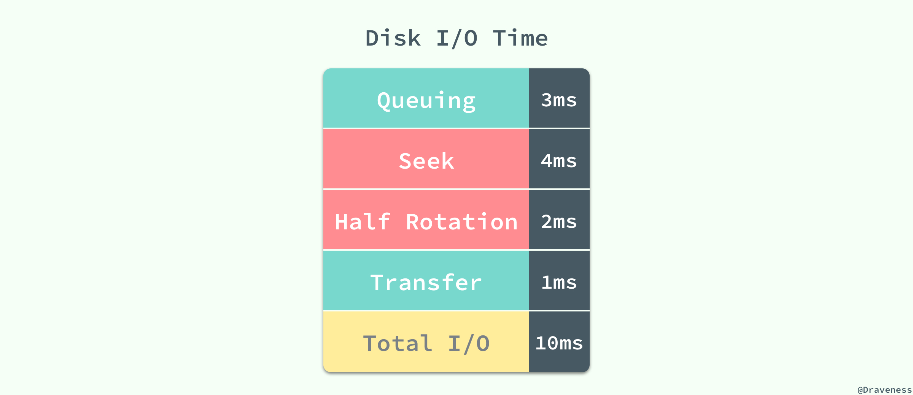

这 10ms 的一次随机读取是按照每秒 50 次的读取计算得到的，其中等待时间为 3ms、磁盘的实际繁忙时间约为 6ms，最终数据页从磁盘传输到缓冲池的时间为 1ms 左右，在对查询进行估算时并不需要准确的知道随机读取的时间，只需要知道估算出的 10ms 就可以了。

### 内存读取

如果在数据库的**缓存池**中没有找到对应的数据页，那么会去内存中寻找对应的页面：

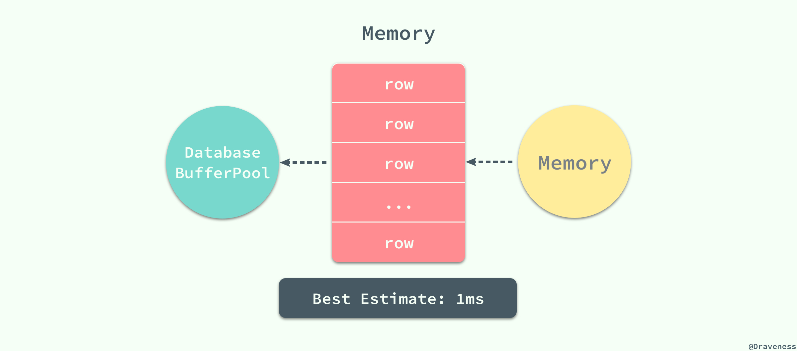

当对应的页面存在于内存时，数据库程序就会使用内存中的页，这能够将数据的读取时间降低一个数量级，将 10ms 降低到 1ms；MySQL 在执行读操作时，会先从数据库的缓冲区中读取，如果不存在与缓冲区中就会尝试从内存中加载页面，如果前面的两个步骤都失败了，最后就只能执行随机 IO 从磁盘中获取对应的数据页。

### 顺序读取

从磁盘读取数据并不是都要付出很大的代价，当数据库管理程序一次性从磁盘中**顺序**读取大量的数据时，读取的速度会异常的快，大概在 40MB/s 左右。

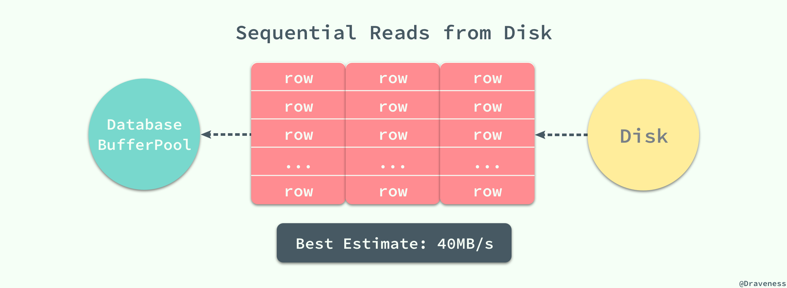

如果一个页面的大小为 4KB，那么 1s 的时间就可以读取 10000 个页，读取一个页面所花费的平均时间就是 0.1ms，相比随机读取的 10ms 已经降低了两个数量级，甚至比内存中读取数据还要快。


数据页面的顺序读取有两个非常重要的优势：

1. 同时读取多个界面意味着总时间的消耗会大幅度减少，磁盘的吞吐量可以达到 40MB/s；
2. 数据库管理程序会对一些即将使用的界面进行预读，以减少查询请求的等待和响应时间；

### 小结

数据库查询操作的时间大都消耗在从磁盘或者内存中读取数据的过程，由于随机 IO 的代价巨大，如何在一次数据库查询中减少随机 IO 的次数往往能够大幅度的降低查询所耗费的时间提高磁盘的吞吐量。

## 查询过程

在上一节中，文章从数据页加载的角度介绍了磁盘 IO 对 MySQL 查询的影响，而在这一节中将介绍 MySQL 查询的执行过程中以及数据库中的数据的特征对最终查询性能的影响。

### 索引片（Index Slices）

索引片其实就是 SQL 查询在执行过程中扫描的一个索引片段，在这个范围中的索引将被顺序扫描，根据索引片包含的列数不同，[数据库索引设计与优化](https://www.amazon.cn/图书/dp/B00ZH27RH0) 书中对将索引分为宽索引和窄索引：

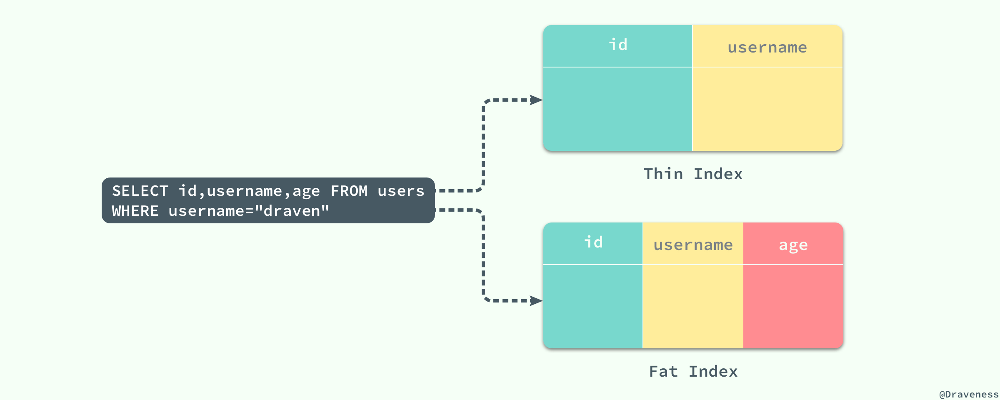

> 主键列 `id` 在所有的 MySQL 索引中都是一定会存在的。

对于查询 `SELECT id, username, age FROM users WHERE username="draven"` 来说，(id, username) 就是一个窄索引，因为该索引没有包含存在于 SQL 查询中的 age 列，而 (id, username, age) 就是该查询的一个宽索引了，它**包含这个查询中所需要的全部数据列**。

宽索引能够避免二次的随机 IO，而窄索引就需要在对索引进行顺序读取之后再根据主键 id 从主键索引中查找对应的数据：

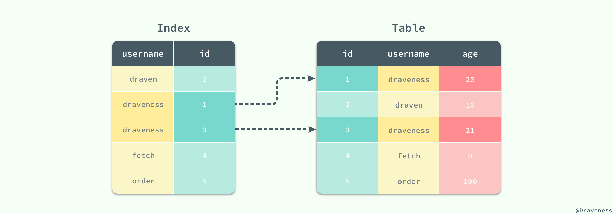

对于窄索引，每一个在索引中匹配到的记录行最终都需要执行另外的随机读取从聚集索引中获得剩余的数据，如果结果集非常大，那么就会导致随机读取的次数过多进而影响性能。

### 过滤因子

从上一小节对索引片的介绍，我们可以看到影响 SQL 查询的除了查询本身还与数据库表中的数据特征有关，如果使用的是窄索引那么对表的随机访问就不可避免，在这时如何让索引片变『薄』就是我们需要做的了。

一个 SQL 查询扫描的索引片大小其实是由过滤因子决定的，也就是满足查询条件的记录行数所占的比例：

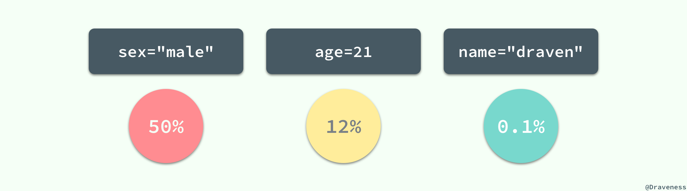

对于 users 表来说，sex="male" 就不是一个好的过滤因子，它会选择整张表中一半的数据，所以**在一般情况下**我们最好不要使用 sex 列作为整个索引的第一列；而 name="draven" 的使用就可以得到一个比较好的过滤因子了，它的使用能过滤整个数据表中 99.9% 的数据；当然我们也可以将这三个过滤进行组合，创建一个新的索引 (name, age, sex) 并同时使用这三列作为过滤条件：

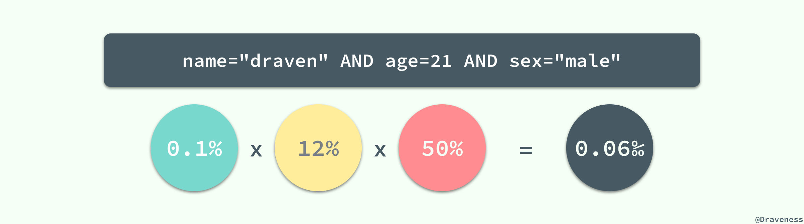

> 当三个过滤条件都是等值谓词时，几个索引列的顺序其实是无所谓的，索引列的顺序不会影响同一个 SQL 语句对索引的选择，也就是索引 (name, age, sex) 和 (age, sex, name) 对于上图中的条件来说是完全一样的，这两个索引在执行查询时都有着完全相同的效果。

组合条件的过滤因子就可以达到十万分之 6 了，如果整张表中有 10w 行数据，也只需要在扫描薄索引片后进行 6 次随机读取，这种直接使用乘积来计算组合条件的过滤因子其实有一个比较重要的问题：列与列之间不应该有太强的相关性，如果不同的列之间有相关性，那么得到的结果就会比直接乘积得出的结果大一些，比如：所在的城市和邮政编码就有非常强的相关性，两者的过滤因子直接相乘其实与实际的过滤因子会有很大的偏差，不过这在多数情况下都不是太大的问题。

对于一张表中的同一个列，不同的值也会有不同的过滤因子，这也就造成了同一列的不同值最终的查询性能也会有很大差别：

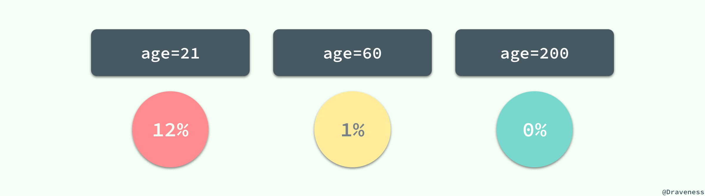

当我们评估一个索引是否合适时，需要考虑极端情况下查询语句的性能，比如 0% 或者 50% 等；最差的输入往往意味着最差的性能，在平均情况下表现良好的 SQL 语句在极端的输入下可能就完全无法正常工作，这也是在设计索引时需要注意的问题。

总而言之，需要扫描的索引片的大小对查询性能的影响至关重要，而扫描的索引记录的数量，就是总行数与组合条件的过滤因子的乘积，索引片的大小最终也决定了从表中读取数据所需要的时间。

### 匹配列与过滤列

假设在 users 表中有 name、age 和 (name, sex, age) 三个辅助索引；当 WHERE 条件中存在类似 age = 21 或者 name = "draven" 这种**等值谓词**时，它们都会成为匹配列（Matching Column）用于选择索引树中的数据行，但是当我们使用以下查询时：

```sql
SELECT * FROM users
WHERE name = "draven" AND sex = "male" AND age > 20;
```

虽然我们有 (name, sex, age) 索引包含了上述查询条件中的全部列，但是在这里只有 name 和 sex 两列才是匹配列，MySQL 在执行上述查询时，会选择 name 和 sex 作为匹配列，扫描所有满足条件的数据行，然后将 age 当做过滤列（Filtering Column）：

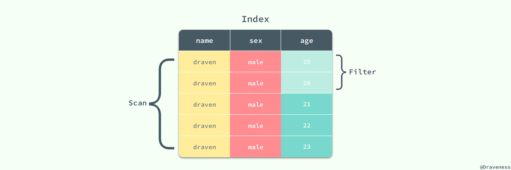

过滤列虽然不能够减少索引片的大小，但是能够减少从表中随机读取数据的次数，所以在索引中也扮演着非常重要的角色。

## 索引的设计

作者相信文章前面的内容已经为索引的设计提供了充足的理论基础和知识，从总体来看如何减少随机读取的次数是设计索引时需要重视的最重要的问题，在这一节中，我们将介绍 [数据库索引设计与优化](https://www.amazon.cn/图书/dp/B00ZH27RH0) 一书中归纳出的设计最佳索引的方法。

### 三星索引

三星索引是对于一个查询语句可能的最好索引，如果一个查询语句的索引是三星索引，那么它只需要进行**一次磁盘的随机读及一个窄索引片的顺序扫描**就可以得到全部的结果集；因此其查询的响应时间比普通的索引会少几个数量级；根据书中对三星索引的定义，我们可以理解为主键索引对于 `WHERE id = 1` 就是一个特殊的三星索引，我们只需要对主键索引树进行一次索引访问并且顺序读取一条数据记录查询就结束了。


为了满足三星索引中的三颗星，我们分别需要做以下几件事情：

1. 第一颗星需要取出所有等值谓词中的列，作为索引开头的最开始的列（任意顺序）；
2. 第二颗星需要将 ORDER BY 列加入索引中；
3. 第三颗星需要将查询语句剩余的列全部加入到索引中；

> 三星索引的概念和星级的给定来源于 [数据库索引设计与优化](https://www.amazon.cn/图书/dp/B00ZH27RH0) 书中第四章三星索引一节。

如果对于一个查询语句我们依照上述的三个条件进行设计，那么就可以得到该查询的三星索引，这三颗星中的最后一颗星往往都是最容易获得的，满足第三颗星的索引也就是上面提到的宽索引，能够避免大量的随机 IO，如果我们遵循这个顺序为一个 SQL 查询设计索引那么我们就可以得到一个完美的索引了；这三颗星的获得其实也没有表面上这么简单，每一颗星都有自己的意义：


1. 第一颗星不只是将等值谓词的列加入索引，它的作用是减少索引片的大小以减少需要扫描的数据行；
2. 第二颗星用于避免排序，减少磁盘 IO 和内存的使用；
3. 第三颗星用于避免每一个索引对应的数据行都需要进行一次随机 IO 从聚集索引中读取剩余的数据；

在实际场景中，问题往往没有这么简单，我们虽然可以总能够通过宽索引避免大量的随机访问，但是在一些复杂的查询中我们无法同时获得第一颗星和第二颗星。

```sql
SELECT id, name, age FROM users
WHERE age BETWEEN 18 AND 21 
  AND city = "Beijing"
ORDER BY name;
```

在上述查询中，我们总可以通过增加索引中的列以获得第三颗星，但是如果我们想要获得第一颗星就需要最小化索引片的大小，这时索引的前缀必须为 (city, age)，在这时再想获得第三颗星就不可能了，哪怕在 age 的后面添加索引列 name，也会因为 name 在范围索引列 age 后面必须进行一次排序操作，最终得到的索引就是 (city, age, name, id)：

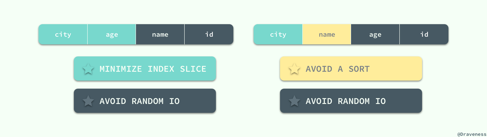

如果我们需要在内存中避免排序的话，就需要交换 age 和 name 的位置了，在这时就可以得到索引 (city, name, age, id)，当一个 SQL 查询中**同时拥有范围谓词和 ORDER BY 时**，无论如何我们都是没有办法获得一个三星索引的，我们能够做的就是在这两者之间做出选择，是牺牲第一颗星还是第二颗星。

总而言之，在设计单表的索引时，首先把查询中所有的**等值谓词全部取出**以任意顺序放在索引最前面，在这时，如果索引中同时存在范围索引和 ORDER BY 就需要权衡利弊了，希望最小化扫描的索引片厚度时，应该将**过滤因子最小的范围索引列**加入索引，如果希望避免排序就选择 **ORDER BY 中的全部列**，在这之后就只需要将查询中**剩余的全部列**加入索引了，通过这种固定的方法和逻辑就可以最快地获得一个查询语句的二星或者三星索引了。

## 总结

在单表上对索引进行设计其实还是非常容易的，只需要遵循固定的套路就能设计出一个理想的三星索引，在这里强烈推荐 [数据库索引设计与优化](https://www.amazon.cn/图书/dp/B00ZH27RH0) 这本书籍，其中包含了大量与索引设计与优化的相关内容；在之后的文章中读者也会分析介绍书中提供的几种估算方法，来帮助我们通过预估问题设计出更高效的索引。

> Follow: [Draveness · GitHub](https://github.com/Draveness)

## Reference

+ [数据库索引设计与优化](https://www.amazon.cn/图书/dp/B00ZH27RH0)
+ [File Space Management](https://dev.mysql.com/doc/refman/5.7/en/innodb-file-space.html)
+ [Inside of Hard Drive - YouTube](https://www.youtube.com/watch?v=9eMWG3fwiEU)
+ [Hard Disk Working | How does a hard disk work | Hard Drive - YouTube](https://www.youtube.com/watch?v=4iaxOUYalJU)

