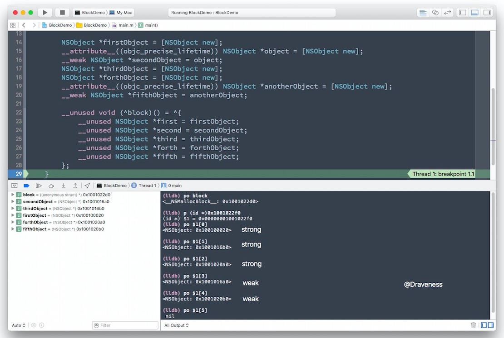
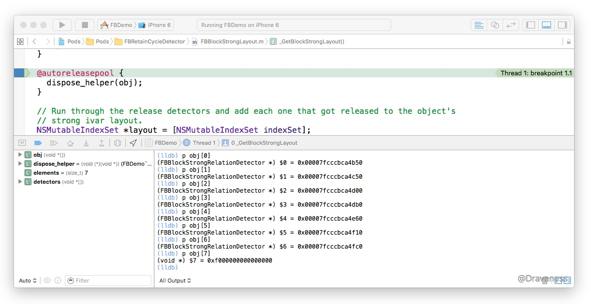
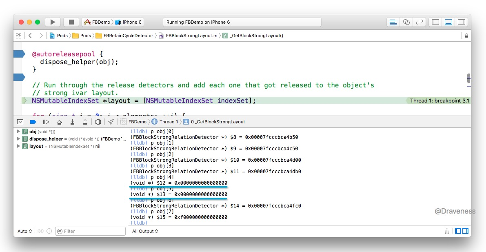

# iOS 中的 block 是如何持有对象的

> Follow: [Draveness · Github](https://github.com/Draveness)

Block 是 Objective-C 中笔者最喜欢的特性，它为 Objective-C 这门语言提供了强大的函数式编程能力，而最近苹果推出的很多新的 API 都已经开始原生的支持 block 语法，可见它在 Objective-C 中变得越来越重要。


这篇文章并不会详细介绍 block 在内存中到底是以什么形式存在的，主要会介绍 block 是如何持有并且释放对象的。文章中的代码都出自 Facebook 开源的**用于检测循环引用**的框架 [FBRetainCycleDetector](https://github.com/facebook/FBRetainCycleDetector)，这是分析该框架文章中的最后一篇，也是笔者觉得最有意思的一部分。

> 如果你希望了解 FBRetainCycleDetector 的原理可以阅读[如何在 iOS 中解决循环引用的问题](https://github.com/Draveness/iOS-Source-Code-Analyze/blob/master/contents/FBRetainCycleDetector/如何在%20iOS%20中解决循环引用的问题.md)以及后续文章。

## 为什么会谈到 block

可能很多读者会有这样的疑问，本文既然是对 `FBRetainCycleDetector` 解析的文章，为什么会提到 block？原因其实很简单，因为在 iOS 开发中大多数的循环引用都是因为 block 使用不当导致的，由于 block 会 retain 它持有的对象，这样就很容易造成循环引用，最终导致内存泄露。

在 `FBRetainCycleDetector` 中存在这样一个类 `FBObjectiveCBlock`，这个类的 `- allRetainedObjects` 方法就会返回所有 block 持有的强引用，这也是文章需要关注的重点。

```objectivec
- (NSSet *)allRetainedObjects {
	NSMutableArray *results = [[[super allRetainedObjects] allObjects] mutableCopy];

	__attribute__((objc_precise_lifetime)) id anObject = self.object;

	void *blockObjectReference = (__bridge void *)anObject;
	NSArray *allRetainedReferences = FBGetBlockStrongReferences(blockObjectReference);

	for (id object in allRetainedReferences) {
		FBObjectiveCGraphElement *element = FBWrapObjectGraphElement(self, object, self.configuration);
		if (element) {
			[results addObject:element];
		}
	}

	return [NSSet setWithArray:results];
}
```

这部分代码中的大部分都不重要，只是在开头调用父类方法，在最后将获取的对象包装成一个系列 `FBObjectiveCGraphElement`，最后返回一个数组，也就是当前对象 block 持有的全部强引用了。

## Block 是什么？

对 block 稍微有了解的人都知道，block 其实是一个结构体，其结构大概是这样的：

```objectivec
struct BlockLiteral {
	void *isa;
	int flags;
	int reserved;
	void (*invoke)(void *, ...);
	struct BlockDescriptor *descriptor;
};

struct BlockDescriptor {
	unsigned long int reserved;
	unsigned long int size;
	void (*copy_helper)(void *dst, void *src);
	void (*dispose_helper)(void *src);
	const char *signature;
};
```

在 `BlockLiteral` 结构体中有一个 `isa` 指针，而对 `isa`了解的人也都知道，这里的 `isa` 其实指向了一个类，每一个 block 指向的类可能是 `__NSGlobalBlock__`、`__NSMallocBlock__` 或者 `__NSStackBlock__`，但是这些 block，它们继承自一个共同的父类，也就是 `NSBlock`，我们可以使用下面的代码来获取这个类：

```objectivec
static Class _BlockClass() {
	static dispatch_once_t onceToken;
	static Class blockClass;
	dispatch_once(&onceToken, ^{
		void (^testBlock)() = [^{} copy];
		blockClass = [testBlock class];
		while(class_getSuperclass(blockClass) && class_getSuperclass(blockClass) != [NSObject class]) {
			blockClass = class_getSuperclass(blockClass);
		}
		[testBlock release];
	});
	return blockClass;
}
```

Objective-C 中的三种 block `__NSMallocBlock__`、`__NSStackBlock__` 和 `__NSGlobalBlock__` 会在下面的情况下出现：

|  | ARC | 非 ARC |
|------------|:----------------------------:|-----------------------------|
| 捕获外部变量 | `__NSMallocBlock__` <br> `__NSStackBlock__` | `__NSStackBlock__`|
| 未捕获外部变量 | `__NSGlobalBlock__`| `__NSGlobalBlock__` |


+ 在 ARC 中，捕获外部了变量的 block 的类会是 `__NSMallocBlock__` 或者 `__NSStackBlock__`，如果 block 被赋值给了某个变量在这个过程中会执行 `_Block_copy` 将原有的 `__NSStackBlock__` 变成 `__NSMallocBlock__`；但是如果 block 没有被赋值给某个变量，那它的类型就是 `__NSStackBlock__`；没有捕获外部变量的 block 的类会是 `__NSGlobalBlock__` 即不在堆上，也不在栈上，它类似 C 语言函数一样会在代码段中。
+ 在非 ARC 中，捕获了外部变量的 block 的类会是 `__NSStackBlock__`，放置在栈上，没有捕获外部变量的 block 时与 ARC 环境下情况相同。

如果我们不断打印一个 block 的 `superclass` 的话最后就会在继承链中找到 `NSBlock` 的身影：


然后可以通过这种办法来判断当前对象是不是 block：

```objectivec
BOOL FBObjectIsBlock(void *object) {
	Class blockClass = _BlockClass();
	
	Class candidate = object_getClass((__bridge id)object);
	return [candidate isSubclassOfClass:blockClass];
}
```

## Block 如何持有对象

在这一小节，我们将讨论 block 是**如何持有对象**的，我们会通过对 FBRetainCycleDetector 的源代码进行分析最后尽量详尽地回答这一问题。

重新回到文章开头提到的 `- allRetainedObjects` 方法：

```objectivec
- (NSSet *)allRetainedObjects {
	NSMutableArray *results = [[[super allRetainedObjects] allObjects] mutableCopy];

	__attribute__((objc_precise_lifetime)) id anObject = self.object;

	void *blockObjectReference = (__bridge void *)anObject;
	NSArray *allRetainedReferences = FBGetBlockStrongReferences(blockObjectReference);

	for (id object in allRetainedReferences) {
		FBObjectiveCGraphElement *element = FBWrapObjectGraphElement(self, object, self.configuration);
		if (element) {
			[results addObject:element];
		}
	}

	return [NSSet setWithArray:results];
}
```

通过函数的符号我们也能够猜测出，上述方法中通过 `FBGetBlockStrongReferences` 获取 block 持有的所有强引用：

```objectivec
NSArray *FBGetBlockStrongReferences(void *block) {
	if (!FBObjectIsBlock(block)) {
		return nil;
	}

	NSMutableArray *results = [NSMutableArray new];

	void **blockReference = block;
	NSIndexSet *strongLayout = _GetBlockStrongLayout(block);
	[strongLayout enumerateIndexesUsingBlock:^(NSUInteger idx, BOOL *stop) {
		void **reference = &blockReference[idx];

		if (reference && (*reference)) {
			id object = (id)(*reference);

			if (object) {
				[results addObject:object];
			}
		}
	}];

	return [results autorelease];
}
```

而 `FBGetBlockStrongReferences` 是对另一个私有函数 `_GetBlockStrongLayout` 的封装，也是实现最有意思的部分。

### 几个必要的概念

在具体介绍 `_GetBlockStrongLayout` 函数的源代码之前，我希望先对其原理有一个简单的介绍，便于各位读者的理解；在这里有三个概念需要介绍，首先是 block 持有的对象都存在的位置。

#### 如何持有对象

在文章的上面曾经出现过 block 的结构体，不知道各位读者是否还有印象：

```objectivec
struct BlockLiteral {
	void *isa;
	int flags;
	int reserved;
	void (*invoke)(void *, ...);
	struct BlockDescriptor *descriptor;
	// imported variables
};
```

在每个 block 结构体的下面就会存放当前 block 持有的所有对象，无论强弱。我们可以做一个小实验来验证这个观点，我们在程序中声明这样一个 block：

```objectivec
NSObject *firstObject = [NSObject new];
__attribute__((objc_precise_lifetime)) NSObject *object = [NSObject new];
__weak NSObject *secondObject = object;
NSObject *thirdObject = [NSObject new];

__unused void (^block)() = ^{
	__unused NSObject *first = firstObject;
	__unused NSObject *second = secondObject;
	__unused NSObject *third = thirdObject;
};
```

然后在代码中打一个断点：


> 上面代码中 block 由于被变量引用，执行了 `_Block_copy`，所以其类型为 `__NSMallocBlock__`，没有被变量引用的 block 都是 `__NSStackBlock__`。

1. 首先打印 block 变量的大小，因为 block 变量其实只是一个指向结构体的指针，所以大小为 8，而结构体的大小为 32；
2. 以 block 的地址为基址，偏移 32，得到一个指针
3. 使用 `$3[0]` `$3[1]` `$3[2]` 依次打印地址为 `0x1001023b0` `0x1001023b8` `0x1001023c0` 的内容，可以发现它们就是 block 捕获的全部引用，前两个是强引用，最后的是弱引用

这可以得出一个结论：block 将其捕获的引用存放在结构体的下面，但是为什么这里的顺序并不是按照引用的顺序呢？接下来增加几个变量，再做另一次实验：



在代码中多加入了几个对象之后，block 对持有的对象的布局的顺序依然是**强引用在前、弱引用在后**，我们不妨做一个假设：**block 会将强引用的对象排放在弱引用对象的前面**。但是这个假设能够帮助我们在**只有 block 但是没有上下文信息的情况下**区分哪些是强引用么？我觉得并不能，因为我们没有办法知道它们之间的分界线到底在哪里。

#### dispose_helper

第二个需要介绍的是 `dispose_helper`，这是 `BlockDescriptor` 结构体中的一个指针：

```objectivec
struct BlockDescriptor {
	unsigned long int reserved;                // NULL
	unsigned long int size;
	// optional helper functions
	void (*copy_helper)(void *dst, void *src); // IFF (1<<25)
	void (*dispose_helper)(void *src);         // IFF (1<<25)
	const char *signature;                     // IFF (1<<30)
};
```

上面的结构体中有两个函数指针，`copy_helper` 用于 block 的拷贝，`dispose_helper` 用于 block 的 `dispose` 也就是 block 在析构的时候会调用这个函数指针，销毁自己持有的对象，而这个原理也是区别强弱引用的关键，因为在 `dispose_helper` 会对强引用发送 `release` 消息，对弱引用不会做任何的处理。

#### FBBlockStrongRelationDetector

最后就是用于从 `dispose_helper` 接收消息的类 `FBBlockStrongRelationDetector` 了；它的实例在接受 `release` 消息时，并不会真正的释放，只会将标记 `_strong` 为 YES：

```objectivec
- (oneway void)release {
	_strong = YES;
}

- (oneway void)trueRelease {
	[super release];
}
```

只有真正执行 `trueRelease` 的时候才会向对象发送 `release` 消息。

因为这个文件覆写了 `release` 方法，所以要在非 ARC 下编译：

```objectivec
#if __has_feature(objc_arc)
#error This file must be compiled with MRR. Use -fno-objc-arc flag.
#endif
```

如果 block 持有了另一个 block 对象，`FBBlockStrongRelationDetector` 也可以将自身 fake 成为一个假的 block 防止在接收到关于 block 释放的消息时发生 crash：

```objectivec
struct _block_byref_block;
@interface FBBlockStrongRelationDetector : NSObject {
	// __block fakery
	void *forwarding;
	int flags;   //refcount;
	int size;
	void (*byref_keep)(struct _block_byref_block *dst, struct _block_byref_block *src);
	void (*byref_dispose)(struct _block_byref_block *);
	void *captured[16];
}
```

该类的实例在初始化时，会设置 `forwarding`、`byref_keep` 和 `byref_dispose`，后两个方法的实现都是空的，只是为了防止 crash：

```objectivec
+ (id)alloc {
	FBBlockStrongRelationDetector *obj = [super alloc];
	
	// Setting up block fakery
	obj->forwarding = obj;
	obj->byref_keep = byref_keep_nop;
	obj->byref_dispose = byref_dispose_nop;
	
	return obj;
}

static void byref_keep_nop(struct _block_byref_block *dst, struct _block_byref_block *src) {}
static void byref_dispose_nop(struct _block_byref_block *param) {}
```

### 获取 block 强引用的对象

到现在为止，获取 block 强引用对象所需要的知识都介绍完了，接下来可以对私有方法 `_GetBlockStrongLayout` 进行分析了：

```objectivec
static NSIndexSet *_GetBlockStrongLayout(void *block) {
	struct BlockLiteral *blockLiteral = block;
	
	if ((blockLiteral->flags & BLOCK_HAS_CTOR)
		|| !(blockLiteral->flags & BLOCK_HAS_COPY_DISPOSE)) {
		return nil;
	}
	
	...
}
```

+ 如果 block 有 Cpp 的构造器/析构器，说明它**持有的对象很有可能没有按照指针大小对齐**，我们很难检测到所有的对象
+ 如果 block 没有 `dispose` 函数，说明它无法 `retain` 对象，也就是说我们也没有办法测试其强引用了哪些对象

```objectivec
static NSIndexSet *_GetBlockStrongLayout(void *block) {
	...
	void (*dispose_helper)(void *src) = blockLiteral->descriptor->dispose_helper;
	const size_t ptrSize = sizeof(void *);	
	const size_t elements = (blockLiteral->descriptor->size + ptrSize - 1) / ptrSize;
	
	void *obj[elements];
	void *detectors[elements];
	
	for (size_t i = 0; i < elements; ++i) {
		FBBlockStrongRelationDetector *detector = [FBBlockStrongRelationDetector new];
		obj[i] = detectors[i] = detector;
	}
	
	@autoreleasepool {
		dispose_helper(obj);
	}
	...
}
```

1. 从 `BlockDescriptor` 取出 `dispose_helper` 以及 `size`（block 持有的所有对象的大小）
2. 通过 `(blockLiteral->descriptor->size + ptrSize - 1) / ptrSize` 向上取整，获取 block 持有的指针的数量
3. 初始化两个包含 `elements` 个 `FBBlockStrongRelationDetector` 实例的数组，其中第一个数组用于传入 `dispose_helper`，第二个数组用于检测 `_strong` 是否被标记为 `YES`
4. 在自动释放池中执行 `dispose_helper(obj)`，释放 block 持有的对象

```objectivec
static NSIndexSet *_GetBlockStrongLayout(void *block) {
	...
	NSMutableIndexSet *layout = [NSMutableIndexSet indexSet];
	
	for (size_t i = 0; i < elements; ++i) {
		FBBlockStrongRelationDetector *detector = (FBBlockStrongRelationDetector *)(detectors[i]);
		if (detector.isStrong) {
			[layout addIndex:i];
		}
		
		[detector trueRelease];
	}
	
	return layout;
}
```

因为 `dispose_helper` 只会调用 `release` 方法，但是这并不会导致我们的 `FBBlockStrongRelationDetector` 实例被释放掉，反而会标记 `_string` 属性，在这里我们只需要判断这个属性的真假，将对应索引加入数组，最后再调用 `trueRelease` 真正的释放对象。

我们可以执行下面的代码，分析其工作过程：

```objectivec
NSObject *firstObject = [NSObject new];
__attribute__((objc_precise_lifetime)) NSObject *object = [NSObject new];
__weak NSObject *secondObject = object;
NSObject *thirdObject = [NSObject new];

__unused void (^block)() = ^{
	__unused NSObject *first = firstObject;
	__unused NSObject *second = secondObject;
	__unused NSObject *third = thirdObject;
};

FBRetainCycleDetector *detector = [FBRetainCycleDetector new];
[detector addCandidate:block];
[detector findRetainCycles];
```

在 `dispose_helper` 调用之前：



`obj` 数组中的每一个位置都存储了 `FBBlockStrongRelationDetector` 的实例，但是在 `dispose_helper` 调用之后：



索引为 4 和 5 处的实例已经被清空了，这里对应的 `FBBlockStrongRelationDetector` 实例的 `strong` 已经被标记为 `YES`、加入到数组中并返回；最后也就获取了所有强引用的索引，同时得到了 block 强引用的对象。

## 总结

其实最开始笔者对这个 `dispose_helper` 实现的机制并不是特别的肯定，只是有一个猜测，但是在询问了 `FBBlockStrongRelationDetector` 的作者之后，才确定 `dispose_helper` 确实会负责向所有捕获的变量发送 `release` 消息，如果有兴趣可以看这个 [issue](https://github.com/facebook/FBRetainCycleDetector/issues/15)。这部分的代码其实最开始源于 mikeash 大神的 [Circle](https://github.com/mikeash/Circle)，不过对于他是如何发现这一点的，笔者并不清楚，如果各位有相关的资料或者合理的解释，可以随时联系我。

> Follow: [Draveness · Github](https://github.com/Draveness)


