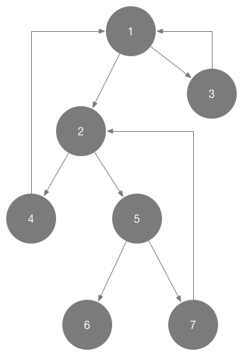

# 如何在 iOS 中解决循环引用的问题

稍有常识的人都知道在 iOS 开发时，我们经常会遇到循环引用的问题，比如两个强指针相互引用，但是这种简单的情况作为稍有经验的开发者都会轻松地查找出来。

但是遇到下面这样的情况，如果只看其实现代码，也很难仅仅凭借肉眼上的观察以及简单的推理就能分析出其中存在的循环引用问题，更何况真实情况往往比这复杂的多：

```objectivec
testObject1.object = testObject2;
testObject1.secondObject = testObject3;
testObject2.object = testObject4;
testObject2.secondObject = testObject5;
testObject3.object = testObject1;
testObject5.object = testObject6;
testObject4.object = testObject1;
testObject5.secondObject = testObject7;
testObject7.object = testObject2;
```

上述代码确实是存在循环引用的问题：



这一次分享的内容就是用于检测循环引用的框架 [FBRetainCycleDetector]([https://github.com/facebook/FBRetainCycleDetector]) 我们会分几个部分来分析 FBRetainCycleDetector 是如何工作的：

1. 检测循环引用的基本原理以及过程
2. [检测涉及 NSObject 对象的循环引用问题](https://github.com/Draveness/iOS-Source-Code-Analyze/blob/master/contents/FBRetainCycleDetector/检测%20NSObject%20对象持有的强指针.md)
2. [检测涉及 Associated Object 关联对象的循环引用问题](https://github.com/Draveness/iOS-Source-Code-Analyze/blob/master/contents/FBRetainCycleDetector/如何实现%20iOS%20中的%20Associated%20Object.md)
3. 检测涉及 Block 的循环引用问题

这是四篇文章中的第一篇，我们会以类 `FBRetainCycleDetector` 的 `- findRetainCycles` 方法为入口，分析其实现原理以及运行过程。

简单介绍一下 `FBRetainCycleDetector` 的使用方法：

```objectivec
_RCDTestClass *testObject = [_RCDTestClass new];
testObject.object = testObject;

FBRetainCycleDetector *detector = [FBRetainCycleDetector new];
[detector addCandidate:testObject];
NSSet *retainCycles = [detector findRetainCycles];

NSLog(@"%@", retainCycles);
```

1. 初始化一个 `FBRetainCycleDetector` 的实例
2. 调用 `- addCandidate:` 方法添加潜在的泄露对象
3. 执行 `- findRetainCycles` 返回 `retainCycles`

在控制台中的输出是这样的：

```c
2016-07-29 15:26:42.043 xctest[30610:1003493] {(
		(
		"-> _object -> _RCDTestClass "
	)
)}
```

说明 `FBRetainCycleDetector` 在代码中发现了循环引用。

## findRetainCycles 的实现

在具体开始分析 `FBRetainCycleDetector` 代码之前，我们可以先观察一下方法 `findRetainCycles` 的调用栈：

```objectivec
- (NSSet<NSArray<FBObjectiveCGraphElement *> *> *)findRetainCycles
└── - (NSSet<NSArray<FBObjectiveCGraphElement *> *> *)findRetainCyclesWithMaxCycleLength:(NSUInteger)length
    └── - (NSSet<NSArray<FBObjectiveCGraphElement *> *> *)_findRetainCyclesInObject:(FBObjectiveCGraphElement *)graphElement stackDepth:(NSUInteger)stackDepth
        └── - (instancetype)initWithObject:(FBObjectiveCGraphElement *)object
            └── - (FBNodeEnumerator *)nextObject
                ├── - (NSArray<FBObjectiveCGraphElement *> *)_unwrapCycle:(NSArray<FBNodeEnumerator *> *)cycle
                ├── - (NSArray<FBObjectiveCGraphElement *> *)_shiftToUnifiedCycle:(NSArray<FBObjectiveCGraphElement *> *)array
                └── - (void)addObject:(ObjectType)anObject;
```

调用栈中最上面的两个简单方法的实现都是比较容易理解的：

```objectivec
- (NSSet<NSArray<FBObjectiveCGraphElement *> *> *)findRetainCycles {
	return [self findRetainCyclesWithMaxCycleLength:kFBRetainCycleDetectorDefaultStackDepth];
}

- (NSSet<NSArray<FBObjectiveCGraphElement *> *> *)findRetainCyclesWithMaxCycleLength:(NSUInteger)length {
	NSMutableSet<NSArray<FBObjectiveCGraphElement *> *> *allRetainCycles = [NSMutableSet new];
	for (FBObjectiveCGraphElement *graphElement in _candidates) {
		NSSet<NSArray<FBObjectiveCGraphElement *> *> *retainCycles = [self _findRetainCyclesInObject:graphElement
																						  stackDepth:length];
		[allRetainCycles unionSet:retainCycles];
	}
	[_candidates removeAllObjects];
	
	return allRetainCycles;
}
```

`- findRetainCycles` 调用了 `- findRetainCyclesWithMaxCycleLength:` 传入了 `kFBRetainCycleDetectorDefaultStackDepth` 参数来限制查找的深度，如果超过该深度（默认为 10）就不会继续处理下去了（查找的深度的增加会对性能有非常严重的影响）。

在 `- findRetainCyclesWithMaxCycleLength:` 中，我们会遍历所有潜在的内存泄露对象 `candidate`，执行整个框架中最核心的方法 `- _findRetainCyclesInObject:stackDepth:`，由于这个方法的实现太长，这里会分几块对其进行介绍，并会省略其中的注释：

```objectivec
- (NSSet<NSArray<FBObjectiveCGraphElement *> *> *)_findRetainCyclesInObject:(FBObjectiveCGraphElement *)graphElement
																 stackDepth:(NSUInteger)stackDepth {
	NSMutableSet<NSArray<FBObjectiveCGraphElement *> *> *retainCycles = [NSMutableSet new];
	FBNodeEnumerator *wrappedObject = [[FBNodeEnumerator alloc] initWithObject:graphElement];
	
	NSMutableArray<FBNodeEnumerator *> *stack = [NSMutableArray new];
	
	NSMutableSet<FBNodeEnumerator *> *objectsOnPath = [NSMutableSet new];

	...
}
```

其实整个对象的相互引用情况可以看做一个**有向图**，对象之间的引用就是图的 `Edge`，每一个对象就是 `Vertex`，**查找循环引用的过程就是在整个有向图中查找环的过程**，所以在这里我们使用 DFS 来扫面图中的环，这些环就是对象之间的循环引用。

> 文章中并不会介绍 DFS 的原理，如果对 DFS 不了解的读者可以看一下这个[视频]([https://www.youtube.com/watch?v=tlPuVe5Otio])，或者找以下相关资料了解一下 DFS 的实现。

接下来就是 DFS 的实现：

```objectivec
- (NSSet<NSArray<FBObjectiveCGraphElement *> *> *)_findRetainCyclesInObject:(FBObjectiveCGraphElement *)graphElement
																 stackDepth:(NSUInteger)stackDepth {
	...
	[stack addObject:wrappedObject];
	
	while ([stack count] > 0) {
		@autoreleasepool {
			FBNodeEnumerator *top = [stack lastObject];
			[objectsOnPath addObject:top];

			FBNodeEnumerator *firstAdjacent = [top nextObject];
			if (firstAdjacent) {

				BOOL shouldPushToStack = NO;
				
				if ([objectsOnPath containsObject:firstAdjacent]) {
					NSUInteger index = [stack indexOfObject:firstAdjacent];
					NSInteger length = [stack count] - index;
					
					if (index == NSNotFound) {
						shouldPushToStack = YES;
					} else {
						NSRange cycleRange = NSMakeRange(index, length);
						NSMutableArray<FBNodeEnumerator *> *cycle = [[stack subarrayWithRange:cycleRange] mutableCopy];
						[cycle replaceObjectAtIndex:0 withObject:firstAdjacent];
						
						[retainCycles addObject:[self _shiftToUnifiedCycle:[self _unwrapCycle:cycle]]];
					}
				} else {
					shouldPushToStack = YES;
				}
				
				if (shouldPushToStack) {
					if ([stack count] < stackDepth) {
						[stack addObject:firstAdjacent];
					}
				}
			} else {
				[stack removeLastObject];
				[objectsOnPath removeObject:top];
			}
		}
	}
	return retainCycles;
}
```

这里其实就是对 DFS 的具体实现，其中比较重要的有两点，一是使用 `nextObject` 获取下一个需要遍历的对象，二是对查找到的环进行处理和筛选；在这两点之中，第一点相对重要，因为 `nextObject` 的实现是调用 `allRetainedObjects` 方法获取被当前对象持有的对象，如果没有这个方法，我们就无法获取当前对象的邻接结点，更无从谈起遍历了：

```objectivec
- (FBNodeEnumerator *)nextObject {
	if (!_object) {
		return nil;
	} else if (!_retainedObjectsSnapshot) {
		_retainedObjectsSnapshot = [_object allRetainedObjects];
		_enumerator = [_retainedObjectsSnapshot objectEnumerator];
	}
	
	FBObjectiveCGraphElement *next = [_enumerator nextObject];
	
	if (next) {
		return [[FBNodeEnumerator alloc] initWithObject:next];
	}
	
	return nil;
}
```

基本上所有图中的对象 `FBObjectiveCGraphElement` 以及它的子类 `FBObjectiveCBlock` `FBObjectiveCObject` 和 `FBObjectiveCNSCFTimer` 都实现了这个方法返回其持有的对象数组。获取数组之后，就再把其中的对象包装成新的 `FBNodeEnumerator` 实例，也就是下一个 `Vertex`。

因为使用 `- subarrayWithRange:` 方法获取的数组中的对象都是 `FBNodeEnumerator` 的实例，还需要一定的处理才能返回：

1. - (NSArray<FBObjectiveCGraphElement *> *)_unwrapCycle:(NSArray<FBNodeEnumerator *> *)cycle
2. - (NSArray<FBObjectiveCGraphElement *> *)_shiftToUnifiedCycle:(NSArray<FBObjectiveCGraphElement *> *)array


`- _unwrapCycle:` 的作用是将数组中的每一个 `FBNodeEnumerator` 实例转换成 `FBObjectiveCGraphElement`：

```objectivec
- (NSArray<FBObjectiveCGraphElement *> *)_unwrapCycle:(NSArray<FBNodeEnumerator *> *)cycle {
	NSMutableArray *unwrappedArray = [NSMutableArray new];
	for (FBNodeEnumerator *wrapped in cycle) {
		[unwrappedArray addObject:wrapped.object];
	}
	
	return unwrappedArray;
}
```

`- _shiftToUnifiedCycle:` 方法将每一个环中的元素按照**地址递增以及字母顺序**来排序，方法签名很好的说明了它们的功能，两个方法的代码就不展示了，它们的实现没有什么值得注意的地方：

```objectivec
- (NSArray<FBObjectiveCGraphElement *> *)_shiftToUnifiedCycle:(NSArray<FBObjectiveCGraphElement *> *)array {
	return [self _shiftToLowestLexicographically:[self _shiftBufferToLowestAddress:array]];
}
```

方法的作用是防止出现**相同环的不同表示方式**，比如说下面的两个环其实是完全相同的：

```
-> object1 -> object2
-> object2 -> object1
```

在获取图中的环并排序好之后，就可以讲这些环 union 一下，去除其中重复的元素，最后返回所有查找到的循环引用了。

## 总结

到目前为止整个 `FBRetainCycleDetector` 的原理介绍大概就结束了，其原理完全是基于 DFS 算法：把整个对象的之间的引用情况当做图进行处理，查找其中的环，就找到了循环引用。不过原理真的很简单，如果这个 lib 的实现仅仅是这样的话，我也不会写几篇文章来专门分析这个框架，真正让我感兴趣的还是 `- allRetainedObjects` 方法**在各种对象以及 block 中获得它们强引用的对象的过程**，这也是之后的文章要分析的主要内容。

> Follow: [Draveness · Github](https://github.com/Draveness)


