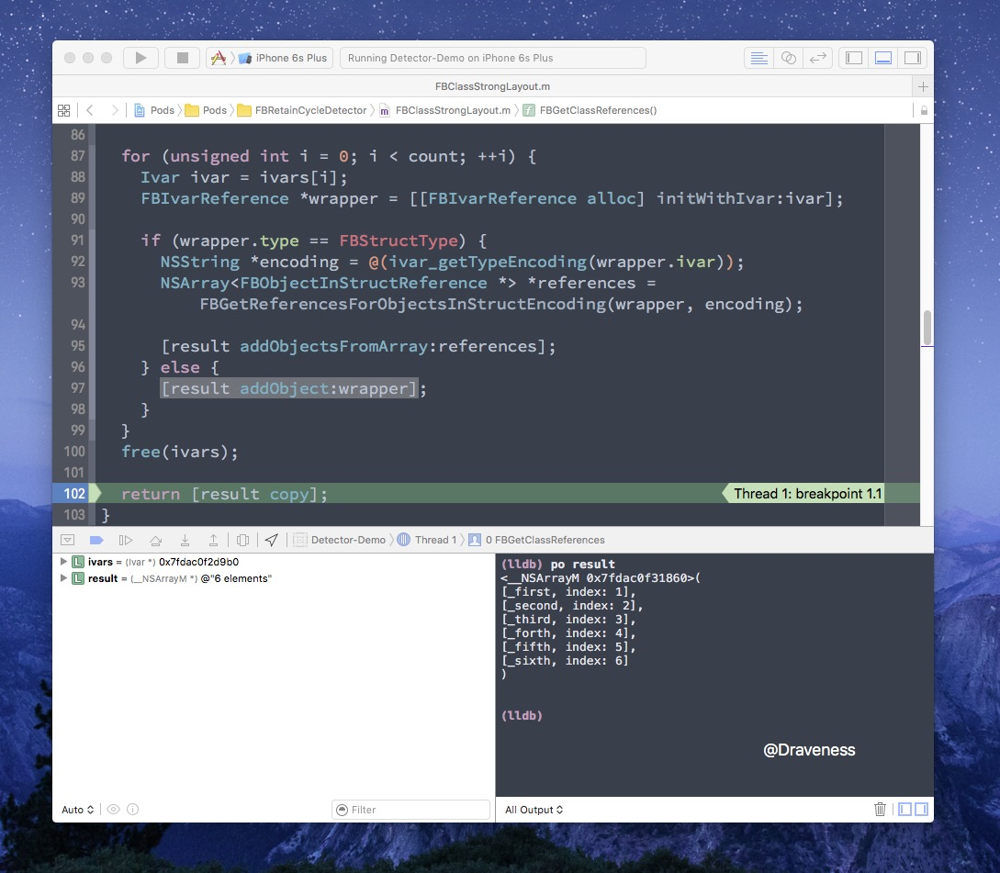
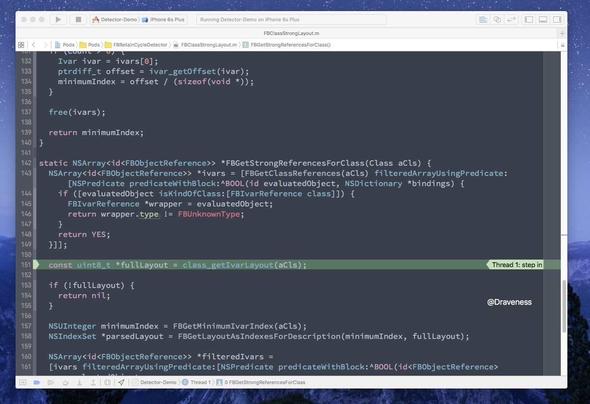
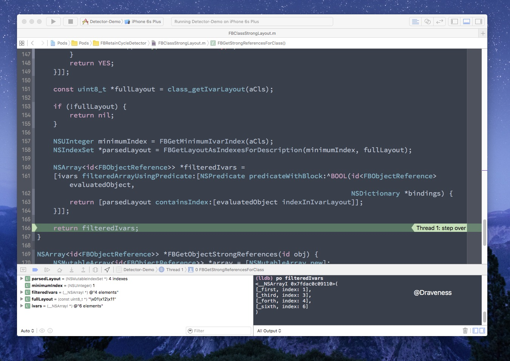

# 检测 NSObject 对象持有的强指针

在上一篇文章中介绍了 `FBRetainCycleDetector` 的基本工作原理，这一篇文章中我们开始分析它是如何从每一个对象中获得它持有的强指针的。

> 如果没有看第一篇文章这里还是最好看一下，了解一下 `FBRetainCycleDetector` 的工作原理，[如何在 iOS 中解决循环引用的问题](https://github.com/Draveness/iOS-Source-Code-Analyze/blob/master/contents/FBRetainCycleDetector/如何在%20iOS%20中解决循环引用的问题.md)。

`FBRetainCycleDetector` 获取对象的强指针是通过 `FBObjectiveCObject` 类的 `- allRetainedObjects` 方法，这一方法是通过其父类 `FBObjectiveCGraphElement` 继承过来的，只是内部有着不同的实现。

## allRetainedObjects 方法

我们会以 `XXObject` 为例演示 `- allRetainedObjects` 方法的调用过程：

```objectivec
#import <Foundation/Foundation.h>

@interface XXObject : NSObject

@property (nonatomic, strong) id first;
@property (nonatomic, weak)   id second;
@property (nonatomic, strong) id third;
@property (nonatomic, strong) id forth;
@property (nonatomic, weak)   id fifth;
@property (nonatomic, strong) id sixth;

@end
```

使用 `FBRetainCycleDetector` 的代码如下：

```objectivec
XXObject *object = [[XXObject alloc] init];

FBRetainCycleDetector *detector = [FBRetainCycleDetector new];
[detector addCandidate:object];
__unused NSSet *cycles = [detector findRetainCycles];
```

在 `FBObjectiveCObject` 中，`- allRetainedObjects` 方法只是调用了 `- _unfilteredRetainedObjects`，然后进行了过滤，文章主要会对 `- _unfilteredRetainedObjects` 的实现进行分析：

```objectivec
- (NSSet *)allRetainedObjects {
	NSArray *unfiltered = [self _unfilteredRetainedObjects];
	return [self filterObjects:unfiltered];
}
```

方法 `- _unfilteredRetainedObjects` 的实现代码还是比较多的，这里会将代码分成几个部分，首先是最重要的部分：如何得到对象持有的强引用：

```objectivec
- (NSArray *)_unfilteredRetainedObjects
	NSArray *strongIvars = FBGetObjectStrongReferences(self.object, self.configuration.layoutCache);

	NSMutableArray *retainedObjects = [[[super allRetainedObjects] allObjects] mutableCopy];

	for (id<FBObjectReference> ref in strongIvars) {
		id referencedObject = [ref objectReferenceFromObject:self.object];

		if (referencedObject) {
			NSArray<NSString *> *namePath = [ref namePath];
			FBObjectiveCGraphElement *element = FBWrapObjectGraphElementWithContext(self,
																					referencedObject,
																					self.configuration,
																					namePath);
			if (element) {
				[retainedObjects addObject:element];
			}
		}
	}
	
	...
}
```

获取强引用是通过 `FBGetObjectStrongReferences` 这一函数：

```objectivec
NSArray<id<FBObjectReference>> *FBGetObjectStrongReferences(id obj,
															NSMutableDictionary<Class, NSArray<id<FBObjectReference>> *> *layoutCache) {
	NSMutableArray<id<FBObjectReference>> *array = [NSMutableArray new];
	
	__unsafe_unretained Class previousClass = nil;
	__unsafe_unretained Class currentClass = object_getClass(obj);
	
	while (previousClass != currentClass) {
		NSArray<id<FBObjectReference>> *ivars;
		
		if (layoutCache && currentClass) {
			ivars = layoutCache[currentClass];
		}
		
		if (!ivars) {
			ivars = FBGetStrongReferencesForClass(currentClass);
			if (layoutCache && currentClass) {
				layoutCache[(id<NSCopying>)currentClass] = ivars;
			}
		}
		[array addObjectsFromArray:ivars];
		
		previousClass = currentClass;
		currentClass = class_getSuperclass(currentClass);
	}
	
	return [array copy];
}
```

上面代码的核心部分是执行 `FBGetStrongReferencesForClass` 返回 `currentClass` 中的强引用，只是在这里我们递归地查找了所有父类的指针，并且加入了缓存以加速查找强引用的过程，接下来就是从对象的结构中获取强引用的过程了：

```objectivec
static NSArray<id<FBObjectReference>> *FBGetStrongReferencesForClass(Class aCls) {
	NSArray<id<FBObjectReference>> *ivars = [FBGetClassReferences(aCls) filteredArrayUsingPredicate:[NSPredicate predicateWithBlock:^BOOL(id evaluatedObject, NSDictionary *bindings) {
		if ([evaluatedObject isKindOfClass:[FBIvarReference class]]) {
			FBIvarReference *wrapper = evaluatedObject;
			return wrapper.type != FBUnknownType;
		}
		return YES;
	}]];

	const uint8_t *fullLayout = class_getIvarLayout(aCls);

	if (!fullLayout) {
		return nil;
	}

	NSUInteger minimumIndex = FBGetMinimumIvarIndex(aCls);
	NSIndexSet *parsedLayout = FBGetLayoutAsIndexesForDescription(minimumIndex, fullLayout);

	NSArray<id<FBObjectReference>> *filteredIvars =
	[ivars filteredArrayUsingPredicate:[NSPredicate predicateWithBlock:^BOOL(id<FBObjectReference> evaluatedObject,
																			 NSDictionary *bindings) {
		return [parsedLayout containsIndex:[evaluatedObject indexInIvarLayout]];
	}]];

	return filteredIvars;
}
```

该方法的实现大约有三个部分：

1. 调用 `FBGetClassReferences` 从类中获取它指向的所有引用，无论是强引用或者是弱引用
2. 调用 `FBGetLayoutAsIndexesForDescription` 从类的变量布局中获取强引用的位置信息
3. 使用 `NSPredicate` 过滤数组中的弱引用

### 获取类的 Ivar 数组

`FBGetClassReferences` 方法主要调用 runtime 中的 `class_copyIvarList` 得到类的所有 `ivar`：

> 这里省略对结构体属性的处理，因为太过复杂，并且涉及大量的C++ 代码，有兴趣的读者可以查看 `FBGetReferencesForObjectsInStructEncoding` 方法的实现。

```objectivec
NSArray<id<FBObjectReference>> *FBGetClassReferences(Class aCls) {
	NSMutableArray<id<FBObjectReference>> *result = [NSMutableArray new];

	unsigned int count;
	Ivar *ivars = class_copyIvarList(aCls, &count);

	for (unsigned int i = 0; i < count; ++i) {
		Ivar ivar = ivars[i];
		FBIvarReference *wrapper = [[FBIvarReference alloc] initWithIvar:ivar];
		[result addObject:wrapper];
	}
	free(ivars);

	return [result copy];
}
```

上述实现还是非常直接的，遍历 `ivars` 数组，使用 `FBIvarReference` 将其包装起来然后加入 `result` 中，其中的类 `FBIvarReference` 仅仅起到了一个包装的作用，将 Ivar 中保存的各种属性全部保存起来：

```objectivec
typedef NS_ENUM(NSUInteger, FBType) {
  FBObjectType,
  FBBlockType,
  FBStructType,
  FBUnknownType,
};

@interface FBIvarReference : NSObject <FBObjectReference>

@property (nonatomic, copy, readonly, nullable) NSString *name;
@property (nonatomic, readonly) FBType type;
@property (nonatomic, readonly) ptrdiff_t offset;
@property (nonatomic, readonly) NSUInteger index;
@property (nonatomic, readonly, nonnull) Ivar ivar;

- (nonnull instancetype)initWithIvar:(nonnull Ivar)ivar;

@end
```

包括属性的名称、类型、偏移量以及索引，类型是通过[类型编码](https://developer.apple.com/library/mac/documentation/Cocoa/Conceptual/ObjCRuntimeGuide/Articles/ocrtTypeEncodings.html)来获取的，在 `FBIvarReference` 的实例初始化时，会通过私有方法 `- _convertEncodingToType:` 将类型编码转换为枚举类型：

```objectivec
- (FBType)_convertEncodingToType:(const char *)typeEncoding {
	if (typeEncoding[0] == '{') return FBStructType;

	if (typeEncoding[0] == '@') {
		if (strncmp(typeEncoding, "@?", 2) == 0) return FBBlockType;
		return FBObjectType;
	}

	return FBUnknownType;
}
```

当代码即将从 `FBGetClassReferences` 方法中返回时，使用 lldb 打印 `result` 中的所有元素：



上述方法成功地从 `XXObject` 类中获得了正确的属性数组，不过这些数组中不止包含了强引用，还有被 `weak` 标记的弱引用：

```objectivec
<__NSArrayM 0x7fdac0f31860>(
	[_first,  index: 1],
	[_second, index: 2],
	[_third,  index: 3],
	[_forth,  index: 4],
	[_fifth,  index: 5],
	[_sixth,  index: 6]
)
```

### 获取 Ivar Layout

当我们取出了 `XXObject` 中所有的属性之后，还需要对其中的属性进行过滤；那么我们如何判断一个属性是强引用还是弱引用呢？Objective-C 中引入了 Ivar Layout 的概念，对类中的各种属性的强弱进行描述。

它是如何工作的呢，我们先继续执行 `FBGetStrongReferencesForClass` 方法：



在 ObjC 运行时中的 `class_getIvarLayout` 可以获取某一个类的 Ivar Layout，而 `XXObject` 的 Ivar Layout 是什么样的呢？

```c
(lldb) po fullLayout
"\x01\x12\x11"
```

Ivar Layout 就是一系列的字符，每两个一组，比如 `\xmn`，每一组 Ivar Layout 中第一位表示有 `m` 个非强属性，第二位表示接下来有 `n` 个强属性；如果没有明白，我们以 `XXObject` 为例演示一下：

```objectivec
@interface XXObject : NSObject

@property (nonatomic, strong) id first;
@property (nonatomic, weak)   id second;
@property (nonatomic, strong) id third;
@property (nonatomic, strong) id forth;
@property (nonatomic, weak)   id fifth;
@property (nonatomic, strong) id sixth;

@end
```

+ 第一组的 `\x01` 表示有 0 个非强属性，然后有 1 个强属性 `first`
+ 第二组的 `\x12` 表示有 1 个非强属性 `second`，然后有 2 个强属性 `third` `forth`
+ 第三组的 `\x11` 表示有 1 个非强属性 `fifth`, 然后有 1 个强属性 `sixth`

在对 Ivar Layout 有一定了解之后，我们可以继续对 `FBGetStrongReferencesForClass` 分析了，下面要做的就是使用 Ivar Layout 提供的信息过滤其中的所有非强引用，而这就需要两个方法的帮助，首先需要 `FBGetMinimumIvarIndex` 方法获取变量索引的最小值：

```objectivec
static NSUInteger FBGetMinimumIvarIndex(__unsafe_unretained Class aCls) {
	NSUInteger minimumIndex = 1;
	unsigned int count;
	Ivar *ivars = class_copyIvarList(aCls, &count);

	if (count > 0) {
		Ivar ivar = ivars[0];
		ptrdiff_t offset = ivar_getOffset(ivar);
		minimumIndex = offset / (sizeof(void *));
	}

	free(ivars);

	return minimumIndex;
}
```

然后执行 `FBGetLayoutAsIndexesForDescription(minimumIndex, fullLayout)` 获取所有强引用的 `NSRange`：

```objectivec
static NSIndexSet *FBGetLayoutAsIndexesForDescription(NSUInteger minimumIndex, const uint8_t *layoutDescription) {
	NSMutableIndexSet *interestingIndexes = [NSMutableIndexSet new];
	NSUInteger currentIndex = minimumIndex;

	while (*layoutDescription != '\x00') {
		int upperNibble = (*layoutDescription & 0xf0) >> 4;
		int lowerNibble = *layoutDescription & 0xf;

		currentIndex += upperNibble;
		[interestingIndexes addIndexesInRange:NSMakeRange(currentIndex, lowerNibble)];
		currentIndex += lowerNibble;

		++layoutDescription;
	}

	return interestingIndexes;
}
```

因为高位表示非强引用的数量，所以我们要加上 `upperNibble`，然后 `NSMakeRange(currentIndex, lowerNibble)` 就是强引用的范围；略过 `lowerNibble` 长度的索引，移动 `layoutDescription` 指针，直到所有的 `NSRange` 都加入到了 `interestingIndexes` 这一集合中，就可以返回了。

### 过滤数组中的弱引用

在上一阶段由于已经获取了强引用的范围，在这里我们直接使用 `NSPredicate` 谓词来进行过滤就可以了：

```objectivec
NSArray<id<FBObjectReference>> *filteredIvars =
[ivars filteredArrayUsingPredicate:[NSPredicate predicateWithBlock:^BOOL(id<FBObjectReference> evaluatedObject,
																		 NSDictionary *bindings) {
	return [parsedLayout containsIndex:[evaluatedObject indexInIvarLayout]];
}]];
```



====

接下来，我们回到文章开始的 `- _unfilteredRetainedObjects` 方法：

```objectivec
- (NSSet *)allRetainedObjects {
	NSArray *strongIvars = FBGetObjectStrongReferences(self.object, self.configuration.layoutCache);

	NSMutableArray *retainedObjects = [[[super allRetainedObjects] allObjects] mutableCopy];

	for (id<FBObjectReference> ref in strongIvars) {
		id referencedObject = [ref objectReferenceFromObject:self.object];

		if (referencedObject) {
			NSArray<NSString *> *namePath = [ref namePath];
			FBObjectiveCGraphElement *element = FBWrapObjectGraphElementWithContext(self,
																					referencedObject,
																					self.configuration,
																					namePath);
			if (element) {
				[retainedObjects addObject:element];
			}
		}
	}
	
	...
}
```

`FBGetObjectStrongReferences` 只是返回 `id<FBObjectReference>` 对象，还需要 `FBWrapObjectGraphElementWithContext` 把它进行包装成 `FBObjectiveCGraphElement`：

```objectivec
FBObjectiveCGraphElement *FBWrapObjectGraphElementWithContext(id object,
															  FBObjectGraphConfiguration *configuration,
															  NSArray<NSString *> *namePath) {
	if (FBObjectIsBlock((__bridge void *)object)) {
		return [[FBObjectiveCBlock alloc] initWithObject:object
										   configuration:configuration
												namePath:namePath];
	} else {
		if ([object_getClass(object) isSubclassOfClass:[NSTimer class]] &&
			configuration.shouldInspectTimers) {
			return [[FBObjectiveCNSCFTimer alloc] initWithObject:object
												   configuration:configuration
														namePath:namePath];
		} else {
			return [[FBObjectiveCObject alloc] initWithObject:object
												configuration:configuration
													 namePath:namePath];
		}
	}
}
```

最后会把封装好的实例添加到 `retainedObjects` 数组中。

`- _unfilteredRetainedObjects` 同时也要处理集合类，比如数组或者字典，但是如果是无缝桥接的 CF 集合，或者是元类，虽然它们可能遵循 `NSFastEnumeration` 协议，但是在这里并不会对它们进行处理：

```objectivec
- (NSArray *)_unfilteredRetainedObjects {
	...

	if ([NSStringFromClass(aCls) hasPrefix:@"__NSCF"]) {
		return retainedObjects;
	}

	if (class_isMetaClass(aCls)) {
		return nil;
	}
	
	...
}
```

在遍历内容时，Mutable 的集合类中的元素可能会改变，所以会重试多次以确保集合类中的所有元素都被获取到了：

```objectivec
- (NSArray *)_unfilteredRetainedObjects {
	...

	if ([aCls conformsToProtocol:@protocol(NSFastEnumeration)]) {

		NSInteger tries = 10;
		for (NSInteger i = 0; i < tries; ++i) {
			NSMutableSet *temporaryRetainedObjects = [NSMutableSet new];
			@try {
				for (id subobject in self.object) {
					[temporaryRetainedObjects addObject:FBWrapObjectGraphElement(subobject, self.configuration)];
					[temporaryRetainedObjects addObject:FBWrapObjectGraphElement([self.object objectForKey:subobject], self.configuration)];
				}
			}
			@catch (NSException *exception) {
				continue;
			}

			[retainedObjects addObjectsFromArray:[temporaryRetainedObjects allObjects]];
			break;
		}
	}

	return retainedObjects;
}
```

这里将遍历集合中的元素的代码放入了 `@try` 中，如果在遍历时插入了其它元素，就会抛出异常，然后 `continue` 重新遍历集合，最后返回所有持有的对象。

最后的过滤部分会使用 `FBObjectGraphConfiguration` 中的 `filterBlocks` 将不需要加入集合中的元素过滤掉：

```objectivec
- (NSSet *)filterObjects:(NSArray *)objects {
	NSMutableSet *filtered = [NSMutableSet new];

	for (FBObjectiveCGraphElement *reference in objects) {
		if (![self _shouldBreakGraphEdgeFromObject:self toObject:reference]) {
			[filtered addObject:reference];
		}
	}

	return filtered;
}

- (BOOL)_shouldBreakGraphEdgeFromObject:(FBObjectiveCGraphElement *)fromObject
							   toObject:(FBObjectiveCGraphElement *)toObject {
	for (FBGraphEdgeFilterBlock filterBlock in _configuration.filterBlocks) {
		if (filterBlock(fromObject, toObject) == FBGraphEdgeInvalid) return YES;
	}

	return NO;
}
```

## 总结

`FBRetainCycleDetector` 在对象中查找强引用取决于类的 Ivar Layout，它为我们提供了与属性引用强弱有关的信息，帮助筛选强引用。

