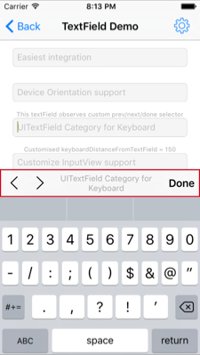
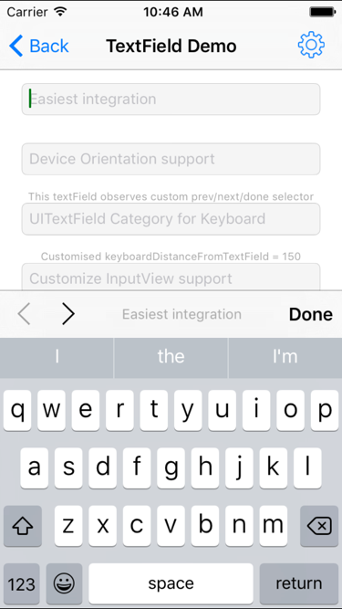

# 『零行代码』解决键盘遮挡问题（iOS）

<p align="center">
  
</p>

> 这篇文章会对 IQKeyboardManager 自动解决键盘遮挡问题的方法进行分析。

最近在项目中使用了 [IQKeyboardManager](https://github.com/hackiftekhar/IQKeyboardManager) 来解决 `UITextField` 被键盘遮挡的问题，这个框架的使用方法可以说精简到了极致，只需要将 `IQKeyboardManager` 加入 `Podfile`，然后 `pod install` 就可以了。

```objectivec
pod 'IQKeyboardManager'
```

这篇文章的题目《零行代码解决键盘遮挡问题》来自于开源框架的介绍：

> Codeless drop-in universal library allows to prevent issues of keyboard sliding up and cover UITextField/UITextView. Neither need to write any code nor any setup required and much more.

因为在项目中使用了 IQKeyboardManager，所以，我想通过阅读其源代码来了解这个黑箱是如何工作的。

> 虽然这个框架的实现的方法是比较简单的，不过它的实现代码不是很容易阅读，框架因为包含了很多与 UI 有关的实现细节，所以代码比较复杂。

## 架构分析

说是架构分析，其实只是对 [IQKeyboardManager](https://github.com/hackiftekhar/IQKeyboardManager) 中包含的类以及文件有一个粗略地了解，研究一下这个项目的层级是什么样的。


整个项目中最核心的部分就是 `IQKeyboardManager` 这个类，它负责**管理键盘出现或者隐藏时视图移动的距离**，是整个框架中最核心的部分。

在这个框架中还有一些用于支持 IQKeyboardManager 的分类，以及显示在键盘上面的 IQToolBar：



使用红色标记的部分就是 `IQToolBar`，左侧的按钮可以在不同的 `UITextField` 之间切换，中间的文字是 `UITextField.placeholderText`，右边的 `Done` 应该就不需要解释了。

这篇文章会主要分析 `IQKeyboardManager` 中解决的问题，会用小篇幅介绍包含占位符（Placeholder） `IQTextView` 的实现。

## IQTextView 的实现

在具体研究如何解决键盘遮挡问题之前，我们先分析一下框架中最简单的一部分 `IQTextView` 是如何为 `UITextView` 添加占位符的。

```objectivec
@interface IQTextView : UITextView

@end
```

`IQTextView` 继承自 `UITextView`，它只是在 `UITextView` 上添加上了一个 `placeHolderLabel`。

在初始化时，我们会为 `UITextViewTextDidChangeNotification` 注册通知：

```objectivec
- (void)initialize   {
    [[NSNotificationCenter defaultCenter] addObserver:self selector:@selector(refreshPlaceholder) name:UITextViewTextDidChangeNotification object:self];
}
```

在每次 UITextView 中的 text 更改时，就会调用 `refreshPlaceholder` 方法更新 `placeHolderLabel` 的 `alpha` 值来隐藏或者显示 label：

```objectivec
-(void)refreshPlaceholder {
    if ([[self text] length]) {
        [placeHolderLabel setAlpha:0];
    } else {
        [placeHolderLabel setAlpha:1];
    }
    
    [self setNeedsLayout];
    [self layoutIfNeeded];
}
```

## IQKeyboardManager

下面就会进入这篇文章的正题：`IQKeyboardManager`。

如果你对 iOS 开发比较熟悉，可能会发现每当一个类的名字中包含了 `manager`，那么这个类可能可能遵循单例模式，`IQKeyboardManager` 也不例外。

### IQKeyboardManager 的初始化

当 `IQKeyboardManager` 初始化的时候，它做了这么几件事情：

1. 监听有关键盘的通知

    ```objectivec
    [[NSNotificationCenter defaultCenter] addObserver:self selector:@selector(keyboardWillShow:) name:UIKeyboardWillShowNotification object:nil];
    [[NSNotificationCenter defaultCenter] addObserver:self selector:@selector(keyboardWillHide:) name:UIKeyboardWillHideNotification object:nil];
    [[NSNotificationCenter defaultCenter] addObserver:self selector:@selector(keyboardDidHide:) name:UIKeyboardDidHideNotification object:nil];
    ```

2. 注册与 `UITextField` 以及 `UITextView` 有关的通知

    ```objectivec
    [self registerTextFieldViewClass:[UITextField class]
     didBeginEditingNotificationName:UITextFieldTextDidBeginEditingNotification
       didEndEditingNotificationName:UITextFieldTextDidEndEditingNotification];
    
    [self registerTextFieldViewClass:[UITextView class]
     didBeginEditingNotificationName:UITextViewTextDidBeginEditingNotification
       didEndEditingNotificationName:UITextViewTextDidEndEditingNotification];
    ```

    + 调用的方法将通知绑定到了 `textFieldViewDidBeginEditing:` 和 `textFieldViewDidEndEditing:` 方法上

        ```objectivec
        - (void)registerTextFieldViewClass:(nonnull Class)aClass
          didBeginEditingNotificationName:(nonnull NSString *)didBeginEditingNotificationName
            didEndEditingNotificationName:(nonnull NSString *)didEndEditingNotificationName {
            [[NSNotificationCenter defaultCenter] addObserver:self selector:@selector(textFieldViewDidBeginEditing:) name:didBeginEditingNotificationName object:nil];
            [[NSNotificationCenter defaultCenter] addObserver:self selector:@selector(textFieldViewDidEndEditing:) name:didEndEditingNotificationName object:nil];
        }
        ```

3. 初始化一个 `UITapGestureRecognizer`，在点击 `UITextField` 对应的 `UIWindow` 的时候，收起键盘

    ```objectivec
    strongSelf.tapGesture = [[UITapGestureRecognizer alloc] initWithTarget:self action:@selector(tapRecognized:)];
    ```

    ```objectivec
    - (void)tapRecognized:(UITapGestureRecognizer*)gesture {
        if (gesture.state == UIGestureRecognizerStateEnded)
            [self resignFirstResponder];
    }
    ```

4. 初始化一些默认属性，例如键盘距离、覆写键盘的样式等

    ```objectivec
    strongSelf.animationDuration = 0.25;
    strongSelf.animationCurve = UIViewAnimationCurveEaseInOut;
    [self setKeyboardDistanceFromTextField:10.0];
    [self setShouldPlayInputClicks:YES];
    [self setShouldResignOnTouchOutside:NO];
    [self setOverrideKeyboardAppearance:NO];
    [self setKeyboardAppearance:UIKeyboardAppearanceDefault];
    [self setEnableAutoToolbar:YES];
    [self setPreventShowingBottomBlankSpace:YES];
    [self setShouldShowTextFieldPlaceholder:YES];
    [self setToolbarManageBehaviour:IQAutoToolbarBySubviews];
    [self setLayoutIfNeededOnUpdate:NO];
    ```

5. 设置不需要解决键盘遮挡问题的类

    ```objectivec
    strongSelf.disabledDistanceHandlingClasses = [[NSMutableSet alloc] initWithObjects:[UITableViewController class], nil];
    strongSelf.enabledDistanceHandlingClasses = [[NSMutableSet alloc] init];
    
    strongSelf.disabledToolbarClasses = [[NSMutableSet alloc] init];
    strongSelf.enabledToolbarClasses = [[NSMutableSet alloc] init];
    
    strongSelf.toolbarPreviousNextAllowedClasses = [[NSMutableSet alloc] initWithObjects:[UITableView class],[UICollectionView class],[IQPreviousNextView class], nil];
    
    strongSelf.disabledTouchResignedClasses = [[NSMutableSet alloc] init];
    strongSelf.enabledTouchResignedClasses = [[NSMutableSet alloc] init];
    ```

整个初始化方法大约有几十行的代码，在这里就不再展示整个方法的全部代码了。

### 基于通知的解决方案

> 在这里，我们以 UITextField 为例，分析方法的调用流程。

在初始化方法中，我们注册了很多的通知，包括键盘的出现和隐藏，`UITextField` 开始编辑与结束编辑。

```objectivec
UIKeyboardWillShowNotification
UIKeyboardWillHideNotification
UIKeyboardDidHideNotification
UITextFieldTextDidBeginEditingNotification
UITextFieldTextDidEndEditingNotification
```

在这些通知响应时，会执行以下的方法：

| Notification | Selector |
|:-:|:-:|
| `UIKeyboardWillShowNotification` | `@selector(keyboardWillShow:)`|
| `UIKeyboardWillHideNotification` | `@selector(keyboardWillHide:)` |
| `UIKeyboardDidHideNotification` | `@selector(keyboardDidHide:)` |
|`UITextFieldTextDidBeginEditingNotification`|`@selector(textFieldViewDidBeginEditing:)`|
|`UITextFieldTextDidEndEditingNotification`|`@selector(textFieldViewDidEndEditing:)`|

整个解决方案其实都是基于 iOS 中的通知系统的；在事件发生时，调用对应的方法做出响应。

### 开启 Debug 模式

在阅读源代码的过程中，我发现 `IQKeyboardManager` 提供了 `enableDebugging` 这一属性，可以通过开启它，来追踪方法的调用，我们可以在 Demo 加入下面这行代码：

```objectivec
[IQKeyboardManager sharedManager].enableDebugging = YES;
```

## 键盘的出现

然后运行工程，在 Demo 中点击一个 `UITextField`



上面的操作会打印出如下所示的 Log：

```objectivec
IQKeyboardManager: ****** textFieldViewDidBeginEditing: started ******
IQKeyboardManager: adding UIToolbars if required
IQKeyboardManager: Saving <UINavigationController 0x7f905b01b000> beginning Frame: {{0, 0}, {320, 568}}
IQKeyboardManager: ****** adjustFrame started ******
IQKeyboardManager: Need to move: -451.00
IQKeyboardManager: ****** adjustFrame ended ******
IQKeyboardManager: ****** textFieldViewDidBeginEditing: ended ******
IQKeyboardManager: ****** keyboardWillShow: started ******
IQKeyboardManager: ****** adjustFrame started ******
IQKeyboardManager: Need to move: -154.00
IQKeyboardManager: ****** adjustFrame ended ******
IQKeyboardManager: ****** keyboardWillShow: ended ******
```

我们可以通过分析 `- textFieldViewDidBeginEditing:` 以及 `- keyboardWillShow:` 方法来了解这个项目的原理。

### textFieldViewDidBeginEditing:

当 `UITextField` 被点击时，方法 `- textFieldViewDidBeginEditing:` 被调用，但是注意这里的方法并不是代理方法，它只是一个跟代理方法同名的方法，根据 Log，它做了三件事情：

+ 为 `UITextField` 添加 `IQToolBar`
+ 在调整 frame 前，保存当前 frame，以备之后键盘隐藏后的恢复
+ 调用 `- adjustFrame` 方法，将视图移动到合适的位置

#### 添加 ToolBar

添加 ToolBar 是通过方法 `- addToolbarIfRequired` 实现的，在 `- textFieldViewDidBeginEditing:` 先通过 `- privateIsEnableAutoToolbar` 判断 ToolBar 是否需要添加，再使用相应方法 `- addToolbarIfRequired` 实现这一目的。

这个方法会根据根视图上 `UITextField` 的数量执行对应的代码，下面为一般情况下执行的代码：

```objectivec
- (void)addToolbarIfRequired {
    NSArray *siblings = [self responderViews];
    for (UITextField *textField in siblings) {
        [textField addPreviousNextDoneOnKeyboardWithTarget:self previousAction:@selector(previousAction:) nextAction:@selector(nextAction:) doneAction:@selector(doneAction:) shouldShowPlaceholder:_shouldShowTextFieldPlaceholder];
        textField.inputAccessoryView.tag = kIQPreviousNextButtonToolbarTag;

        IQToolbar *toolbar = (IQToolbar*)[textField inputAccessoryView];
        toolbar.tintColor = [UIColor blackColor];
        [toolbar setTitle:textField.drawingPlaceholderText];
        [textField setEnablePrevious:NO next:YES];
    }
}
```

在键盘上的 `IQToolBar` 一般由三部分组成：

+ 切换 `UITextField` 的箭头按钮
+ 指示当前 `UITextField` 的 placeholder
+ Done Button


> 这些 item 都是 `IQBarButtonItem` 的子类

这些 `IQBarButtonItem` 以及 `IQToolBar` 都是通过方法 `- addPreviousNextDoneOnKeyboardWithTarget:previousAction:nextAction:doneAction:` 或者类似方法添加的：

```objectivec
- (void)addPreviousNextDoneOnKeyboardWithTarget:(id)target previousAction:(SEL)previousAction nextAction:(SEL)nextAction doneAction:(SEL)doneAction titleText:(NSString*)titleText {
    IQBarButtonItem *prev = [[IQBarButtonItem alloc] initWithImage:imageLeftArrow style:UIBarButtonItemStylePlain target:target action:previousAction];
    IQBarButtonItem *next = [[IQBarButtonItem alloc] initWithImage:imageRightArrow style:UIBarButtonItemStylePlain target:target action:nextAction];
    IQTitleBarButtonItem *title = [[IQTitleBarButtonItem alloc] initWithTitle:self.shouldHideTitle?nil:titleText];
    IQBarButtonItem *doneButton =[[IQBarButtonItem alloc] initWithBarButtonSystemItem:UIBarButtonSystemItemDone target:target action:doneAction];

    IQToolbar *toolbar = [[IQToolbar alloc] init];
    toolbar.barStyle = UIBarStyleDefault;
    toolbar.items = @[prev, next, title, doneButton];
    toolbar.titleInvocation = self.titleInvocation;
    [(UITextField*)self setInputAccessoryView:toolbar];
}
```

上面是方法简化后的实现代码，初始化需要的 `IQBarButtonItem`，然后将这些 `IQBarButtonItem` 全部加入到 `IQToolBar` 上，最后设置 `UITextField` 的 `accessoryView`。

#### 保存 frame

这一步的主要目的是为了在键盘隐藏时恢复到原来的状态，其实现也非常简单：

```objectivec
_rootViewController = [_textFieldView topMostController];
_topViewBeginRect = _rootViewController.view.frame;
```

获取 `topMostController`，在 `_topViewBeginRect` 中保存 `frame`。

#### adjustFrame

在上述的任务都完成之后，最后就需要调用 `- adjustFrame` 方法来调整当前根试图控制器的 `frame` 了：

> 我们只会研究一般情况下的实现代码，因为这个方法大约有 400 行代码对不同情况下的实现有不同的路径，包括有 `lastScrollView`、含有 `superScrollView` 等等。
> 
> 而这里会省略绝大多数情况下的实现代码。

```objectivec
- (void)adjustFrame {
    UIWindow *keyWindow = [self keyWindow];
    UIViewController *rootController = [_textFieldView topMostController];    
    CGRect textFieldViewRect = [[_textFieldView superview] convertRect:_textFieldView.frame toView:keyWindow];
    CGRect rootViewRect = [[rootController view] frame];
    CGSize kbSize = _kbSize;
    kbSize.height += keyboardDistanceFromTextField;
    CGFloat topLayoutGuide = CGRectGetHeight(statusBarFrame);
    CGFloat move = MIN(CGRectGetMinY(textFieldViewRect)-(topLayoutGuide+5), CGRectGetMaxY(textFieldViewRect)-(CGRectGetHeight(keyWindow.frame)-kbSize.height));
    
    if (move >= 0) {
        rootViewRect.origin.y -= move;
        [self setRootViewFrame:rootViewRect];
    } else {
        CGFloat disturbDistance = CGRectGetMinY(rootViewRect)-CGRectGetMinY(_topViewBeginRect);
        if (disturbDistance < 0) {
            rootViewRect.origin.y -= MAX(move, disturbDistance);
            [self setRootViewFrame:rootViewRect];
        }
    }
}
```

方法 `- adjustFrame` 的工作分为两部分：

1. 计算 `move` 的距离
2. 调用 `- setRootViewFrame:` 方法设置 `rootView` 的大小

    ```objectivec
    - (void)setRootViewFrame:(CGRect)frame {
        UIViewController *controller = [_textFieldView topMostController];    
        frame.size = controller.view.frame.size;
    
        [UIView animateWithDuration:_animationDuration delay:0 options:(_animationCurve|UIViewAnimationOptionBeginFromCurrentState) animations:^{
            [controller.view setFrame:frame];
        } completion:NULL];
    }
    ```

> 不过，在 `- textFieldViewDidBeginEditing:` 的调用栈中，并没有执行 `- setRootViewFrame:` 来更新视图的大小，因为点击最上面的 `UITextField` 时，不需要移动视图就能保证键盘不会遮挡 `UITextField`。

### keyboardWillShow:

上面的代码都是在键盘出现之前执行的，而这里的 `- keyboardWillShow:` 方法的目的是为了保证键盘出现之后，依然没有阻挡 `UITextField`。

因为每一个 `UITextField` 对应的键盘大小可能不同，所以，这里通过检测键盘大小是否改变，来决定是否调用 `- adjustFrame` 方法更新视图的大小。

```objectivec
- (void)keyboardWillShow:(NSNotification*)aNotification {
    _kbShowNotification = aNotification;
	
    _animationCurve = [[aNotification userInfo][UIKeyboardAnimationCurveUserInfoKey] integerValue];
    _animationCurve = _animationCurve<<16;
    CGFloat duration = [[aNotification userInfo][UIKeyboardAnimationDurationUserInfoKey] floatValue];
    if (duration != 0.0)    _animationDuration = duration;
    
    CGSize oldKBSize = _kbSize;
    CGRect kbFrame = [[aNotification userInfo][UIKeyboardFrameEndUserInfoKey] CGRectValue];
    CGRect screenSize = [[UIScreen mainScreen] bounds];
    CGRect intersectRect = CGRectIntersection(kbFrame, screenSize);

    if (CGRectIsNull(intersectRect)) {
        _kbSize = CGSizeMake(screenSize.size.width, 0);
    } else {
        _kbSize = intersectRect.size;
    }
 
    if (!CGSizeEqualToSize(_kbSize, oldKBSize)) {
        [self adjustFrame];
    }
}
```

在 `- adjustFrame` 方法调用之前，执行了很多代码都是用来保存一些关键信息的，比如通知对象、动画曲线、动画时间。

最关键的是更新键盘的大小，然后比较键盘的大小 `CGSizeEqualToSize(_kbSize, oldKBSize)` 来判断是否执行 `- adjustFrame` 方法。

> 因为 `- adjustFrame` 方法的结果是依赖于键盘大小的，所以这里对 `- adjustFrame` 是有意义并且必要的。

## 键盘的隐藏

通过点击 `IQToolBar` 上面的 done 按钮，键盘就会隐藏：


键盘隐藏的过程中会依次调用下面的三个方法：

+ `- keyboardWillHide:`
+ `- textFieldViewDidEndEditing:`
+ `- keyboardDidHide:`

```objectivec
IQKeyboardManager: ****** keyboardWillHide: started ******
IQKeyboardManager: Restoring <UINavigationController 0x7fbaa4009e00> frame to : {{0, 0}, {320, 568}}
IQKeyboardManager: ****** keyboardWillHide: ended ******
IQKeyboardManager: ****** textFieldViewDidEndEditing: started ******
IQKeyboardManager: ****** textFieldViewDidEndEditing: ended ******
IQKeyboardManager: ****** keyboardDidHide: started ******
IQKeyboardManager: ****** keyboardDidHide: ended ******
```

键盘在收起时，需要将视图恢复至原来的位置，而这也就是 `- keyboardWillHide:` 方法要完成的事情：

```objectivec
[strongSelf.rootViewController.view setFrame:strongSelf.topViewBeginRect]
```

> 并不会给出该方法的全部代码，只会给出关键代码梳理它的工作流程。

在重新设置视图的大小以及位置之后，会对之前保存的属性进行清理：

```objectivec
_lastScrollView = nil;
_kbSize = CGSizeZero;
_startingContentInsets = UIEdgeInsetsZero;
_startingScrollIndicatorInsets = UIEdgeInsetsZero;
_startingContentOffset = CGPointZero;
```

而之后调用的两个方法 `- textFieldViewDidEndEditing:` 以及 `- keyboardDidHide:` 也只做了很多简单的清理工作，包括添加到 `window` 上的手势，并重置保存的 `UITextField` 和视图的大小。

```objectivec
- (void)textFieldViewDidEndEditing:(NSNotification*)notification{
    [_textFieldView.window removeGestureRecognizer:_tapGesture];
    _textFieldView = nil;
}

- (void)keyboardDidHide:(NSNotification*)aNotification {
    _topViewBeginRect = CGRectZero;
}
```

## UITextField 和 UITextView 通知机制

因为框架的功能是基于通知实现的，所以通知的时序至关重要，在 `IQKeyboardManagerConstants.h` 文件中详细地描述了在编辑 `UITextField` 的过程中，通知触发的先后顺序。


> 上图准确说明了通知发出的时机，透明度为 50% 的部分表示该框架没有监听这个通知。

而 `UITextView` 的通知机制与 `UITextField` 略有不同：


当 Begin Editing 这个事件发生时，`UITextView` 的通知机制会先发出 `UIKeyboardWillShowNotification` 通知，而 `UITextField` 会先发出 `UITextFieldTextDidBeginEditingNotification` 通知。

而这两个通知的方法都调用了 `- adjustFrame` 方法来更新视图的大小，最开始我并不清楚到底是为什么？直到我给作者发了一封邮件，作者告诉我这么做的原因：

> Good questions draveness. I'm very happy to answer your questions. There is a file in library IQKeyboardManagerConstants.h. You can find iOS Notification mechanism structure.
> 
> You'll find that for UITextField, textField notification gets fire first and then UIKeyboard notification fires.
> 
> For UITextView, UIKeyboard notification gets fire first and then UITextView notification get's fire.
> 
> So that's why I have to call adjustFrame at both places to fulfill both situations. But now I think I should add some validation and make sure to call it once to improve performance.
> 
> Let me know if you have some more questions, I would love to answer them. Thanks again to remind me about this issue.

在不同方法中调用通知的原因是，UITextView 和 UITextField 通知机制的不同，不过作者可能会在未来的版本中修复这一问题，来获得性能上的提升。

## 小结

`IQKeyboardManager` 使用通知机制来解决键盘遮挡输入框的问题，因为使用了分类并且在 `IQKeyboardManager` 的 `+ load ` 方法中激活了框架的使用，所以达到了零行代码解决这一问题的效果。

虽然 `IQKeyboardManager` 很好地解决了这一问题、为我们带来了良好的体验。不过，由于其涉及 UI 层级；并且需要考虑非常多的边界以及特殊条件，框架的代码不是很容易阅读，但是这不妨碍 `IQKeyboardManager` 成为非常优秀的开源项目。

> Follow: [Draveness · Github](https://github.com/Draveness)

