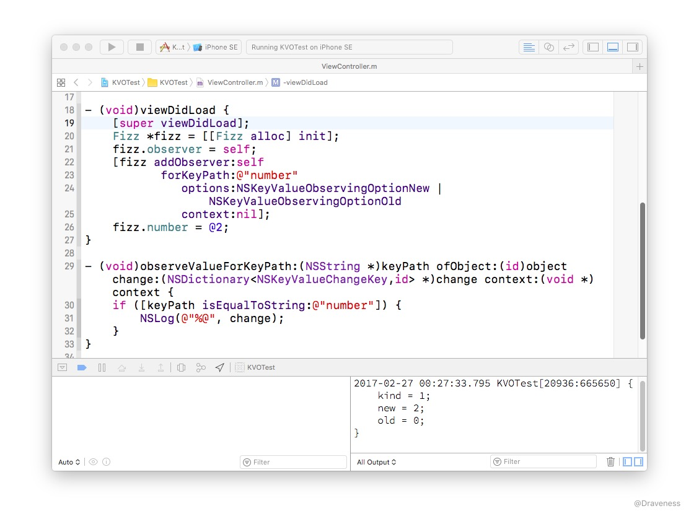
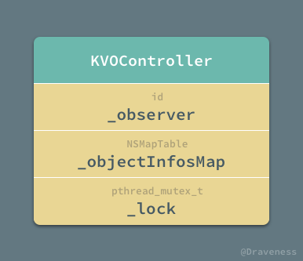
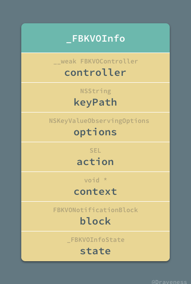
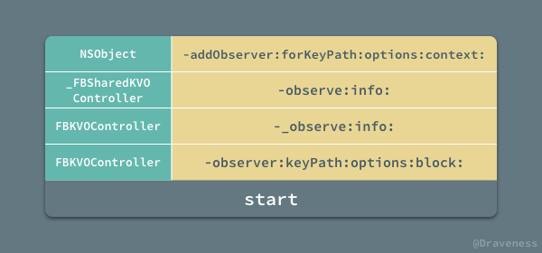
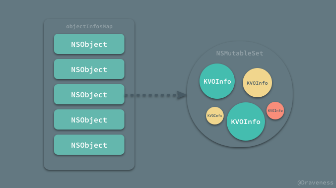
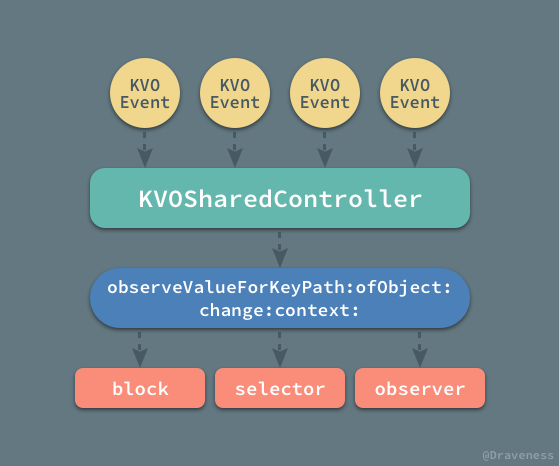
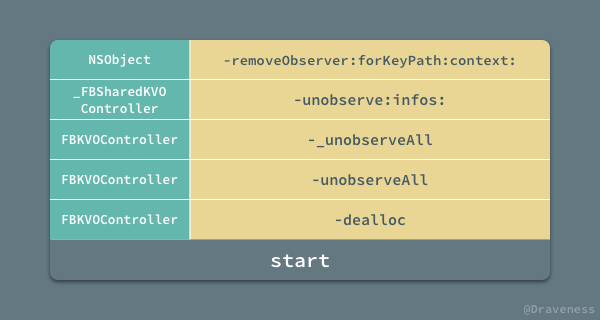
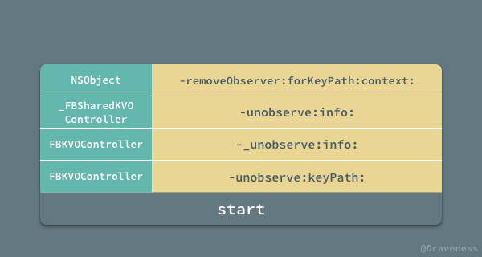

# 如何优雅地使用 KVO

KVO 作为 iOS 中一种强大并且有效的机制，为 iOS 开发者们提供了很多的便利；我们可以使用 KVO 来检测对象属性的变化、快速做出响应，这能够为我们在开发强交互、响应式应用以及实现视图和模型的双向绑定时提供大量的帮助。

但是在大多数情况下，除非遇到不用 KVO 无法解决的问题，笔者都会尽量避免它的使用，这并不是因为 KVO 有性能问题或者使用场景不多，总重要的原因是 KVO 的使用是在是太 ** **麻烦**了。


使用 KVO 时，既需要进行**注册成为某个对象属性的观察者**，还要在合适的时间点将自己**移除**，再加上需要**覆写一个又臭又长的方法**，并在方法里**判断这次是不是自己要观测的属性发生了变化**，每次想用 KVO 解决一些问题的时候，作者的第一反应就是头疼，这篇文章会给为 KVO 所苦的开发者提供一种更优雅的解决方案。

## 使用 KVO

不过在介绍如何优雅地使用 KVO 之前，我们先来回忆一下，在通常情况下，我们是如何使用 KVO 进行键值观测的。

首先，我们有一个 `Fizz` 类，其中包含一个 `number` 属性，它在初始化时会自动被赋值为 `@0`：

```objectivec
// Fizz.h
@interface Fizz : NSObject

@property (nonatomic, strong) NSNumber *number;

@end

// Fizz.m
@implementation Fizz

- (instancetype)init {
    if (self = [super init]) {
        _number = @0;
    }
    return self;
}

@end
```

我们想在 `Fizz` 对象中的 `number` 对象发生改变时获得通知得到**新**的和**旧**的值，这时我们就要祭出 `-addObserver:forKeyPath:options:context` 方法来监控 `number` 属性的变化：

```objectivec
Fizz *fizz = [[Fizz alloc] init];
[fizz addObserver:self
       forKeyPath:@"number"
          options:NSKeyValueObservingOptionNew | NSKeyValueObservingOptionOld
          context:nil];
fizz.number = @2;
```

在将当前对象 `self `注册成为 `fizz` 的观察者之后，我们需要在当前对象中覆写 `-observeValueForKeyPath:ofObject:change:context:` 方法：

```objectivec
- (void)observeValueForKeyPath:(NSString *)keyPath ofObject:(id)object change:(NSDictionary<NSKeyValueChangeKey,id> *)change context:(void *)context {
    if ([keyPath isEqualToString:@"number"]) {
        NSLog(@"%@", change);
    }
}
```

在大多数情况下我们只需要对比 `keyPath` 的值，就可以知道我们到底监控的是哪个对象，但是在更复杂的业务场景下，使用 `context` 上下文以及其它辅助手段才能够帮助我们更加精准地确定被观测的对象。

但是当上述代码运行时，虽然可以成功打印出 `change` 字典，但是却会发生崩溃，你会在控制台中看到下面的内容：

```objectivec
2017-02-26 23:44:19.666 KVOTest[15888:513229] {
    kind = 1;
    new = 2;
    old = 0;
}
2017-02-26 23:44:19.720 KVOTest[15888:513229] *** Terminating app due to uncaught exception 'NSInternalInconsistencyException', reason: 'An instance 0x60800001dd20 of class Fizz was deallocated while key value observers were still registered with it. Current observation info: <NSKeyValueObservationInfo 0x60800003d320> (
<NSKeyValueObservance 0x608000057310: Observer: 0x7fa098f07590, Key path: number, Options: <New: YES, Old: YES, Prior: NO> Context: 0x0, Property: 0x608000057400>
)'
```

这是因为 `fizz` 对象没有被其它对象引用，在脱离 `viewDidLoad` 作用于之后就被回收了，然而在 `-dealloc` 时，并没有移除观察者，所以会造成崩溃。

我们可以使用下面的代码来验证上面的结论是否正确：

```objectivec
// Fizz.h
@interface Fizz : NSObject

@property (nonatomic, strong) NSNumber *number;
@property (nonatomic, weak) NSObject *observer;

@end

// Fizz.m
@implementation Fizz

- (instancetype)init {
    if (self = [super init]) {
        _number = @0;
    }
    return self;
}

- (void)dealloc {
    [self removeObserver:self.observer forKeyPath:@"number"];
}

@end
```

在 `Fizz` 类的接口中添加一个 `observer` 弱引用来持有对象的观察者，并在对象 `-dealloc` 时将它移除，重新运行这段代码，就不会发生崩溃了。



由于没有移除观察者导致崩溃是使用 KVO 时经常会遇到的问题之一，解决办法其实有很多，我们在这里简单介绍一个，使用当前对象持有被观测的对象，并在当前对象 `-dealloc` 时，移除观察者：

```objectivec
- (void)viewDidLoad {
    [super viewDidLoad];
    self.fizz = [[Fizz alloc] init];
    [self.fizz addObserver:self
                forKeyPath:@"number"
                   options:NSKeyValueObservingOptionNew | NSKeyValueObservingOptionOld
                   context:nil];
    self.fizz.number = @2;
}

- (void)dealloc {
    [self.fizz removeObserver:self forKeyPath:@"number"];
}
```

这也是我们经常使用来避免崩溃的办法，但是在笔者看来也是非常的不优雅，除了上述的崩溃问题，使用 KVO 的过程也非常的别扭和痛苦：

1. 需要手动**移除观察者**，且移除观察者的**时机必须合适**；
2. 注册观察者的代码和事件发生处的代码上下文不同，**传递上下文**是通过 `void *` 指针；
3. 需要覆写 `-observeValueForKeyPath:ofObject:change:context:` 方法，比较麻烦；
4. 在复杂的业务逻辑中，准确判断被观察者相对比较麻烦，有多个被观测的对象和属性时，需要在方法中写大量的 `if` 进行判断；

虽然上述几个问题并不影响 KVO 的使用，不过这也足够成为笔者尽量不使用 KVO 的理由了。

## 优雅地使用 KVO

如何优雅地解决上一节提出的几个问题呢？我们在这里只需要使用 Facebook 开源的 [KVOController](https://github.com/facebook/KVOController) 框架就可以优雅地解决这些问题了。

如果想要实现同样的业务需求，当使用 KVOController 解决上述问题时，只需要以下代码就可以达到与上一节中**完全相同**的效果：

```objectivec
[self.KVOController observe:self.fizz
                    keyPath:@"number"
                    options:NSKeyValueObservingOptionNew | NSKeyValueObservingOptionOld
                      block:^(id  _Nullable observer, id  _Nonnull object, NSDictionary<NSString    *,id> * _Nonnull change) {
                          NSLog(@"%@", change);
                      }];
```

我们可以在任意对象上**获得** `KVOController` 对象，然后调用它的实例方法 `-observer:keyPath:options:block:` 就可以检测某个对象对应的属性了，该方法传入的参数还是非常容易理解的，在 block 中也可以获得所有与 KVO 有关的参数。

使用 KVOController 进行键值观测可以说完美地解决了在使用原生 KVO 时遇到的各种问题。

1. 不需要手动移除观察者；
2. 实现 KVO 与事件发生处的代码上下文相同，不需要跨方法传参数；
3. 使用 block 来替代方法能够减少使用的复杂度，提升使用 KVO 的体验；
4. 每一个 `keyPath` 会对应一个属性，不需要在 block 中使用 `if` 判断 `keyPath`；

## KVOController 的实现

KVOController 其实是对 Cocoa 中 KVO 的封装，它的实现其实也很简单，整个框架中只有两个实现文件，先来简要看一下 KVOController 如何为所有的 `NSObject` 对象都提供 `-KVOController` 属性的吧。

### 分类和 KVOController 的初始化

KVOController 不止为 Cocoa Touch 中所有的对象提供了 `-KVOController` 属性还提供了另一个 `KVOControllerNonRetaining` 属性，实现方法就是分类和 ObjC Runtime。

```objectivec
@interface NSObject (FBKVOController)

@property (nonatomic, strong) FBKVOController *KVOController;
@property (nonatomic, strong) FBKVOController *KVOControllerNonRetaining;

@end
```

从名字可以看出 `KVOControllerNonRetaining` 在使用时并不会**持有**被观察的对象，与它相比 `KVOController` 就会持有该对象了。

对于 `KVOController` 和 `KVOControllerNonRetaining` 属性来说，其实现都非常简单，对运行时非常熟悉的读者都应该知道使用关联对象就可以轻松实现这一需求。

```objectivec
- (FBKVOController *)KVOController {
  id controller = objc_getAssociatedObject(self, NSObjectKVOControllerKey);
  if (nil == controller) {
    controller = [FBKVOController controllerWithObserver:self];
    self.KVOController = controller;
  }
  return controller;
}

- (void)setKVOController:(FBKVOController *)KVOController {
  objc_setAssociatedObject(self, NSObjectKVOControllerKey, KVOController, OBJC_ASSOCIATION_RETAIN_NONATOMIC);
}

- (FBKVOController *)KVOControllerNonRetaining {
  id controller = objc_getAssociatedObject(self, NSObjectKVOControllerNonRetainingKey);
  if (nil == controller) {
    controller = [[FBKVOController alloc] initWithObserver:self retainObserved:NO];
    self.KVOControllerNonRetaining = controller;
  }
  return controller;
}

- (void)setKVOControllerNonRetaining:(FBKVOController *)KVOControllerNonRetaining {
  objc_setAssociatedObject(self, NSObjectKVOControllerNonRetainingKey, KVOControllerNonRetaining, OBJC_ASSOCIATION_RETAIN_NONATOMIC);
}
```

两者的 `setter` 方法都只是使用 `objc_setAssociatedObject` 按照键值简单地存一下，而 `getter` 中不同的其实也就是对于 `FBKVOController` 的初始化了。


到这里这个整个 FBKVOController 框架中的两个实现文件中的一个就介绍完了，接下来要看一下其中的另一个文件中的类 `KVOController`。

#### KVOController 的初始化

`KVOController` 是整个框架中提供 KVO 接口的类，作为 KVO 的管理者，其必须持有当前对象所有与 KVO 有关的信息，而在 `KVOController` 中，用于存储这个信息的数据结构就是 `NSMapTable`。



为了使 `KVOController` 达到线程安全，它还必须持有一把 `pthread_mutex_t` 锁，用于在操作 `_objectInfosMap` 时使用。

再回到上一节提到的初始化问题，`NSObject` 的属性 `FBKVOController` 和 `KVOControllerNonRetaining` 的区别在于前者会持有观察者，使其引用计数加一。

```objectivec
- (instancetype)initWithObserver:(nullable id)observer retainObserved:(BOOL)retainObserved {
  self = [super init];
  if (nil != self) {
    _observer = observer;
    NSPointerFunctionsOptions keyOptions = retainObserved ? NSPointerFunctionsStrongMemory|NSPointerFunctionsObjectPointerPersonality : NSPointerFunctionsWeakMemory|NSPointerFunctionsObjectPointerPersonality;
    _objectInfosMap = [[NSMapTable alloc] initWithKeyOptions:keyOptions valueOptions:NSPointerFunctionsStrongMemory|NSPointerFunctionsObjectPersonality capacity:0];
    pthread_mutex_init(&_lock, NULL);
  }
  return self;
}
```

在初始化方法中使用各自的方法对 `KVOController` 对象持有的所有实例变量进行初始化，`KVOController` 和 `KVOControllerNonRetaining` 的区别就体现在生成的 `NSMapTable` 实例时传入的是 `NSPointerFunctionsStrongMemory` 还是 `NSPointerFunctionsWeakMemory` 选项。

### KVO 的过程

使用 `KVOController` 实现键值观测时，大都会调用实例方法 `-observe:keyPath:options:block` 来注册成为某个对象的观察者，监控属性的变化：

```objectivec
- (void)observe:(nullable id)object keyPath:(NSString *)keyPath options:(NSKeyValueObservingOptions)options block:(FBKVONotificationBlock)block {
  _FBKVOInfo *info = [[_FBKVOInfo alloc] initWithController:self keyPath:keyPath options:options block:block];

  [self _observe:object info:info];
}
```

#### 数据结构 _FBKVOInfo

这个方法中就涉及到另外一个私有的数据结构 `_FBKVOInfo`，这个类中包含着所有与 KVO 有关的信息：



`_FBKVOInfo` 在 `KVOController` 中充当的作用仅仅是一个数据结构，我们主要用它来存储整个 KVO 过程中所需要的全部信息，其内部没有任何值得一看的代码，需要注意的是，`_FBKVOInfo` 覆写了 `-isEqual:` 方法用于对象之间的判等以及方便 `NSMapTable` 的存储。

如果再有点别的什么特别作用的就是，其中的 `state` 表示当前的 KVO 状态，不过在本文中不会具体介绍。

```objectivec
typedef NS_ENUM(uint8_t, _FBKVOInfoState) {
  _FBKVOInfoStateInitial = 0,
  _FBKVOInfoStateObserving,
  _FBKVOInfoStateNotObserving,
};
```

#### observe 的过程

在使用 `-observer:keyPath:options:block:` 监听某一个对象属性的变化时，该过程的核心调用栈其实还是比较简单：



我们从栈底开始简单分析一下整个封装 KVO 的过程，其中栈底的方法，也就是我们上面提到的 `-observer:keyPath:options:block:` 初始化了一个名为 `_FBKVOInfo` 的对象：

```objectivec
- (void)observe:(nullable id)object keyPath:(NSString *)keyPath options:(NSKeyValueObservingOptions)options block:(FBKVONotificationBlock)block {
  _FBKVOInfo *info = [[_FBKVOInfo alloc] initWithController:self keyPath:keyPath options:options block:block];
  [self _observe:object info:info];
}
```

在创建了 `_FBKVOInfo` 之后执行了另一个私有方法 `-_observe:info:`：

```objectivec
- (void)_observe:(id)object info:(_FBKVOInfo *)info {
  pthread_mutex_lock(&_lock);
  NSMutableSet *infos = [_objectInfosMap objectForKey:object];

  _FBKVOInfo *existingInfo = [infos member:info];
  if (nil != existingInfo) {
    pthread_mutex_unlock(&_lock);
    return;
  }

  if (nil == infos) {
    infos = [NSMutableSet set];
    [_objectInfosMap setObject:infos forKey:object];
  }
  [infos addObject:info];
  pthread_mutex_unlock(&_lock);

  [[_FBKVOSharedController sharedController] observe:object info:info];
}
```

这个私有方法通过自身持有的 `_objectInfosMap` 来判断当前对象、属性以及各种上下文是否已经注册在表中存在了，在这个 `_objectInfosMap` 中保存着对象以及与对象有关的 `_FBKVOInfo` 集合：



在操作了当前 `KVOController` 持有的 `_objectInfosMap` 之后，才会执行私有的 `_FBKVOSharedController` 类的实例方法 `-observe:info:`：

```objectivec
- (void)observe:(id)object info:(nullable _FBKVOInfo *)info {
  pthread_mutex_lock(&_mutex);
  [_infos addObject:info];
  pthread_mutex_unlock(&_mutex);

  [object addObserver:self forKeyPath:info->_keyPath options:info->_options context:(void *)info];

  if (info->_state == _FBKVOInfoStateInitial) {
    info->_state = _FBKVOInfoStateObserving;
  } else if (info->_state == _FBKVOInfoStateNotObserving) {
    [object removeObserver:self forKeyPath:info->_keyPath context:(void *)info];
  }
}
```

`_FBKVOSharedController` 才是最终调用 Cocoa 中的 `-observe:forKeyPath:options:context:` 方法开始对属性的监听的地方；同时，在整个应用运行时，只会存在一个 `_FBKVOSharedController` 实例：

```objectivec
+ (instancetype)sharedController {
  static _FBKVOSharedController *_controller = nil;
  static dispatch_once_t onceToken;
  dispatch_once(&onceToken, ^{
    _controller = [[_FBKVOSharedController alloc] init];
  });
  return _controller;
}
```

这个唯一的 `_FBKVOSharedController` 实例会在 KVO 的回调方法中将事件分发给 KVO 的观察者。

```objectivec
- (void)observeValueForKeyPath:(nullable NSString *)keyPath
                      ofObject:(nullable id)object
                        change:(nullable NSDictionary<NSString *, id> *)change
                       context:(nullable void *)context {
    _FBKVOInfo *info;
    pthread_mutex_lock(&_mutex);
    info = [_infos member:(__bridge id)context];
    pthread_mutex_unlock(&_mutex);

    FBKVOController *controller = info->_controller;
    id observer = controller.observer;

    if (info->_block) {
        NSDictionary<NSString *, id> *changeWithKeyPath = change;
        if (keyPath) {
            NSMutableDictionary<NSString *, id> *mChange = [NSMutableDictionary dictionaryWithObject:keyPath forKey:FBKVONotificationKeyPathKey];
            [mChange addEntriesFromDictionary:change];
            changeWithKeyPath = [mChange copy];
        }
        info->_block(observer, object, changeWithKeyPath);
    } else if (info->_action) {
        [observer performSelector:info->_action withObject:change withObject:object];
    } else {
        [observer observeValueForKeyPath:keyPath ofObject:object change:change context:info->_context];
    }
}
```

在这个 `-observeValueForKeyPath:ofObject:change:context:` 回调方法中，`_FBKVOSharedController` 会根据 KVO 的信息 `_KVOInfo` 选择不同的方式分发事件，如果观察者没有传入 block 或者选择子，就会调用观察者 KVO 回调方法。



上图就是在使用 KVOController 时，如果一个 KVO 事件触发之后，整个框架是如何对这个事件进行处理以及回调的。

### 如何 removeObserver

在使用 KVOController 时，我们并不需要手动去处理 KVO 观察者的移除，因为所有的 KVO 事件都由私有的 `_KVOSharedController` 来处理；



当每一个 `KVOController` 对象被释放时，都会将它自己持有的所有 KVO 的观察者交由 `_KVOSharedController` 的 `-unobserve:infos:` 方法处理：

```objectivec
- (void)unobserve:(id)object infos:(nullable NSSet<_FBKVOInfo *> *)infos {
  pthread_mutex_lock(&_mutex);
  for (_FBKVOInfo *info in infos) {
    [_infos removeObject:info];
  }
  pthread_mutex_unlock(&_mutex);

  for (_FBKVOInfo *info in infos) {
    if (info->_state == _FBKVOInfoStateObserving) {
      [object removeObserver:self forKeyPath:info->_keyPath context:(void *)info];
    }
    info->_state = _FBKVOInfoStateNotObserving;
  }
}
```

该方法会遍历所有传入的 `_FBKVOInfo`，从其中取出 `keyPath` 并将 `_KVOSharedController` 移除观察者。

除了在 `KVOController` 析构时会自动移除观察者，我们也可以通过它的实例方法 `-unobserve:keyPath:` 操作达到相同的效果；不过在调用这个方法时，我们能够得到一个不同的调用栈：



功能的实现过程其实都是类似的，都是通过 `-removeObserver:forKeyPath:context:` 方法移除观察者：

```objectivec
- (void)unobserve:(id)object info:(nullable _FBKVOInfo *)info {
  pthread_mutex_lock(&_mutex);
  [_infos removeObject:info];
  pthread_mutex_unlock(&_mutex);

  if (info->_state == _FBKVOInfoStateObserving) {
    [object removeObserver:self forKeyPath:info->_keyPath context:(void *)info];
  }
  info->_state = _FBKVOInfoStateNotObserving;
}
```

不过由于这个方法的参数并不是一个数组，所以并不需要使用 `for` 循环，而是只需要将该 `_FBKVOInfo` 对应的 KVO 事件移除就可以了。

## 总结

KVOController 对于 Cocoa 中 KVO 的封装非常的简洁和优秀，我们只需要调用一个方法就可以完成一个对象的键值观测，同时不需要处理移除观察者等问题，能够降低我们出错的可能性。

在笔者看来 KVOController 中唯一不是很优雅的地方就是，需要写出 `object.KVOController` 才可以执行 KVO，如果能将 `KVOController` 换成更短的形式可能看起来更舒服一些：

```objectivec
[self.kvo observer:keyPath:options:block:];
```

不过这并不是一个比较大的问题，同时也只是笔者自己的看法，况且不影响 KVOController 的使用，所以各位读者也无须太过介意。


> Github Repo：[iOS-Source-Code-Analyze](https://github.com/draveness/iOS-Source-Code-Analyze)
> 
> Follow: [Draveness · GitHub](https://github.com/Draveness)
>
> Source: http://draveness.me/kvocontroller

