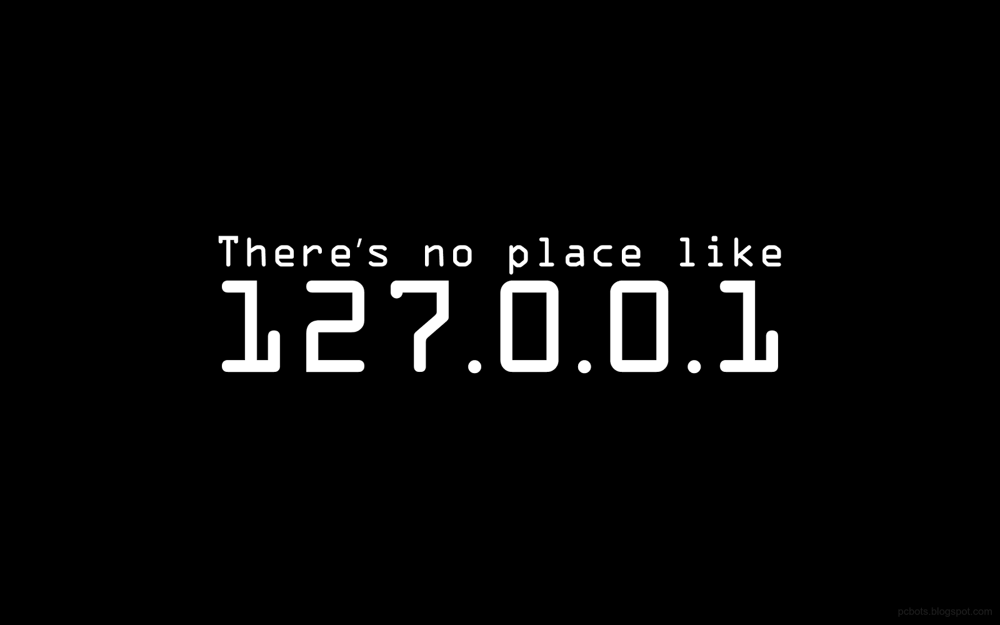
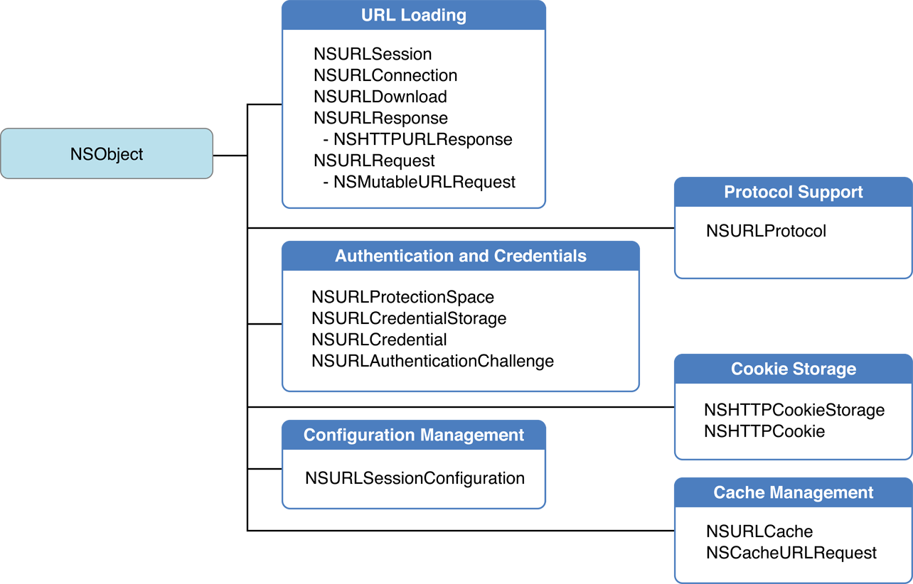

# iOS 开发中使用 NSURLProtocol 拦截 HTTP 请求

这篇文章会提供一种在 Cocoa 层拦截所有 HTTP 请求的方法，其实标题已经说明了拦截 HTTP 请求需要的了解的就是 `NSURLProtocol`。

由于文章的内容较长，会分成两部分，这篇文章介绍 `NSURLProtocol` 拦截 HTTP 请求的原理，另一篇文章[如何进行 HTTP Mock（iOS）](https://github.com/Draveness/iOS-Source-Code-Analyze/blob/master/contents/OHHTTPStubs/如何进行%20HTTP%20Mock（iOS）.md)
 介绍这个原理在 `OHHTTPStubs` 中的应用，它是如何 Mock（伪造）某个 HTTP 请求对应的响应的。

## NSURLProtocol

`NSURLProtocol` 是苹果为我们提供的 [URL Loading System](https://developer.apple.com/library/ios/documentation/Cocoa/Conceptual/URLLoadingSystem/URLLoadingSystem.html) 的一部分，这是一张从官方文档贴过来的图片：



官方文档对 `NSURLProtocol` 的描述是这样的：

> An NSURLProtocol object handles the loading of protocol-specific URL data. The NSURLProtocol class itself is an abstract class that provides the infrastructure for processing URLs with a specific URL scheme. You create subclasses for any custom protocols or URL schemes that your app supports.

在每一个 HTTP 请求开始时，URL 加载系统创建一个合适的 `NSURLProtocol` 对象处理对应的 URL 请求，而我们需要做的就是写一个继承自 `NSURLProtocol` 的类，并通过 `- registerClass:` 方法注册我们的协议类，然后 URL 加载系统就会在请求发出时使用我们创建的协议对象对该请求进行处理。

这样，我们需要解决的核心问题就变成了如何使用 `NSURLProtocol` 来处理所有的网络请求，这里使用苹果官方文档中的 [CustomHTTPProtocol](https://developer.apple.com/library/ios/samplecode/CustomHTTPProtocol/CustomHTTPProtocol.zip) 进行介绍，你可以点击[这里](https://developer.apple.com/library/ios/samplecode/CustomHTTPProtocol/CustomHTTPProtocol.zip)下载源代码。

在这个工程中 `CustomHTTPProtocol.m` 是需要重点关注的文件，`CustomHTTPProtocol` 就是 `NSURLProtocol` 的子类：

```objectivec
@interface CustomHTTPProtocol : NSURLProtocol

...

@end
```

现在重新回到需要解决的问题，也就是 **如何使用 NSURLProtocol 拦截 HTTP 请求？**，有这个么几个问题需要去解决：

+ 如何决定哪些请求需要当前协议对象处理？
+ 对当前的请求对象需要进行哪些处理？
+ `NSURLProtocol` 如何实例化？
+ 如何发出 HTTP 请求并且将响应传递给调用者？

上面的这几个问题其实都可以通过 `NSURLProtocol` 为我们提供的 API 来解决，决定请求是否需要当前协议对象处理的方法是：`+ canInitWithRequest`：

```objectivec
+ (BOOL)canInitWithRequest:(NSURLRequest *)request {
	BOOL shouldAccept;
	NSURL *url;
	NSString *scheme;
	
	shouldAccept = (request != nil);
	if (shouldAccept) {
		url = [request URL];
		shouldAccept = (url != nil);
	}
	return shouldAccept;
}
```

因为项目中的这个方法是大约有 60 多行，在这里只粘贴了其中的一部分，只为了说明该方法的作用：每一次请求都会有一个 `NSURLRequest` 实例，上述方法会拿到所有的请求对象，我们就可以根据对应的请求选择是否处理该对象；而上面的代码只会处理所有 `URL` 不为空的请求。

请求经过 `+ canInitWithRequest:` 方法过滤之后，我们得到了所有要处理的请求，接下来需要对请求进行一定的操作，而这都会在 `+ canonicalRequestForRequest:` 中进行，虽然它与 `+ canInitWithRequest:` 方法传入的 request 对象都是一个，但是最好不要在 `+ canInitWithRequest:` 中操作对象，可能会有语义上的问题；所以，我们需要覆写 `+ canonicalRequestForRequest:` 方法提供一个标准的请求对象：

```objectivec
+ (NSURLRequest *)canonicalRequestForRequest:(NSURLRequest *)request {
	return request;
}
```

这里对请求不做任何修改，直接返回，当然你也可以给这个请求加个 header，只要最后返回一个 `NSURLRequest` 对象就可以。

在得到了需要的请求对象之后，就可以初始化一个 `NSURLProtocol` 对象了：

```objectivec
- (id)initWithRequest:(NSURLRequest *)request cachedResponse:(NSCachedURLResponse *)cachedResponse client:(id <NSURLProtocolClient>)client {
	return [super initWithRequest:request cachedResponse:cachedResponse client:client];
}
```

在这里直接调用 `super` 的指定构造器方法，实例化一个对象，然后就进入了发送网络请求，获取数据并返回的阶段了：

```objectivec
- (void)startLoading {
	NSURLSession *session = [NSURLSession sessionWithConfiguration:[[NSURLSessionConfiguration alloc] init] delegate:self delegateQueue:nil];
	NSURLSessionDataTask *task = [session dataTaskWithRequest:self.request];
	[task resume];
}
```

> 这里使用简化了 CustomHTTPClient 中的项目代码，可以达到几乎相同的效果。

你可以在 `- startLoading` 中使用任何方法来对协议对象持有的 `request` 进行转发，包括 `NSURLSession`、 `NSURLConnection` 甚至使用 AFNetworking 等网络库，只要你能在回调方法中把数据传回 `client`，帮助其正确渲染就可以，比如这样：

```objectivec
- (void)URLSession:(NSURLSession *)session dataTask:(NSURLSessionDataTask *)dataTask didReceiveResponse:(NSURLResponse *)response completionHandler:(void (^)(NSURLSessionResponseDisposition))completionHandler {
	[[self client] URLProtocol:self didReceiveResponse:response cacheStoragePolicy:NSURLCacheStorageAllowed];
	
	completionHandler(NSURLSessionResponseAllow);
}

- (void)URLSession:(NSURLSession *)session dataTask:(NSURLSessionDataTask *)dataTask didReceiveData:(NSData *)data {
	[[self client] URLProtocol:self didLoadData:data];
}
```

> 当然这里省略后的代码只会保证大多数情况下的正确执行，只是给你一个对获取响应数据粗略的认知，如果你需要更加详细的代码，我觉得最好还是查看一下 `CustomHTTPProtocol` 中对 HTTP 响应处理的代码，也就是 `NSURLSessionDelegate` 协议实现的部分。

`client` 你可以理解为当前网络请求的发起者，所有的 `client` 都实现了 `NSURLProtocolClient` 协议，协议的作用就是在 HTTP 请求发出以及接受响应时向其它对象传输数据：

```objectivec
@protocol NSURLProtocolClient <NSObject>
...
- (void)URLProtocol:(NSURLProtocol *)protocol didReceiveResponse:(NSURLResponse *)response cacheStoragePolicy:(NSURLCacheStoragePolicy)policy;

- (void)URLProtocol:(NSURLProtocol *)protocol didLoadData:(NSData *)data;

- (void)URLProtocolDidFinishLoading:(NSURLProtocol *)protocol;
...
@end
```

当然这个协议中还有很多其他的方法，比如 HTTPS 验证、重定向以及响应缓存相关的方法，你需要在合适的时候调用这些代理方法，对信息进行传递。

如果你只是继承了 `NSURLProtocol` 并且实现了上述方法，依然不能达到预期的效果，完成对 HTTP 请求的拦截，你还需要在 URL 加载系统中注册当前类：

```objectivec
[NSURLProtocol registerClass:self];
```

> 需要注意的是 `NSURLProtocol` 只能拦截 `UIURLConnection`、`NSURLSession` 和 `UIWebView` 中的请求，对于 `WKWebView` 中发出的网络请求也无能为力，如果真的要拦截来自 `WKWebView` 中的请求，还是需要实现 `WKWebView` 对应的 `WKNavigationDelegate`，并在代理方法中获取请求。
> 无论是 `NSURLProtocol`、`NSURLConnection` 还是 `NSURLSession` 都会走底层的 socket，但是 `WKWebView` 可能由于基于 WebKit，并不会执行 C socket 相关的函数对 HTTP 请求进行处理，具体会执行什么代码暂时不是很清楚，如果对此有兴趣的读者，可以联系笔者一起讨论。

## 总结

如果你只想了解如何对 HTTP 请求进行拦截，其实看到这里就可以了，不过如果你想应用文章中的内容或者希望了解如何伪造 HTTP 响应，可以看下一篇文章[如何进行 HTTP Mock（iOS）](https://github.com/Draveness/iOS-Source-Code-Analyze/blob/master/contents/OHHTTPStubs/如何进行%20HTTP%20Mock（iOS）.md)
。

> Follow: [Draveness · Github](https://github.com/Draveness)

## References

+ [NSURLProtocol]([http://nshipster.com/nsurlprotocol/])
[如何进行 HTTP Mock（iOS）](https://github.com/Draveness/iOS-Source-Code-Analyze/blob/master/contents/OHHTTPStubs/如何进行%20HTTP%20Mock（iOS）.md)

