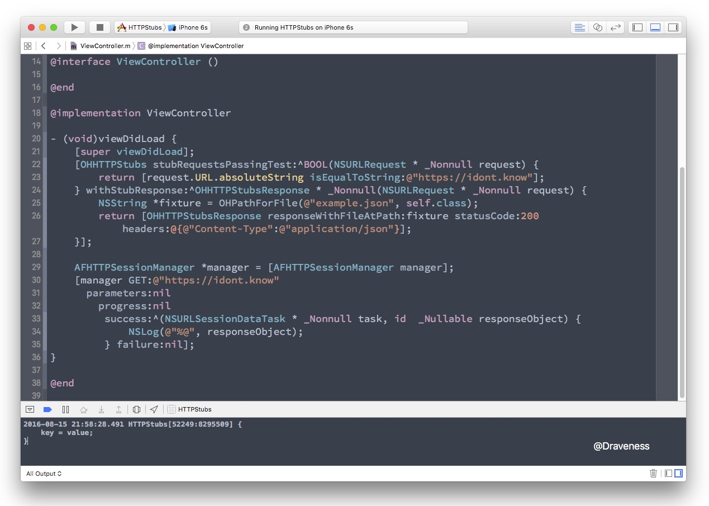

# 如何进行 HTTP Mock（iOS）

这篇文章会对 [OHHTTPStubs]([https://github.com/AliSoftware/OHHTTPStubs]) 源代码的分析，其实现原理是建立在 `NSURLProtocol` 的基础上的，对这部分内容不了解的读者，可以阅读这篇文章 [iOS 开发中使用 NSURLProtocol 拦截 HTTP 请求](https://github.com/Draveness/iOS-Source-Code-Analyze/blob/master/contents/OHHTTPStubs/iOS%20开发中使用%20NSURLProtocol%20拦截%20HTTP%20请求.md)了解相关知识，本文中不会介绍拦截 HTTP 请求的原理。

### 如何使用 OHHTTPStubs Mock 网络请求

HTTP Mock 在测试中非常好用，我们可以在不需要后端 API 的情况下，在本地对 HTTP 请求进行拦截，返回想要的 `json` 数据，而 OHHTTPStubs 就为我们提供了这样一种解决方案。

在了解其实现之前，先对 OHHTTPStubs 进行简单的介绍，引入头文件这种事情在这里会直接省略，先来看一下程序的源代码：

```objectivec
[OHHTTPStubs stubRequestsPassingTest:^BOOL(NSURLRequest * _Nonnull request) {
    return [request.URL.absoluteString isEqualToString:@"https://idont.know"];
} withStubResponse:^OHHTTPStubsResponse * _Nonnull(NSURLRequest * _Nonnull request) {
    NSString *fixture = OHPathForFile(@"example.json", self.class);
    return [OHHTTPStubsResponse responseWithFileAtPath:fixture statusCode:200 headers:@{@"Content-Type":@"application/json"}];
}];

AFHTTPSessionManager *manager = [AFHTTPSessionManager manager];
[manager GET:@"https://idont.know"
  parameters:nil
    progress:nil
     success:^(NSURLSessionDataTask * _Nonnull task, id  _Nullable responseObject) {
         NSLog(@"%@", responseObject);
     } failure:nil];
```

我们向 `https://idont.know` 这个 URL 发送一个 GET 请求，虽然这个 URL 并不存在，但是这里的代码通过 HTTP stub 成功地模拟了 HTTP 响应：



## OHHTTPStubs 的实现

在了解了 OHHTTPStubs 的使用之后，我们会对其实现进行分析，它分成四部分进行：

+ `OHHTTPStubsProtocol` 拦截 HTTP 请求
+ `OHHTTPStubs` 单例管理 `OHHTTPStubsDescriptor` 实例
+ `OHHTTPStubsResponse` 伪造 HTTP 响应
+ 一些辅助功能

### OHHTTPStubsProtocol 拦截 HTTP 请求

在 OHHTTPStubs 中继承 `NSURLProtocol` 的类就是 `OHHTTPStubsProtocol`，它在 HTTP 请求发出之前对 request 对象进行过滤以及处理：

```objectivec
+ (BOOL)canInitWithRequest:(NSURLRequest *)request {
	return ([OHHTTPStubs.sharedInstance firstStubPassingTestForRequest:request] != nil);
}

- (id)initWithRequest:(NSURLRequest *)request cachedResponse:(NSCachedURLResponse *)response client:(id<NSURLProtocolClient>)client {
	OHHTTPStubsProtocol* proto = [super initWithRequest:request cachedResponse:nil client:client];
	proto.stub = [OHHTTPStubs.sharedInstance firstStubPassingTestForRequest:request];
	return proto;
}

+ (NSURLRequest *)canonicalRequestForRequest:(NSURLRequest *)request {
	return request;
}
```

判断请求是否会被当前协议对象进行处理是需要 `OHHTTPStubs` 的实例方法 `- firstStubPassingTestForRequest:` 的执行的，在这里暂时先不对这个方法进行讨论。

接下来就是请求发送的过程 `- startLoading` 方法了，该方法的实现实在是太过于复杂，所以这里分块来分析代码：

```objectivec
- (void)startLoading {
	NSURLRequest* request = self.request;
	id<NSURLProtocolClient> client = self.client;
	
	OHHTTPStubsResponse* responseStub = self.stub.responseBlock(request);
	
	if (OHHTTPStubs.sharedInstance.onStubActivationBlock) {
		OHHTTPStubs.sharedInstance.onStubActivationBlock(request, self.stub, responseStub);
	}

	...
}
```

从当前对象中取出 `request` 以及 `client` 对象，如果 `OHHTTPStubs` 的单例中包含 `onStubActivationBlock`，就会执行这里的 block，然后调用 `responseBlock` 获取一个 `OHHTTPStubsResponse` HTTP 响应对象。

`OHHTTPStubs` 不只提供了 `onStubActivationBlock` 这一个钩子，还有以下 block：

+ `+ onStubActivationBlock`：stub 被激活时调用
+ `+ onStubRedirectBlock`：发生重定向时
+ `+ afterStubFinishBlock`：在 stub 结束时调用

如果响应对象的生成没有遇到任何问题，就会进入处理 Cookie、重定向、发送响应和模拟数据流的过程了。

1. 首先是对 Cookie 的处理

```objectivec
NSHTTPURLResponse* urlResponse = [[NSHTTPURLResponse alloc] initWithURL:request.URL
															 statusCode:responseStub.statusCode
															HTTPVersion:@"HTTP/1.1"
														   headerFields:responseStub.httpHeaders];

if (request.HTTPShouldHandleCookies && request.URL) {
	NSArray* cookies = [NSHTTPCookie cookiesWithResponseHeaderFields:responseStub.httpHeaders forURL:request.URL];
	if (cookies) {
		[NSHTTPCookieStorage.sharedHTTPCookieStorage setCookies:cookies forURL:request.URL mainDocumentURL:request.mainDocumentURL];
	}
}
```

2. 如果 HTTP 状态码在 300-400 之间，就会处理重定向的问题，调用 `onStubRedirectBlock` 进行需要的回调

```objectivec
NSString* redirectLocation = (responseStub.httpHeaders)[@"Location"];
NSURL* redirectLocationURL = redirectLocation ? [NSURL URLWithString:redirectLocation] : nil;

if (((responseStub.statusCode > 300) && (responseStub.statusCode < 400)) && redirectLocationURL) {
	NSURLRequest* redirectRequest = [NSURLRequest requestWithURL:redirectLocationURL];
	[self executeOnClientRunLoopAfterDelay:responseStub.requestTime block:^{
		if (!self.stopped) {
			[client URLProtocol:self wasRedirectedToRequest:redirectRequest redirectResponse:urlResponse];
			if (OHHTTPStubs.sharedInstance.onStubRedirectBlock) {
				OHHTTPStubs.sharedInstance.onStubRedirectBlock(request, redirectRequest, self.stub, responseStub);
			}
		}
	}];
}
```

3. 最后这里有一些复杂，我们根据 `stub` 中存储的 `responseTime` 来模拟响应的一个延迟时间，然后使用 `- streamDataForClient:withStubResponse:completion:` 来模拟数据以 `NSData` 的形式分块发送回 `client` 的过程，最后调用 `afterStubFinishBlock`。

```objectivec
[self executeOnClientRunLoopAfterDelay:responseStub.requestTime block:^{
	if (!self.stopped) {
		[client URLProtocol:self didReceiveResponse:urlResponse cacheStoragePolicy:NSURLCacheStorageNotAllowed];
		if(responseStub.inputStream.streamStatus == NSStreamStatusNotOpen) {
			[responseStub.inputStream open];
		}
		[self streamDataForClient:client
				 withStubResponse:responseStub
					   completion:^(NSError * error) {
			 [responseStub.inputStream close];
			 NSError *blockError = nil;
			 if (error==nil) {
				 [client URLProtocolDidFinishLoading:self];
			 } else {
				 [client URLProtocol:self didFailWithError:responseStub.error];
				 blockError = responseStub.error;
			 }
			 if (OHHTTPStubs.sharedInstance.afterStubFinishBlock) {
				 OHHTTPStubs.sharedInstance.afterStubFinishBlock(request, self.stub, responseStub, blockError);
			 }
		 }];
	}
}];
```

当然如果在生成 `responseStub` 的时候发生了错误，也会进行类似的操作，在延迟一定时间（模拟网络延迟）后执行 block 并传入各种参数：

```objectivec
[self executeOnClientRunLoopAfterDelay:responseStub.responseTime block:^{
	if (!self.stopped) {
		[client URLProtocol:self didFailWithError:responseStub.error];
		if (OHHTTPStubs.sharedInstance.afterStubFinishBlock) {
			OHHTTPStubs.sharedInstance.afterStubFinishBlock(request, self.stub, responseStub, responseStub.error);
		}
	}
}];
```

#### 模拟数据流

因为在客户端接收数据时，所有的 `NSData` 并不是一次就涌入客户端的，而是分块加载打包解码的，尤其是在我们执行下载操作时，有时几 MB 的文件不可能同时到达服务端，而 `- startLoading` 中调用的 `- streamDataForClient:withStubResponse:completion:` 方法就是为了模拟数据流，分块向服务端发送数据，不过这部分的处理涉及到一个私有的结构体 `OHHTTPStubsStreamTimingInfo`：

```objectivec
typedef struct {
	NSTimeInterval slotTime;
	double chunkSizePerSlot;
	double cumulativeChunkSize;
} OHHTTPStubsStreamTimingInfo;
```

这个结构体包含了关于发送数据流的信息：

+ `slotTime`：两次发送 `NSData` 的间隔时间
+ `chunkSizePerSlot`：每块数据流大小
+ `cumulativeChunkSize`：已发送的数据流大小

模拟数据流的过程需要两个方法的支持，其中一个方法做一些预加载工作：

```objectivec
- (void)streamDataForClient:(id<NSURLProtocolClient>)client
		   withStubResponse:(OHHTTPStubsResponse*)stubResponse
				 completion:(void(^)(NSError * error))completion {
	if ((stubResponse.dataSize>0) && stubResponse.inputStream.hasBytesAvailable && (!self.stopped)) {
		OHHTTPStubsStreamTimingInfo timingInfo = {
			.slotTime = kSlotTime,
			.cumulativeChunkSize = 0
		};
		
		if(stubResponse.responseTime < 0) {
			timingInfo.chunkSizePerSlot = (fabs(stubResponse.responseTime) * 1000) * timingInfo.slotTime;
		} else if (stubResponse.responseTime < kSlotTime) {
			timingInfo.chunkSizePerSlot = stubResponse.dataSize;
			timingInfo.slotTime = stubResponse.responseTime;
		} else {
			timingInfo.chunkSizePerSlot = ((stubResponse.dataSize/stubResponse.responseTime) * timingInfo.slotTime);
		}
		
		[self streamDataForClient:client
					   fromStream:stubResponse.inputStream
					   timingInfo:timingInfo
					   completion:completion];
	} else {
		if (completion) completion(nil);
	}
}
```

该方法将生成的 `OHHTTPStubsStreamTimingInfo` 信息传入下一个实例方法 `- streamDataForClient:fromStream:timingInfo:completion:`：

```objectivec
- (void)streamDataForClient:(id<NSURLProtocolClient>)client fromStream:(NSInputStream*)inputStream timingInfo:(OHHTTPStubsStreamTimingInfo)timingInfo completion:(void(^)(NSError * error))completion {
	if (inputStream.hasBytesAvailable && (!self.stopped)) {
		double cumulativeChunkSizeAfterRead = timingInfo.cumulativeChunkSize + timingInfo.chunkSizePerSlot;
		NSUInteger chunkSizeToRead = floor(cumulativeChunkSizeAfterRead) - floor(timingInfo.cumulativeChunkSize);
		timingInfo.cumulativeChunkSize = cumulativeChunkSizeAfterRead;
		
		if (chunkSizeToRead == 0) {
			[self executeOnClientRunLoopAfterDelay:timingInfo.slotTime block:^{
				[self streamDataForClient:client fromStream:inputStream
							   timingInfo:timingInfo completion:completion];
			}];
		} else {
			uint8_t* buffer = (uint8_t*)malloc(sizeof(uint8_t)*chunkSizeToRead);
			NSInteger bytesRead = [inputStream read:buffer maxLength:chunkSizeToRead];
			if (bytesRead > 0) {
				NSData * data = [NSData dataWithBytes:buffer length:bytesRead];
				[self executeOnClientRunLoopAfterDelay:((double)bytesRead / (double)chunkSizeToRead) * timingInfo.slotTime block:^{
					[client URLProtocol:self didLoadData:data];
					[self streamDataForClient:client fromStream:inputStream
								   timingInfo:timingInfo completion:completion];
				}];
			} else {
				if (completion) completion(inputStream.streamError);
			}
			free(buffer);
		}
	} else {
		if (completion) completion(nil);
	}
}
```

+ 上述方法会先计算 `chunkSizeToRead`，也就是接下来要传递给 `client` 的数据长度
+ 从 `NSInputStream` 中读取对应长度的数据
+ 通过 `- executeOnClientRunLoopAfterDelay:block:` 模拟数据传输的延时
+ 使用 `- URLProtocol:didLoadData:` 代理方法将数据传回 `client`

OHHTTPStubs 通过上面的两个方法很好的模拟了 HTTP 响应由于网络造成的延迟以及数据分块到达客户端的特点。

### OHHTTPStubs 以及 OHHTTPStubsDescriptor 对 stub 的管理

`OHHTTPStubs` 遵循单例模式，其主要作用就是提供便利的 API 并持有一个 `OHHTTPStubsDescriptor` 数组，对 stub 进行管理。

`OHHTTPStubs` 提供的类方法 `+ stubRequestsPassingTest:withStubResponse:` 会添加一个 `OHHTTPStubsDescriptor ` 的实例到 `OHHTTPStubsDescriptor` 数组中：

```objectivec
+ (id<OHHTTPStubsDescriptor>)stubRequestsPassingTest:(OHHTTPStubsTestBlock)testBlock
									withStubResponse:(OHHTTPStubsResponseBlock)responseBlock {
	OHHTTPStubsDescriptor* stub = [OHHTTPStubsDescriptor stubDescriptorWithTestBlock:testBlock
																	   responseBlock:responseBlock];
	[OHHTTPStubs.sharedInstance addStub:stub];
	return stub;
}
```

该类主要有两种方法，一种方法用于管理持有的 HTTP stub，比如说：

+ `+ (BOOL)removeStub:(id<OHHTTPStubsDescriptor>)stubDesc`
+ `+ (void)removeAllStubs`
+ `- (void)addStub:(OHHTTPStubsDescriptor*)stubDesc`
+ `- (BOOL)removeStub:(id<OHHTTPStubsDescriptor>)stubDesc`
+ `- (void)removeAllStubs`

这些方法都是用来操作单例持有的数组的，而另一种方法用来设置相应事件发生时的回调：

+ `+ (void)onStubActivation:( nullable void(^)(NSURLRequest* request, id<OHHTTPStubsDescriptor> stub, OHHTTPStubsResponse* responseStub) )block`
+ `+ (void)onStubRedirectResponse:( nullable void(^)(NSURLRequest* request, NSURLRequest* redirectRequest, id<OHHTTPStubsDescriptor> stub, OHHTTPStubsResponse* responseStub) )block`
+ `+ (void)afterStubFinish:( nullable void(^)(NSURLRequest* request, id<OHHTTPStubsDescriptor> stub, OHHTTPStubsResponse* responseStub, NSError* error) )block`

类中最重要的实例方法就是 `- firstStubPassingTestForRequest:`，它遍历自己持有的全部 stub，通过 `testBlock` 的调用返回第一个符合条件的 stub：

```objectivec
- (OHHTTPStubsDescriptor*)firstStubPassingTestForRequest:(NSURLRequest*)request {
	OHHTTPStubsDescriptor* foundStub = nil;
	@synchronized(_stubDescriptors) {
		for(OHHTTPStubsDescriptor* stub in _stubDescriptors.reverseObjectEnumerator) {
			if (stub.testBlock(request)) {
				foundStub = stub;
				break;
			}
		}
	}
	return foundStub;
}
```

相比之下 `OHHTTPStubsDescriptor` 仅仅作为一个保存信息的类，其职能相对单一、实现相对简单：

```objectivec
@interface OHHTTPStubsDescriptor : NSObject <OHHTTPStubsDescriptor>
@property(atomic, copy) OHHTTPStubsTestBlock testBlock;
@property(atomic, copy) OHHTTPStubsResponseBlock responseBlock;
@end

@implementation OHHTTPStubsDescriptor

+ (instancetype)stubDescriptorWithTestBlock:(OHHTTPStubsTestBlock)testBlock
							  responseBlock:(OHHTTPStubsResponseBlock)responseBlock {
	OHHTTPStubsDescriptor* stub = [OHHTTPStubsDescriptor new];
	stub.testBlock = testBlock;
	stub.responseBlock = responseBlock;
	return stub;
}

@end
```

两个属性以及一个方法构成了 `OHHTTPStubsDescriptor` 类的全部实现。

### OHHTTPStubsResponse 伪造 HTTP 响应

`OHHTTPStubsResponse` 类为请求提供了相应所需要的各种参数，HTTP 状态码、请求时间以及数据的输入流也就是用于模拟网络请求的 `inputStream`。

指定构造器 `- initWithFileURL:statusCode:headers:` 完成了对这些参数的配置：

```objectivec
- (instancetype)initWithInputStream:(NSInputStream*)inputStream dataSize:(unsigned long long)dataSize statusCode:(int)statusCode headers:(nullable NSDictionary*)httpHeaders {
	if (self = [super init]) {
		_inputStream = inputStream;
		_dataSize = dataSize;
		_statusCode = statusCode;
		NSMutableDictionary * headers = [NSMutableDictionary dictionaryWithDictionary:httpHeaders];
		static NSString *const ContentLengthHeader = @"Content-Length";
		if (!headers[ContentLengthHeader]) {
			headers[ContentLengthHeader] = [NSString stringWithFormat:@"%llu",_dataSize];
		}
		_httpHeaders = [NSDictionary dictionaryWithDictionary:headers];
	}
	return self;
}
```

同时，该类也提供了非常多的便利构造器以及类方法帮助我们实例化 `OHHTTPStubsResponse`，整个类中的所有构造方法大都会调用上述构造器；只是会传入不同的参数：

```objectivec
- (instancetype)initWithFileURL:(NSURL *)fileURL statusCode:(int)statusCode headers:(nullable NSDictionary *)httpHeaders {	
	NSNumber *fileSize;
	NSError *error;
	const BOOL success __unused = [fileURL getResourceValue:&fileSize forKey:NSURLFileSizeKey error:&error];
	
	return [self initWithInputStream:[NSInputStream inputStreamWithURL:fileURL] dataSize:[fileSize unsignedLongLongValue] statusCode:statusCode headers:httpHeaders];
}
```

比如 `- initWithFileURL:statusCode:headers:` 方法就会从文件中读取数据，然后构造一个数据输入流。

### 其他内容

使用 `NSURLProtocol` 拦截 HTTP 请求时会有一个非常严重的问题，如果发出的是 POST 请求，请求的 body 会在到达 OHHTTPStubs 时被重置为空，也就是我们无法直接在 `testBlock` 中获取其 `HTTPBody`；所以，我们只能通过通过方法调剂在设置 `HTTPBody` 时，进行备份：

```objectivec
typedef void(*OHHHTTPStubsSetterIMP)(id, SEL, id);
static OHHHTTPStubsSetterIMP orig_setHTTPBody;

static void OHHTTPStubs_setHTTPBody(id self, SEL _cmd, NSData* HTTPBody) {
	if (HTTPBody) {
		[NSURLProtocol setProperty:HTTPBody forKey:OHHTTPStubs_HTTPBodyKey inRequest:self];
	}
	orig_setHTTPBody(self, _cmd, HTTPBody);
}
@interface NSMutableURLRequest (HTTPBodyTesting) @end

@implementation NSMutableURLRequest (HTTPBodyTesting)

+ (void)load {
	orig_setHTTPBody = (OHHHTTPStubsSetterIMP)OHHTTPStubsReplaceMethod(@selector(setHTTPBody:), (IMP)OHHTTPStubs_setHTTPBody, [NSMutableURLRequest class], NO);
}

@end
```

除了对于 `HTTPBody` 的备份之外，OHHTTPStubs 还提供了一些用于从文件中获取数据的 C 函数：

```objectivec
NSString* __nullable OHPathForFile(NSString* fileName, Class inBundleForClass);
NSString* __nullable OHPathForFileInBundle(NSString* fileName, NSBundle* bundle);
NSString* __nullable OHPathForFileInDocumentsDir(NSString* fileName);
NSBundle* __nullable OHResourceBundle(NSString* bundleBasename, Class inBundleForClass);
```

这些 C 语言函数能够帮助我们构造 HTTP 响应。

## 总结

如果阅读过上一篇文章中的内容，理解这里的实现原理也不是什么太大的问题。在需要使用到 HTTP mock 进行测试时，使用 OHHTTPStubs 还是很方便的，当然现在也有很多其他的 HTTP stub 框架，不过实现基本上都是基于 `NSURLProtocol` 的。

> Follow: [Draveness · Github](https://github.com/Draveness)


