# 全面理解 ActiveRecord

最近事情并不是特别多，看了一些数据库相关的书籍，最后想到自己并不了解每天都在用的 ActiveRecord，对于它是如何创建模型、建立关系、执行 SQL 查询以及完成数据库迁移的，作者一直都有着自己的猜测，但是真正到源代码中去寻找答案一直都是没有做过的。

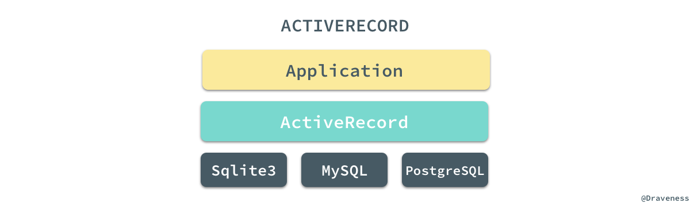

我们可以将 ActiveRecord 理解为一个不同 SQL 数据库的 Wrapper，同时为上层提供一种简洁、优雅的 API 或者说 DSL，能够极大得减轻开发者的负担并提升工作效率。

文章分四个部分介绍了 ActiveRecord 中的重要内容，模型的创建过程、Scope 和查询的实现、模型关系的实现以及最后的 Migrations 任务的实现和执行过程，各个模块之间没有太多的关联，由于文章内容比较多，如果读者只对某一部分的内容感兴趣，可以只挑选一部分进行阅读。

## 模型的创建过程

在这篇文章中，我们会先分析阅读 ActiveRecord 是如何创建模型并将数据插入到数据库中的，由于 ActiveRecord 的源码变更非常迅速，这里使用的 ActiveRecord 版本是 v5.1.4，如果希望重现文中对方法的追踪过程可以 checkout 到 v5.1.4 的标签上并使用如下所示的命令安装指定版本的 ActiveRecord：

```shell
$ gem install activerecord -v '5.1.4'
```

### 引入 ActiveRecord

在正式开始使用 [pry](https://github.com/pry/pry) 对方法进行追踪之前，我们需要现在 pry 中 `require` 对应的 gem，并且创建一个用于追踪的模型类：

```ruby
pry(main)> require 'active_record'
=> true
pry(main)> class Post < ActiveRecord::Base; end
=> nil
```

这个步骤非常的简单，这里也不多说什么了，只是创建了一个继承自 `ActiveRecord::Base` 的类 `Post`，虽然我们并没有在数据库中创建对应的表结构，不过目前来说已经够用了。

### 从 Post.create 开始

使用过 ActiveRecord 的人都知道，当我们使用 `Post.create` 方法的时候就会在数据库中创建一条数据记录，所以在这里我们就将该方法作为入口一探究竟：

```ruby
pry(main)> $ Post.create

From: lib/active_record/persistence.rb @ line 29:
Owner: ActiveRecord::Persistence::ClassMethods

def create(attributes = nil, &block)
  if attributes.is_a?(Array)
    attributes.collect { |attr| create(attr, &block) }
  else
    object = new(attributes, &block)
    object.save
    object
  end
end
```

> `$` 是 pry 为我们提供的用于查看方法源代码的工具，这篇文章中会省略 `$` 方法的一部分输出，还可能会对方法做一些简化减少理解方法实现时的干扰。

通过 pry 的输出，我们可以在 ActiveRecord 的 `lib/active_record/persistence.rb` 文件中找到 `ActiveRecord::Base.create` 方法的实现，如果传入的参数是一个 `Hash`，该方法会先后执行 `ActiveRecord::Base.new` 和 `ActiveRecord::Base#save!` 创建一个新的对象并保存。

#### 使用 pry 追踪 #save!

`ActiveRecord::Base.new` 在大多数情况下都会调用父类的 `#initialize` 方法初始化实例，所以没有什么好说的，而 `ActiveRecord::Base#save!` 方法就做了很多事情：

```ruby
pry(main)> $ ActiveRecord::Base#save!

From: lib/active_record/suppressor.rb @ line 45:
Owner: ActiveRecord::Suppressor

def save!(*) # :nodoc:
  SuppressorRegistry.suppressed[self.class.name] ? true : super
end
```

首先是使用 `SuppressorRegistry` 来判断是否需要对当前的存取请求进行抑制，然后执行 `super` 方法，由于从上述代码中没有办法知道这里的 `super` 到底是什么，所以我们就需要通过 `.ancestors` 方法看看 `ActiveRecord::Base` 到底有哪些父类了：

```ruby
pry(main)> ActiveRecord::Base.ancestors
=> [ActiveRecord::Base,
 ActiveRecord::Suppressor,
 ...
 ActiveRecord::Persistence,
 ActiveRecord::Core,
 ActiveSupport::ToJsonWithActiveSupportEncoder,
 Object,
 ...
 Kernel,
 BasicObject]

pry(main)> ActiveRecord::Base.ancestors.count
=> 65
```

使用 `.ancestors` 方法，你就可以看到整个方法调用链上包含 64 个父类，在这时简单的使用 pry 就已经不能帮助我们理解方法的调用过程了，因为 pry 没法查看当前的方法在父类中是否存在，我们需要从工程中分析哪些类的 `#save!` 方法在整个过程中被执行了并根据上述列表排出它们执行的顺序；经过分析，我们得到如下的结果：

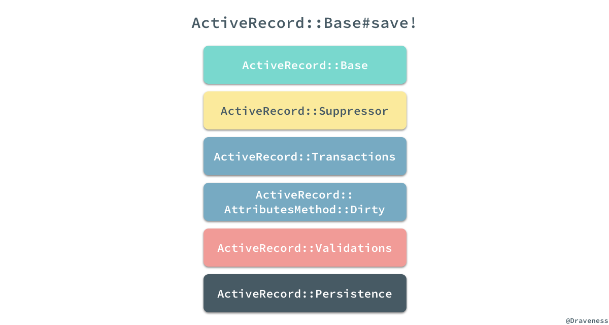

从 `ActiveRecord::Suppressor` 到 `ActiveRecord::Persistence` 一共有五个 module 实现了 `#save!` 方法，上面我们已经知道了 `ActiveRecord::Suppressor#save!` 模块提供了对保存的抑制功能，接下来将依次看后四个方法都在保存模型的过程中做了什么。

#### 事务的执行

从名字就可以看出 `ActiveRecord::Transactions` 主要是为数据库事务提供支持，并在数据库事务的不同阶段执行不同的回调，这个 module 中的 `#save!` 方法仅在 `#with_transaction_returning_status` 的 block 中执行了 `super`：

```ruby
module ActiveRecord
  module Transactions
    def save!(*) #:nodoc:
      with_transaction_returning_status { super }
    end
  end
end
```

`#with_transaction_returning_status` 方法会运行外部传入的 block 通过 `super` 执行父类的 `#save!` 方法：

```ruby
def with_transaction_returning_status
  status = nil
  self.class.transaction do
    add_to_transaction
    begin
      status = yield
    rescue ActiveRecord::Rollback
      clear_transaction_record_state
      status = nil
    end

    raise ActiveRecord::Rollback unless status
  end
  status
ensure
  if @transaction_state && @transaction_state.committed?
    clear_transaction_record_state
  end
end
```

通过上述方法，我们将所有的 SQL 请求都包装在了一个 `.transaction` 中，开启一个新的数据库事务并在其中执行请求，在这里统一处理一些跟事务回滚以及异常相关的逻辑，同时 `ActiveRecord::Transactions` 又能为当前的模型添加一些回调的支持：

```ruby
module ActiveRecord
  module Transactions
    included do
      define_callbacks :commit, :rollback,
                       :before_commit,
                       :before_commit_without_transaction_enrollment,
                       :commit_without_transaction_enrollment,
                       :rollback_without_transaction_enrollment,
                       scope: [:kind, :name]
    end
  end
end
```

开发者就能够在模型中根据需要注册回调用来监听各种数据库事务相关的事件，绝大多数的事务最终都会在 `ActiveRecord::ConnectionAdapters::Transaction#within_new_transaction` 方法中执行：

```ruby
def within_new_transaction(options = {})
  @connection.lock.synchronize do
    begin
      transaction = begin_transaction options
      yield
    rescue Exception => error
      if transaction
        rollback_transaction
        after_failure_actions(transaction, error)
      end
      raise
    ensure
      unless error
        if Thread.current.status == "aborting"
          rollback_transaction if transaction
        else
          begin
            commit_transaction
          rescue Exception
            rollback_transaction(transaction) unless transaction.state.completed?
            raise
          end
        end
      end
    end
  end
end
```

上述方法虽然看起来非常复杂，但是方法的逻辑还是还是非常清晰的，如果事务没有抛出任何的异常，就可以将上述代码简化成以下的几行代码：

```ruby
def within_new_transaction(options = {})
  @connection.lock.synchronize do
      begin_transaction options
      yield
      commit_transaction
    end
  end
end
```

我们可以看到，经过一系列的方法调用最后会在数据库中执行 `BEGIN`、SQL 语句和 `COMMIT` 来完成数据的持久化。

#### 追踪属性的重置

当 `ActiveRecord::Transactions#save!` 通过 `super` 将方法抛给上层之后，就由 `ActiveRecord::AttributesMethod::Dirty` 来处理了：

```ruby
def save!(*)
  super.tap do
    changes_applied
  end
end
```

如果 `#save!` 最终执行成功，在这个阶段会将所有模型改变的标记全部清除，对包括 `@changed_attributes`、`@mutation_tracker` 在内的实例变量全部重置，为追踪下一次模型的修改做准备。

#### 字段的验证

沿着整个继承链往下走，下一个被执行的模块就是 `ActiveRecord::Validations` 了，正如这么模块名字所暗示的，我们在这里会对模型中的字段进行验证：

```ruby
def save!(options = {})
  perform_validations(options) ? super : raise_validation_error
end
```

上述代码使用 `#perform_validations` 方法验证模型中的全部字段，以此来保证所有的字段都符合我们的预期：

```ruby
def perform_validations(options = {})
  options[:validate] == false || valid?(options[:context])
end
```

在这个方法中我们可以看到如果在调用 `save!` 方法时，传入了 `validate: false` 所有的验证就都会被跳过，我们通过 `#valid?` 来判断当前的模型是否合法，而这个方法的执行过程其实也包含两个过程：

```ruby
module ActiveRecord
  module Validations
    def valid?(context = nil)
      context ||= default_validation_context
      output = super(context)
      errors.empty? && output
    end
  end
end

module ActiveModel
  module Validations
    def valid?(context = nil)
      current_context, self.validation_context = validation_context, context
      errors.clear
      run_validations!
    ensure
      self.validation_context = current_context
    end
  end
end
```

由于 `ActiveModel::Validations` 是 `ActiveRecord::Validations` 的『父类』，所以在 `ActiveRecord::Validations` 执行 `#valid?` 方法时，最终会执行父类 `#run_validations` 运行全部的验证回调。

```ruby
module ActiveModel
  module Validations
    def run_validations!
      _run_validate_callbacks
      errors.empty?
    end
  end
end
```

通过上述方法的实现，我们可以发现验证是否成功其实并不是通过我们在 `validate` 中传入一个返回 `true/false` 的方法决定的，而是要向当前模型的 `errors` 中添加更多的错误：

```ruby
class Invoice < ApplicationRecord
  validate :active_customer
 
  def active_customer
    errors.add(:customer_id, "is not active") unless customer.active?
  end
end
```

在这个过程中执行的另一个方法 `#_run_validate_callbacks` 其实是通过 `ActiveSupport::Callbacks` 提供的 `#define_callbacks` 方法动态生成的，所以我们没有办法在工程中搜索到：

```ruby
def define_callbacks(*names)
  options = names.extract_options!

  names.each do |name|
    name = name.to_sym
    set_callbacks name, CallbackChain.new(name, options)
    module_eval <<-RUBY, __FILE__, __LINE__ + 1
      def _run_#{name}_callbacks(&block)
        run_callbacks #{name.inspect}, &block
      end

      def self._#{name}_callbacks
        get_callbacks(#{name.inspect})
      end

      def self._#{name}_callbacks=(value)
        set_callbacks(#{name.inspect}, value)
      end

      def _#{name}_callbacks
        __callbacks[#{name.inspect}]
      end
    RUBY
  end
end
```

在这篇文章中，我们只需要知道该 `#save!` 在合适的时机运行了正确的回调就可以了，在后面的文章（可能）中会详细介绍整个 callbacks 的具体执行流程。

#### 数据的持久化

`#save!` 的调用栈最顶端就是 `ActiveRecord::Persistence#save!` 方法：

```ruby
def save!(*args, &block)
  create_or_update(*args, &block) || raise(RecordNotSaved.new("Failed to save the record", self))
end

def create_or_update(*args, &block)
  _raise_readonly_record_error if readonly?
  result = new_record? ? _create_record(&block) : _update_record(*args, &block)
  result != false
end
```

在这个方法中，我们执行了 `#create_or_update` 以及 `#_create_record` 两个方法来创建模型：

```ruby
def _create_record(attribute_names = self.attribute_names)
  attributes_values = arel_attributes_with_values_for_create(attribute_names)
  new_id = self.class.unscoped.insert attributes_values
  self.id ||= new_id if self.class.primary_key
  @new_record = false
  yield(self) if block_given?
  id
end
```

在这个私有方法中开始执行数据的插入操作了，首先是通过 `ActiveRecord::AttributeMethods#arel_attributes_with_values_for_create` 方法获取一个用于插入数据的字典，其中包括了数据库中的表字段和对应的待插入值。

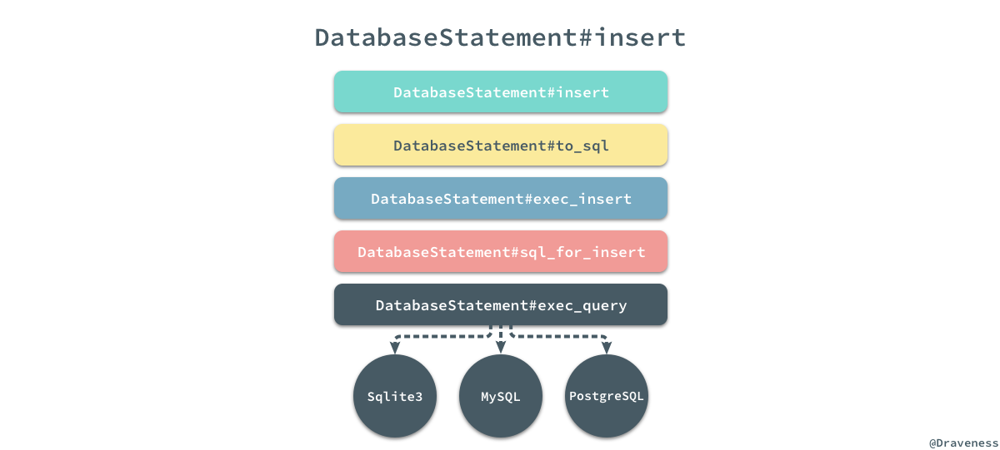

而下面的 `.insert` 方法就会将这个字典转换成 SQL 语句，经过上图所示的调用栈最终到不同的数据库中执行语句并返回最新的主键。

### 小结

从整个模型的创建过程中，我们可以看到 ActiveRecord 对于不同功能的组织非常优雅，每一个方法都非常简短并且易于阅读，通过对应的方法名和模块名我们就能够明确的知道这个东西是干什么的，对于同一个方法的不同执行逻辑也分散了不同的模块中，最终使用 module 加上 include 的方式组织起来，如果要对某个方法添加一些新的逻辑也可以通过增加更多的 module 达到目的。

通过对源代码的阅读，我们可以看到对于 ActiveRecord 来说，`#create` 和 `#save!` 方法的执行路径其实是差不多的，只是在细节上有一些不同之处。

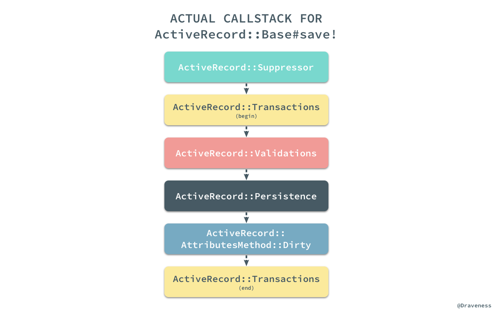

虽然模型或者说数据行的创建过程最终会从子类一路执行到父类的 `#save!` 方法，但是逻辑的**处理顺序**并不是按照从子类到父类执行的，我们可以通过上图了解不同模块的真正执行过程。

## Scope 和查询的实现

除了模型的插入、创建和迁移模块，ActiveRecord 中还有另一个非常重要的模块，也就是 Scope 和查询；为什么同时介绍这两个看起来毫不相干的内容呢？这是因为 Scope 和查询是完全分不开的一个整体，在 ActiveRecord 的实现中，两者有着非常紧密的联系。

### ActiveRecord::Relation

对 ActiveRecord 稍有了解的人都知道，在使用 ActiveRecord 进行查询时，所有的查询方法其实都会返回一个 `#{Model}::ActiveRecord_Relation` 类的对象，比如 `User.all`：

```ruby
pry(main)> User.all.class
=> User::ActiveRecord_Relation
```

在这里使用 pry 来可以帮助我们快速理解整个过程到底都发生了什么事情：

```ruby
pry(main)> $ User.all

From: lib/active_record/scoping/named.rb @ line 24:
Owner: ActiveRecord::Scoping::Named::ClassMethods

def all
  if current_scope
    current_scope.clone
  else
    default_scoped
  end
end
```

`#all` 方法中的注释中也写着它会返回一个 `ActiveRecord::Relation` 对象，它其实可以理解为 ActiveRecord 查询体系中的单位元，它的调用并不改变当前查询；而如果我们使用 pry 去看其他的方法例如 `User.where` 的时候：

```ruby
pry(main)> $ User.where

From: lib/active_record/querying.rb @ line 10:
Owner: ActiveRecord::Querying

delegate :select, :group, :order, :except, :reorder, :limit, :offset, :joins, :left_joins, :left_outer_joins, :or,
         :where, :rewhere, :preload, :eager_load, :includes, :from, :lock, :readonly, :extending,
         :having, :create_with, :distinct, :references, :none, :unscope, :merge, to: :all
```

从这里我们可以看出，真正实现为 `User` 类方法的只有 `.all`，其他的方法都会代理给 `all` 方法，在 `.all` 方法返回的对象上执行：

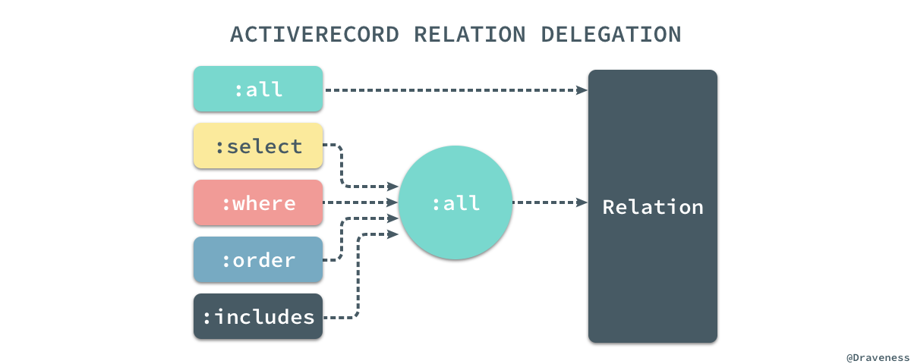

所有直接在类上调用的方法都会先执行 `#all`，也就是说下面的几种写法是完全相同的：

```ruby
User    .where(name: 'draven')
User.all.where(name: 'draven')
User.all.where(name: 'draven').all
```

当我们了解了 `.where == .all + #where` 就可以再一次使用 pry 来查找真正被 ActiveRecord 实现的 `#where` 方法：

```ruby
pry(main)> $ User.all.where

From: lib/active_record/relation/query_methods.rb @ line 599:
Owner: ActiveRecord::QueryMethods

def where(opts = :chain, *rest)
  if :chain == opts
    WhereChain.new(spawn)
  elsif opts.blank?
    self
  else
    spawn.where!(opts, *rest)
  end
end
```

在分析查询的过程中，我们会选择几个常见的方法作为入口，尽可能得覆盖较多的查询相关的代码，增加我们对 ActiveRecord 的理解和认识。

### 从 User.all 开始

再来看一下上面看到的 `ActiveRecord::Relation.all` 方法，无论是 `#current_scope` 还是 `#default_scoped` 其实返回的都是当前的 `ActiveRecord` 对象：

```ruby
def all
  if current_scope
    current_scope.clone
  else
    default_scoped
  end
end
```

#### current_scope 和 default_scope

如果当前没有 `#current_scope` 那么，就会调用 `#default_scoped` 返回响应的结果，否则就会 clone 当前对象并返回，可以简单举一个例子证明这里的猜测：

```ruby
pry(main)> User.current_scope
=> nil
pry(main)> User.all.current_scope
  User Load (0.1ms)  SELECT "users".* FROM "users"
=> []
pry(main)> User.all.current_scope.class
=> User::ActiveRecord_Relation
```

`.current_scope` 是存储在位于线程变量的 `ScopeRegistry` 中，它其实就是当前的查询语句的上下文，存储着这一次链式调用造成的全部副作用：

```ruby
def current_scope(skip_inherited_scope = false)
  ScopeRegistry.value_for(:current_scope, self, skip_inherited_scope)
end
```

而 `.default_scoped` 就是在当前查询链刚开始时执行的第一个方法，因为在执行第一个查询方法之前 `.current_scope` 一定为空：

```ruby
def default_scoped(scope = relation)
  build_default_scope(scope) || scope
end

def build_default_scope(base_rel = nil)
  return if abstract_class?

  if default_scopes.any?
    base_rel ||= relation
    evaluate_default_scope do
      default_scopes.inject(base_rel) do |default_scope, scope|
        scope = scope.respond_to?(:to_proc) ? scope : scope.method(:call)
        default_scope.merge(base_rel.instance_exec(&scope))
      end
    end
  end
end
```

当我们在 Rails 的模型层中使用 `.default_scope` 定义一些默认的上下文时，所有的 block 都换被转换成 `Proc` 对象最终添加到 `default_scopes` 数组中：

```ruby
def default_scope(scope = nil) # :doc:
  scope = Proc.new if block_given?
  # ...
  self.default_scopes += [scope]
end
```

上面提到的 `.build_default_scope` 方法其实只是在 `default_scopes` 数组不为空时，将当前的 `Relation` 对象和数组中的全部 scope 一一 `#merge` 并返回一个新的 `Relation` 对象。

#### ActiveRecord::Relation 对象

`.default_scoped` 方法的参数 `scope` 其实就有一个默认值 `#relation`，这个默认值其实就是一个 `Relation` 类的实例：

```ruby
def relation
  relation = Relation.create(self, arel_table, predicate_builder)

  if finder_needs_type_condition? && !ignore_default_scope?
    relation.where(type_condition).create_with(inheritance_column.to_s => sti_name)
  else
    relation
  end
end
```

`Relation.create` 对象的创建过程其实比较复杂，我们只需要知道经过 ActiveRecord 一系列的疯狂操作，最终会将几个参数传入 `.new` 方法初始化一个 `ActiveRecord::Relation` 实例：

```ruby
class Relation
  def initialize(klass, table, predicate_builder, values = {})
    @klass  = klass
    @table  = table
    @values = values
    @offsets = {}
    @loaded = false
    @predicate_builder = predicate_builder
  end
end
```

当执行的是 `#all`、`.all` 或者绝大多数查询方法时，都会直接将这个初始化的对象返回来接受随后的链式调用。

### where 方法

相比于 `#all`、`#where` 查询的实现就复杂多了，不像 `#all` 会返回一个默认的 `Relation` 对象，`#where` 由 `WhereClause` 以及 `WhereClauseFactory` 等类共同处理；在 `#where` 的最正常的执行路径中，它会执行 `#where!` 方法：

```ruby
def where(opts = :chain, *rest)
  if :chain == opts
    WhereChain.new(spawn)
  elsif opts.blank?
    self
  else
    spawn.where!(opts, *rest)
  end
end

def where!(opts, *rest)
  opts = sanitize_forbidden_attributes(opts)
  references!(PredicateBuilder.references(opts)) if Hash === opts
  self.where_clause += where_clause_factory.build(opts, rest)
  self
end
```

> `#spawn` 其实就是对当前的 `Relation` 对象进行 `#clone`。

查询方法 `#where!` 中的四行代码只有一行代码是我们需要关注的，该方法调用 `WhereClauseFactory#build` 生成一条 where 查询并存储到当前对象的 `where_clause` 中，在这个过程中并不会生成 SQL，而是会生成一个 `WhereClause` 对象，其中存储着 SQL 节点树：

```ruby
pry(main)> User.where(name: 'draven').where_clause
=> #<ActiveRecord::Relation::WhereClause:0x007fe5a10bf2c8
 @binds=
  [#<ActiveRecord::Relation::QueryAttribute:0x007fe5a10bf4f8
    @name="name",
    @original_attribute=nil,
    @type=#<ActiveModel::Type::String:0x007fe59d33f2e0 @limit=nil, @precision=nil, @scale=nil>,
    @value_before_type_cast="draven">],
 @predicates=
  [#<Arel::Nodes::Equality:0x007fe5a10bf368
    @left=
     #<struct Arel::Attributes::Attribute
      relation=
       #<Arel::Table:0x007fe59cc87830
        @name="users",
        @table_alias=nil,
        @type_caster=
         #<ActiveRecord::TypeCaster::Map:0x007fe59cc87bf0
          @types=
           User(id: integer, avatar: string, nickname: string, wechat: string, name: string, gender: integer, school: string, grade: string, major: string, completed: boolean, created_at: datetime, updated_at: datetime, mobile: string, admin: boolean)>>,
      name="name">,
    @right=#<Arel::Nodes::BindParam:0x007fe5a10bf520>>]>
```

> [Arel](https://github.com/rails/arel) 是一个 Ruby 的 SQL 抽象语法树的管理器，ActiveRecord 查询的过程都是惰性的，在真正进入数据库查询之前，查询条件都是以语法树的形式存储的。

在这里不像展开介绍 SQL 语法树的生成过程，因为过程比较复杂，详细分析也没有太大的意义。

### order 方法

除了 `#where` 方法之外，在这里还想简单介绍一下另外一个常用的方法 `#order`：

```ruby
def order(*args)
  check_if_method_has_arguments!(:order, args)
  spawn.order!(*args)
end

def order!(*args)
  preprocess_order_args(args)
  self.order_values += args
  self
end
```

该方法的调用栈与 `#where` 非常相似，在调用栈中都会执行另一个带有 `!` 的方法，也都会向自己持有的某个『属性』追加一些参数，参数的处理也有点复杂，在这里简单看一看就好：

```ruby
def preprocess_order_args(order_args)
  order_args.map! do |arg|
    klass.send(:sanitize_sql_for_order, arg)
  end
  order_args.flatten!
  validate_order_args(order_args)

  references = order_args.grep(String)
  references.map! { |arg| arg =~ /^([a-zA-Z]\w*)\.(\w+)/ && $1 }.compact!
  references!(references) if references.any?

  # if a symbol is given we prepend the quoted table name
  order_args.map! do |arg|
    case arg
    when Symbol
      arel_attribute(arg).asc
    when Hash
      arg.map { |field, dir|
        case field
        when Arel::Nodes::SqlLiteral
          field.send(dir.downcase)
        else
          arel_attribute(field).send(dir.downcase)
        end
      }
    else
      arg
    end
  end.flatten!
end
```

同样的，`#order` 方法的使用也会向 `order_values` 数组中添加对应的语法元素：

```ruby
pry(main)> User.order(name: :desc).order_values
=> [#<Arel::Nodes::Descending:0x007fe59ce4f190
  @expr=
   #<struct Arel::Attributes::Attribute
    relation=
     #<Arel::Table:0x007fe59cc87830
      @name="users",
      @table_alias=nil,
      @type_caster=
       #<ActiveRecord::TypeCaster::Map:0x007fe59cc87bf0
        @types=
         User(id: integer, avatar: string, nickname: string, wechat: string, name: string, gender: integer, school: string, grade: string, major: string, completed: boolean, created_at: datetime, updated_at: datetime, mobile: string, admin: boolean)>>,
    name=:name>>]
```

在这个方法的返回值中，我们也能看到与 Arel 相关的各种节点，可以大致理解上述语法树的作用。

### 语法树的存储

无论是 `#where` 还是 `#order` 方法，它们其实都会向当前的 `Relation` 对象中追加相应的语法树节点，而除了上述的两个方法之外 `#from`、`#distinct`、`#lock`、`#limit` 等等，几乎所有的查询方法都会改变 `Relation` 中的某个值，然而所有的值其实都是通过 `@values` 这个实例变量存储的：

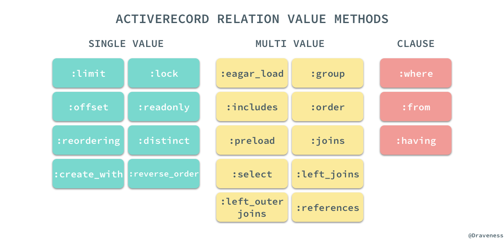

`@values` 中存储的值分为三类，`SINGLE_VALUE`、`MULTI_VALUE` 和 `CLAUSE`，这三类属性会按照下面的规则存储在 `@values` 中：

```ruby
Relation::VALUE_METHODS.each do |name|
  method_name = \
    case name
    when *Relation::MULTI_VALUE_METHODS then "#{name}_values"
    when *Relation::SINGLE_VALUE_METHODS then "#{name}_value"
    when *Relation::CLAUSE_METHODS then "#{name}_clause"
    end
  class_eval <<-CODE, __FILE__, __LINE__ + 1
    def #{method_name}                   # def includes_values
      get_value(#{name.inspect})         #   get_value(:includes)
    end                                  # end

    def #{method_name}=(value)           # def includes_values=(value)
      set_value(#{name.inspect}, value)  #   set_value(:includes, value)
    end                                  # end
  CODE
end
```

各种不同的值在最后都会按照一定的命名规则，存储在这个 `@values` 字典中：

```ruby
def get_value(name)
  @values[name] || default_value_for(name)
end

def set_value(name, value)
  assert_mutability!
  @values[name] = value
end
```

如果我们直接在一个查询链中访问 `#values` 方法可以获得其中存储的所有查询条件：

```ruby
pry(main)> User.where(name: 'draven').order(name: :desc).values
=> {:references=>[],
 :where=>
  #<ActiveRecord::Relation::WhereClause:0x007fe59d14d860>,
 :order=>
  [#<Arel::Nodes::Descending:0x007fe59d14cd98>]}
```

很多 ActiveRecord 的使用者其实在使用的过程中都感觉在各种链式方法调用时没有改变任何事情，所有的方法都可以任意组合进行链式调用，其实每一个方法的调用都会对 `@values` 中存储的信息进行了修改，只是 ActiveRecord 很好地将它隐藏了幕后，让我们没有感知到它的存在。

### scope 方法

相比于 `.default_scope` 这个类方法只是改变了当前模型中的 `default_scopes` 数组，另一个方法 `.scope` 会为当前类定义一个新的类方法：

```ruby
From: lib/active_record/scoping/named.rb @ line 155:
Owner: ActiveRecord::Scoping::Named::ClassMethods

def scope(name, body, &block)
  extension = Module.new(&block) if block

  if body.respond_to?(:to_proc)
    singleton_class.send(:define_method, name) do |*args|
      scope = all.scoping { instance_exec(*args, &body) }
      scope = scope.extending(extension) if extension
      scope || all
    end
  else
    singleton_class.send(:define_method, name) do |*args|
      scope = all.scoping { body.call(*args) }
      scope = scope.extending(extension) if extension
      scope || all
    end
  end
end
```

上述方法会直接在当前类的单类上通过 `define_methods` 为当前类定义类方法，定义的方法会在上面提到的 `.all` 的返回结果上执行 `#scoping`，存储当前执行的上下文，执行传入的 block，再恢复 `current_scope`：

```ruby
def scoping
  previous, klass.current_scope = klass.current_scope(true), self
  yield
ensure
  klass.current_scope = previous
end
```

在这里其实有一个可能很多人从来没用过的特性，就是在 `.scope` 方法中传入一个 block：

```ruby
class User
  scope :male, -> { where gender: :male } do
    def twenty
      where age: 20
    end
  end
end

pry(main)> User.male.twenty
#=> <#User:0x007f98f3d61c38>
pry(main)> User.twenty
#=> NoMethodError: undefined method `twenty' for #<Class:0x007f98f5c7b2b8>
pry(main)> User.female.twenty
#=> NoMethodError: undefined method `twenty' for #<User::ActiveRecord_Relation:0x007f98f5d950e0>
```

这个传入的 block 只会在当前 `Relation` 对象的单类上添加方法，如果我们想定义一些不想在其他作用域使用的方法就可以使用这种方式：

```ruby
def extending(*modules, &block)
  if modules.any? || block
    spawn.extending!(*modules, &block)
  else
    self
  end
end

def extending!(*modules, &block)
  modules << Module.new(&block) if block
  modules.flatten!
  self.extending_values += modules
  extend(*extending_values) if extending_values.any?
  self
end
```

而 `extending` 方法的实现确实与我们预期的一样，创建了新的 `Module` 对象之后，直接使用 `#extend` 将其中的方法挂载当前对象的单类上。

### 小结

到这里为止，我们对 ActiveRecord 中查询的分析就已经比较全面了，从最终要的 `Relation` 对象，到常见的 `#all`、`#where` 和 `#order` 方法，到 ActiveRecord 对语法树的存储，如何与 Arel 进行协作，在最后我们也介绍了 `.scope` 方法的工作原理，对于其它方法或者功能的实现其实也都大同小异，在这里就不展开细谈了。

## 模型的关系

作为一个关系型数据库的 ORM，ActiveRecord 一定要提供对模型之间关系的支持，它为模型之间的关系建立提供了四个类方法 `has_many`、`has_one`、`belongs_to` 和 `has_and_belongs_to_many`，在文章的这一部分，我们会从上面几个方法中选择一部分介绍 ActiveRecord 是如何建立模型之间的关系的。

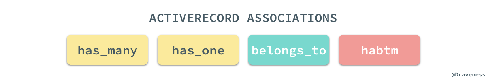

### Association 和继承链

首先来看 `.has_many` 方法是如何实现的，我们可以通过 pry 直接找到该方法的源代码：

```ruby
pry(main)> $ User.has_many

From: lib/active_record/associations.rb @ line 1401:
Owner: ActiveRecord::Associations::ClassMethods

def has_many(name, scope = nil, options = {}, &extension)
  reflection = Builder::HasMany.build(self, name, scope, options, &extension)
  Reflection.add_reflection self, name, reflection
end
```

整个 `.has_many` 方法的实现也只有两行代码，总共涉及两个类 `Builder::HasMany` 和 `Reflection`，其中前者用于创建新的 `HasMany` 关系，后者负责将关系添加到当前类中。

`HasMany` 类的实现其实非常简单，但是它从父类和整个继承链中继承了很多方法：


我们暂时先忘记 `.has_many` 方法的实现，先来看一下这里涉及的两个非常重要的类都是如何工作的，首先是 `Association` 以及它的子类；在 ActiveRecord 的实现中，我们其实能够找到四种关系的 Builder，它们有着非常清晰简单的继承关系：

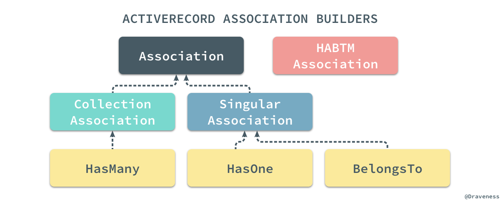

在这里定义的 `.build` 方法其实实现也很清晰，它通过调用当前抽象类 `Association` 或者子类的响应方法完成一些建立关系必要的工作：

```ruby
def self.build(model, name, scope, options, &block)
  extension = define_extensions model, name, &block
  reflection = create_reflection model, name, scope, options, extension
  define_accessors model, reflection
  define_callbacks model, reflection
  define_validations model, reflection
  reflection
end
```

其中包括创建用于操作、查询和管理当前关系扩展 Module 的 `.define_extensions` 方法，同时也会使用 `.create_reflection` 创建一个用于检查 ActiveRecord 类的关系的 `Reflection` 对象，我们会在下一节中展开介绍，在创建了 `Reflection` 后，我们会根据传入的模型和 `Reflection` 对象为当前的类，例如 `User` 定义属性存取方法、回调以及验证:

```ruby
def self.define_accessors(model, reflection)
  mixin = model.generated_association_methods
  name = reflection.name
  define_readers(mixin, name)
  define_writers(mixin, name)
end

def self.define_readers(mixin, name)
  mixin.class_eval <<-CODE, __FILE__, __LINE__ + 1
    def #{name}(*args)
      association(:#{name}).reader(*args)
    end
  CODE
end

def self.define_writers(mixin, name)
  mixin.class_eval <<-CODE, __FILE__, __LINE__ + 1
    def #{name}=(value)
      association(:#{name}).writer(value)
    end
  CODE
end
```

存取方法还是通过 Ruby 的元编程能力定义的，在这里通过 `.class_eval` 方法非常轻松地就能在当前的模型中定义方法，关于回调和验证的定义在这里就不在展开介绍了。

### Reflection 和继承链

`Reflection` 启用了检查 ActiveRecord 类和对象的关系和聚合的功能，它能够在 Builder 中使用为 ActiveRecord 中的类创建对应属性和方法。

与 `Association` 一样，ActiveRecord 中的不同关系也有不同的 `Reflection`，根据不同的关系和不同的配置，ActiveRecord 中建立了一套 Reflection 的继承体系与数据库中的不同关系一一对应：

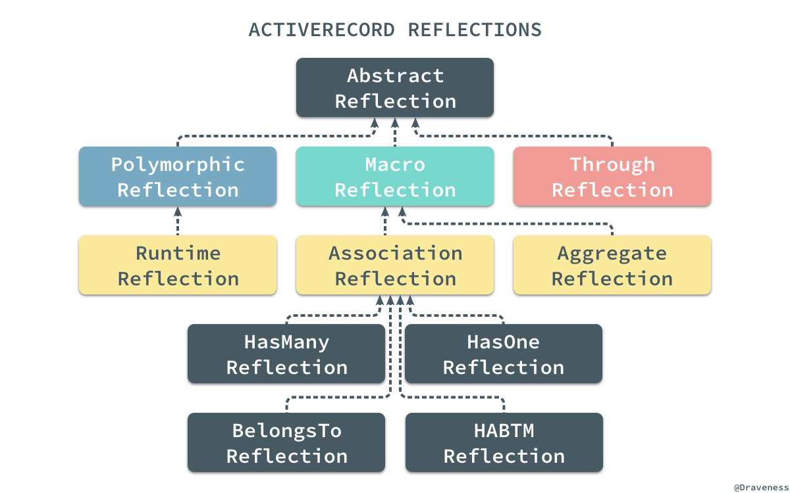

当我们在上面使用 `.has_many` 方法时，会通过 `.create_reflection` 创建一个 `HasManyReflection` 对象：

```ruby
def self.create_reflection(model, name, scope, options, extension = nil)
  if scope.is_a?(Hash)
    options = scope
    scope   = nil
  end

  validate_options(options)
  scope = build_scope(scope, extension)
  ActiveRecord::Reflection.create(macro, name, scope, options, model)
end
```

`Reflection#create` 方法是一个工厂方法，它会根据传入的 `macro` 和 `options` 中的值选择合适的类实例化：

```ruby
def self.create(macro, name, scope, options, ar)
  klass = \
    case macro
    when :composed_of
      AggregateReflection
    when :has_many
      HasManyReflection
    when :has_one
      HasOneReflection
    when :belongs_to
      BelongsToReflection
    else
      raise "Unsupported Macro: #{macro}"
    end

  reflection = klass.new(name, scope, options, ar)
  options[:through] ? ThroughReflection.new(reflection) : reflection
end
```

这个创建的 `Reflection` 在很多时候都有非常重要的作用，在创建存储方法、回调和验证时，都需要将这个对象作为参数传入提供一定的支持，起到了数据源和提供 Helper 方法的作用。

在整个定义方法、属性以及回调的工作完成之后，会将当前的对象以 `name` 作为键存储到自己持有的一个 `_reflections` 字典中：

```ruby
# class_attribute :_reflections, instance_writer: false

def self.add_reflection(ar, name, reflection)
  ar.clear_reflections_cache
  ar._reflections = ar._reflections.merge(name.to_s => reflection)
end
```

这个字典中存储着所有在当前类中使用 `has_many`、`has_one`、`belongs_to` 等方法定义的关系对应的映射。

### 一对多关系

一对多关系的这一节会分别介绍两个极其重要的方法 `.has_many` 和 `.belongs_to` 的实现；在这里，会先通过 `.has_many` 关系了解它是如何通过覆写父类方法定制自己的特性的，之后会通过 `.belongs_to` 研究 getter/setter 方法的调用栈。


一对多关系在数据库的模型之间非常常见，而这两个方法在 ActiveRecord 也经常成对出现。

#### has_many

当我们对构建关系模块的两大支柱都已经有所了解之后，再来看这几个常用的方法就没有太多的难度了，首先来看一下一对多关系中的『多』是怎么实现的：

```ruby
def has_many(name, scope = nil, options = {}, &extension)
  reflection = Builder::HasMany.build(self, name, scope, options, &extension)
  Reflection.add_reflection self, name, reflection
end
```

由于已经对 `Reflection.add_reflection` 方法的实现有所了解，所以这里直接看 `.has_many` 调用的 `Builder::HasMany.build` 方法的实现就可以知道这个类方法究竟做了什么，：

```ruby
def self.build(model, name, scope, options, &block)
  extension = define_extensions model, name, &block
  reflection = create_reflection model, name, scope, options, extension
  define_accessors model, reflection
  define_callbacks model, reflection
  define_validations model, reflection
  reflection
end
```

在这里执行的 `.build` 方法与抽象类中的方法实现完全相同，子类并没有覆盖父类实现的方法，我们来找一下 `.define_accessors`、`.define_callbacks` 和 `.define_validations` 三个方法在 has_many 关系中都做了什么。

`HasMany` 作为 has_many 关系的 Builder 类，其本身并没有实现太多的方法，只是对一些关系选项有一些自己独有的声明：

```ruby
module ActiveRecord::Associations::Builder
  class HasMany < CollectionAssociation
    def self.macro
      :has_many
    end

    def self.valid_options(options)
      super + [:primary_key, :dependent, :as, :through, :source, :source_type, :inverse_of, :counter_cache, :join_table, :foreign_type, :index_errors]
    end

    def self.valid_dependent_options
      [:destroy, :delete_all, :nullify, :restrict_with_error, :restrict_with_exception]
    end
  end
end
```

由于本身 has_many 关系中的读写方法都是对集合的操作，所以首先覆写了 `.define_writers` 和 `.define_readers` 两个方法生成了另外一组操作 id 的 getter/setter 方法：

```ruby
def self.define_readers(mixin, name)
  super

  mixin.class_eval <<-CODE, __FILE__, __LINE__ + 1
    def #{name.to_s.singularize}_ids
      association(:#{name}).ids_reader
    end
  CODE
end

def self.define_writers(mixin, name)
  super

  mixin.class_eval <<-CODE, __FILE__, __LINE__ + 1
    def #{name.to_s.singularize}_ids=(ids)
      association(:#{name}).ids_writer(ids)
    end
  CODE
end
```

has_many 关系在 `CollectionAssociation` 和 `HasManyAssociation` 中实现的几个方法 `#reader`、`#writer`、`#ids_reader` 和 `#ids_writer` 其实还是比较复杂的，在这里就跳过不谈了。

而 `.define_callbacks` 和 `.define_extensions` 其实都大同小异，在作者看来没有什么值得讲的，has_many 中最重要的部分还是读写方法的实现过程，不过由于篇幅所限这里就不多说了。

#### belongs_to

在一对多关系中，经常与 has_many 对应的关系 belongs_to 其实实现和调用栈也几乎完全相同：

```ruby
def belongs_to(name, scope = nil, options = {})
  reflection = Builder::BelongsTo.build(self, name, scope, options)
  Reflection.add_reflection self, name, reflection
end
```

但是与 has_many 比较大的不同是 `Builder::BelongsTo` 通过继承的父类定义了很多用于创建新关系的方法：

```ruby
def self.define_accessors(model, reflection)
  super
  mixin = model.generated_association_methods
  name = reflection.name
  define_constructors(mixin, name) if reflection.constructable?
  mixin.class_eval <<-CODE, __FILE__, __LINE__ + 1
    def reload_#{name}
      association(:#{name}).force_reload_reader
    end
  CODE
end

def self.define_constructors(mixin, name)
  mixin.class_eval <<-CODE, __FILE__, __LINE__ + 1
    def build_#{name}(*args, &block)
      association(:#{name}).build(*args, &block)
    end
    def create_#{name}(*args, &block)
      association(:#{name}).create(*args, &block)
    end
    def create_#{name}!(*args, &block)
      association(:#{name}).create!(*args, &block)
    end
  CODE
end
``` 

其他的部分虽然实现上也与 has_many 有着非常大的不同，但是原理基本上完全一致，不过在这里我们可以来看一下 belongs_to 关系创建的两个方法 `association` 和 `association=` 究竟是如何对数据库进行操作的。

```ruby
class Topic < ActiveRecord::Base
  has_many :subtopics
end

class Subtopic < ActiveRecord::Base
  belongs_to :topic
end
```

假设我们有着如上所示的两个模型，它们之间是一对多关系，我们以这对模型为例先来看一下 `association` 这个读方法的调用栈。

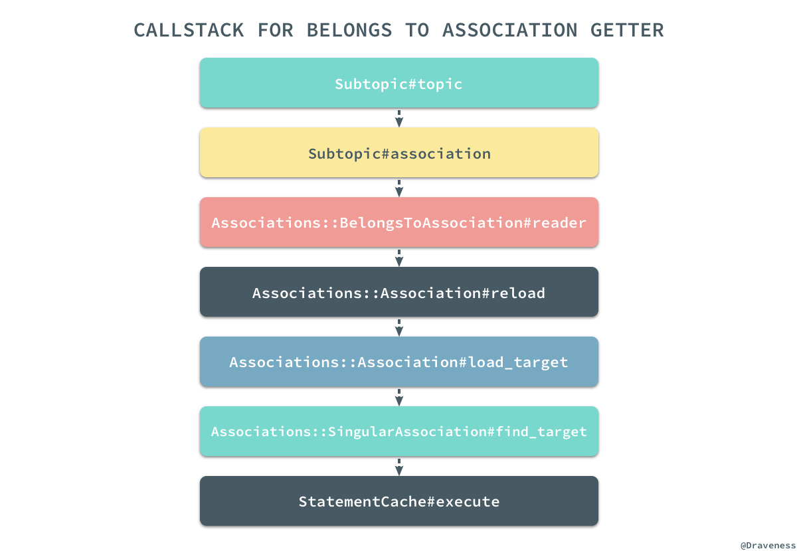

通过我们对源代码和调用栈的阅读，我们可以发现其实如下的所有方法调用在大多数情况下是完全等价的，假设我们已经持有了一个 `Subtopic` 对象：

```ruby
subtopic = Subtopic.first #=> #<Subtopic:0x007ff513f67768>

subtopic.topic
subtopic.association(:topic).reader
subtopic.association(:topic).target
subtopic.association(:topic).load_target
subtopic.association(:topic).send(:find_target)
```

上述的五种方式都可以获得当前 `Subtopic` 对象的 belongs_to 关系对应的 `Topic` 数据行，而最后一个方法 `#find_target` 其实也就是真正创建、绑定到最后执行查询 SQL 的方法：

```ruby
pry(main)> $ subtopic.association(:topic).find_target

From: lib/active_record/associations/singular_association.rb @ line 38:
Owner: ActiveRecord::Associations::SingularAssociation

def find_target
  return scope.take if skip_statement_cache?

  conn = klass.connection
  sc = reflection.association_scope_cache(conn, owner) do
    StatementCache.create(conn) { |params|
      as = AssociationScope.create { params.bind }
      target_scope.merge(as.scope(self, conn)).limit(1)
    }
  end

  binds = AssociationScope.get_bind_values(owner, reflection.chain)
  sc.execute(binds, klass, conn) do |record|
    set_inverse_instance record
  end.first
rescue ::RangeError
  nil
end
```

我们已经对 `association` 方法的实现有了非常清楚的认知了，下面再来过一下 `association=` 方法的实现，首先还是来看一下 setter 方法的调用栈：

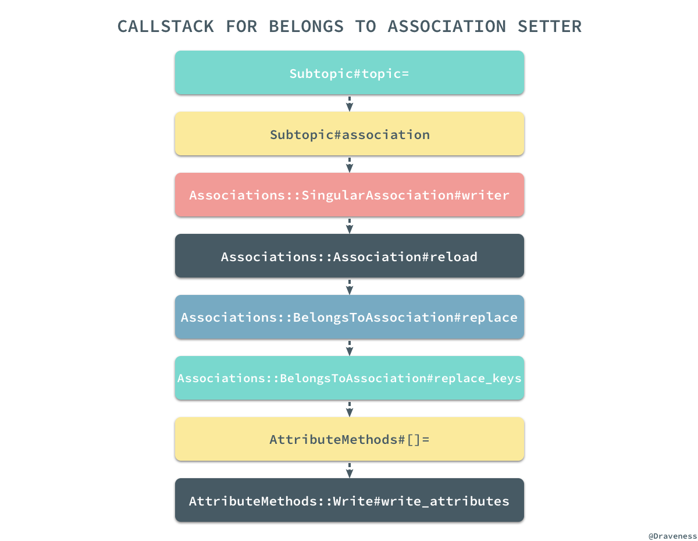

相比于 getter 的调用栈，setter 方法的调用栈都复杂了很多，在研究 setter 方法实现的过程中我们一定要记住这个方法并不会改变数据库中对应的数据行，只会改变当前对应的某个属性，经过对调用栈和源代码的分析，我们可以有以下的结论：假设现在有一个 `Subtopic` 对象和一个新的 `Topic` 实例，那么下面的一系列操作其实是完全相同的：

```ruby
subtopic = Subtopic.first #=> #<Subtopic:0x007ff513f67768>
new_topic = Topic.first   #=> #<Topic:0x007ff514b24cb8>

subtopic.topic = new_topic
subtopic.topic_id = new_topic.id
subtopic.association(:topic).writer(new_topic)
subtopic.association(:topic).replace(new_topic)
subtopic.association(:topic).replace_keys(new_topic)
subtopic.association(:topic).owner[:topic_id] = new_topic.id
subtopic[:topic_id] = new_topic.id
subtopic.write_attribute(:topic_id, new_topic.id)
```

虽然这些方法最后返回的结果可能有所不同，但是它们最终都会将 `subtopic` 对象的 `topic_id` 属性更新成 `topic.id`，上面的方法中有简单的，也有复杂的，不过都能达到相同的目的；我相信如果读者亲手创建上述的关系并使用 pry 查看源代码一定会对 getter 和 setter 的执行过程有着非常清楚的认识。

### 多对多关系 habtm

无论是 has_many 还是 belongs_to 其实都是一个 ORM 原生需要支持的关系，但是 habtm(has_and_belongs_to_many) 却是 ActiveRecord 为我们提供的一个非常方便的语法糖，哪怕是并没有 `.has_and_belongs_to_many` 这个方法，我们也能通过 `.has_many` 实现多对多关系，得到与前者完全等价的效果，只是实现的过程稍微麻烦一些。

在这一小节中，我们想要了解 habtm 这个语法糖是如何工作的，它是如何将现有的关系组成更复杂的 habtm 的多对多关系的；想要了解它的工作原理，我们自然要分析它的源代码：

```ruby
def has_and_belongs_to_many(name, scope = nil, **options, &extension)
  builder = Builder::HasAndBelongsToMany.new name, self, options
  join_model = ActiveSupport::Deprecation.silence { builder.through_model }
  const_set join_model.name, join_model
  private_constant join_model.name

  habtm_reflection = ActiveRecord::Reflection::HasAndBelongsToManyReflection.new(name, scope, options, self)
  middle_reflection = builder.middle_reflection join_model
  Builder::HasMany.define_callbacks self, middle_reflection
  Reflection.add_reflection self, middle_reflection.name, middle_reflection
  middle_reflection.parent_reflection = habtm_reflection

  # ...

  hm_options = {}
  hm_options[:through] = middle_reflection.name
  hm_options[:source] = join_model.right_reflection.name

  # ...

  ActiveSupport::Deprecation.silence { has_many name, scope, hm_options, &extension }
  _reflections[name.to_s].parent_reflection = habtm_reflection
end
```

> 在这里，我们对该方法的源代码重新进行组织和排序，方法的作用与 v5.1.4 中的完全相同。

上述方法在最开始先创建了一个 `HasAndBelongsToMany` 的 Builder 实例，然后在 block 中执行了这个 Builder 的 `#through_model` 方法：

```ruby
def through_model
  habtm = JoinTableResolver.build lhs_model, association_name, options

  join_model = Class.new(ActiveRecord::Base) {
    class << self;
      attr_accessor :left_model
      attr_accessor :name
      attr_accessor :table_name_resolver
      attr_accessor :left_reflection
      attr_accessor :right_reflection
    end

    # ...
  }

  join_model.name                = "HABTM_#{association_name.to_s.camelize}"
  join_model.table_name_resolver = habtm
  join_model.left_model          = lhs_model
  join_model.add_left_association :left_side, anonymous_class: lhs_model
  join_model.add_right_association association_name, belongs_to_options(options)
  join_model
end
```

`#through_model` 方法会返回一个新的继承自 `ActiveRecord::Base` 的类，我们通过一下的例子来说明一下这里究竟做了什么，假设在我们的工程中定义了如下的两个类：

```ruby
class Post < ActiveRecord::Base
  has_and_belongs_to_many :tags
end

class Tag < ActiveRecord::Base
  has_and_belongs_to_many :posts
end
```

它们每个类都通过 `.has_and_belongs_to_many` 创建了一个 `join_model` 类，这两个类都是在当前类的命名空间下的：

```ruby
class Post::HABTM_Posts < ActiveRecord::Base; end
class Tags::HABTM_Posts < ActiveRecord::Base; end
```

除了在当前类的命名空间下定义两个新的类之外，`#through_model` 方法还通过 `#add_left_association` 和 `#add_right_association` 为创建的私有类添加了两个 `.belongs_to` 方法的调用：

```ruby
join_model = Class.new(ActiveRecord::Base) {
  # ...

  def self.add_left_association(name, options)
    belongs_to name, required: false, **options
    self.left_reflection = _reflect_on_association(name)
  end

  def self.add_right_association(name, options)
    rhs_name = name.to_s.singularize.to_sym
    belongs_to rhs_name, required: false, **options
    self.right_reflection = _reflect_on_association(rhs_name)
  end
}
```

所以在这里，每一个 HABTM 类中都通过 `.belongs_to` 增加了两个对数据库表中对应列的映射：

```ruby
class Post::HABTM_Posts < ActiveRecord::Base
  belongs_to :post_id, required: false
  belongs_to :tag_id, required: false
end

class Tags::HABTM_Posts < ActiveRecord::Base
  belongs_to :tag_id, required: false
  belongs_to :post_id, required: false
end
```

看到这里，你可能会认为既然有两个模型，那么应该会有两张表分别对应这两个模型，但是实际情况却不是这样。

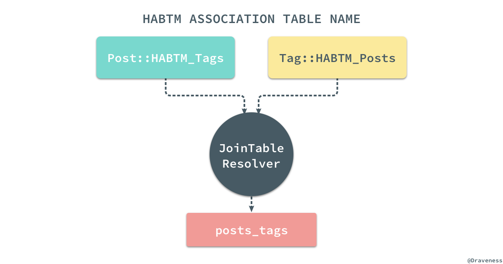


ActiveRecord 通过覆写这两个类的 `.table_name` 方法，使用一个 `JoinTableResolver` 来解决不同的模型拥有相同的数据库表的问题：

```ruby
class Migration
  module JoinTable
    def join_table_name(table_1, table_2)
      ModelSchema.derive_join_table_name(table_1, table_2).to_sym
    end
  end
end

module ModelSchema
  def self.derive_join_table_name(first_table, second_table) 
    [first_table.to_s, second_table.to_s].sort.join("\0").gsub(/^(.*_)(.+)\0\1(.+)/, '\1\2_\3').tr("\0", "_")
  end
end
```

在默认的 `join_table` 规则中，两张表会按照字母顺序排序，最后通过 `_` 连接到一起，但是如果两张表有着完全相同的前缀，比如 music_artists 和 music_records 两张表，它们连接的结果就是 music_artists_records，公共的前缀会被删除，这种情况经常发生在包含命名空间的模型中，例如：`Music::Artist`。

当我们已经通过多对多关系的 Builder 创建了一个中间模型之后，就会建立两个 `Reflection` 对象：

```ruby
habtm_reflection = ActiveRecord::Reflection::HasAndBelongsToManyReflection.new(name, scope, options, self)
middle_reflection = builder.middle_reflection join_model
Builder::HasMany.define_callbacks self, middle_reflection
Reflection.add_reflection self, middle_reflection.name, middle_reflection
middle_reflection.parent_reflection = habtm_reflection
```

其中一个对象是 `HasAndBelongsToManyReflection` 实例，表示当前的多对多关系，另一个对象是 `#middle_reflection` 方法返回的 `HasMany`，表示当前的类与 `join_model` 之间有一个一对多关系，这个关系是隐式的，不过我们可以通过下面的代码来『理解』它：

```ruby
class Post < ActiveRecord::Base
  # has_and_belongs_to_many :posts
  # =
  has_many :posts_tag
  # + 
  # ...
end
```

上述的代码构成了整个多对多关系的一部分，而另一部分由下面的代码来处理，当模型持有了一个跟中间模型相关的一对多关系之后，就会创建另一个以中间模型为桥梁 has_many 关系：

```ruby
hm_options = {}
hm_options[:through] = middle_reflection.name
hm_options[:source] = join_model.right_reflection.name

ActiveSupport::Deprecation.silence { has_many name, scope, hm_options, &extension }
```

这里还是使用 `Post` 和 `Tag` 这两个模型之间的关系举例子，通过上述代码，我们会在两个类中分别建立如下的关系：

```ruby
class Post < ActiveRecord::Base
  # has_many :posts_tag
  has_many :tags, through: :posts_tag, source: :tag
end

class Tag < ActiveRecord::Base
  # has_many :tags_post
  has_many :post, through: :tags_post, source: :post
end
```

通过两个隐式的 has_many 关系，两个显示的 has_many 就能够通过 `through` 和 `source` 间接找到自己对应的多个数据行，而从开发者的角度来看，整个工程中只使用了一行代码 `has_and_belongs_to_many :models`，其他的工作完全都是隐式的。

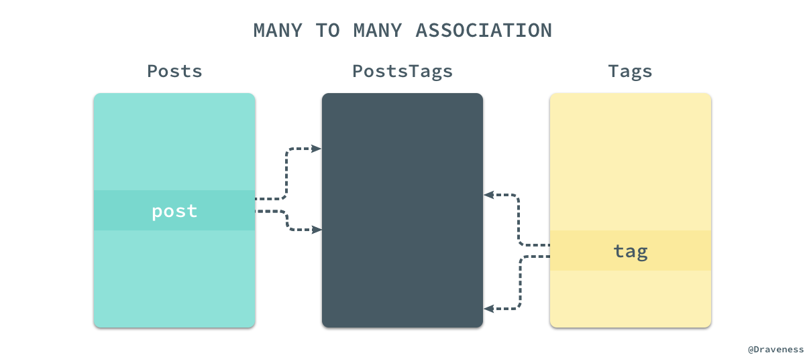

由于关系型数据库其实并没有物理上的多对多关系，只有在逻辑上才能实现多对多，所以对于每一个模型来说，它实现的都是一对多关系；只有从整体来看，通过 `PostsTags` 第三张表的引入，我们实现的才是从 `Post` 到 `Tag` 之间的多对多关系。

### 小结

ActiveRecord 对关系的支持其实非常全面，从最常见的一对一、一对多关系，再到多对多关系，都有着非常优雅、简洁的实现，虽然这一小节中没能全面的介绍所有关系的实现，但是对整个模块中重要类和整体架构的介绍已经非常具体了；不得不感叹 ActiveRecord 对多对多关系方法 `has_and_belongs_to_many` 的实现非常整洁，我们在分析其实现时也非常顺畅。

## Migrations 任务和执行过程

Migrations（迁移）是 ActiveRecord 提供的一种用于更改数据库 Schema 的方式，它提供了可以直接操作数据库的 DSL，这样我们就不需要自己去手写所有的 SQL 来更新数据库中的表结构了。

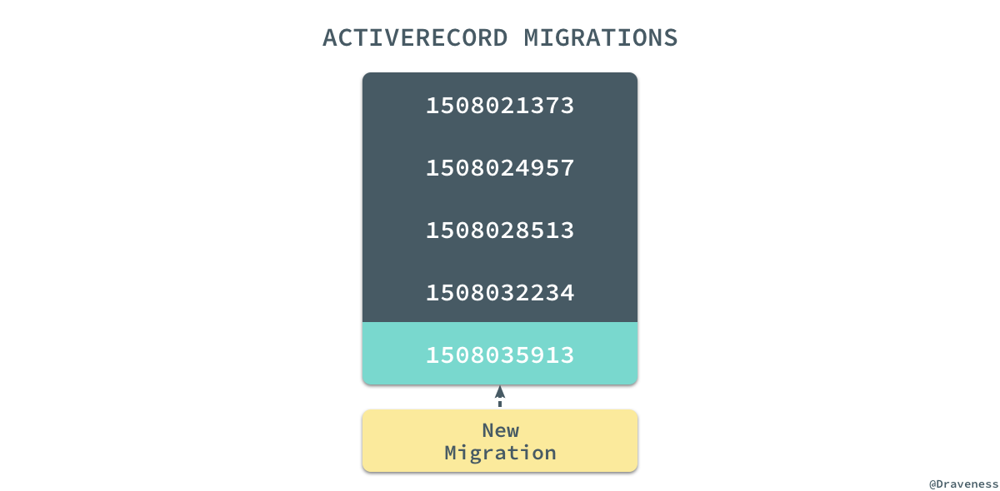

每一个 Migration 都具有一个唯一的时间戳，每次进行迁移时都会在现有的数据库中执行当前 Migration 文件的 DSL 更新数据库 Schema 得到新的数据库版本。而想要理解 Migrations 是如何工作的，就需要知道 `#create_table`、`#add_column` 等 DSL 是怎么实现的。

### Migration[5.1]

我在使用 ActiveRecord 提供的数据库迁移的时候一直都特别好奇 `Migration[5.1]` 后面跟着的这个 `[5.1]` 是个什么工作原理，看了源代码之后我才知道：

```ruby
class Migration
  def self.[](version)
    Compatibility.find(version)
  end
end
```

`.[]` 是 `ActiveRecord::Migration` 的类方法，它通过执行 `Compatibility.find` 来判断当前的代码中使用的数据库迁移版本是否与 gem 中的版本兼容：

```ruby
class Current < Migration
end
```

`compatibility.rb` 在兼容性方面做了很多事情，保证 ActiveRecord 中的迁移都是可以向前兼容的，在这里也就不准备介绍太多了。

### 从 rake db:migrate 开始

作者在阅读迁移部分的源代码时最开始以 `Migration` 类作为入口，结果发现这并不是一个好的选择，最终也没能找到定义 DSL 的位置，所以重新选择了 `rake db:migrate` 作为入口分析迁移的实现；通过对工程目录的分析，很快就能发现 ActiveRecord 中所有的 rake 命令都位于 `lib/railties/database.rake` 文件中，在文件中也能找到 `db:migrate` 对应的 rake 任务：

```ruby
db_namespace = namespace :db do
  desc "Migrate the database (options: VERSION=x, VERBOSE=false, SCOPE=blog)."
  task migrate: [:environment, :load_config] do
    ActiveRecord::Tasks::DatabaseTasks.migrate
    db_namespace["_dump"].invoke
  end
end
```

上述代码中的 `DatabaseTasks` 类就包含在 `lib/active_record/tasks` 目录中的 `database_tasks.rb` 文件里：

```ruby
lib/active_record/tasks/
├── database_tasks.rb
├── mysql_database_tasks.rb
├── postgresql_database_tasks.rb
└── sqlite_database_tasks.rb
```

`#migrate` 方法就是 `DatabaseTasks` 的一个实例方法，同时 ActiveRecord 通过 `extend self` 将 `#migrate` 方法添加到了当前类的单类上，成为了当前类的类方法：

```ruby
module Tasks
  module DatabaseTasks
    extend self
    
    def migrate
      raise "Empty VERSION provided" if ENV["VERSION"] && ENV["VERSION"].empty?

      version = ENV["VERSION"] ? ENV["VERSION"].to_i : nil
      scope = ENV["SCOPE"]
      Migrator.migrate(migrations_paths, version) do |migration|
        scope.blank? || scope == migration.scope
      end
      ActiveRecord::Base.clear_cache!
    end
  end
end
```

#### 『迁移器』Migrator

迁移任务中主要使用了 `Migrator.migrate` 方法，通过传入迁移文件的路径和期望的迁移版本对数据库进行迁移：

```ruby
class Migrator#:nodoc:
  class << self
    def migrate(migrations_paths, target_version = nil, &block)
      case
      when target_version.nil?
        up(migrations_paths, target_version, &block)
      when current_version == 0 && target_version == 0
        []
      when current_version > target_version
        down(migrations_paths, target_version, &block)
      else
        up(migrations_paths, target_version, &block)
      end
    end
  end
end
```

在默认情况下，显然我们是不会传入目标的数据库版本的，也就是 `target_version.nil? == true`，这时会执行 `.up` 方法，对数据库向『上』迁移：

```ruby
def up(migrations_paths, target_version = nil)
  migrations = migrations(migrations_paths)
  migrations.select! { |m| yield m } if block_given?

  new(:up, migrations, target_version).migrate
end
```

#### 方法调用栈

通过 `.new` 方法 ActiveRecord 初始化了一个新的 `Migrator` 实例，然后执行了 `Migrator#migrate`，在整个迁移执行的过程中，我们有以下的方法调用栈：

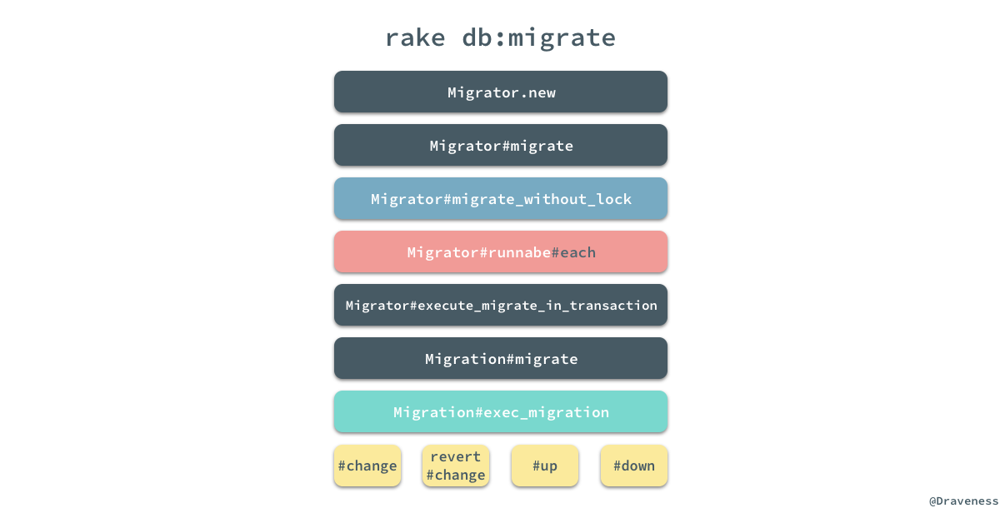

在整个迁移过程的调用栈中，我们会关注以下的四个部分，首先是 `Migrator#migrate_without_lock` 方法：

```ruby
def migrate_without_lock
  if invalid_target?
    raise UnknownMigrationVersionError.new(@target_version)
  end

  result = runnable.each do |migration|
    execute_migration_in_transaction(migration, @direction)
  end

  record_environment
  result
end
```

这个方法其实并没有那么重要，但是这里调用了 `Migrator#runnable` 方法，这个无参的方法返回了所有需要运行的 `Migration` 文件，`Migrator#runnable` 是如何选择需要迁移的文件是作者比较想要了解的，也是作者认为比较重要的地方：

```ruby
def runnable
  runnable = migrations[start..finish]
  if up?
    runnable.reject { |m| ran?(m) }
  else
    runnable.pop if target
    runnable.find_all { |m| ran?(m) }
  end
end

def ran?(migration)
  migrated.include?(migration.version.to_i)
end
```

通过对这个方法的阅读的分析，我们可以看到，如果迁移模式是 `:up`，那么就会选择所有未迁移的文件，也就是说在这时**迁移文件的选择与创建的顺序是无关的**。

#### 迁移的执行

当我们通过 `#runnable` 获得了整个待运行的迁移文件数组之后，就可以遍历所有的文件一次执行 `Migrator#execute_migrate_in_transaction` 方法了，在调用栈的最后会执行 `Migration#exec_migration`：

```ruby
def exec_migration(conn, direction)
  @connection = conn
  if respond_to?(:change)
    if direction == :down
      revert { change }
    else
      change
    end
  else
    send(direction)
  end
ensure
  @connection = nil
end
```

到这里就能与我们平时在 `Migration` 中实现的 `#change`、`#up` 和 `#down` 连到一起，逻辑也走通了；上述代码的逻辑还是很清晰的，如果当前的 `Migratoin` 实现了 `#change` 方法就会根据 `direction` 选择执行 `#change` 还是 `#revert + #change`，否则就会按照迁移的方向执行对应的方法。

### Migrations 的 DSL

在数据迁移的模块执行的 Migration 文件中包含的都是 ActiveRecord 提供的 DSL 语法，这部分语法包含两部分，一部分是 Schema 相关的 DSL `schema_statements.rb`，其中包括表格的创建和删除以及一些用于辅助 Schema 创建的 `#column_exists?` 等方法，另一部分是表定义相关的 DSL `schema_definitions.rb`，其中包括处理表结构的 `TableDefinition` 类和抽象代表一张数据库中表的 `Table` 类。

#### 抽象适配器

在整个 `connection_adapters` 的子模块中，绝大多数模块在三大 SQL 数据库，MySQL、PostgreSQL 和 sqlite3 中都有着各自的实现：

```ruby
lib/active_record/connection_adapters
├── abstract
│   ├── connection_pool.rb
│   ├── database_limits.rb
│   ├── database_statements.rb
│   ├── query_cache.rb
│   ├── quoting.rb
│   ├── savepoints.rb
│   ├── schema_creation.rb
│   ├── schema_definitions.rb
│   ├── schema_dumper.rb
│   ├── schema_statements.rb
│   └── transaction.rb
├── mysql
│   ├── column.rb
│   ├── database_statements.rb
│   ├── explain_pretty_printer.rb
│   ├── quoting.rb
│   ├── schema_creation.rb
│   ├── schema_definitions.rb
│   ├── schema_dumper.rb
│   ├── schema_statements.rb
│   └── type_metadata.rb
├── postgresql
│   └── ...
├── sqlite3
│   └── ...
├── abstract_adapter.rb
├── ...
└── sqlite3_adapter.rb
```

不过这三个数据库的所有子模块都继承自 `AbstractAdapter` 下面对应的子模块，以获得一些三者共用的能力，包括数据库、Schema 的声明与管理等功能。

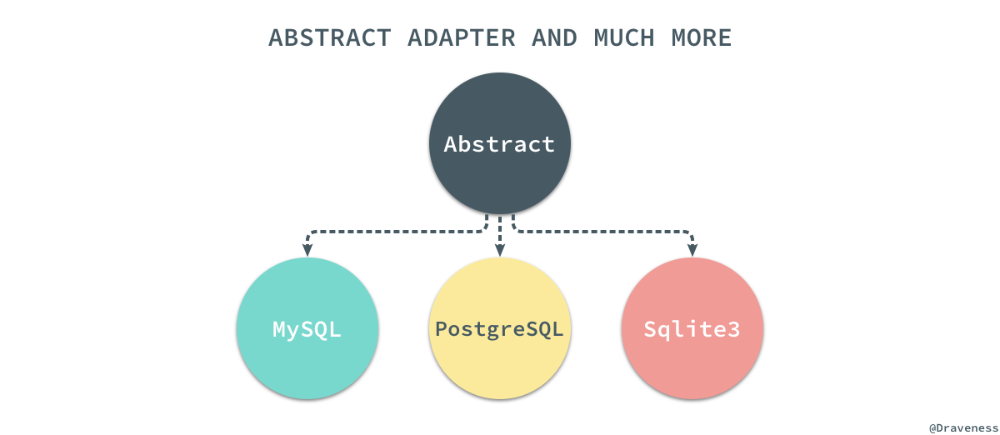

通过 `AbstractAdapter` 抽离出的公用功能，我们可以通过新的适配器随时适配其他的 SQL 数据库。

#### Schema DSL

数据库的 Schema DSL 部分就包含我们经常使用的 `#create_table`、`#rename_table` 以及 `#add_column` 这些需要表名才能执行的方法，在这里以最常见的 `#create_table` 为例，简单分析一下这部分代码的实现：

```ruby
def create_table(table_name, comment: nil, **options)
  td = create_table_definition table_name, options[:temporary], options[:options], options[:as], comment: comment

  yield td if block_given?

  execute schema_creation.accept td
end
```

首先，在创建表时先通过 `#create_table_definition` 方法创建一个新的 `TableDefinition` 实例，然后将这个实例作为参数传入 block：

```ruby
create_table :users do |t|
end
```

在 block 对这个 `TableDefinition` 对象一顿操作后，会通过 `SchemaCreation#accept` 方法获得一个用于在数据库中，能够创建表的 SQL 语句：

```ruby
def accept(o)
  m = @cache[o.class] ||= "visit_#{o.class.name.split('::').last}"
  send m, o
end

def visit_TableDefinition(o)
  create_sql = "CREATE#{' TEMPORARY' if o.temporary} TABLE #{quote_table_name(o.name)} "

  statements = o.columns.map { |c| accept c }
  statements << accept(o.primary_keys) if o.primary_keys

  create_sql << "(#{statements.join(', ')})" if statements.present?
  add_table_options!(create_sql, table_options(o))
  create_sql << " AS #{@conn.to_sql(o.as)}" if o.as
  create_sql
end
```

`SchemaCreation` 类就是一个接受各种各样的 `TableDefinition`、`PrimaryKeyDefinition` 对象返回 SQL 的一个工具，可以将 `SchemaCreation` 理解为一个表结构的解释器；最后的 `#execute` 会在数据库中执行 SQL 改变数据库中的表结构。

在 `SchemaStatements` 中定义的其它方法的实现也都是大同小异，比如 `#drop_table` 其实都是删除数据库中的某张表：

```ruby
def drop_table(table_name, options = {})
  execute "DROP TABLE#{' IF EXISTS' if options[:if_exists]} #{quote_table_name(table_name)}"
end
```

#### 表定义 DSL

`SchemaStatements` 中定义的方法，参数大都包含 `table_name`，而另一个类 `TableDefinitions` 就包含了直接对表操作的 DSL：

```ruby
create_table :foo do |t|
  puts t.class  # => "ActiveRecord::ConnectionAdapters::TableDefinition"
end
```

当我们在 `#create_table` 中使用例如 `#string`、`#integer` 等方法时，所有的方法都会通过元编程的魔法最终执行 `TableDefinition#column` 改变表的定义：

```ruby
module ColumnMethods
  [
    :bigint,
    # ...
    :integer,
    :string,
    :text,
    :time,
    :timestamp,
    :virtual,
  ].each do |column_type|
    module_eval <<-CODE, __FILE__, __LINE__ + 1
      def #{column_type}(*args, **options)
        args.each { |name| column(name, :#{column_type}, options) }
      end
    CODE
  end
  alias_method :numeric, :decimal
end
```

`#column` 方法非常神奇，它从各处收集有关当前表的定义，最终为表中的每一个字段创建一个 `ColumnDefinition` 实例，并存储到自己持有的 `@columns_hash` 中：

```ruby
def column(name, type, options = {})
  name = name.to_s
  type = type.to_sym if type
  options = options.dup

  index_options = options.delete(:index)
  index(name, index_options.is_a?(Hash) ? index_options : {}) if index_options
  @columns_hash[name] = new_column_definition(name, type, options)
  self
end

def new_column_definition(name, type, **options)
  type = aliased_types(type.to_s, type)
  options[:primary_key] ||= type == :primary_key
  options[:null] = false if options[:primary_key]
  create_column_definition(name, type, options)
end

def create_column_definition(name, type, options)
  ColumnDefinition.new(name, type, options)
end
```

除了 `ColumnDefinition` 之外，在 ActiveRecord 中还存在 `PrimaryKeyDefinition`、`IndexDefinition` 等等类和结构体用于表示数据库中的某一种元素。

表结构在最后会被 `SchemaCreation` 类的 `#accept` 方法展开，最后在数据库中执行。

### 小结

到这里整个 Migrations 部分的实现就已经阅读分析完了，整个『模块』包含两个部分，一部分是 rake 任务执行 DSL 代码的过程，另一部分是 DSL 的实现，两部分的结合最终构成了整个 Migrations 模块的全部内容。

ActiveRecord 对于 Migration 迁移机制的设计确实很好的解决数据库中的表结构不断变更的问题，同时因为所有的 Migration 文件都在版本控制中管理，我们也能够随时还原数据库中的表结构。

## 总结

文章对 ActiveRecord 中涉及的很多问题都进行了分析和介绍，包括模型的创建、查询以及关系，还包括数据库表迁移的实现，本来想将文中的几个部分分开进行介绍，但是写着写着就懒得分开了，如果对文章的内容有疑问，请在博客下面的 Disqus 评论系统中留言，需要翻墙。

> 原文链接：[理解 ActiveRecord](https://draveness.me/activerecord.html)
> 
> Follow: [Draveness · GitHub](https://github.com/Draveness)


