# RAC 中的双向数据绑定 RACChannel

之前讲过了 ReactiveCocoa 中的一对一的单向数据流 `RACSignal` 和一对多的单向数据流 `RACMulticastConnection`，这一篇文章分析的是一对一的双向数据流 `RACChannel`。

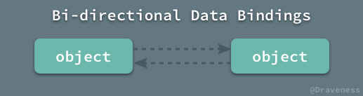

`RACChannel` 其实是一个相对比较复杂的类，但是，对其有一定了解之后合理运用的话，会在合适的业务中提供非常强大的支持能够极大的简化业务代码。

## RACChannel 简介

`RACChannel` 可以被理解为一个双向的连接，这个连接的两端都是 `RACSignal` 实例，它们可以向彼此发送消息，如果我们在视图和模型之间通过 `RACChannel` 建立这样的连接：

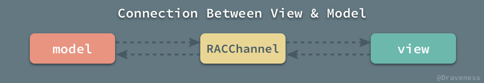

那么从模型发出的消息，最后会发送到视图上；反之，用户对视图进行的操作最后也会体现在模型上。这种通信方式的实现是基于信号的，`RACChannel` 内部封装了两个 `RACChannelTerminal` 对象，它们都是 `RACSignal` 的子类：


对模型进行的操作最后都会发送给 `leadingTerminal` 再通过内部的实现发送给 `followingTerminal`，由于视图是 `followingTerminal` 的订阅者，所以消息最终会发送到视图上。

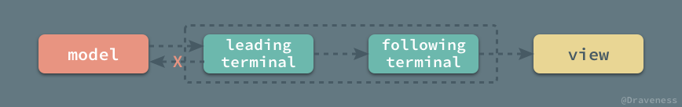

在上述情况下，`leadingTerminal` 的订阅者（模型）并不会收到消息，它的订阅者（视图）只会在 `followingTerminal` 收到消息时才会接受到新的值。

同时，`RACChannel` 的绑定都是双向的，视图收到用户的动作，例如点击等事件时，会将消息发送给 `followingTerminal`，而 `followingTerminal` 并**不会**将消息发送给自己的订阅者（视图），而是会发送给 `leadingTerminal`，并通过 `leadingTerminal` 发送给其订阅者，即模型。

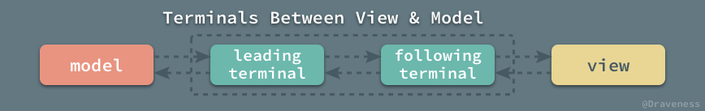

上图描述了信息在 `RACChannel` 之间的传递过程，无论是模型属性的改变还是用户对视图进行的操作都会通过这两个 `RACChannelTerminal` 传递到另一端；同时，由于消息不会发送给自己的订阅者，所以不会造成信息的循环发送。

## RACChannel 和 RACChannelTerminal

`RACChannel` 和 `RACChannelTerminal` 的关系非常密切，前者可以理解为一个网络连接，后者可以理解为 `socket`，表示网络连接的一端，下图描述了 `RACChannel` 与网络连接中概念的一一对应关系。

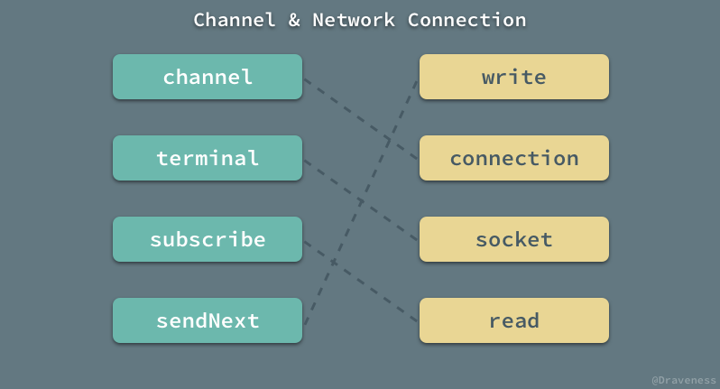

+ 在客户端使用 `write` 向 `socket` 中发送消息时，`socket` 的持有者客户端不会收到消息，只有在 `socket` 上调用 `read` 的服务端才会收到消息；反之亦然。
+ 在模型使用 `sendNext` 向`leadingTerminal` 中发送消息时，`leadingTerminal` 的订阅者模型不会收到消息，只有在 `followingTerminal` 上调用 `subscribe` 的视图才会收到消息；反之亦然。

### RACChannelTerminal 的实现

为什么向 `RACChannelTerminal` 发送消息，它的订阅者获取不到？先来看一下它在头文件中的定义：

```objectivec
@interface RACChannelTerminal : RACSignal <RACSubscriber>
@end
```

`RACChannelTerminal` 是一个信号的子类，同时它还遵循了 `RACSubscriber` 协议，也就是可以向它调用 `-sendNext:` 等方法；`RAChannelTerminal` 中持有了两个对象：

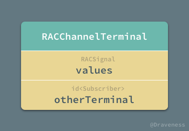

在初始化时，需要传入 `values` 和 `otherTerminal` 这两个属性，其中 `values` 表示当前断点，`otherTerminal` 表示远程端点：

```objectivec
- (instancetype)initWithValues:(RACSignal *)values otherTerminal:(id<RACSubscriber>)otherTerminal {
	self = [super init];
	_values = values;
	_otherTerminal = otherTerminal;
	return self;
}
```

当然，作为 `RACSignal` 的子类，`RACChannelTerminal` 必须覆写 `-subscribe:` 方法：

```objectivec
- (RACDisposable *)subscribe:(id<RACSubscriber>)subscriber {
	return [self.values subscribe:subscriber];
}
```

在订阅者调用 `-subscribeNext:` 等方法发起订阅时，实际上订阅的是当前端点；如果向当前端点发送消息，会被转发到远程端点上，而这也就是当前端点的订阅者不会接收到向当前端点发送消息的原因：

```objectivec
- (void)sendNext:(id)value {
	[self.otherTerminal sendNext:value];
}
- (void)sendError:(NSError *)error {
	[self.otherTerminal sendError:error];
}
- (void)sendCompleted {
	[self.otherTerminal sendCompleted];
}
```

### RACChannel 的初始化

我们在任何情况下都不应该直接使用 `-init` 方法初始化 `RACChannelTerminal` 的实例，而是应该以创建 `RACChannel` 的方式生成它：

```objectivec
- (instancetype)init {
	self = [super init];

	RACReplaySubject *leadingSubject = [RACReplaySubject replaySubjectWithCapacity:0];
	RACReplaySubject *followingSubject = [RACReplaySubject replaySubjectWithCapacity:1];

	[[leadingSubject ignoreValues] subscribe:followingSubject];
	[[followingSubject ignoreValues] subscribe:leadingSubject];

	_leadingTerminal = [[RACChannelTerminal alloc] initWithValues:leadingSubject otherTerminal:followingSubject];
	_followingTerminal = [[RACChannelTerminal alloc] initWithValues:followingSubject otherTerminal:leadingSubject];

	return self;
}
```

两个 `RACChannelTerminal` 中包装的其实是两个 `RACSubject` 热信号，它们既可以作为订阅者，也可以接收其他对象发送的消息；我们并不希望 `leadingSubject` 有任何的初始值，但是我们需要 `error` 和 `completed` 信息可以被重播。

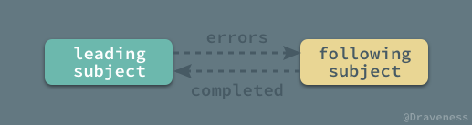

通过 `-ignoreValues` 和 `-subscribe:` 方法，`leadingSubject` 和 `followingSubject` 两个热信号中产生的错误会互相发送，这是为了防止连接的两端一边发生了错误，另一边还继续工作的情况的出现。

在初始化方法的最后，生成两个 `RACChannelTerminal` 实例的过程就不多说了。

## RACChannel 与 UIKit 组件

如果在整个 ReactiveCocoa 工程中搜索 `RACChannel`，你会发现以下的 UIKit 组件都与 `RACChannel` 有着非常密切的关系：

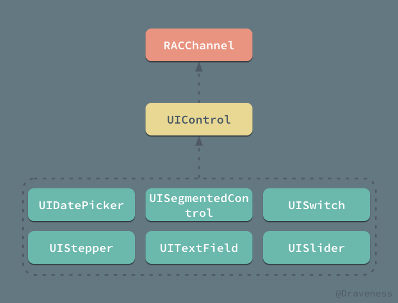

UIKit 中的这些组件都提供了使用 `RACChannel` 的接口，用以降低数据双向绑定的复杂度，我们以 `UITextField` 为例，它在分类的接口中提供了 `rac_newTextChannel` 方法：

```objectivec
- (RACChannelTerminal *)rac_newTextChannel {
	return [self rac_channelForControlEvents:UIControlEventAllEditingEvents key:@keypath(self.text) nilValue:@""];
}
```

上述方法用于返回一个一端绑定 `UIControlEventAllEditingEvents` 事件的 `RACChannelTerminal` 对象。

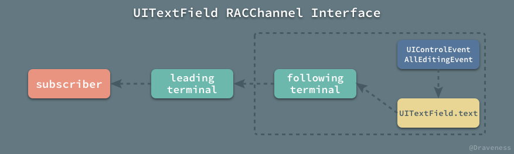

`UIControlEventAllEditingEvents` 事件发生时，它会将自己的 `text` 属性作为信号发送到 `followingTerminal -> leadingTerminal` 管道中，最后发送给 `leadingTerminal` 的订阅者。

在 `rac_newTextChannel` 中调用的方法 `-rac_channelForControlEvents:key:nilValue:` 是一个 `UIControl` 的私有方法：

```objectivec
- (RACChannelTerminal *)rac_channelForControlEvents:(UIControlEvents)controlEvents key:(NSString *)key nilValue:(id)nilValue {
	key = [key copy];
	RACChannel *channel = [[RACChannel alloc] init];

	RACSignal *eventSignal = [[[self
		rac_signalForControlEvents:controlEvents]
		mapReplace:key]
		takeUntil:[[channel.followingTerminal
			ignoreValues]
			catchTo:RACSignal.empty]];
	[[self
		rac_liftSelector:@selector(valueForKey:) withSignals:eventSignal, nil]
		subscribe:channel.followingTerminal];

	RACSignal *valuesSignal = [channel.followingTerminal
		map:^(id value) {
			return value ?: nilValue;
		}];
	[self rac_liftSelector:@selector(setValue:forKey:) withSignals:valuesSignal, [RACSignal return:key], nil];

	return channel.leadingTerminal;
}
```

这个方法为所有的 `UIControl` 子类，包括 `UITextField`、`UISegmentedControl` 等等，它的主要作用就是当传入的 `controlEvents` 事件发生时，将 UIKit 组件的属性 `key` 发送到返回的 `RACChannelTerminal` 实例中；同时，在向返回的 `RACChannelTerminal` 实例中发送消息时，也会自动更新 UIKit 组件的属性。

上面的代码在初始化 `RACChannel` 之后做了两件事情，首先是在 `UIControlEventAllEditingEvents` 事件发生时，将 `text` 属性发送到 `followingTerminal` 中：

```objectivec
RACSignal *eventSignal = [[[self
    rac_signalForControlEvents:controlEvents]
    mapReplace:key]
    takeUntil:[[channel.followingTerminal
        ignoreValues]
        catchTo:RACSignal.empty]];
[[self
    rac_liftSelector:@selector(valueForKey:) withSignals:eventSignal, nil]
    subscribe:channel.followingTerminal];
```

第二个是在 `followingTerminal` 接收到来自 `leadingTerminal` 的消息时，更新 `UITextField` 的 `text` 属性。

```objectivec
RACSignal *valuesSignal = [channel.followingTerminal
    map:^(id value) {
        return value ?: nilValue;
    }];
[self rac_liftSelector:@selector(setValue:forKey:) withSignals:valuesSignal, [RACSignal return:key], nil];
```

这两件事情都是通过 `-rac_liftSelector:withSignals:` 方法来完成的，不过，我们不会在这篇文章中介绍这个方法。

## RACChannel 与 KVO

`RACChannel` 不仅为 UIKit 组件提供了接口，还为键值观测提供了 `RACKVOChannel` 来高效地完成双向绑定；`RACKVOChannel` 是 `RACChannel` 的子类：

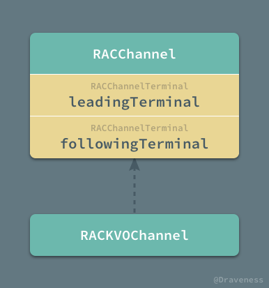

在 `RACKVOChannel` 提供的接口中，我们一般都会使用 `RACChannelTo` 来观测某一个对象的对应属性，三个参数依次为对象、属性和默认值：

```objectivec
RACChannelTerminal *integerChannel = RACChannelTo(self, integerProperty, @42);
```

而 `RACChannelTo` 是 `RACKVOChannel` 头文件中的一个宏，上面的表达式可以展开成为：

```objectivec
RACChannelTerminal *integerChannel = [[RACKVOChannel alloc] initWithTarget:self keyPath:@"integerProperty" nilValue:@42][@"followingTerminal"];
```

该宏初始化了一个 `RACKVOChannel` 对象，并通过方括号的方式获取其中的 `followingTerminal`，这种获取类属性的方式是通过覆写以下的两个方法实现的：

```objectivec
- (RACChannelTerminal *)objectForKeyedSubscript:(NSString *)key {
	RACChannelTerminal *terminal = [self valueForKey:key];
	return terminal;
}

- (void)setObject:(RACChannelTerminal *)otherTerminal forKeyedSubscript:(NSString *)key {
	RACChannelTerminal *selfTerminal = [self objectForKeyedSubscript:key];
	[otherTerminal subscribe:selfTerminal];
	[[selfTerminal skip:1] subscribe:otherTerminal];
}
```

又由于覆写了这两个方法，在 `-setObject:forKeyedSubscript:` 时会自动调用 `-subscribe:` 方法完成双向绑定，所以我们可以使用 `=` 来对两个 `RACKVOChannel` 进行双向绑定：

```objectivec
RACChannelTo(view, property) = RACChannelTo(model, property);

[[RACKVOChannel alloc] initWithTarget:view keyPath:@"property" nilValue:nil][@"followingTerminal"] = [[RACKVOChannel alloc] initWithTarget:model keyPath:@"property" nilValue:nil][@"followingTerminal"];
```

以上的两种方式是完全等价的，它们都会在对方的属性更新时更新自己的属性。

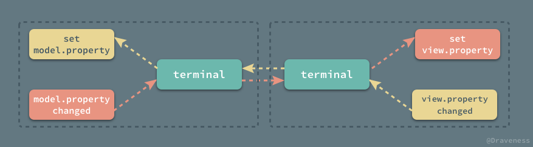

实现的方式其实与 `RACChannel` 差不多，这里不会深入到代码中进行介绍，与 `RACChannel` 的区别是，`RACKVOChannel` 并没有暴露出 `leadingTerminal` 而是 `followingTerminal`：

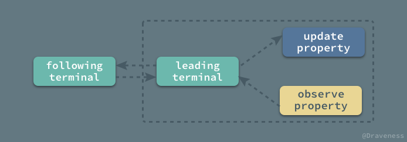

## RACChannel 实战

这一小节通过一个简单的例子来解释如何使用 `RACChannel` 进行双向数据绑定。


在整个视图上有两个 `UITextField`，我们想让这两个 `UITextField` `text` 的值相互绑定，在一个 `UITextField` 编辑时也改变另一个 `UITextField` 中的内容：

```objectivec
@property (weak, nonatomic) IBOutlet UITextField *textField;
@property (weak, nonatomic) IBOutlet UITextField *anotherTextField;
```

实现的过程非常简单，分别获取两个 `UITextField` 的 `rac_newTextChannel` 属性，并让它们订阅彼此的内容：

```objectivec
[self.textField.rac_newTextChannel subscribe:self.anotherTextField.rac_newTextChannel];
[self.anotherTextField.rac_newTextChannel subscribe:self.textField.rac_newTextChannel];
```

这样在使用两个文本输入框时就能达到预期的效果了，这是一个非常简单的例子，可以得到如下的结构图。

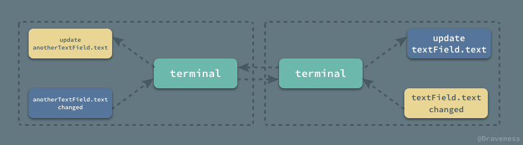

两个 `UITextField` 通过 `RACChannel` 互相影响，在对方属性更新时同时更新自己的属性。

## 总结

`RACChannel` 非常适合于视图和模型之间的双向绑定，在对方的属性或者状态更新时及时通知自己，达到预期的效果；我们可以使用 ReactiveCocoa 中内置的很多与 `RACChannel` 有关的方法，来获取开箱即用的 `RACChannelTerminal`，当然也可以使用 `RACChannelTo` 通过 `RACKVOChannel` 来快速绑定类与类的属性。

## References

+ [Bi-directional Data Bindings in ReactiveCocoa with RACChannel](https://spin.atomicobject.com/2015/05/04/bi-directional-data-bindings-reactivecocoa/)
+ [ReactiveCocoa 核心元素与信号流](http://tech.meituan.com/ReactiveCocoaSignalFlow.html)

> Github Repo：[iOS-Source-Code-Analyze](https://github.com/draveness/iOS-Source-Code-Analyze)
> 
> Follow: [Draveness · GitHub](https://github.com/Draveness)
>
> Source: http://draveness.me/racchannel


