# 从代理到 RACSignal

ReactiveCocoa 将 Cocoa 中的 Target-Action、KVO、通知中心以及代理等设计模式都桥接到了 RAC 的世界中，我们在随后的几篇文章中会介绍 RAC 如何做到了上面的这些事情，而本篇文章会介绍 ReactiveCocoa 是如何把**代理**转换为信号的。

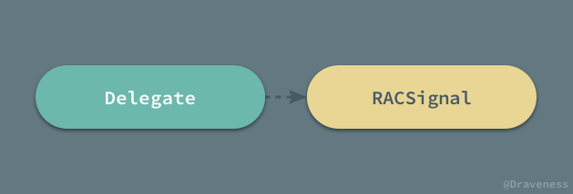

## RACDelegateProxy

从代理转换成信号所需要的核心类就是 `RACDelegateProxy`，这是一个设计的非常巧妙的类；虽然在类的头文件中，它被标记为私有类，但是我们仍然可以使用 `-initWithProtocol:` 方法直接初始化该类的实例。

```objectivec
- (instancetype)initWithProtocol:(Protocol *)protocol {
	self = [super init];
	class_addProtocol(self.class, protocol);
	_protocol = protocol;
	return self;
}
```

从初始化方法中，我们可以看出 `RACDelegateProxy` 是一个包含实例变量 `_protocol` 的类：

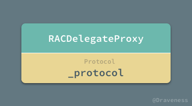

在整个 `RACDelegateProxy` 类的实现中，你都不太能看出与这个实例变量 `_protocol` 的关系；稍微对 iOS 有了解的人可能都知道，在 Cocoa 中有一个非常特别的根类 `NSProxy`，而从它的名字我们也可以推断出来，`NSProxy` 一般用于实现代理（主要是对消息进行转发），但是 ReactiveCocoa 中这个 `delegate` 的代理 `RACDelegateProxy` 并没有继承这个 `NSProxy` 根类：

```objectivec
@interface RACDelegateProxy : NSObject

@end
```

那么 `RACDelegateProxy` 是如何作为 Cocoa 中组件的代理，并为原生组件添加 `RACSignal` 的支持呢？我们以 `UITableView` 为例来展示 `RACDelegateProxy` 是如何与 UIKit 组件互动的，我们需要实现的是以下功能：

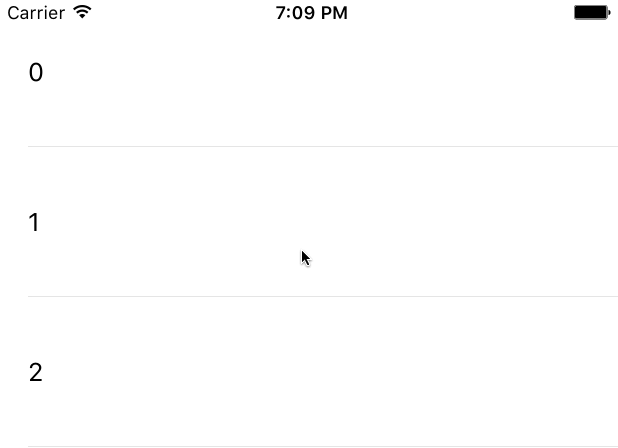

在点击所有的 `UITableViewCell` 时都会自动取消点击状态，通常情况下，我们可以直接在代理方法 `-tableView:didSelectRowAtIndexPath:` 中执行 `-deselectRowAtIndexPath:animated:` 方法：

```objectivec
- (void)tableView:(UITableView *)tableView didSelectRowAtIndexPath:(NSIndexPath *)indexPath {
    [tableView deselectRowAtIndexPath:indexPath animated:YES];
}
```

使用信号的话相比而言就比较麻烦了：

```objectivec
RACDelegateProxy *proxy = [[RACDelegateProxy alloc] initWithProtocol:@protocol(UITableViewDelegate)];
objc_setAssociatedObject(self, _cmd, proxy, OBJC_ASSOCIATION_RETAIN_NONATOMIC);
proxy.rac_proxiedDelegate = self;
[[proxy rac_signalForSelector:@selector(tableView:didSelectRowAtIndexPath:)]
 subscribeNext:^(RACTuple *value) {
     [value.first deselectRowAtIndexPath:value.second animated:YES];
 }];
self.tableView.delegate = (id<UITableViewDelegate>)proxy;
```

1. 初始化 `RACDelegateProxy` 实例，传入 `UITableViewDelegate` 协议，并将实例存入视图控制器以**确保实例不会被意外释放**造成崩溃；
2. 设置代理的 `rac_proxiedDelegate` 属性为视图控制器；
3. 使用 `-rac_signalForSelector:` 方法生成一个 `RACSignal`，在 `-tableView:didSelectRowAtIndexPath:` 方法调用时将方法的参数打包成 `RACTuple` 向信号中发送新的 `next` 消息；
4. 重新设置 `UITableView` 的代理；

在 `UITableViewDelgate` 中的代理方法执行时，实际上会被 `RACDelegateProxy` 拦截，并根据情况决定是处理还是转发：


如果 `RACDelegateProxy` 实现了该代理方法就会交给它处理，如：`-tableView:didSelectRowAtIndexPath:`；否则，当前方法就会被转发到原 `delegate` 上，在这里就是 `UIViewController` 对象。

`RACDelegateProxy` 中有两个值得特别注意的问题，一是 `RACDelegateProxy` 是如何进行消息转发的，有事如何将自己无法实现的消息交由原代理处理，第二是 `RACDelegateProxy` 如何通过方法 `-rac_signalForSelector:` 在原方法调用时以 `RACTuple` 的方式发送到 `RACSignal` 上。

## 消息转发的实现

首先，我们来看 `RACDelegateProxy` 是如何在无法响应方法时，将方法转发给原有的代理的；`RACDelegateProxy` 通过覆写几个方法来实现，最关键的就是 `-forwardInvocation:` 方法：

```objectivec
- (void)forwardInvocation:(NSInvocation *)invocation {
	[invocation invokeWithTarget:self.rac_proxiedDelegate];
}
```

当然，作为消息转发流程的一部分 `-methodSignatureForSelector:` 方法也需要在 `RACDelegateProxy` 对象中实现：

```objectivec
- (NSMethodSignature *)methodSignatureForSelector:(SEL)selector {
	struct objc_method_description methodDescription = protocol_getMethodDescription(_protocol, selector, NO, YES);
	if (methodDescription.name == NULL) {
		methodDescription = protocol_getMethodDescription(_protocol, selector, YES, YES);
		if (methodDescription.name == NULL) return [super methodSignatureForSelector:selector];
	}
	return [NSMethodSignature signatureWithObjCTypes:methodDescription.types];
}
```

我们会从协议的方法中尝试获取其中的可选方法和必须实现的方法，最终获取方法的签名 `NSMethodSignature` 对象。

整个方法决议和消息转发的过程如下图所示，在整个方法决议和消息转发的过程中 Objective-C 运行时会再次提供执行该方法的机会。

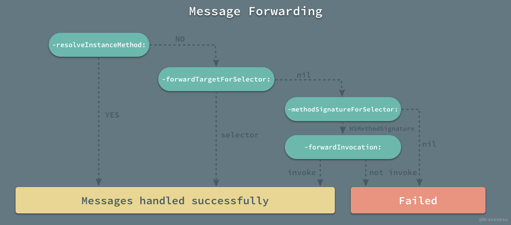

例子中的代理方法最后也被 `-forwardInvocation:` 方法成功的转发到了 `UITableView` 的原代理上。

## 从代理到信号

在 `RACDelegateProxy` 中的另一个非常神奇的方法就是将某一个代理方法转换成信号的 `-signalForSelector:`：

```objectivec
- (RACSignal *)signalForSelector:(SEL)selector {
	return [self rac_signalForSelector:selector fromProtocol:_protocol];
}

- (RACSignal *)rac_signalForSelector:(SEL)selector fromProtocol:(Protocol *)protocol {
	return NSObjectRACSignalForSelector(self, selector, protocol);
}
```

该方法会在传入的协议方法被调用时，将协议方法中的所有参数以 `RACTuple` 的形式发送到返回的信号上，使用者可以通过订阅这个信号来获取所有的参数；而方法 `NSObjectRACSignalForSelector` 的实现还是比较复杂的。

```objectivec
static RACSignal *NSObjectRACSignalForSelector(NSObject *self, SEL selector, Protocol *protocol) {
	SEL aliasSelector = RACAliasForSelector(selector);

    RACSubject *subject = objc_getAssociatedObject(self, aliasSelector);
    if (subject != nil) return subject;

    Class class = RACSwizzleClass(self);
    subject = [RACSubject subject];
    objc_setAssociatedObject(self, aliasSelector, subject, OBJC_ASSOCIATION_RETAIN);

    Method targetMethod = class_getInstanceMethod(class, selector);
    if (targetMethod == NULL) {
        const char *typeEncoding;
        if (protocol == NULL) {
            typeEncoding = RACSignatureForUndefinedSelector(selector);
        } else {
            struct objc_method_description methodDescription = protocol_getMethodDescription(protocol, selector, NO, YES);
            if (methodDescription.name == NULL) {
                methodDescription = protocol_getMethodDescription(protocol, selector, YES, YES);
            }
            typeEncoding = methodDescription.types;
        }
        class_addMethod(class, selector, _objc_msgForward, typeEncoding);
    } else if (method_getImplementation(targetMethod) != _objc_msgForward) {
        const char *typeEncoding = method_getTypeEncoding(targetMethod);

        class_addMethod(class, aliasSelector, method_getImplementation(targetMethod), typeEncoding);
        class_replaceMethod(class, selector, _objc_msgForward, method_getTypeEncoding(targetMethod));
    }
    return subject;
}
```

这个 C 函数总共做了两件非常重要的事情，第一个是将传入的选择子对应的实现变为 `_objc_msgForward`，也就是在调用该方法时，会直接进入消息转发流程，第二是用 `RACSwizzleClass` 调剂当前类的一些方法。

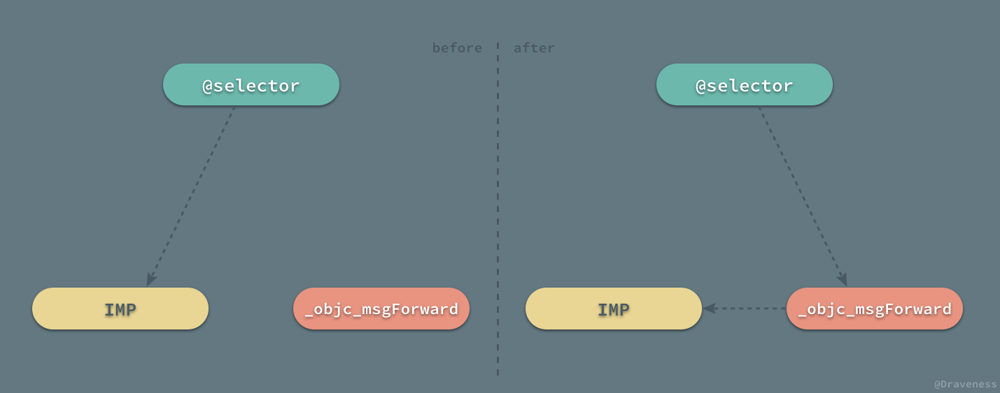

### 从 selector 到 _objc_msgForward

我们具体看一下这部分代码是如何实现的，在修改选择子对应的实现之前，我们会先做一些准备工作：

```objectivec
SEL aliasSelector = RACAliasForSelector(selector);

RACSubject *subject = objc_getAssociatedObject(self, aliasSelector);
if (subject != nil) return subject;

Class class = RACSwizzleClass(self);

subject = [RACSubject subject];
objc_setAssociatedObject(self, aliasSelector, subject, OBJC_ASSOCIATION_RETAIN);

Method targetMethod = class_getInstanceMethod(class, selector);
```

1. 获取选择子的别名，在这里我们通过为选择子加前缀 `rac_alias_` 来实现；
2. 尝试以 `rac_alias_selector` 为键获取一个热信号 `RACSubject`；
3. 使用 `RACSwizzleClass` 调剂当前类的一些方法（我们会在下一节中介绍）；
4. 从当前类中获取目标方法的结构体 `targetMethod`；

在进行了以上的准备工作之后，我们就开始修改选择子对应的实现了，整个的修改过程会分为三种情况：

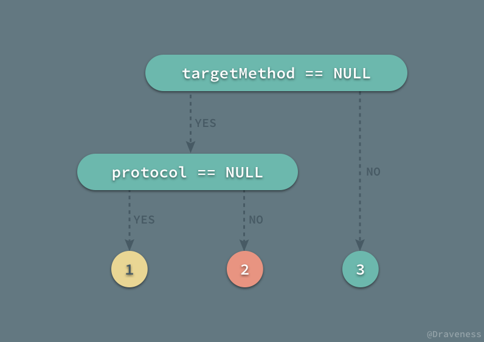

下面会按照这三种情况依次介绍在不同情况下，如何将对应选择子的实现改为 `_objc_msgForward` 完成消息转发的。

#### targetMethod == NULL && protocol == NULL

在找不到选择子对应的方法并且没有传入协议时，这时执行的代码最为简单：

```objectivec
typeEncoding = RACSignatureForUndefinedSelector(selector);
class_addMethod(class, selector, _objc_msgForward, typeEncoding);
```

我们会通过 `RACSignatureForUndefinedSelector` 生成一个当前方法默认的类型编码。

> 对类型编码不了解的可以阅读苹果的官方文档 [Type Encodings · Apple Developer](https://developer.apple.com/library/content/documentation/Cocoa/Conceptual/ObjCRuntimeGuide/Articles/ocrtTypeEncodings.html)，其中详细解释了类型编码是什么，它在整个 Objective-C 运行时有什么作用。

```objectivec
static const char *RACSignatureForUndefinedSelector(SEL selector) {
	const char *name = sel_getName(selector);
	NSMutableString *signature = [NSMutableString stringWithString:@"v@:"];

	while ((name = strchr(name, ':')) != NULL) {
		[signature appendString:@"@"];
		name++;
	}

	return signature.UTF8String;
}
```

该方法在生成类型编码时，会按照 `:` 的个数来为 `v@:` 这个类型编码添加 `@` 字符；简单说明一下它的意思，ReactiveCocoa 默认所有的方法的返回值类型都为空 `void`，都会传入 `self` 以及当前方法的选择子 `SEL`，它们的类型编码可以在下图中找到，分别是 `v@:`；而 `@` 代表 `id` 类型，也就是我们默认代理方法中的所有参数都是 `NSObject` 类型的。

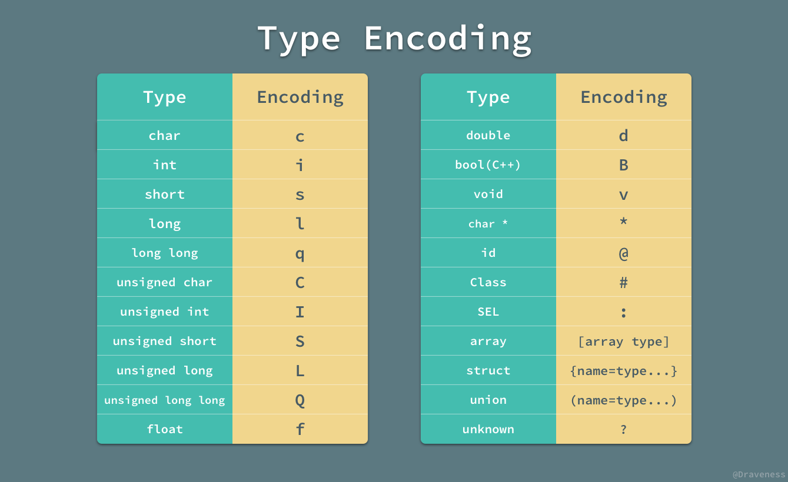

生成了类型编码之后，由于我们并没有在当前类中找到该选择子对应的方法，所以会使用 `class_addMethod` 为当前类提供一个方法的实现，直接将当前选择子的实现改为 `_objc_msgForward`。

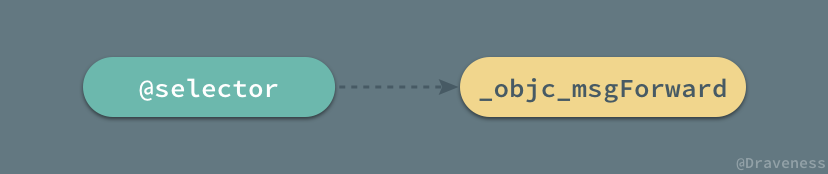

#### targetMethod == NULL && protocol != NULL

当类中不存在当前选择子对应的方法 `targetMethod`，但是向当前函数中传入了协议时，我们会尝试从协议中获取方法描述：

```objectivec
struct objc_method_description methodDescription = protocol_getMethodDescription(protocol, selector, NO, YES);

if (methodDescription.name == NULL) {
    methodDescription = protocol_getMethodDescription(protocol, selector, YES, YES);
}
typeEncoding = methodDescription.types;
class_addMethod(class, selector, _objc_msgForward, typeEncoding);
```

这里会使用 `protocol_getMethodDescription` 两次从协议中获取可选和必须实现的方法的描述，并从结构体中拿出类型编码，最后为类添加这个之前不存在的方法：


在这种情况下，其最后的结果与上一种的完全相同，因为它们都是对不存在该方法，只需要获得方法的类型编码并将实现添加为 `_objc_msgForward`，交给消息转发流程进行处理即可。

#### targetMethod != NULL

在目标方法的实现不为空并且它的实现并不是 `_objc_msgForward` 时，我们就会进入以下流程修改原有方法的实现：

```objectivec
const char *typeEncoding = method_getTypeEncoding(targetMethod);

class_addMethod(class, aliasSelector, method_getImplementation(targetMethod), typeEncoding);
class_replaceMethod(class, selector, _objc_msgForward, method_getTypeEncoding(targetMethod));
```

同样，我们需要获得目标方法的方法签名、添加 `aliasSelector` 这个新方法，最后在修改原方法的实现到 `_objc_msgForward`。

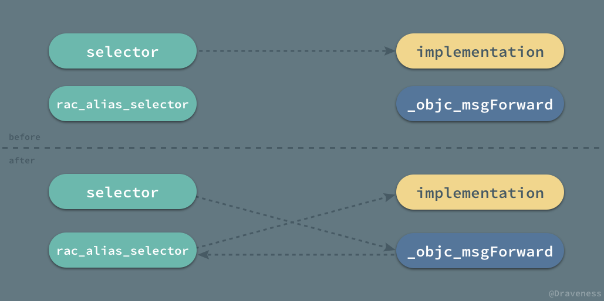

上图展示了在目标方法不为空并且其实现不为 `_objc_msgForward` 时，`NSObjectRACSignalForSelector` 是如何修改原方法实现的。

### 调剂类的方法

`NSObjectRACSignalForSelector` 在修改原选择子方法实现的之前就已经修改了当前类很多方法的实现：

+ `-methodSignatureForSelector:`
+ `-class`
+ `-respondsToSelector`
+ `-forwardInvocation:`

整个调剂方法的过程 `RACSwizzleClass` 还是比较复杂的，我们可以分三部分看下面的代码：

```objectivec
static Class RACSwizzleClass(NSObject *self) {
	Class statedClass = self.class;
	Class baseClass = object_getClass(self);

	NSString *className = NSStringFromClass(baseClass);
	const char *subclassName = [className stringByAppendingString:RACSubclassSuffix].UTF8String;
	Class subclass = objc_getClass(subclassName);

	if (subclass == nil) {
		subclass = objc_allocateClassPair(baseClass, subclassName, 0);
		if (subclass == nil) return nil;

		RACSwizzleForwardInvocation(subclass);
		RACSwizzleRespondsToSelector(subclass);
		RACSwizzleGetClass(subclass, statedClass);
		RACSwizzleGetClass(object_getClass(subclass), statedClass);
		RACSwizzleMethodSignatureForSelector(subclass);

		objc_registerClassPair(subclass);
	}
	object_setClass(self, subclass);
	return subclass;
}
```

1. 从当前类 `RACDelegateProxy` 衍生出一个子类 `RACDelegateProxy_RACSelectorSignal`；
2. 调用各种 `RACSwizzleXXX` 方法修改当前子类的一些表现；
3. 将 `RACDelegateProxy` 对象的类设置成自己，这样就会在查找方法时，找到 `RACDelegateProxy_RACSelectorSignal` 中的实现；

在修改的几个方法中最重要的就是 `-forwardInvocation:`：

```objectivec
static void RACSwizzleForwardInvocation(Class class) {
	SEL forwardInvocationSEL = @selector(forwardInvocation:);
	Method forwardInvocationMethod = class_getInstanceMethod(class, forwardInvocationSEL);

	void (*originalForwardInvocation)(id, SEL, NSInvocation *) = NULL;
	if (forwardInvocationMethod != NULL) {
		originalForwardInvocation = (__typeof__(originalForwardInvocation))method_getImplementation(forwardInvocationMethod);
	}

	id newForwardInvocation = ^(id self, NSInvocation *invocation) {
		BOOL matched = RACForwardInvocation(self, invocation);
		if (matched) return;

		if (originalForwardInvocation == NULL) {
			[self doesNotRecognizeSelector:invocation.selector];
		} else {
			originalForwardInvocation(self, forwardInvocationSEL, invocation);
		}
	};

	class_replaceMethod(class, forwardInvocationSEL, imp_implementationWithBlock(newForwardInvocation), "v@:@");
}
```

这个方法中大部分的内容都是平淡无奇的，在新的 `-forwardInvocation:` 方法中，执行的 `RACForwardInvocation` 是实现整个消息转发的关键内容：

```objectivec
static BOOL RACForwardInvocation(id self, NSInvocation *invocation) {
	SEL aliasSelector = RACAliasForSelector(invocation.selector);
	RACSubject *subject = objc_getAssociatedObject(self, aliasSelector);

	Class class = object_getClass(invocation.target);
	BOOL respondsToAlias = [class instancesRespondToSelector:aliasSelector];
	if (respondsToAlias) {
		invocation.selector = aliasSelector;
		[invocation invoke];
	}

	if (subject == nil) return respondsToAlias;

	[subject sendNext:invocation.rac_argumentsTuple];
	return YES;
}
```

在 `-rac_signalForSelector:` 方法返回的 `RACSignal` 上接收到的参数信号，就是从这个方法发送过去的，新的实现 `RACForwardInvocation` 改变了原有的 `selector` 到 `aliasSelector`，然后使用 `-invoke` 完成该调用，而所有的参数会以 `RACTuple` 的方式发送到信号上。

像其他的方法 `-respondToSelector:` 等等，它们的实现就没有这么复杂并且重要了：

```objectivec
id newRespondsToSelector = ^ BOOL (id self, SEL selector) {
    Method method = rac_getImmediateInstanceMethod(class, selector);

    if (method != NULL && method_getImplementation(method) == _objc_msgForward) {
        SEL aliasSelector = RACAliasForSelector(selector);
        if (objc_getAssociatedObject(self, aliasSelector) != nil) return YES;
    }

    return originalRespondsToSelector(self, respondsToSelectorSEL, selector);
};
```

`rac_getImmediateInstanceMethod` 从当前类获得方法的列表，并从中找到与当前 `selector` 同名的方法 `aliasSelector`，然后根据不同情况判断方法是否存在。

对 `class` 的修改，是为了让对象对自己的身份『说谎』，因为我们子类化了 `RACDelegateProxy`，并且重新设置了对象的类，将所有的方法都转发到了这个子类上，如果不修改 `class` 方法，那么当开发者使用它自省时就会得到错误的类，而这是我们不希望看到的。

```objectivec
static void RACSwizzleGetClass(Class class, Class statedClass) {
	SEL selector = @selector(class);
	Method method = class_getInstanceMethod(class, selector);
	IMP newIMP = imp_implementationWithBlock(^(id self) {
		return statedClass;
	});
	class_replaceMethod(class, selector, newIMP, method_getTypeEncoding(method));
}
```

在最后我们会对获得方法签名的 `-methodSignatureForSelector:` 方法进行修改：

```objectivec
IMP newIMP = imp_implementationWithBlock(^(id self, SEL selector) {
    Class actualClass = object_getClass(self);
    Method method = class_getInstanceMethod(actualClass, selector);
    if (method == NULL) {
        struct objc_super target = {
            .super_class = class_getSuperclass(class),
            .receiver = self,
        };
        NSMethodSignature * (*messageSend)(struct objc_super *, SEL, SEL) = (__typeof__(messageSend))objc_msgSendSuper;
        return messageSend(&target, @selector(methodSignatureForSelector:), selector);
    }

    char const *encoding = method_getTypeEncoding(method);
    return [NSMethodSignature signatureWithObjCTypes:encoding];
});
```

在方法不存在时，通过 `objc_msgSendSuper` 调用父类的 `-methodSignatureForSelector:` 方法获取方法签名。

## 方法调用的过程

在一般情况下，Objective-C 中某一消息被发送到一个对象时，它会先获取当前对象对应的类，然后从类的选择子表查找该方法对应的实现并执行。

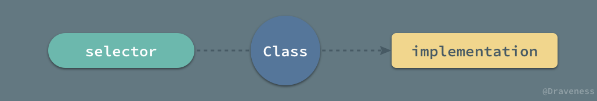

与正常的方法实现查找以及执行过程的简单不同，如果我们对某一个方法调用了 `-rac_signalForSelector:` 方法，那么对于同一个对象对应的类的所有方法，它们的执行过程会变得非常复杂：

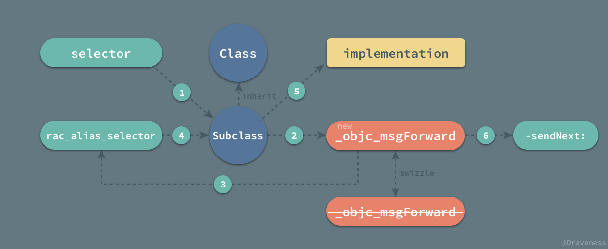

1. 由于当前对象对应的类已经被改成了 `Subclass`，即 `Class_RACSelectorSignal`，所以会在子类中查找方法的实现；
2. 方法对应的实现已经被改成了 `-forwardInvocation:`，会直接进入消息转发流程中处理；
3. 根据传入的选择子获取同名选择子 `rac_alias_selector`；
4. 拿到当前 `NSInvocation` 对象中 `target` 的类，判断是否可以响应该选择子；
5. 将 `NSInvocation` 对象中的选择子改为 `rac_alias_selector` 并执行其实现；
6. 从 `NSInvocation` 对象中获取参数并打包成 `RACTuple`，以 `next` 消息的形式发送到持有的 `RACSubject` 热信号上；

这时所有的订阅者才会在该方法被调用时收到消息，完成相应的任务。

## 总结

ReactiveCocoa 使用了一种非常神奇的办法把原有的代理模式成功的桥接到 `RACSignal` 的世界中，并为我们提供了 `RACDelegateProxy` 这一接口，能够帮助我们以信号的形式监听所有的代理方法，可以用 block 的形式去代替原有的方法，为我们减少一些工作量。

## References

+ [Type Encodings · Apple Developer](https://developer.apple.com/library/content/documentation/Cocoa/Conceptual/ObjCRuntimeGuide/Articles/ocrtTypeEncodings.html)

> Github Repo：[iOS-Source-Code-Analyze](https://github.com/draveness/iOS-Source-Code-Analyze)
> 
> Follow: [Draveness · GitHub](https://github.com/Draveness)
>
> Source: http://draveness.me/racdelegateproxy


