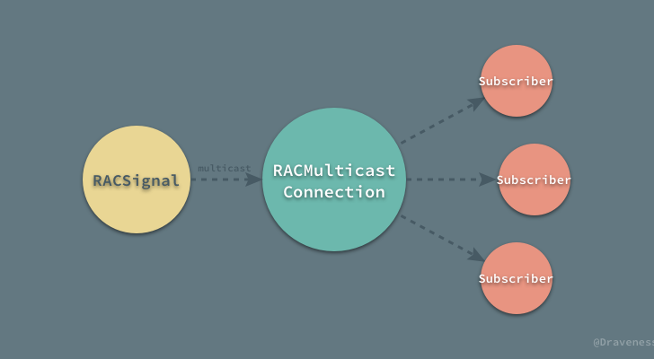
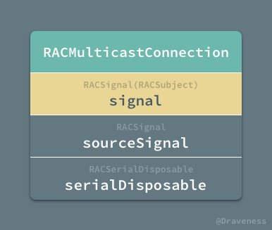
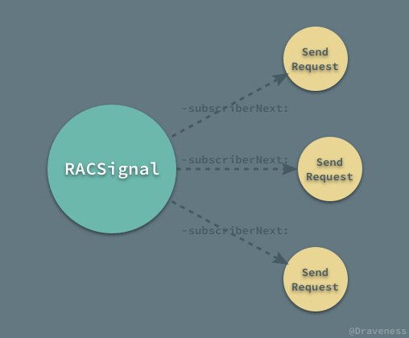
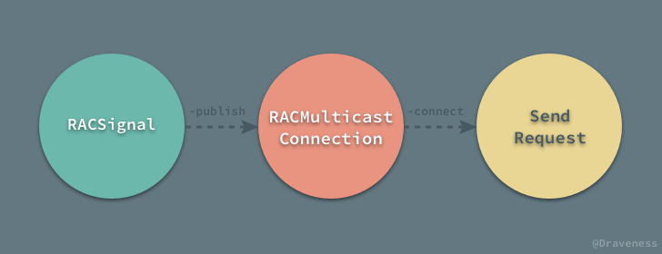
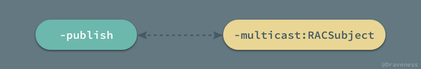
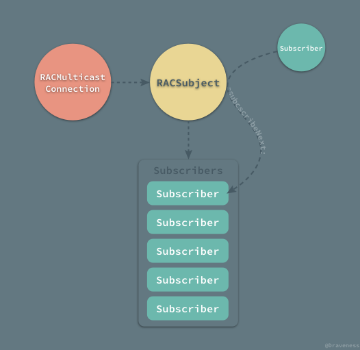
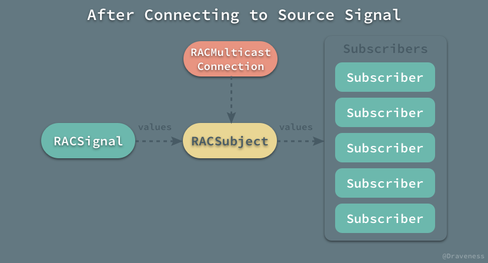
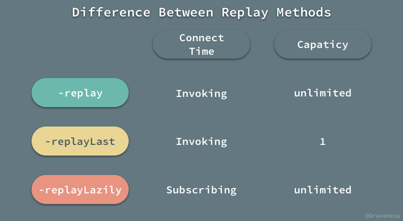

# 用于多播的 RACMulticastConnection

ReactiveCocoa 中的信号信号在默认情况下都是冷的，每次有新的订阅者订阅信号时都会执行信号创建时传入的 block；这意味着对于任意一个订阅者，所需要的数据都会**重新计算**，这在大多数情况下都是开发者想看到的情况，但是这在信号中的 block 有副作用或者较为昂贵时就会有很多问题。



我们希望有一种模型能够将冷信号转变成热信号，并在合适的时间触发，向所有的订阅者发送消息；而今天要介绍的 `RACMulticastConnection` 就是用于解决上述问题的。

## RACMulticastConnection 简介

`RACMulticastConnection` 封装了将一个信号的订阅分享给多个订阅者的思想，它的每一个对象都持有两个 `RACSignal`：



一个是私有的源信号 `sourceSignal`，另一个是用于广播的信号 `signal`，其实是一个 `RACSubject` 对象，不过对外只提供 `RACSignal` 接口，用于使用者通过 `-subscribeNext:` 等方法进行订阅。

## RACMulticastConnection 的初始化

`RACMulticastConnection` 有一个非常简单的初始化方法 `-initWithSourceSignal:subject:`，不过这个初始化方法是私有的：

```objectivec
- (instancetype)initWithSourceSignal:(RACSignal *)source subject:(RACSubject *)subject {
	self = [super init];

	_sourceSignal = source;
	_serialDisposable = [[RACSerialDisposable alloc] init];
	_signal = subject;
	
	return self;
}
```

在 `RACMulticastConnection` 的头文件的注释中，对它的初始化有这样的说明：

> Note that you shouldn't create RACMulticastConnection manually. Instead use -[RACSignal publish] or -[RACSignal multicast:].

我们不应该直接使用 `-initWithSourceSignal:subject:` 来初始化一个对象，我们应该通过 `RACSignal` 的实例方法初始化 `RACMulticastConnection` 实例。

```objectivec
- (RACMulticastConnection *)publish {
	RACSubject *subject = [RACSubject subject];
	RACMulticastConnection *connection = [self multicast:subject];
	return connection;
}

- (RACMulticastConnection *)multicast:(RACSubject *)subject {
	RACMulticastConnection *connection = [[RACMulticastConnection alloc] initWithSourceSignal:self subject:subject];
	return connection;
}
```

这两个方法 `-publish` 和 `-multicast:` 都是对初始化方法的封装，并且都会返回一个 `RACMulticastConnection` 对象，传入的 `sourceSignal` 就是当前信号，`subject` 就是用于对外广播的 `RACSubject` 对象。

## RACSignal 和 RACMulticastConnection

网络请求在客户端其实是一个非常昂贵的操作，也算是多级缓存中最慢的一级，在使用 ReactiveCocoa 处理业务需求中经常会遇到下面的情况：

```objectivec
RACSignal *requestSignal = [RACSignal createSignal:^RACDisposable * _Nullable(id<RACSubscriber>  _Nonnull subscriber) {
    NSLog(@"Send Request");
    NSURL *url = [NSURL URLWithString:@"http://localhost:3000"];
    AFHTTPSessionManager *manager = [[AFHTTPSessionManager alloc] initWithBaseURL:url];
    NSString *URLString = [NSString stringWithFormat:@"/api/products/1"];
    NSURLSessionDataTask *task = [manager GET:URLString parameters:nil progress:nil
                                      success:^(NSURLSessionDataTask * _Nonnull task, id _Nullable responseObject) {
                                          [subscriber sendNext:responseObject];
                                          [subscriber sendCompleted];
                                      } failure:^(NSURLSessionDataTask * _Nullable task, NSError * _Nonnull error) {
                                          [subscriber sendError:error];
                                      }];
    return [RACDisposable disposableWithBlock:^{
        [task cancel];
    }];
}];

[requestSignal subscribeNext:^(id  _Nullable x) {
    NSLog(@"product: %@", x);
}];

[requestSignal subscribeNext:^(id  _Nullable x) {
    NSNumber *productId = [x objectForKey:@"id"];
    NSLog(@"productId: %@", productId);
}];
```

通过订阅发出网络请求的信号经常会被多次订阅，以满足不同 UI 组件更新的需求，但是以上代码却有非常严重的问题。



每一次在 `RACSignal` 上执行 `-subscribeNext:` 以及类似方法时，都会发起一次新的网络请求，我们希望避免这种情况的发生。

为了解决上述问题，我们使用了 `-publish` 方法获得一个多播对象 `RACMulticastConnection`，更改后的代码如下：

```objectivec
RACMulticastConnection *connection = [[RACSignal createSignal:^RACDisposable * _Nullable(id<RACSubscriber>  _Nonnull subscriber) {
    NSLog(@"Send Request");
    ...
}] publish];

[connection.signal subscribeNext:^(id  _Nullable x) {
    NSLog(@"product: %@", x);
}];
[connection.signal subscribeNext:^(id  _Nullable x) {
    NSNumber *productId = [x objectForKey:@"id"];
    NSLog(@"productId: %@", productId);
}];

[connection connect];
```

在这个例子中，我们使用 `-publish` 方法生成实例，订阅者不再订阅源信号，而是订阅 `RACMulticastConnection` 中的 `RACSubject` 热信号，最后通过 `-connect` 方法触发源信号中的任务。



> 对于热信号不了解的读者，可以阅读这篇文章 [『可变』的热信号 RACSubject](https://github.com/Draveness/iOS-Source-Code-Analyze/blob/master/contents/ReactiveObjC/RACSubject.md)。

### publish 和 multicast 方法

我们再来看一下 `-publish` 和 `-multicast:` 这两个方法的实现：

```objectivec
- (RACMulticastConnection *)publish {
	RACSubject *subject = [RACSubject subject];
	RACMulticastConnection *connection = [self multicast:subject];
	return connection;
}

- (RACMulticastConnection *)multicast:(RACSubject *)subject {
	RACMulticastConnection *connection = [[RACMulticastConnection alloc] initWithSourceSignal:self subject:subject];
	return connection;
}
```

当 `-publish` 方法调用时相当于向 `-multicast:` 传入了 `RACSubject`。



`-publish` 只是对 `-multicast:` 方法的简单封装，它们都是通过 `RACMulticastConnection` 私有的初始化方法 `-initWithSourceSignal:subject:` 创建一个新的实例。

在使用 `-multicast:` 方法时，传入的信号其实就是用于广播的信号；这个信号必须是一个 `RACSubject` 本身或者它的子类：


传入 `-multicast:` 方法的一般都是 `RACSubject` 或者 `RACReplaySubject` 对象。

### 订阅源信号的时间点

订阅 `connection.signal` 中的数据流时，其实只是向多播对象中的热信号 `RACSubject` 持有的数组中加入订阅者，而这时刚刚创建的 `RACSubject` 中并没有任何的消息。



只有在调用 `-connect` 方法之后，`RACSubject` 才会**订阅**源信号 `sourceSignal`。

```objectivec
- (RACDisposable *)connect {
	self.serialDisposable.disposable = [self.sourceSignal subscribe:_signal];
	return self.serialDisposable;
}
```

这时源信号的 `didSubscribe` 代码块才会执行，向 `RACSubject` 推送消息，消息向下继续传递到 `RACSubject` 所有的订阅者中。



`-connect` 方法通过 `-subscribe:` 实际上建立了 `RACSignal` 和 `RACSubject` 之间的连接，这种方式保证了 `RACSignal` 中的 `didSubscribe` 代码块只执行了一次。

所有的订阅者不再订阅原信号，而是订阅 `RACMulticastConnection` 持有的热信号 `RACSubject`，实现对冷信号的一对多传播。

在 `RACMulticastConnection` 中还有另一个用于连接 `RACSignal` 和 `RACSubject` 信号的 `-autoconnect` 方法：

```objectivec
- (RACSignal *)autoconnect {
	__block volatile int32_t subscriberCount = 0;
	return [RACSignal
		createSignal:^(id<RACSubscriber> subscriber) {
			OSAtomicIncrement32Barrier(&subscriberCount);
			RACDisposable *subscriptionDisposable = [self.signal subscribe:subscriber];
			RACDisposable *connectionDisposable = [self connect];

			return [RACDisposable disposableWithBlock:^{
				[subscriptionDisposable dispose];
				if (OSAtomicDecrement32Barrier(&subscriberCount) == 0) {
					[connectionDisposable dispose];
				}
			}];
		}];
}
```

它保证了在 `-autoconnect` 方法返回的对象被第一次订阅时，就会建立源信号与热信号之间的连接。

### 使用 RACReplaySubject 订阅源信号

虽然使用 `-publish` 方法已经能够解决大部分问题了，但是在 `-connect` 方法调用之后才订阅的订阅者并不能收到消息。

如何才能保存 `didSubscribe` 执行过程中发送的消息，并在 `-connect` 调用之后也可以收到消息？这时，我们就要使用 `-multicast:` 方法和 `RACReplaySubject` 来完成这个需求了。

```objectivec
RACSignal *sourceSignal = [RACSignal createSignal:...];
RACMulticastConnection *connection = [sourceSignal multicast:[RACReplaySubject subject]];
[connection.signal subscribeNext:^(id  _Nullable x) {
    NSLog(@"product: %@", x);
}];
[connection connect];
[connection.signal subscribeNext:^(id  _Nullable x) {
    NSNumber *productId = [x objectForKey:@"id"];
    NSLog(@"productId: %@", productId);
}];
```

除了使用上述的代码，也有一个更简单的方式创建包含 `RACReplaySubject` 对象的 `RACMulticastConnection`：

```objectivec
RACSignal *signal = [[RACSignal createSignal:...] replay];
[signal subscribeNext:^(id  _Nullable x) {
    NSLog(@"product: %@", x);
}];
[signal subscribeNext:^(id  _Nullable x) {
    NSNumber *productId = [x objectForKey:@"id"];
    NSLog(@"productId: %@", productId);
}];
```

`-replay` 方法和 `-publish` 差不多，只是内部封装的热信号不同，并在方法调用时就连接原信号：

```objectivec
- (RACSignal *)replay {
	RACReplaySubject *subject = [RACReplaySubject subject];
	RACMulticastConnection *connection = [self multicast:subject];
	[connection connect];
	return connection.signal;
}
```

除了 `-replay` 方法，`RACSignal` 中还定义了与 `RACMulticastConnection` 中相关的其它 `-replay` 方法：

```objectivec
- (RACSignal<ValueType> *)replay;
- (RACSignal<ValueType> *)replayLast;
- (RACSignal<ValueType> *)replayLazily;
```

三个方法都会在 `RACMulticastConnection` 初始化时传入一个 `RACReplaySubject` 对象，不过却有一点细微的差别：



相比于 `-replay` 方法，`-replayLast` 方法生成的 `RACMulticastConnection` 中热信号的容量为 `1`：

```objectivec
- (RACSignal *)replayLast {
	RACReplaySubject *subject = [RACReplaySubject replaySubjectWithCapacity:1];
	RACMulticastConnection *connection = [self multicast:subject];
	[connection connect];
	return connection.signal;
}
```

而 `replayLazily` 会在返回的信号被**第一次订阅**时，才会执行 `-connect` 方法：

```objectivec
- (RACSignal *)replayLazily {
	RACMulticastConnection *connection = [self multicast:[RACReplaySubject subject]];
	return [RACSignal
		defer:^{
			[connection connect];
			return connection.signal;
		}];
}
```

## 总结

`RACMulticastConnection` 在处理冷热信号相互转换时非常好用，在 `RACSignal` 中也提供了很多将原有的冷信号通过 `RACMulticastConnection` 转换成热信号的方法。


在遇到冷信号中的行为有副作用后者非常昂贵时，我们就可以使用这些方法将单播变成多播，提高执行效率，减少副作用。

## References

+ [『可变』的热信号 RACSubject](https://github.com/Draveness/iOS-Source-Code-Analyze/blob/master/contents/ReactiveObjC/RACSubject.md)
+ [细说 ReactiveCocoa 的冷信号与热信号](http://williamzang.com/blog/2015/08/18/talk-about-reactivecocoas-cold-signal-and-hot-signal/)

> Github Repo：[iOS-Source-Code-Analyze](https://github.com/draveness/iOS-Source-Code-Analyze)
> 
> Follow: [Draveness · GitHub](https://github.com/Draveness)
>
> Source: http://draveness.me/racconnection

