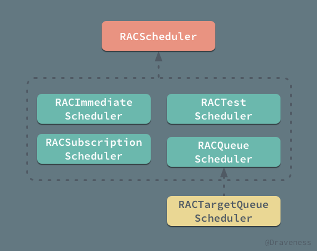
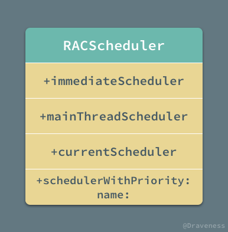
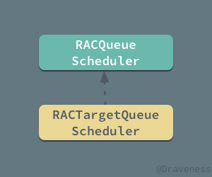
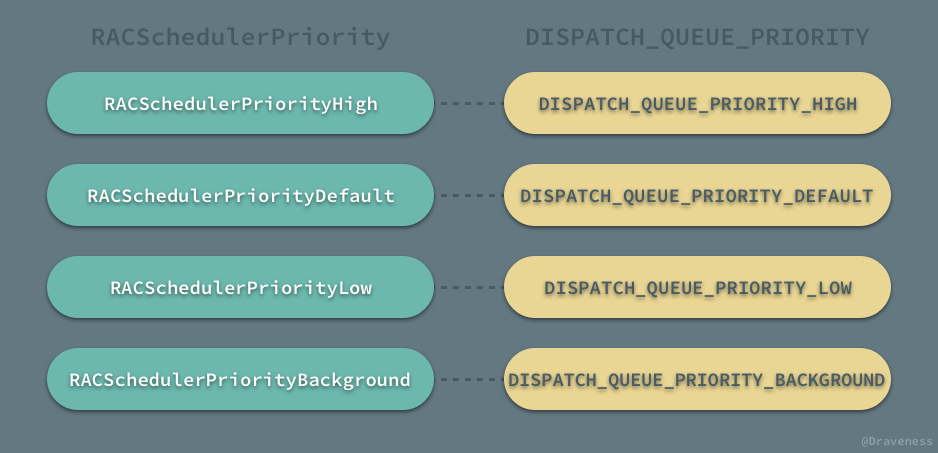
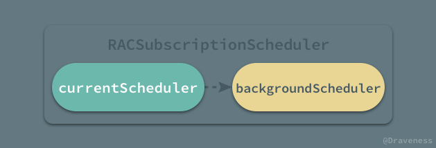

# 理解 RACScheduler 的实现

`RACScheduler` 是一个线性执行队列，ReactiveCocoa 中的信号可以在 `RACScheduler` 上执行任务、发送结果；它的实现并不复杂，由多个简单的方法和类组成整个 `RACScheduler` 模块，是整个 ReactiveCocoa 中非常易于理解的部分。

## RACScheduler 简介

`RACScheduler` 作为 ReactiveCocoa 中唯一的用于调度的模块，它包含很多个性化的子类：



`RACScheduler` 类的内部只有一个用于追踪标记和 debug 的属性 `name`，头文件和实现文件中的其它内容都是各种各样的方法；我们可以把其中的方法分为两类，一类是用于初始化 `RACScheduler` 实例的初始化方法：



另一类就是用于调度、执行任务的 `+schedule:` 等方法：


在图中都省略了一些参数缺省的方法，以及一些调用其他方法的调度方法或者初始化方法，用以减少我们分析和理解整个 `RACScheduler` 类的难度。

在 `RACScheduler` 中，大部分的调度方法都是需要子类覆写，它本身只提供少数的功能，比如递归 block 的执行：

```objectivec
- (RACDisposable *)scheduleRecursiveBlock:(RACSchedulerRecursiveBlock)recursiveBlock {
	RACCompoundDisposable *disposable = [RACCompoundDisposable compoundDisposable];
	[self scheduleRecursiveBlock:[recursiveBlock copy] addingToDisposable:disposable];
	return disposable;
}
```

该方法会递归的执行传入的 `recursiveBlock`，使用的方式非常简单：

```objectivec
[scheduler scheduleRecursiveBlock:^(void (^reschedule)(void)) {
    if (needTerminated) return;
    
    // do something

    reschedule();
}];
```

如果需要递归就执行方法中的 `reschedule()`，就会再次执行当前的 block；`-scheduleRecursiveBlock:` 中调用的 `-scheduleRecursiveBlock:addingToDisposable:` 实现比较复杂：

```objectivec
- (void)scheduleRecursiveBlock:(RACSchedulerRecursiveBlock)recursiveBlock addingToDisposable:(RACCompoundDisposable *)disposable {
    ...
    RACDisposable *schedulingDisposable = [self schedule:^{
        void (^reallyReschedule)(void) = ^{
            [self scheduleRecursiveBlock:recursiveBlock addingToDisposable:disposable];
        };

        recursiveBlock(^{
            reallyReschedule();
        });
    }];
    ...
}
```

> 方法使用了 `NSLock` 保证在并发情况下并不会出现任何问题，不过在这里展示的代码中，我们将它省略了，一并省略的还有 `RACDisposable` 相关的代码，以保证整个方法逻辑的清晰，方法的原实现可以查看这里 [RACScheduler.m#L130-L187](https://github.com/ReactiveCocoa/ReactiveObjC/blob/9164a24abfbb7d6b2280d78f9c9308a9842bfcfe/ReactiveObjC/RACScheduler.m#L130-L187)。

在每次执行 `recursiveBlock` 时，都会传入一个 `reallyReschedule` 用于递归执行传入的 block。

其他的方法包括 `+schedule:`、`+after:schedule:` 以及 `after:repeatingEvery:withLeeway:schedule:` 方法都需要子类覆写：

```objectivec
- (RACDisposable *)schedule:(void (^)(void))block;
- (RACDisposable *)after:(NSDate *)date schedule:(void (^)(void))block;
- (RACDisposable *)after:(NSDate *)date repeatingEvery:(NSTimeInterval)interval withLeeway:(NSTimeInterval)leeway schedule:(void (^)(void))block {
	NSCAssert(NO, @"%@ must be implemented by subclasses.", NSStringFromSelector(_cmd));
	return nil;
}
```

而接下来我们就按照初始化方法的顺序依次介绍 `RACScheduler` 的子类了。

### RACImmediateScheduler

`RACImmediateScheduler` 是一个会立即执行传入的代码块的调度器，我们可以使用 `RACScheduler` 的类方法 `+immediateScheduler` 返回一个它的实例：

```objectivec
+ (RACScheduler *)immediateScheduler {
	static dispatch_once_t onceToken;
	static RACScheduler *immediateScheduler;
	dispatch_once(&onceToken, ^{
		immediateScheduler = [[RACImmediateScheduler alloc] init];
	});
	return immediateScheduler;
}
```

由于 `RACImmediateScheduler` 是一个私有类，全局只能通过该方法返回它的实例，所以整个程序的运行周期内，我们通过『合法』手段只能获得唯一一个单例。

作为 `RACScheduler` 的子类，它必须对父类的调度方法进行覆写，不过因为本身的职能原因，`RACImmediateScheduler` 对于父类的覆写还是非常简单的：

```objectivec
- (RACDisposable *)schedule:(void (^)(void))block {
	block();
	return nil;
}

- (RACDisposable *)after:(NSDate *)date schedule:(void (^)(void))block {
	[NSThread sleepUntilDate:date];
	block();
	return nil;
}

- (RACDisposable *)after:(NSDate *)date repeatingEvery:(NSTimeInterval)interval withLeeway:(NSTimeInterval)leeway schedule:(void (^)(void))block {
	NSCAssert(NO, @"+[RACScheduler immediateScheduler] does not support %@.", NSStringFromSelector(_cmd));
	return nil;
}
```

+ `+schedule` 方法会立刻执行传入的 block；
+ `+after:schedule:` 方法会将当前线程休眠到指定时间后执行 block；
+ 而对于 `+after:repeatingEvery:withLeeway:schedule:` 方法就干脆不支持。

这确实非常符合 `RACImmediateScheduler` 类的名字以及功能，虽然没有要求对递归执行 block 的方法进行覆写，不过它依然做了这件事情：

```objectivec
- (RACDisposable *)scheduleRecursiveBlock:(RACSchedulerRecursiveBlock)recursiveBlock {
	for (__block NSUInteger remaining = 1; remaining > 0; remaining--) {
		recursiveBlock(^{
			remaining++;
		});
	}
	return nil;
}
```

实现的过程非常简洁，甚至没有什么值得解释的地方了。

### RACTargetQueueScheduler

`RACTargetQueueScheduler` 继承自 `RACQueueScheduler`，但是由于后者是抽象类，我们并不会直接使用它，它只是为前者提供必要的方法支持，将一部分逻辑抽离出来：



这里我们先简单看一下 `RACTargetQueueScheduler` 的实现，整个 `RACTargetQueueScheduler` 类中只有一个初始化方法：

```objectivec
- (instancetype)initWithName:(NSString *)name targetQueue:(dispatch_queue_t)targetQueue {
	dispatch_queue_t queue = dispatch_queue_create(name.UTF8String, DISPATCH_QUEUE_SERIAL);
	dispatch_set_target_queue(queue, targetQueue);
	return [super initWithName:name queue:queue];
}
```

初始化方法 `-initWithName:targetQueue:` 使用 `dispatch_queue_create` 创建了一个串行队列，然后通过 `dispatch_set_target_queue`  根据传入的 `targetQueue` 设置队列的优先级，最后调用父类的指定构造器完成整个初始化过程。

`RACTargetQueueScheduler` 在使用时，将待执行的任务加入一个私有的串行队列中，其优先级与传入的 `targetQueue` 完全相同；不过提到 `RACTargetQueueScheduler` 中队列的优先级，对 GCD 稍有了解的人应该都知道在 GCD 中有着四种不同优先级的全局并行队列，而在 `RACScheduler` 中也有一一对应的枚举类型：



在使用 `+schedulerWithPriority:` 方法创建 `RACTargetQueueScheduler` 时，就需要传入上面的优先级，方法会通过 GCD 的内置方法 `dispatch_get_global_queue` 获取全局的并行队列，最终返回一个新的实例。

```objectivec
+ (RACScheduler *)schedulerWithPriority:(RACSchedulerPriority)priority name:(NSString *)name {
	return [[RACTargetQueueScheduler alloc] initWithName:name targetQueue:dispatch_get_global_queue(priority, 0)];
}
```

在 `RACScheduler` 接口中另一个获得主线程调度器的方法 `+mainThreadScheduler`，其实现也是返回一个 `RACTargetQueueScheduler` 对象：

```objectivec
+ (RACScheduler *)mainThreadScheduler {
	static dispatch_once_t onceToken;
	static RACScheduler *mainThreadScheduler;
	dispatch_once(&onceToken, ^{
		mainThreadScheduler = [[RACTargetQueueScheduler alloc] initWithName:@"org.reactivecocoa.ReactiveObjC.RACScheduler.mainThreadScheduler" targetQueue:dispatch_get_main_queue()];
	});
	
	return mainThreadScheduler;
}
```

与前者不同的是，后者通过单例模式每次调用时返回一个相同的主线程队列。

#### 抽象类 RACQueueScheduler

在我们对 `RACTargetQueueScheduler` 有一定了解之后，再看它的抽象类就非常简单了；`RACImmediateScheduler` 会立即执行传入的任务，而 `RACQueueScheduler` 其实就是对 GCD 的封装，相信各位读者从它的子类的实现就可以看出来。

`RACQueueScheduler` 对三个需要覆写的方法都进行了重写，其实现完全基于 GCD，以 `-schedule:` 方法为例：

```objectivec
- (RACDisposable *)schedule:(void (^)(void))block {
	RACDisposable *disposable = [[RACDisposable alloc] init];

	dispatch_async(self.queue, ^{
		if (disposable.disposed) return;
		[self performAsCurrentScheduler:block];
	});

	return disposable;
}
```

使用 `dispatch_async` 方法直接将需要执行的任务**异步派发**到它所持有的队列上；而 `-after:schedule:` 方法的实现相信各位读者也能猜到：

```objectivec
- (RACDisposable *)after:(NSDate *)date schedule:(void (^)(void))block {
	RACDisposable *disposable = [[RACDisposable alloc] init];

	dispatch_after([self.class wallTimeWithDate:date], self.queue, ^{
		if (disposable.disposed) return;
		[self performAsCurrentScheduler:block];
	});

	return disposable;
}
```

哪怕不使用 `RACScheduler`，我们也能够想到利用 `dispatch_after` 完成一些需要延迟执行的任务，最后的 `+after:repeatingEvery:withLeeway:schedule:` 方法的实现就稍微复杂一些了：

```objectivec
- (RACDisposable *)after:(NSDate *)date repeatingEvery:(NSTimeInterval)interval withLeeway:(NSTimeInterval)leeway schedule:(void (^)(void))block {
	uint64_t intervalInNanoSecs = (uint64_t)(interval * NSEC_PER_SEC);
	uint64_t leewayInNanoSecs = (uint64_t)(leeway * NSEC_PER_SEC);

	dispatch_source_t timer = dispatch_source_create(DISPATCH_SOURCE_TYPE_TIMER, 0, 0, self.queue);
	dispatch_source_set_timer(timer, [self.class wallTimeWithDate:date], intervalInNanoSecs, leewayInNanoSecs);
	dispatch_source_set_event_handler(timer, block);
	dispatch_resume(timer);

	return [RACDisposable disposableWithBlock:^{
		dispatch_source_cancel(timer);
	}];
}
```

方法使用 `dispatch_source_t` 以及定时器，完成了每隔一段时间需要执行任务的需求。

### RACSubscriptionScheduler

最后的 `RACSubscriptionScheduler` 是 ReactiveCocoa 中一个比较特殊的调度器，所有 ReactiveCocoa 中的订阅事件都会在 `RACSubscriptionScheduler` 调度器上进行；而它是通过封装两个调度器实现的：



> `backgroundScheduler` 是一个优先级为 `RACSchedulerPriorityDefault` 的串行队列。

`RACSubscriptionScheduler` 本身不提供任何的调度功能，它会根据当前状态选择持有的两个调度器中的一个执行任务；首先判断当前线程是否存在 `currentScheduler`，如果不存在的话才会在 `backgroundScheduler` 执行任务。

```objectivec
- (RACDisposable *)schedule:(void (^)(void))block {
	if (RACScheduler.currentScheduler == nil) return [self.backgroundScheduler schedule:block];
	block();
	return nil;
}

- (RACDisposable *)after:(NSDate *)date schedule:(void (^)(void))block {
	RACScheduler *scheduler = RACScheduler.currentScheduler ?: self.backgroundScheduler;
	return [scheduler after:date schedule:block];
}

- (RACDisposable *)after:(NSDate *)date repeatingEvery:(NSTimeInterval)interval withLeeway:(NSTimeInterval)leeway schedule:(void (^)(void))block {
	RACScheduler *scheduler = RACScheduler.currentScheduler ?: self.backgroundScheduler;
	return [scheduler after:date repeatingEvery:interval withLeeway:leeway schedule:block];
}
```

`RACSubscriptionScheduler` 作为一个私有类，我们并不能直接在 ReactiveCocoa 外部使用它，需要通过私有方法 `+subscriptionScheduler` 获取这个调度器：

```objectivec
+ (RACScheduler *)subscriptionScheduler {
	static dispatch_once_t onceToken;
	static RACScheduler *subscriptionScheduler;
	dispatch_once(&onceToken, ^{
		subscriptionScheduler = [[RACSubscriptionScheduler alloc] init];
	});

	return subscriptionScheduler;
}
```

## 总结

`RACScheduler` 在某些方面与 GCD 中的队列十分相似，与 GCD 中的队列不同的有两点，第一，它可以通过 `RACDisposable` 对执行中的任务进行取消，第二是 `RACScheduler` 中任务的执行都是线性的；与此同时 `RACScheduler` 也与 `NSOperationQueue` 非常类似，但是它并不支持对调度的任务进行**重排序**以及实现任务与任务之间的**依赖**关系。

## References

> Github Repo：[iOS-Source-Code-Analyze](https://github.com/draveness/iOS-Source-Code-Analyze)
> 
> Follow: [Draveness · GitHub](https://github.com/Draveness)
>
> Source: http://draveness.me/racscheduler

