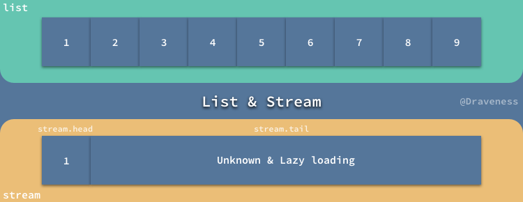
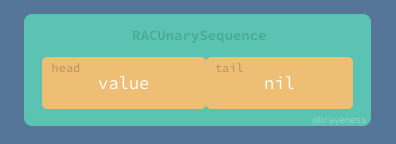
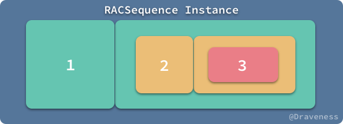
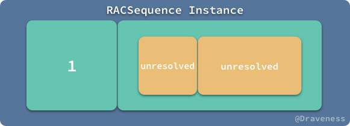
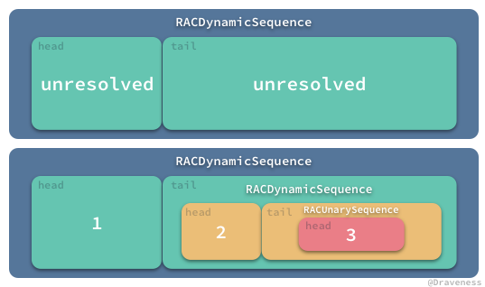
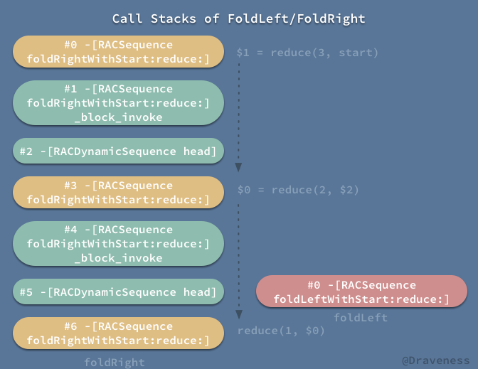
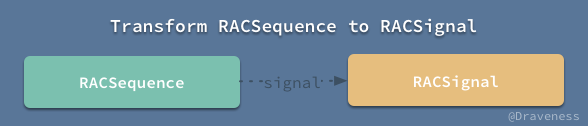

# Pull-Driven 的数据流 RACSequence

ReactiveCocoa 在设计上很大程度借鉴了 Reactive Extension 中的概念，可以说 ReactiveCocoa 是 Rx 在 Objective-C 语言中的实现。

在 Rx 中主要的两个概念*信号*和*序列*都在 ReactiveCocoa 中有着相对应的组件 `RACSignal` 和 `RACSequence`，上一篇文章已经对前者有一个简单的介绍，而这篇文章主要会介绍后者，也就是 `RACSequence`。

## Push-Driven & Pull-Driven

虽然这篇文章主要介绍 `RACSequence`，但是在介绍它之前，笔者想先就推驱动（push-driven）和拉驱动（pull-driven）这两个概念做一点简单的说明。

`RACSignal` 和 `RACSequence` 都是 `RACStream` 的子类，它们不仅共享了来自父类的很多方法，也都表示数据流。


`RACSignal` 和 `RACSequence` 最大区别就是：

+ `RACSignal` 是推驱动的，也就是在每次信号中的出现新的数据时，所有的订阅者都会自动接受到最新的值；
+ `RACSequence` 作为推驱动的数据流，在改变时并不会通知使用当前序列的对象，只有使用者再次从这个 `RACSequence` 对象中获取数据才能更新，它的更新是需要使用者自己拉取的。

由于拉驱动在数据改变时，并不会主动推送给『订阅者』，所以往往适用于简化集合类对象等操作，相比于推驱动，它的适应场合较少。


> 图片中的内容来自 [Reactive​Cocoa · NSHipster](http://nshipster.com/reactivecocoa/) 中。

## 预加载与延迟加载

在 `RACSequence` 中还涉及到另外一对概念，也就是预加载和延迟加载（也叫懒加载）；如果你之前学习过 Lisp 这门编程语言，那么你一定知道 Lisp 中有两种列表，一种是正常的列表 List，另一种叫做流 Stream，这两者的主要区别就是**流的加载是延迟加载的**，只有在真正使用数据时才会计算数据的内容。



> 由于流是懒加载的，这也就是说它可以**表示无穷长度的列表**。

Stream 由两部分组成，分别是 `head` 和 `tail`，两者都是在访问时才会计算，在上图前者是一个数字，而后者会是另一个 Stream 或者 `nil`。

```objectivec
@interface RACSequence<__covariant ValueType> : RACStream <NSCoding, NSCopying, NSFastEnumeration>

@property (nonatomic, strong, readonly, nullable) ValueType head;
@property (nonatomic, strong, readonly, nullable) RACSequence<ValueType> *tail;

@end
```

`RACSequence` 头文件的中定义能够帮助我们更好理解递归的序列以及 `head` 和 `tail` 的概念，`head` 是一个值，`tail` 是一个 `RACSequence` 对象。

## RACSequence 简介

了解了几个比较重要的概念之后，就可以进入正题了，先看一下在 ReactiveCocoa 中，`RACSequence` 都有哪些子类：


`RACSequence` 总共有九个子类，这篇文章不会覆盖其中所有的内容，只会简单介绍其中的几个；不过，我们先从父类 `RACSequence` 开始。

### return 和 bind 方法

与介绍 `RACSignal` 时一样，这里我们先介绍两个 `RACSequence` 必须覆写的方法，第一个就是 `+return:`

```objectivec
+ (RACSequence *)return:(id)value {
	return [RACUnarySequence return:value];
}
```

`+return:` 方法用到了 `RACSequence` 的子类 `RACUnarySequence` 私有类，这个类在外界是不可见的，其实现非常简单，只是将原来的 `value` 包装成了一个简单的 `RACUnarySequence` 对象：

```objectivec
+ (RACUnarySequence *)return:(id)value {
	RACUnarySequence *sequence = [[self alloc] init];
	sequence.head = value;
	return [sequence setNameWithFormat:@"+return: %@", RACDescription(value)];
}
```

这样在访问 `head` 时可以获取到传入的 `value`；在访问 `tail` 时只需要返回 `nil`：

```objectivec
- (RACSequence *)tail {
	return nil;
}
```

整个 `RACUnarySequence` 也只是对 `value` 简单封装成一个 `RACSequence` 对象而已：



相比于 `+return:` 方法的简单实现，`-bind:` 的实现就复杂多了：

```objectivec
- (RACSequence *)bind:(RACSequenceBindBlock (^)(void))block {
	RACSequenceBindBlock bindBlock = block();
	return [[self bind:bindBlock passingThroughValuesFromSequence:nil] setNameWithFormat:@"[%@] -bind:", self.name];
}
```

首先是对 `-bind:` 方法进行一次转发，将控制权交给 `-bind:passingThroughValuesFromSequence:` 方法中：

```objectivec
- (RACSequence *)bind:(RACSequenceBindBlock)bindBlock passingThroughValuesFromSequence:(RACSequence *)passthroughSequence {
	__block RACSequence *valuesSeq = self;
	__block RACSequence *current = passthroughSequence;
	__block BOOL stop = NO;

	RACSequence *sequence = [RACDynamicSequence sequenceWithLazyDependency:^ id {
		while (current.head == nil) {
			if (stop) return nil;
			id value = valuesSeq.head;
			if (value == nil) {
				stop = YES;
				return nil;
			}
			current = (id)bindBlock(value, &stop);
			if (current == nil) {
				stop = YES;
				return nil;
			}

			valuesSeq = valuesSeq.tail;
		}
		return nil;
	} headBlock:^(id _) {
		return current.head;
	} tailBlock:^ id (id _) {
		if (stop) return nil;

		return [valuesSeq bind:bindBlock passingThroughValuesFromSequence:current.tail];
	}];

	sequence.name = self.name;
	return sequence;
}
```

这个非常复杂的方法实际作用就是创建了一个私有类 `RACDynamicSequence` 对象，使用的初始化方法也都是私有的 `+sequenceWithLazyDependency:headBlock:tailBlock:`：

```objectivec
+ (RACSequence *)sequenceWithLazyDependency:(id (^)(void))dependencyBlock headBlock:(id (^)(id dependency))headBlock tailBlock:(RACSequence *(^)(id dependency))tailBlock {
	RACDynamicSequence *seq = [[RACDynamicSequence alloc] init];
	seq.headBlock = [headBlock copy];
	seq.tailBlock = [tailBlock copy];
	seq.dependencyBlock = [dependencyBlock copy];
	seq.hasDependency = YES;
	return seq;
}
```

在使用 `RACDynamicSequence` 中的元素时，无论是 `head` 还是 `tail` 都会用到在初始化方法中传入的三个 block：

```objectivec
- (id)head {
	@synchronized (self) {
		id untypedHeadBlock = self.headBlock;
		if (untypedHeadBlock == nil) return _head;

		if (self.hasDependency) {
			if (self.dependencyBlock != nil) {
				_dependency = self.dependencyBlock();
				self.dependencyBlock = nil;
			}

			id (^headBlock)(id) = untypedHeadBlock;
			_head = headBlock(_dependency);
		} else {
			id (^headBlock)(void) = untypedHeadBlock;
			_head = headBlock();
		}

		self.headBlock = nil;
		return _head;
	}
}
```

`head` 的计算依赖于 `self.headBlock` 和 `self.dependencyBlock`；

而 `tail` 的计算也依赖于 `self.headBlock` 和 `self.dependencyBlock`，只是 `tail` 会执行 `tailBlock` 返回另一个 `RACDynamicSequence` 的实例：

```objectivec
^ id (id _) {
    return [valuesSeq bind:bindBlock passingThroughValuesFromSequence:current.tail];
}
```

这里通过一段代码更好的了解 `-bind:` 方法是如何使用的：

```objectivec
RACSequence *sequence = [RACSequence sequenceWithHeadBlock:^id _Nullable{
    return @1;
} tailBlock:^RACSequence * _Nonnull{
    return [RACSequence sequenceWithHeadBlock:^id _Nullable{
        return @2;
    } tailBlock:^RACSequence * _Nonnull{
        return [RACSequence return:@3];
    }];
}];
RACSequence *bindSequence = [sequence bind:^RACSequenceBindBlock _Nonnull{
    return ^(NSNumber *value, BOOL *stop) {
        NSLog(@"RACSequenceBindBlock: %@", value);
        value = @(value.integerValue * 2);
        return [RACSequence return:value];
    };
}];
NSLog(@"sequence:     head = (%@), tail=(%@)", sequence.head, sequence.tail);
NSLog(@"BindSequence: head = (%@), tail=(%@)", bindSequence.head, bindSequence.tail);
```

在上面的代码中，我们使用 `+sequenceWithHeadBlock:tailBlock:` 这个唯一暴露出来的初始化方法创建了一个如下图所示的 `RACSequence`：



> 图中展示了完整的 `RACSequence` 对象的值，其中的内容暂时都是 `unresolved` 的。

上述代码在运行之后，会打印出如下内容：

```objectivec
sequence:     head = (1), tail=(<RACDynamicSequence: 0x60800009eb40>{ name = , head = (unresolved), tail = (unresolved) })
RACSequenceBindBlock: 1
BindSequence: head = (2), tail=(<RACDynamicSequence: 0x608000282940>{ name = , head = (unresolved), tail = (unresolved) })
```

无论是 `sequence` 还是 `bindSequence`，其中的 `tail` 部分都是一个 `RACDynamicSequence` 对象，并且其中的 `head` 和 `tail` 部分都是 `unresolved`。



在上面的代码中 `RACSequenceBindBlock` 的执行也是惰性的，只有在获取 `bindSequence.head` 时，才会执行将数字转换成 `RACUnarySequence` 对象，最后通过 `head` 属性取出来。

### lazySequence 和 eagerSequence

上一节的代码中展示的所有序列都是惰性的，而在整个 ReactiveCocoa 中，所有的 `RACSequence` 对象在**默认情况**下都是惰性的，序列中的值只有在真正需要使用时才会被展开，在其他时间都是 **unresolved**。

`RACSequence` 中定义了两个分别获取 `lazySequence` 和 `eagerSequence` 的属性：

```objectivec
@property (nonatomic, copy, readonly) RACSequence<ValueType> *eagerSequence;
@property (nonatomic, copy, readonly) RACSequence<ValueType> *lazySequence;
```

> 笔者一直认为在大多数情况下，在客户端上的惰性求值都是没有太多意义的，如果一个序列的**长度没有达到比较庞大的数量级或者说计算量比较小**，我们完全都可以使用贪婪求值（Eager Evaluation）的方式尽早获得结果；
> 
> 同样，在数量级和计算量不需要考虑时，我们也不需要考虑是否应该设计成哪种求值方式，只需要使用默认行为。

与上一节相同，在这里使用相同的代码创建一个 `RACSequence` 对象：

```objectivec
RACSequence *sequence = [RACSequence sequenceWithHeadBlock:^id _Nullable{
    return @1;
} tailBlock:^RACSequence * _Nonnull{
    return [RACSequence sequenceWithHeadBlock:^id _Nullable{
        return @2;
    } tailBlock:^RACSequence * _Nonnull{
        return [RACSequence return:@3];
    }];
}];

NSLog(@"Lazy:  %@", sequence.lazySequence);
NSLog(@"Eager: %@", sequence.eagerSequence);
NSLog(@"Lazy:  %@", sequence.lazySequence);
```

然后分别三次打印出当前对象的 `lazySequence` 和 `eagerSequence` 中的值：

```objectivec
Lazy:  <RACDynamicSequence: 0x608000097160>
{ name = , head = (unresolved), tail = (unresolved) }
Eager: <RACEagerSequence: 0x600000035de0>
{ name = , array = (
    1,
    2,
    3
) }
Lazy:  <RACDynamicSequence: 0x608000097160>
{ name = , head = 1, tail = <RACDynamicSequence: 0x600000097070>
    { name = , head = 2, tail = <RACUnarySequence: 0x600000035f00>
        { name = , head = 3 } } }
```

在第一调用 `sequence.lazySequence` 时，因为元素没有被使用，惰性序列的 `head` 和 `tail` 都为 unresolved；而在 `sequence.eagerSequence` 调用后，访问了序列中的所有元素，在这之后再打印 `sequence.lazySequence` 中的值就都不是 unresolved 的了。



这种情况的出现不难理解，不过因为 `lazySequence` 和 `eagerSequence` 是 `RACSequence` 的方法，所以我们可以在任意子类的实例包括 `RACEagerSequence` 和非惰性序列上调用它们，这就会出现以下的多种情况：


总而言之，调用过 `eagerSequence` 的序列的元素已经不再是 `unresolved` 了，哪怕再调用 `lazySequence` 方法，读者可以自行实验验证这里的结论。

### 操作 RACSequence

`RACStream` 为 `RACSequence` 提供了很多基本的操作，`-map:`、`-filter:`、`-ignore:` 等等，因为这些方法的实现都基于 `-bind:`，而 `-bind:` 方法的执行是惰性的，所以在调用上述方法之后返回的 `RACSequence` 中所有的元素都是 unresolved 的，需要在访问之后才会计算并展开：

```objectivec
RACSequence *sequence = [@[@1, @2, @3].rac_sequence map:^id _Nullable(NSNumber * _Nullable value) {
    return @(value.integerValue * value.integerValue);
}];
NSLog(@"%@", sequence); -> <RACDynamicSequence: 0x60800009ad10>{ name = , head = (unresolved), tail = (unresolved) }
NSLog(@"%@", sequence.eagerSequence); -> <RACEagerSequence: 0x60800002bfc0>{ name = , array = (1, 4, 9) }
```

除了从 `RACStream` 中继承的一些方法，在 `RACSequence` 类中也有一些自己实现的方法，比如说 `-foldLeftWithStart:reduce:` 方法：

```objectivec
- (id)foldLeftWithStart:(id)start reduce:(id (^)(id, id))reduce {
	if (self.head == nil) return start;
	
	for (id value in self) {
		start = reduce(start, value);
	}
	
	return start;
}
```

使用简单的 `for` 循环，将序列中的数据进行『折叠』，最后返回一个结果：

```objectivec
RACSequence *sequence = @[@1, @2, @3].rac_sequence;
NSNumber *sum = [sequence foldLeftWithStart:0 reduce:^id _Nullable(NSNumber * _Nullable accumulator, NSNumber * _Nullable value) {
    return @(accumulator.integerValue + value.integerValue);
}];
NSLog(@"%@", sum);
```

与上面方法相似的是 `-foldRightWithStart:reduce:` 方法，从右侧开始向左折叠整个序列，虽然过程有一些不同，但是结果还是一样的。


从两次方法的调用栈上来看，就能看出两者实现过程的明显区别：



+ `foldLeft` 由于其实现是通过 `for` 循环遍历序列，所以调用栈不会展开，在循环结束之后就返回了，调用栈中只有当前方法；
+ `foldRight` 的调用栈**递归**的调用自己，直到出现了边界条件 `self.tail == nil` 后停止，左侧的调用栈也是其调用栈最深的时候，在这时调用栈的规模开始按照箭头方向缩小，直到方法返回。

在源代码中，你也可以看到方法在创建 `RACSequence` 的 block 中递归调用了当前的方法：

```objectivec
- (id)foldRightWithStart:(id)start reduce:(id (^)(id, RACSequence *))reduce {
	if (self.head == nil) return start;
	
	RACSequence *rest = [RACSequence sequenceWithHeadBlock:^{
		if (self.tail) {
			return [self.tail foldRightWithStart:start reduce:reduce];
		} else {
			return start;
		}
	} tailBlock:nil];
	
	return reduce(self.head, rest);
}
```

### RACSequence 与 RACSignal

虽然 `RACSequence` 与 `RACSignal` 有很多不同，但是在 ReactiveCocoa 中 `RACSequence` 与 `RACSignal` 却可以双向转换。


#### 将 RACSequence 转换成 RACSignal

将 `RACSequence` 转换成 `RACSignal` 对象只需要调用一个方法。



分析其实现之前先看一下如何使用 `-signal` 方法将 `RACSequence` 转换成 `RACSignal` 对象的：

```objectivec
RACSequence *sequence = @[@1, @2, @3].rac_sequence;
RACSignal *signal = sequence.signal;
[signal subscribeNext:^(id  _Nullable x) {
    NSLog(@"%@", x);
}];
```

其实过程非常简单，原序列 `@[@1, @2, @3]` 中的元素会按照次序发送，可以理解为依次调用 `-sendNext:`，它可以等价于下面的代码：

```objectivec
RACSignal *signal = [RACSignal createSignal:^RACDisposable * _Nullable(id<RACSubscriber>  _Nonnull subscriber) {
    [subscriber sendNext:@1];
    [subscriber sendNext:@2];
    [subscriber sendNext:@3];
    [subscriber sendCompleted];
    return nil;
}];
[signal subscribeNext:^(id  _Nullable x) {
    NSLog(@"%@", x);
}];
```

`-signal` 方法的实现依赖于另一个实例方法 `-signalWithScheduler:`，它会在一个 `RACScheduler` 对象上发送序列中的所有元素：

```objectivec
- (RACSignal *)signal {
	return [[self signalWithScheduler:[RACScheduler scheduler]] setNameWithFormat:@"[%@] -signal", self.name];
}

- (RACSignal *)signalWithScheduler:(RACScheduler *)scheduler {
	return [[RACSignal createSignal:^(id<RACSubscriber> subscriber) {
		__block RACSequence *sequence = self;

		return [scheduler scheduleRecursiveBlock:^(void (^reschedule)(void)) {
			if (sequence.head == nil) {
				[subscriber sendCompleted];
				return;
			}
			[subscriber sendNext:sequence.head];
			sequence = sequence.tail;
			reschedule();
		}];
	}] setNameWithFormat:@"[%@] -signalWithScheduler: %@", self.name, scheduler];
}
```

`RACScheduler` 并不是这篇文章准备介绍的内容，这里的代码其实相当于递归调用了 `reschedule` block，不断向 `subscriber` 发送 `-sendNext:`，直到 `RACSequence` 为空为止。

#### 将 RACSignal 转换成 RACSequence

反向转换 `RACSignal` 的过程相比之下就稍微复杂一点了，我们需要连续调用两个方法，才能将它转换成 `RACSequence`。


通过一段代码来看转换过程是如何进行的：

```objectivec
RACSignal *signal = [RACSignal createSignal:^RACDisposable * _Nullable(id<RACSubscriber>  _Nonnull subscriber) {
    [subscriber sendNext:@1];
    [subscriber sendNext:@2];
    [subscriber sendNext:@3];
    [subscriber sendCompleted];
    return nil;
}];
NSLog(@"%@", signal.toArray.rac_sequence);
```

运行上面的代码，会得到一个如下的 `RACArraySequence` 对象：

```objectivec
<RACArraySequence: 0x608000024e80>{ name = , array = (
    1,
    2,
    3
) }
```

在这里不想过多介绍其实现原理，我们只需要知道这里使用了 `RACStream` 提供的操作『收集』了信号发送过程中的发送的所有对象 `@1`、`@2`、`@3` 就可以了。

## 总结

相比于 `RACSignal` 来说，虽然 `RACSequence` 有很多的子类，但是它的用途和实现复杂度都少很多，这主要是因为它是 Pull-Driven 的，只有在使用时才会更新，所以我们一般只会使用 `RACSequence` 操作数据流，使用 `map`、`filter`、`flattenMap` 等方法快速操作数据。

## References

+ [Reactive​Cocoa · NSHipster](http://nshipster.com/reactivecocoa/)
+ [What is the difference between RACSequence and RACSignal](http://stackoverflow.com/questions/28952900/what-is-the-difference-between-racsequence-and-racsignal)
+ [ReactiveCocoa Design Patterns](http://rcdp.io/Signal.html)

> Github Repo：[iOS-Source-Code-Analyze](https://github.com/draveness/iOS-Source-Code-Analyze)
> 
> Follow: [Draveness · GitHub](https://github.com/Draveness)
>
> Source: http://draveness.me/racsignal


