# 『状态』驱动的世界：ReactiveCocoa

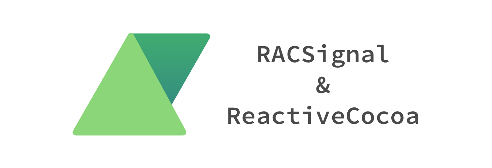

这篇以及之后的文章主要会对 ReactiveObjc v2.1.2 的实现进行分析，从最简单的例子中了解 ReactiveCocoa 的工作原理以及概念，也是笔者个人对于 RAC 学习的总结与理解。本文主要会围绕 RAC 中核心概念 `RACSignal` 展开，详细了解其底层实现。

## 状态驱动

2015 年的夏天的时候，做了几个简单的开源框架，想做点其它更有意思的框架却没什么思路，就开始看一些跟编程没有太大关系的书籍。

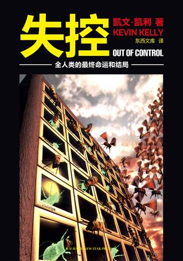

其中一本叫做《失控》给了我很大的启发，其中有一则故事是这样的：

> 布鲁克斯开展了一个雄心勃勃的研究生课题项目，研发更接近昆虫而非恐龙的机器人。
> 
> 布鲁克斯的设想在一个叫「成吉思」的机巧装置上成形。成吉思有橄榄球大小，像只蟑螂似的。布鲁克斯把他的精简理念发挥到了极致。小成吉思有 6 条腿却没有一丁点儿可以称为「脑」的东西。所有 12 个电机和 21 个传感器分布在没有中央处理器的可解耦网络上。然而这 12 个充当肌肉的电机和 21 个传感器之间的交互作用居然产生了令人惊叹的复杂性和类似生命体的行为。
> 
> 成吉思的每条小细腿都在自顾自地工作，和其余的腿毫无关系。每条腿都通过自己的一组神经元——一个微型处理器——来控制其动作。每条腿只需管好自己！对成吉思来说，走路是一个团队合作项目，至少有六个小头脑在工作。它体内其余更微小的脑力则负责腿与腿之间的通讯。昆虫学家说这正是蚂蚁和蟑螂的解决之道——这些爬行昆虫的足肢上的神经元负责为该足肢进行思考。
> 
> ------ 《失控》第三章·第二节 快速、廉价、失控


书中对于机器人的介绍比较冗长，在这里就简单总结一下：机器人的每一条腿都单独进行工作，通过传感器感应的**状态**做出响应：

+ 如果腿抬起来了，那么它要落下去；
+ 如果腿在向前动，要让另外五条腿距离它远一点；

这种去中心化的方式，简化了整个系统的构造，使得各个组件只需要关心状态，以及状态对应的动作；不再需要一个中枢系统来组织、管理其它的组件，并负责大多数的业务逻辑。这种自底向下的、状态驱动的构建方式能够使用多个较小的组件，减少臃肿的中枢出现的可能性，从而降低系统的复杂度。

## ReactiveCocoa 与信号

ReactiveCocoa 对于状态的理解与《失控》一书中十分类似，将原有的各种设计模式，包括代理、Target/Action、通知中心以及观察者模式各种『输入』，都抽象成了信号（也可以理解为状态流）让单一的组件能够对自己的响应动作进行控制，简化了视图控制器的负担。

在 ReactiveCocoa 中最重要的信号，也就是 `RACSignal` 对象是这一篇文章介绍的核心；文章中主要会介绍下面的代码片段出现的内容：

```objectivec
RACSignal *signal = [RACSignal createSignal:^RACDisposable * _Nullable(id<RACSubscriber>  _Nonnull subscriber) {
    [subscriber sendNext:@1];
    [subscriber sendNext:@2];
    [subscriber sendCompleted];
    return [RACDisposable disposableWithBlock:^{
        NSLog(@"dispose");
    }];
}];
[signal subscribeNext:^(id  _Nullable x) {
    NSLog(@"%@", x);
}];
```

在上述代码执行时，会在控制台中打印出以下内容：

```c
1
2
dispose
```

代码片段基本都是围绕 `RACSignal` 类进行的，文章会分四部分对上面的代码片段的工作流程进行简单的介绍：

+ 简单了解 `RACSignal`
+ 信号的创建
+ 信号的订阅与发送
+ 订阅的回收过程

## RACSignal 简介

`RACSignal` 其实是抽象类 `RACStream` 的子类，在整个 ReactiveObjc 工程中有另一个类 `RACSequence` 也继承自抽象类 `RACStream`：

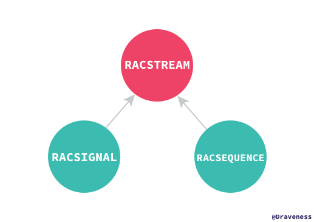

`RACSignal` 可以说是 ReactiveCocoa 中的核心类，也是最重要的概念，整个框架围绕着 `RACSignal` 的概念进行组织，对 `RACSignal` 最简单的理解就是它表示一连串的状态：

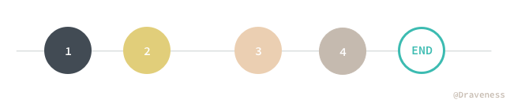

在状态改变时，对应的订阅者 `RACSubscriber` 就会收到通知执行相应的指令，在 ReactiveCocoa 的世界中所有的消息都是通过信号的方式来传递的，原有的设计模式都会简化为一种模型，这篇文章作为 ReactiveCocoa 系列的第一篇文章并不会对这些问题进行详细的展开和介绍，只会对 `RACSignal` 使用过程的原理进行简单的分析。

这一小节会对 `RACStream` 以及 `RACSignal` 中与 `RACStream` 相关的部分进行简单的介绍。

### RACStream

`RACStream` 作为抽象类本身不提供方法的实现，其实现内部原生提供的而方法都是抽象方法，会在调用时直接抛出异常：

```objectivec
+ (__kindof RACStream *)empty {
	NSString *reason = [NSString stringWithFormat:@"%@ must be overridden by subclasses", NSStringFromSelector(_cmd)];
	@throw [NSException exceptionWithName:NSInternalInconsistencyException reason:reason userInfo:nil];
}

- (__kindof RACStream *)bind:(RACStreamBindBlock (^)(void))block;
+ (__kindof RACStream *)return:(id)value;
- (__kindof RACStream *)concat:(RACStream *)stream;
- (__kindof RACStream *)zipWith:(RACStream *)stream;
```

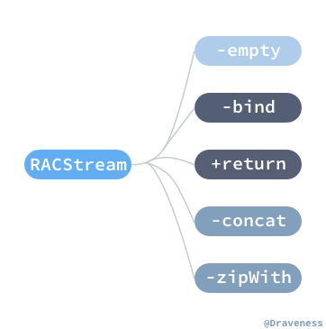

上面的这些抽象方法都需要子类覆写，不过 `RACStream` 在 `Operations` 分类中使用上面的抽象方法提供了丰富的内容，比如说 `-flattenMap:` 方法：

```objectivec
- (__kindof RACStream *)flattenMap:(__kindof RACStream * (^)(id value))block {
	Class class = self.class;

	return [[self bind:^{
		return ^(id value, BOOL *stop) {
			id stream = block(value) ?: [class empty];
			NSCAssert([stream isKindOfClass:RACStream.class], @"Value returned from -flattenMap: is not a stream: %@", stream);

			return stream;
		};
	}] setNameWithFormat:@"[%@] -flattenMap:", self.name];
}
```

其他方法比如 `-skip:`、`-take:`、`-ignore：` 等等实例方法都构建在这些抽象方法之上，只要子类覆写了所有抽象方法就能自动获得所有的 `Operation` 分类中的方法。

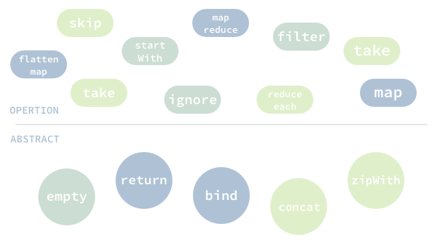

### RACSignal 与 Monad

> 如果你对 Monad 有所了解，那么你应该知道 `bind` 和 `return` 其实是 Monad 中的概念，但 Monad 并不是本篇文章所覆盖的内容，并不会具体解释它到底是什么。

ReactiveCocoa 框架中借鉴了很多其他平台甚至语言中的概念，包括微软中的 Reactive Extension 以及 Haskell 中的 Monad，`RACStream` 提供的抽象方法中的 `+return:` 和 `-bind:` 就与 Haskell 中 Monad 完全一样。

> 很多人都说 Monad 只是一个自函子范畴上的一个幺半群而已；在笔者看来这种说法虽然是正确的，不过也很扯淡，这句话解释了还是跟没解释一样，如果有人再跟你用这句话解释 Monad，我觉得你最好的回应就是买一本范畴论糊他一脸。如果真的想了解 Haskell 中的 Monad 到底是什么？可以从代码的角度入手，多写一些代码就明白了，这个概念理解起来其实根本没什么困难的，当然也可以看一下 [A Fistful of Monads](http://learnyouahaskell.com/a-fistful-of-monads)，写写其中的代码，会对 Monad 有自己的认知，当然，请不要再写一篇解释 Monad 的教程了（手动微笑）。

首先来看一下 `+return` 方法的 [实现](https://github.com/ReactiveCocoa/ReactiveObjC/blob/1180ab256000573ef82141e5d40e9b9c35dfd69c/ReactiveObjC/RACSignal.m#L89-L91)：

```objectivec
+ (RACSignal *)return:(id)value {
	return [RACReturnSignal return:value];
}
```

该方法接受一个 `NSObject` 对象，并返回一个 `RACSignal` 的实例，它会将一个 UIKit 世界的对象 `NSObject` 转换成 ReactiveCocoa 中的 `RACSignal`：

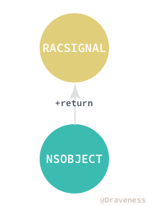

而 `RACReturnSignal` 也仅仅是把 `NSObject` 对象包装一下，并没有做什么复杂的事情：

```objectivec
+ (RACSignal *)return:(id)value {
	RACReturnSignal *signal = [[self alloc] init];
	signal->_value = value;
	return signal;
}
```

但是 `-bind:` 方法的 [实现](https://github.com/ReactiveCocoa/ReactiveObjC/blob/1180ab256000573ef82141e5d40e9b9c35dfd69c/ReactiveObjC/RACSignal.m#L93-L176) 相比之下就十分复杂了：

```objectivec
- (RACSignal *)bind:(RACSignalBindBlock (^)(void))block {
    return [[RACSignal createSignal:^(id<RACSubscriber> subscriber) {
        RACSignalBindBlock bindingBlock = block();
        return [self subscribeNext:^(id x) {
            BOOL stop = NO;
            id signal = bindingBlock(x, &stop);

            if (signal != nil) {
                [signal subscribeNext:^(id x) {
                    [subscriber sendNext:x];
                } error:^(NSError *error) {
                    [subscriber sendError:error];
                } completed:^{
                    [subscriber sendCompleted];
                }];
            }
            if (signal == nil || stop) {
                [subscriber sendCompleted];
            }
        } error:^(NSError *error) {
            [subscriber sendError:error];
        } completed:^{
            [subscriber sendCompleted];
        }];
    }] setNameWithFormat:@"[%@] -bind:", self.name];
}
```

> 笔者在这里对 `-bind:` 方法进行了大量的省略，省去了其中对各种 `RACDisposable` 的处理过程。

`-bind:` 方法会在原信号每次发出消息时，都执行 `RACSignalBindBlock` 对原有的信号中的消息进行**变换**生成一个新的信号：


> 在原有的 `RACSignal` 对象上调用 `-bind:` 方法传入 `RACSignalBindBlock`，图示中的右侧就是具体的执行过程，原信号在变换之后变成了新的蓝色的 `RACSignal` 对象。

`RACSignalBindBlock` 可以简单理解为一个接受 `NSObject` 对象返回 `RACSignal` 对象的函数：

```objectivec
typedef RACSignal * _Nullable (^RACSignalBindBlock)(id _Nullable value, BOOL *stop);
```

其函数签名可以理解为 `id -> RACSignal`，然而这种函数是无法直接对 `RACSignal` 对象进行变换的；不过通过 `-bind:` 方法就可以使用这种函数操作 `RACSignal`，其实现如下：

1. 将 `RACSignal` 对象『解包』出 `NSObject` 对象；
2. 将 `NSObject` 传入 `RACSignalBindBlock` 返回 `RACSignal`。

如果在不考虑 `RACSignal` 会发出错误或者完成信号时，`-bind:` 可以简化为更简单的形式：

```objectivec
- (RACSignal *)bind:(RACSignalBindBlock (^)(void))block {
    return [[RACSignal createSignal:^(id<RACSubscriber> subscriber) {
        RACSignalBindBlock bindingBlock = block();
        return [self subscribeNext:^(id x) {
            BOOL stop = NO;
            [bindingBlock(x, &stop) subscribeNext:^(id x) {
                [subscriber sendNext:x];
            }];
        }];
    }] setNameWithFormat:@"[%@] -bind:", self.name];
}
```

调用 `-subscribeNext:` 方法订阅当前信号，将信号中的状态解包，然后将原信号中的状态传入 `bindingBlock` 中并订阅返回的新的信号，将生成的新状态 `x` 传回原信号的订阅者。

这里通过两个简单的例子来了解 `-bind:` 方法的作用：

```objectivec
RACSignal *signal = [RACSignal createSignal:^RACDisposable * _Nullable(id<RACSubscriber>  _Nonnull subscriber) {
    [subscriber sendNext:@1];
    [subscriber sendNext:@2];
    [subscriber sendNext:@3];
    [subscriber sendNext:@4];
    [subscriber sendCompleted];
    return nil;
}];
RACSignal *bindSignal = [signal bind:^RACSignalBindBlock _Nonnull{
    return ^(NSNumber *value, BOOL *stop) {
        value = @(value.integerValue * value.integerValue);
        return [RACSignal return:value];
    };
}];
[signal subscribeNext:^(id  _Nullable x) {
    NSLog(@"signal: %@", x);
}];
[bindSignal subscribeNext:^(id  _Nullable x) {
    NSLog(@"bindSignal: %@", x);
}];
```

上面的代码中直接使用了 `+return:` 方法将 `value` 打包成了 `RACSignal *` 对象：


> 在 BindSignal 中的每一个数字其实都是由一个 `RACSignal` 包裹的，这里没有画出，在下一个例子中，读者可以清晰地看到其中的区别。

上图简要展示了变化前后的信号中包含的状态，在运行上述代码时，会在终端中打印出：

```objectivec
signal: 1
signal: 2
signal: 3
signal: 4
bindSignal: 1
bindSignal: 4
bindSignal: 9
bindSignal: 16
```

这是一个最简单的例子，直接使用 `-return:` 打包 `NSObject` 返回一个 `RACSignal`，接下来用一个更复杂的例子来帮助我们更好的了解 `-bind:` 方法：

```objectivec
RACSignal *signal = [RACSignal createSignal:^RACDisposable * _Nullable(id<RACSubscriber>  _Nonnull subscriber) {
    [subscriber sendNext:@1];
    [subscriber sendNext:@2];
    [subscriber sendCompleted];
    return nil;
}];
RACSignal *bindSignal = [signal bind:^RACSignalBindBlock _Nonnull{
    return ^(NSNumber *value, BOOL *stop) {
        NSNumber *returnValue = @(value.integerValue * value.integerValue);
        return [RACSignal createSignal:^RACDisposable * _Nullable(id<RACSubscriber>  _Nonnull subscriber) {
            for (NSInteger i = 0; i < value.integerValue; i++) [subscriber sendNext:returnValue];
            [subscriber sendCompleted];
            return nil;
        }];
    };
}];
[bindSignal subscribeNext:^(id  _Nullable x) {
    NSLog(@"%@", x);
}];
```

下图相比上面例子中的图片更能精确的表现出 `-bind:` 方法都做了什么：

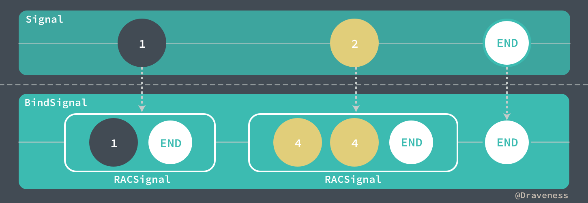

信号中原有的状态经过 `-bind:` 方法中传入 `RACSignalBindBlock` 的处理实际上返回了**多个** `RACSignal`。

在源代码的注释中清楚地写出了方法的实现过程：

1. 订阅原信号中的值；
2. 将原信号发出的值传入 `RACSignalBindBlock` 进行转换；
3. 如果 `RACSignalBindBlock` 返回一个信号，就会订阅该信号并将信号中的所有值传给订阅者 `subscriber`；
4. 如果 `RACSignalBindBlock` 请求终止信号就会向**原**信号发出 `-sendCompleted` 消息；
5. 当**所有**信号都完成时，会向订阅者发送 `-sendCompleted`；
6. 无论何时，如果信号发出错误，都会向订阅者发送 `-sendError:` 消息。

如果想要了解 `-bind:` 方法在执行的过程中是如何处理订阅的清理和销毁的，可以阅读文章最后的 [-bind: 中对订阅的销毁]() 部分。

## 信号的创建

信号的创建过程十分简单，`-createSignal:` 是推荐的创建信号的方法，方法其实只做了一次转发：

```objectivec
+ (RACSignal *)createSignal:(RACDisposable * (^)(id<RACSubscriber> subscriber))didSubscribe {
	return [RACDynamicSignal createSignal:didSubscribe];
}

+ (RACSignal *)createSignal:(RACDisposable * (^)(id<RACSubscriber> subscriber))didSubscribe {
	RACDynamicSignal *signal = [[self alloc] init];
	signal->_didSubscribe = [didSubscribe copy];
	return [signal setNameWithFormat:@"+createSignal:"];
}
```

该方法其实只是创建了一个 `RACDynamicSignal` 实例并保存了传入的 `didSubscribe` 代码块，在每次有订阅者订阅当前信号时，都会执行一遍，向订阅者发送消息。

### RACSignal 类簇

虽然 `-createSignal:` 的方法签名上返回的是 `RACSignal` 对象的实例，但是实际上这里返回的是 `RACDynamicSignal`，也就是 `RACSignal` 的子类；同样，在 ReactiveCocoa 中也有很多其他的 `RACSignal` 子类。

使用类簇的方式设计的 `RACSignal` 在创建实例时可能会返回 `RACDynamicSignal`、`RACEmptySignal`、`RACErrorSignal` 和 `RACReturnSignal` 对象：


其实这几种子类并没有对原有的 `RACSignal` 做出太大的改变，它们的创建过程也不是特别的复杂，只需要调用 `RACSignal` 不同的类方法：

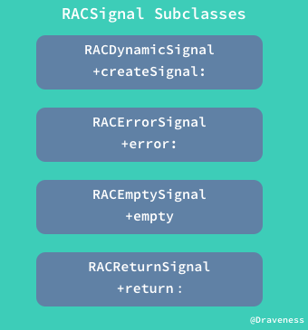

`RACSignal` 只是起到了一个代理的作用，最后的实现过程还是会指向对应的子类：

```objectivec
+ (RACSignal *)error:(NSError *)error {
	return [RACErrorSignal error:error];
}

+ (RACSignal *)empty {
	return [RACEmptySignal empty];
}

+ (RACSignal *)return:(id)value {
	return [RACReturnSignal return:value];
}
```

以 `RACReturnSignal` 的创建过程为例：

```objectivec
+ (RACSignal *)return:(id)value {
	RACReturnSignal *signal = [[self alloc] init];
	signal->_value = value;
	return signal;
}
```

这个信号的创建过程和 `RACDynamicSignal` 的初始化过程一样，都非常简单；只是将传入的 `value` 简单保存一下，在有其他订阅者 `-subscribe:` 时，向订阅者发送 `value`：

```objectivec
- (RACDisposable *)subscribe:(id<RACSubscriber>)subscriber {
	return [RACScheduler.subscriptionScheduler schedule:^{
		[subscriber sendNext:self.value];
		[subscriber sendCompleted];
	}];
}
```

`RACEmptySignal` 和 `RACErrorSignal` 的创建过程也异常的简单，只是对传入的数据进行简单的存储，然后在订阅时发送出来：

```objectivec
// RACEmptySignal
+ (RACSignal *)empty {
	return [[[self alloc] init] setNameWithFormat:@"+empty"];
}

- (RACDisposable *)subscribe:(id<RACSubscriber>)subscriber {
	return [RACScheduler.subscriptionScheduler schedule:^{
		[subscriber sendCompleted];
	}];
}

// RACErrorSignal
+ (RACSignal *)error:(NSError *)error {
	RACErrorSignal *signal = [[self alloc] init];
	signal->_error = error;
	return signal;
}

- (RACDisposable *)subscribe:(id<RACSubscriber>)subscriber {
	return [RACScheduler.subscriptionScheduler schedule:^{
		[subscriber sendError:self.error];
	}];
}
```

这两个创建过程的唯一区别就是一个发送的是『空值』，另一个是 `NSError` 对象。

## 信号的订阅与信息的发送

ReactiveCocoa 中信号的订阅与信息的发送过程主要是由 `RACSubscriber` 类来处理的，而这也是信号的处理过程中最重要的一部分，这一小节会先分析整个工作流程，之后会深入代码的实现。


在信号创建之后调用 `-subscribeNext:` 方法返回一个 `RACDisposable`，然而这不是这一流程关心的重点，在订阅过程中生成了一个 `RACSubscriber` 对象，向这个对象发送消息 `-sendNext:` 时，就会向所有的订阅者发送消息。

### 信号的订阅

信号的订阅与 `-subscribe:` 开头的一系列方法有关：


订阅者可以选择自己想要感兴趣的信息类型 `next/error/completed` 进行关注，并在对应的信息发生时调用 block 进行处理回调。

所有的方法其实只是对 `nextBlock`、`completedBlock` 以及 `errorBlock` 的组合，这里以其中最长的 `-subscribeNext:error:completed:` 方法的实现为例（也只需要介绍这一个方法）：

```objectivec
- (RACDisposable *)subscribeNext:(void (^)(id x))nextBlock error:(void (^)(NSError *error))errorBlock completed:(void (^)(void))completedBlock {
	RACSubscriber *o = [RACSubscriber subscriberWithNext:nextBlock error:errorBlock completed:completedBlock];
	return [self subscribe:o];
}
```

> 方法中传入的所有 block 参数都应该是非空的。

拿到了传入的 block 之后，使用 `+subscriberWithNext:error:completed:` 初始化一个 `RACSubscriber` 对象的实例：

```objectivec
+ (instancetype)subscriberWithNext:(void (^)(id x))next error:(void (^)(NSError *error))error completed:(void (^)(void))completed {
	RACSubscriber *subscriber = [[self alloc] init];

	subscriber->_next = [next copy];
	subscriber->_error = [error copy];
	subscriber->_completed = [completed copy];

	return subscriber;
}
```

在拿到这个对象之后，调用 `RACSignal` 的 `-subscribe:` 方法传入订阅者对象：

```objectivec
- (RACDisposable *)subscribe:(id<RACSubscriber>)subscriber {
	NSCAssert(NO, @"This method must be overridden by subclasses");
	return nil;
}
```

`RACSignal` 类中其实并没有实现这个实例方法，需要在上文提到的四个子类对这个方法进行覆写，这里仅分析 `RACDynamicSignal` 中的方法：

```objectivec
- (RACDisposable *)subscribe:(id<RACSubscriber>)subscriber {
    RACCompoundDisposable *disposable = [RACCompoundDisposable compoundDisposable];
    subscriber = [[RACPassthroughSubscriber alloc] initWithSubscriber:subscriber signal:self disposable:disposable];

    RACDisposable *schedulingDisposable = [RACScheduler.subscriptionScheduler schedule:^{
        RACDisposable *innerDisposable = self.didSubscribe(subscriber);
        [disposable addDisposable:innerDisposable];
    }];

    [disposable addDisposable:schedulingDisposable];
    
    return disposable;
}
```

> 这里暂时不需要关注与 `RACDisposable` 有关的任何内容，我们会在下一节中详细介绍。

`RACPassthroughSubscriber` 就像它的名字一样，只是对上面创建的订阅者对象进行简单的包装，将所有的消息转发给内部的 `innerSubscriber`，也就是传入的 `RACSubscriber` 对象：

```objectivec
- (instancetype)initWithSubscriber:(id<RACSubscriber>)subscriber signal:(RACSignal *)signal disposable:(RACCompoundDisposable *)disposable {
	self = [super init];

	_innerSubscriber = subscriber;
	_signal = signal;
	_disposable = disposable;

	[self.innerSubscriber didSubscribeWithDisposable:self.disposable];
	return self;
}
```

如果直接简化 `-subscribe:` 方法的实现，你可以看到一个看起来极为敷衍的代码：

```objectivec
- (RACDisposable *)subscribe:(id<RACSubscriber>)subscriber {
    return self.didSubscribe(subscriber);
}
```

方法只是执行了在创建信号时传入的 `RACSignalBindBlock`：

```objectivec
[RACSignal createSignal:^RACDisposable * _Nullable(id<RACSubscriber>  _Nonnull subscriber) {
    [subscriber sendNext:@1];
    [subscriber sendNext:@2];
    [subscriber sendCompleted];
    return [RACDisposable disposableWithBlock:^{
        NSLog(@"dispose");
    }];
}];
```

总而言之，信号的订阅过程就是初始化 `RACSubscriber` 对象，然后执行 `didSubscribe` 代码块的过程。

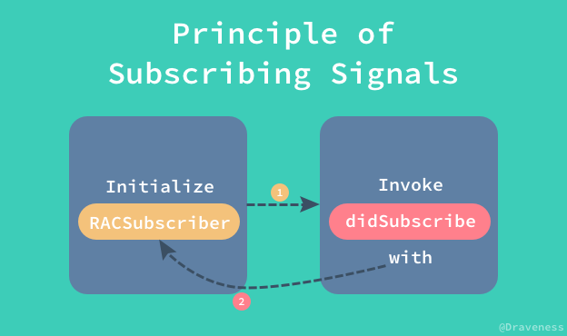

### 信息的发送

在 `RACSignalBindBlock` 中，订阅者可以根据自己的兴趣选择自己想要订阅哪种消息；我们也可以按需发送三种消息：

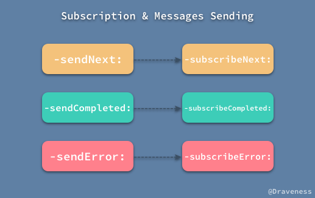

而现在只需要简单看一下这三个方法的实现，就能够明白信息的发送过程了（真是没啥好说的，不过为了~~凑字数~~完整性）：

```objectivec
- (void)sendNext:(id)value {
	@synchronized (self) {
		void (^nextBlock)(id) = [self.next copy];
		if (nextBlock == nil) return;

		nextBlock(value);
	}
}
```

`-sendNext:` 只是将方法传入的值传入 `nextBlock` 再调用一次，并没有什么值得去分析的地方，而剩下的两个方法实现也差不多，会调用对应的 block，在这里就省略了。

## 订阅的回收过程

在创建信号时，我们向 `-createSignal:` 方法中传入了 `didSubscribe` 信号，这个 block 在执行结束时会返回一个 `RACDisposable` 对象，用于在订阅结束时进行必要的清理，同样也可以用于取消因为订阅创建的**正在执行**的任务。

而处理这些事情的核心类就是 `RACDisposable` 以及它的子类：

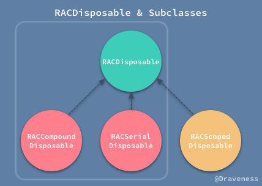

> 这篇文章中主要关注的是左侧的三个子类，当然 `RACDisposable` 的子类不止这三个，还有用于处理 KVO 的 `RACKVOTrampoline`，不过在这里我们不会讨论这个类的实现。

### RACDisposable

在继续分析讨论订阅的回收过程之前，笔者想先对 `RACDisposable` 进行简要的剖析和介绍：

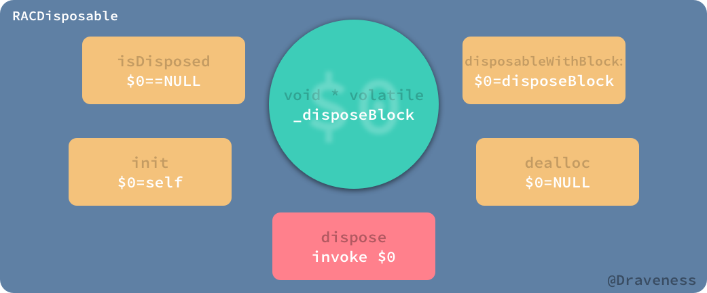

类 `RACDisposable` 是以 `_disposeBlock` 为核心进行组织的，几乎所有的方法以及属性其实都是对 `_disposeBlock` 进行的操作。

#### 关于 _disposeBlock 中的 self

> 这一小节的内容是可选的，跳过不影响整篇文章阅读的连贯性。

`_disposeBlock` 是一个私有的指针变量，当 `void (^)(void)` 类型的 block 被传入之后都会转换成 CoreFoundation 中的类型并以 `void *` 的形式存入 `_disposeBlock` 中：

```objectivec

+ (instancetype)disposableWithBlock:(void (^)(void))block {
	return [[self alloc] initWithBlock:block];
}

- (instancetype)initWithBlock:(void (^)(void))block {
	self = [super init];

	_disposeBlock = (void *)CFBridgingRetain([block copy]); 
	OSMemoryBarrier();

	return self;
}
```

奇怪的是，`_disposeBlock` 中不止会存储代码块 block，还有可能存储桥接之后的 `self`：

```objectivec
- (instancetype)init {
	self = [super init];

	_disposeBlock = (__bridge void *)self;
	OSMemoryBarrier();

	return self;
}
```

这里，刚开始看到可能会觉得比较奇怪，有两个疑问需要解决：

1. 为什么要提供一个 `-init` 方法来初始化 `RACDisposable` 对象？
2. 为什么要向 `_disposeBlock` 中传入当前对象？

对于 `RACDisposable` 来说，虽然一个不包含 `_disposeBlock` 的对象没什么太多的意义，但是对于 `RACSerialDisposable` 等子类来说，却不完全是这样，因为 `RACSerialDisposable` 在 `-dispose` 时，并不需要执行 `disposeBlock`，这样就浪费了内存和 CPU 时间；但是同时我们需要一个合理的方法准确地判断当前对象的 `isDisposed`：

```objectivec
- (BOOL)isDisposed {
	return _disposeBlock == NULL;
}
```

所以，使用向 `_disposeBlock` 中传入 `NULL` 的方式来判断 `isDisposed`；在 `-init` 调用时传入 `self` 而不是 `NULL` 防止状态被误判，这样就在不引入其他实例变量、增加对象的设计复杂度的同时，解决了这两个问题。

如果仍然不理解上述的两个问题，在这里举一个错误的例子，如果 `_disposeBlock` 在使用时只传入 `NULL` 或者 `block`，那么在 `RACCompoundDisposable` 初始化时，是应该向 `_disposeBlock` 中传入什么呢？

+ 传入 `NULL` 会导致在初始化之后 `isDisposed == YES`，然而当前对象根本没有被回收；
+ 传入 `block` 会导致无用的 block 的执行，浪费内存以及 CPU 时间；

这也就是为什么要引入 `self` 来作为 `_disposeBlock` 内容的原因。

#### -dispose: 方法的实现

这个只有不到 20 行的 `-dispose:` 方法已经是整个 `RACDisposable` 类中最复杂的方法了：

```objectivec
- (void)dispose {
	void (^disposeBlock)(void) = NULL;

	while (YES) {
		void *blockPtr = _disposeBlock;
		if (OSAtomicCompareAndSwapPtrBarrier(blockPtr, NULL, &_disposeBlock)) {
			if (blockPtr != (__bridge void *)self) {
				disposeBlock = CFBridgingRelease(blockPtr);
			}

			break;
		}
	}

	if (disposeBlock != nil) disposeBlock();
}
```

但是其实它的实现也没有复杂到哪里去，从 `_disposeBlock` 实例变量中调用 `CFBridgingRelease` 取出一个 `disposeBlock`，然后执行这个 block，整个方法就结束了。

### RACSerialDisposable

`RACSerialDisposable` 是一个用于持有 `RACDisposable` 的容器，它一次只能持有一个 `RACDisposable` 的实例，并可以原子地换出容器中保存的对象：

```objectivec
- (RACDisposable *)swapInDisposable:(RACDisposable *)newDisposable {
	RACDisposable *existingDisposable;
	BOOL alreadyDisposed;

	pthread_mutex_lock(&_mutex);
	alreadyDisposed = _disposed;
	if (!alreadyDisposed) {
		existingDisposable = _disposable;
		_disposable = newDisposable;
	}
	pthread_mutex_unlock(&_mutex);

	if (alreadyDisposed) {
		[newDisposable dispose];
		return nil;
	}

	return existingDisposable;
}
```

线程安全的 `RACSerialDisposable` 使用 `pthred_mutex_t` 互斥锁来保证在访问关键变量时不会出现线程竞争问题。

`-dispose` 方法的处理也十分简单：

```objectivec
- (void)dispose {
	RACDisposable *existingDisposable;

	pthread_mutex_lock(&_mutex);
	if (!_disposed) {
		existingDisposable = _disposable;
		_disposed = YES;
		_disposable = nil;
	}
	pthread_mutex_unlock(&_mutex);
	
	[existingDisposable dispose];
}
```

使用锁保证线程安全，并在内部的 `_disposable` 换出之后在执行 `-dispose` 方法对订阅进行处理。

### RACCompoundDisposable

与 `RACSerialDisposable` 只负责一个 `RACDisposable` 对象的释放不同；`RACCompoundDisposable` 同时负责多个 `RACDisposable` 对象的释放。

相比于只管理一个 `RACDisposable` 对象的 `RACSerialDisposable`，`RACCompoundDisposable` 由于管理多个对象，其实现更加复杂，而且为了**性能和内存占用之间的权衡**，其实现方式是通过持有两个实例变量：

```objectivec
@interface RACCompoundDisposable () {
    ...
    RACDisposable *_inlineDisposables[RACCompoundDisposableInlineCount];

    CFMutableArrayRef _disposables;
    ...
}
```

在对象持有的 `RACDisposable` 不超过 `RACCompoundDisposableInlineCount` 时，都会存储在 `_inlineDisposables` 数组中，而更多的实例都会存储在 `_disposables` 中：

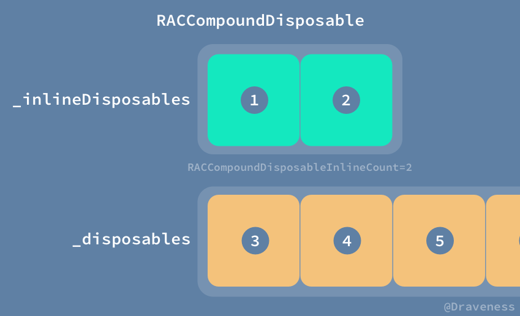

`RACCompoundDisposable` 在使用 `-initWithDisposables:`初始化时，会初始化两个 `RACDisposable` 的位置用于加速销毁订阅的过程，同时为了不浪费内存空间，在默认情况下只占用两个位置：

```objectivec
- (instancetype)initWithDisposables:(NSArray *)otherDisposables {
	self = [self init];

	[otherDisposables enumerateObjectsUsingBlock:^(RACDisposable *disposable, NSUInteger index, BOOL *stop) {
		self->_inlineDisposables[index] = disposable;
		if (index == RACCompoundDisposableInlineCount - 1) *stop = YES;
	}];

	if (otherDisposables.count > RACCompoundDisposableInlineCount) {
		_disposables = RACCreateDisposablesArray();

		CFRange range = CFRangeMake(RACCompoundDisposableInlineCount, (CFIndex)otherDisposables.count - RACCompoundDisposableInlineCount);
		CFArrayAppendArray(_disposables, (__bridge CFArrayRef)otherDisposables, range);
	}

	return self;
}
```

如果传入的 `otherDisposables` 多于 `RACCompoundDisposableInlineCount`，就会创建一个新的 `CFMutableArrayRef` 引用，并将剩余的 `RACDisposable` 全部传入这个数组中。

在 `RACCompoundDisposable` 中另一个值得注意的方法就是 `-addDisposable:`

```objectivec
- (void)addDisposable:(RACDisposable *)disposable {
	if (disposable == nil || disposable.disposed) return;

	BOOL shouldDispose = NO;

	pthread_mutex_lock(&_mutex);
	{
		if (_disposed) {
			shouldDispose = YES;
		} else {
			for (unsigned i = 0; i < RACCompoundDisposableInlineCount; i++) {
				if (_inlineDisposables[i] == nil) {
					_inlineDisposables[i] = disposable;
					goto foundSlot;
				}
			}

			if (_disposables == NULL) _disposables = RACCreateDisposablesArray();
			CFArrayAppendValue(_disposables, (__bridge void *)disposable);
		foundSlot:;
		}
	}
	pthread_mutex_unlock(&_mutex);
	if (shouldDispose) [disposable dispose];
}
```

在向 `RACCompoundDisposable` 中添加新的 `RACDisposable` 对象时，会先尝试在 `_inlineDisposables` 数组中寻找空闲的位置，如果没有找到，就会加入到 `_disposables` 中；但是，在添加 `RACDisposable` 的过程中也难免遇到当前 `RACCompoundDisposable` 已经 `dispose` 的情况，而这时就会直接 `-dispose` 刚刚加入的对象。

### 订阅的销毁过程

在了解了 ReactiveCocoa 中与订阅销毁相关的类，我们就可以继续对 `-bind:` 方法的分析了，之前在分析该方法时省略了 `-bind:` 在执行过程中是如何处理订阅的清理和销毁的，所以会省略对于正常值和错误的处理过程，首先来看一下简化后的代码：

```objectivec
- (RACSignal *)bind:(RACSignalBindBlock (^)(void))block {
    return [[RACSignal createSignal:^(id<RACSubscriber> subscriber) {
        RACSignalBindBlock bindingBlock = block();
        __block volatile int32_t signalCount = 1;
        RACCompoundDisposable *compoundDisposable = [RACCompoundDisposable compoundDisposable];

        void (^completeSignal)(RACDisposable *) = ...
        void (^addSignal)(RACSignal *) = ...

        RACSerialDisposable *selfDisposable = [[RACSerialDisposable alloc] init];
        [compoundDisposable addDisposable:selfDisposable];
        RACDisposable *bindingDisposable = [self subscribeNext:^(id x) {
            BOOL stop = NO;
            id signal = bindingBlock(x, &stop);

            if (signal != nil) addSignal(signal);
            if (signal == nil || stop) {
                [selfDisposable dispose];
                completeSignal(selfDisposable);
            }
        } completed:^{
            completeSignal(selfDisposable);
        }];
        selfDisposable.disposable = bindingDisposable;
        return compoundDisposable;
    }] setNameWithFormat:@"[%@] -bind:", self.name];
}
```

在简化的代码中，订阅的清理是由一个 `RACCompoundDisposable` 的实例负责的，向这个实例中添加 `RACSerialDisposable` 以及 `RACDisposable` 对象，并在 `RACCompoundDisposable` 销毁时销毁。

`completeSignal` 和 `addSignal` 两个 block 主要负责处理新创建信号的清理工作：

```objectivec
void (^completeSignal)(RACDisposable *) = ^(RACDisposable *finishedDisposable) {
    if (OSAtomicDecrement32Barrier(&signalCount) == 0) {
        [subscriber sendCompleted];
        [compoundDisposable dispose];
    } else {
        [compoundDisposable removeDisposable:finishedDisposable];
    }
};

void (^addSignal)(RACSignal *) = ^(RACSignal *signal) {
    OSAtomicIncrement32Barrier(&signalCount);
    RACSerialDisposable *selfDisposable = [[RACSerialDisposable alloc] init];
    [compoundDisposable addDisposable:selfDisposable];
    RACDisposable *disposable = [signal completed:^{
        completeSignal(selfDisposable);
    }];
    selfDisposable.disposable = disposable;
};
```

先通过一个例子来看一下 `-bind:` 方法调用之后，订阅是如何被清理的：

```objectivec
RACSignal *signal = [RACSignal createSignal:^RACDisposable * _Nullable(id<RACSubscriber>  _Nonnull subscriber) {
    [subscriber sendNext:@1];
    [subscriber sendNext:@2];
    [subscriber sendCompleted];
    return [RACDisposable disposableWithBlock:^{
        NSLog(@"Original Signal Dispose.");
    }];
}];
RACSignal *bindSignal = [signal bind:^RACSignalBindBlock _Nonnull{
    return ^(NSNumber *value, BOOL *stop) {
        NSNumber *returnValue = @(value.integerValue);
        return [RACSignal createSignal:^RACDisposable * _Nullable(id<RACSubscriber>  _Nonnull subscriber) {
            for (NSInteger i = 0; i < value.integerValue; i++) [subscriber sendNext:returnValue];
            [subscriber sendCompleted];
            return [RACDisposable disposableWithBlock:^{
                NSLog(@"Binding Signal Dispose.");
            }];
        }];
    };
}];
[bindSignal subscribeNext:^(id  _Nullable x) {
    NSLog(@"%@", x);
}];
```

在每个订阅创建以及所有的值发送之后，订阅就会被就地销毁，调用 `disposeBlock`，并从 `RACCompoundDisposable` 实例中移除：

```objectivec
1
Binding Signal Dispose.
2
2
Binding Signal Dispose.
Original Signal Dispose.
```

原订阅的销毁时间以及绑定信号的控制是由 `SignalCount` 控制的，其表示 `RACCompoundDisposable` 中的 `RACSerialDisposable` 实例的个数，在每次有新的订阅被创建时都会向 `RACCompoundDisposable` 加入一个新的 `RACSerialDisposable`，并在订阅发送结束时从数组中移除，整个过程用图示来表示比较清晰：

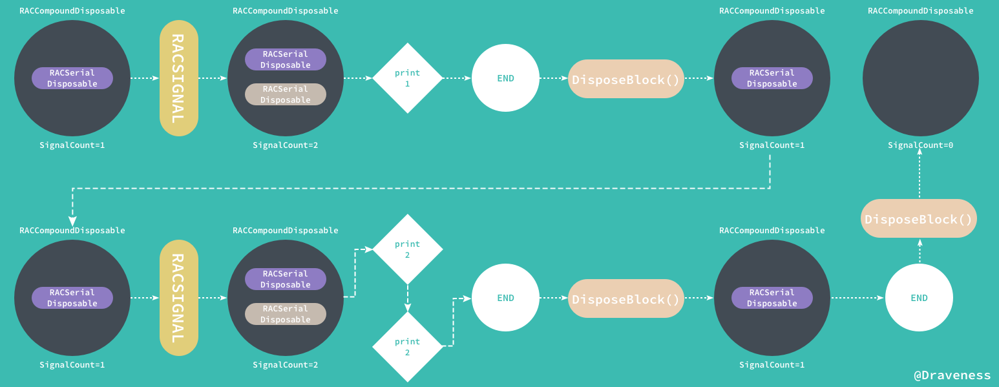

> 紫色的 `RACSerialDisposable` 为原订阅创建的对象，灰色的为新信号订阅的对象。

## 总结

这是整个 ReactiveCocoa 源代码分析系列文章的第一篇，想写一个跟这个系列有关的代码已经很久了，文章中对于 `RACSignal` 进行了一些简单的介绍，项目中绝大多数的方法都是很简洁的，行数并不多，代码的组织方式也很易于理解。虽然没有太多让人意外的东西，不过整个工程还是很值得阅读的。

## References

+ [A Fistful of Monads](http://learnyouahaskell.com/a-fistful-of-monads)
+ [What is (functional) reactive programming?](http://stackoverflow.com/questions/1028250/what-is-functional-reactive-programming/1030631#1030631)

## 方法实现对照表

| 方法 | 实现 |
| :-: | :-: |
| `+return:` | [RACSignal.m#L89-L91](https://github.com/ReactiveCocoa/ReactiveObjC/blob/1180ab256000573ef82141e5d40e9b9c35dfd69c/ReactiveObjC/RACSignal.m#L89-L91)|
|  `-bind:` | [RACSignal.m#L93-176](https://github.com/ReactiveCocoa/ReactiveObjC/blob/1180ab256000573ef82141e5d40e9b9c35dfd69c/ReactiveObjC/RACSignal.m#L93-L176) |

> Github Repo：[iOS-Source-Code-Analyze](https://github.com/draveness/iOS-Source-Code-Analyze)
> 
> Follow: [Draveness · GitHub](https://github.com/Draveness)
>
> Source: http://draveness.me/racsignal


