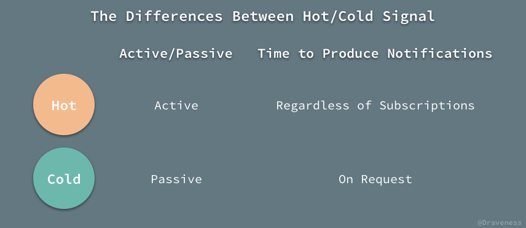
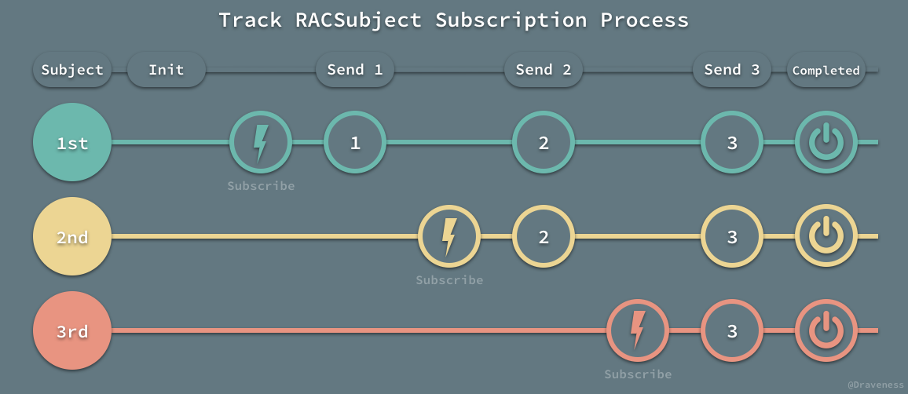
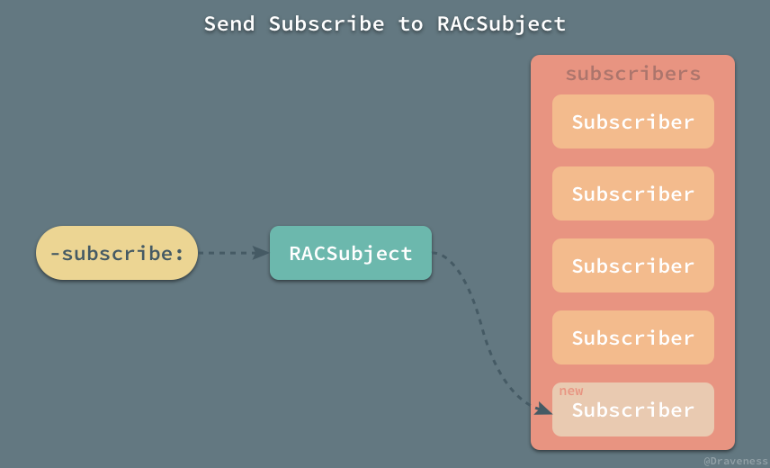
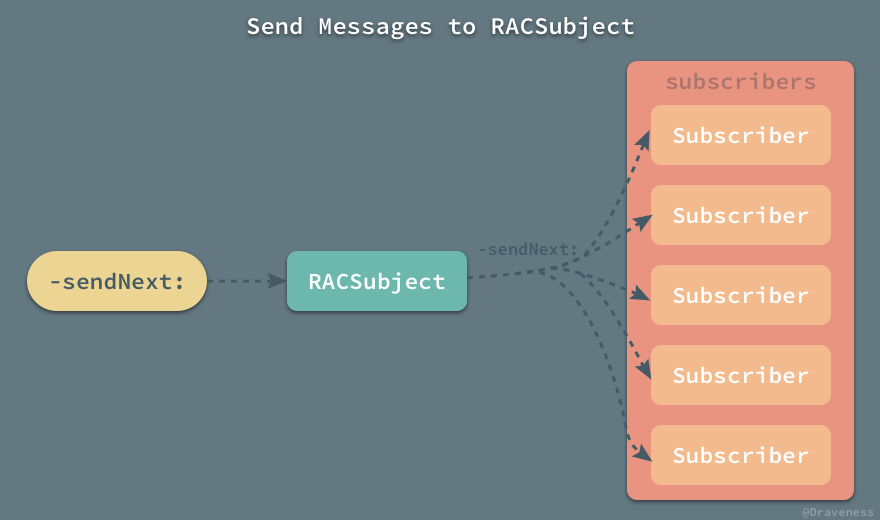
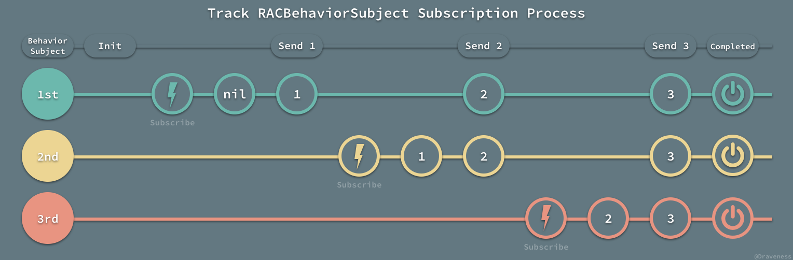
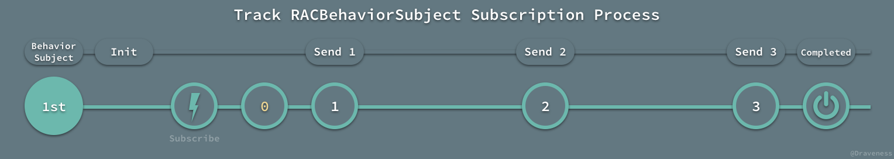
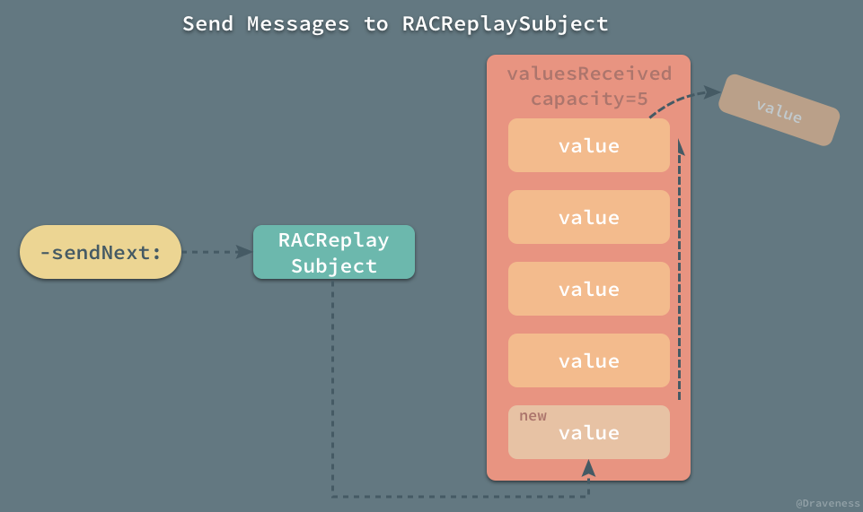
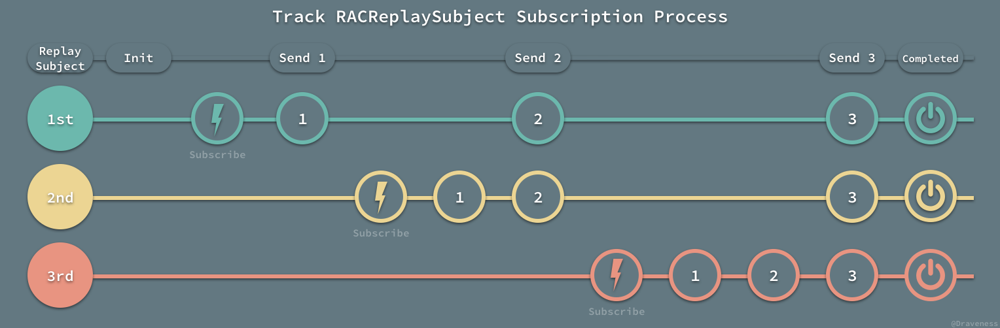

# 『可变』的热信号 RACSubject

在 ReactiveCocoa 中除了不可变的信号 `RACSignal`，也有用于桥接非 RAC 代码到 ReactiveCocoa 世界的『可变』信号 `RACSubject`。


`RACSubject` 到底是什么？根据其字面意思，可以将它理解为一个可以订阅的主题，我们在订阅主题之后，向主题发送新的消息时，**所有**的订阅者都会接收到最新的消息。

但是这么解释确实有点晦涩，也不易于理解，ReactiveCocoa 团队对 `RACSubject` 的解释是，`RACSubject` 其实就是一个可以**手动**控制的信号（感觉这么解释更难理解了）。

> A subject, represented by the RACSubject class, is a signal that can be manually controlled.

## RACSubject 简介

`RACSubject` 是 `RACSignal` 的子类，与 `RACSignal` 以及 `RACSequence` 有着众多的类簇不同，`RACSubject` 在整个工程中并没有多少子类；不过，在大多数情况下，我们也只会使用 `RACSubject` 自己或者 `RACReplaySubject`。


相比于 `RACSignal` 丰富的头文件 ，`RACSubject` 对外的接口并没有提供太多的方法：

```objectivec
@interface RACSubject : RACSignal <RACSubscriber>

+ (instancetype)subject;

@end
```

唯一提供的接口就是用于返回一个新实例的 `+subject` 方法；除此之外，在笔者看来它与 `RACSignal` 最大的不同就是：`RACSubject` 实现了 `RACSubscriber` 协议，也就是下面的这些方法：

```objectivec
@protocol RACSubscriber <NSObject>
@required

- (void)sendNext:(nullable id)value;
- (void)sendError:(nullable NSError *)error;
- (void)sendCompleted;
- (void)didSubscribeWithDisposable:(RACCompoundDisposable *)disposable;

@end
```

我们并不能在一个 `RACSignal` 对象上执行这些方法，只能在创建信号的 block 里面向遵循 `RACSubscriber` 协议的对象发送新的值或者错误，这也是 `RACSubject` 和父类最大的不同：在 `RACSubject` 实例初始化之后，也可以通过这个实例向所有的订阅者发送消息。

## 冷信号与热信号

提到 `RACSubject` 就不得不提 ReactiveCocoa 中的另一对概念，冷信号和热信号。

> 其实解释这两者之间区别的文章已经很多了，我相信各位读者能找到很多的资料，在这里就简单介绍一下冷热信号的概念，如果想要了解更多的内容可以在 [References](#references) 中找到更多的文章。

对于冷热信号概念，我们借用 Rx 中的描述：



> Cold signal is sequences that are passive and start producing notifications on request (when subscribed to), and hot signal is sequences that are active and produce notifications regardless of subscriptions. ---- [Hot and Cold observables](http://www.introtorx.com/content/v1.0.10621.0/14_HotAndColdObservables.html)

冷信号是被动的，只会在被订阅时向订阅者发送通知；热信号是主动的，它会在任意时间发出通知，与订阅者的订阅时间无关。

也就是说冷信号所有的订阅者会在订阅时收到完全相同的序列；而订阅热信号之后，只会收到在订阅之后发出的序列。

> 热信号的订阅者能否收到消息取决于订阅的时间。

热信号在我们生活中有很多的例子，比如订阅杂志时并不会把之前所有的期刊都送到我们手中，只会接收到订阅之后的期刊；而对于冷信号的话，举一个不恰当的例子，每一年的高考考生在『订阅』高考之后，收到往年所有的试卷，并在高考之后会取消订阅。

## 热信号 RACSubject

在 ReactiveCocoa 中，我们使用 `RACSignal` 来表示冷信号，也就是每一个订阅者在订阅信号时都会收到完整的序列；`RACSubject` 用于表示热信号，订阅者接收到多少值取决于它订阅的时间。

前面的文章中已经对 `RACSignal` 冷信号有了很多的介绍，这里也就不会多说了；这一小节主要的内容是想通过一个例子，简单展示 `RACSubject` 的订阅者收到的内容与订阅时间的关系：

```objectivec
RACSubject *subject = [RACSubject subject];

// Subscriber 1
[subject subscribeNext:^(id  _Nullable x) {
    NSLog(@"1st Sub: %@", x);
}];
[subject sendNext:@1];

// Subscriber 2
[subject subscribeNext:^(id  _Nullable x) {
    NSLog(@"2nd Sub: %@", x);
}];
[subject sendNext:@2];

// Subscriber 3
[subject subscribeNext:^(id  _Nullable x) {
    NSLog(@"3rd Sub: %@", x);
}];
[subject sendNext:@3];
[subject sendCompleted];
```

这里以图的方式来展示整个订阅与订阅者接收消息的过程：



从图中我们可以清楚的看到，几个订阅者根据**订阅时间**的不同收到了不同的数字序列，`RACSubject` 是**时间相关**的，它在发送消息时只会向已订阅的订阅者推送消息。

## RACSubject 的实现

`RACSubject` 的实现并不复杂，它『可变』的特性都来源于持有的订阅者数组 `subscribers`，在每次执行 `subscribeNext:error:completed:` 一类便利方法时，都会将传入的 `id<RACSubscriber>` 对象加入数组：

```objectivec
- (RACDisposable *)subscribe:(id<RACSubscriber>)subscriber {
	RACCompoundDisposable *disposable = [RACCompoundDisposable compoundDisposable];
	subscriber = [[RACPassthroughSubscriber alloc] initWithSubscriber:subscriber signal:self disposable:disposable];

	NSMutableArray *subscribers = self.subscribers;
	@synchronized (subscribers) {
		[subscribers addObject:subscriber];
	}

	[disposable addDisposable:[RACDisposable disposableWithBlock:^{
		@synchronized (subscribers) {
			NSUInteger index = [subscribers indexOfObjectWithOptions:NSEnumerationReverse passingTest:^ BOOL (id<RACSubscriber> obj, NSUInteger index, BOOL *stop) {
				return obj == subscriber;
			}];

			if (index != NSNotFound) [subscribers removeObjectAtIndex:index];
		}
	}]];

	return disposable;
}
```

订阅的过程分为三个部分：

1. 初始化一个 `RACPassthroughSubscriber` 实例；
2. 将 `subscriber` 加入 `RACSubject` 持有的数组中；
3. 创建一个 `RACDisposable` 对象，在当前 `subscriber` 销毁时，将自身从数组中移除。



`-subscribe:` 将所有遵循 `RACSubscriber` 协议的对象全部加入当前 `RACSubject` 持有的数组 `subscribers` 中。

在上一节的例子中，我们能对 `RACSubject` 发送 `-sendNext:` 等消息也都取决于它实现了 `RACSubscriber` 协议：

```objectivec
- (void)sendNext:(id)value {
	[self enumerateSubscribersUsingBlock:^(id<RACSubscriber> subscriber) {
		[subscriber sendNext:value];
	}];
}

- (void)sendError:(NSError *)error {
	[self.disposable dispose];

	[self enumerateSubscribersUsingBlock:^(id<RACSubscriber> subscriber) {
		[subscriber sendError:error];
	}];
}

- (void)sendCompleted {
	[self.disposable dispose];

	[self enumerateSubscribersUsingBlock:^(id<RACSubscriber> subscriber) {
		[subscriber sendCompleted];
	}];
}
```

`RACSubject` 会在自身接受到这些方法时，下发给持有的全部的 `subscribers`。



代码中的 `-enumerateSubscribersUsingBlock:` 只是一个使用 `for` 循环遍历 `subscribers` 的安全方法：

```objectivec
- (void)enumerateSubscribersUsingBlock:(void (^)(id<RACSubscriber> subscriber))block {
	NSArray *subscribers;
	@synchronized (self.subscribers) {
		subscribers = [self.subscribers copy];
	}

	for (id<RACSubscriber> subscriber in subscribers) {
		block(subscriber);
	}
}
```

`RACSubject` 就是围绕一个 `NSMutableArray` 数组实现的，实现还是非常简单的，只是在需要访问 `subscribers` 的方法中使用 `@synchronized` 避免线程竞争。

```objectivec
@interface RACSubject ()

@property (nonatomic, strong, readonly) NSMutableArray *subscribers;

@end
```

`RACSubject` 提供的初始化类方法 `+subject` 也只是初始化了几个成员变量：

```objectivec
+ (instancetype)subject {
	return [[self alloc] init];
}

- (instancetype)init {
	self = [super init];
	if (self == nil) return nil;

	_disposable = [RACCompoundDisposable compoundDisposable];
	_subscribers = [[NSMutableArray alloc] initWithCapacity:1];

	return self;
}
```

至此，对于 `RACSubject` 的分析就结束了，接下来会分析更多的子类。

## RACBehaviorSubject 与 RACReplaySubject

这一节会介绍 `RACSubject` 的两个子类 `RACBehaviorSubject` 和 `RACReplaySubject`，前者在订阅时会向订阅者发送最新的消息，后者在订阅之后**可以**重新发送之前的**所有**消息序列。

### RACBehaviorSubject

先来介绍两者中实现较简单的 `RACBehaviorSubject`，它在内部会保存一个 `currentValue` 对象，也就是最后一次发送的消息：

```objectivec
@interface RACBehaviorSubject ()

@property (nonatomic, strong) id currentValue;

@end
```

在每次执行 `-sendNext:` 时，都会对 `RACBehaviorSubject` 中保存的 `currentValue` 进行更新，并使用父类的 `-sendNext:` 方法，向所有的订阅者发送最新的消息：

```objectivec
- (void)sendNext:(id)value {
	@synchronized (self) {
		self.currentValue = value;
		[super sendNext:value];
	}
}
```

`RACBehaviorSubject` 最重要的特性就是在订阅时，向最新的订阅者发送之前的消息，这是通过覆写 `-subscribe:` 方法实现的。

在调用子类的 `-subscribe:` 方法之后，会在 `subscriber` 对象上执行 `-sendNext:` 方法：

```objectivec
- (RACDisposable *)subscribe:(id<RACSubscriber>)subscriber {
	RACDisposable *subscriptionDisposable = [super subscribe:subscriber];

	RACDisposable *schedulingDisposable = [RACScheduler.subscriptionScheduler schedule:^{
		@synchronized (self) {
			[subscriber sendNext:self.currentValue];
		}
	}];

	return [RACDisposable disposableWithBlock:^{
		[subscriptionDisposable dispose];
		[schedulingDisposable dispose];
	}];
}
```

接下来，通过一个简单的例子来演示 `RACBehaviorSubject` 到底是如何工作的：

```objectivec
RACBehaviorSubject *subject = [RACBehaviorSubject subject];

[subject subscribeNext:^(id  _Nullable x) {
    NSLog(@"1st Sub: %@", x);
}];
[subject sendNext:@1];

[subject subscribeNext:^(id  _Nullable x) {
    NSLog(@"2nd Sub: %@", x);
}];
[subject sendNext:@2];

[subject subscribeNext:^(id  _Nullable x) {
    NSLog(@"3rd Sub: %@", x);
}];
[subject sendNext:@3];
[subject sendCompleted];
```

上面的代码其实与 `RACSubject` 一节中的代码差不多，只将 `RACSubject` 转换成了 `RACBehaviorSubject` 对象。



在每次订阅者订阅 `RACBehaviorSubject` 之后，都会向该订阅者发送**最新**的消息，这也就是 `RACBehaviorSubject` 最重要的行为。

`RACBehaviorSubject` 有一个用于创建包含默认值的类方法 `+behaviorSubjectWithDefaultValue:`，如果将上面的第一行代码改成：

```objectivec
RACBehaviorSubject *subject = [RACBehaviorSubject behaviorSubjectWithDefaultValue:@0];
```

那么在第一个订阅者刚订阅 `RACBehaviorSubject` 时就会收到 `@0` 对象。



### RACReplaySubject

`RACReplaySubject` 相当于一个自带 `buffer` 的 `RACBehaviorSubject`，它可以在每次有新的订阅者订阅之后发送之前的全部消息。

```objectivec
@interface RACReplaySubject ()

@property (nonatomic, assign, readonly) NSUInteger capacity;
@property (nonatomic, strong, readonly) NSMutableArray *valuesReceived;

@end
```

实现的方式是通过持有一个 `valuesReceived` 的数组和能够存储的对象的上限 `capacity`，默认值为：

```objectivec
const NSUInteger RACReplaySubjectUnlimitedCapacity = NSUIntegerMax;
```

当然你可以用 `+replaySubjectWithCapacity:` 初始化一个其它大小的 `RACReplaySubject` 对象：

```objectivec
+ (instancetype)replaySubjectWithCapacity:(NSUInteger)capacity {
	return [(RACReplaySubject *)[self alloc] initWithCapacity:capacity];
}

- (instancetype)initWithCapacity:(NSUInteger)capacity {
	self = [super init];

	_capacity = capacity;
	_valuesReceived = (capacity == RACReplaySubjectUnlimitedCapacity ? [NSMutableArray array] : [NSMutableArray arrayWithCapacity:capacity]);

	return self;
}
```

在每次调用 `-sendNext:` 方法发送消息时，都会将其加入 `valuesReceived` 数组中，并踢出之前的元素：

```objectivec
- (void)sendNext:(id)value {
	@synchronized (self) {
		[self.valuesReceived addObject:value ?: RACTupleNil.tupleNil];
		[super sendNext:value];

		if (self.capacity != RACReplaySubjectUnlimitedCapacity && self.valuesReceived.count > self.capacity) {
			[self.valuesReceived removeObjectsInRange:NSMakeRange(0, self.valuesReceived.count - self.capacity)];
		}
	}
}
```

需要注意的有两点，一是对 `valuesReceived` 的数组的操作必须使用 `@synchronized` 加锁；第二，如果 `value` 为空的话，也需要将其转换成 `RACTupleNil.tupleNil` 对象进行保存。



`-sendError:` 和 `-sendCompleted` 方法都会标记对应 `flag`，即 `hasCompleted` 和 `hasError`，这里就不介绍了；同样的，`RACReplaySubject` 也覆写了 `-subscribe:` 方法，在每次有订阅者订阅时重新发送所有的序列：

```objectivec
- (RACDisposable *)subscribe:(id<RACSubscriber>)subscriber {
	RACCompoundDisposable *compoundDisposable = [RACCompoundDisposable compoundDisposable];

	RACDisposable *schedulingDisposable = [RACScheduler.subscriptionScheduler schedule:^{
		@synchronized (self) {
			for (id value in self.valuesReceived) {
				if (compoundDisposable.disposed) return;

				[subscriber sendNext:(value == RACTupleNil.tupleNil ? nil : value)];
			}

			if (compoundDisposable.disposed) return;

			if (self.hasCompleted) {
				[subscriber sendCompleted];
			} else if (self.hasError) {
				[subscriber sendError:self.error];
			} else {
				RACDisposable *subscriptionDisposable = [super subscribe:subscriber];
				[compoundDisposable addDisposable:subscriptionDisposable];
			}
		}
	}];

	[compoundDisposable addDisposable:schedulingDisposable];

	return compoundDisposable;
}
```

我们仍然使用上一节中的例子来展示 `RACReplaySubject` 是如何工作的，只修改第一行代码：

```objectivec
RACReplaySubject *subject = [RACReplaySubject subject];

[subject subscribeNext:^(id  _Nullable x) {
    NSLog(@"1st Subscriber: %@", x);
}];
[subject sendNext:@1];

[subject subscribeNext:^(id  _Nullable x) {
    NSLog(@"2nd Subscriber: %@", x);
}];
[subject sendNext:@2];

[subject subscribeNext:^(id  _Nullable x) {
    NSLog(@"3rd Subscriber: %@", x);
}];
[subject sendNext:@3];
[subject sendCompleted];
```

运行这段代码之后，会得到如下图的结果：



所有订阅 `RACReplaySubject` 的对象（默认行为）都能获得完整的序列，而这个特性在与 `RACMulticastConnection` 一起使用也有着巨大威力，我们会在之后的文章中介绍。

## 总结

`RACSubject` 在 `RACSignal` 对象之上进行了简单的修改，将原有的冷信号改造成了热信号，将不可变变成了可变。

虽然 `RACSubject` 的实现并不复杂，只是存储了一个遵循 `RACSubscriber` 协议的对象列表以及所有的消息，但是在解决实际问题时却能够很好地解决很多与网络操作相关的问题。

## References

+ [细说 ReactiveCocoa 的冷信号与热信号](http://williamzang.com/blog/2015/08/18/talk-about-reactivecocoas-cold-signal-and-hot-signal/)
+ [Hot and Cold observables](http://www.introtorx.com/content/v1.0.10621.0/14_HotAndColdObservables.html)

> Github Repo：[iOS-Source-Code-Analyze](https://github.com/draveness/iOS-Source-Code-Analyze)
>
> Follow: [Draveness · GitHub](https://github.com/Draveness)
>
> Source: http://draveness.me/racsubject
