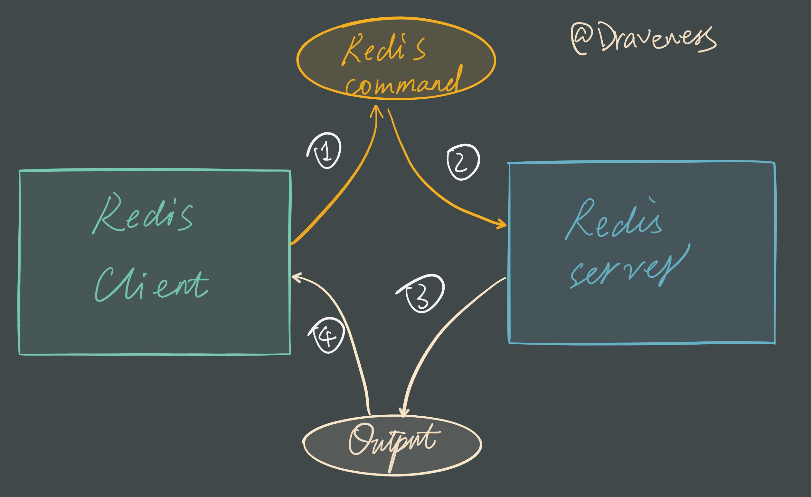
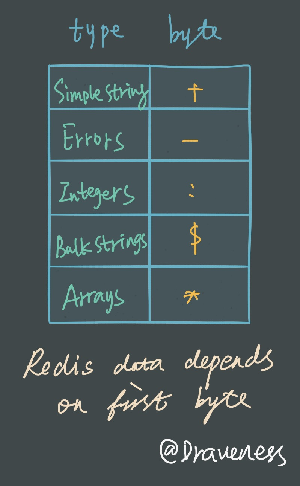
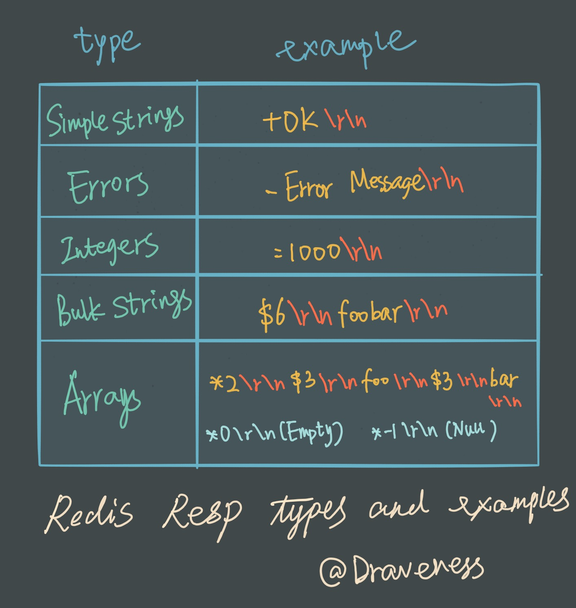
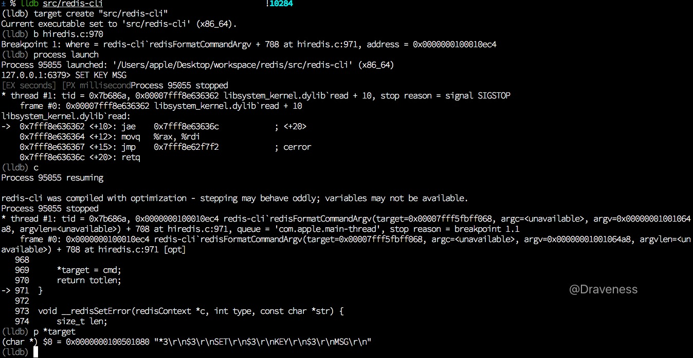
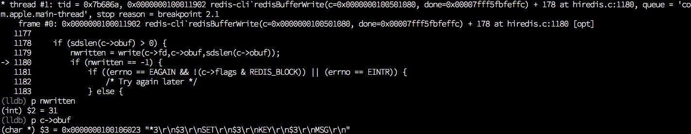
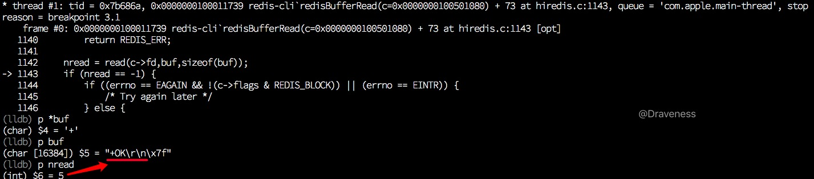
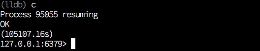
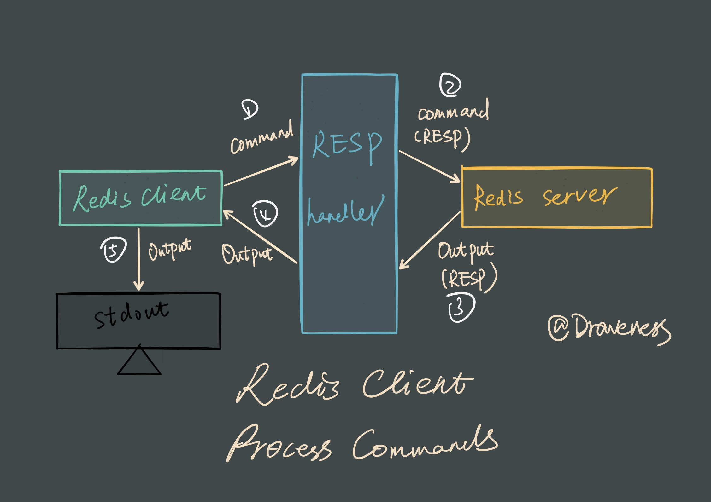

# Redis 是如何处理命令的（客户端）

在使用 Redis 的过程中经常会好奇，在 Redis-Cli 中键入 `SET KEY MSG` 并回车之后，Redis 客户端和服务是如何对命令进行解析处理的，而在内部的实现过程是什么样的。

这两篇文章会分别介绍 Redis 客户端和服务端分别对命令是如何处理的，本篇文章介绍的是 Redis 客户端如何处理输入的命令、向服务发送命令以及取得服务端回复并输出到终端等过程。



文章中会将 Redis 服务看做一个输入为 Redis 命令，输出为命令执行结果的黑箱，对从命令到结果的过程不做任何解释，只会着眼于客户端的逻辑，也就是上图中的 1 和 4 两个过程。

## 从 main 函数开始

与其它的 C 语言框架/服务类似，Redis 的客户端 `redis-cli` 也是从 `main` 函数开始执行的，位于 `redis-cli.c` 文件的最后：

```c
int main(int argc, char **argv) {
    ...
    if (argc == 0 && !config.eval) {
        repl();
    }
    ...
}
```

在一般情况下，Redis 客户端都会进入 `repl` 模式，对输入进行解析；

> Redis 中有好多模式，包括：Latency、Slave、Pipe、Stat、Scan、LRU test 等等模式，不过这些模式都不是这篇文章关注的重点，我们只会关注最常见的 repl 模式。

```c
static void repl(void) {
    char *line;
    int argc;
    sds *argv;

    ...

    while((line = linenoise(context ? config.prompt : "not connected> ")) != NULL) {
        if (line[0] != '\0') {
            argv = cliSplitArgs(line,&argc);

            if (argv == NULL) {
                printf("Invalid argument(s)\n");
                continue;
            } 
            if (strcasecmp(argv[0],"???") == 0) {
                ...
            } else {
                issueCommandRepeat(argc, argv, 1);
            }
        }
    }
    exit(0);
}
```

在上述代码中，我们省略了大量的实现细节，只保留整个 `repl` 中循环的主体部分，方便进行理解和分析，在 `while` 循环中的条件你可以看到 `linenoise` 方法的调用，通过其中的 `prompt` 和 `not connected> ` 可以判断出，这里向终端中输出了提示符，同时会调用 `fgets` 从标准输入中读取字符串：

```c
127.0.0.1:6379> 
```

全局搜一下 `config.prompt` 不难发现这一行代码，也就是控制命令行提示的 `prompt`：

```c
anetFormatAddr(config.prompt, sizeof(config.prompt),config.hostip, config.hostport);
```

接下来执行的 `cliSplitArgs` 函数会将 `line` 中的字符串分割成几个不同的参数，然后根据字符串 `argv[0]` 的不同执行的命令，在这里省略了很多原有的代码：

```c
if (strcasecmp(argv[0],"quit") == 0 ||
    strcasecmp(argv[0],"exit") == 0)
{
    exit(0);
} else if (argv[0][0] == ':') {
    cliSetPreferences(argv,argc,1);
    continue;
} else if (strcasecmp(argv[0],"restart") == 0) {
    ...
} else if (argc == 3 && !strcasecmp(argv[0],"connect")) {
    ...
} else if (argc == 1 && !strcasecmp(argv[0],"clear")) {
} else {
    issueCommandRepeat(argc, argv, 1);
}
```

在遇到 `quit`、`exit` 等跟**客户端状态有关的命令**时，就会直接执行相应的代码；否则就会将命令和参数 `issueCommandRepeat` 函数。

### 追踪一次命令的执行

> Redis Commit： `790310d89460655305bd615bc442eeaf7f0f1b38`
> 
> lldb： lldb-360.1.65
> 
> macOS 10.11.6

在继续分析 `issueCommandRepeat` 之前，我们先对 Redis 中的这部分代码进行调试追踪，在使用 `make` 编译了 Redis 源代码，启动 `redis-server` 之后；启动 lldb 对 Redis 客户端进行调试：

```shell
$ lldb src/redis-cli
(lldb) target create "src/redis-cli"
Current executable set to 'src/redis-cli' (x86_64).
(lldb) b redis-cli.c:1290
Breakpoint 1: where = redis-cli`repl + 228 at redis-cli.c:1290, address = 0x0000000100008cd4
(lldb) process launch
Process 8063 launched: '~/redis/src/redis-cli' (x86_64)
127.0.0.1:6379>
```

在 `redis-cli.c:1290` 也就是下面这行代码的地方打断点之后：

```c
-> 1290	        if (line[0] != '\0') {
```

执行 `process launch` 启动 `redis-cli`，然后输入 `SET KEY MSG` 回车以及 Ctrl-C：

> 在 lldb 中调试时，回车的输入经常会有问题，在这里输入 Ctrl-C 进入信号处理器，在通过 continue 命令进入断点：

```c
127.0.0.1:6379> SET KEY MSG
^C
8063 stopped
* thread #1: tid = 0xa95147, 0x00007fff90923362 libsystem_kernel.dylib`read + 10, stop reason = signal SIGSTOP
    frame #0: 0x00007fff90923362 libsystem_kernel.dylib`read + 10
libsystem_kernel.dylib`read:
->  0x7fff90923362 <+10>: jae    0x7fff9092336c            ; <+20>
    0x7fff90923364 <+12>: movq   %rax, %rdi
    0x7fff90923367 <+15>: jmp    0x7fff9091c7f2            ; cerror
    0x7fff9092336c <+20>: retq
(lldb) c
Process 8063 resuming

Process 8063 stopped
* thread #1: tid = 0xa95147, 0x0000000100008cd4 redis-cli`repl + 228 at redis-cli.c:1290, queue = 'com.apple.main-thread', stop reason = breakpoint 1.1
    frame #0: 0x0000000100008cd4 redis-cli`repl + 228 at redis-cli.c:1290
   1287
   1288	    cliRefreshPrompt();
   1289	    while((line = linenoise(context ? config.prompt : "not connected> ")) != NULL) {
-> 1290	        if (line[0] != '\0') {
   1291	            argv = cliSplitArgs(line,&argc);
   1292	            if (history) linenoiseHistoryAdd(line);
   1293	            if (historyfile) linenoiseHistorySave(historyfile);
(lldb)
```

输入两次 `n` 之后，打印 `argv` 和 `argc` 的值：

```c
(lldb) p argc
(int) $1 = 3
(lldb) p *argv
(sds) $2 = 0x0000000100106cc3 "SET"
(lldb) p *(argv+1)
(sds) $3 = 0x0000000100106ce3 "KEY"
(lldb) p *(argv+2)
(sds) $4 = 0x0000000100106cf3 "MSG"
(lldb) p line
(char *) $5 = 0x0000000100303430 "SET KEY MSG\n"
```

`cliSplitArgs` 方法成功将 `line` 中的字符串分隔成字符串参数，在多次执行 `n` 之后，进入 `issueCommandRepeat` 方法：

```c
-> 1334	                    issueCommandRepeat(argc-skipargs, argv+skipargs, repeat);
```

## 对输入命令的处理

上一阶段执行 `issueCommandRepeat` 的函数调用栈中，会发现 Redis 并不会直接把所有的命令发送到服务端：

```c
issueCommandRepeat
    cliSendCommand
        redisAppendCommandArgv
            redisFormatCommandArgv
            __redisAppendCommand
```

而是会在 `redisFormatCommandArgv` 中对所有的命令进行格式化处理，将字符串转换为符合 RESP 协议的数据。

### RESP 协议

Redis 客户端与 Redis 服务进行通讯时，会使用名为 **RESP**（REdis Serialization Protocol） 的协议，它的使用非常简单，并且可以序列化多种数据类型包括整数、字符串以及数组等。

对于 RESP 协议的详细介绍可以看官方文档中的 [Redis Protocol specification](https://redis.io/topics/protocol)，在这里对这个协议进行简单的介绍。

在将不同的数据类型序列化时，会使用第一个 byte 来表示当前数据的数据类型，以便在客户端或服务器在处理时能恢复原来的数据格式。



举一个简单的例子，字符串 `OK` 以及错误`Error Message` 等不同种类的信息的 RESP 表示如下：



在这篇文章中我们需要简单了解的就是 RESP “数据格式”的**第一个字节用来表示数据类型**，然后**逻辑上属于不同部分的内容通过 CRLF（\r\n）分隔**。

### 数据格式的转换

在 `redisFormatCommandArgv` 方法中几乎没有需要删减的代码，所有的命令都会以字符串数组的形式发送到客户端：

```c
int redisFormatCommandArgv(char **target, int argc, const char **argv, const size_t *argvlen) {
    char *cmd = NULL;
    int pos;
    size_t len;
    int totlen, j;

    totlen = 1+intlen(argc)+2;
    for (j = 0; j < argc; j++) {
        len = argvlen ? argvlen[j] : strlen(argv[j]);
        totlen += bulklen(len);
    }

    cmd = malloc(totlen+1);
    if (cmd == NULL)
        return -1;

    pos = sprintf(cmd,"*%d\r\n",argc);
    for (j = 0; j < argc; j++) {
        len = argvlen ? argvlen[j] : strlen(argv[j]);
        pos += sprintf(cmd+pos,"$%zu\r\n",len);
        memcpy(cmd+pos,argv[j],len);
        pos += len;
        cmd[pos++] = '\r';
        cmd[pos++] = '\n';
    }
    assert(pos == totlen);
    cmd[pos] = '\0';

    *target = cmd;
    return totlen;
}
```

`SET KEY MSG` 这一命令，经过这个方法的处理会变成：

```c
*3\r\n$3\r\nSET\r\n$3\r\nKEY\r\n$3\r\nMSG\r\n
```

你可以这么理解上面的结果：

```c
*3\r\n
    $3\r\nSET\r\n
    $3\r\nKEY\r\n
    $3\r\nMSG\r\n
```

这是一个由三个字符串组成的数组，数组中的元素是 `SET`、`KEY` 以及 `MSG` 三个字符串。

如果在这里打一个断点并输出 `target` 中的内容：



到这里就完成了对输入命令的格式化，在格式化之后还会将当前命令写入全局的 `redisContext` 的 `write` 缓冲区 `obuf` 中，也就是在上面的缓冲区看到的第二个方法：

```c
int __redisAppendCommand(redisContext *c, const char *cmd, size_t len) {
    sds newbuf;

    newbuf = sdscatlen(c->obuf,cmd,len);
    if (newbuf == NULL) {
        __redisSetError(c,REDIS_ERR_OOM,"Out of memory");
        return REDIS_ERR;
    }

    c->obuf = newbuf;
    return REDIS_OK;
}
```

### redisContext

再继续介绍下一部分之前需要简单介绍一下 `redisContext` 结构体：

```c
typedef struct redisContext {
    int err;
    char errstr[128];
    int fd;
    int flags;
    char *obuf;
    redisReader *reader;
} redisContext;
```

每一个 `redisContext` 的结构体都表示一个 Redis 客户端对服务的连接，而这个上下文会在每一个 redis-cli 中作为静态变量仅保存一个：

```c
static redisContext *context;
```

`obuf` 中包含了客户端未写到服务端的数据；而 `reader` 是用来处理 RESP 协议的结构体；`fd` 就是 Redis 服务对应的文件描述符；其他的内容就不多做解释了。

到这里，对命令的格式化处理就结束了，接下来就到了向服务端发送命令的过程了。

## 向服务器发送命令

与对输入命令的处理差不多，向服务器发送命令的方法也在 `issueCommandRepeat` 的调用栈中，而且藏得更深，如果不仔细阅读源代码其实很难发现：

```c
issueCommandRepeat
    cliSendCommand
        cliReadReply
            redisGetReply
               redisBufferWrite
```

Redis 在 `redisGetReply` 中完成对命令的发送：

```c
int redisGetReply(redisContext *c, void **reply) {
    int wdone = 0;
    void *aux = NULL;

    if (aux == NULL && c->flags & REDIS_BLOCK) {
        do {
            if (redisBufferWrite(c,&wdone) == REDIS_ERR)
                return REDIS_ERR;
        } while (!wdone);

        ...
        } while (aux == NULL);
    }

    if (reply != NULL) *reply = aux;
    return REDIS_OK;
}
```

上面的代码向 `redisBufferWrite` 函数中传递了全局的静态变量 `redisContext`，其中的 `obuf` 中存储了没有向 Redis 服务发送的命令：

```c
int redisBufferWrite(redisContext *c, int *done) {
    int nwritten;

    if (sdslen(c->obuf) > 0) {
        nwritten = write(c->fd,c->obuf,sdslen(c->obuf));
        if (nwritten == -1) {
            if ((errno == EAGAIN && !(c->flags & REDIS_BLOCK)) || (errno == EINTR)) {
            } else {
                __redisSetError(c,REDIS_ERR_IO,NULL);
                return REDIS_ERR;
            }
        } else if (nwritten > 0) {
            if (nwritten == (signed)sdslen(c->obuf)) {
                sdsfree(c->obuf);
                c->obuf = sdsempty();
            } else {
                sdsrange(c->obuf,nwritten,-1);
            }
        }
    }
    if (done != NULL) *done = (sdslen(c->obuf) == 0);
    return REDIS_OK;
}
```

代码的逻辑其实十分清晰，调用 `write` 向 Redis 服务代表的文件描述符发送写缓冲区 `obuf` 中的数据，然后根据返回值做出相应的处理，如果命令发送成功就会清空 `obuf` 并将 `done` 指针标记为真，然后返回，这样就完成了向服务器发送命令这一过程。



## 获取服务器回复

其实获取服务器回复和上文中的发送命令过程基本上差不多，调用栈也几乎完全一样：

```c
issueCommandRepeat
    cliSendCommand
        cliReadReply
            redisGetReply
                redisBufferRead
                redisGetReplyFromReader
            cliFormatReplyRaw
            fwrite
```

同样地，在 `redisGetReply` 中获取服务器的响应：

```c
int redisGetReply(redisContext *c, void **reply) {
    int wdone = 0;
    void *aux = NULL;

    if (aux == NULL && c->flags & REDIS_BLOCK) {
        do {
            if (redisBufferWrite(c,&wdone) == REDIS_ERR)
                return REDIS_ERR;
        } while (!wdone);

        do {
            if (redisBufferRead(c) == REDIS_ERR)
                return REDIS_ERR;
            if (redisGetReplyFromReader(c,&aux) == REDIS_ERR)
                return REDIS_ERR;
        } while (aux == NULL);
    }

    if (reply != NULL) *reply = aux;
    return REDIS_OK;
}
```

在 `redisBufferWrite` 成功发送命令并返回之后，就会开始等待服务端的回复，总共分为两个部分，一是使用 `redisBufferRead` 从服务端读取原始格式的回复（符合 RESP 协议）：

```c
int redisBufferRead(redisContext *c) {
    char buf[1024*16];
    int nread;

    nread = read(c->fd,buf,sizeof(buf));
    if (nread == -1) {
        if ((errno == EAGAIN && !(c->flags & REDIS_BLOCK)) || (errno == EINTR)) {
        } else {
            __redisSetError(c,REDIS_ERR_IO,NULL);
            return REDIS_ERR;
        }
    } else if (nread == 0) {
        __redisSetError(c,REDIS_ERR_EOF,"Server closed the connection");
        return REDIS_ERR;
    } else {
        if (redisReaderFeed(c->reader,buf,nread) != REDIS_OK) {
            __redisSetError(c,c->reader->err,c->reader->errstr);
            return REDIS_ERR;
        }
    }
    return REDIS_OK;
}
```

在 `read` 从文件描述符中成功读取数据并返回之后，我们可以打印 `buf` 中的内容：



刚刚向 `buf` 中写入的数据还需要经过 `redisReaderFeed` 方法的处理，截取正确的长度；然后存入 `redisReader` 中：

```c
int redisReaderFeed(redisReader *r, const char *buf, size_t len) {
    sds newbuf;

    if (buf != NULL && len >= 1) {
        if (r->len == 0 && r->maxbuf != 0 && sdsavail(r->buf) > r->maxbuf) {
            sdsfree(r->buf);
            r->buf = sdsempty();
            r->pos = 0;
            assert(r->buf != NULL);
        }

        newbuf = sdscatlen(r->buf,buf,len);
        if (newbuf == NULL) {
            __redisReaderSetErrorOOM(r);
            return REDIS_ERR;
        }

        r->buf = newbuf;
        r->len = sdslen(r->buf);
    }

    return REDIS_OK;
}
```

最后的 `redisGetReplyFromReader` 方法会从 `redisContext` 中取出 `reader`，然后反序列化 RESP 对象，最后打印出来。



当我们从终端的输出中看到了 OK 以及这个命令的执行的时间时，`SET KEY MSG` 这一命令就已经处理完成了。

## 总结

处理命令的过程在客户端还是比较简单的：

1. 在一个 `while` 循环中，输出提示符；
2. 接收到输入命令时，对输入命令进行格式化处理；
3. 通过 `write` 发送到 Redis 服务，并调用 `read` 阻塞当前进程直到服务端返回为止；
4. 对服务端返回的数据反序列化；
5. 将结果打印到终端。

用一个简单的图表示，大概是这样的：



## References

+ [Redis Protocol specification](https://redis.io/topics/protocol)
+ [Redis 和 I/O 多路复用](http://draveness.me/redis-io-multiplexing/)
+ [Redis 中的事件循环](http://draveness.me/redis-eventloop)


> Follow: [Draveness · GitHub](https://github.com/Draveness)
>
> Source: http://draveness.me/redis-cli

