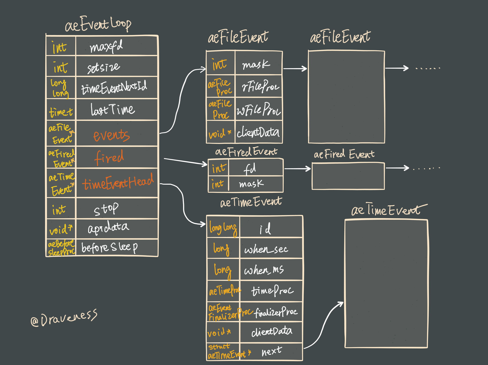
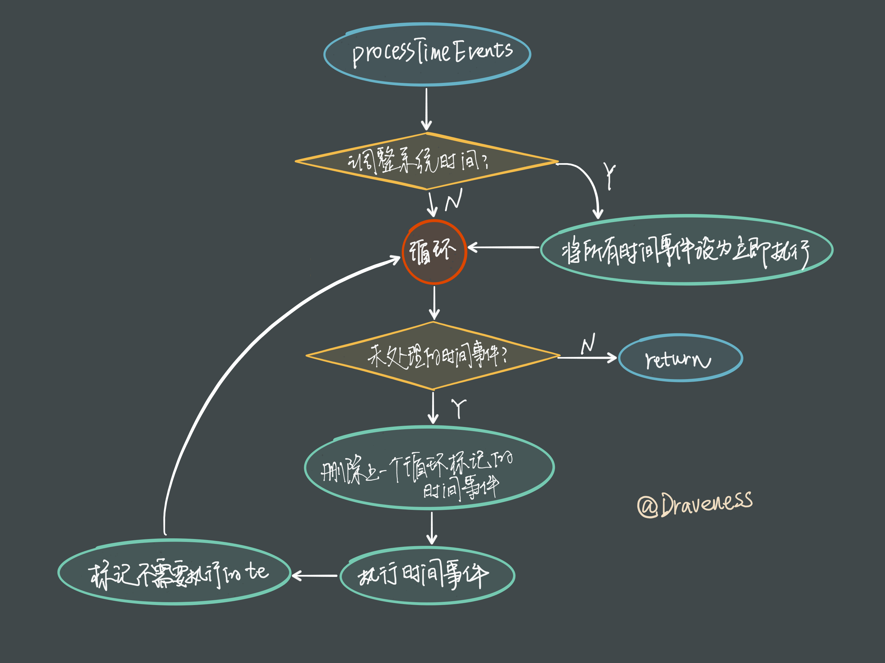
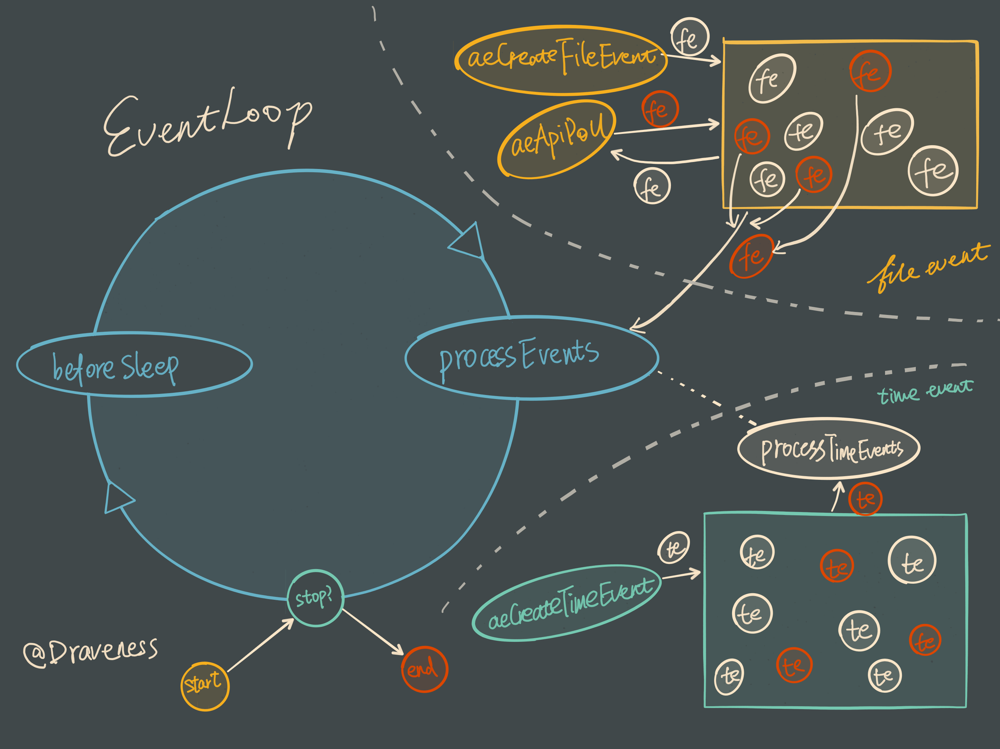
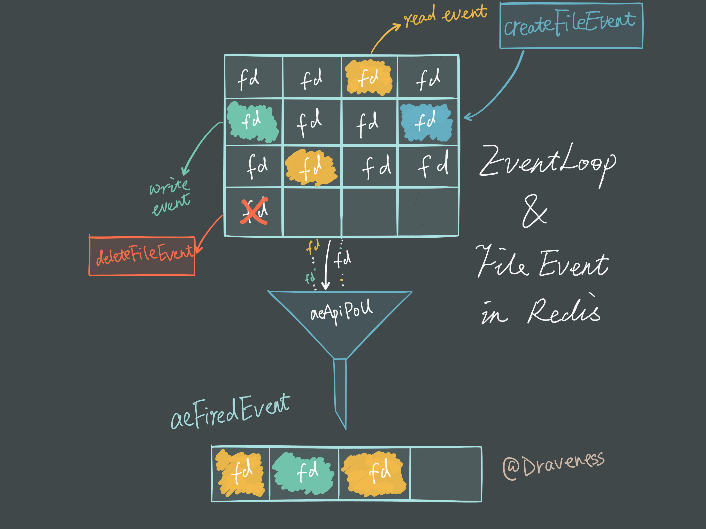
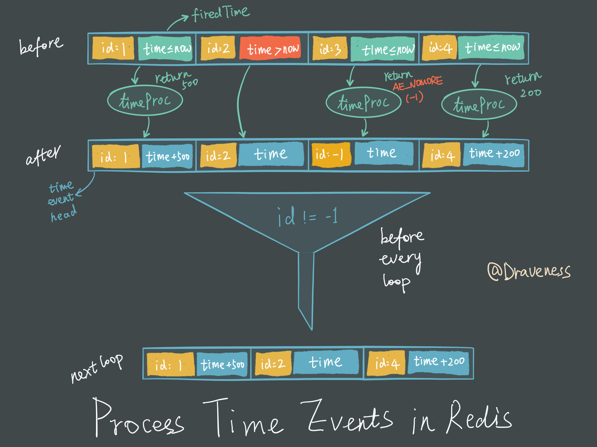

# Redis 中的事件循环

在目前的很多服务中，由于需要持续接受客户端或者用户的输入，所以需要一个事件循环来等待并处理外部事件，这篇文章主要会介绍 Redis 中的事件循环是如何处理事件的。

在文章中，我们会先从 Redis 的实现中分析事件是如何被处理的，然后用更具象化的方式了解服务中的不同模块是如何交流的。

## aeEventLoop

在分析具体代码之前，先了解一下在事件处理中处于核心部分的 `aeEventLoop` 到底是什么：



`aeEventLoop` 在 Redis 就是负责保存待处理文件事件和时间事件的结构体，其中保存大量事件执行的上下文信息，同时持有三个事件数组：

+ `aeFileEvent`
+ `aeTimeEvent`
+ `aeFiredEvent`

`aeFileEvent` 和 `aeTimeEvent` 中会存储监听的文件事件和时间事件，而最后的 `aeFiredEvent` 用于存储待处理的文件事件，我们会在后面的章节中介绍它们是如何工作的。

### Redis 服务中的 EventLoop

在 `redis-server` 启动时，首先会初始化一些 redis 服务的配置，最后会调用 `aeMain` 函数陷入 `aeEventLoop` 循环中，等待外部事件的发生：

```c
int main(int argc, char **argv) {
    ...
    
    aeMain(server.el);
}
```

`aeMain` 函数其实就是一个封装的 `while` 循环，循环中的代码会一直运行直到 `eventLoop` 的 `stop` 被设置为 `true`：

```c
void aeMain(aeEventLoop *eventLoop) {
    eventLoop->stop = 0;
    while (!eventLoop->stop) {
        if (eventLoop->beforesleep != NULL)
            eventLoop->beforesleep(eventLoop);
        aeProcessEvents(eventLoop, AE_ALL_EVENTS);
    }
}
```

它会不停尝试调用 `aeProcessEvents` 对可能存在的多种事件进行处理，而 `aeProcessEvents` 就是实际用于处理事件的函数：

```c
int aeProcessEvents(aeEventLoop *eventLoop, int flags) {
    int processed = 0, numevents;

    if (!(flags & AE_TIME_EVENTS) && !(flags & AE_FILE_EVENTS)) return 0;

    if (eventLoop->maxfd != -1 ||
        ((flags & AE_TIME_EVENTS) && !(flags & AE_DONT_WAIT))) {
        struct timeval *tvp;

        #1：计算 I/O 多路复用的等待时间 tvp
        
        numevents = aeApiPoll(eventLoop, tvp);
        for (int j = 0; j < numevents; j++) {
            aeFileEvent *fe = &eventLoop->events[eventLoop->fired[j].fd];
            int mask = eventLoop->fired[j].mask;
            int fd = eventLoop->fired[j].fd;
            int rfired = 0;

            if (fe->mask & mask & AE_READABLE) {
                rfired = 1;
                fe->rfileProc(eventLoop,fd,fe->clientData,mask);
            }
            if (fe->mask & mask & AE_WRITABLE) {
                if (!rfired || fe->wfileProc != fe->rfileProc)
                    fe->wfileProc(eventLoop,fd,fe->clientData,mask);
            }
            processed++;
        }
    }
    if (flags & AE_TIME_EVENTS) processed += processTimeEvents(eventLoop);
    return processed;
}
```

上面的代码省略了 I/O 多路复用函数的等待时间，不过不会影响我们对代码的理解，整个方法大体由两部分代码组成，一部分处理文件事件，另一部分处理时间事件。

> Redis 中会处理两种事件：时间事件和文件事件。

### 文件事件

在一般情况下，`aeProcessEvents` 都会先**计算最近的时间事件发生所需要等待的时间**，然后调用 `aeApiPoll` 方法在这段时间中等待事件的发生，在这段时间中如果发生了文件事件，就会优先处理文件事件，否则就会一直等待，直到最近的时间事件需要触发：

```c
numevents = aeApiPoll(eventLoop, tvp);
for (j = 0; j < numevents; j++) {
    aeFileEvent *fe = &eventLoop->events[eventLoop->fired[j].fd];
    int mask = eventLoop->fired[j].mask;
    int fd = eventLoop->fired[j].fd;
    int rfired = 0;

    if (fe->mask & mask & AE_READABLE) {
        rfired = 1;
        fe->rfileProc(eventLoop,fd,fe->clientData,mask);
    }
    if (fe->mask & mask & AE_WRITABLE) {
        if (!rfired || fe->wfileProc != fe->rfileProc)
            fe->wfileProc(eventLoop,fd,fe->clientData,mask);
    }
    processed++;
}
```

文件事件如果绑定了对应的读/写事件，就会执行对应的对应的代码，并传入事件循环、文件描述符、数据以及掩码：

```c
fe->rfileProc(eventLoop,fd,fe->clientData,mask);
fe->wfileProc(eventLoop,fd,fe->clientData,mask);
```

其中 `rfileProc` 和 `wfileProc` 就是在文件事件被创建时传入的函数指针：

```c
int aeCreateFileEvent(aeEventLoop *eventLoop, int fd, int mask, aeFileProc *proc, void *clientData) {
    aeFileEvent *fe = &eventLoop->events[fd];

    if (aeApiAddEvent(eventLoop, fd, mask) == -1)
        return AE_ERR;
    fe->mask |= mask;
    if (mask & AE_READABLE) fe->rfileProc = proc;
    if (mask & AE_WRITABLE) fe->wfileProc = proc;
    fe->clientData = clientData;
    if (fd > eventLoop->maxfd)
        eventLoop->maxfd = fd;
    return AE_OK;
}
```

需要注意的是，传入的 `proc` 函数会在对应的 `mask` 位事件发生时执行。

### 时间事件

在 Redis 中会发生两种时间事件：

+ 一种是定时事件，每隔一段时间会执行一次；
+ 另一种是非定时事件，只会在某个时间点执行一次；

时间事件的处理在 `processTimeEvents` 中进行，我们会分三部分分析这个方法的实现：

```c
static int processTimeEvents(aeEventLoop *eventLoop) {
    int processed = 0;
    aeTimeEvent *te, *prev;
    long long maxId;
    time_t now = time(NULL);

    if (now < eventLoop->lastTime) {
        te = eventLoop->timeEventHead;
        while(te) {
            te->when_sec = 0;
            te = te->next;
        }
    }
    eventLoop->lastTime = now;
```

由于对系统时间的调整会影响当前时间的获取，进而影响时间事件的执行；如果系统时间先被设置到了未来的时间，又设置成正确的值，这就会导致**时间事件会随机延迟一段时间执行**，也就是说，时间事件不会按照预期的安排尽早执行，而 `eventLoop` 中的 `lastTime` 就是用于检测上述情况的变量：

```c
typedef struct aeEventLoop {
    ...
    time_t lastTime;     /* Used to detect system clock skew */
    ...
} aeEventLoop;
```

如果发现了系统时间被改变（小于上次 `processTimeEvents` 函数执行的开始时间），就会强制所有时间事件尽早执行。

```c
    prev = NULL;
    te = eventLoop->timeEventHead;
    maxId = eventLoop->timeEventNextId-1;
    while(te) {
        long now_sec, now_ms;
        long long id;

        if (te->id == AE_DELETED_EVENT_ID) {
            aeTimeEvent *next = te->next;
            if (prev == NULL)
                eventLoop->timeEventHead = te->next;
            else
                prev->next = te->next;
            if (te->finalizerProc)
                te->finalizerProc(eventLoop, te->clientData);
            zfree(te);
            te = next;
            continue;
        }
```

Redis 处理时间事件时，不会在当前循环中直接移除不再需要执行的事件，而是会在当前循环中将时间事件的 `id` 设置为 `AE_DELETED_EVENT_ID`，然后再下一个循环中删除，并执行绑定的 `finalizerProc`。

```c
        aeGetTime(&now_sec, &now_ms);
        if (now_sec > te->when_sec ||
            (now_sec == te->when_sec && now_ms >= te->when_ms))
        {
            int retval;

            id = te->id;
            retval = te->timeProc(eventLoop, id, te->clientData);
            processed++;
            if (retval != AE_NOMORE) {
                aeAddMillisecondsToNow(retval,&te->when_sec,&te->when_ms);
            } else {
                te->id = AE_DELETED_EVENT_ID;
            }
        }
        prev = te;
        te = te->next;
    }
    return processed;
}
```

在移除不需要执行的时间事件之后，我们就开始通过比较时间来判断是否需要调用 `timeProc` 函数，`timeProc` 函数的返回值 `retval` 为时间事件执行的时间间隔：

+ `retval == AE_NOMORE`：将时间事件的 `id` 设置为 `AE_DELETED_EVENT_ID`，等待下次 `aeProcessEvents` 执行时将事件清除；
+ `retval != AE_NOMORE`：修改当前时间事件的执行时间并重复利用当前的时间事件；

以使用 `aeCreateTimeEvent` 一个创建的简单时间事件为例：

```c
aeCreateTimeEvent(config.el,1,showThroughput,NULL,NULL)
```

时间事件对应的函数 `showThroughput` 在每次执行时会返回一个数字，也就是该事件发生的时间间隔：

```c
int showThroughput(struct aeEventLoop *eventLoop, long long id, void *clientData) {
    ...
    float dt = (float)(mstime()-config.start)/1000.0;
    float rps = (float)config.requests_finished/dt;
    printf("%s: %.2f\r", config.title, rps);
    fflush(stdout);
    return 250; /* every 250ms */
}
```

这样就不需要重新 `malloc` 一块相同大小的内存，提高了时间事件处理的性能，并减少了内存的使用量。

我们对 Redis 中对时间事件的处理以流程图的形式简单总结一下：



创建时间事件的方法实现其实非常简单，在这里不想过多分析这个方法，唯一需要注意的就是时间事件的 `id` 跟数据库中的大多数主键都是递增的：

```c
long long aeCreateTimeEvent(aeEventLoop *eventLoop, long long milliseconds,
        aeTimeProc *proc, void *clientData,
        aeEventFinalizerProc *finalizerProc) {
    long long id = eventLoop->timeEventNextId++;
    aeTimeEvent *te;

    te = zmalloc(sizeof(*te));
    if (te == NULL) return AE_ERR;
    te->id = id;
    aeAddMillisecondsToNow(milliseconds,&te->when_sec,&te->when_ms);
    te->timeProc = proc;
    te->finalizerProc = finalizerProc;
    te->clientData = clientData;
    te->next = eventLoop->timeEventHead;
    eventLoop->timeEventHead = te;
    return id;
}
```

## 事件的处理

> 上一章节我们已经从代码的角度对 Redis 中事件的处理有一定的了解，在这里，我想从更高的角度来观察 Redis 对于事件的处理是怎么进行的。

整个 Redis 服务在启动之后会陷入一个巨大的 while 循环，不停地执行 `processEvents` 方法处理文件事件 fe 和时间事件 te 。

> 有关 Redis 中的 I/O 多路复用模块可以看这篇文章 [Redis 和 I/O 多路复用](http://draveness.me/redis-io-multiplexing/)。

当文件事件触发时会被标记为 “红色” 交由 `processEvents` 方法处理，而时间事件的处理都会交给 `processTimeEvents` 这一子方法：



在每个事件循环中 Redis 都会先处理文件事件，然后再处理时间事件直到整个循环停止，`processEvents` 和 `processTimeEvents` 作为 Redis 中发生事件的消费者，每次都会从“事件池”中拉去待处理的事件进行消费。

### 文件事件的处理

由于文件事件触发条件较多，并且 OS 底层实现差异性较大，底层的 I/O 多路复用模块使用了 `eventLoop->aeFiredEvent` 保存对应的文件描述符以及事件，将信息传递给上层进行处理，并抹平了底层实现的差异。

整个 I/O 多路复用模块在事件循环看来就是一个输入事件、输出 `aeFiredEvent` 数组的一个黑箱：



在这个黑箱中，我们使用 `aeCreateFileEvent`、 `aeDeleteFileEvent` 来添加删除需要监听的文件描述符以及事件。

在对应事件发生时，当前单元格会“变色”表示发生了可读（黄色）或可写（绿色）事件，调用 `aeApiPoll` 时会把对应的文件描述符和事件放入 `aeFiredEvent` 数组，并在 `processEvents` 方法中执行事件对应的回调。

### 时间事件的处理

时间事件的处理相比文件事件就容易多了，每次 `processTimeEvents` 方法调用时都会对整个 `timeEventHead` 数组进行遍历：



遍历的过程中会将时间的触发时间与当前时间比较，然后执行时间对应的 `timeProc`，并根据 `timeProc` 的返回值修改当前事件的参数，并在下一个循环的遍历中移除不再执行的时间事件。

## 总结

> 笔者对于文章中两个模块的展示顺序考虑了比较久的时间，最后还是觉得，目前这样的顺序更易于理解。

Redis 对于事件的处理方式十分精巧，通过传入函数指针以及返回值的方式，将时间事件移除的控制权交给了需要执行的处理器 `timeProc`，在 `processTimeEvents` 设置 `aeApiPoll` 超时时间也十分巧妙，充分地利用了每一次事件循环，防止过多的无用的空转，并且保证了该方法不会阻塞太长时间。

事件循环的机制并不能时间事件准确地在某一个时间点一定执行，往往会比实际约定处理的时间稍微晚一些。

## Reference

+ [Redis Event Library](https://redis.io/topics/internals-rediseventlib)
+ [Redis Core Implementation](http://key-value-stories.blogspot.com/2015/01/redis-core-implementation.html)
+  [Redis 和 I/O 多路复用](http://draveness.me/redis-io-multiplexing/)
+  [Redis 设计与实现](http://redisbook.com)

## 其它

> Follow: [Draveness · GitHub](https://github.com/Draveness)
>
> Source: http://draveness.me/redis-eventloop


