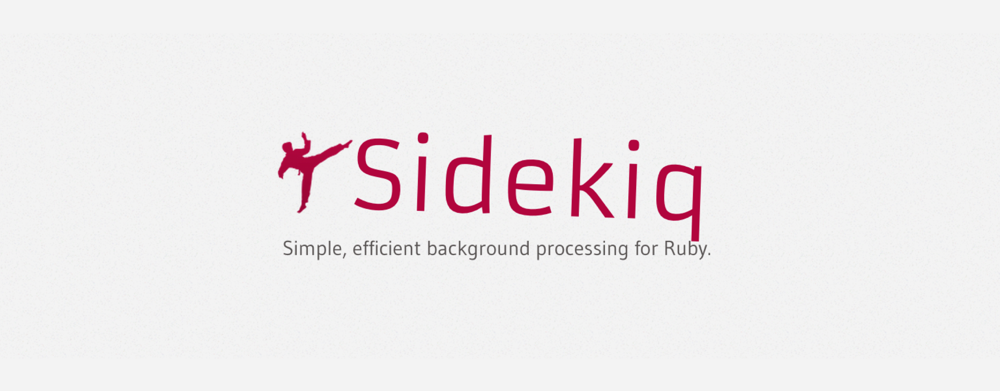
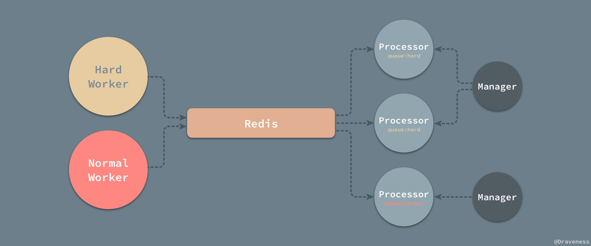
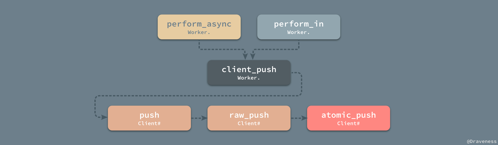
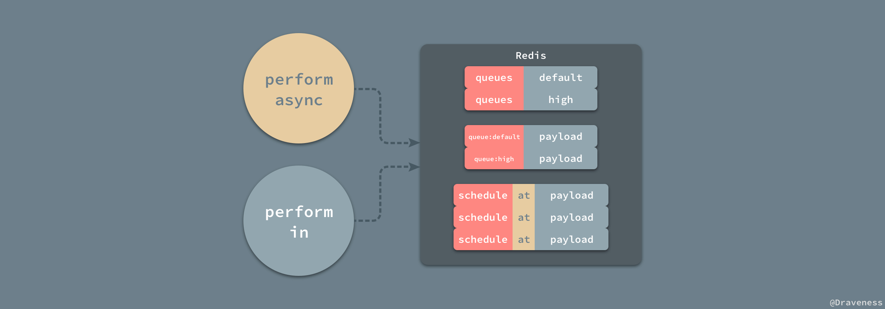
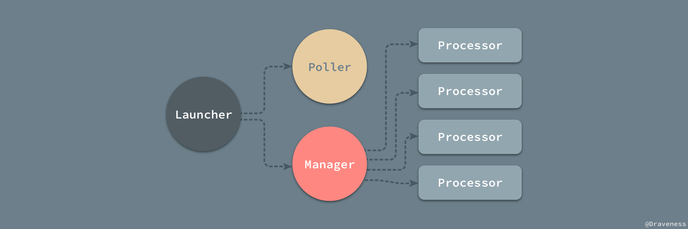
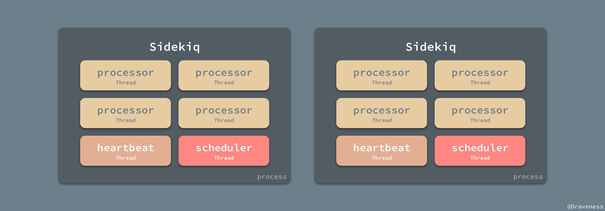
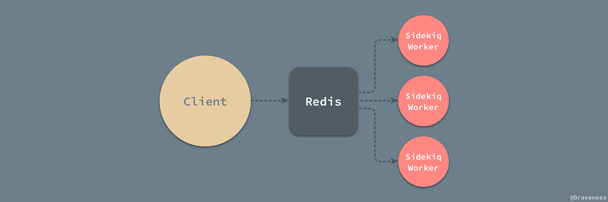
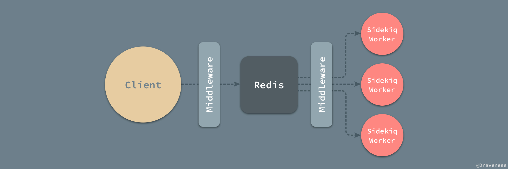
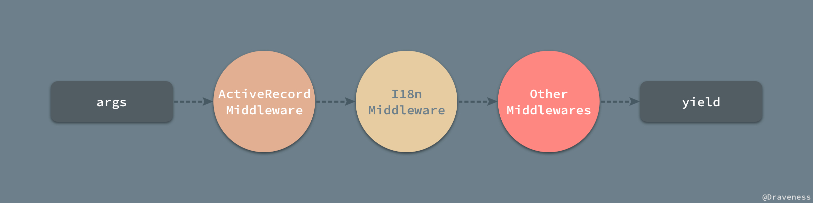

# Sidekiq 如何处理异步任务

[Sidekiq](https://github.com/mperham/sidekiq) 是 Ruby 和 Rails 项目中常用的后台任务处理系统，其本身提供的 API 十分简洁，源代码也非常易于阅读，是一个轻量级的异步处理组件；虽然其本身没有提供太多复杂的功能，但是它的使用和部署非常简单。在这篇文章中，我们将对 Sidekiq 的实现原理进行介绍和分析。



文章中并不会详细介绍 Sidekiq 的使用，也并不是一篇 Sidekiq 的教程，在这里我们会介绍任务的入队过程、Sidekiq 任务在 Redis 中的存储方式和消费者对任务的处理过程，除此之外，文章将介绍 Sidekiq 中间件的实现以及任务重试的原理。

## 概述

在具体分析介绍 Sidekiq 的实现原理之前，我们需要对整个组件的使用过程进行概述，保证我们对 Sidekiq 的结构有一个总体上的了解。

```ruby
class HardWorker
  include Sidekiq::Worker
  def perform(name, count)
    # do something
  end
end

HardWorker.perform_async('bob', 5)
```

在这里，我们直接照搬 Sidekiq Wiki 中 [Getting Started](https://github.com/mperham/sidekiq/wiki/Getting-Started) 部分的代码简单展示下它是如何使用的，当我们执行 `HardWorker.perform_async` 方法时，Sidekiq 的 Worker 会将一个异步任务以 JSON 的形式将相关的信息加入 Redis 中并等待消费者对任务的拉取和处理。



Sidekiq 的消费者有三个部分组成，分别是 `Manager`、`Processor` 和 `Poller`；他们三者会相互协作共同完成对 Redis 中任务消费的过程。

> 需要注意的是，Sidekiq 中的 `Sidekiq::Worker` 并不是真正用于处理任务的 Worker，负责执行执行任务的类型其实是 `Sidekiq::Processor`；在文章中，当我们提到 Sidekiq Worker 时，其实说的是 `Sidekiq::Processor`，当我们使用了形如 `Sidekiq::Worker` 或者 `Worker` 的形式时，我们说的就是对应的类。

## 异步任务的入队

当我们对需要异步执行的任务调用类似 `Worker.perform_async` 的方法时，Sidekiq 其实并不会真正去创建一个 `HardWorker` 等 `Worker` 的对象，它实际上会调用 `Worker.client_push` 方法并将当前的 `class` 和 `args` 参数传进去，也就是需要异步执行的类和参数：

```ruby
def perform_async(*args)
  client_push('class'.freeze => self, 'args'.freeze => args)
end
```

除了 `Worker.perform_async` 之外，`Worker` 还提供了另外一对用于**在一段时间之后或者某个时间点**执行相应任务的方法 `Worker.perform_at` 和 `Worker.perform_in`：

```ruby
def perform_in(interval, *args)
  int = interval.to_f
  now = Time.now.to_f
  ts = (int < 1_000_000_000 ? now + int : int)
  item = { 'class'.freeze => self, 'args'.freeze => args, 'at'.freeze => ts }
  item.delete('at'.freeze) if ts <= now
  client_push(item)
end
alias_method :perform_at, :perform_in
```

为了使用同一个接口支持两种不同的安排方式（时间点和多久之后），方法内部对传入的 `internal` 进行了判断，当 `interval.to_f < 1_000_000_000` 时就会在一段时间之后执行任务，否则就会以时间点的方式执行任务，虽然 `Worker.perform_at` 和 `Worker.perform_in` 是完全相同的方法，不过我们在使用时还是尽量遵循方法的语义选择两者中更符合逻辑的方法。


两种创建异步任务的方式，最终都执行了 `Worker.client_push` 方法并传入了一个哈希，其中可能包含以上三个部分的内容；在方法的实现中，它获取了上下文中的 Redis 池并将传入的 `item` 对象传入 Redis 中：

```ruby
def client_push(item)
  pool = Thread.current[:sidekiq_via_pool] || get_sidekiq_options['pool'.freeze] || Sidekiq.redis_pool
  item.keys.each do |key|
    item[key.to_s] = item.delete(key)
  end
  Sidekiq::Client.new(pool).push(item)
end
```

简单整理一下，从 `Worker.perform_async` 方法到 `Client#push` 方法整个过程都在对即将加入到 Redis 中队列的哈希进行操作，从添加 `at` 字段到字符串化、再到 `Client#normalize_item` 方法中添加 `jid` 和 `created_at` 字段。

```ruby
def push(item)
  normed = normalize_item(item)
  payload = process_single(item['class'.freeze], normed)

  if payload
    raw_push([payload])
    payload['jid'.freeze]
  end
end
```

所有添加异步任务的方法最终都调用了私有方法 `Client#raw_push` 以及 `Client#atomic_push` 向 Redis 中添加数据，在这时会有两种不同的情况发生，当异步任务需要在未来的某一时间点进行安排时，它会加入 Redis 的一个有序集合：

```ruby
def atomc_push(conn, payloads)
  if payloads.first['at'.freeze]
    conn.zadd('schedule'.freeze, payloads.map do |hash|
                at = hash.delete('at'.freeze).to_s
                [at, Sidekiq.dump_json(hash)]
              end)
  else
    # ...
  end
end
```

在这个有序集合中，Sidekiq 理所应当地将 `schedule` 作为权重，而其他的全部字段都以 JSON 的格式作为负载传入；但是当 Sidekiq 遇到需要立即执行的异步任务时，实现就有一些不同了：

```ruby
def atomc_push(conn, payloads)
  if payloads.first['at'.freeze]
  # ...
  else
    q = payloads.first['queue'.freeze]
    now = Time.now.to_f
    to_push = payloads.map do |entry|
      entry['enqueued_at'.freeze] = now
      Sidekiq.dump_json(entry)
    end
    conn.sadd('queues'.freeze, q)
    conn.lpush("queue:#{q}", to_push)
  end
end
```

除了设置当前任务的入队时间 `enqueued_at` 之外，Sidekiq 将队列加入到一个大队列 `queues` 的集合中，并且将负载直接推到 `"queue:#{q}"` 数组中等待消费者的拉取，我们稍微梳理一下两种安排异步队列方法的调用过程：



### Redis 中的存储

无论是立即执行还是需要安排的异步任务都会进入 Redis 的队列中，但是它们之间还是有一些区别的，`Worker.perform_in/at` 会将任务以 `[at, args]` 的形式加入到 `schedules` 有序集中，而 
`Worker.perform_async` 将负载加入到指定的队列，并向整个 Sidekiq 的队列集合 `queues` 中添加该队列。



所有的 `payload` 中都包含了一个异步任务需要执行的全部信息，包括该任务的执行的队列 `queue`、异步队列的类 `class`、参数 `args` 以及 `sidekiq_options` 中的全部参数。


除了上述参数，一个异步任务还包含诸如 `created_at`、`enqueued_at` 等信息，也有一个通过 `SecureRandom.hex(12)` 生成的任务唯一标识符 `jid`。

## Sidekiq 的启动过程

作者对于 Sidekiq 印象最深刻的就是它在命令行启动的时候输出的一个字符画，我们能在 `cli.rb` 的 `Cli.banner` 方法中找到这个字符画：

```
         m,
         `$b
    .ss,  $$:         .,d$
    `$$P,d$P'    .,md$P"'
     ,$$$$$bmmd$$$P^'
   .d$$$$$$$$$$P'
   $$^' `"^$$$'       ____  _     _      _    _
   $:     ,$$:       / ___|(_) __| | ___| | _(_) __ _
   `b     :$$        \___ \| |/ _` |/ _ \ |/ / |/ _` |
          $$:         ___) | | (_| |  __/   <| | (_| |
          $$         |____/|_|\__,_|\___|_|\_\_|\__, |
        .d$$                                       |_|
```

这一节也将介绍 Sidekiq 的启动过程，在 `bin` 文件夹中的 sidekiq 文件包含的内容就是在命令行执行 `sidekiq` 时执行的代码：

```ruby
begin
  cli = Sidekiq::CLI.instance
  cli.parse
  cli.run
rescue => e
  # ...
end
```

这里的代码就是创建了一个 `CLI` 对象，执行 `CLI#parse` 方法对参数进行解析，最后调用 `CLI#run` 方法：

```ruby
def run
  print_banner

  self_read, self_write = IO.pipe
  # ...

  launcher = Sidekiq::Launcher.new(options)
  begin
    launcher.run
    while readable_io = IO.select([self_read])
      signal = readable_io.first[0].gets.strip
      handle_signal(signal)
    end
  rescue Interrupt
    launcher.stop
  end
end
```

### 从 Launcher 到 Manager

`CLI#run` 在执行最开始就会打印 banner，也就是我们在每次启动 Sidekiq 时看到的字符画，而在之后会执行 `Launcher#run` 运行用于处理异步任务的 `Processor` 等对象。



每一个 `Launcher` 都会启动一个 `Manager` 对象和一个 `Poller`，其中 `Manager` 同时管理了多个 `Processor` 对象，这些不同的类之间有着如上图所示的关系。

```ruby
def run
  @thread = safe_thread("heartbeat", &method(:start_heartbeat))
  @poller.start
  @manager.start
end
```

`Manager` 会在初始化时根据传入的 `concurrency` 的值创建对应数量的 `Processor`，默认的并行数量为 25；当执行 `Manager#start` 时，就会启动对应数量的**线程**和处理器开始对任务进行处理：

```ruby
class Manager
  def start
    @workers.each do |x|
      x.start
    end
  end
end

class Processor
  def start
    @thread ||= safe_thread("processor", &method(:run))
  end
end
```

从 `Launcher` 的启动到现在只是一个调用 `initialize` 和 `start` 方法的过程，再加上 Sidekiq 源代码非常简单，所以阅读起没有丝毫的难度，也就不做太多的解释了。

### 并行模型

当处理器开始执行 `Processor#run` 方法时，就开始对所有的任务进行处理了；从总体来看，Sidekiq 使用了多线程的模型对任务进行处理，每一个 `Processor` 都是使用了 `safe_thread` 方法在一个新的线程里面运行的：

```ruby
def safe_thread(name, &block)
  Thread.new do
    Thread.current['sidekiq_label'.freeze] = name
    watchdog(name, &block)
  end
end
```

在使用 Sidekiq 时，我们也会在不同的机器上开启多个 Sidekiq Worker，也就是说 Sidekiq 可以以多进程、多线程的方式运行，同时处理大量的异步任务。



到目前为止，我们已经分析了异步任务的入队以及 Sidekiq Worker 的启动过程了，接下来即将分析 Sidekiq 对异步任务的处理过程。

### 『主题』的订阅

作为一个 Sidekiq Worker 进程，它在启动时就会决定选择订阅哪些『主题』去执行，比如当我们使用下面的命令时：

```sh
> sidekiq -q critical,2 -q default
```

`CLI#parse` 方法会对传入的 `-q` 参数进行解析，但是当执行 `sidekiq` 命令却没有传入队列参数时，Sidekiq 只会订阅 `default` 队列中的任务：

```ruby
def parse(args=ARGV)
  # ...
  validate!
  # ...
end

def validate!
  options[:queues] << 'default' if options[:queues].empty?
end
```

同时，默认情况下的队列的优先级都为 `1`，高优先级的队列在当前的任务中可以得到更多的执行机会，实现的方法是通过增加同一个 `queues` 集合中高优先级队列的数量，我们可以在 `CLI#parse_queue` 中找到实现这一功能的代码：

```ruby
def parse_queue(opts, q, weight=nil)
  [weight.to_i, 1].max.times do
    (opts[:queues] ||= []) << q
  end
  opts[:strict] = false if weight.to_i > 0
end
```

到这里，其实我们就完成了设置过程中 Sidekiq Worker 『主题』订阅的功能了，我们将在后面 [执行任务](#执行任务) 的部分具体介绍 Sidekiq 是如何使用这些参数的。

## 异步任务的处理

从异步任务的入队一节中，我们可以清楚地看到使用 `#perform_async` 和 `#perform_in` 两种方法创建的数据结构 `payload` 最终以不同的方式进入了 Redis 中，所以在这里我们将异步任务的处理分为定时任务和『立即』任务两个部分，分别对它们不同的处理方式进行分析。

### 定时任务

Sidekiq 使用 `Scheduled::Poller` 对 Redis 中 `schedules` 有序集合中的负载进行处理，其中包括 `retry` 和 `schedule` 两个有序集合中的内容。


在 `Poller` 被 `Scheduled::Poller` 启动时会调用 `#start` 方法开始对上述两个有序集合轮训，`retry` 中包含了所有重试的任务，而 `schedule` 就是被安排到指定时间执行的定时任务了：

```ruby
def start
  @thread ||= safe_thread("scheduler") do
    initial_wait
    while !@done
      enqueue
      wait
    end
  end
end
```

`Scheduled::Poller#start` 方法内部执行了一个 `while` 循环，在循环内部也只包含入队和等待两个操作，用于入队的方法最终调用了 `Scheduled::Poll::Enq#enqueue_jobs` 方法：

```ruby
def enqueue_jobs(now=Time.now.to_f.to_s, sorted_sets=SETS)
  Sidekiq.redis do |conn|
    sorted_sets.each do |sorted_set|
      while job = conn.zrangebyscore(sorted_set, '-inf'.freeze, now, :limit => [0, 1]).first do
        if conn.zrem(sorted_set, job)
          Sidekiq::Client.push(Sidekiq.load_json(job))
        end
      end
    end
  end
end
```

传入的 `SETS` 其实就是 `retry` 和 `schedule` 构成的数组，在上述方法中，Sidekiq 通过一个 `Redis#zrangebyscore` 和 `Redis#zrem` 将集合中小于当前时间的任务全部加到立即任务中，最终调用是在前面已经提到过的 `Client#push` 方法将任务推到指定的队列中。


由于 `Scheduled::Poller` 并不是不停地对 Redis 中的数据进行处理的，因为当前进程一直都在执行 `Poller#enqueue` 其实是一个非常低效的方式，所以 Sidekiq 会在每次执行 `Poller#enqueue` 之后，执行 `Poller#wait` 方法，随机等待一段时间：

```ruby
def wait
  @sleeper.pop(random_poll_interval)
  # ...
end

def random_poll_interval
  poll_interval_average * rand + poll_interval_average.to_f / 2
end
```

随机等待时间的范围在 `[0.5 * poll_interval_average, 1.5 * poll_interval_average]` 之间；通过随机的方式，Sidekiq 可以避免在多个线程处理任务时，短时间内 Redis 接受大量的请求发生延迟等问题，能够保证从长期来看 Redis 接受的请求数是平均的；同时因为 `Scheduled::Poller` 使用了 `#enqueue` 加 `#wait` 对 Redis 中的数据进行消费，所以没有办法保证任务会在指定的时间点执行，**执行的时间一定比安排的时间要晚**，这也是我们在使用 Sidekiq 时需要注意的。

> 随机等待的时间其实不止与 `poll_interval_average` 有关，在默认情况下，它是当前进程数的 15 倍，在有 30 个 Sidekiq 线程时，每个线程会每隔 225 ~ 675s 的时间请求一次。

### 执行任务

定时任务是由 `Scheduled::Poller` 进行处理的，将其中需要执行的异步任务加入到指定的队列中，而这些任务最终都会在 `Processor#run` 真正被执行：

```ruby
def run
  begin
    while !@done
      process_one
    end
    @mgr.processor_stopped(self)
  rescue Exception => ex
    # ...
  end
end
```

当处理结束或者发生异常时会调用 `Manager#processor_stopped` 或者 `Manager#processor_died` 方法对 `Processor` 进行处理；在处理任务时其实也分为两个部分，也就是 `#fetch` 和 `#process` 两个方法：

```ruby
def process_one
  @job = fetch
  process(@job) if @job
  @job = nil
end
```

我们先来看一下整个方法的调用栈，任务的获取从 `Processor#process_one` 一路调用下来，直到 `BasicFetch#retrive_work` 返回了 `UnitOfWork` 对象，返回的对象会经过分发最后执行对应类的 `#perform` 传入参数真正运行该任务：

```
Processor#process_one
├── Processor#fetch
│   └── Processor#get_one
│       └── BasicFetch#retrive_work
│           ├── Redis#brpop
│           └── UnitOfWork#new
└── Processor#process
    ├── Processor#dispatch
    ├── Processor#execute_job
    └── Worker#perform
```

对于任务的获取，我们需要关注的就是 `BasicFetch#retrive_work` 方法，他会从 Redis 中相应队列的有序数组中 `Redis#brpop` 出一个任务，然后封装成 `UnitOfWork` 对象后返回。

```ruby
def retrieve_work
  work = Sidekiq.redis { |conn| conn.brpop(*queues_cmd) }
  UnitOfWork.new(*work) if work
end
```

`#queues_cmd` 这个实例方法其实就用到了在主题的订阅一节中的 `queues` 参数，该参数会在 `Processor` 初始化是创建一个 `BasicFetch` 策略对象，最终在 `BasicFetch#queues_cmd` 方法调用时返回一个类似下面的数组：

```ruby
queue:high
queue:high
queue:high
queue:low
queue:low
queue:default
```

这样就可以实现了队列的优先级这一个功能了，返回的 `UnitOfWork` 其实是一个通过 `Struct.new` 创建的结构体，它会在 `Processor#process` 方法中作为资源被处理：

```ruby
def process(work)
  jobstr = work.job
  queue = work.queue_name

  begin
    # ...
    
    job_hash = Sidekiq.load_json(jobstr)
    dispatch(job_hash, queue) do |worker|
      Sidekiq.server_middleware.invoke(worker, job_hash, queue) do
        execute_job(worker, cloned(job_hash['args'.freeze]))
      end
    end
  rescue Exception => ex
    # ...
  end
end
```

该方法对任务的执行其实总共有四个步骤：

1. 将 Redis 中存储的字符串加载为 JSON；
2. 执行 `Processor#dispatch` 方法并在内部提供方法重试等功能，同时也实例化一个 `Sidekiq::Worker` 对象；
3. 依次执行服务端的中间件，可能会对参数进行更新；
4. 调用 `Processor#execute_job` 方法执行任务；

而最后调用的时用于执行任务的方法 `Processor#execute_job`，它的实现也是到目前为止最为简单的方法之一了：

```ruby
def execute_job(worker, cloned_args)
  worker.perform(*cloned_args)
end
```

该方法在**线程**中执行了客户端创建的 `Worker` 类的实例方法 `#perform` 并传入了经过两侧中间件处理后的参数。

### 小结

到目前为止，Sidekiq Worker 对任务的消费过程就是圆满的了，从客户端创建一个拥有 `#perform` 方法的 `Worker` 到消费者去执行该方法形成了一个闭环，完成了对任务的调度。



Sidekiq 是一个非常轻量级的任务调度系统，它使用 Redis 作为整个系统的消息队列，在两侧分别建立了生产者和消费者的模块，不过除了这几个比较重要的模块，Sidekiq 中还有一些功能是我们无法忽略的，比如中间件、兼容 ActiveJob 甚至是测试的实现，都是我们需要去了解的；接下来，我们将介绍和分析主干之外的『分叉』功能。

## 中间件

中间件模块是 Sidekiq 为我们在整个任务的处理流程提供的两个钩子，一个是在客户端的钩子，另一个在 Sidekiq Worker 中。



中间件的使用其实非常简单，我们默认所有的中间件都会拥有一个实例方法 `#call` 并接受 `worker`、`job` 和 `queue` 三个参数，在使用时也只需要直接调用 `Chain#add` 方法将其加入数组就可以了：

```ruby
class AcmeCo::MyMiddleware
  def call(worker, job, queue)
    # ...
  end
end

# config/initializers/sidekiq.rb
Sidekiq.configure_server do |config|
  config.server_middleware do |chain|
    chain.add AcmeCo::MyMiddleware
  end
end
```

Sidekiq 将中间件分为了客户端和服务端两个部分，这两个部分的中间件其实并不是严格意义上的在执行之前，由于执行时间点的不同，导致它们有不同的功能：

+ 服务端中间件是『包围』了任务执行过程的，我们可以在中间件中使用 `begin`、`rescue` 语句，这样当任务出现问题时，我们就可以拿到异常了；
+ 客户端中间件在任务即将被推入 Redis 之前运行，它能够阻止任务进入 Redis 并且允许我们在任务入队前对其进行修改和停止；

当我们对 Sidekiq 中间的使用都有一定的了解时，就可以开始分析中间件的实现了。

### 实现

无论是异步任务真正进入队列之前，还是在客户端处理，跟任务有关的信息都会先通过一个预处理流程，客户端和服务端两个中间件的链式调用都使用 `Middleware::Chain` 中的类进行处理的：

```ruby
class Chain
  include Enumerable
  attr_reader :entries

  def initialize
    @entries = []
    yield self if block_given?
  end

  def remove(klass); end
  def add(klass, *args); end
  def prepend(klass, *args); end
  def insert_before(oldklass, newklass, *args); end
  def insert_after(oldklass, newklass, *args); end
end
```

每一个 `Middleware::Chain` 中都包含一系列的 `Entry`，其中存储了中间件的相关信息，无论是客户端还是服务端都会在执行之前对每一个异步任务的参数执行 `invoke` 方法调用 `Middleware::Chain` 对象中的所有中间件：

```ruby
def invoke(*args)
  chain = retrieve.dup
  traverse_chain = lambda do
    if chain.empty?
      yield
    else
      chain.shift.call(*args, &traverse_chain)
    end
  end
  traverse_chain.call
end

```

`Chain#invoke` 会对其持有的每一个中间件都执行 `#call` 方法，中间件都可以对异步任务的参数进行改变或者进行一些记录日志等操作，最后执行传入的 block 并返回结果。



当异步队列入队时，就会执行 `Client#process_single` 方法调用 Sidekiq 载入中的全部中间件最后返回新的 `item` 对象：

```ruby
def process_single(worker_class, item)
  queue = item['queue'.freeze]
  middleware.invoke(worker_class, item, queue, @redis_pool) do
    item
  end
end
```

每一个 Sidekiq Worker 在处理中间件时也基本遵循相同的逻辑，如 `#process` 方法先先执行各种中间件，最后再运行 block 中的内容。

```ruby
def process(work)
  jobstr = work.job
  queue = work.queue_name

  begin
    # ...

    job_hash = Sidekiq.load_json(jobstr)
    Sidekiq.server_middleware.invoke(worker, job_hash, queue) do
      execute_job(worker, cloned(job_hash['args'.freeze]))
    end
  rescue Exception => ex
    # ...
  end
end
```

在 `#execute_job` 方法执行期间，由于异步任务可能抛出异常，在这时，我们注册的中间件就可以根据情况对异常进行捕获并选择是否对异常进行处理或者抛给上层了。

## 任务的重试

Sidekiq 中任务的重试是由 `JobRetry` 负责的，`Prcessor` 中的 `#dispatch` 方法中调用了 `JobRetry#global` 方法捕获在异步任务执行过程中发生的错误：

```ruby
def dispatch(job_hash, queue)
  pristine = cloned(job_hash)

  # ...
  @retrier.global(pristine, queue) do
    klass  = constantize(job_hash['class'.freeze])
    worker = klass.new
    worker.jid = job_hash['jid'.freeze]
    @retrier.local(worker, pristine, queue) do
      yield worker
    end
  end
end
```

任务的执行过程分别调用了两个 `JobRetry` 的方法 `#global` 和 `#local`，这两个方法在实现上差不多，都将执行异步任务的 block 包在了一个 `begin`、`rescue` 中，选择在合适的时间重试：

```ruby
def local(worker, msg, queue)
  yield
# ...
rescue Exception => e
  raise Sidekiq::Shutdown if exception_caused_by_shutdown?(e)

  if msg['retry'] == nil
    msg['retry'] = worker.class.get_sidekiq_options['retry']
  end

  raise e unless msg['retry']
  attempt_retry(worker, msg, queue, e)
  raise Skip
end
```

如果我们在定义 `Worker` 时就禁用了重试，那么在这里就会直接抛出上层的异常，否则就会进入 `#attempt_retry` 方法安排任务进行重试：

```ruby
def attempt_retry(worker, msg, queue, exception)
  max_retry_attempts = retry_attempts_from(msg['retry'], @max_retries)

  msg['queue'] = if msg['retry_queue']
                   msg['retry_queue']
                 else
                   queue
                 end

  count = if msg['retry_count']
            msg['retried_at'] = Time.now.to_f
            msg['retry_count'] += 1
          else
            msg['failed_at'] = Time.now.to_f
            msg['retry_count'] = 0
          end

  if count < max_retry_attempts
    delay = delay_for(worker, count, exception)
    retry_at = Time.now.to_f + delay
    payload = Sidekiq.dump_json(msg)
    Sidekiq.redis do |conn|
      conn.zadd('retry', retry_at.to_s, payload)
    end
  else
    retries_exhausted(worker, msg, exception)
  end
end
```

在上面其实我们提到过，`Poller` 每次会从两个有序集合 `retry` 和 `schedule` 中查找到时的任务加入到对应的队列中，在 `#attempt_retry` 方法中，就可以找到看到 `retry` 队列中的元素是如何加入的了。

当任务的重试次数超过了限定的重试次数之后，就会执行 `#retries_exhausted` 以及 `# send_to_morgue` 这一方法，将任务的负载加入 `DeadSet` 对象中：

```ruby
def send_to_morgue(msg)
  payload = Sidekiq.dump_json(msg)
  DeadSet.new.kill(payload)
end
```

这样整个任务的重试过程就结束了，Sidekiq 使用 `begin`、`rescue` 捕获整个流程中出现的异常，并根据传入的 `retry_count` 参数进行重试，调度过程还是非常简洁也非常容易理解的。

## 总结

作为一个 Ruby 社区中广泛被使用的异步任务处理的依赖，它的实现是很简单的并且其源代码非常易于阅读，整体的架构也非常清晰。


使用键值的内存数据库 Redis 作为客户端和 Worker 之间的桥梁，Redis 的使用简化了 Sidekiq 的很多逻辑，同时对中间件的支持也使其有着良好的扩展性，不过正其实现简单，所以例如任务取消以及定时任务这种比较常见的功能其本身都没有实现，有的是 Sidekiq 本身设计问题导致的，有的需要另外的插件，不过在绝大多数情况下，Sidekiq 都能完全满足我们的需要，解决绝大多数的问题。

> Follow: [Draveness · GitHub](https://github.com/Draveness)

## References

+ [Sidekiq](https://github.com/mperham/sidekiq)
+ [Sidekiq 任务调度流程分析](https://ruby-china.org/topics/31470)


