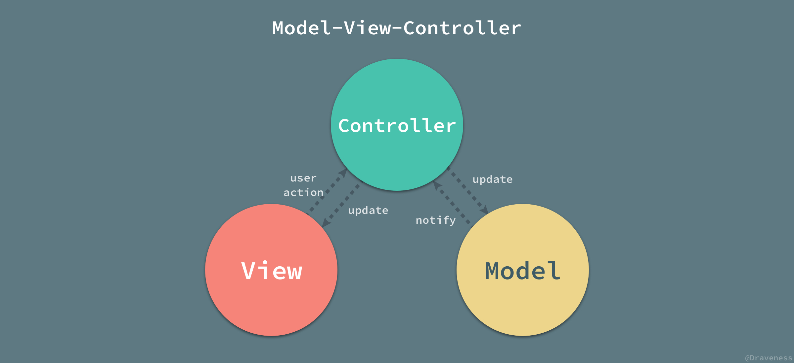
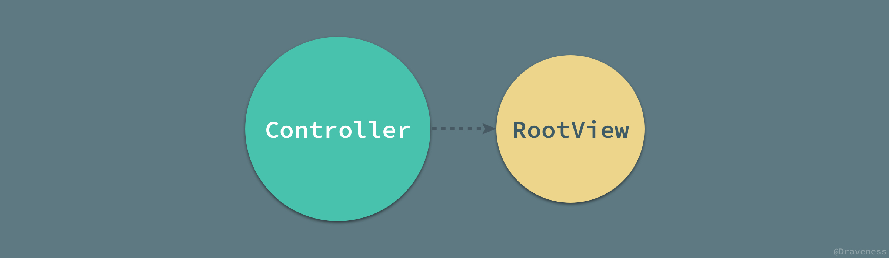
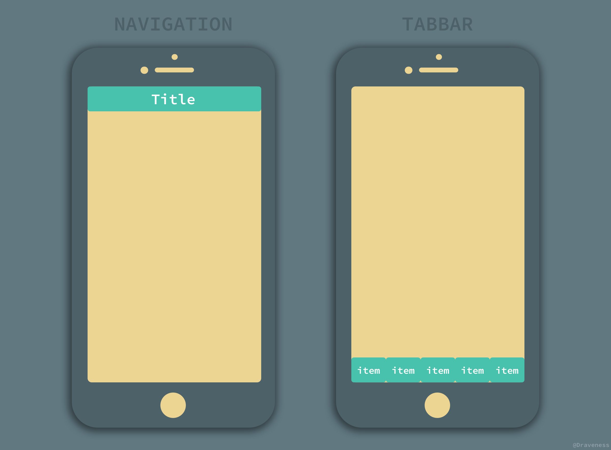
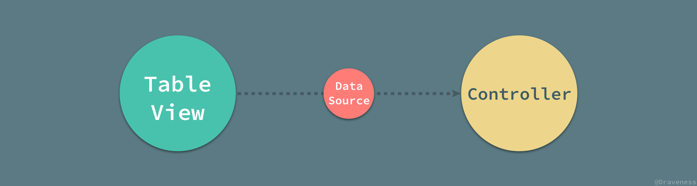
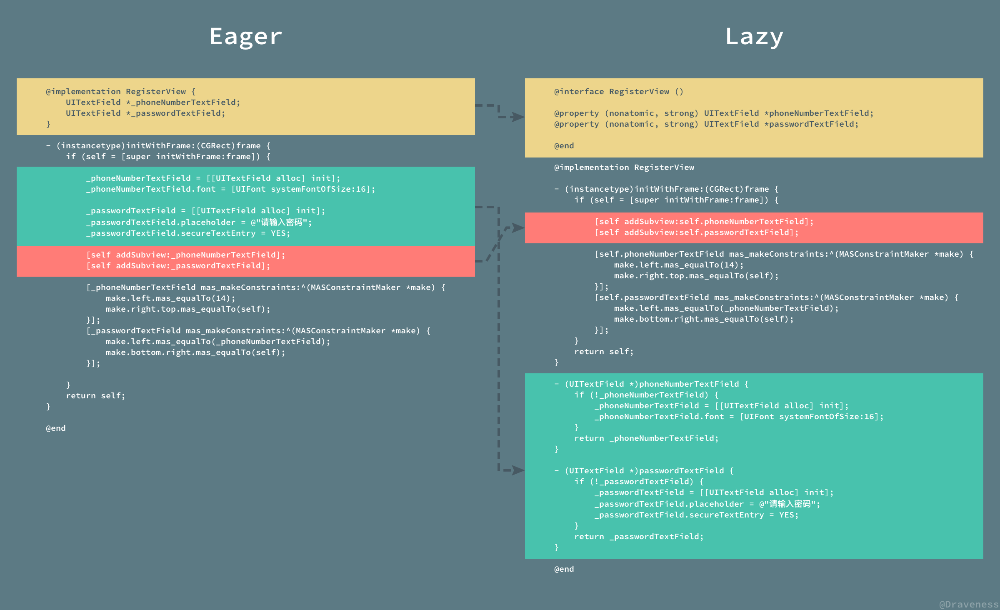
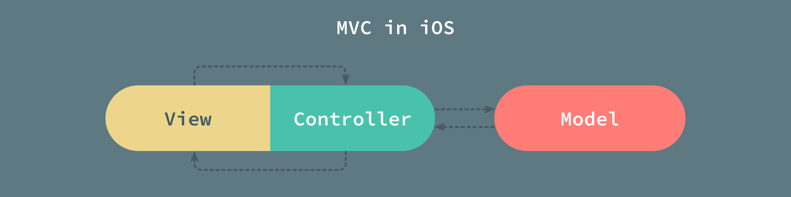
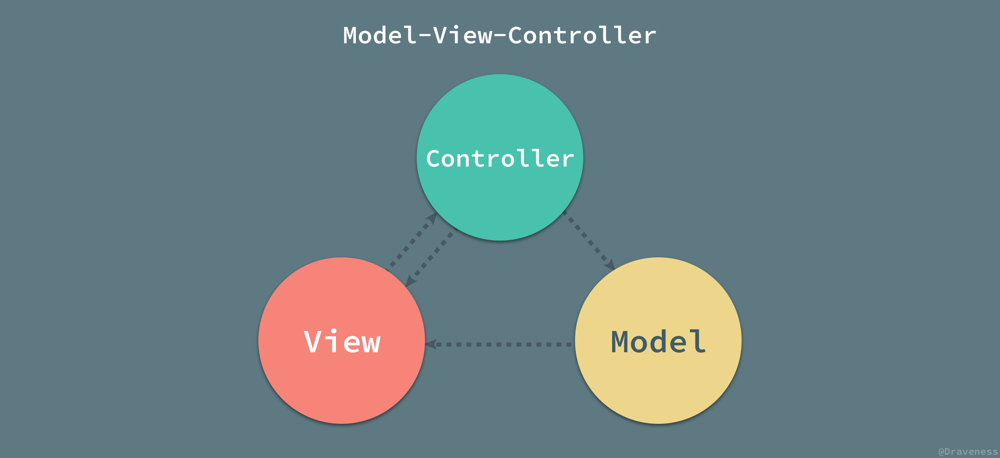

# 谈谈 MVX 中的 Controller

+ [谈谈 MVX 中的 Model](https://github.com/Draveness/iOS-Source-Code-Analyze/blob/master/contents/architecture/mvx-model.md)
+ [谈谈 MVX 中的 View](https://github.com/Draveness/iOS-Source-Code-Analyze/blob/master/contents/architecture/mvx-view.md) 
+ [谈谈 MVX 中的 Controller](https://github.com/Draveness/iOS-Source-Code-Analyze/blob/master/contents/architecture/mvx-controller.md)
+ [浅谈 MVC、MVP 和 MVVM 架构模式](https://github.com/Draveness/iOS-Source-Code-Analyze/blob/master/contents/architecture/mvx.md)

> Follow GitHub: [Draveness](https://github.com/Draveness)

在前两篇文章中，我们已经对 iOS 中的 Model 层以及 View 层进行了分析，划分出了它们的具体职责，其中 Model 层除了负责数据的持久存储、缓存工作，还要负责所有 HTTP 请求的发出等工作；而对于 View 层的职责，我们并没有做出太多的改变，有的只是细分其内部的视图种类，以及分离 `UIView` 不应该具有的属性和功能。

> 如果想要具体了解笔者对 Model 层以及 View 层的理解和设计，这是前面两篇文章的链接：[谈谈 MVX 中的 Model 层](http://draveness.me/mvx-model.html)、[谈谈 MVX 中的 View 层](http://draveness.me/mvx-view.html)

这是 MVX 系列的第三篇文章，而这篇文章准备介绍整个 MVX 中无法避免的话题，也就是 X 这一部分。

## X 是什么

在进入正题之前，我们首先要知道这里的 X 到底是什么？无论是在 iOS 开发领域还是其它的领域，造出了一堆又一堆的名词，除了我们最常见的 MVC 和 MVVM 以及 Android 中的 MVP 还有一些其他的奇奇怪怪的名词。


模型层和视图层是整个客户端应用不可分割的一部分，它们的职责非常清楚，一个用于处理本地数据的获取以及存储，另一个用于展示内容、接受用户的操作与事件；在这种情况下，整个应用中的其它功能和逻辑就会被自然而然的扔到 X 层中。

这个 X 在 MVC 中就是 Controller 层、在 MVVM 中就是 ViewModel 层，而在 MVP 中就是 Presenter 层，这篇文章介绍的就是 MVC 中的控制器层 Controller。

## 臃肿的 Controller

从 Cocoa Touch 框架使用十年以来，iOS 开发者就一直遵循框架中的设计，使用 Model-View-Controller 的架构模式开发 iOS 应用程序，下面也是对 iOS 中 MVC 的各层交互的最简单的说明。



iOS 中的 Model 层大多为 `NSObject` 的子类，也就是一个简单的对象；所有的 View 层对象都是 `UIView` 的子类；而 Controller 层的对象都是 `UIViewController` 的实例。

我们在这一节中主要是介绍 `UIViewController` 作为 Controller 层中的最重要的对象，它具有哪些职责，它与 Model 以及 View 层是如何进行交互的。

总体来说，Controller 层要负责以下的问题（包括但不仅限于）：

1. 管理根视图的生命周期和应用生命周期
1. 负责将视图层的 `UIView` 对象添加到持有的根视图上；
2. 负责处理用户行为，比如 `UIButton` 的点击以及手势的触发；
3. 储存当前界面的状态；
4. 处理界面之间的跳转；
3. 作为 `UITableView` 以及其它容器视图的代理以及数据源；
4. 负责 HTTP 请求的发起；

除了上述职责外，`UIViewController` 对象还可能需要处理**业务逻辑**以及各种复杂的动画，这也就是为什么在 iOS 应用中的 Controller 层都非常庞大、臃肿的原因了，而 MVVM、MVP 等架构模式的目的之一就是减少单一 Controller 中的代码。

### 管理生命周期

Controller 层作为整个 MVC 架构模式的中枢，承担着非常重要的职责，不仅要与 Model 以及 View 层进行交互，还有通过 AppDelegate 与诸多的应用生命周期打交道。

```objectivec
- (BOOL)application:(UIApplication *)application didFinishLaunchingWithOptions:(nullable NSDictionary<UIApplicationLaunchOptionsKey, id> *)launchOptions;
- (void)applicationWillResignActive:(UIApplication *)application;
- (void)application:(UIApplication *)application didReceiveRemoteNotification:(NSDictionary *)userInfo fetchCompletionHandler:(void (^)(UIBackgroundFetchResult))completionHandler;
```

虽然与应用生命周期沟通的工作并不在单独的 Controller 中，但是 `self.window.rootController` 作为整个应用程序界面的入口，还是需要在 AppDelegate 中进行设置。

除此之外，由于每一个 `UIViewController` 都持有一个视图对象，所以每一个 `UIViewController` 都需要负责这个根视图的加载、布局以及生命周期的管理，包括：

```objectivec
- (void)loadView;

- (void)viewWillLayoutSubviews;
- (void)viewDidLayoutSubviews;

- (void)viewDidLoad;
- (void)viewWillAppear:(BOOL)animated;
- (void)viewDidAppear:(BOOL)animated;
```

除了负责应用生命周期和视图生命周期，控制器还要负责展示内容和布局。

### 负责展示内容和布局

由于每一个 `UIViewController` 都持有一个 `UIView` 的对象，所以视图层的对象想要出现在屏幕上，必须成为这个根视图的子视图，也就是说视图层完全没有办法脱离 `UIViewController` 而单独存在，其一方面是因为 `UIViewController` 隐式的承担了应用中路由的工作，处理界面之间的跳转，另一方面就是 `UIViewController` 的设计导致了所有的视图必须加在其根视图上才能工作。



我们来看一段 `UIViewController` 中关于视图层的简单代码：

```objectivec
- (void)viewDidLoad {
    [super viewDidLoad];
    [self setupUI];
}

- (void)setupUI {
    _backgroundView = [[UIImageView alloc] initWithImage:[UIImage imageNamed:@"backgroundView"]];

    _registerButton = [[UIButton alloc] init];
    [_registerButton setTitle:@"注册" forState:UIControlStateNormal];
    [_registerButton setTitleColor:UIColorFromRGB(0x00C3F3) forState:UIControlStateNormal];
    [_registerButton addTarget:self action:@selector(registerButtonTapped:) forControlEvents:UIControlEventTouchUpInside];

    [self.view addSubview:_backgroundView];
    [self.view addSubview:_registerButton];

    [_backgroundView mas_makeConstraints:^(MASConstraintMaker *make) {
        make.edges.mas_equalTo(self.view);
    }];
    [_registerButton mas_makeConstraints:^(MASConstraintMaker *make) {
        make.size.mas_equalTo(CGSizeMake(140, 45));
        make.bottom.mas_equalTo(self.view).offset(-25);
        make.left.mas_equalTo(self.view).offset(32);
    }];
}
```

在这个欢迎界面以及大多数界面中，由于视图层的代码非常简单，我们很多情况下并不会去写一个单独的 `UIView` 类，而是将全部的视图层代码丢到了 `UIViewController` 中，这种情况下甚至也没有 Model 层，Controller 承担了全部的工作。


上述的代码对视图进行了初始化，将需要展示的视图加到了自己持有的根视图中，然后对这些视图进行简单的布局。

当然我们也可以将视图的初始化单独放到一个类中，不过仍然需要处理 `DRKBackgroundView` 视图的布局等问题。

```objectivec
- (void)setupUI {
    DRKBackgroundView *backgroundView = [[DRKBackgroundView alloc] init];
    [backgroundView.registerButton addTarget:self action:@selector(registerButtonTapped:) forControlEvents:UIControlEventTouchUpInside];

    [self.view addSubview:backgroundView];

    [backgroundView mas_makeConstraints:^(MASConstraintMaker *make) {
        make.edges.mas_equalTo(self.view);
    }];
}
```

`UIViewController` 的这种中心化的设计虽然简单，不过也导致了很多代码没有办法真正解耦，视图层必须依赖于 `UIViewController` 才能展示。

#### 惰性初始化

当然，很多人在 Controller 中也会使用惰性初始化的方式生成 Controller 中使用的视图，比如：

```objectivec
@interface ViewController ()

@property (nonatomic, strong) UIImageView *backgroundView;

@end

@implementation ViewController

- (UIImageView *)backgroundView {
    if (!_backgroundView) {
        _backgroundView = [[UIImageView alloc] initWithImage:[UIImage imageNamed:@"backgroundView"]];
    }
    return _backgroundView;
}

@end
```

这样在 `-viewDidLoad` 方法中就可以直接处理视图的视图层级以及布局工作：

```objectivec
- (void)viewDidLoad {
    [super viewDidLoad];

    [self.view addSubview:self.backgroundView];

    [self.backgroundView mas_makeConstraints:^(MASConstraintMaker *make) {
        make.edges.mas_equalTo(self.view);
    }];
}
```

惰性初始化的方法与其他方法其实并没有什么绝对的优劣，两者的选择只是对于代码规范的一种选择，我们所需要做的，只是在同一个项目中将其中一种做法坚持到底。

### 处理用户行为

在 `UIViewController` 中处理用户的行为是经常需要做的事情，这部分代码不能放到视图层或者其他地方的原因是，用户的行为经常需要与 Controller 的上下文有联系，比如，界面的跳转需要依赖于 `UINavigationController` 对象：

```objectivec
- (void)registerButtonTapped:(UIButton *)button {
    RegisterViewController *registerViewController = [[RegisterViewController alloc] init];
    [self.navigationController pushViewController:registerViewController animated:YES];
}
```

而有的用户行为需要改变模型层的对象、持久存储数据库中的数据或者发出网络请求，主要因为我们要秉承着 MVC 的设计理念，避免 Model 层和 View 层的直接耦合。

### 存储当前界面的状态

在 iOS 中，我们经常需要处理表视图，而在现有的大部分表视图在加载内容时都会进行分页，使用下拉刷新和上拉加载的方式获取新的条目，而这就需要在 Controller 层保存当前显示的页数：

```objectivec
@interface TableViewController ()

@property (nonatomic, assign) NSUInteger currentPage;

@end
```

只有保存在了当前页数的状态，才能在下次请求网络数据时传入合适的页数，最后获得正确的资源，当然哪怕当前页数是可以计算出来的，比如通过当前的 Model 对象的数和每页个 Model 数，在这种情况下，我们也需要在当前 Controller 中 Model 数组的值。

```objectivec
@interface TableViewController ()

@property (nonatomic, strong) NSArray<Model *> *models;

@end
```

在 MVC 的设计中，这种保存当前页面状态的需求是存在的，在很多复杂的页面中，我们也需要维护大量的状态，这也是 Controller 需要承担的重要职责之一。

### 处理界面之间的跳转

由于 Cocoa Touch 提供了 `UINavigationController` 和 `UITabBarController` 这两种容器 Controller，所以 iOS 中界面跳转的这一职责大部分都落到了 Controller 上。



iOS 中总共有三种界面跳转的方式：

+ `UINavigationController` 中使用 push 和 pop 改变栈顶的 `UIViewController` 对象；
+ `UITabBarController` 中点击各个 `UITabBarItem` 实现跳转；
+ 使用所有的 `UIViewController` 实例都具有的 `-presentViewController:animated:completion` 方法；

因为所有的 `UIViewController` 的实例都可以通过 `navigationController` 这一属性获取到最近的 `UINavigationController` 对象，所以我们不可避免的要在 Controller 层对界面之间的跳转进行操作。

> 当然，我们也可以引入 Router 路由对 `UIViewController` 进行注册，在访问合适的 URL 时，通过根 `UINavigationController` 进行跳转，不过这不是本篇文章想要说明的内容。

`UINavigationController` 提供的 API 还是非常简单的，我们可以直接使用 `-pushViewController:animated:` 就可以进行跳转。

```objectivec
RegisterViewController *registerViewController = [[RegisterViewController alloc] init];
[self.navigationController pushViewController:registerViewController animated:YES];
```

### 作为数据源以及代理

很多 Cocoa Touch 中视图层都是以代理的形式为外界提供接口的，其中最为典型的例子就是 `UITableView` 和它的数据源协议 `UITableViewDataSource` 和代理 `UITableViewDelegate`。

这是因为 `UITableView` 作为视图层的对象，需要根据 Model 才能知道自己应该展示什么内容，所以在早期的很多视图层组件都是用了代理的形式，从 Controller 或者其他地方获取需要展示的数据。

```objectivec
#pragma mark - UITableViewDataSource

- (NSInteger)tableView:(UITableView *)tableView numberOfRowsInSection:(NSInteger)section {
    return self.models.count;
}

- (UITableViewCell *)tableView:(UITableView *)tableView cellForRowAtIndexPath:(NSIndexPath *)indexPath {
    TableViewCell *cell = [tableView dequeueReusableCellWithIdentifier:@"cell" forIndexPath:indexPath];
    Model *model = self.models[indexPath.row];
    [cell setupWithModel:model];
    return cell;
}
```

上面就是使用 `UITableView` 时经常需要的方法。

很多文章中都提供了一种用于减少 Controller 层中代理方法数量的技巧，就是使用一个单独的类作为 `UITableView` 或者其他视图的代理：

```objectivec
self.tableView.delegate = anotherObject;
self.tableView.dataSource = anotherObject;
```

然而在笔者看来这种办法并没有什么太大的用处，只是将代理方法挪到了一个其他的地方，如果这个代理方法还依赖于当前 `UIViewController` 实例的上下文，还要向这个对象中传入更多的对象，反而让原有的 MVC 变得更加复杂了。

### 负责 HTTP 请求的发起

当用户的行为触发一些事件时，比如下拉刷新、更新 Model 的属性等等，Controller 就需要通过 Model 层提供的接口向服务端发出 HTTP 请求，这一过程其实非常简单，但仍然是 Controller 层的职责，也就是响应用户事件，并且更新 Model 层的数据。

```objectivec
- (void)registerButtonTapped:(UIButton *)button {
    LoginManager *manager = [LoginManager manager];
    manager.countryCode = _registerPanelView.countryCode;
    ...
    [manager startWithSuccessHandler:^(CCStudent *user) {
        self.currentUser = user;
        ...
    } failureHandler:^(NSError *error) {
        ...
    }];
}
```

当按钮被点击时 `LoginManager` 就会执行 `-startWithSuccessHandler:failureHandler:` 方法发起请求，并在请求结束后执行回调，更新 Model 的数据。

### 小结

iOS 中 Controller 层的职责一直都逃不开与 View 层和 Model 层的交互，因为其作用就是视图层的用户行为进行处理并更新视图的内容，同时也会改变模型层中的数据、使用 HTTP 请求向服务端请求新的数据等作用，其功能就是处理整个应用中的业务逻辑和规则。

但是由于 iOS 中 Controller 的众多职责，单一的 `UIViewController` 类可能会有上千行的代码，使得非常难以管理和维护，我们也希望在 iOS 中引入新的架构模式来改变 Controller 过于臃肿这一现状。

## 几点建议

Controller 层作为 iOS 应用中重要的组成部分，在 MVC 以及类似的架构下，笔者对于 Controller 的设计其实没有太多立竿见影的想法。作为应用中处理绝大多数逻辑的 Controller 其实很难简化其中代码的数量；我们能够做的，也是只对其中的代码进行一定的规范以提高它的可维护性，在这里，笔者有几点对于 Controller 层如何设计的建议，供各位读者参考。

### 不要把 DataSource 提取出来

iOS 中的 `UITableView` 和 `UICollectionView` 等需要 `dataSource` 的视图对象十分常见，在一些文章中会提议将数据源的实现单独放到一个对象中。

```objectivec
void (^configureCell)(PhotoCell*, Photo*) = ^(PhotoCell* cell, Photo* photo) {
   cell.label.text = photo.name;
};
photosArrayDataSource = [[ArrayDataSource alloc] initWithItems:photos
                                                cellIdentifier:PhotoCellIdentifier
                                            configureCellBlock:configureCell];
self.tableView.dataSource = photosArrayDataSource;
```

在 [Lighter View Controllers](https://www.objc.io/issues/1-view-controllers/lighter-view-controllers/) 一文中就建议可以将数据源协议的实现方法放到 `ArrayDataSource` 对象中：

```objectivec
@implementation ArrayDataSource

- (id)itemAtIndexPath:(NSIndexPath*)indexPath {
    return items[(NSUInteger)indexPath.row];
}

- (NSInteger)tableView:(UITableView*)tableView 
 numberOfRowsInSection:(NSInteger)section {
    return items.count;
}

- (UITableViewCell*)tableView:(UITableView*)tableView 
        cellForRowAtIndexPath:(NSIndexPath*)indexPath {
    id cell = [tableView dequeueReusableCellWithIdentifier:cellIdentifier
                                              forIndexPath:indexPath];
    id item = [self itemAtIndexPath:indexPath];
    configureCellBlock(cell,item);
    return cell;
}

@end
```

做出这种建议的理由是：单独的 `ArrayDataSource` 类可以更方便的进行测试，同时，展示一个数组的对象是表视图中非常常见的需求，而 `ArrayDataSource` 能够将这种需求抽象出来并进行重用，也可以达到减轻视图控制器负担的最终目的，但是在笔者看来，上述做法并没有起到**实质性**效果，只是简单的将视图控制器中的一部分代码*移到了*别的位置而已，还会因为增加了额外的类使 Controller 的维护变得更加的复杂。



让每一个 Controller 作为 `UITableView` 对象的代理和数据源其实是没有任何问题的，将这些方法移出 Controller 并不能解决实际的问题。

### 属性和实例变量的选择

文章的前面曾经提到过在很多的 iOS 应用中，Controller 由于持有一个根视图 `UIView` 对象，所以需要负责展示内容以及布局，很多 iOS 开发者都把一些模块的视图层代码放到了控制器中，但是无论是将视图层代码放到控制器中，还是新建一个单独的视图类都需要对视图以及子视图进行初始化和布局。

在对视图进行初始化和布局时，我们有两种选择，一种是使用实例变量的方式主动对视图对象进行初始化，另一种是使用属性 `@property` 对视图对象进行惰性初始化。



虽然上述两种代码在结果上几乎是等价的，但是笔者更加偏好两者之中的后者，它将各个视图属性的初始化放到了各个属性的 getter 方法中，能够将代码在逻辑上分块还是比较清晰的。这两种方法其实只是不同的 taste，有些人会坚持将不需要暴露的变量都写成 `_xxx` 的形式，有些人更喜欢后者这种分散的写法，这些都不是什么太大的问题，而且很多人担心的性能问题其实也根本不是问题，重要的是我们要在同一个项目中坚持同一种写法，并且保证只有同一个风格的代码合入主分支。

### 把业务逻辑移到 Model 层

控制器中有很多代码和逻辑其实与控制器本身并没有太多的关系，比如：

```objectivec
@implementation ViewController

- (NSString *)formattedPostCreatedAt {
    NSDateFormatter *format = [[NSDateFormatter alloc] init];
    [format setDateFormat:@"MMM dd, yyyy HH:mm"];
    return [format stringFromDate:self.post.createdAt];
}

@end
```

在 [谈谈 MVX 中的 Model 层](http://draveness.me/mvx-model.html) 一文中，我们曾经分析过，上述逻辑其实应该属于 Model 层，作为 `Post` 的一个实例方法：

```objectivec
@implementation Post

- (NSString *)formattedCreatedAt {
    NSDateFormatter *format = [[NSDateFormatter alloc] init];
    [format setDateFormat:@"MMM dd, yyyy HH:mm"];
    return [format stringFromDate:self.createdAt];
}

@end
```

这一条建议是从一些经典的后端 MVC 框架中学习的，Rails 提倡 *Fat Model, Skinny Controller* 就是希望开发者将 Model 相关的业务逻辑都放到 Model 层中，以减轻 Controller 层的负担。

### 把视图层代码移到 View 层

因为 UIKit 框架设计的原因，Controller 和 View 层是强耦合的，每一个 `UIViewController` 都会持有一个 `UIView` 视图对象，这也是导致我们将很多的视图层代码直接放在 Controller 层的原因。



这种做法在当前模块的视图层比较简单时，笔者觉得没有任何的问题，虽然破坏了经典的 MVC 的架构图，但是也不是什么问题；不过，当视图层的视图对象非常多的时候，大量的配置和布局代码就会在控制器中占据大量的位置，我们可以将整个视图层的代码都移到一个单独的 `UIView` 子类中。

```objectivec
// RegisterView.h
@interface RegisterView : UIView

@property (nonatomic, strong) UITextField *phoneNumberTextField;
@property (nonatomic, strong) UITextField *passwordTextField;

@end

// RegisterView.m
@implementation RegisterView 

- (instancetype)initWithFrame:(CGRect)frame {
    if (self = [super initWithFrame:frame]) {
        [self addSubview:self.phoneNumberTextField];
        [self addSubview:self.passwordTextField];

        [self.phoneNumberTextField mas_makeConstraints:^(MASConstraintMaker *make) {
            ...
        }];
        [self.passwordTextField mas_makeConstraints:^(MASConstraintMaker *make) {
            ...
        }];
    }
    return self;
}

- (UITextField *)phoneNumberTextField {
    if (!_phoneNumberTextField) {
        _phoneNumberTextField = [[UITextField alloc] init];
        _phoneNumberTextField.font = [UIFont systemFontOfSize:16];
    }
    return _phoneNumberTextField;
}

- (UITextField *)passwordTextField {
    if (!_passwordTextField) {
        _passwordTextField = [[UITextField alloc] init];
        ...
    }
    return _passwordTextField;
}

@end
```

而 Controller 需要持有该视图对象，并将自己持有的根视图替换成该视图对象：

```objectivec
@interface ViewController ()

@property (nonatomic, strong) RegisterView *view;

@end

@implementation ViewController

@dynamic view;

- (void)loadView {
    self.view = [[RegisterView alloc] initWithFrame:[[UIScreen mainScreen] bounds]];
}

- (void)viewDidLoad {
    [super viewDidLoad];
}

@end
```

在 `UIViewController` 对象中，我们可以通过覆写 `-loadView` 方法改变其本身持有的视图对象，并使用新的 `@property` 声明以及 `@dynamic` 改变 Controller 持有的根视图，这样我们就把视图层的配置和布局代码从控制器中完全分离了。

### 使用 pragma 或 extension 分割代码块

在很多时候，我们对于 Controller 中上千行的代码是非常绝望的，不熟悉这个模块的开发者想要在里面快速找到自己想要的信息真的是非常的麻烦，尤其是如果一个 `UIViewController` 中的代码没有被组织好的话，那分析起来更是异常头疼。

我们既然没有把上千行的代码瞬间变没的方法，那就只能想想办法在现有的代码上进行美化了，办法其实很简单，就是将具有相同功能的代码分块并使用 `pragma` 预编译指定或者 `MARK` 加上 `extension` 对代码块进行分割。

这里给一个简单的例子，

```objectivec
@implementation ViewController

- (void)viewDidLoad {
    [super viewDidLoad];
    [self setupUI];
}

- (void)layoutSubviews { }

#pragma mark - UI

- (void)setupUI {}

#pragma mark - UITableViewDataSource

- (NSInteger)tableView:(UITableView *)tableView numberOfRowsInSection:(NSInteger)section { 
    return 1; 
}
...

#pragma mark - UITableViewDelegate

- (CGFloat)tableView:(UITableView *)tableView heightForRowAtIndexPath:(NSIndexPath *)indexPath {
    return 100.0;
}
...

#pragma mark - Callback

- (void)buttonTapped:(UIButton *)button {}
- (void)gestureTriggered:(UIGestureRecognizer *)gesture {}
- (void)keyboardWillShow:(NSNotification *)noti {}

#pragma mark - Getter/Setter

- (NSString *)string { return _string; }
- (void)setString:(NSString*)string { _string = string; }

#pragma mark - Helper

- (void)helperMethod {}

@end
```

一个 `UIViewController` 大体由上面这些部分组成：

+ 生命周期以及一些需要 `override` 的方法
+ 视图层代码的初始化
+ 各种数据源和代理协议的实现
+ 事件、手势和通知的回调
+ 实例变量的存取方法
+ 一些其他的 Helper 方法

在 Objective-C 的工程中，我们使用 `pragma` 预编译指令来对 `UIViewController` 中的；在 Swift 中，我们可以使用 `extension` 加上 `MARK` 来对代码进行分块：

```swift
class ViewController: UIViewController {}

// MARK: - UI
extension ViewController {}

// MARK: - UITableViewDataSource
extension ViewController: UITableViewDataSource {}

// MARK: - UITableViewDelegate
extension ViewController: UITableViewDelegate {}

// MARK: - Callback
extension ViewController {}

// MARK: - Getter/Setter
extension ViewController {}

// MARK: - Helper
extension ViewController {}
```

上述方法是一种在控制器层分割代码块的方法，它们的顺序并不是特别的重要，最重要的还是要在不同的控制器中保持上述行为的一致性，将合理的方法放到合适的代码块中。

### 耦合的 View 和 Model 层

很多的 iOS 项目中都会为 `UIView` 添加一个绑定 Model 对象的方法，比如说：

```objectivec
@implementation UIView (Model)

- (void)setupWithModel:(id)model {}

@end
```

这个方法也可能叫做 `-bindWithModel:` 或者其他名字，其作用就是根据传入的 Model 对象更新当前是视图中的各种状态，比如 `UILabel` 中的文本、`UIImageView` 中的图片等等。

有了上述分类，我们可以再任意的 `UIView` 的子类中覆写该方法：

```objectivec
- (void)setupWithModel:(Model *)model {
    self.imageView.image = model.image;
    self.label.text = model.name;
}
```

这种做法其实是将原本 Controller 做的事情放到了 View 中，由视图层来负责如何展示模型对象；虽然它能够减少 Controller 中的代码，但是也导致了 View 和 Model 的耦合。



对于 MVC 架构模式中，Model、View 和 Controller 之间的交互没有明确的规则，但是视图和模型之间的耦合会导致视图层代码很难复用；因为这样设计的视图层都依赖于外部的模型对象，所以**如果同一个视图需要显示多种类型的模型时就会遇到问题**。

视图和模型之间解耦是通过控制器来处理的，控制器获取模型对象并取出其中的属性一一装填到视图中，也就是将 `-setupWithModel:` 方法中的代码从视图层移到控制器层中，并在视图类中暴露合适的接口。

## 总结

本文虽然对 Controller 层的职责进行了分析，但是由于 Controller 在 MVC 中所处的位置，如果不脱离 MVC 架构模式，那么 Controller 的职责很难简化，只能在代码规范和职责划分上进行限制，而在下一篇文章中我们会详细讨论 MVC 以及衍化出来的 MVP 以及 MVVM 到底是什么、以及它们有什么样的差异。

## Reference

+ [Lighter View Controllers](https://www.objc.io/issues/1-view-controllers/lighter-view-controllers/)


