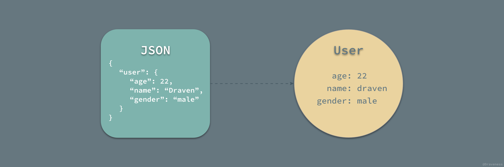
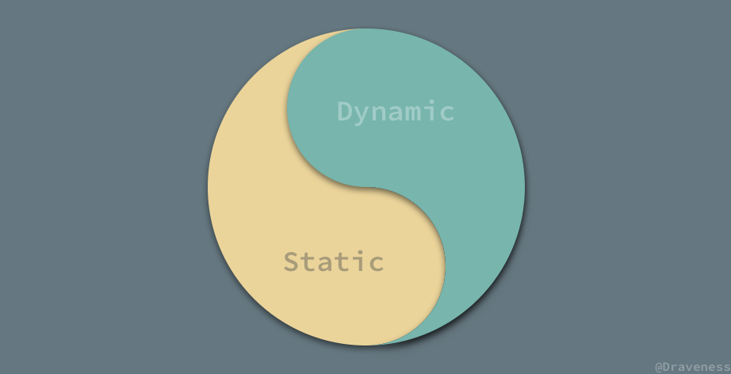
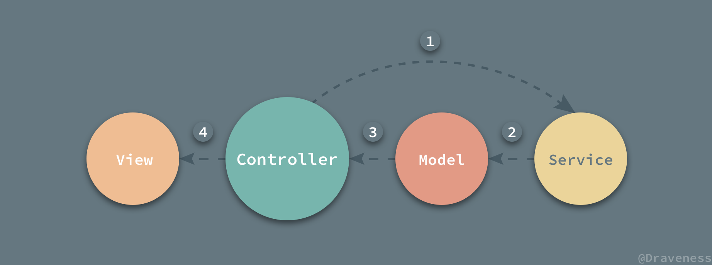
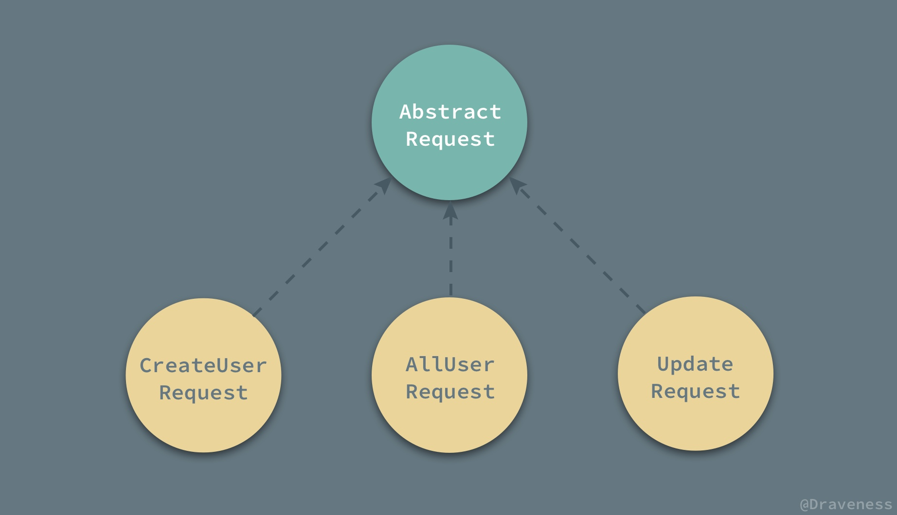
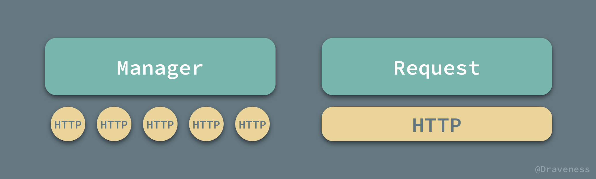
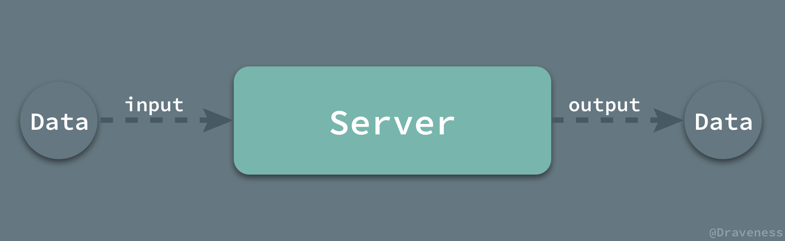
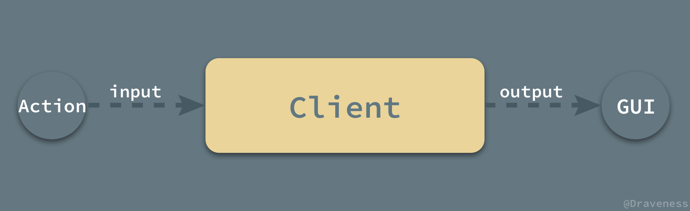
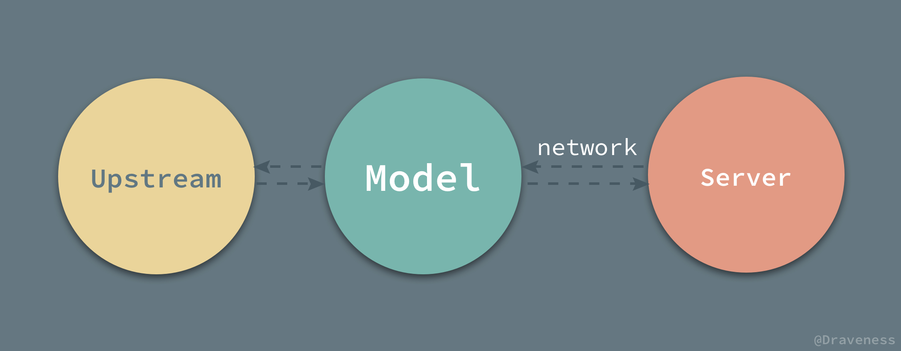

# 谈谈 MVX 中的 Model

+ [谈谈 MVX 中的 Model](https://github.com/Draveness/iOS-Source-Code-Analyze/blob/master/contents/architecture/mvx-model.md)
+ [谈谈 MVX 中的 View](https://github.com/Draveness/iOS-Source-Code-Analyze/blob/master/contents/architecture/mvx-view.md) 
+ [谈谈 MVX 中的 Controller](https://github.com/Draveness/iOS-Source-Code-Analyze/blob/master/contents/architecture/mvx-controller.md)
+ [浅谈 MVC、MVP 和 MVVM 架构模式](https://github.com/Draveness/iOS-Source-Code-Analyze/blob/master/contents/architecture/mvx.md)

> Follow GitHub: [Draveness](https://github.com/Draveness)


## 常见的 Model 层

在大多数 iOS 的项目中，Model 层只是一个单纯的数据结构，你可以看到的绝大部分模型都是这样的：

```swift
struct User {
    enum Gender: String {
        case male = "male"
        case female = "female"
    }
    let name: String
    let email: String
    let age: Int
    let gender: Gender
}
```

模型起到了定义一堆『坑』的作用，只是一个简单的模板，并没有参与到实际的业务逻辑，只是在模型层进行了一层**抽象**，将服务端发回的 JSON 或者说 `Dictionary` 对象中的字段一一取出并装填到预先定义好的模型中。



我们可以将这种模型层中提供的对象理解为『即开即用』的 `Dictionary` 实例；在使用时，可以直接从模型中取出属性，省去了从 `Dictionary` 中抽出属性以及验证是否合法的过程。

```swift
let user = User...

nameLabel.text = user.name
emailLabel.text = user.email
ageLabel.text = "\(user.age)"
genderLabel.text = user.gender.rawValue
```

### JSON -> Model

使用 Swift 将 `Dictionary` 转换成模型，在笔者看来其实是一件比较麻烦的事情，主要原因是 Swift 作为一个号称类型安全的语言，有着使用体验非常差的 Optional 特性，从 `Dictionary` 中取出的值都是不一定存在的，所以如果需要纯手写这个过程其实还是比较麻烦的。

```swift
extension User {
    init(json: [String: Any]) {
        let name = json["name"] as! String
        let email = json["email"] as! String
        let age = json["age"] as! Int
        let gender = Gender(rawValue: json["gender"] as! String)!
        self.init(name: name, email: email, age: age, gender: gender)
    }
}
```

这里为 `User` 模型创建了一个 extension 并写了一个简单的模型转换的初始化方法，当我们从 JSON 对象中取值时，得到的都是 Optional 对象；而在大多数情况下，我们都没有办法直接对 Optional 对象进行操作，这就非常麻烦了。

#### 麻烦的 Optional

在 Swift 中遇到无法立即使用的 Optional 对象时，我们可以会使用 `!` 默认将字典中取出的值当作非 Optional 处理，但是如果服务端发回的数据为空，这里就会直接崩溃；当然，也可使用更加安全的 `if let` 对 Optional 对象进行解包（unwrap）。

```swift
extension User {
    init?(json: [String: Any]) {
        if let name = json["name"] as? String,
            let email = json["email"] as? String,
            let age = json["age"] as? Int,
            let genderString = json["gender"] as? String,
            let gender = Gender(rawValue: genderString) {
            self.init(name: name, email: email, age: age, gender: gender)
        }
        return nil
    }
}
```

上面的代码看起来非常的丑陋，而正是因为上面的情况在 Swift 中非常常见，所以社区在 Swift 2.0 中引入了 `guard` 关键字来优化代码的结构。

```swift
extension User {
    init?(json: [String: Any]) {
        guard let name = json["name"] as? String,
            let email = json["email"] as? String,
            let age = json["age"] as? Int,
            let genderString = json["gender"] as? String,
            let gender = Gender(rawValue: genderString) else {
                return nil
        }
        self.init(name: name, email: email, age: age, gender: gender)
    }
}
```

不过，上面的代码在笔者看来，并没有什么本质的区别，不过使用 `guard` 对错误的情况进行提前返回确实是一个非常好的编程习惯。

#### 不关心空值的 OC

为什么 Objective-C 中没有这种问题呢？主要原因是在 OC 中所有的对象其实都是 Optional 的，我们也并不在乎对象是否为空，因为在 OC 中**向 nil 对象发送消息并不会造成崩溃，Objective-C 运行时仍然会返回 nil 对象**。

> 这虽然在一些情况下会造成一些问题，比如，当 `nil` 导致程序发生崩溃时，比较难找到程序中 `nil` 出现的原始位置，但是却保证了程序的灵活性，笔者更倾向于 Objective-C 中的做法，不过这也就见仁见智了。

OC 作为动态语言，这种设计思路其实还是非常优秀的，它避免了大量由于对象不存在导致无法完成方法调用造成的崩溃；同时，作为开发者，我们往往都不需要考虑 `nil` 的存在，所以使用 OC 时写出的模型转换的代码都相对好看很多。

```objectivec
// User.h
typedef NS_ENUM(NSUInteger, Gender) {
    Male = 0,
    Female = 1,
};

@interface User: NSObject

@property (nonatomic, strong) NSString *email;
@property (nonatomic, strong) NSString *name;
@property (nonatomic, assign) NSUInteger age;
@property (nonatomic, assign) Gender gender;

@end

// User.m
@implementation User

- (instancetype)initWithJSON:(NSDictionary *)json {
    if (self = [super init]) {
        self.email = json[@"email"];
        self.name = json[@"name"];
        self.age = [json[@"age"] integerValue];
        self.gender = [json[@"gender"] integerValue];
    }
    return self;
}

@end
```

当然，在 OC 中也有很多优秀的 JSON 转模型的框架，如果我们使用 YYModel 这种开源框架，其实只需要写一个 `User` 类的定义就可以获得 `-yy_modelWithJSON:` 等方法来初始化 `User` 对象：

```objectivec
User *user = [User yy_modelWithJSON:json];
```

而这也是通过 Objective-C 强大的运行时特性做到的。

> 除了 YYModel，我们也可以使用 Mantle 等框架在 OC 中解决 JSON 到模型的转换的问题。

#### 元编程能力

从上面的代码，我们可以看出：Objective-C 和 Swift 对于相同功能的处理，却有较大差别的实现。这种情况的出现主要原因是语言的设计思路导致的；Swift 一直*鼓吹*自己有着较强的安全性，能够写出更加稳定可靠的应用程序，而安全性来自于 Swift 语言的设计哲学；由此看来静态类型、安全和动态类型、元编程能力（？）看起来是比较难以共存的。

> 其实很多静态编程语言，比如 C、C++ 和 Rust 都通过宏实现了比较强大的元编程能力，虽然 Swift 也通过模板在元编程支持上做了一些微小的努力，不过到目前来看（ 3.0 ）还是远远不够的。



OC 中对于 `nil` 的处理能够减少我们在编码时的工作量，不过也对工程师的代码质量提出了考验。我们需要思考 `nil` 的出现会不会带来崩溃，是否会导致行为的异常、增加应用崩溃的风险以及不确定性，而这也是 Swift 引入 Optional 这一概念来避免上述问题的初衷。

相比而言，笔者还是更喜欢强大的元编程能力，这样可以减少大量的重复工作并且提供更多的可能性，与提升工作效率相比，牺牲一些安全性还是可以接受的。

### 网络服务 Service 层

现有的大多数应用都会将网路服务组织成单独的一层，所以有时候你会看到所谓的 MVCS 架构模式，它其实只是在 MVC 的基础上加上了一个服务层（Service），而在 iOS 中常见的 MVC 架构模式也都可以理解为 MVCS 的形式，当引入了 Service 层之后，整个数据的获取以及处理的流程是这样的：



1. 大多数情况下服务的发起都是在 Controller 中进行的；
2. 然后会在 HTTP 请求的回调中交给模型层处理 JSON 数据；
3. 返回开箱即用的对象交还给 Controller 控制器；
4. 最后由 View 层展示服务端返回的数据；

不过按理来说服务层并不属于模型层，为什么要在这里进行介绍呢？这是因为 **Service 层其实与 Model 层之间的联系非常紧密**；网络请求返回的结果决定了 Model 层该如何设计以及该有哪些功能模块，而 Service 层的设计是与后端的 API 接口的设计强关联的，这也是我们谈模型层的设计无法绕过的坑。

iOS 中的 Service 层大体上有两种常见的组织方式，其中一种是命令式的，另一种是声明式的。

#### 命令式

命令式的 Service 层一般都会为每一个或者一组 API 写一个专门用于 HTTP 请求的 Manager 类，在这个类中，我们会在每一个静态方法中使用 AFNetworking 或者 Alamofire 等网络框架发出 HTTP 请求。

```objectivec
import Foundation
import Alamofire

final class UserManager {
    static let baseURL = "http://localhost:3000"
    static let usersBaseURL = "\(baseURL)/users"

    static func allUsers(completion: @escaping ([User]) -> ()) {
        let url = "\(usersBaseURL)"
        Alamofire.request(url).responseJSON { response in
            if let jsons = response.result.value as? [[String: Any]] {
                let users = User.users(jsons: jsons)
                completion(users)
            }
        }
    }
    
    static func user(id: Int, completion: @escaping (User) -> ()) {
        let url = "\(usersBaseURL)/\(id)"
        Alamofire.request(url).responseJSON { response in
            if let json = response.result.value as? [String: Any],
                let user = User(json: json) {
                completion(user)
            }
        }
    }
}
```

在这个方法中，我们完成了网络请求、数据转换 JSON、JSON 转换到模型以及最终使用 `completion` 回调的过程，调用 Service 服务的 Controller 可以直接从回调中使用构建好的 Model 对象。

```objectivec
UserManager.user(id: 1) { user in
    self.nameLabel.text = user.name
    self.emailLabel.text = user.email
    self.ageLabel.text = "\(user.age)"
    self.genderLabel.text = user.gender.rawValue
}
```

#### 声明式

使用声明式的网络服务层与命令式的方法并没有本质的不同，它们最终都调用了底层的一些网络库的 API，这种网络服务层中的请求都是以配置的形式实现的，需要对原有的命令式的请求进行一层封装，也就是说所有的参数 `requestURL`、`method` 和 `parameters` 都应该以配置的形式声明在每一个 `Request` 类中。



如果是在 Objective-C 中，一般会定义一个抽象的基类，并让所有的 Request 都继承它；但是在 Swift 中，我们可以使用协议以及协议扩展的方式实现这一功能。

```swift
protocol AbstractRequest {
    var requestURL: String { get }
    var method: HTTPMethod { get }
    var parameters: Parameters? { get }
}

extension AbstractRequest {
    func start(completion: @escaping (Any) -> Void) {
        Alamofire.request(requestURL, method: self.method).responseJSON { response in
            if let json = response.result.value {
                completion(json)
            }
        }
    }
}
```

在 `AbstractRequest` 协议中，我们定义了发出一个请求所需要的全部参数，并在协议扩展中实现了 `start(completion:)` 方法，这样实现该协议的类都可以直接调用 `start(completion:)` 发出网络请求。

```swift
final class AllUsersRequest: AbstractRequest {
    let requestURL = "http://localhost:3000/users"
    let method = HTTPMethod.get
    let parameters: Parameters? = nil
}

final class FindUserRequest: AbstractRequest {
    let requestURL: String
    let method = HTTPMethod.get
    let parameters: Parameters? = nil
    
    init(id: Int) {
        self.requestURL = "http://localhost:3000/users/\(id)"
    }
}
```

我们在这里写了两个简单的 `Request` 类 `AllUsersRequest` 和 `FindUserRequest`，它们两个一个负责获取所有的 `User` 对象，一个负责从服务端获取指定的 `User`；在使用上面的声明式 Service 层时也与命令式有一些不同：

```swift
FindUserRequest(id: 1).start { json in
    if let json = json as? [String: Any],
        let user = User(json: json) {
        print(user)
    }
}
```

因为在 Swift 中，我们没法将 JSON 在 Service 层转换成模型对象，所以我们不得不在 `FindUserRequest` 的回调中进行类型以及 JSON 转模型等过程；又因为 HTTP 请求可能依赖其他的参数，所以在使用这种形式请求资源时，我们需要在初始化方法传入参数。

#### 命令式 vs 声明式

现有的 iOS 开发中的网络服务层一般都是使用这两种组织方式，我们一般会按照**资源**或者**功能**来划分命令式中的 `Manager` 类，而声明式的 `Request` 类与实际请求是一对一的关系。



这两种网络层的组织方法在笔者看来没有高下之分，无论是 `Manager` 还是 `Request` 的方式，尤其是后者由于一个类只对应一个 API 请求，在整个 iOS 项目变得异常复杂时，就会导致**网络层类的数量剧增**。

这个问题并不是不可以接受的，在大多数项目中的网络请求就是这么做的，虽然在查找实际的请求类时有一些麻烦，不过只要遵循一定的**命名规范**还是可以解决的。

### 小结

现有的 MVC 下的 Model 层，其实只起到了对数据结构定义的作用，它将服务端返回的 JSON 数据，以更方便使用的方式包装了一下，这样呈现给上层的就是一些即拆即用的『字典』。


单独的 Model 层并不能返回什么关键的作用，它只有与网络服务层 Service 结合在一起的时候才能发挥更重要的能力。


而网络服务 Service 层是对 HTTP 请求的封装，其实现形式有两种，一种是命令式的，另一种是声明式的，这两种实现的方法并没有绝对的优劣，遵循合适的形式设计或者重构现有的架构，随着应用的开发与迭代，为上层提供相同的接口，保持一致性才是设计 Service 层最重要的事情。

## 服务端的 Model 层

虽然文章是对客户端中 Model 层进行分析和介绍，但是在客户端大规模使用 MVC 架构模式之前，服务端对于 MVC 的使用早已有多年的历史，而移动端以及 Web 前端对于架构的设计是近年来才逐渐被重视。

因为客户端的应用变得越来越复杂，动辄上百万行代码的巨型应用不断出现，以前流水线式的开发已经没有办法解决现在的开发、维护工作，所以合理的架构设计成为客户端应用必须要重视的事情。

这一节会以 Ruby on Rails 中 Model 层的设计为例，分析在经典的 MVC 框架中的 Model 层是如何与其他模块进行交互的，同时它又担任了什么样的职责。

### Model 层的职责

Rails 中的 Model 层主要承担着以下两大职责：

1. 使用数据库存储并管理 Web 应用的数据；
2. 包含 Web 应用**所有**的业务逻辑；

除了上述两大职责之外，Model 层还会存储应用的状态，同时，由于它对用户界面一无所知，所以它不依赖于任何视图的状态，这也使得 Model 层的代码可以复用。

Model 层的两大职责决定了它在整个 MVC 框架的位置：


因为 Model 是对数据库中表的映射，所以当 Controller 向 Model 层请求数据时，它会从数据库中获取相应的数据，然后对数据进行加工最后返回给 Controller 层。

#### 数据库

Model 层作为数据库中表的映射，它就需要实现两部分功能：

1. 使用合理的方式对数据库进行迁移和更新；
2. 具有数据库的绝大部分功能，包括最基础的增删改查；

在这里我们以 Rails 的 ActiveRecord 为例，简单介绍这两大功能是如何工作的。

ActiveRecord 为数据库的迁移和更新提供了一种名为 Migration 的机制，它可以被理解为一种 DSL，对数据库中的表的字段、类型以及约束进行描述：

```ruby
class CreateProducts < ActiveRecord::Migration[5.0]
  def change
    create_table :products do |t|
      t.string :name
      t.text :description
    end
  end
end
```

上面的 Ruby 代码创建了一个名为 `Products` 表，其中包含三个字段 `name`、`description` 以及一个默认的主键 `id`，然而在上述文件生成时，数据库中对应的表还不存在，当我们在命令行中执行 `rake db:migrate` 时，才会执行下面的 SQL 语句生成一张表：

```sql
CREATE TABLE products (
    id int(11)   DEFAULT NULL auto_increment PRIMARY KEY
    name         VARCHAR(255),
    description  text,
);
```

同样地，如果我们想要更新数据库中的表的字段，也需要创建一个 Migration 文件，ActiveRecord 会为我们直接生成一个 SQL 语句并在数据库中执行。

ActiveRecord 对数据库的增删改查功能都做了相应的实现，在使用它进行数据库查询时，会生成一条 SQL 语句，在数据库中执行，并将执行的结果初始化成一个 Model 的实例并返回：

```ruby
user = User.find(10)
# => SELECT * FROM users WHERE (users.id = 10) LIMIT 1
```

这就是 ActiveRecord 作为 Model 层的 ORM 框架解决两个关键问题的方式，其最终结果都是生成一条 SQL 语句并扔到数据库中执行。


总而言之，Model 层为调用方屏蔽了所有与数据库相关的底层细节，使开发者不需要考虑如何手写 SQL 语句，只需要关心原生的代码，能够极大的降低出错的概率；但是，由于 SQL 语句都由 Model 层负责处理生成，它并不会根据业务帮助我们优化 SQL 查询语句，所以在遇到数据量较大时，其性能难免遇到各种问题，我们仍然需要手动优化查询的 SQL 语句。

#### Controller

Model 与数据库之间的关系其实大多数都与数据的存储查询有关，而与 Controller 的关系就不是这样了，在 Rails 这个 MVC 框架中，提倡将业务逻辑放到 Model 层进行处理，也就是所谓的：

> Fat Models, skinny controllers.

这种说法形成的原因是，在绝大部分的 MVC 框架中，Controller 的作用都是将请求代理给 Model 去完成，它本身并不包含任何的业务逻辑，任何实际的查询、更新和删除操作都不应该在 Controller 层直接进行，而是要讲这些操作交给 Model 去完成。

```ruby
class UsersController
  def show
    @user = User.find params[:id]
  end
end
```

这也就是为什么在后端应用中设计合理的 Controller 实际上并没有多少行代码，因为大多数业务逻辑相关的代码都会放到 Model 层。

Controller 的作用更像是胶水，将 Model 层中获取的模型传入 View 层中，渲染 HTML 或者返回 JSON 数据。

### 小结

虽然服务端对于应用架构的设计已经有了很长时间的沉淀，但是由于客户端和服务端的职责截然不同，我们可以从服务端借鉴一些设计，但是并不应该照搬后端应用架构设计的思路。

服务端重数据，如果把整个 Web 应用看做一个黑箱，那么它的输入就是用户发送的数据，发送的形式无论是遵循 HTTP 协议也好还是其它协议也好，它们都是数据。



在服务端拿到数据后对其进行处理、加工以及存储，最后仍然以数据的形式返回给用户。

而客户端重展示，其输入就是用户的行为触发的事件，而输出是用户界面：



也就是说，用户的行为在客户端应用中得到响应，并更新了用户界面 GUI。总而言之：

> 客户端重展示，服务端重数据。

这也是在设计客户端 Model 层时需要考虑的重要因素。

## 理想中的 Model 层

在上面的两个小节中，分别介绍了 iOS 中现有的 Model 层以及服务端的 Model 层是如何使用的，并且介绍了它们的职责，在这一章节中，我们准备介绍笔者对于 Model 层的看法以及设计。

### 明确职责

在具体讨论 Model 层设计之前，肯定要明确它的职责，它应该做什么、不应该做什么以及需要为外界提供什么样的接口和功能。

客户端重展示，无论是 Web、iOS 还是 Android，普通用户应该**无法直接接触到服务端**，如果一个软件系统的使用非常复杂，并且让**普通**用户**直接**接触到服务端的各种报错、提示，比如 404 等等，那么这个软件的设计可能就是不合理的。

> 这里加粗了普通和直接两个词，如果对这句话有疑问，请多读几遍 :) 
> 专业的错误信息在软件工程师介入排错时非常有帮助，这种信息应当放置在不明显的角落。


作为软件工程师或者设计师，应该为用户提供更加合理的界面以及展示效果，比如，使用*您所浏览的网页不存在*来描述或者代替只有从事软件开发行业的人才了解的 404 或者 500 等错误是更为**合适**的方式。

上面的例子主要是为了说明客户端的最重要的职责，将**数据合理地展示给用户**，从这里我们可以领会到，Model 层虽然重要，但是却不是客户端最为复杂的地方，它只是起到了一个将服务端数据『映射』到客户端的作用，这个映射的过程就是获取数据的过程，也决定了 Model 层在 iOS 应用中的位置。



那么这样就产生了几个非常重要的问题和子问题：

+ 数据如何获取？
    + 在何时获取数据？
    + 如何存储服务端的数据？
+ 数据如何展示？
    + 应该为上层提供什么样的接口？

### Model 层 += Service 层？

首先，我们来解决数据获取的问题，在 iOS 客户端常见的 Model 层中，数据的获取都不是由 Model 层负责的，而是由一个单独的 Service 层进行处理，然而经常这么组织网络请求并不是一个非常优雅的办法：

1. 如果按照 API 组织 Service 层，那么网络请求越多，整个项目的 Service 层的类的数量就会越庞大；
2. 如果按照资源组织 Service 层，那么为什么不把 Service 层中的代码直接扔到 Model 层呢？

既然 HTTP 请求都以获取相应的资源为目标，那么以 Model 层为中心来组织 Service 层并没有任何语义和理解上的问题。

如果服务端的 API 严格地按照 RESTful 的形式进行设计，那么就可以在客户端的 Model 层建立起一一对应的关系，拿最基本的几个 API 请求为例：

```swift
extension RESTful {
    static func index(completion: @escaping ([Self]) -> ())
    
    static func show(id: Int, completion: @escaping (Self?) -> ())
    
    static func create(params: [String: Any], completion: @escaping (Self?) -> ()) 

    static func update(id: Int, params: [String: Any], completion: @escaping (Self?) -> ())

    static func delete(id: Int, completion: @escaping () -> ())
}
```

我们在 Swift 中通过 Protocol Extension 的方式为所有遵循 `RESTful` 协议的模型添加基本的 CRUD 方法，那么 `RESTful` 协议本身又应该包含什么呢？

```swift
protocol RESTful {
    init?(json: [String: Any])
    static var url: String { get }
}
```

RESTful 协议本身也十分简单，一是 JSON 转换方法，也就是如何将服务器返回的 JSON 数据转换成对应的模型，另一个是资源的 `url`

> 对于这里的 `url`，我们可以遵循约定优于配置的原则，通过反射获取一个**默认**的资源链接，从而简化原有的 `RESTful` 协议，但是这里为了简化代码并没有使用这种方法。

```swift
extension User: RESTful {
    static var url: String {
        return "http://localhost:3000/users"
    }

    init?(json: [String: Any]) {
        guard let id = json["id"] as? Int,
            let name = json["name"] as? String,
            let email = json["email"] as? String,
            let age = json["age"] as? Int,
            let genderValue = json["gender"] as? Int,
            let gender = Gender(rawInt: genderValue) else {
                return nil
        }
        self.init(id: id, name: name, email: email, age: age, gender: gender)
    }
}
```

在 `User` 模型遵循上述协议之后，我们就可以简单的通过它的静态方法来对服务器上的资源进行一系列的操作。

```swift
User.index { users in
    // users
}

User.create(params: ["name": "Stark", "email": "example@email.com", "gender": 0, "age": 100]) { user in
    // user
}
```

当然 RESTful 的 API 接口仍然需要服务端提供支持，不过以 Model 取代 Service 作为 HTTP 请求的发出者确实是可行的。

#### 问题

虽然上述的方法简化了 Service 层，但是在真正使用时确实会遇到较多的限制，比如，用户需要对另一用户进行关注或者取消关注操作，这样的 API 如果要遵循 RESTful 就需要使用以下的方式进行设计：

```swift
POST   /api/users/1/follows
DELETE /api/users/1/follows
```

这种情况就会导致在当前的客户端的 Model 层没法建立合适的抽象，因为 `follows` 并不是一个真实存在的模型，它只代表两个用户之间的关系，所以在当前所设计的模型层中没有办法实现上述的功能，还需要引入 Service 层，来对服务端中的每一个 Controller 的 action 进行抽象，在这里就不展开讨论了。

对 Model 层网络服务的设计，与服务端的设计有着非常大的关联，如果能够对客户端和服务端之间的 API 进行严格规范，那么对于设计出简洁、优雅的网络层还是有巨大帮助的。

### 缓存与持久存储

客户端的持久存储其实与服务端的存储天差地别，客户端中保存的各种数据更准确的说其实是**缓存**，既然是缓存，那么它在客户端应用中的地位并不是极其重要、非他不可的；正相反，很多客户端应用没有缓存也运行的非常好，它并不是一个必要的功能，只是能够提升用户体验而已。

虽然客户端的存储只是缓存，但是在目前的大型应用中，也确实需要这种缓存，有以下几个原因：

+ 能够快速为用户提供可供浏览的内容；
+ 在网络情况较差或者无网络时，也能够为用户提供兜底数据；

以上的好处其实都是从用户体验的角度说的，不过缓存确实能够提高应用的质量。

在 iOS 中，持久存储虽然不是一个必要的功能，但是苹果依然为我们提供了不是那么好用的 Core Data 框架，但这并不是这篇文章需要介绍和讨论的内容。

目前的绝大多数 Model 框架，其实提供的都只是**硬编码**的数据库操作能力，或者提供的 API 不够优雅，原因是虽然 Swift 语法比 Objective-C 更加简洁，但是缺少元编程能力是它的硬伤。

熟悉 ActiveRecord 的开发者应该都熟悉下面的使用方式：

```ruby
User.find_by_name "draven"
```

在 Swift 中通过现有的特性很难提供这种 API，所以很多情况下只能退而求其次，继承 `NSObject` 并且使用 `dynamic` 关键字记住 Objective-C 的特性实现一些功能：

```objectivec
class User: Object {
    dynamic var name = ""
    dynamic var age = 0
}
```

这确实是一种解决办法，但是并不是特别的优雅，如果我们在编译器间获得模型信息，然后使用这些信息生成代码就可以解决这些问题了，这种方法同时也能够在 Xcode 编译器中添加代码提示。

### 上层接口

Model 层为上层提供提供的接口其实就是自身的一系列属性，只是将服务器返回的 JSON 经过处理和类型转换，变成了即拆即用的数据。


上层与 Model 层交互有两种方式，一是通过 Model 层调用 HTTP 请求，异步获取模型数据，另一种就是通过 Model 暴露出来的属性进行存取，而底层数据库会在 Model 属性更改时发出网络请求并且修改对应的字段。

## 总结

虽然客户端的 Model 层与服务端的 Model 层有着相同的名字，但是客户端的 Model 层由于处理的是缓存，对本地的数据库中的表进行迁移、更改并不是一个必要的功能，在本地表字段进行大规模修改时，只需要删除全部表中的内容，并重新创建即可，只要不影响服务端的数据就不是太大的问题。

iOS 中的 Model 层不应该是一个单纯的数据结构，它应该起到发出 HTTP 请求、进行字段验证以及持久存储的职责，同时为上层提供网络请求的方法以及字段作为接口，为视图的展示提供数据源的作用。我们应该将更多的与 Model 层有关的业务逻辑移到 Model 中以控制 Controller 的复杂性。

