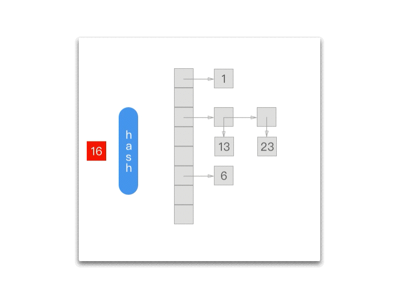
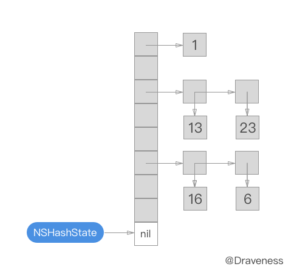
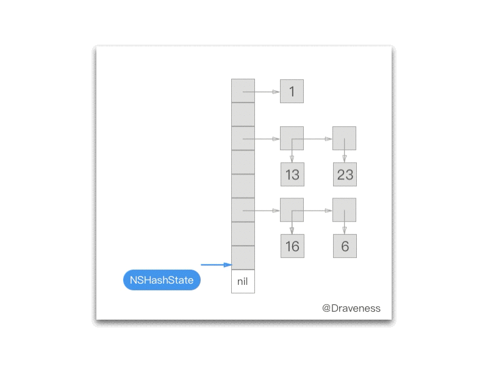
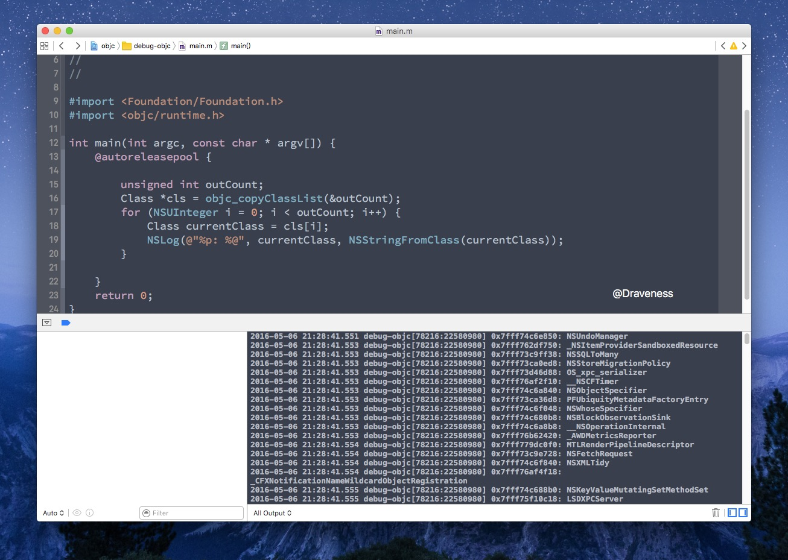

# 上古时代 Objective-C 中哈希表的实现

> 因为 ObjC 的 runtime 只能在 Mac OS 下才能编译，所以文章中的代码都是在 Mac OS，也就是 `x86_64` 架构下运行的，对于在 arm64 中运行的代码会特别说明。

## 写在前面

文章会介绍上古时代 Objective-C 哈希表，也就是 `NXHashTable` ：

+ `NXHashTable` 的实现
+ `NXHashTable` 的性能分析
+ `NXHashTable` 的作用

`NXHashTable` 的实现有着将近 30 年的历史，不过仍然作为重要的底层数据结构存储整个应用中的类。

> 文中会涉及一些数据结构方面的简单知识，例如[拉链法](https://en.wikipedia.org/wiki/Hash_table#Separate_chaining_with_linked_lists)。
> 
> 注意：**文章中分析的不是 `NSHashTable` 而是 `NXHashTable`。**

## NXHashTable

`NXHashTable` 的实现位于 `hashtable2.mm` 文件，我们先来看一下 `NXHashTable` 的结构以及重要的接口：

```objectivec
typedef struct {
    const NXHashTablePrototype *prototype;
    unsigned count;
    unsigned nbBuckets;
    void *buckets;
    const void *info;
} NXHashTable;
```

对于结构体中的 `NXHashTablePrototype` 属性暂且不说，其中的 `buckets` 是真正用来**存储数据的数组**。

```objectivec
NXHashTable *NXCreateHashTableFromZone (NXHashTablePrototype prototype, unsigned capacity, const void *info, void *z);
unsigned NXCountHashTable (NXHashTable *table);
int NXHashMember (NXHashTable *table, const void *data);
void *NXHashGet (NXHashTable *table, const void *data);
void *NXHashInsert (NXHashTable *table, const void *data);
void *NXHashRemove (NXHashTable *table, const void *data);
```

我们会以上面的这些方法作为切入点，分析 `NXHashTable` 的实现。

### NXCreateHashTableFromZone

`NXHashTable` 使用 `NXCreateHashTableFromZone` 方法初始化：

```objectivec
NXHashTable *NXCreateHashTableFromZone (NXHashTablePrototype prototype, unsigned capacity, const void *info, void *z) {
    NXHashTable			*table;
    NXHashTablePrototype	 *proto;

    table = ALLOCTABLE(z);
    if (! prototypes) bootstrap ();
    if (! prototype.hash) prototype.hash = NXPtrHash;
    if (! prototype.isEqual) prototype.isEqual = NXPtrIsEqual;
    if (! prototype.free) prototype.free = NXNoEffectFree;

    proto = (NXHashTablePrototype *)NXHashGet (prototypes, &prototype);
    if (! proto) {
        proto = (NXHashTablePrototype *) malloc(sizeof (NXHashTablePrototype));
        bcopy ((const char*)&prototype, (char*)proto, sizeof (NXHashTablePrototype));
        (void) NXHashInsert (prototypes, proto);
        proto = (NXHashTablePrototype *)NXHashGet (prototypes, &prototype);
    };
    table->prototype = proto;
    table->count = 0;
    table->info = info;
    table->nbBuckets = GOOD_CAPACITY(capacity);
    table->buckets = ALLOCBUCKETS(z, table->nbBuckets);
    return table;
}
```

在这个方法中，绝大多数代码都是用来初始化 `table->prototype` 的，我们先把这部分全部忽略，分析一下简略版本的实现。

```objectivec
NXHashTable *NXCreateHashTableFromZone (NXHashTablePrototype prototype, unsigned capacity, const void *info, void *z) {
    NXHashTable			*table;
    NXHashTablePrototype	 *proto;

    table = ALLOCTABLE(z);
    
    ...

    table->count = 0;
    table->info = info;
    table->nbBuckets = GOOD_CAPACITY(capacity);
    table->buckets = ALLOCBUCKETS(z, table->nbBuckets);
    return table;
}
```

其中 `ALLOCTABLE`、`GOOD_CAPACITY` 以及 `ALLOCBUCKETS` 都是用来辅助初始化的宏：

```objectivec
#define	 ALLOCTABLE(z) ((NXHashTable *) malloc_zone_malloc ((malloc_zone_t *)z,sizeof (NXHashTable)))
#define GOOD_CAPACITY(c) (exp2m1u (log2u (c)+1))
#define ALLOCBUCKETS(z,nb) ((HashBucket *) malloc_zone_calloc ((malloc_zone_t *)z, nb, sizeof (HashBucket)))
```

`ALLOCTABLE` 和 `ALLOCBUCKETS` 只是调用了 `malloc_zone_calloc` 来初始化相应的结构体，而 `GOOD_CAPACITY` 有一些特殊，我们来举个例子说明：

```
c   binary  result
1   1       1 
2   10      3(0b11)
6   110     7(0b111)
100 1100100 127(0b111 1111)
```

`c` 表示传入参数，`binary` 表示二进制下的参数，而 `result` 就是 `GOOD_CAPACITY` 返回的结果。

> 每次返回当前位数下的二进制最大值。

获得 `table->nbBuckets` 之后，再初始化 `table->nbBuckets * sizeof (HashBucket)` 大小的内存空间。

#### NXHashTablePrototype

在继续分析其它方法之前，我们需要先知道 `NXHashTablePrototype` 是什么：

```objectivec
typedef struct {
    uintptr_t (*hash)(const void *info, const void *data);
    int (*isEqual)(const void *info, const void *data1, const void *data2);
    void (*free)(const void *info, void *data);
    int style; /* reserved for future expansion; currently 0 */
} NXHashTablePrototype;
```

`NXHashTablePrototype` 中存储了 `hash`、`isEqual` 和 `free` 的函数指针（用于获取数据的哈希、判断两个数据是否相等以及释放数据）。

在 `hashtable2.mm` 文件中有一个宏 `ISEQUAL` 就是用了 `NXHashTablePrototype` 中的 `isEqual` 来判断两个数据是否相等：

```objectivec
#define ISEQUAL(table, data1, data2) ((data1 == data2) || (*table->prototype->isEqual)(table->info, data1, data2))
```

可以说，`NXHashTablePrototype` 中存储了一些**构建哈希表必要的函数指针**。

> 因为 `NXHashTable` 使用[拉链法](https://en.wikipedia.org/wiki/Hash_table#Separate_chaining_with_linked_lists)来实现哈希表，在存入表前对数据执行 hash，然后找到对应的 buckets，如果与 buckets 中的数据相同（使用 isEqual 判断），就替换原数据，否则将数据添加到链表中。

#### HashBucket

在这里另一个需要注意的数据结构就是 `HashBucket`：

```c
typedef struct	{
    unsigned count;
    oneOrMany elements;
} HashBucket;
```

`oneOrMany` 是一个 `union` 结构体：

```c
typedef union {
    const void *one;
    const void **many;
} oneOrMany;
```

> 这么设计的主要原因是**提升性能**。

如果 `HashBucket` 中只有一个元素，那么就直接访问 `one`，否则访问 `many`，遍历这个 `many` 列表。

### NXCountHashTable

`NXCountHashTable` 方法应该是我们要介绍的方法中的最简单的一个，它会直接返回 `NXHashTable` 结构体中的 `count`。

```objectivec
unsigned NXCountHashTable (NXHashTable *table) {
    return table->count;
}
```

### NXHashMember

`NXHashMember` 的函数签名虽然会返回 `int`，其实它是一个布尔值，会判断当前的 `NXHashTable` 中是否包含传入的数据：

```objectivec
int NXHashMember (NXHashTable *table, const void *data) {
    HashBucket	*bucket = BUCKETOF(table, data);
    unsigned	j = bucket->count;
    const void	**pairs;

    if (! j) return 0;
    if (j == 1) {
        return ISEQUAL(table, data, bucket->elements.one);
    };
    pairs = bucket->elements.many;
    while (j--) {
        if (ISEQUAL(table, data, *pairs)) return 1;
        pairs ++;
    };
    return 0;
}
```

使用 `BUCKETOF` 对 `data` 进行 hash，将结果与哈希表的 `buckets` 数取模，返回 `buckets` 数组中对应的 `NXHashBucket`。

```objectivec
#define BUCKETOF(table, data) (((HashBucket *)table->buckets)+((*table->prototype->hash)(table->info, data) % table->nbBuckets))
```

在获取了 `bucket` 之后，根据其中元素个数的不同，选择不同的分支：

```objectivec
if (! j) return 0;
if (j == 1) {
    return ISEQUAL(table, data, bucket->elements.one);
};
pairs = bucket->elements.many;
while (j--) {
    if (ISEQUAL(table, data, *pairs)) return 1;
    pairs ++;
};
```

+ `count == 0`，直接返回
+ `count == 1`，使用 `ISEQUAL` 比较查找的数据与 `bucket->elements.one` 
+ `count > 1`，依次与 `bucket->elements.many` 中的值进行比较

    > 你可能觉得到这里的时间复杂度比较糟糕，然而这个列表并不会很长，具体会在 [NXHashInsert](#nxhashinsert) 中解释。

### NXHashGet

> 其实我一直觉得这个方法可能用处不是很大，尤其是在使用默认的 `NXHashTablePrototype` 时，因为默认的 `NXHashTablePrototype` 中的 `isEqual` 函数指针只是比较两个数据的指针是否相同。
> 
> 其最大作用就是查看当前 `data` 是不是在表中。
> 
> 如果当前数据在表中，那么这个方法只会返回一个相同的指针，没有太多的意义。

它的实现跟上面的 `NXHashMember` 区别并不大，这里就不过多介绍了：

```objectivec
void *NXHashGet (NXHashTable *table, const void *data) {
    HashBucket	*bucket = BUCKETOF(table, data);
    unsigned	j = bucket->count;
    const void	**pairs;

    if (! j) return NULL;
    if (j == 1) {
        return ISEQUAL(table, data, bucket->elements.one)
        ? (void *) bucket->elements.one : NULL;
    };
    pairs = bucket->elements.many;
    while (j--) {
        if (ISEQUAL(table, data, *pairs)) return (void *) *pairs;
        pairs ++;
    };
    return NULL;
}
```

### NXHashInsert

`NXHashInsert` 是 `NXHashTable` 中比较重要的方法，其作用就是向表中插入数据：

```objectivec
void *NXHashInsert (NXHashTable *table, const void *data) {
    HashBucket *bucket = BUCKETOF(table, data);
    unsigned j = bucket->count;
    const void **pairs;
    const void **newt;

    if (! j) {
        bucket->count++;
        bucket->elements.one = data;
        table->count++;
        return NULL;
    };
    if (j == 1) {
        if (ISEQUAL(table, data, bucket->elements.one)) {
            const void *old = bucket->elements.one;
            bucket->elements.one = data;
            return (void *) old;
        };
        newt = ALLOCPAIRS(z, 2);
        newt[1] = bucket->elements.one;
        *newt = data;
        bucket->count++;
        bucket->elements.many = newt;
        table->count++;
        if (table->count > table->nbBuckets) _NXHashRehash (table);
        return NULL;
    };
    pairs = bucket->elements.many;
    while (j--) {
        if (ISEQUAL(table, data, *pairs)) {
            const void	*old = *pairs;
            *pairs = data;
            return (void *) old;
        };
        pairs ++;
    };
    newt = ALLOCPAIRS(z, bucket->count+1);
    if (bucket->count) bcopy ((const char*)bucket->elements.many, (char*)(newt+1), bucket->count * PTRSIZE);
    *newt = data;
    FREEPAIRS (bucket->elements.many);
    bucket->count++; 
    bucket->elements.many = newt;
    table->count++;
    if (table->count > table->nbBuckets) _NXHashRehash (table);
    return NULL;
}
```

虽然这里的实现比上面的两个方法复杂得多，但是脉络仍然很清晰，我们将插入的过程分为三种情况：

+ `bucket->count == 0`
+ `bucket->count == 1`
+ `bucket->count > 1`

如果对应的 `bucket` 为空：

```objectivec
if (! j) {
    bucket->count++; 
    bucket->elements.one = data;
    table->count++;
    return NULL;
};
```

将数据直接填入 `bucket`，增加 `bucket` 中元素的数目，以及 `table` 中存储的元素的数目：


如果原来的 `buckets` 中有一个元素，它会替换或者使用 `many` 替换原来的 `one`：

```objectivec
if (j == 1) {
    if (ISEQUAL(table, data, bucket->elements.one)) {
        const void	*old = bucket->elements.one;
        bucket->elements.one = data;
        return (void *) old;
    };
    newt = ALLOCPAIRS(z, 2);
    newt[1] = bucket->elements.one;
    *newt = data;
    bucket->count++;
    bucket->elements.many = newt;
    table->count++;
    
    ...

    return NULL;
};
```

当前数据 `data` 如果与 `bucket` 中存储的数据相同，就会更新这个数据，否则就会使用 `ALLOCPAIRS` 初始化一个新的数组，然后将 `data` 和原来的数据传入。



但是如果原来的 `bucket` 中存储的元素大于 1，那么会在链表的头部追加一个新的元素：

```objectivec
while (j--) {
    if (ISEQUAL(table, data, *pairs)) {
        const void	*old = *pairs;
        *pairs = data;
        return (void *) old;
    };
    pairs ++;
};
newt = ALLOCPAIRS(z, bucket->count+1);
if (bucket->count) bcopy ((const char*)bucket->elements.many, (char*)(newt+1), bucket->count * PTRSIZE);
*newt = data;
FREEPAIRS (bucket->elements.many);
bucket->count++;
bucket->elements.many = newt;
table->count++;
```

上面的代码使用 `bcopy` 将原链表中元素拷贝到新的数组 `newt` 中。


在每次添加完一个元素之后，都会进行下面的判断：

```objectivec
if (table->count > table->nbBuckets) _NXHashRehash (table);
```

> 上面的这行代码会保证**哈希表中的元素数据小于等于表中的 bucket 数量**。

这就是 `buckets` 后面的列表非常短的原因，在理想情况下，**每一个 `buckets` 中都只存储一个或零个元素**。

#### _NXHashRehash

如果哈希表在添加元素后，其中的数据多于 `buckets` 数量，就会对 `NXHashTable` 进行 `_NXHashRehash` 操作。

```objectivec
static void _NXHashRehash (NXHashTable *table) {
    _NXHashRehashToCapacity (table, MORE_CAPACITY(table->nbBuckets));
}
```

它调用 `_NXHashRehashToCapacity` 方法来扩大 `NXHashTable` 的容量（`HashBucket` 的个数）。

```c
#define MORE_CAPACITY(b) (b*2+1)
```

而 `MORE_CAPACITY` 会将当前哈希表的容量翻倍，并将新的容量传入 `_NXHashRehashToCapacity` 中：

```objectivec
void _NXHashRehashToCapacity (NXHashTable *table, unsigned newCapacity) {
    NXHashTable	*old;
    NXHashState	state;
    void	*aux;
    __unused void *z = ZONE_FROM_PTR(table);

    old = ALLOCTABLE(z);
    old->prototype = table->prototype; old->count = table->count;
    old->nbBuckets = table->nbBuckets; old->buckets = table->buckets;
    table->nbBuckets = newCapacity;
    table->count = 0; table->buckets = ALLOCBUCKETS(z, table->nbBuckets);
    state = NXInitHashState (old);
    while (NXNextHashState (old, &state, &aux))
        (void) NXHashInsert (table, aux);
    freeBuckets (old, NO);
    
    free (old->buckets);
    free (old);
}
```

1. 创建一个 `NXHashTable` 的指针指向原哈希表
2. 改变哈希表的 `nbBuckets`，并重新初始化哈希表的 `buckets` 数组
3. 重新将元素插入到哈希表中
4. 释放原哈希表 `old` 以及 `buckets`

#### NXHashState

在将元素重新插入到哈希表中涉及了一个非常奇怪的结构体 `NXHashState`，这个结构体主要作用是遍历 `NXHashTable` 中的元素。

```objectivec
typedef struct {
    int i;
    int j;
} NXHashState;
```

我们可以使用如下的代码对哈希表中的元素进行遍历：

```objectivec
 unsigned count = 0;
 MyData	 *data;
 NXHashState state = NXInitHashState(table);
 while (NXNextHashState(table, &state, &data)) {
    count++;
 }
```

代码片段中调用了两个方法，分别是 `NXInitHashState` 以及 `NXNextHashState`：

```objectivec
NXHashState NXInitHashState (NXHashTable *table) {
    NXHashState	state;

    state.i = table->nbBuckets;
    state.j = 0;
    return state;
};
```

`NXInitHashState` 会将 `NXHashState` 指向哈希表的最末端：



> 这个位置其实并不属于 `NXHashTable`，它一定会为空。

而每次调用 `NXNextHashState` 都会向『前』移动一次：

```objectivec
int NXNextHashState (NXHashTable *table, NXHashState *state, void **data) {
    HashBucket		*buckets = (HashBucket *) table->buckets;

    while (state->j == 0) {
        if (state->i == 0) return NO;
        state->i--; state->j = buckets[state->i].count;
    }
    state->j--;
    buckets += state->i;
    *data = (void *) ((buckets->count == 1)
                      ? buckets->elements.one : buckets->elements.many[state->j]);
    return YES;
};
```

下面的 gif 为我们展示了每一次调用 `NXNextHashState` 方法之后当前的 `NXHashState`：



### NXHashRemove

这里的 `NXHashRemove`在某种意义上是 `NXHashInsert` 的逆操作：

```objectivec
void *NXHashRemove (NXHashTable *table, const void *data) {
    HashBucket	*bucket = BUCKETOF(table, data);
    unsigned	j = bucket->count;
    const void	**pairs;
    const void	**newt;
    __unused void *z = ZONE_FROM_PTR(table);

    if (! j) return NULL;
    if (j == 1) {
        if (! ISEQUAL(table, data, bucket->elements.one)) return NULL;
        data = bucket->elements.one;
        table->count--; bucket->count--; bucket->elements.one = NULL;
        return (void *) data;
    };
    pairs = bucket->elements.many;
    if (j == 2) {
        if (ISEQUAL(table, data, pairs[0])) {
            bucket->elements.one = pairs[1]; data = pairs[0];
        }
        else if (ISEQUAL(table, data, pairs[1])) {
            bucket->elements.one = pairs[0]; data = pairs[1];
        }
        else return NULL;
        FREEPAIRS (pairs);
        table->count--; bucket->count--;
        return (void *) data;
    };
    while (j--) {
        if (ISEQUAL(table, data, *pairs)) {
            data = *pairs;
            /* we shrink this bucket */
            newt = (bucket->count-1)
            ? ALLOCPAIRS(z, bucket->count-1) : NULL;
            if (bucket->count-1 != j)
                bcopy ((const char*)bucket->elements.many, (char*)newt, PTRSIZE*(bucket->count-j-1));
            if (j)
                bcopy ((const char*)(bucket->elements.many + bucket->count-j), (char*)(newt+bucket->count-j-1), PTRSIZE*j);
            FREEPAIRS (bucket->elements.many);
            table->count--; bucket->count--; bucket->elements.many = newt;
            return (void *) data;
        };
        pairs ++;
    };
    return NULL;
}
```

它的实现也分为三种情况，不过在这里就不多说了。

## NXHashTable 的性能

在已经熟悉了 `NXHashTable` 的具体实现之后，我们要分析插入**不同数据量级**的情况下，所需要的时间，这里是主程序的代码，分别测试了在 `100, 1000, 10000, 100000, 1000000, 2000000, 3000000, 5000000, 10000000` 数据下 `NXHashTable` 的性能表现：

```objectivec
#import <Foundation/Foundation.h>
#import "hashtable2.h"

int main(int argc, const char * argv[]) {
    @autoreleasepool {
        NSArray<NSNumber *> *capacities = @[
            @100,
            @1000,
            @10000,
            @100000,
            @1000000,
            @2000000,
            @3000000,
            @5000000,
            @10000000
        ];

        for (NSNumber *capacity in capacities) {
            NXHashTable *hashTable = NXCreateHashTable(NXPtrPrototype, 0, NULL);
            NSDate *methodStart = [NSDate date];
            for (NSInteger i = 0; i < capacity.integerValue; i++) {
                NSString *value = [NSString stringWithFormat:@"%ld", (long)i];
                NXHashInsert(hashTable, (__bridge void *)value);
            }
            NSDate *methodFinish = [NSDate date];
            NSTimeInterval executionTime = [methodFinish timeIntervalSinceDate:methodStart];
            NSLog(@"Capacities: %@, executionTime = %f, meanTime = %.10f", capacity, executionTime, executionTime / capacity.integerValue);

            free(hashTable);
        }

    }
    return 0;
}
```

代码中初始化了一个 `capacities` 存储需要测量的数据量级，然后调用 `NXHashInsert` 方法将相当数量级的数据添加到哈希表中：

|Capacities|Execution Time| Mean Time| 
|-------:|---------:|-------------:|
|     100|  0.000334| 0.0000033402 |
|    1000|  0.001962| 0.0000019619 |
|   10000|  0.022001| 0.0000022001 |
|  100000|  0.349998| 0.0000035000 |
| 1000000|  2.622551| 0.0000026226 |
| 2000000|  4.165023| 0.0000020825 |
| 3000000|  6.973098| 0.0000023244 |
| 5000000| 13.179743| 0.0000026359 |
|**10000000**| **53.387356**| **0.0000053387** |


在对 `NXHashTable` 的性能测试中，当数据量小于 5000000 时，执行时间的增长还是线性的，平均时间也基本稳定，但是一旦数据量达到了千万级，执行时间就会出现显著的增长。

如果仅仅在哈希表中插入数据，相信其时间增长应该都是线性的，这里出现问题的原因推测是**在对哈希表进行 Rehash 的时候，迁移原数据至新的数组所造成的**。

如何避免哈希表的 Rehash 呢，重新回顾一下创建哈希表的函数：

```objectivec
NXHashTable *NXCreateHashTable (NXHashTablePrototype prototype, unsigned capacity, const void *info);
```

这个函数的签名中包含一个 `capacity` 的参数，我们在上面的代码中传入了 0，也就是最开始的 `buckets` 数为 0，但是它的数目并不是固定的，它会随着哈希表中数据的增多，逐渐变大。

> `capacity` 只是一个提示，帮助 NXHashTable 了解其中会存储多少数据。

如果在创建 `NXHashTable` 时传入 `capacity.integerValue`：

```objectivec
  NXHashTable *hashTable = NXCreateHashTable(NXPtrPrototype, capacity.integerValue, NULL);
```

重新运行代码，测量性能：

|Capacities|Execution Time| Mean Time| 
|-------:|---------:|-------------:|
|     100|  0.000740| 0.0000073999 |
|    1000|  0.003442| 0.0000034420 |
|   10000|  0.023341| 0.0000023341 |
|  100000|  0.215209| 0.0000021521 |
| 1000000|  1.836802| 0.0000018368 |
| 2000000|  3.683246| 0.0000018416 |
| 3000000|  5.474610| 0.0000018249 |
| 5000000| 10.576254| 0.0000021153 |
|10000000| 46.725459| 0.0000046725 |

虽然在测试 `10,000,000` 数据时其平均时间依然是 `5,000,000` 时的二倍，不过整体的性能都有所提升，然而这部分性能的损耗暂时还不是很清楚原因。

如果我们使用 Instrument 对有无 `capacity` 的情况进行比较（这是在使用 `2,000,000` 数据时进行的测试）：


没有传入 `capacity` 的哈希表会在多次插入之后出现一个峰值（由于 Rehash 引起的，其宽度就是 Rehash 使用的时间），而传入 `capacity` 的哈希表会在代码刚运行时就初始化足够大的数组。

## NSMutableArray 性能

> 这部分只算是一个小插曲，你可以选择跳过这一小节的内容。

`NSMutableArray` 的构造器 `- (instancetype)initWithCapacity:(NSUInteger)numItems` 也有一个参数 `capacity`，虽然数组和哈希表是两种数据结构。

> 不过我们这里主要研究的是：**传入 `capacity` 是否会对性能造成影响**。

首先是使用 `init` 创建的 `NSMutableArray` 数组，也就是没有传入 `capacity`：

|Capacities|Execution Time| Mean Time| 
|--------:|---------:|-------------:|
|      100|  0.000539| 0.0000053900|
|     1000|  0.003185| 0.0000031850|
|    10000|  0.074033| 0.0000074033|
|   100000|  0.370899| 0.0000037090|
|  1000000|  1.504855| 0.0000015049|
|  2000000|  2.852519| 0.0000014263|
|  3000000|  3.995536| 0.0000013318|
|  5000000|  6.833879| 0.0000013668|
| 10000000| 14.444605| 0.0000014445|

下面是使用 `initWithCapacity:` 创建的数组：

|Capacities|Execution Time| Mean Time| 
|--------:|---------:|-------------:|
|      100|  0.000256| 0.0000025600|
|     1000|  0.001775| 0.0000017750|
|    10000|  0.015906| 0.0000015906|
|   100000|  0.174376| 0.0000017438|
|  1000000|  1.650481| 0.0000016505|
|  2000000|  2.802310| 0.0000014012|
|  3000000|  4.451261| 0.0000014838|
|  5000000|  7.093753| 0.0000014188|
| 10000000| 14.598415| 0.0000014598|

你可以在表格中看到，两者在执行效率上并没有显著的差异或者区别。

但是如果使用 instrument 来查看两者的内存分配，可以很明显的看到，没有传入 `capacity` 的 `NSMutableArray` 会在可变数组内存占用增加前出现一个**短暂的内存分配峰值**。


导致这一现象的原始可能是：在将原数组中的内容移入新数组时，**临时变量申请了大量的内存空间**。

> 在之后关于 CoreFoundation 源代码分析的文中会介绍它们是怎么实现的。

## NXHashTable 的应用

在整个 objc/runtime 中，作为**私有**的数据结构 `NXHashTable`，直接使用了它的就是**存储所有类或者元类**的哈希表（在这里会忽略对元类的存储，因为实现几乎完全相同）：

```objectivec
static NXHashTable *realized_class_hash = nil;
```

我们可以使用 `objc_copyClassList` 获取类的数组：

```objectivec
Class *
objc_copyClassList(unsigned int *outCount)
{
    rwlock_writer_t lock(runtimeLock);

    realizeAllClasses();

    Class *result = nil;
    NXHashTable *classes = realizedClasses();
    unsigned int count = NXCountHashTable(classes);

    if (count > 0) {
        Class cls;
        NXHashState state = NXInitHashState(classes);
        result = (Class *)malloc((1+count) * sizeof(Class));
        count = 0;
        while (NXNextHashState(classes, &state, (void **)&cls)) {
            result[count++] = cls;
        }
        result[count] = nil;
    }
        
    if (outCount) *outCount = count;
    return result;
}
```

1. 调用 `realizedClasses` 返回 `realized_class_hash` 哈希表
2. 使用 `NSHashState` 遍历 `realized_class_hash` 中的类，并将所有的类存入 `result`

接下来使用上面的方法，打印出 `realized_class_hash` 中存储的所有类：



## 小结

> `NXHashTable` 在 OS X 10.1 中就已经标记为弃用了，但是依旧支持着 runtime 底层的工作。

`NXHashTable` 可以说有着**非常非常**久远的历史了，最早可以追溯到将近 30 多年前 NeXT 时代：

```c
// hashtable2.mm 文件中

hashtable2.m
Copyright 1989-1996 NeXT Software, Inc.
Created by Bertrand Serlet, Feb 89
```

`NSHashTable` 对哈希表的实现还是非常优雅的，可以说非常标准的使用了[拉链法](https://en.wikipedia.org/wiki/Hash_table#Separate_chaining_with_linked_lists)实现哈希表。

不过现在，我们会使用 `NSHashTable` 来取代这个上古时代的产物。

> Follow: [Draveness · Github](https://github.com/Draveness)


