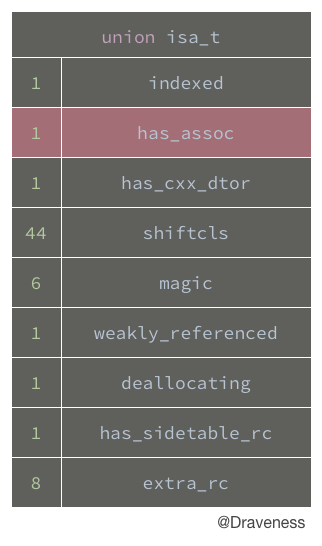

# 关联对象 AssociatedObject 完全解析

我们在 iOS 开发中经常需要使用分类（Category），为已经存在的类添加属性的需求，但是使用 `@property` 并不能在分类中**正确**创建实例变量和存取方法。

不过，通过 Objective-C 运行时中的关联对象，也就是 Associated Object，我们可以实现上述需求。

## 写在前面

这篇文章包含了两方面的内容：

+ [使用关联对象为已经存在的类中添加属性](#关联对象的应用)
+ [关联对象在底层 Objective-C 中的实现](#关联对象的实现)

> 注：如果你刚刚入门 iOS 开发，笔者相信了解第一部分的内容会对你的日常开发中有所帮助，不过第二部分的内容可能有些难以理解。
> 
> 如果你对关联对象的使用非常熟悉，可以直接跳过第一部分的内容，从[这里](#关联对象的实现)开始深入了解其底层实现。

## 关联对象的应用

关于关联对象的使用相信已经成为了一个老生常谈的问题了，不过为了保证这篇文章的完整性，笔者还是会在这里为各位介绍这部分的内容的。

### 分类中的 @property

`@property` 可以说是一个 Objective-C 编程中的“宏”，它有[元编程](https://zh.wikipedia.org/zh/元编程)的思想。

```objectivec
@interface DKObject : NSObject

@property (nonatomic, strong) NSString *property;

@end
```

在使用上述代码时会做三件事：

+ 生成实例变量 `_property`
+ 生成 `getter` 方法 `- property`
+ 生成 `setter` 方法 `- setProperty:`

```objectivec
@implementation DKObject {
    NSString *_property;
}

- (NSString *)property {
    return _property;
}

- (void)setProperty:(NSString *)property {
    _property = property;
}

@end
```

这些代码都是编译器为我们生成的，虽然你看不到它，但是它确实在这里，我们既然可以在类中使用 `@property` 生成一个属性，那么为什么在分类中不可以呢？

我们来做一个小实验：创建一个 `DKObject` 的分类 `Category`，并添加一个属性 `categoryProperty`：

```objectivec
@interface DKObject (Category)

@property (nonatomic, strong) NSString *categoryProperty;

@end
```

看起来还是很不错的，不过 Build 一下这个 Demo，会发现有这么一个警告：


在这里的警告告诉我们 `categoryProperty` 属性的存取方法需要自己手动去实现，或者使用 `@dynamic` 在运行时实现这些方法。

换句话说，分类中的 `@property` 并没有为我们生成实例变量以及存取方法，而需要我们手动实现。

### 使用关联对象

Q：我们为什么要使用关联对象？

A：因为在分类中 `@property` 并不会自动生成实例变量以及存取方法，所以**一般使用关联对象为已经存在的类添加『属性』**。

上一小节的内容已经给了我们需要使用关联对象的理由。在这里，我们会介绍 ObjC 运行时为我们提供的与关联对象有关的 API，并在分类中实现一个**伪属性**：

```objectivec
#import "DKObject+Category.h"
#import <objc/runtime.h>

@implementation DKObject (Category)

- (NSString *)categoryProperty {
    return objc_getAssociatedObject(self, _cmd);
}

- (void)setCategoryProperty:(NSString *)categoryProperty {
    objc_setAssociatedObject(self, @selector(categoryProperty), categoryProperty, OBJC_ASSOCIATION_RETAIN_NONATOMIC);
}

@end
```

> 这里的 `_cmd` 代指当前方法的选择子，也就是 `@selector(categoryProperty)`。

我们使用了两个方法 `objc_getAssociatedObject` 以及 `objc_setAssociatedObject` 来模拟『属性』的存取方法，而使用关联对象模拟实例变量。

在这里有必要解释两个问题：

1. 为什么向方法中传入 `@selector(categoryProperty)`？
2. `OBJC_ASSOCIATION_RETAIN_NONATOMIC` 是干什么的？

关于第一个问题，我们需要看一下这两个方法的原型：

```objectivec
id objc_getAssociatedObject(id object, const void *key);
void objc_setAssociatedObject(id object, const void *key, id value, objc_AssociationPolicy policy);
```

`@selector(categoryProperty)` 也就是参数中的 `key`，其实可以使用静态指针 `static void *` 类型的参数来代替，不过在这里，笔者强烈推荐使用 `@selector(categoryProperty)` 作为 `key` 传入。因为这种方法省略了声明参数的代码，并且能很好地保证 `key` 的唯一性。

`OBJC_ASSOCIATION_RETAIN_NONATOMIC` 又是什么呢？如果我们使用 `Command` 加左键查看它的定义：

```objectivec
typedef OBJC_ENUM(uintptr_t, objc_AssociationPolicy) {
    OBJC_ASSOCIATION_ASSIGN = 0,           /**< Specifies a weak reference to the associated object. */
    OBJC_ASSOCIATION_RETAIN_NONATOMIC = 1, /**< Specifies a strong reference to the associated object. 
                                            *   The association is not made atomically. */
    OBJC_ASSOCIATION_COPY_NONATOMIC = 3,   /**< Specifies that the associated object is copied. 
                                            *   The association is not made atomically. */
    OBJC_ASSOCIATION_RETAIN = 01401,       /**< Specifies a strong reference to the associated object.
                                            *   The association is made atomically. */
    OBJC_ASSOCIATION_COPY = 01403          /**< Specifies that the associated object is copied.
                                            *   The association is made atomically. */
};
```

从这里的注释我们能看到很多东西，也就是说不同的 `objc_AssociationPolicy` 对应了不通的属性修饰符：

| objc_AssociationPolicy | modifier |
|:--|:-:|
| OBJC_ASSOCIATION_ASSIGN | assign |
| OBJC_ASSOCIATION_RETAIN_NONATOMIC | nonatomic, strong |
| OBJC_ASSOCIATION_COPY_NONATOMIC | nonatomic, copy|
| OBJC_ASSOCIATION_RETAIN | atomic, strong |
| OBJC_ASSOCIATION_COPY | atomic, copy |

而我们在代码中实现的属性 `categoryProperty` 就相当于使用了 `nonatomic` 和 `strong` 修饰符。

> 关于属性修饰符的区别，并不是这篇文章的主要内容，如果你需要了解它们的区别，[Google](https://google.com) 是一个很好的选择。

到这里，我们已经完成了对关联对象应用的介绍，再来回顾一下小节的内容。

@property` 其实有元编程的思想，它能够为我们自动生成**实例变量以及存取方法**，而这三者构成了属性这个类似于语法糖的概念，为我们提供了更便利的点语法来访问属性：

```objectivec
self.property <=> [self property]
self.property = value <=> [self setProperty:value]
```

在分类中，因为类的实例变量的布局已经固定，使用 `@property` 已经**无法向固定的布局中添加新的实例变量（这样做可能会覆盖子类的实例变量）**，所以我们需要**使用关联对象以及两个方法来模拟构成属性的三个要素**。

> 如果你是一个 iOS 开发方面的新手，我相信这篇文章的前半部分对已经足够使用了，不过，如果你还对关联对象的实现非常感兴趣，也可以尝试阅读下面的内容。

## 关联对象的实现

> 探索关联对象的实现一直是我想要做的一件事情，直到最近，我才有足够的时间来完成这篇文章，希望能够对各位读者有所帮助。

这一部分会从三个 objc 运行时的方法为入口来对关联对象的实现一探究竟，其中两个方法是上一部分使用到的方法：

```objectivec
void objc_setAssociatedObject(id object, const void *key, id value, objc_AssociationPolicy policy);
id objc_getAssociatedObject(id object, const void *key);
void objc_removeAssociatedObjects(id object);
```

三个方法的作用分别是：

+ 以键值对形式添加关联对象
+ 根据 `key` 获取关联对象
+ 移除所有关联对象

而接下来的内容自然就是围绕这三个方法进行的，我们会对它们的实现进行分析。

### objc_setAssociatedObject

首先是 `objc_setAssociatedObject` 方法，这个方法的调用栈并不复杂：

```objectivec
void objc_setAssociatedObject(id object, const void *key, id value, objc_AssociationPolicy policy) 
└── void objc_setAssociatedObject_non_gc(id object, const void *key, id value, objc_AssociationPolicy policy)
    └── void _object_set_associative_reference(id object, void *key, id value, uintptr_t policy)
```

调用栈中的 `_object_set_associative_reference` 方法实际完成了设置关联对象的任务：

```objectivec
void _object_set_associative_reference(id object, void *key, id value, uintptr_t policy) {
    ObjcAssociation old_association(0, nil);
    id new_value = value ? acquireValue(value, policy) : nil;
    {
        AssociationsManager manager;
        AssociationsHashMap &associations(manager.associations());
        ObjectAssociationMap *refs = i->second;
        ...
    }
    if (old_association.hasValue()) ReleaseValue()(old_association);
}
```

> 在这里的实现省略了大多的实现代码，而且忽略了很多逻辑上的顺序，不过不要在意这里的代码能否执行。

我们需要注意其中的几个类和数据结构，因为在具体分析这个方法的实现之前，我们需要了解其中它们的作用：

+ `AssociationsManager`
+ `AssociationsHashMap`
+ `ObjcAssociationMap`
+ `ObjcAssociation`

#### AssociationsManager

`AssociationsManager` 在源代码中的定义是这样的：

```objectivec
class AssociationsManager {
    static spinlock_t _lock;
    static AssociationsHashMap *_map;
public:
    AssociationsManager()   { _lock.lock(); }
    ~AssociationsManager()  { _lock.unlock(); }
    
    AssociationsHashMap &associations() {
        if (_map == NULL)
            _map = new AssociationsHashMap();
        return *_map;
    }
};

spinlock_t AssociationsManager::_lock;
AssociationsHashMap *AssociationsManager::_map = NULL;
```

它维护了 `spinlock_t` 和 `AssociationsHashMap` 的单例，初始化它的时候会调用 `lock.lock()` 方法，在析构时会调用 `lock.unlock()`，而 `associations` 方法用于取得一个全局的 `AssociationsHashMap` 单例。

也就是说 `AssociationsManager` 通过持有一个[自旋锁](https://en.wikipedia.org/wiki/Spinlock) `spinlock_t` 保证对 `AssociationsHashMap` 的操作是线程安全的，即**每次只会有一个线程对 AssociationsHashMap 进行操作**。

#### 如何存储 ObjcAssociation

`ObjcAssociation` 就是真正的关联对象的类，上面的所有数据结构只是为了更好的存储它。

首先，`AssociationsHashMap` 用与保存从对象的 `disguised_ptr_t` 到 `ObjectAssociationMap` 的映射：

```objectivec
class AssociationsHashMap : public unordered_map<disguised_ptr_t, ObjectAssociationMap *, DisguisedPointerHash, DisguisedPointerEqual, AssociationsHashMapAllocator> {
public:
    void *operator new(size_t n) { return ::malloc(n); }
    void operator delete(void *ptr) { ::free(ptr); }
};
```

而 `ObjectAssociationMap` 则保存了从 `key` 到关联对象 `ObjcAssociation` 的映射，**这个数据结构保存了当前对象对应的所有关联对象**：

```objectivec
class ObjectAssociationMap : public std::map<void *, ObjcAssociation, ObjectPointerLess, ObjectAssociationMapAllocator> {
public:
   void *operator new(size_t n) { return ::malloc(n); }
   void operator delete(void *ptr) { ::free(ptr); }
};
```

最关键的 `ObjcAssociation` 包含了 `policy` 以及 `value`：

```objectivec
class ObjcAssociation {
    uintptr_t _policy;
    id _value;
public:
    ObjcAssociation(uintptr_t policy, id value) : _policy(policy), _value(value) {}
    ObjcAssociation() : _policy(0), _value(nil) {}

    uintptr_t policy() const { return _policy; }
    id value() const { return _value; }
    
    bool hasValue() { return _value != nil; }
};
```

举一个简单的例子来说明关联对象在内存中以什么形式存储的，以下面的代码为例：

```objectivec
int main(int argc, const char * argv[]) {
    @autoreleasepool {

        NSObject *obj = [NSObject new];
        objc_setAssociatedObject(obj, @selector(hello), @"Hello", OBJC_ASSOCIATION_RETAIN_NONATOMIC);

    }
    return 0;
}
```

这里的关联对象 `ObjcAssociation(OBJC_ASSOCIATION_RETAIN_NONATOMIC, @"Hello")` 在内存中是这么存储的：


----

接下来我们可以重新回到对 `objc_setAssociatedObject` 方法的分析了。

在这里会将方法的执行分为两种情况：

+ `new_value != nil` 设置/更新关联对象的值
+ `new_value == nil` 删除一个关联对象

#### new_value != nil

先来分析在 `new_value != nil` 的情况下，该方法的执行是什么样的：

```objectivec
void _object_set_associative_reference(id object, void *key, id value, uintptr_t policy) {
    ObjcAssociation old_association(0, nil);
    id new_value = value ? acquireValue(value, policy) : nil;
    {
        AssociationsManager manager;
        AssociationsHashMap &associations(manager.associations());
        disguised_ptr_t disguised_object = DISGUISE(object);

        AssociationsHashMap::iterator i = associations.find(disguised_object);
        if (i != associations.end()) {
            ObjectAssociationMap *refs = i->second;
            ObjectAssociationMap::iterator j = refs->find(key);
            if (j != refs->end()) {
                old_association = j->second;
                j->second = ObjcAssociation(policy, new_value);
            } else {
                (*refs)[key] = ObjcAssociation(policy, new_value);
            }
        } else {
            ObjectAssociationMap *refs = new ObjectAssociationMap;
            associations[disguised_object] = refs;
            (*refs)[key] = ObjcAssociation(policy, new_value);
            object->setHasAssociatedObjects();
        }
    }
    if (old_association.hasValue()) ReleaseValue()(old_association);
}
```

1. 使用 `old_association(0, nil)` 创建一个临时的 `ObjcAssociation` 对象（用于持有原有的关联对象，方便在方法调用的最后释放值）
2. 调用 `acquireValue` 对 `new_value` 进行 `retain` 或者 `copy`

    ```objectivec
    static id acquireValue(id value, uintptr_t policy) {
        switch (policy & 0xFF) {
        case OBJC_ASSOCIATION_SETTER_RETAIN:
            return ((id(*)(id, SEL))objc_msgSend)(value, SEL_retain);
        case OBJC_ASSOCIATION_SETTER_COPY:
            return ((id(*)(id, SEL))objc_msgSend)(value, SEL_copy);
        }
        return value;
    }
    ```

3. 初始化一个 `AssociationsManager`，并获取唯一的保存关联对象的哈希表 `AssociationsHashMap`

    ```objectivec
    AssociationsManager manager;
    AssociationsHashMap &associations(manager.associations());
    ```

4. 先使用 `DISGUISE(object)` 作为 key 寻找对应的 `ObjectAssociationMap`
5. 如果没有找到，初始化一个 `ObjectAssociationMap`，再实例化 `ObjcAssociation` 对象添加到 Map 中，并调用 `setHasAssociatedObjects` 方法，表明当前对象含有关联对象

    ```objectivec
    ObjectAssociationMap *refs = new ObjectAssociationMap;
    associations[disguised_object] = refs;
    (*refs)[key] = ObjcAssociation(policy, new_value);
    object->setHasAssociatedObjects();
    ```

6. 如果找到了对应的 `ObjectAssociationMap`，就要看 `key` 是否存在了，由此来决定是更新原有的关联对象，还是增加一个

    ```objectivec
    ObjectAssociationMap *refs = i->second;
    ObjectAssociationMap::iterator j = refs->find(key);
    if (j != refs->end()) {
        old_association = j->second;
        j->second = ObjcAssociation(policy, new_value);
    } else {
        (*refs)[key] = ObjcAssociation(policy, new_value);
    }
    ```

7. 最后的最后，如果原来的关联对象有值的话，会调用 `ReleaseValue()` 释放关联对象的值

    ```objectivec
    struct ReleaseValue {
        void operator() (ObjcAssociation &association) {
            releaseValue(association.value(), association.policy());
        }
    };
    
    static void releaseValue(id value, uintptr_t policy) {
        if (policy & OBJC_ASSOCIATION_SETTER_RETAIN) {
            ((id(*)(id, SEL))objc_msgSend)(value, SEL_release);
        }
    }
    ```

到这里，该条件下的方法实现就结束了。

#### new_value == nil

如果 `new_value == nil`，就说明我们要删除对应 `key` 的关联对象，实现如下：

```objectivec
void _object_set_associative_reference(id object, void *key, id value, uintptr_t policy) {
    ObjcAssociation old_association(0, nil);
    id new_value = value ? acquireValue(value, policy) : nil;
    {
        AssociationsManager manager;
        AssociationsHashMap &associations(manager.associations());
        disguised_ptr_t disguised_object = DISGUISE(object);

        AssociationsHashMap::iterator i = associations.find(disguised_object);
        if (i !=  associations.end()) {
            ObjectAssociationMap *refs = i->second;
            ObjectAssociationMap::iterator j = refs->find(key);
            if (j != refs->end()) {
                old_association = j->second;
                refs->erase(j);
            }
        }
    }
    if (old_association.hasValue()) ReleaseValue()(old_association);
}
```

这种情况下方法的实现与前面的唯一区别就是，我们会调用 `erase` 方法，擦除 `ObjectAssociationMap` 中 `key` 对应的节点。

#### setHasAssociatedObjects()

其实上面的两种情况已经将 `objc_setAssociatedObject` 方法的实现分析得很透彻了，不过，这里还有一个小问题来等待我们解决，`setHasAssociatedObjects()` 方法的作用是什么？

```objectivec
inline void objc_object::setHasAssociatedObjects() {
    if (isTaggedPointer()) return;

 retry:
    isa_t oldisa = LoadExclusive(&isa.bits);
    isa_t newisa = oldisa;
    if (!newisa.indexed) return;
    if (newisa.has_assoc) return;
    newisa.has_assoc = true;
    if (!StoreExclusive(&isa.bits, oldisa.bits, newisa.bits)) goto retry;
}
```

它会将 `isa` 结构体中的标记位 `has_assoc` 标记为 `true`，也就是表示当前对象有关联对象，在这里我还想祭出这张图来介绍 `isa` 中的各个标记位都是干什么的。



> 如果想要了解关于 isa 的知识，可以阅读[从 NSObject 的初始化了解 isa](https://github.com/Draveness/iOS-Source-Code-Analyze/blob/master/contents/objc/从%20NSObject%20的初始化了解%20isa.md)

### objc_getAssociatedObject

我们既然已经对 `objc_setAssociatedObject` 的实现已经比较熟悉了，相信对于 `objc_getAssociatedObject` 的理解也会更加容易。

方法的调用栈和 `objc_setAssociatedObject` 非常相似：

```objectivec
id objc_getAssociatedObject(id object, const void *key)
└── id objc_getAssociatedObject_non_gc(id object, const void *key);
    └── id _object_get_associative_reference(id object, void *key) 
```

而 `_object_get_associative_reference` 相比于前面方法的实现更加简单。

```objectivec
id _object_get_associative_reference(id object, void *key) {
    id value = nil;
    uintptr_t policy = OBJC_ASSOCIATION_ASSIGN;
    {
        AssociationsManager manager;
        AssociationsHashMap &associations(manager.associations());
        disguised_ptr_t disguised_object = DISGUISE(object);
        AssociationsHashMap::iterator i = associations.find(disguised_object);
        if (i != associations.end()) {
            ObjectAssociationMap *refs = i->second;
            ObjectAssociationMap::iterator j = refs->find(key);
            if (j != refs->end()) {
                ObjcAssociation &entry = j->second;
                value = entry.value();
                policy = entry.policy();
                if (policy & OBJC_ASSOCIATION_GETTER_RETAIN) ((id(*)(id, SEL))objc_msgSend)(value, SEL_retain);
            }
        }
    }
    if (value && (policy & OBJC_ASSOCIATION_GETTER_AUTORELEASE)) {
        ((id(*)(id, SEL))objc_msgSend)(value, SEL_autorelease);
    }
    return value;
}
```

代码中寻找关联对象的逻辑和 `objc_setAssociatedObject` 差不多：

1. 获取静态变量 `AssociationsHashMap`
2. 以 `DISGUISE(object)` 为 key 查找 `AssociationsHashMap`
3. 以 `void *key` 为 key 查找 `ObjcAssociation`
4. 根据 `policy` 调用相应的方法

    ```objectivec
    if (policy & OBJC_ASSOCIATION_GETTER_RETAIN) ((id(*)(id, SEL))objc_msgSend)(value, SEL_retain);
    
    if (value && (policy & OBJC_ASSOCIATION_GETTER_AUTORELEASE)) {
        ((id(*)(id, SEL))objc_msgSend)(value, SEL_autorelease);
    }
    ```

5. 返回关联对象 `ObjcAssociation` 的值

### objc_removeAssociatedObjects

关于最后的 `objc_removeAssociatedObjects` 方法，其实现也相对简单，这是方法的调用栈：

```objectivec
void objc_removeAssociatedObjects(id object)
└── void _object_remove_assocations(id object)
```

这是简化版本的 `objc_removeAssociatedObjects` 方法实现：

```objectivec
void objc_removeAssociatedObjects(id object) {
    if (object && object->hasAssociatedObjects()) {
        _object_remove_assocations(object);
    }
}
```

为了加速移除对象的关联对象的速度，我们会通过标记位 `has_assoc` 来避免不必要的方法调用，在确认了对象和关联对象的存在之后，才会调用 `_object_remove_assocations` 方法移除对象上所有的关联对象：

```objectivec
void _object_remove_assocations(id object) {
    vector< ObjcAssociation,ObjcAllocator<ObjcAssociation> > elements;
    {
        AssociationsManager manager;
        AssociationsHashMap &associations(manager.associations());
        if (associations.size() == 0) return;
        disguised_ptr_t disguised_object = DISGUISE(object);
        AssociationsHashMap::iterator i = associations.find(disguised_object);
        if (i != associations.end()) {
            ObjectAssociationMap *refs = i->second;
            for (ObjectAssociationMap::iterator j = refs->begin(), end = refs->end(); j != end; ++j) {
                elements.push_back(j->second);
            }
            delete refs;
            associations.erase(i);
        }
    }
    for_each(elements.begin(), elements.end(), ReleaseValue());
}
```

方法会将对象包含的所有关联对象加入到一个 `vector` 中，然后对所有的 `ObjcAssociation` 对象调用 `ReleaseValue()` 方法，释放不再被需要的值。

## 小结

### 关于应用

本来在这个系列的文章中并不会涉及关联对象这个话题，不过，有人问过我这么一个问题：在分类中到底能否实现属性？其实在回答这个问题之前，首先要知道到底属性是什么？而属性的概念决定了这个问题的答案。

+ 如果你把属性理解为**通过方法访问的实例变量**，我相信这个问题的答案是不能，**因为分类不能为类增加额外的实例变量**。
+ 不过如果属性只是一个**存取方法以及存储值的容器的集合**，那么分类是可以实现属性的。

> **分类中对属性的实现其实只是实现了一个看起来像属性的接口而已**。

### 关于实现

关联对象又是如何实现并且管理的呢：

+ 关联对象其实就是 `ObjcAssociation` 对象
+ 关联对象由 `AssociationsManager` 管理并在  `AssociationsHashMap` 存储
+ 对象的指针以及其对应 `ObjectAssociationMap` 以键值对的形式存储在 `AssociationsHashMap` 中
+ `ObjectAssociationMap` 则是用于存储关联对象的数据结构
+ 每一个对象都有一个标记位 `has_assoc` 指示对象是否含有关联对象

> Follow: [Draveness · Github](https://github.com/Draveness)


