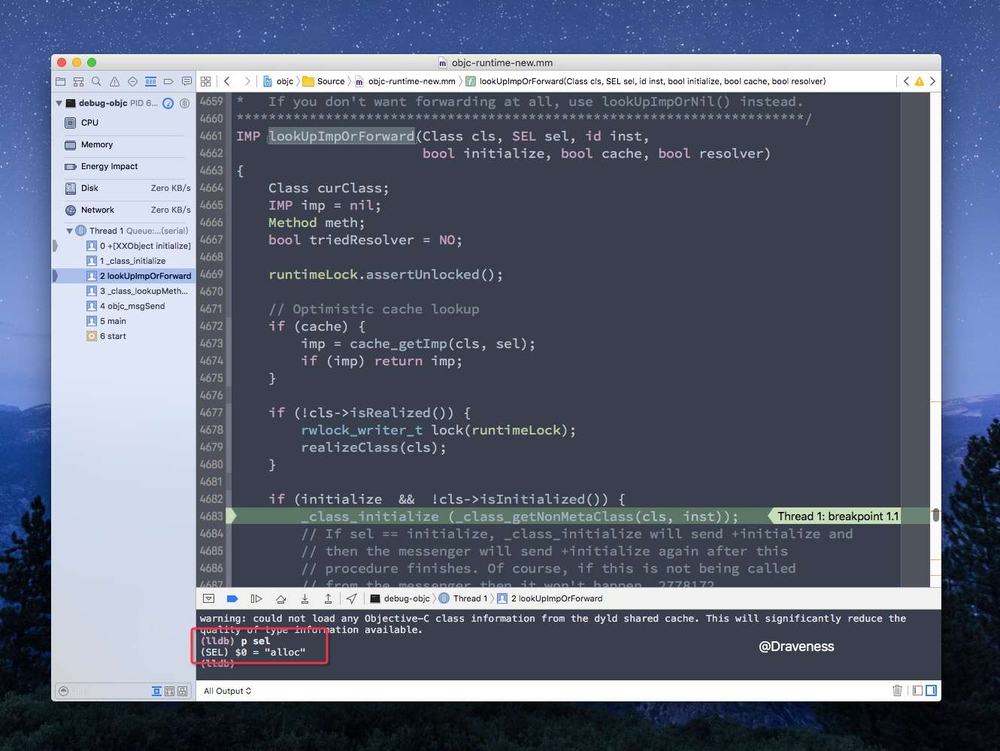
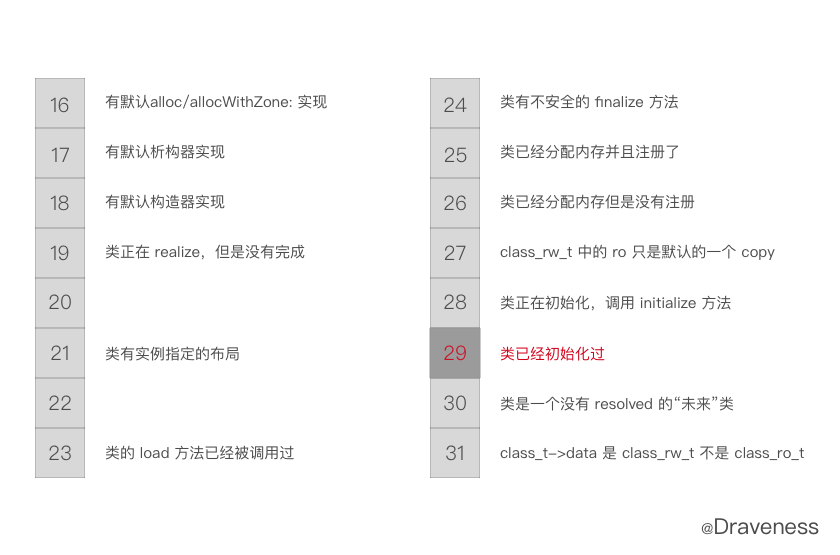

# 懒惰的 initialize 方法

> 因为 ObjC 的 runtime 只能在 Mac OS 下才能编译，所以文章中的代码都是在 Mac OS，也就是 `x86_64` 架构下运行的，对于在 arm64 中运行的代码会特别说明。

## 写在前面

这篇文章可能是对 Objective-C 源代码解析系列文章中最短的一篇了，在 Objective-C 中，我们总是会同时想到 `load`、`initialize` 这两个类方法。而这两个方法也经常在一起比较：

在上一篇介绍 `load` 方法的[文章](https://github.com/Draveness/iOS-Source-Code-Analyze/blob/master/contents/objc/你真的了解%20load%20方法么？.md)中，已经对 `load` 方法的调用时机、调用顺序进行了详细地分析，所以对于 `load` 方法，这里就不在赘述了。

这篇文章会~~假设你知道：~~假设你是 iOS 开发者。

本文会主要介绍：

1. `initialize` 方法的调用为什么是惰性的
2. 这货能干啥

## initialize 的调用栈

在分析其调用栈之前，首先来解释一下，什么是惰性的。

这是 `main.m` 文件中的代码：

```objectivec
#import <Foundation/Foundation.h>

@interface XXObject : NSObject @end

@implementation XXObject

+ (void)initialize {
    NSLog(@"XXObject initialize");
}

@end

int main(int argc, const char * argv[]) {
    @autoreleasepool { }
    return 0;
}
```

主函数中的代码为空，如果我们运行这个程序：


你会发现与 `load` 方法不同的是，虽然我们在 `initialize` 方法中调用了 `NSLog`。但是程序运行之后没有任何输出。

如果，我们在自动释放池中加入以下代码：

```objectivec
int main(int argc, const char * argv[]) {
    @autoreleasepool {
        __unused XXObject *object = [[XXObject alloc] init];
    }
    return 0;
}
```

再运行程序：


你会发现，虽然我们没有直接调用 `initialize` 方法。但是，这里也打印出了 `XXObject initialize` 字符串。

> `initialize` **只会在对应类的方法第一次被调用时，才会调用**。

我们在 `initialize` 方法中打一个断点，来查看这个方法的调用栈：


```objectivec
0 +[XXObject initialize]
1 _class_initialize
2 lookUpImpOrForward
3 _class_lookupMethodAndLoadCache3
4 objc_msgSend
5 main
6 start
```

直接来看调用栈中的 `lookUpImpOrForward` 方法，`lookUpImpOrForward` 方法**只会在向对象发送消息，并且在类的缓存中没有找到消息的选择子时**才会调用，具体可以看这篇文章，[从源代码看 ObjC 中消息的发送](https://github.com/Draveness/iOS-Source-Code-Analyze/blob/master/contents/objc/从源代码看%20ObjC%20中消息的发送.md)。

在这里，我们知道 `lookUpImpOrForward` 方法是 `objc_msgSend` 触发的就够了。



在 lldb 中输入 `p sel` 打印选择子，会发现当前调用的方法是 `alloc` 方法，也就是说，`initialize` 方法是在 `alloc` 方法之前调用的，`alloc` 的调用导致了前者的执行。

其中，使用 `if (initialize  &&  !cls->isInitialized())` 来判断当前类是否初始化过：

```objectivec
bool isInitialized() {
   return getMeta()->data()->flags & RW_INITIALIZED;
}
```

> 当前类是否初始化过的信息就保存在[元类](http://www.cocoawithlove.com/2010/01/what-is-meta-class-in-objective-c.html)的 `class_rw_t` 结构体中的 `flags` 中。

这是 `flags` 中保存的信息，它记录着跟当前类的元数据，其中第 16-31 位有如下的作用：



`flags` 的第 29 位 `RW_INITIALIZED` 就保存了当前类是否初始化过的信息。

## \_class_initialize 方法

在 `initialize` 的调用栈中，直接调用其方法的是下面的这个 C 语言函数：

```objectivec
void _class_initialize(Class cls)
{
    Class supercls;
    BOOL reallyInitialize = NO;

    // 1. 强制父类先调用 initialize 方法
    supercls = cls->superclass;
    if (supercls  &&  !supercls->isInitialized()) {
        _class_initialize(supercls);
    }
    
    {
        // 2. 通过加锁来设置 RW_INITIALIZING 标志位
        monitor_locker_t lock(classInitLock);
        if (!cls->isInitialized() && !cls->isInitializing()) {
            cls->setInitializing();
            reallyInitialize = YES;
        }
    }
    
    if (reallyInitialize) {
        // 3. 成功设置标志位，向当前类发送 +initialize 消息
        _setThisThreadIsInitializingClass(cls);

        ((void(*)(Class, SEL))objc_msgSend)(cls, SEL_initialize);

        // 4. 完成初始化，如果父类已经初始化完成，设置 RW_INITIALIZED 标志位，
        //    否则，在父类初始化完成之后再设置标志位。
        monitor_locker_t lock(classInitLock);
        if (!supercls  ||  supercls->isInitialized()) {
            _finishInitializing(cls, supercls);
        } else {
            _finishInitializingAfter(cls, supercls);
        }
        return;
    } else if (cls->isInitializing()) {
        // 5. 当前线程正在初始化当前类，直接返回，否则，会等待其它线程初始化结束后，再返回
        if (_thisThreadIsInitializingClass(cls)) {
            return;
        } else {
            monitor_locker_t lock(classInitLock);
            while (!cls->isInitialized()) {
                classInitLock.wait();
            }
            return;
        }
    } else if (cls->isInitialized()) {
        // 6. 初始化成功后，直接返回
        return;
    } else {
        _objc_fatal("thread-safe class init in objc runtime is buggy!");
    }
}
```

方法的主要作用自然是向未初始化的类发送 `+initialize` 消息，不过会强制父类先发送 `+initialize`。

1. 强制**未初始化过的**父类调用 `initialize` 方法

    ```objectivec
    if (supercls  &&  !supercls->isInitialized()) {
        _class_initialize(supercls);
    }
    ```

2. 通过加锁来设置 `RW_INITIALIZING` 标志位

    ```objectivec
    monitor_locker_t lock(classInitLock);
    if (!cls->isInitialized() && !cls->isInitializing()) {
        cls->setInitializing();
        reallyInitialize = YES;
    }
    ```

3. 成功设置标志位、向当前类发送 `+initialize` 消息

    ```objectivec
    ((void(*)(Class, SEL))objc_msgSend)(cls, SEL_initialize);
    ```

4. 完成初始化，如果父类已经初始化完成，设置 `RW_INITIALIZED` 标志位。否则，在父类初始化完成之后再设置标志位

    ```objectivec
    monitor_locker_t lock(classInitLock);
    if (!supercls  ||  supercls->isInitialized()) {
        _finishInitializing(cls, supercls);
    } else {
        _finishInitializingAfter(cls, supercls);
    }
    ```

5. 如果当前线程正在初始化当前类，直接返回，否则，会等待其它线程初始化结束后，再返回，**保证线程安全**

    ```objectivec
    if (_thisThreadIsInitializingClass(cls)) {
        return;
    } else {
        monitor_locker_t lock(classInitLock);
        while (!cls->isInitialized()) {
            classInitLock.wait();
        }
        return;
    }
    ```

6. 初始化成功后，直接返回
    
    ```objectivec
    return;
    ```

## 管理初始化队列

因为我们始终要保证父类的初始化方法要在子类之前调用，所以我们需要维护一个 `PendingInitializeMap` 的数据结构来存储**当前的类初始化需要哪个父类先初始化完成**。


这个数据结构中的信息会被两个方法改变：

```objectivec
if (!supercls  ||  supercls->isInitialized()) {
  _finishInitializing(cls, supercls);
} else {
  _finishInitializingAfter(cls, supercls);
}
```

分别是 `_finishInitializing` 以及 `_finishInitializingAfter`，先来看一下后者是怎么实现的，也就是**在父类没有完成初始化的时候**调用的方法：

```objectivec
static void _finishInitializingAfter(Class cls, Class supercls)
{
    PendingInitialize *pending;
    pending = (PendingInitialize *)malloc(sizeof(*pending));
    pending->subclass = cls;
    pending->next = (PendingInitialize *)NXMapGet(pendingInitializeMap, supercls);
    NXMapInsert(pendingInitializeMap, supercls, pending);
}
```

因为当前类的父类没有初始化，所以会将子类加入一个数据结构 `PendingInitialize` 中，这个数据结构其实就类似于一个保存子类的链表。这个链表会以父类为键存储到 `pendingInitializeMap` 中。

```objective
NXMapInsert(pendingInitializeMap, supercls, pending);
```

而在**父类已经调用了初始化方法**的情况下，对应方法 `_finishInitializing` 的实现就稍微有些复杂了：

```objectivec
static void _finishInitializing(Class cls, Class supercls)
{
    PendingInitialize *pending;

    cls->setInitialized();
    
    if (!pendingInitializeMap) return;
    pending = (PendingInitialize *)NXMapGet(pendingInitializeMap, cls);
    if (!pending) return;

    NXMapRemove(pendingInitializeMap, cls);

    while (pending) {
        PendingInitialize *next = pending->next;
        if (pending->subclass) _finishInitializing(pending->subclass, cls);
        free(pending);
        pending = next;
    }
}
```

首先，由于父类已经完成了初始化，在这里直接将当前类标记成已经初始化，然后**递归地将被当前类 block 的子类标记为已初始化**，再把这些当类移除 `pendingInitializeMap`。

## 小结

到这里，我们对 `initialize` 方法的研究基本上已经结束了，这里会总结一下关于其方法的特性：

1. `initialize` 的调用是惰性的，它会在第一次调用当前类的方法时被调用
2. 与 `load` 不同，`initialize` 方法调用时，所有的类都**已经加载**到了内存中
3. `initialize` 的运行是线程安全的
4. 子类会**继承**父类的 `initialize` 方法

而其作用也非常局限，一般我们只会在 `initialize` 方法中进行一些常量的初始化。

## 参考资料

+ [What is a meta-class in Objective-C?](http://www.cocoawithlove.com/2010/01/what-is-meta-class-in-objective-c.html)
+ [NSObject +load and +initialize - What do they do?](http://stackoverflow.com/questions/13326435/nsobject-load-and-initialize-what-do-they-do)

Follow: [@Draveness](https://github.com/Draveness)

