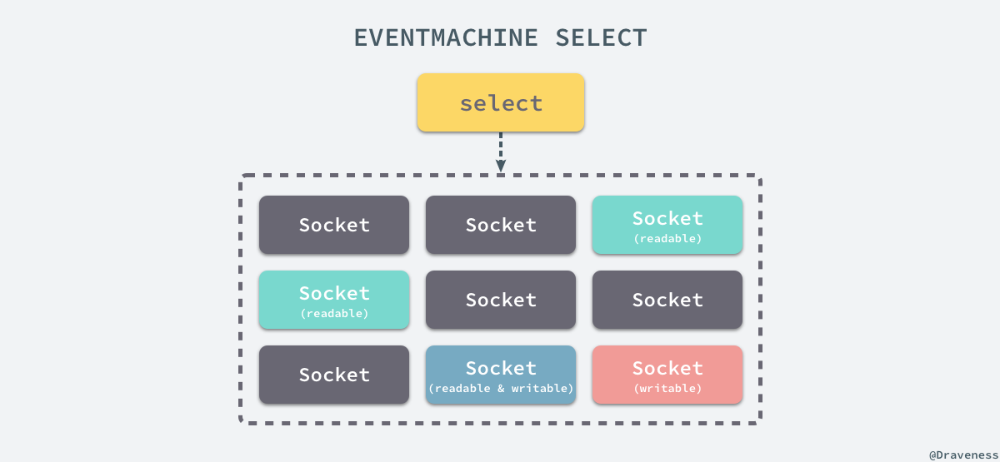
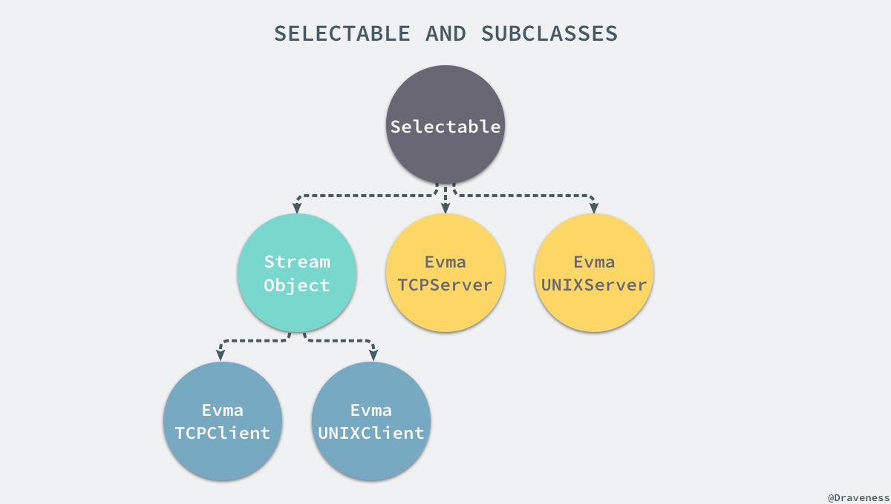
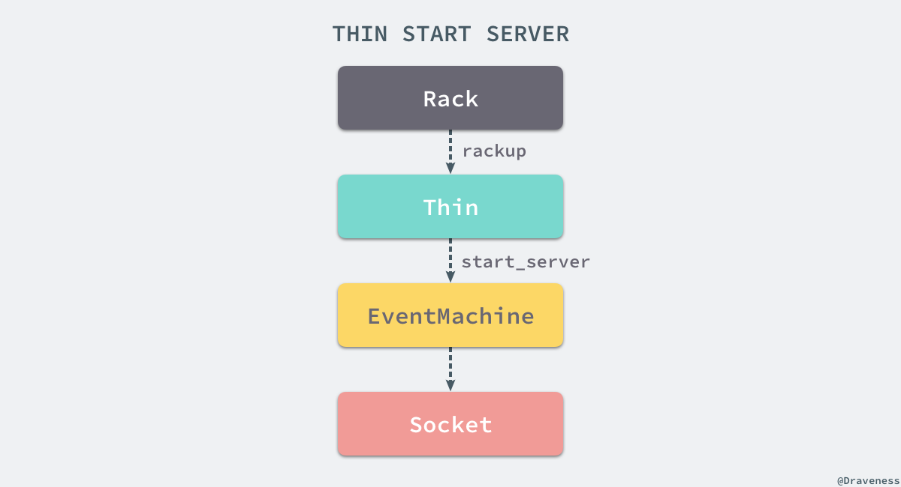
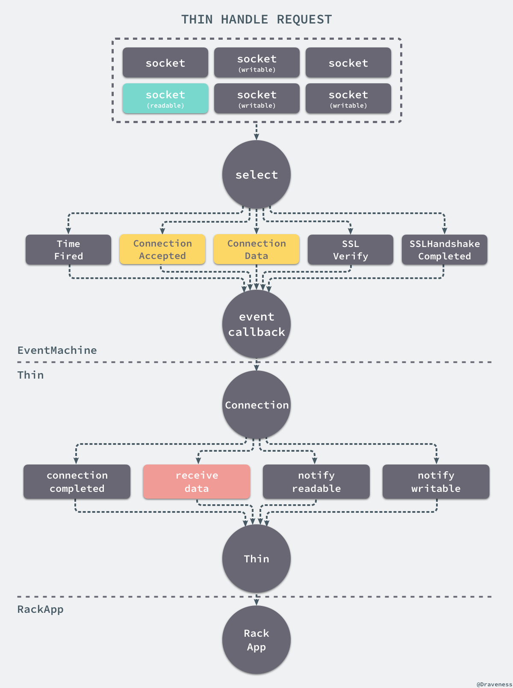
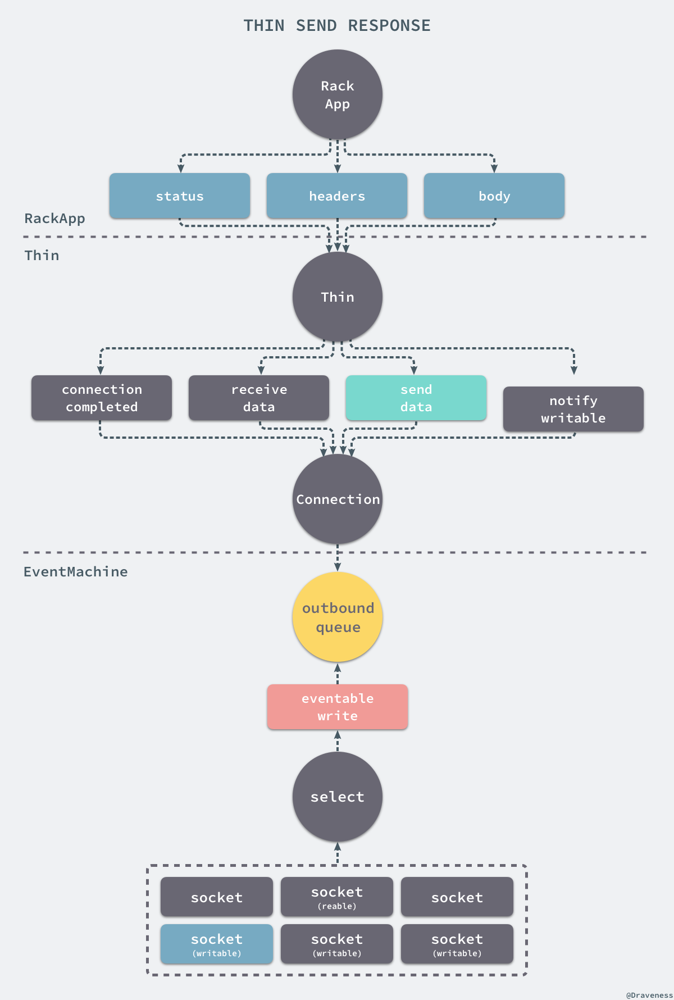
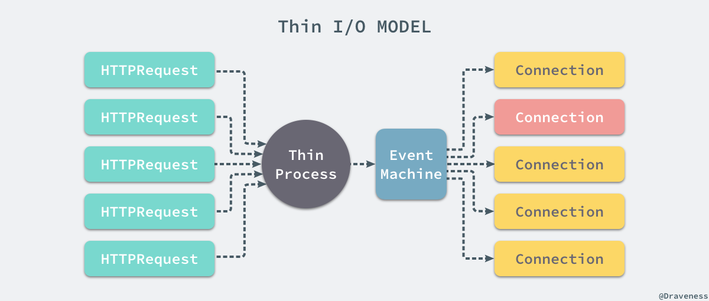

# 浅谈 Thin 的事件驱动模型

+ [谈谈 Rack 协议与实现](https://draveness.me/rack)
+ [浅谈 WEBrick 的实现](https://draveness.me/rack-webrick)
+ [浅谈 Thin 的事件驱动模型](https://draveness.me/rack-thin)
+ [浅谈 Unicorn 的多进程模型](https://draveness.me/rack-unicorn)
+ [浅谈 Puma 的实现](https://draveness.me/rack-puma)

在上一篇文章中我们已经介绍了 WEBrick 的实现，它的 handler 是写在 Rack 工程中的，而在这篇文章介绍的 webserver [thin](https://github.com/macournoyer/thin) 的 Rack 处理器也是写在 Rack 中的；与 WEBrick 相同，Thin 的实现也非常简单，官方对它的介绍是：

> A very fast & simple Ruby web server.

它将 [Mongrel](https://zedshaw.com/archive/ragel-state-charts/)、[Event Machine](https://github.com/eventmachine/eventmachine) 和 [Rack](http://rack.github.io) 三者进行组合，在其中起到胶水的作用，所以在理解 Thin 的实现的过程中我们也需要分析 EventMachine 到底是如何工作的。

## Thin 的实现

在这一节中我们将从源代码来分析介绍 Thin 的实现原理，因为部分代码仍然是在 Rack 工程中实现的，所以我们要从 Rack 工程的代码开始理解 Thin 的实现。

### 从 Rack 开始

Thin 的处理器 `Rack::Handler::Thin` 与其他遵循 Rack 协议的 webserver 一样都实现了 `.run` 方法，接受 Rack 应用和 `options` 作为输入：

```ruby
module Rack
  module Handler
    class Thin
      def self.run(app, options={})
        environment  = ENV['RACK_ENV'] || 'development'
        default_host = environment == 'development' ? 'localhost' : '0.0.0.0'

        host = options.delete(:Host) || default_host
        port = options.delete(:Port) || 8080
        args = [host, port, app, options]
        args.pop if ::Thin::VERSION::MAJOR < 1 && ::Thin::VERSION::MINOR < 8
        server = ::Thin::Server.new(*args)
        yield server if block_given?
        server.start
      end
    end
  end
end
```

上述方法仍然会从 `options` 中取出 ip 地址和端口号，然后初始化一个 `Thin::Server` 的实例后，执行 `#start` 方法在 8080 端口上监听来自用户的请求。

### 初始化服务

Thin 服务的初始化由以下的代码来处理，首先会处理在 `Rack::Handler::Thin.run` 中传入的几个参数 `host`、`port`、`app` 和 `options`，将 Rack 应用存储在临时变量中：

```ruby
From: lib/thin/server.rb @ line 100:
Owner: Thin::Server

def initialize(*args, &block)
  host, port, options = DEFAULT_HOST, DEFAULT_PORT, {}

  args.each do |arg|
    case arg
    when 0.class, /^\d+$/ then port    = arg.to_i
    when String           then host    = arg
    when Hash             then options = arg
    else
      @app = arg if arg.respond_to?(:call)
    end
  end

  @backend = select_backend(host, port, options)
  @backend.server = self
  @backend.maximum_connections            = DEFAULT_MAXIMUM_CONNECTIONS
  @backend.maximum_persistent_connections = DEFAULT_MAXIMUM_PERSISTENT_CONNECTIONS
  @backend.timeout                        = options[:timeout] || DEFAULT_TIMEOUT

  @app = Rack::Builder.new(&block).to_app if block
end
```

在初始化服务的过程中，总共只做了三件事情，处理参数、选择并配置 `backend`，创建新的应用：


处理参数的过程自然不用多说，只是这里判断的方式并不是按照顺序处理的，而是按照参数的类型；在初始化器的最后，如果向初始化器传入了 block，那么就会使用 `Rack::Builder` 和 block 中的代码初始化一个新的 Rack 应用。

### 选择后端

在选择后端时 Thin 使用了 `#select_backend` 方法，这里使用 `case` 语句替代多个 `if`、`else`，也是一个我们可以使用的小技巧：

```ruby
From: lib/thin/server.rb @ line 261:
Owner: Thin::Server

def select_backend(host, port, options)
  case
  when options.has_key?(:backend)
    raise ArgumentError, ":backend must be a class" unless options[:backend].is_a?(Class)
    options[:backend].new(host, port, options)
  when options.has_key?(:swiftiply)
    Backends::SwiftiplyClient.new(host, port, options)
  when host.include?('/')
    Backends::UnixServer.new(host)
  else
    Backends::TcpServer.new(host, port)
  end
end
```

在大多数时候，我们只会选择 `UnixServer` 和 `TcpServer` 两种后端中的一个，而后者又是两者中使用更为频繁的后端：

```ruby
From: lib/thin/backends/tcp_server.rb @ line 8:
Owner: Thin::Backends::TcpServer

def initialize(host, port)
  @host = host
  @port = port
  super()
end

From: lib/thin/backends/base.rb @ line 47:
Owner: Thin::Backends::Base

def initialize
  @connections                    = {}
  @timeout                        = Server::DEFAULT_TIMEOUT
  @persistent_connection_count    = 0
  @maximum_connections            = Server::DEFAULT_MAXIMUM_CONNECTIONS
  @maximum_persistent_connections = Server::DEFAULT_MAXIMUM_PERSISTENT_CONNECTIONS
  @no_epoll                       = false
  @ssl                            = nil
  @threaded                       = nil
  @started_reactor                = false
end
```

初始化的过程中只是对属性设置默认值，比如 `host`、`port` 以及超时时间等等，并没有太多值得注意的代码。

### 启动服务

在启动服务时会直接调用 `TcpServer#start` 方法并在其中传入一个用于处理信号的 block：

```ruby
From: lib/thin/server.rb @ line 152:
Owner: Thin::Server

def start
  raise ArgumentError, 'app required' unless @app
  
  log_info  "Thin web server (v#{VERSION::STRING} codename #{VERSION::CODENAME})"
  log_debug "Debugging ON"
  trace     "Tracing ON"
  
  log_info "Maximum connections set to #{@backend.maximum_connections}"
  log_info "Listening on #{@backend}, CTRL+C to stop"

  @backend.start { setup_signals if @setup_signals }
end
```

虽然这里的 `backend` 其实已经被选择成了 `TcpServer`，但是该子类并没有覆写 `#start` 方法，这里执行的方法其实是从父类继承的：

```ruby
From: lib/thin/backends/base.rb @ line 60:
Owner: Thin::Backends::Base

def start
  @stopping = false
  starter   = proc do
    connect
    yield if block_given?
    @running = true
  end
  
  # Allow for early run up of eventmachine.
  if EventMachine.reactor_running?
    starter.call
  else
    @started_reactor = true
    EventMachine.run(&starter)
  end
end
```

上述方法在构建一个 `starter` block 之后，将该 block 传入 `EventMachine.run` 方法，随后执行的 `#connect` 会启动一个 `EventMachine` 的服务器用于处理用户的网络请求：

```ruby
From: lib/thin/backends/tcp_server.rb @ line 15:
Owner: Thin::Backends::TcpServer

def connect
  @signature = EventMachine.start_server(@host, @port, Connection, &method(:initialize_connection))
  binary_name = EventMachine.get_sockname( @signature )
  port_name = Socket.unpack_sockaddr_in( binary_name )
  @port = port_name[0]
  @host = port_name[1]
  @signature
end
```

在 EventMachine 的文档中，`.start_server` 方法被描述成一个在指定的地址和端口上初始化 TCP 服务的方法，正如这里所展示的，它经常在 `.run` 方法的 block 中执行；该方法的参数 `Connection` 作为处理 TCP 请求的类，会实现不同的方法接受各种各样的回调，传入的 `initialize_connection` block 会在有请求需要处理时对 `Connection` 对象进行初始化：

> `Connection` 对象继承自 `EventMachine::Connection`，是 EventMachine 与外界的接口，在 EventMachine 中的大部分事件都会调用 `Connection` 的一个实例方法来传递数据和参数。

```ruby
From: lib/thin/backends/base.rb @ line 145:
Owner: Thin::Backends::Base

def initialize_connection(connection)
  connection.backend                 = self
  connection.app                     = @server.app
  connection.comm_inactivity_timeout = @timeout
  connection.threaded                = @threaded
  connection.start_tls(@ssl_options) if @ssl

  if @persistent_connection_count < @maximum_persistent_connections
    connection.can_persist!
    @persistent_connection_count += 1
  end
  @connections[connection.__id__] = connection
end
```

### 处理请求的连接

`Connection` 类中有很多的方法 `#post_init`、`#receive_data` 方法等等都是由 EventMachine 在接收到请求时调用的，当 Thin 的服务接收到来自客户端的数据时就会调用 `#receive_data` 方法：

```ruby
From: lib/thin/connection.rb @ line 36:
Owner: Thin::Connection

def receive_data(data)
  @idle = false
  trace data
  process if @request.parse(data)
rescue InvalidRequest => e
  log_error("Invalid request", e)
  post_process Response::BAD_REQUEST
end
```

在这里我们看到了与 WEBrick 在处理来自客户端的原始数据时使用的方法 `#parse`，它会解析客户端请求的原始数据并执行 `#process` 来处理 HTTP 请求：

```ruby
From: lib/thin/connection.rb @ line 47:
Owner: Thin::Connection

def process
  if threaded?
    @request.threaded = true
    EventMachine.defer { post_process(pre_process) }
  else
    @request.threaded = false
    post_process(pre_process)
  end
end
```

如果当前的连接允许并行处理多个用户的请求，那么就会在 `EventMachine.defer` 的 block 中执行两个方法 `#pre_process` 和 `#post_process`：

```ruby
From: lib/thin/connection.rb @ line 63:
Owner: Thin::Connection

def pre_process
  @request.remote_address = remote_address
  @request.async_callback = method(:post_process)

  response = AsyncResponse
  catch(:async) do
    response = @app.call(@request.env)
  end
  response
rescue Exception => e
  unexpected_error(e)
  can_persist? && @request.persistent? ? Response::PERSISTENT_ERROR : Response::ERROR
end
```

在 `#pre_process` 中没有做太多的事情，只是调用了 Rack 应用的 `#call` 方法，得到一个三元组 `response`，在这之后将这个数组传入 `#post_process` 方法：

```ruby
From: lib/thin/connection.rb @ line 95:
Owner: Thin::Connection

def post_process(result)
  return unless result
  result = result.to_a
  return if result.first == AsyncResponse.first

  @response.status, @response.headers, @response.body = *result
  @response.each do |chunk|
    send_data chunk
  end
rescue Exception => e
  unexpected_error(e)
  close_connection
ensure
  if @response.body.respond_to?(:callback) && @response.body.respond_to?(:errback)
    @response.body.callback { terminate_request }
    @response.body.errback  { terminate_request }
  else
    terminate_request unless result && result.first == AsyncResponse.first
  end
end
```

`#post_response` 方法将传入的数组赋值给 `response` 的 `status`、`headers` 和 `body` 这三部分，在这之后通过 `#send_data` 方法将 HTTP 响应以块的形式写回 Socket；写回结束后可能会调用对应的 `callback` 并关闭持有的 `request` 和 `response` 两个实例变量。

> 上述方法中调用的 `#send_data` 继承自 `EventMachine::Connection` 类。

### 小结

到此为止，我们对于 Thin 是如何处理来自用户的 HTTP 请求的就比较清楚了，我们可以看到 Thin 本身并没有做一些类似解析 HTTP 数据包以及发送数据的问题，它使用了来自 Rack 和 EventMachine 两个开源框架中很多已有的代码逻辑，确实只做了一些胶水的事情。

对于 Rack 是如何工作的我们在前面的文章 [谈谈 Rack 协议与实现](https://draveness.me/rack) 中已经介绍过了；虽然我们看到了很多与 EventMachine 相关的代码，但是到这里我们仍然对 EventMachine 不是太了解。

## EventMachine 和 Reactor 模式

为了更好地理解 Thin 的工作原理，在这里我们会介绍一个 EventMachine 和 Reactor 模式。

EventMachine 其实是一个使用 Ruby 实现的事件驱动的并行框架，它使用 Reactor 模式提供了事件驱动的 IO 模型，如果你对 Node.js 有所了解的话，那么你一定对事件驱动这个词并不陌生，EventMachine 的出现主要是为了解决两个核心问题：

+ 为生产环境提供更高的可伸缩性、更好的性能和稳定性；
+ 为上层提供了一些能够减少高性能的网络编程复杂性的 API；

其实 EventMachine 的主要作用就是将所有同步的 IO 都变成异步的，调度都通过事件来进行，这样用于监听用户请求的进程不会被其他代码阻塞，能够同时为更多的客户端提供服务；在这一节中，我们需要了解一下在 Thin 中使用的 EventMachine 中几个常用方法的实现。

### 启动事件循环

EventMachine 其实就是一个事件循环（Event Loop），当我们想使用 EventMachine 来处理某些任务时就一定需要调用 `.run` 方法启动这个事件循环来接受外界触发的各种事件：

```ruby
From: lib/eventmachine.rb @ line 149:
Owner: #<Class:EventMachine>

def self.run blk=nil, tail=nil, &block
  # ...
  begin
    @reactor_pid = Process.pid
    @reactor_running = true
    initialize_event_machine
    (b = blk || block) and add_timer(0, b)
    if @next_tick_queue && !@next_tick_queue.empty?
      add_timer(0) { signal_loopbreak }
    end
    @reactor_thread = Thread.current

    run_machine
  ensure
    until @tails.empty?
      @tails.pop.call
    end

    release_machine
    cleanup_machine
    @reactor_running = false
    @reactor_thread = nil
  end
end
```

在这里我们会使用 `.initialize_event_machine` 初始化当前的事件循环，其实也就是一个全局的 `Reactor` 的单例，最终会执行 `Reactor#initialize_for_run` 方法：

```ruby
From: lib/em/pure_ruby.rb @ line 522:
Owner: EventMachine::Reactor

def initialize_for_run
  @running = false
  @stop_scheduled = false
  @selectables ||= {}; @selectables.clear
  @timers = SortedSet.new # []
  set_timer_quantum(0.1)
  @current_loop_time = Time.now
  @next_heartbeat = @current_loop_time + HeartbeatInterval
end
```

在启动事件循环的过程中，它还会将传入的 block 与一个 `interval` 为 0 的键组成键值对存到 `@timers` 字典中，所有加入的键值对都会在大约 `interval` 的时间过后执行一次 block。

随后执行的 `#run_machine` 在最后也会执行 `Reactor` 的 `#run` 方法，该方法中包含一个 loop 语句，也就是我们一直说的事件循环：

```ruby
From: lib/em/pure_ruby.rb @ line 540:
Owner: EventMachine::Reactor

def run
  raise Error.new( "already running" ) if @running
  @running = true

  begin
    open_loopbreaker

    loop {
      @current_loop_time = Time.now

      break if @stop_scheduled
      run_timers
      break if @stop_scheduled
      crank_selectables
      break if @stop_scheduled
      run_heartbeats
    }
  ensure
    close_loopbreaker
    @selectables.each {|k, io| io.close}
    @selectables.clear

    @running = false
  end
end
```

在启动事件循环之间会在 `#open_loopbreaker` 中创建一个 `LoopbreakReader` 的实例绑定在 `127.0.0.1` 和随机的端口号组成的地址上，然后开始运行事件循环。


在事件循环中，Reactor 总共需要执行三部分的任务，分别是执行定时器、处理 Socket 上的事件以及运行心跳方法。

无论是运行定时器还是执行心跳方法其实都非常简单，只要与当前时间进行比较，如果到了触发的时间就调用正确的方法或者回调，最后的 `#crank_selectables` 方法就是用于处理 Socket 上读写事件的方法了：

```ruby
From: lib/em/pure_ruby.rb @ line 540:
Owner: EventMachine::Reactor

def crank_selectables
  readers = @selectables.values.select { |io| io.select_for_reading? }
  writers = @selectables.values.select { |io| io.select_for_writing? }

  s = select(readers, writers, nil, @timer_quantum)

  s and s[1] and s[1].each { |w| w.eventable_write }
  s and s[0] and s[0].each { |r| r.eventable_read }

  @selectables.delete_if {|k,io|
    if io.close_scheduled?
      io.close
      begin
        EventMachine::event_callback io.uuid, ConnectionUnbound, nil
      rescue ConnectionNotBound; end
      true
    end
  }
end
```

上述方法会在 Socket 变成可读或者可写时执行 `#eventable_write` 或 `#eventable_read` 执行事件的回调，我们暂时放下这两个方法，先来了解一下 EventMachine 是如何启动服务的。

### 启动服务

在启动服务的过程中，最重要的目的就是创建一个 Socket 并绑定在指定的 ip 和端口上，在实现这个目的的过程中，我们使用了以下的几个方法，首先是 `EventMachine.start_server`：

```ruby
From: lib/eventmachine.rb @ line 516:
Owner: #<Class:EventMachine>

def self.start_server server, port=nil, handler=nil, *args, &block
  port = Integer(port)
  klass = klass_from_handler(Connection, handler, *args)

  s = if port
        start_tcp_server server, port
      else
        start_unix_server server
      end
  @acceptors[s] = [klass, args, block]
  s
end
```

该方法其实使我们在使用 EventMachine 时常见的接口，只要我们想要启动一个新的 TCP 或者 UNIX 服务器，就可以上述方法，在这里会根据端口号是否存在，选择执行 `.start_tcp_server` 或者 `.start_unix_server` 创建一个新的 Socket 并存储在 `@acceptors` 中：

```ruby
From: lib/em/pure_ruby.rb @ line 184:
Owner: #<Class:EventMachine>

def self.start_tcp_server host, port
  (s = EvmaTCPServer.start_server host, port) or raise "no acceptor"
  s.uuid
end
```

`EventMachine.start_tcp_server` 在这里也只做了个『转发』方法的作用的，直接调用 `EvmaTCPServer.start_server` 创建一个新的 Socket 对象并绑定到传入的 `<host, port>` 上：

```ruby
From: lib/em/pure_ruby.rb @ line 1108:
Owner: #<Class:EventMachine::EvmaTCPServer>

def self.start_server host, port
  sd = Socket.new( Socket::AF_LOCAL, Socket::SOCK_STREAM, 0 )
  sd.setsockopt( Socket::SOL_SOCKET, Socket::SO_REUSEADDR, true )
  sd.bind( Socket.pack_sockaddr_in( port, host ))
  sd.listen( 50 ) # 5 is what you see in all the books. Ain't enough.
  EvmaTCPServer.new sd
end
```

方法的最后会创建一个新的 `EvmaTCPServer` 实例的过程中，我们需要通过 `#fcntl` 将 Socket 变成非阻塞式的：

```ruby
From: lib/em/pure_ruby.rb @ line 687:
Owner: EventMachine::Selectable

def initialize io
  @io = io
  @uuid = UuidGenerator.generate
  @is_server = false
  @last_activity = Reactor.instance.current_loop_time

  m = @io.fcntl(Fcntl::F_GETFL, 0)
  @io.fcntl(Fcntl::F_SETFL, Fcntl::O_NONBLOCK | m)

  @close_scheduled = false
  @close_requested = false

  se = self; @io.instance_eval { @my_selectable = se }
  Reactor.instance.add_selectable @io
end
```

不只是 `EvmaTCPServer`，所有的 `Selectable` 子类在初始化的最后都会将新的 Socket 以 `uuid` 为键存储到 `Reactor` 单例对象的 `@selectables` 字典中：

```ruby
From: lib/em/pure_ruby.rb @ line 532:
Owner: EventMachine::Reactor

def add_selectable io
  @selectables[io.uuid] = io
end
```

在整个事件循环的大循环中，这里存入的所有 Socket 都会被 `#select` 方法监听，在响应的事件发生时交给合适的回调处理，作者在 [Redis 中的事件循环](https://draveness.me/redis-eventloop) 一文中也介绍过非常相似的处理过程。



所有的 Socket 都会存储在一个 `@selectables` 的哈希中并由 `#select` 方法监听所有的读写事件，一旦相应的事件触发就会通过 `eventable_read` 或者 `eventable_write` 方法来响应该事件。

### 处理读写事件

所有的读写事件都是通过 `Selectable` 和它的子类来处理的，在 EventMachine 中，总共有以下的几种子类：



所有处理服务端读写事件的都是 `Selectable` 的子类，也就是 `EvmaTCPServer` 和 `EvmaUNIXServer`，而所有处理客户端读写事件的都是 `StreamObject` 的子类 `EvmaTCPServer` 和 `EvmaUNIXClient`。

当我们初始化的绑定在 `<host, port>` 上的 Socket 对象监听到了来自用户的 TCP 请求时，当前的 Socket 就会变得可读，事件循环中的 `#select` 方法就会调用 `EvmaTCPClient#eventable_read` 通知由一个请求需要处理：

```ruby
From: lib/em/pure_ruby.rb @ line 1130:
Owner: EventMachine::EvmaTCPServer

def eventable_read
  begin
    10.times {
      descriptor, peername = io.accept_nonblock
      sd = EvmaTCPClient.new descriptor
      sd.is_server = true
      EventMachine::event_callback uuid, ConnectionAccepted, sd.uuid
    }
  rescue Errno::EWOULDBLOCK, Errno::EAGAIN
  end
end
```

在这里会尝试多次 `#accept_non_block` 当前的 Socket 并会创建一个 TCP 的客户端对象 `EvmaTCPClient`，同时通过 `.event_callback` 方法发送 `ConnectionAccepted` 消息。

`EventMachine::event_callback` 就像是一个用于处理所有事件的中心方法，所有的回调都要通过这个中继器进行调度，在实现上就是一个庞大的 `if`、`else` 语句，里面处理了 EventMachine 中可能出现的 10 种状态和操作：


大多数事件在触发时，都会从 `@conns` 中取出相应的 `Connection` 对象，最后执行合适的方法来处理，而这里触发的 `ConnectionAccepted` 事件是通过以下的代码来处理的：

```ruby
From: lib/eventmachine.rb @ line 1462:
Owner: #<Class:EventMachine>

def self.event_callback conn_binding, opcode, data
  if opcode == # ...
    # ...
  elsif opcode == ConnectionAccepted
    accep, args, blk = @acceptors[conn_binding]
    raise NoHandlerForAcceptedConnection unless accep
    c = accep.new data, *args
    @conns[data] = c
    blk and blk.call(c)
    c
  else
    # ...
  end
end
```

上述的 `accep` 变量就是我们在 Thin 调用 `.start_server` 时传入的 `Connection` 类，在这里我们初始化了一个新的实例，同时以 Socket 的 `uuid` 作为键存到 `@conns` 中。

在这之后 `#select` 方法就会监听更多 Socket 上的事件了，当这个 "accept" 后创建的 Socket 接收到数据时，就会触发下面的 `#eventable_read` 方法：

```ruby
From: lib/em/pure_ruby.rb @ line 1130:
Owner: EventMachine::StreamObject

def eventable_read
  @last_activity = Reactor.instance.current_loop_time
  begin
    if io.respond_to?(:read_nonblock)
      10.times {
        data = io.read_nonblock(4096)
        EventMachine::event_callback uuid, ConnectionData, data
      }
    else
      data = io.sysread(4096)
      EventMachine::event_callback uuid, ConnectionData, data
    end
  rescue Errno::EAGAIN, Errno::EWOULDBLOCK, SSLConnectionWaitReadable
  rescue Errno::ECONNRESET, Errno::ECONNREFUSED, EOFError, Errno::EPIPE, OpenSSL::SSL::SSLError
    @close_scheduled = true
    EventMachine::event_callback uuid, ConnectionUnbound, nil
  end
end
```

方法会从 Socket 中读取数据并通过 `.event_callback` 发送 `ConnectionData` 事件：

```ruby
From: lib/eventmachine.rb @ line 1462:
Owner: #<Class:EventMachine>

def self.event_callback conn_binding, opcode, data
  if opcode == # ...
    # ...
  elsif opcode == ConnectionData
    c = @conns[conn_binding] or raise ConnectionNotBound, "received data #{data} for unknown signature: #{conn_binding}"
    c.receive_data data
  else
    # ...
  end
end
```

从上述方法对 `ConnectionData` 事件的处理就可以看到通过传入 Socket 的 `uuid` 和数据，就可以找到上面初始化的 `Connection` 对象，`#receive_data` 方法就能够将数据传递到上层，让用户在自定义的 `Connection` 中实现自己的处理逻辑，这也就是 Thin 需要覆写 `#receive_data` 方法来接受数据的原因了。

当 Thin 以及 Rack 应用已经接收到了来自用户的请求、完成处理并返回之后经过一系列复杂的调用栈就会执行 `Connection#send_data` 方法：

```ruby
From: lib/em/connection.rb @ line 324:
Owner: EventMachine::Connection

def send_data data
  data = data.to_s
  size = data.bytesize if data.respond_to?(:bytesize)
  size ||= data.size
  EventMachine::send_data @signature, data, size
end

From: lib/em/pure_ruby.rb @ line 172:
Owner: #<Class:EventMachine>

def self.send_data target, data, datalength
  selectable = Reactor.instance.get_selectable( target ) or raise "unknown send_data target"
  selectable.send_data data
end

From: lib/em/pure_ruby.rb @ line 851:
Owner: EventMachine::StreamObject

def send_data data
  unless @close_scheduled or @close_requested or !data or data.length <= 0
    @outbound_q << data.to_s
  end
end
```

经过一系列同名方法的调用，在调用栈末尾的 `StreamObject#send_data` 中，将所有需要写入的数据全部加入 `@outbound_q` 中，这其实就是一个待写入数据的队列。

当 Socket 变得可写之后，就会由 `#select` 方法触发 `#eventable_write` 将 `@outbound_q` 队列中的数据通过 `#write_nonblock` 或者 `syswrite` 写入 Socket，也就是将请求返回给客户端。

```ruby
From: lib/em/pure_ruby.rb @ line 823:
Owner: EventMachine::StreamObject

def eventable_write
  @last_activity = Reactor.instance.current_loop_time
  while data = @outbound_q.shift do
    begin
      data = data.to_s
      w = if io.respond_to?(:write_nonblock)
            io.write_nonblock data
          else
            io.syswrite data
          end

      if w < data.length
        @outbound_q.unshift data[w..-1]
        break
      end
    rescue Errno::EAGAIN, SSLConnectionWaitReadable, SSLConnectionWaitWritable
      @outbound_q.unshift data
      break
    rescue EOFError, Errno::ECONNRESET, Errno::ECONNREFUSED, Errno::EPIPE, OpenSSL::SSL::SSLError
      @close_scheduled = true
      @outbound_q.clear
    end
  end
end
```

### 关闭 Socket

当数据写入时发生了 `EOFError` 或者其他错误时就会将 `close_scheduled` 标记为 `true`，在随后的事件循环中会关闭 Socket 并发送 `ConnectionUnbound` 事件：

```ruby
From: lib/em/pure_ruby.rb @ line 540:
Owner: EventMachine::Reactor

def crank_selectables
  # ...

  @selectables.delete_if {|k,io|
    if io.close_scheduled?
      io.close
      begin
        EventMachine::event_callback io.uuid, ConnectionUnbound, nil
      rescue ConnectionNotBound; end
      true
    end
  }
end
```

`.event_callback` 在处理 `ConnectionUnbound` 事件时会在 `@conns` 中将结束的 `Connection` 剔除：

```ruby
def self.event_callback conn_binding, opcode, data
  if opcode == ConnectionUnbound
    if c = @conns.delete( conn_binding )
      c.unbind
      io = c.instance_variable_get(:@io)
      begin
        io.close
      rescue Errno::EBADF, IOError
      end
    elsif c = @acceptors.delete( conn_binding )
    else
      raise ConnectionNotBound, "received ConnectionUnbound for an unknown signature: #{conn_binding}"
    end
  elsif opcode = 1
    #...
  end
end
```

在这之后会调用 `Connection` 的 `#unbind` 方法，再次执行 `#close` 确保 Socket 连接已经断掉了。

### 小结

EventMachine 在处理用户的请求时，会通过一个事件循环和一个中心化的事件处理中心 `.event_callback` 来响应所有的事件，你可以看到在使用 EventMachine 时所有的响应都是异步的，尤其是对 Socket 的读写，所有外部的输入在 EventMachine 看来都是一个事件，它们会被 EventMachine 选择合适的处理器进行转发。

## I/O 模型

Thin 本身其实没有实现任何的 I/O 模型，它通过对 EventMachine 进行封装，使用了其事件驱动的特点，为上层提供了处理并发 I/O 的 Reactor 模型，在不同的阶段有着不同的工作流程，在启动 Thin 的服务时，Thin 会直接通过 `.start_server` 创建一个 Socket 监听一个 `<host, port>` 组成的元组：



当服务启动之后，就可以接受来自客户端的 HTTP 请求了，处理 HTTP 请求总共需要三个模块的合作，分别是 EventMachine、Thin 以及 Rack 应用：



在上图中省略了 Rack 的处理部分，不过对于其他部分的展示还是比较详细的，EventMachine 负责对 TCP Socket 进行监听，在发生事件时通过 `.event_callback` 进行处理，将消息转发给位于 Thin 中的 `Connection`，该类以及模块负责处理 HTTP 协议相关的内容，将整个请求包装成一个 `env` 对象，调用 `#call` 方法。

在这时就开始了返回响应的逻辑了，`#call` 方法会返回一个三元组，经过 Thin 中的 `#send_data` 最终将数据写入 `outbound_q` 队列中等待处理：



EventMachine 会通过一个事件循环，使用 `#select` 监听当前 Socket 的可读写状态，并在合适的时候触发 `#eventable_write` 从 `outbound_q` 队列中读取数据写入 Socket，在写入结束后 Socket 就会被关闭，整个请求的响应也就结束了。



Thin 使用了 EventMachine 作为底层处理 TCP 协议的框架，提供了事件驱动的 I/O 模型，也就是我们理解的 Reactor 模型，对于每一个 HTTP 请求都会创建一个对应的 `Connection` 对象，所有的事件都由 EventMachine 来派发，最大程度做到了 I/O 的读写都是异步的，不会阻塞当前的线程，这也是 Thin 以及 Node.js 能够并发处理大量请求的原因。

## 总结

Thin 作为一个 Ruby 社区中简单的 webserver，其实本身没有做太多的事情，只是使用了 EventMachine 提供的事件驱动的 I/O 模型，为上层提供了更加易用的 API，相比于其他同步处理请求的 webserver，Reactor 模式的优点就是 Thin 的优点，主程序只负责监听事件和分发事件，一旦涉及到 I/O 的工作都尽量使用回调的方式处理，当回调完成后再发送通知，这种方式能够减少进程的等待时间，时刻都在处理用户的请求和事件。

## Reference

+ [Ragel State Charts](https://zedshaw.com/archive/ragel-state-charts/)
+ [Ragel State Machine Compiler](http://www.colm.net/open-source/ragel/)
+ [Ruby EventMachine - The Speed Demon](https://www.igvita.com/2008/05/27/ruby-eventmachine-the-speed-demon/)

