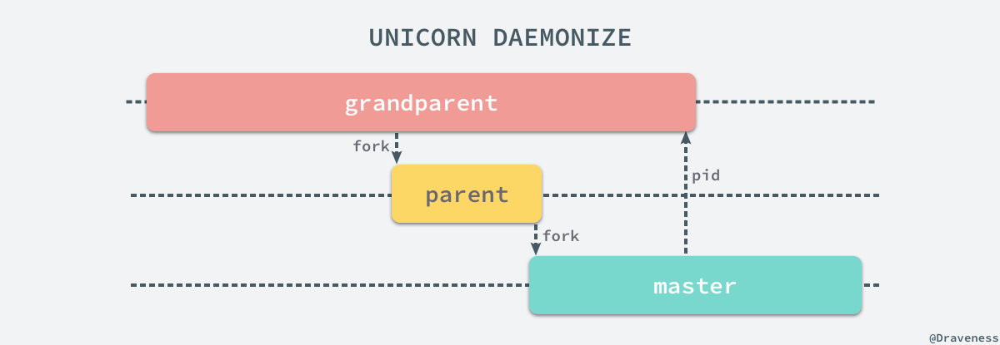
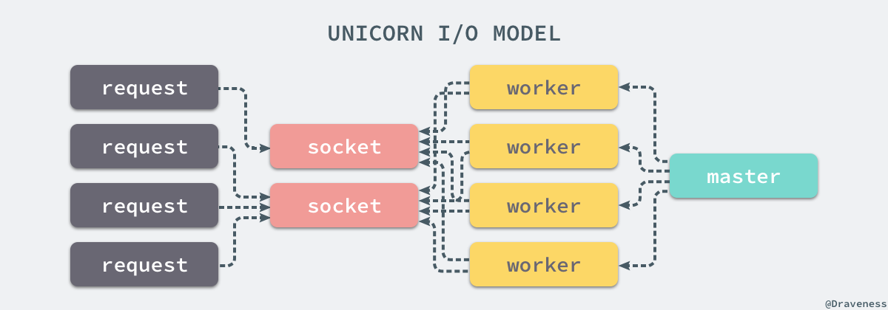
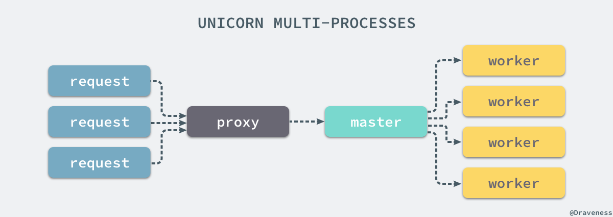

# 浅谈 Unicorn 的多进程模型

+ [谈谈 Rack 协议与实现](https://draveness.me/rack)
+ [浅谈 WEBrick 的实现](https://draveness.me/rack-webrick)
+ [浅谈 Thin 的事件驱动模型](https://draveness.me/rack-thin)
+ [浅谈 Unicorn 的多进程模型](https://draveness.me/rack-unicorn)
+ [浅谈 Puma 的实现](https://draveness.me/rack-puma)

作为 Ruby 社区中老牌的 webserver，在今天也有很多开发者在生产环境使用 Unicorn 处理客户端的发出去的 HTTP 请求，与 WEBrick 和 Thin 不同，Unicorn 使用了完全不同的模型，提供了多进程模型批量处理来自客户端的请求。


Unicorn 为 Rails 应用提供并发的方式是使用 `fork` 创建多个 worker 线程，监听同一个 Socket 上的输入。

> 本文中使用的是 5.3.1 的 Unicorn，如果你使用了不同版本的 Unicorn，原理上的区别不会太大，只是在一些方法的实现上会有一些细微的不同。

## 实现原理

Unicorn 虽然也是一个遵循 Rack 协议的 Ruby webserver，但是因为它本身并没有提供 Rack 处理器，随意没有办法直接通过 `rackup -s Unicorn` 来启动 Unicorn 的进程。

```ruby
$ unicorn -c unicorn.rb
I, [2017-11-06T08:05:03.082116 #33222]  INFO -- : listening on addr=0.0.0.0:8080 fd=10
I, [2017-11-06T08:05:03.082290 #33222]  INFO -- : worker=0 spawning...
I, [2017-11-06T08:05:03.083505 #33222]  INFO -- : worker=1 spawning...
I, [2017-11-06T08:05:03.083989 #33222]  INFO -- : master process ready
I, [2017-11-06T08:05:03.084610 #33223]  INFO -- : worker=0 spawned pid=33223
I, [2017-11-06T08:05:03.085100 #33223]  INFO -- : Refreshing Gem list
I, [2017-11-06T08:05:03.084902 #33224]  INFO -- : worker=1 spawned pid=33224
I, [2017-11-06T08:05:03.085457 #33224]  INFO -- : Refreshing Gem list
I, [2017-11-06T08:05:03.123611 #33224]  INFO -- : worker=1 ready
I, [2017-11-06T08:05:03.123670 #33223]  INFO -- : worker=0 ready
```

在使用 Unicorn 时，我们需要直接使用 `unicorn` 命令来启动一个 Unicorn 服务，在使用时可以通过 `-c` 传入一个配置文件，文件中的内容其实都是 Ruby 代码，每一个方法调用都是 Unicorn 的一条配置项：

```ruby
$ cat unicorn.rb
worker_processes 2
```

### 可执行文件

`unicorn` 这个命令位于 `bin/unicorn` 中，在这个可执行文件中，大部分的代码都是对命令行参数的配置和说明，整个文件可以简化为以下的几行代码：

```ruby
rackup_opts = # ...
app = Unicorn.builder(ARGV[0] || 'config.ru', op)
Unicorn::Launcher.daemonize!(options) if rackup_opts[:daemonize]
Unicorn::HttpServer.new(app, options).start.join
```

`unicorn` 命令会从 Rack 应用的标配 config.ru 文件或者传入的文件中加载代码构建一个新的 Rack 应用；初始化 Rack 应用后会使用 `.daemonize!` 方法将 unicorn 进程启动在后台运行；最后会创建并启动一个新的 `HttpServer` 的实例。

### 构建应用

读取 config.ru 文件并解析的过程其实就是直接使用了 Rack 的 `Builder` 模块，通过 `eval` 运行一段代码得到一个 Rack 应用：

```ruby
From: lib/unicorn.rb @ line 39:
Owner: #<Class:Unicorn>

def self.builder(ru, op)
  raw = File.read(ru)
  inner_app = eval("Rack::Builder.new {(\n#{raw}\n)}.to_app", TOPLEVEL_BINDING, ru)

  middleware = {
    ContentLength: nil,
    Chunked: nil,
    CommonLogger: [ $stderr ],
    ShowExceptions: nil,
    Lint: nil,
    TempfileReaper: nil,
  }

  Rack::Builder.new do
    middleware.each do |m, args|
      use(Rack.const_get(m), *args) if Rack.const_defined?(m)
    end
    run inner_app
  end.to_app
end
```

在该方法中会执行两次 `Rack::Builder.new` 方法，第一次会运行 config.ru 中的代码，第二次会添加一些默认的中间件，最终会返回一个接受 `#call` 方法返回三元组的 Rack 应用。

### 守护进程

在默认情况下，Unicorn 的进程都是以前台进程的形式运行的，但是在生产环境我们往往需要在后台运行 Unicorn 进程，这也就是 `Unicorn::Launcher` 所做的工作。

```ruby
From: lib/unicorn.rb @ line 23:
Owner: #<Class:Unicorn::Launcher>

def self.daemonize!(options)
  cfg = Unicorn::Configurator
  $stdin.reopen("/dev/null")

  unless ENV['UNICORN_FD']
    rd, wr = IO.pipe
    grandparent = $$
    if fork
      wr.close
    else
      rd.close
      Process.setsid
      exit if fork
    end

    if grandparent == $$
      master_pid = (rd.readpartial(16) rescue nil).to_i
      unless master_pid > 1
        warn "master failed to start, check stderr log for details"
        exit!(1)
      end
      exit 0
    else
      options[:ready_pipe] = wr
    end
  end
  cfg::DEFAULTS[:stderr_path] ||= "/dev/null"
  cfg::DEFAULTS[:stdout_path] ||= "/dev/null"
  cfg::RACKUP[:daemonized] = true
end
```

想要真正理解上述代码的工作，我们需要理解广义上的 daemonize 过程，在 Unix-like 的系统中，一个 [daemon](https://en.wikipedia.org/wiki/Daemon_(computing))（守护进程）是运行在后台不直接被用户操作的进程；一个进程想要变成守护进程通常需要做以下的事情：

1. 执行 `fork` 和 `exit` 来创建一个后台任务；
2. 从 tty 的控制中分离、创建一个新的 session 并成为新的 session 和进程组的管理者；
3. 将根目录 `/` 设置为当前进程的工作目录；
4. 将 umask 更新成 `0` 以提供自己的权限管理掩码；
5. 使用日志文件、控制台或者 `/dev/null` 设备作为标准输入、输出和错误；

在 `.daemonize!` 方法中我们总共使用 fork 创建了两个进程，整个过程涉及三个进程的协作，其中 grandparent 是启动 Unicorn 的进程一般指终端，parent 是用来启动 Unicorn 服务的进程，master 就是 Unicorn 服务中的主进程，三个进程有以下的关系：



上述的三个进程中，grandparent 表示用于启动 Unicorn 进程的终端，parent 只是一个用于设置进程状态和掩码的中间进程，它在启动 Unicorn 的 master 进程后就会立刻退出。

在这里，我们会分三个部分分别介绍 grandparent、parent 和 master 究竟做了哪些事情；首先，对于 grandparent 进程来说，我们实际上运行了以下的代码：

```ruby
def self.daemonize!(options)
  $stdin.reopen("/dev/null")
  rd, wr = IO.pipe
  wr.close

  # fork

  master_pid = (rd.readpartial(16) rescue nil).to_i
  unless master_pid > 1
    warn "master failed to start, check stderr log for details"
    exit!(1)
  end
end
```

通过 `IO.pipe` 方法创建了一对 Socket 节点，其中一个用于读，另一个用于写，在这里由于当前进程 grantparent 不需要写，所以直接将写的一端 `#close`，保留读的一端等待 Unicorn master 进程发送它的 `pid`，如果 master 没有成功启动就会报错，这也是 grandparent 进程的主要作用。

对于 parent 进程来说做的事情其实就更简单了，在 `fork` 之后会直接将读的一端执行 `#close`，这样无论是当前进程 parent 还是 parent fork 出来的进程都无法通过 `rd` 读取数据：

```ruby
def self.daemonize!(options)
  $stdin.reopen("/dev/null")
  rd, wr = IO.pipe

  # fork

  rd.close
  Process.setsid
  exit if fork
end
```

在 parent 进程中，我们通过 `Process.setsid` 将当前的进程设置为新的 session 和进程组的管理者，从 tty 中分离；最后直接执行 `fork` 创建一个新的进程 master 并退出 parent 进程，parent 进程的作用其实就是为了启动新 Unicorn master 进程。

```ruby
def self.daemonize!(options)
  cfg = Unicorn::Configurator
  $stdin.reopen("/dev/null")

  rd, wr = IO.pipe
  rd.close

  Process.setsid

  # fork

  options[:ready_pipe] = wr
  cfg::DEFAULTS[:stderr_path] ||= "/dev/null"
  cfg::DEFAULTS[:stdout_path] ||= "/dev/null"
  cfg::RACKUP[:daemonized] = true
end
```

新的进程 Unicorn master 就是一个不关联在任何 tty 的一个后台进程，不过到这里为止也仅仅创建另一个进程，Unicorn 还无法对外提供服务，我们将可读的 Socket `wr` 写入 `options` 中，在 webserver 成功启动后将通过 `IO.pipe` 创建的一对 Socket 将信息回传给 grandparent 进程通知服务启动的结果。

### 初始化服务

HTTP 服务在初始化时其实也没有做太多的事情，只是对 Rack 应用进行存储并初始化了一些实例变量：

```ruby
From: lib/unicorn/http_server.rb @ line 69:
Owner: Unicorn::HttpServer

def initialize(app, options = {})
  @app = app
  @request = Unicorn::HttpRequest.new
  @reexec_pid = 0
  @ready_pipe = options.delete(:ready_pipe)
  @init_listeners = options[:listeners] ? options[:listeners].dup : []
  self.config = Unicorn::Configurator.new(options)
  self.listener_opts = {}

  @self_pipe = []
  @workers = {}
  @sig_queue = []
  @pid = nil

  config.commit!(self, :skip => [:listeners, :pid])
  @orig_app = app
  @queue_sigs = [:WINCH, :QUIT, :INT, :TERM, :USR1, :USR2, :HUP, :TTIN, :TTOU]
end
```

在 `.daemonize!` 方法中存储的 `ready_pipe` 在这时被当前的 `HttpServer` 对象持有，之后会通过这个管道上传数据。

### 启动服务

`HttpServer` 服务的启动一看就是这个 `#start` 实例方法控制的，在这个方法中总过做了两件比较重要的事情：

```ruby
From: lib/unicorn/http_server.rb @ line 120:
Owner: Unicorn::HttpServer

def start
  @queue_sigs.each { |sig| trap(sig) { @sig_queue << sig; awaken_master } }
  trap(:CHLD) { awaken_master }

  self.pid = config[:pid]

  spawn_missing_workers
  self
end
```

第一件事情是将构造器中初始化的 `queue_sigs` 实例变量中的全部信号，通过 `trap` 为信号提供用于响应事件的代码。

第二件事情就是通过 `#spawn_missing_workers` 方法 `fork` 当前 master 进程创建一系列的 worker 进程：

```ruby
From: lib/unicorn/http_server.rb @ line 531:
Owner: Unicorn::HttpServer

def spawn_missing_workers
  worker_nr = -1
  until (worker_nr += 1) == @worker_processes
    worker = Unicorn::Worker.new(worker_nr)
    before_fork.call(self, worker)

    pid = fork

    unless pid
      after_fork_internal
      worker_loop(worker)
      exit
    end

    @workers[pid] = worker
    worker.atfork_parent
  end
rescue => e
  @logger.error(e) rescue nil
  exit!
end
```

在这种调用了 `fork` 的方法中，我们还是将其一分为二来看，在这里就是 master 和 worker 进程，对于 master 进程来说：

```ruby
From: lib/unicorn/http_server.rb @ line 531:
Owner: Unicorn::HttpServer

def spawn_missing_workers
  worker_nr = -1
  until (worker_nr += 1) == @worker_processes
    worker = Unicorn::Worker.new(worker_nr)
    before_fork.call(self, worker)

    pid = fork
    
    # ...

    @workers[pid] = worker
  end
rescue => e
  @logger.error(e) rescue nil
  exit!
end
```

通过一个 until 循环，master 进程能够创建 `worker_processes` 个 worker 进程，在每个循环中，上述方法都会创建一个 `Unicorn::Worker` 对象并在 `fork` 之后，将子进程的 `pid` 和 `worker` 以键值对的形式存到 `workers` 这个实例变量中。

`before_fork` 中存储的 block 是我们非常熟悉的，其实就是向服务器的日志中追加内容：

```ruby
DEFAULTS = {
  # ...
  :after_fork => lambda { |server, worker|
    server.logger.info("worker=#{worker.nr} spawned pid=#{$$}")
  },
  :before_fork => lambda { |server, worker|
    server.logger.info("worker=#{worker.nr} spawning...")
  },
  :before_exec => lambda { |server|
    server.logger.info("forked child re-executing...")
  },
  :after_worker_exit => lambda { |server, worker, status|
    m = "reaped #{status.inspect} worker=#{worker.nr rescue 'unknown'}"
    if status.success?
      server.logger.info(m)
    else
      server.logger.error(m)
    end
  },
  :after_worker_ready => lambda { |server, worker|
    server.logger.info("worker=#{worker.nr} ready")
  },
  # ...
}
```

所有日志相关的输出大都在 `Unicorn::Configurator` 类中作为常量定义起来，并在初始化时作为缺省值赋值到 `HttpServer` 相应的实例变量上。而对于真正处理 HTTP 请求的 worker 进程来说，就会进入更加复杂的逻辑了：

```ruby
def spawn_missing_workers
  worker_nr = -1
  until (worker_nr += 1) == @worker_processes
    worker = Unicorn::Worker.new(worker_nr)
    before_fork.call(self, worker)

    # fork

    after_fork_internal
    worker_loop(worker)
    exit
  end
rescue => e
  @logger.error(e) rescue nil
  exit!
end
```

在这里调用了两个实例方法，其中一个是 `#after_fork_internal`，另一个是 `#worker_loop` 方法，前者用于处理一些 `fork` 之后收尾的逻辑，比如关闭仅在 master 进程中使用的 `self_pipe`：

```ruby
def after_fork_internal
  @self_pipe.each(&:close).clear
  @ready_pipe.close if @ready_pipe
  Unicorn::Configurator::RACKUP.clear
  @ready_pipe = @init_listeners = @before_exec = @before_fork = nil
end
```

而后者就是 worker 持续监听 Socket 输入并处理请求的循环了。

### 循环

当我们开始运行 worker 中的循环时，就开始监听 Socket 上的事件，整个过程还是比较直观的：

```ruby
From: lib/unicorn/http_server.rb @ line 681:
Owner: Unicorn::HttpServer

def worker_loop(worker)
  ppid = @master_pid
  readers = init_worker_process(worker)
  ready = readers.dup
  @after_worker_ready.call(self, worker)

  begin
    tmp = ready.dup
    while sock = tmp.shift
      if client = sock.kgio_tryaccept
        process_client(client)
      end
    end

    unless nr == 0
      tmp = ready.dup
      redo
    end

    ppid == Process.ppid or return

    ret = IO.select(readers, nil, nil, @timeout) and ready = ret[0]
  rescue => e
    # ...
  end while readers[0]
end
```

如果当前 Socket 上有等待处理的 HTTP 请求，就会执行 `#process_client` 方法队请求进行处理，在这里调用了 Rack 应用的 `#call` 方法得到了三元组：

```ruby
From: lib/unicorn/http_server.rb @ line 605:
Owner: Unicorn::HttpServer

def process_client(client)
  status, headers, body = @app.call(env = @request.read(client))

  begin
    return if @request.hijacked?

    @request.headers? or headers = nil
    http_response_write(client, status, headers, body,
                        @request.response_start_sent)
  ensure
    body.respond_to?(:close) and body.close
  end

  unless client.closed?
    client.shutdown
    client.close
  end
rescue => e
  handle_error(client, e)
end
```

请求的解析是通过 `Request#read` 处理的，而向 Socket 写 HTTP 响应是通过 `#http_response_write` 方法来完成的，在这里有关 HTTP 请求的解析和响应的处理都属于一些不重要的实现细节，在这里也就不展开介绍了；当我们已经响应了用户的请求就可以将当前 Socket 直接关掉，断掉这个 TCP 连接了。

## 调度

我们在上面已经通过多次 `fork` 启动了用于管理 Unicorn worker 进程的 master 以及多个 worker 进程，由于 Unicorn webserver 涉及了多个进程，所以需要进程之间进行调度。

在 Unix 中，进程的调度往往都是通过信号来进行的，`HttpServer#join` 就在 Unicorn 的 master 进程上监听外界发送的各种信号，不过在监听信号之前，要通过 `ready_pipe` 通知 grandparent 进程当前 master 进程已经启动完毕：

```ruby
From: lib/unicorn/http_server.rb @ line 267:
Owner: Unicorn::HttpServer

def join
  respawn = true
  last_check = time_now

  proc_name 'master'
  logger.info "master process ready" # test_exec.rb relies on this message
  if @ready_pipe
    begin
      @ready_pipe.syswrite($$.to_s)
    rescue => e
      logger.warn("grandparent died too soon?: #{e.message} (#{e.class})")
    end
    @ready_pipe = @ready_pipe.close rescue nil
  end

  # ...
end
```

当 grandparent 进程，也就是执行 Unicorn 命令的进程接收到命令退出之后，就可以继续做其他的操作了，而 master 进程会进入一个 while 循环持续监听外界发送的信号：

```ruby
def join
  # ...

  begin
    reap_all_workers
    case @sig_queue.shift
    # ...
    when :WINCH
      respawn = false
      soft_kill_each_worker(:QUIT)
      self.worker_processes = 0
    when :TTIN
      respawn = true
      self.worker_processes += 1
    when :TTOU
      self.worker_processes -= 1 if self.worker_processes > 0
    when # ...
    end
  rescue => e
    Unicorn.log_error(@logger, "master loop error", e)
  end while true

  # ...
end
```

这一部分的几个信号都会改变当前 Unicorn worker 的进程数，无论是 `TTIN`、`TTOU` 还是 `WINCH` 信号最终都修改了 `worker_processes` 变量，其中 `#soft_kill_each_worker` 方法向所有的 Unicorn worker 进程发送了 `QUIT` 信号。

除了一些用于改变当前 worker 数量的信号，Unicorn 的 master 进程还监听了一些用于终止 master 进程或者更新配置文件的信号。

```ruby
def join
  # ...

  begin
    reap_all_workers
    case @sig_queue.shift
    # ...
    when :QUIT
      break
    when :TERM, :INT
      stop(false)
      break
    when :HUP
      respawn = true
      if config.config_file
        load_config!
      else # exec binary and exit if there's no config file
        reexec
      end
    when # ...
    end
  rescue => e
    Unicorn.log_error(@logger, "master loop error", e)
  end while true

  # ...
end
```

无论是 `QUIT` 信号还是 `TERM`、`INT` 最终都执行了 `#stop` 方法，选择使用不同的信号干掉当前 master 管理的 worker 进程：

```ruby
From: lib/unicorn/http_server.rb @ line 339:
Owner: Unicorn::HttpServer

def stop(graceful = true)
  self.listeners = []
  limit = time_now + timeout
  until @workers.empty? || time_now > limit
    if graceful
      soft_kill_each_worker(:QUIT)
    else
      kill_each_worker(:TERM)
    end
    sleep(0.1)
    reap_all_workers
  end
  kill_each_worker(:KILL)
end
```

上述方法其实非常容易理解，它会根据传入的参数选择强制终止或者正常停止所有的 worker 进程，这样整个 Unicorn 服务才真正停止并不再为外界提供服务了。

当我们向 master 发送 `TTIN` 或者 `TTOU` 信号时只是改变了实例变量 `worker_process` 的值，还并没有 `fork` 出新的进程，这些操作都是在 `nil` 条件中完成的：

```ruby
def join
  # ...

  begin
    reap_all_workers
    case @sig_queue.shift
    when nil
      if (last_check + @timeout) >= (last_check = time_now)
        sleep_time = murder_lazy_workers
      else
        sleep_time = @timeout/2.0 + 1
      end
      maintain_worker_count if respawn
      master_sleep(sleep_time)
    when # ...
    end
  rescue => e
    Unicorn.log_error(@logger, "master loop error", e)
  end while true

  # ...
end
```

当 `@sig_queue.shift` 返回 `nil` 时也就代表当前没有需要处理的信号，如果需要创建新的进程或者停掉进程就会通过 `#maintain_worker_count` 方法，之后 master 进程会陷入睡眠直到被再次唤醒。

```ruby
From: lib/unicorn/http_server.rb @ line 561:
Owner: Unicorn::HttpServer

def maintain_worker_count
  (off = @workers.size - worker_processes) == 0 and return
  off < 0 and return spawn_missing_workers
  @workers.each_value { |w| w.nr >= worker_processes and w.soft_kill(:QUIT) }
end
```

通过创建缺失的进程并关闭多余的进程，我们能够实时的保证整个 Unicorn 服务中的进程数与期望的配置完全相同。

在 Unicorn 的服务中，不仅 master 进程能够接收到来自用户或者其他进程的各种信号，worker 进程也能通过以下的方式将接受到的信号交给 master 处理：

```ruby
From: lib/unicorn/http_server.rb @ line 120:
Owner: Unicorn::HttpServer

def start
  # ...
  @queue_sigs.each { |sig| trap(sig) { @sig_queue << sig; awaken_master } }
  trap(:CHLD) { awaken_master }
end

From: lib/unicorn/http_server.rb @ line 391:
Owner: Unicorn::HttpServer

def awaken_master
  return if $$ != @master_pid
  @self_pipe[1].kgio_trywrite('.')
end
```

所以即使向 worker 进程发送 `TTIN` 或者 `TTOU` 等信号也能够改变整个 Unicorn 服务中 worker 进程的个数。

## 多进程模型

总的来说，Unicorn 作为 Web 服务使用了多进程的模型，通过一个 master 进程来管理多个 worker 进程，其中 master 进程不负责处理客户端的 HTTP 请求，多个 worker 进程监听同一组 Socket：



一组 worker 进程在监听 Socket 时，如果发现当前的 Socket 有等待处理的请求时就会在当前的进程中直接通过 `#process_client` 方法处理，整个过程会阻塞当前的进程，而多进程阻塞 I/O 的方式没有办法接受慢客户端造成的性能损失，只能通过反向代理 nginx 才可以解决这个问题。



在 Unicorn 中，worker 之间的负载均衡是由操作系统解决的，所有的 worker 是通过 `.select` 方法等待共享 Socket 上的请求，一旦出现可用的 worker，就可以立即进行处理，避开了其他负载均衡算法没有考虑到请求处理时间的问题。

## 总结

Unicorn 的源代码其实是作者读过的可读性最差的 Ruby 代码了，很多 Ruby 代码的风格写得跟 C 差不多，看起来也比较头疼，可能是需要处理很多边界条件以及信号，涉及较多底层的进程问题；虽然代码风格上看起来确实让人头疼，不过实现还是值得一看的，重要的代码大都包含在 unicorn.rb 和 http_server.rb 两个文件中，阅读时也不需要改变太多的上下文。

相比于 WEBrick 的单进程多线程的 I/O 模型，Unicorn 的多进程模型有很多优势，一是能够充分利用多核 CPU 的性能，其次能够通过 master 来管理并监控 Unicorn 中包含的一组 worker 并提供了零宕机部署的功能，除此之外，多进程的 I/O 模型还不在乎当前的应用是否是线程安全的，所以不会出现线程竞争等问题，不过 Unicorn 由于 `fork` 了大量的 worker 进程，如果长时间的在 Unicorn 上运行内存泄露的应用会非常耗费内存资源，可以考虑使用 [unicorn-worker-killer](https://github.com/kzk/unicorn-worker-killer) 来自动重启。

## Reference

+ [How To Optimize Unicorn Workers in a Ruby on Rails App](https://www.digitalocean.com/community/tutorials/how-to-optimize-unicorn-workers-in-a-ruby-on-rails-app)
+ [Ruby Web 服务器：这十五年](https://read01.com/zh-hk/zm5B.html#.Wf0oLduB0sk)
+ [unicorn-worker-killer](https://github.com/kzk/unicorn-worker-killer)
+ [Daemon (computing)](https://en.wikipedia.org/wiki/Daemon_(computing))
+ [Nginx 与 Unicorn](http://jiangpeng.info/blogs/2014/03/10/nginx-unicorn.html)
+ [Unicorn!](https://github.com/blog/517-unicorn)

