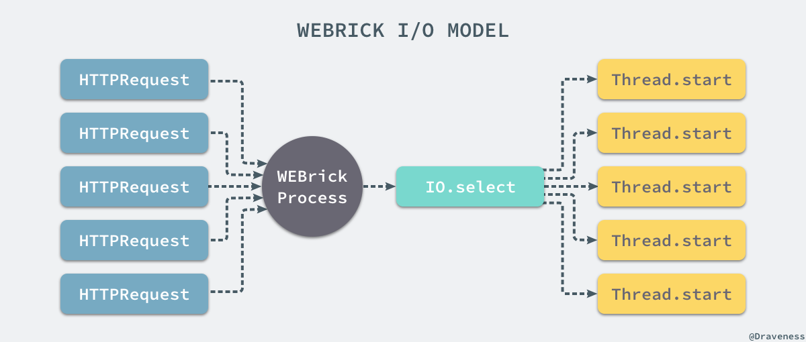

# 浅谈 WEBrick 的实现

+ [谈谈 Rack 协议与实现](https://draveness.me/rack)
+ [浅谈 WEBrick 的实现](https://draveness.me/rack-webrick)
+ [浅谈 Thin 的事件驱动模型](https://draveness.me/rack-thin)
+ [浅谈 Unicorn 的多进程模型](https://draveness.me/rack-unicorn)
+ [浅谈 Puma 的实现](https://draveness.me/rack-puma)

这篇文章会介绍在开发环境中最常用的应用容器 WEBrick 的实现原理，除了通过源代码分析之外，我们也会介绍它的 IO 模型以及一些特点。

在 GitHub 上，WEBrick 从 2003 年的六月份就开始开发了，有着十几年历史的 WEBrick 的实现非常简单，总共只有 4000 多行的代码：

```ruby
$ loc_counter .
40 files processed
Total     6918 lines
Empty     990 lines
Comments  1927 lines
Code      4001 lines
```

## WEBrick 的实现

由于 WEBrick 是 Rack 中内置的处理器，所以与 Unicorn 和 Puma 这种第三方开发的 webserver 不同，WEBrick 的处理器是在 Rack 中实现的，而 WEBrick 的运行也都是从这个处理器的开始的。

```ruby
module Rack
  module Handler
    class WEBrick < ::WEBrick::HTTPServlet::AbstractServlet
      def self.run(app, options={})
        environment  = ENV['RACK_ENV'] || 'development'
        default_host = environment == 'development' ? 'localhost' : nil

        options[:BindAddress] = options.delete(:Host) || default_host
        options[:Port] ||= 8080
        @server = ::WEBrick::HTTPServer.new(options)
        @server.mount "/", Rack::Handler::WEBrick, app
        yield @server  if block_given?
        @server.start
      end
    end
  end
end
```

我们在上一篇文章 [谈谈 Rack 协议与实现](https://draveness.me/rack) 中介绍 Rack 的实现原理时，最终调用了上述方法，从这里开始大部分的实现都与 WEBrick 有关了。

在这里，你可以看到方法会先处理传入的参数比如：地址、端口号等等，在这之后会使用 WEBrick 提供的 `HTTPServer` 来处理 HTTP 请求，调用 `mount` 在根路由上挂载应用和处理器 `Rack::Handler::WEBrick` 接受请求，最后执行 `#start` 方法启动服务器。

### 初始化服务器

`HTTPServer` 的初始化分为两个阶段，一部分是 `HTTPServer` 的初始化，另一部分调用父类的 `initialize` 方法，在自己构造器中，会配置当前服务器能够处理的 HTTP 版本并初始化新的 `MountTable` 实例：

```ruby
From: lib/webrick/httpserver.rb @ line 46:
Owner: #<Class:WEBrick::HTTPServer>

def initialize(config={}, default=Config::HTTP)
  super(config, default)
  @http_version = HTTPVersion::convert(@config[:HTTPVersion])

  @mount_tab = MountTable.new
  if @config[:DocumentRoot]
    mount("/", HTTPServlet::FileHandler, @config[:DocumentRoot],
          @config[:DocumentRootOptions])
  end

  unless @config[:AccessLog]
    @config[:AccessLog] = [
      [ $stderr, AccessLog::COMMON_LOG_FORMAT ],
      [ $stderr, AccessLog::REFERER_LOG_FORMAT ]
    ]
  end

  @virtual_hosts = Array.new
end
```

在父类 `GenericServer` 中初始化了用于监听端口号的 Socket 连接：

```ruby
From: lib/webrick/server.rb @ line 185:
Owner: #<Class:WEBrick::GenericServer>

def initialize(config={}, default=Config::General)
  @config = default.dup.update(config)
  @status = :Stop

  @listeners = []
  listen(@config[:BindAddress], @config[:Port])
  if @config[:Port] == 0
    @config[:Port] = @listeners[0].addr[1]
  end
end
```

每一个服务器都会在初始化的时候创建一系列的 `listener` 用于监听地址和端口号组成的元组，其内部调用了 `Utils` 模块中定义的方法：

```ruby
From: lib/webrick/server.rb @ line 127:
Owner: #<Class:WEBrick::GenericServer>

def listen(address, port)
  @listeners += Utils::create_listeners(address, port)
end

From: lib/webrick/utils.rb @ line 61:
Owner: #<Class:WEBrick::Utils>

def create_listeners(address, port)
  sockets = Socket.tcp_server_sockets(address, port)
  sockets = sockets.map {|s|
    s.autoclose = false
    ts = TCPServer.for_fd(s.fileno)
    s.close
    ts
  }
  return sockets
end
module_function :create_listeners
```

在 `.create_listeners` 方法中调用了 `.tcp_server_sockets` 方法由于初始化一组 `Socket` 对象，最后得到一个数组的 `TCPServer` 实例。

### 挂载应用

在使用 `WEBrick` 启动服务的时候，第二步就是将处理器和 Rack 应用挂载到根路由下：

```ruby
@server.mount "/", Rack::Handler::WEBrick, app
```

`#mount` 方法其实是一个比较简单的方法，因为我们在构造器中已经初始化了 `MountTable` 对象，所以这一步只是将传入的多个参数放到这个表中：

```ruby
From: lib/webrick/httpserver.rb @ line 155:
Owner: WEBrick::HTTPServer

def mount(dir, servlet, *options)
  @mount_tab[dir] = [ servlet, options ]
end
```

`MountTable` 是一个包含从路由到 Rack 处理器一个 App 的映射表：


当执行了 `MountTable` 的 `#compile` 方法时，上述的对象就会将表中的所有键按照加入的顺序逆序拼接成一个如下的正则表达式用来匹配传入的路由：

```ruby
^(/|/admin|/user)(?=/|$)
```

上述正则表达式在使用时如果匹配到了指定的路由就会返回 `$&` 和 `$'` 两个部分，前者表示整个匹配的文本，后者表示匹配文本后面的字符串。

### 启动服务器

在 `Rack::Handler::WEBrick` 中的 `.run` 方法先初始化了服务器，将处理器和应用挂载到了根路由上，在最后执行 `#start` 方法启动服务器：

```ruby
From: lib/webrick/server.rb @ line 152:
Owner: WEBrick::GenericServer

def start(&block)
  raise ServerError, "already started." if @status != :Stop

  @status = :Running
  begin
    while @status == :Running
      begin
        if svrs = IO.select([*@listeners], nil, nil, 2.0)
          svrs[0].each{ |svr|
            sock = accept_client(svr)
            start_thread(sock, &block)
          }
        end
      rescue Errno::EBADF, Errno::ENOTSOCK, IOError, StandardError => ex
      rescue Exception => ex
        raise
      end
    end
  ensure
    cleanup_listener
    @status = :Stop
  end
end
```

由于原方法的实现比较复杂不容易阅读，在这里对方法进行了简化，省略了向 logger 中输出内容、处理服务的关闭以及执行回调等功能。

我们可以理解为上述方法通过 `.select` 方法对一组 Socket 进行监听，当有消息需要处理时就依次执行 `#accept_client` 和 `#start_thread` 两个方法处理来自客户端的请求：

```ruby
From: lib/webrick/server.rb @ line 254:
Owner: WEBrick::GenericServer

def accept_client(svr)
  sock = nil
  begin
    sock = svr.accept
    sock.sync = true
    Utils::set_non_blocking(sock)
  rescue Errno::ECONNRESET, Errno::ECONNABORTED,
         Errno::EPROTO, Errno::EINVAL
  rescue StandardError => ex
    msg = "#{ex.class}: #{ex.message}\n\t#{ex.backtrace[0]}"
    @logger.error msg
  end
  return sock
end
```

WEBrick 在 `#accept_client` 方法中执行了 `#accept` 方法来得到一个 TCP 客户端 Socket，同时会通过 `set_non_blocking` 将该 Socket 变成非阻塞的，最后在方法末尾返回创建的 Socket。

在 `#start_thread` 方法中会**开启一个新的线程**，并在新的线程中执行 `#run` 方法来处理请求：

```ruby
From: lib/webrick/server.rb @ line 278:
Owner: WEBrick::GenericServer

def start_thread(sock, &block)
  Thread.start {
    begin
      Thread.current[:WEBrickSocket] = sock
      run(sock)
    rescue Errno::ENOTCONN, ServerError, Exception
    ensure
      Thread.current[:WEBrickSocket] = nil
      sock.close
    end
  }
end
```

### 处理请求

所有的请求都不会由 `GenericServer` 这个通用的服务器来处理，它只处理通用的逻辑，对于 HTTP 请求的处理都是在 `HTTPServer#run` 中完成的：

```ruby
From: lib/webrick/httpserver.rb @ line 69:
Owner: WEBrick::HTTPServer

def run(sock)
  while true
    res = HTTPResponse.new(@config)
    req = HTTPRequest.new(@config)
    server = self
    begin
      timeout = @config[:RequestTimeout]
      while timeout > 0
        break if sock.to_io.wait_readable(0.5)
        break if @status != :Running
        timeout -= 0.5
      end
      raise HTTPStatus::EOFError if timeout <= 0 || @status != :Running
      raise HTTPStatus::EOFError if sock.eof?
      req.parse(sock)
      res.request_method = req.request_method
      res.request_uri = req.request_uri
      res.request_http_version = req.http_version
      self.service(req, res)
    rescue HTTPStatus::EOFError, HTTPStatus::RequestTimeout, HTTPStatus::Error => ex
      res.set_error(ex)
    rescue HTTPStatus::Status => ex
      res.status = ex.code
    rescue StandardError => ex
      res.set_error(ex, true)
    ensure
      res.send_response(sock) if req.request_line
    end
    break if @http_version < "1.1"
  end
end
```

对 HTTP 协议了解的读者应该能从上面的代码中看到很多与 HTTP 协议相关的东西，比如 HTTP 的版本号、方法、URL 等等，上述方法总共做了三件事情，等待监听的 Socket 变得可读，执行 `#parse` 方法解析 Socket 上的数据，通过 `#service` 方法完成处理请求的响应，首先是对 Socket 上的数据进行解析：

```ruby
From: lib/webrick/httprequest.rb @ line 192:
Owner: WEBrick::HTTPRequest

def parse(socket=nil)
  @socket = socket
  begin
    @peeraddr = socket.respond_to?(:peeraddr) ? socket.peeraddr : []
    @addr = socket.respond_to?(:addr) ? socket.addr : []
  rescue Errno::ENOTCONN
    raise HTTPStatus::EOFError
  end

  read_request_line(socket)
  if @http_version.major > 0
    # ...
  end
  return if @request_method == "CONNECT"
  return if @unparsed_uri == "*"

  begin
    setup_forwarded_info
    @request_uri = parse_uri(@unparsed_uri)
    @path = HTTPUtils::unescape(@request_uri.path)
    @path = HTTPUtils::normalize_path(@path)
    @host = @request_uri.host
    @port = @request_uri.port
    @query_string = @request_uri.query
    @script_name = ""
    @path_info = @path.dup
  rescue
    raise HTTPStatus::BadRequest, "bad URI `#{@unparsed_uri}'."
  end

  if /close/io =~ self["connection"]
    # deal with keep alive
  end
end
```

由于 HTTP 协议本身就比较复杂，请求中包含的信息也非常多，所以在这里用于**解析** HTTP 请求的代码也很多，想要了解 WEBrick 是如何解析 HTTP 请求的可以看 httprequest.rb 文件中的代码，在处理了 HTTP 请求之后，就开始执行 `#service` 响应该 HTTP 请求了：

```ruby
From: lib/webrick/httpserver.rb @ line 125:
Owner: WEBrick::HTTPServer

def service(req, res)
  servlet, options, script_name, path_info = search_servlet(req.path)
  raise HTTPStatus::NotFound, "`#{req.path}' not found." unless servlet
  req.script_name = script_name
  req.path_info = path_info
  si = servlet.get_instance(self, *options)
  si.service(req, res)
end
```

在这里我们会从上面提到的 `MountTable` 中找出在之前注册的处理器 handler 和 Rack 应用：

```ruby
From: lib/webrick/httpserver.rb @ line 182:
Owner: WEBrick::HTTPServer

def search_servlet(path)
  script_name, path_info = @mount_tab.scan(path)
  servlet, options = @mount_tab[script_name]
  if servlet
    [ servlet, options, script_name, path_info ]
  end
end
```

得到了处理器 handler 之后，通过 `.get_instance` 方法创建一个新的实例，这个方法在大多数情况下等同于初始化方法 `.new`，随后调用了该处理器 `Rack::WEBrick::Handler` 的 `#service` 方法，该方法是在 rack 工程中定义的：

```ruby
From: rack/lib/handler/webrick.rb @ line 57:
Owner: Rack::Handler::WEBrick

def service(req, res)
  res.rack = true
  env = req.meta_vars
  env.delete_if { |k, v| v.nil? }

  env.update(
    # ...
    RACK_URL_SCHEME   => ["yes", "on", "1"].include?(env[HTTPS]) ? "https" : "http",
    # ...
  )
  
  status, headers, body = @app.call(env)
  begin
    res.status = status.to_i
    headers.each { |k, vs|
      # ...
    }

    body.each { |part|
      res.body << part
    }
  ensure
    body.close  if body.respond_to? :close
  end
end
```

由于上述方法也涉及了非常多 HTTP 协议的实现细节所以很多过程都被省略了，在上述方法中，我们先构建了应用的输入 `env` 哈希变量，然后通过执行 `#call` 方法将控制权交给 Rack 应用，最后获得一个由 `status`、`headers` 和 `body` 组成的三元组；在接下来的代码中，分别对这三者进行处理，为这次请求『填充』一个完成的 HTTP 请求。

到这里，最后由 `WEBrick::HTTPServer#run` 方法中的 `ensure` block 来结束整个 HTTP 请求的处理：

```ruby
From: lib/webrick/httpserver.rb @ line 69:
Owner: WEBrick::HTTPServer

def run(sock)
  while true
    res = HTTPResponse.new(@config)
    req = HTTPRequest.new(@config)
    server = self
    begin
      # ...
    ensure
      res.send_response(sock) if req.request_line
    end
    break if @http_version < "1.1"
  end
end
```

在 `#send_reponse` 方法中，分别执行了 `#send_header` 和 `#send_body` 方法向当前的 Socket 中发送 HTTP 响应中的数据：

```ruby
From: lib/webrick/httpresponse @ line 205:
Owner: WEBrick::HTTPResponse

def send_response(socket)
  begin
    setup_header()
    send_header(socket)
    send_body(socket)
  rescue Errno::EPIPE, Errno::ECONNRESET, Errno::ENOTCONN => ex
    @logger.debug(ex)
    @keep_alive = false
  rescue Exception => ex
    @logger.error(ex)
    @keep_alive = false
  end
end
```

所有向 Socket 中写入数据的工作最终都会由 `#_write_data` 这个方法来处理，将数据全部写入 Socket 中：

```ruby
From: lib/webrick/httpresponse @ line 464:
Owner: WEBrick::HTTPResponse

def _write_data(socket, data)
  socket << data
end
```

从解析 HTTP 请求、调用 Rack 应用、创建 Response 到最后向 Socket 中写回数据，WEBrick 处理 HTTP 请求的部分就结束了。

## I/O 模型

通过对 WEBrick 源代码的阅读，我们其实已经能够了解整个 webserver 的工作原理，当我们启动一个 WEBrick 服务时只会启动一个进程，该进程会在指定的 ip 和端口上使用 `.select` 监听来自用户的所有 HTTP 请求：



当 `.select` 接收到来自用户的请求时，会为每一个请求创建一个新的 `Thread` 并在新的线程中对 HTTP 请求进行处理。

由于 WEBrick 在运行时只会启动一个进程，并没有其他的守护进程，所以它不够健壮，不能在发生问题时重启持续对外界提供服务，再加上 WEBrick 确实历史比较久远，代码的风格也不是特别的优雅，还有普遍知道的内存泄漏以及 HTTP 解析的问题，所以在生产环境中很少被使用。

虽然 WEBrick 有一些性能问题，但是作为 Ruby 自带的默认 webserver，在开发阶段使用 WEBrick 提供服务还是没有什么问题的。

## 总结

WEBrick 是 Ruby 社区中老牌的 webserver，虽然至今也仍然被广泛了解和使用，但是在生产环境中开发者往往会使用更加稳定的 Unicorn 和 Puma 代替它，我们选择在这个系列的文章中介绍它很大原因就是 WEBrick 的源代码与实现足够简单，我们很快就能了解一个 webserver 到底具备那些功能，在接下来的文章中我们就可以分析更加复杂的 webserver、了解更复杂的 IO 模型与实现了。

## Reference

+ [Ruby on Rails Server options](https://stackoverflow.com/questions/4113299/ruby-on-rails-server-options)


