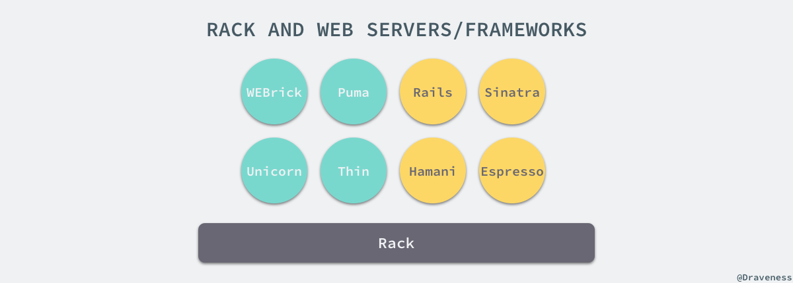
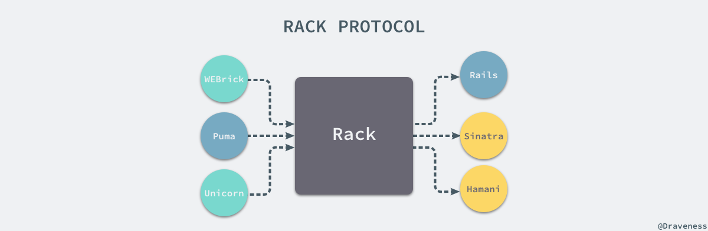
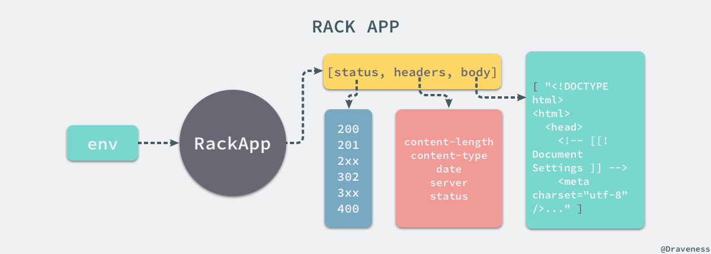
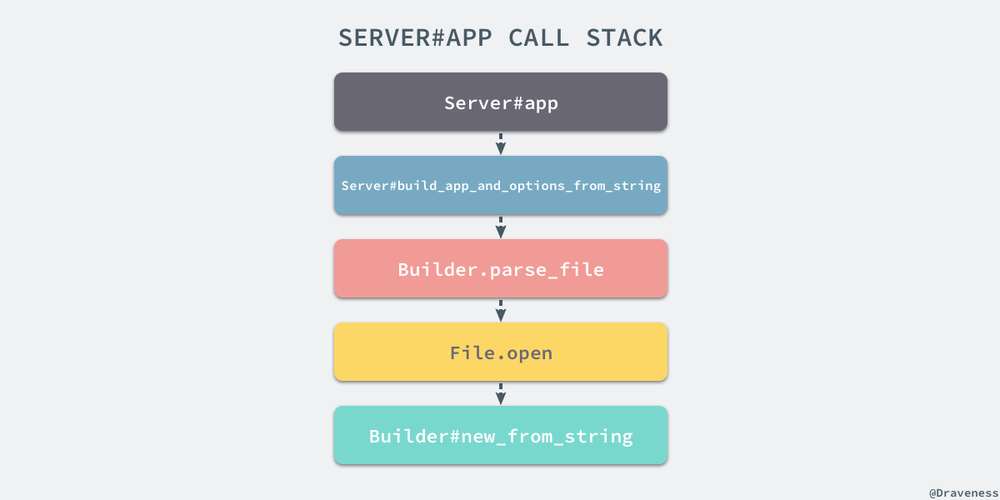
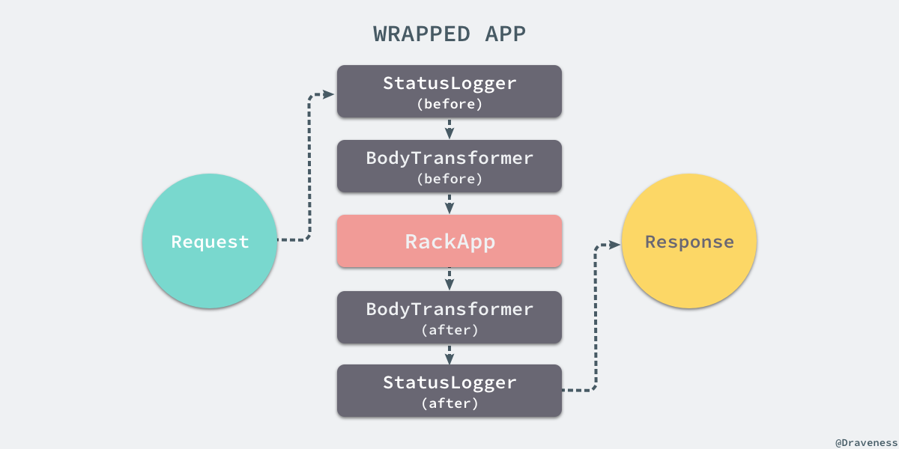
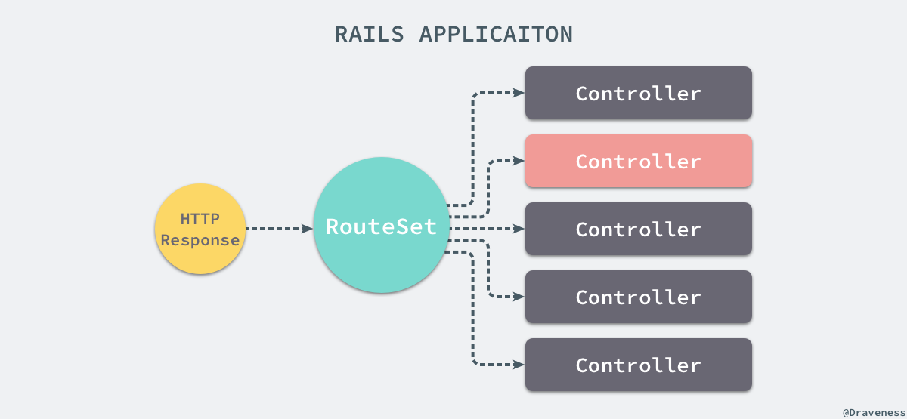

# 谈谈 Rack 的协议与实现

+ [谈谈 Rack 协议与实现](https://draveness.me/rack)
+ [浅谈 WEBrick 的实现](https://draveness.me/rack-webrick)
+ [浅谈 Thin 的事件驱动模型](https://draveness.me/rack-thin)
+ [浅谈 Unicorn 的多进程模型](https://draveness.me/rack-unicorn)
+ [浅谈 Puma 的实现](https://draveness.me/rack-puma)

作为 Rails 开发者，基本上每天都与 Rails 的各种 API 以及数据库打交道，Rails 的世界虽然非常简洁，不过其内部的实现还是很复杂的，很多刚刚接触 Rails 的开发者可能都不知道 Rails 其实就是一个 [Rack](https://github.com/rack/rack) 应用，在这一系列的文章中，我们会分别介绍 Rack 以及一些常见的遵循 Rack 协议的 webserver 的实现原理。


不只是 Rails，几乎所有的 Ruby 的 Web 框架都是一个 Rack 的应用，除了 Web 框架之外，Rack 也支持相当多的 Web 服务器，可以说 Ruby 世界几乎一切与 Web 相关的服务都与 Rack 有关。



所以如果想要了解 Rails 或者其他 Web 服务底层的实现，那么一定需要了解 Rack 是如何成为应用容器（webserver）和应用框架之间的桥梁的，本文中介绍的是 2.0.3 版本的 rack。

## Rack 协议

在 Rack 的协议中，将 Rack 应用描述成一个可以响应 `call` 方法的 Ruby 对象，它仅接受来自外界的一个参数，也就是环境，然后返回一个只包含三个值的数组，按照顺序分别是状态码、HTTP Headers 以及响应请求的正文。

> A Rack application is a Ruby object (not a class) that responds to call. It takes exactly one argument, the environment and returns an Array of exactly three values: The status, the headers, and the body.



Rack 在 webserver 和应用框架之间提供了一套最小的 API 接口，如果 webserver 都遵循 Rack 提供的这套规则，那么所有的框架都能通过协议任意地改变底层使用 webserver；所有的 webserver 只需要在 `Rack::Handler` 的模块中创建一个实现了 `.run` 方法的类就可以了：

```ruby
module Rack
  module Handler
    class WEBrick < ::WEBrick::HTTPServlet::AbstractServlet
      def self.run(app, options={})
        # ..
      end
    end
  end
end
```

这个类方法接受两个参数，分别是一个 Rack 应用对象和一个包含各种参数的 `options` 字典，其中可能包括自定义的 ip 地址和端口号以及各种配置，根据 Rack 协议，所有应用对象在接受到一个 `#call` 方法并且传入 `env` 时，都会返回一个三元组：



最后的 `body` 响应体其实是一个由多个响应内容组成的数组，Rack 使用的 webserver 会将 `body` 中几个部分的连接到一起最后拼接成一个 HTTP 响应后返回。

## Rack 的使用

我们在大致了解 Rack 协议之后，其实可以从一段非常简单的代码入手来了解 Rack 是如何启动 webserver 来处理来自用户的请求的，我们可以在任意目录下创建如下所示的 config.ru 文件：

```ruby
# config.ru

run Proc.new { |env| ['200', {'Content-Type' => 'text/html'}, ['get rack\'d']] }
```

> 因为 `Proc` 对象也能够响应 `#call` 方法，所以上述的 Proc 对象也可以看做是一个 Rack 应用。

接下来，我们在同一目录使用 `rackup` 命令在命令行中启动一个 webserver 进程：

```bash
$ rackup config.ru
[2017-10-26 22:59:26] INFO  WEBrick 1.3.1
[2017-10-26 22:59:26] INFO  ruby 2.3.3 (2016-11-21) [x86_64-darwin16]
[2017-10-26 22:59:26] INFO  WEBrick::HTTPServer#start: pid=83546 port=9292
```

从命令的输出我们可以看到，使用 rackup 运行了一个 WEBrick 的进程，监听了 9292 端口，如果我们使用 curl 来访问对应的请求，就可以得到在 config.ru 文件中出现的 `'get rack\'d'` 文本：

> 在这篇文章中，作者都会使用开源的工具 [httpie](https://github.com/jakubroztocil/httpie) 代替 curl 在命令行中发出 HTTP 请求，相比 curl 而言 httpie 能够提供与 HTTP 响应有关的更多信息。

```ruby
$ http http://localhost:9292
HTTP/1.1 200 OK
Connection: Keep-Alive
Content-Type: text/html
Date: Thu, 26 Oct 2017 15:07:47 GMT
Server: WEBrick/1.3.1 (Ruby/2.3.3/2016-11-21)
Transfer-Encoding: chunked

get rack'd
```

从上述请求返回的 HTTP 响应头中的信息，我们可以看到 WEBrick 确实按照 config.ru 文件中的代码对当前的 HTTP 请求进行了处理。

### 中间件

Rack 协议和中间件是 Rack 能达到今天地位不可或缺的两个功能或者说特性，Rack 协议规定了 webserver 和 Rack 应用之间应该如何通信，而 Rack 中间件能够在上层改变 HTTP 的响应或者请求，在不改变应用的基础上为 Rack 应用增加新的功能。

Rack 的中间件是一个实现了两个方法 `.initialize` 和 `#call` 的类，初始化方法会接受两个参数，分别是 `app` 和 `options` 字典，而 `#call` 方法接受一个参数也就是 HTTP 请求的环境参数 `env`，在这里我们创建了一个新的 Rack 中间件 `StatusLogger`：

```ruby
class StatusLogger
  def initialize(app, options={})
    @app = app
  end

  def call(env)
    status, headers, body = @app.call(env)
    puts status
    [status, headers, body]
  end
end
```

在所有的 `#call` 方法中都**应该**调用 `app.call` 让应用对 HTTP 请求进行处理并在方法结束时将所有的参数按照顺序返回。

```ruby
use StatusLogger
run Proc.new { |env| ['200', {'Content-Type' => 'text/html'}, ['get rack\'d']] }
```

如果需要使用某一个 Rack 中间件只需要在当前文件中使用 `use` 方法，在每次接收到来自用户的 HTTP 请求时都会打印出当前响应的状态码。

```ruby
$ rackup
[2017-10-27 19:46:40] INFO  WEBrick 1.3.1
[2017-10-27 19:46:40] INFO  ruby 2.3.3 (2016-11-21) [x86_64-darwin16]
[2017-10-27 19:46:40] INFO  WEBrick::HTTPServer#start: pid=5274 port=9292
200
127.0.0.1 - - [27/Oct/2017:19:46:53 +0800] "GET / HTTP/1.1" 200 - 0.0004
```

除了直接通过 `use` 方法直接传入 `StatusLogger` 中间件之外，我们也可以在 `use` 中传入配置参数，所有的配置都会通过 `options` 最终初始化一个中间件的实例，比如，我们有以下的中间件 `BodyTransformer`：

```ruby
class BodyTransformer
  def initialize(app, options={})
    @app = app
    @count = options[:count]
  end

  def call(env)
    status, headers, body = @app.call(env)
    body = body.map { |str| str[0...@count].upcase + str[@count..-1] }
    [status, headers, body]
  end
end
```

上述中间件会在每次调用时都将 Rack 应用返回的 `body` 中前 `count` 个字符变成大写的，我们可以在 config.ru 中添加一个新的中间件：

```ruby
use StatusLogger
use BodyTransformer, count: 3
run Proc.new { |env| ['200', {'Content-Type' => 'text/html'}, ['get rack\'d']] }
```

当我们再次使用 http 命令请求相同的 URL 时，就会获得不同的结果，同时由于我们保留了 `StatusLogger`，所以在 console 中也会打印出当前响应的状态码：

```ruby
# session 1
$ rackup
[2017-10-27 21:04:05] INFO  WEBrick 1.3.1
[2017-10-27 21:04:05] INFO  ruby 2.3.3 (2016-11-21) [x86_64-darwin16]
[2017-10-27 21:04:05] INFO  WEBrick::HTTPServer#start: pid=7524 port=9292
200
127.0.0.1 - - [27/Oct/2017:21:04:19 +0800] "GET / HTTP/1.1" 200 - 0.0005

# session 2
$ http http://localhost:9292
HTTP/1.1 200 OK
Connection: Keep-Alive
Content-Type: text/html
Date: Fri, 27 Oct 2017 13:04:19 GMT
Server: WEBrick/1.3.1 (Ruby/2.3.3/2016-11-21)
Transfer-Encoding: chunked

GET rack'd
```

Rack 的中间件的使用其实非常简单，我们只需要定义符合要求的类，然后在合适的方法中返回合适的结果就可以了，在接下来的部分我们将介绍 Rack 以及中间件的实现原理。

## Rack 的实现原理

到这里，我们已经对 Rack 的使用有一些基本的了解了，包括如何使用 `rackup` 命令启动一个 webserver，也包括 Rack 的中间件如何使用，接下来我们就准备开始对 Rack 是如何实现上述功能进行分析了。

### rackup 命令

那么 `rackup` 到底是如何工作的呢，首先我们通过 `which` 命令来查找当前 `rackup` 的执行路径并打印出该文件的全部内容：

```ruby
$ which rackup
/Users/draveness/.rvm/gems/ruby-2.3.3/bin/rackup

$ cat /Users/draveness/.rvm/gems/ruby-2.3.3/bin/rackup
#!/usr/bin/env ruby_executable_hooks
#
# This file was generated by RubyGems.
#
# The application 'rack' is installed as part of a gem, and
# this file is here to facilitate running it.
#

require 'rubygems'

version = ">= 0.a"

if ARGV.first
  str = ARGV.first
  str = str.dup.force_encoding("BINARY") if str.respond_to? :force_encoding
  if str =~ /\A_(.*)_\z/ and Gem::Version.correct?($1) then
    version = $1
    ARGV.shift
  end
end

load Gem.activate_bin_path('rack', 'rackup', version)
```

从上述文件中的注释中可以看到当前文件是由 RubyGems 自动生成的，在文件的最后由一个 `load` 方法加载了某一个文件中的代码，我们可以在 pry 中尝试运行一下这个命令。

首先，通过 `gem list` 命令得到当前机器中所有 rack 的版本，然后进入 pry 执行 `.activate_bin_path` 命令：

```ruby
$ gem list "^rack$"

*** LOCAL GEMS ***

rack (2.0.3, 2.0.1, 1.6.8, 1.2.3)

$ pry
[1] pry(main)> Gem.activate_bin_path('rack', 'rackup', '2.0.3')
=> "/Users/draveness/.rvm/gems/ruby-2.3.3/gems/rack-2.0.3/bin/rackup"

$ cat /Users/draveness/.rvm/gems/ruby-2.3.3/gems/rack-2.0.3/bin/rackup
#!/usr/bin/env ruby

require "rack"
Rack::Server.start
```

> `rackup` 命令定义在 rack 工程的 bin/rackup 文件中，在通过 rubygems 安装后会生成另一个加载该文件的可执行文建。

在最后打印了该文件的内容，到这里我们就应该知道 `.activate_bin_path` 方法会查找对应 gem 当前生效的版本，并返回文件的路径；在这个可执行文件中，上述代码只是简单的 `require` 了一下 rack 方法，之后运行 `.start` 启动了一个 `Rack::Server`。

### Server 的启动

从这里开始，我们就已经从 rackup 命令的执行进入了 rack 的源代码，可以直接使用 pry 找到 `.start` 方法所在的文件，从方法中可以看到当前类方法初始化了一个新的实例后，在新的对象上执行了 `#start` 方法：

```ruby
$ pry
[1] pry(main)> require 'rack'
=> true
[2] pry(main)> $ Rack::Server.start

From: lib/rack/server.rb @ line 147:
Owner: #<Class:Rack::Server>

def self.start(options = nil)
  new(options).start
end
```

### 初始化和配置

在 `Rack::Server` 启动的过程中初始化了一个新的对象，初始化的过程中其实也包含了整个服务器的配置过程：

```ruby
From: lib/rack/server.rb @ line 185:
Owner: #<Class:Rack::Server>

def initialize(options = nil)
  @ignore_options = []

  if options
    @use_default_options = false
    @options = options
    @app = options[:app] if options[:app]
  else
    argv = defined?(SPEC_ARGV) ? SPEC_ARGV : ARGV
    @use_default_options = true
    @options = parse_options(argv)
  end
end
```

在这个 `Server` 对象的初始化器中，虽然可以通过 `options` 从外界传入参数，但是当前类中仍然存在这个 `#options` 和 `#default_options` 两个实例方法：

```ruby
From: lib/rack/server.rb @ line 199:
Owner: Rack::Server

def options
  merged_options = @use_default_options ? default_options.merge(@options) : @options
  merged_options.reject { |k, v| @ignore_options.include?(k) }
end

From: lib/rack/server.rb @ line 204:
Owner: Rack::Server

def default_options
  environment  = ENV['RACK_ENV'] || 'development'
  default_host = environment == 'development' ? 'localhost' : '0.0.0.0'
  {
    :environment => environment,
    :pid         => nil,
    :Port        => 9292,
    :Host        => default_host,
    :AccessLog   => [],
    :config      => "config.ru"
  }
end
```

上述两个方法中处理了一些对象本身定义的一些参数，比如默认的端口号 9292 以及默认的 config 文件，config 文件也就是 `rackup` 命令接受的一个文件参数，文件中的内容就是用来配置一个 Rack 服务器的代码，在默认情况下为 config.ru，也就是如果文件名是 config.ru，我们不需要向 `rackup` 命令传任何参数，它会自动找当前目录的该文件：

```ruby
$ rackup
[2017-10-27 09:00:34] INFO  WEBrick 1.3.1
[2017-10-27 09:00:34] INFO  ruby 2.3.3 (2016-11-21) [x86_64-darwin16]
[2017-10-27 09:00:34] INFO  WEBrick::HTTPServer#start: pid=96302 port=9292
```

访问相同的 URL 能得到完全一致的结果，在这里就不再次展示了，有兴趣的读者可以亲自尝试一下。

### 『包装』应用

当我们执行了 `.initialize` 方法初始化了一个新的实例之后，接下来就会进入 `#start` 实例方法尝试启动一个 webserver 处理 config.ru 中定义的应用了：

```ruby
From: lib/rack/server.rb @ line 258:
Owner: Rack::Server

def start &blk
  # ...

  wrapped_app
  # ..

  server.run wrapped_app, options, &blk
end
```

我们已经从上述方法中删除了很多对于本文来说不重要的代码实现，所以上述方法中最重要的部分就是 `#wrapped_app` 方法，以及另一个 `#server` 方法，首先来看 `#wrapped_app` 方法的实现。


```ruby
From: lib/rack/server.rb @ line 353:
Owner: Rack::Server

def wrapped_app
  @wrapped_app ||= build_app app
end
```

上述方法有两部分组成，分别是 `#app` 和 `#build_app` 两个实例方法，其中 `#app` 方法的调用栈比较复杂：



整个方法在最终会执行 `Builder.new_from_string` 通过 Ruby 中元编程中经常使用的 `eval` 方法，将输入文件中的全部内容与两端字符串拼接起来，并直接执行这段代码：

```ruby
From: lib/rack/builder.rb @ line 48:
Owner: Rack::Builder

def self.new_from_string(builder_script, file="(rackup)")
  eval "Rack::Builder.new {\n" + builder_script + "\n}.to_app",
    TOPLEVEL_BINDING, file, 0
end
```

在 `eval` 方法中执行代码的作用其实就是如下所示的：

```ruby
Rack::Builder.new {
  use StatusLogger
  use BodyTransformer, count: 3
  run Proc.new { |env| ['200', {'Content-Type' => 'text/html'}, ['get rack\'d']] }
}.to_app
```

我们先暂时不管这段代码是如何执行的，我们只需要知道上述代码存储了所有的中间件以及 Proc 对象，最后通过 `#to_app` 方法返回一个 Rack 应用。

在这之后会使用 `#build_app` 方法将所有的中间件都包括在 Rack 应用周围，因为所有的中间件也都是一个响应 `#call` 方法，返回三元组的对象，其实也就是一个遵循协议的 App，唯一的区别就是中间件中会调用初始化时传入的 Rack App：

```ruby
From: lib/rack/server.rb @ line 343:
Owner: Rack::Server

def build_app(app)
  middleware[options[:environment]].reverse_each do |middleware|
    middleware = middleware.call(self) if middleware.respond_to?(:call)
    next unless middleware
    klass, *args = middleware
    app = klass.new(app, *args)
  end
  app
end
```

经过上述方法，我们在一个 Rack 应用周围一层一层包装上了所有的中间件，最后调用的中间件在整个调用栈中的最外层，当包装后的应用接受来自外界的请求时，会按照如下的方式进行调用：



所有的请求都会先经过中间件，每一个中间件都会在 `#call` 方法内部调用另一个中间件或者应用，在接收到应用的返回之后会分别对响应进行处理最后由最先定义的中间件返回。

### 中间件的实现

在 Rack 中，中间件是由两部分的代码共同处理的，分别是 `Rack::Builder` 和 `Rack::Server` 两个类，前者包含所有的能够在 config.ru 文件中使用的 DSL 方法，当我们使用 `eval` 执行 config.ru 文件中的代码时，会先初始化一个 `Builder` 的实例，然后执行 `instance_eval` 运行代码块中的所有内容：

```ruby
From: lib/rack/builder.rb @ line 53:
Owner: Rack::Builder

def initialize(default_app = nil, &block)
  @use, @map, @run, @warmup = [], nil, default_app, nil
  instance_eval(&block) if block_given?
end
```

在这时，config.ru 文件中的代码就会在当前实例的环境下执行，文件中的 `#use` 和 `#run` 方法在调用时就会执行 `Builder` 的实例方法，我们可以先看一下 `#use` 方法是如何实现的：

```ruby
From: lib/rack/builder.rb @ line 81:
Owner: Rack::Builder

def use(middleware, *args, &block)
  @use << proc { |app| middleware.new(app, *args, &block) }
end
```

上述方法会将传入的参数组合成一个接受 `app` 作为入参的 `Proc` 对象，然后加入到 `@use` 数组中存储起来，在这里并没有发生任何其他的事情，另一个 `#run` 方法的实现其实就更简单了：

```ruby
From: lib/rack/builder.rb @ line 103:
Owner: Rack::Builder

def run(app)
  @run = app
end
```

它只是将传入的 `app` 对象存储到持有的 `@run` 实例变量中，如果我们想要获取当前的 `Builder` 生成的应用，只需要通过 `#to_app` 方法：

```ruby
From: lib/rack/builder.rb @ line 144:
Owner: Rack::Builder

def to_app
  fail "missing run or map statement" unless @run
  @use.reverse.inject(@run) { |a,e| e[a] }
end
```

上述方法将所有传入 `#use` 和 `#run` 命令的应用和中间件进行了组合，通过 `#inject` 方法达到了如下所示的效果：

```ruby
# config.ru
use MiddleWare1
use MiddleWare2
run RackApp

# equals to
MiddleWare1.new(MiddleWare2.new(RackApp)))
```

`Builder` 类其实简单来看就做了这件事情，将一种非常难以阅读的代码，变成比较清晰可读的 DSL，最终返回了一个中间件（也可以说是应用）对象，虽然在 `Builder` 中也包含其他的 DSL 语法元素，但是在这里都没有介绍。

上一小节提到的 `#build_app` 方法其实也只是根据当前的环境选择合适的中间件继续包裹到这个链式的调用中：

```ruby
From: lib/rack/server.rb @ line 343:
Owner: Rack::Server

def build_app(app)
  middleware[options[:environment]].reverse_each do |middleware|
    middleware = middleware.call(self) if middleware.respond_to?(:call)
    next unless middleware
    klass, *args = middleware
    app = klass.new(app, *args)
  end
  app
end
```

在这里的 `#middleware` 方法可以被子类覆写，如果不覆写该方法会根据环境的不同选择不同的中间件数组包裹当前的应用：

```ruby
From: lib/rack/server.rb @ line 229:
Owner: #<Class:Rack::Server>

def default_middleware_by_environment
  m = Hash.new {|h,k| h[k] = []}
  m["deployment"] = [
    [Rack::ContentLength],
    [Rack::Chunked],
    logging_middleware,
    [Rack::TempfileReaper]
  ]
  m["development"] = [
    [Rack::ContentLength],
    [Rack::Chunked],
    logging_middleware,
    [Rack::ShowExceptions],
    [Rack::Lint],
    [Rack::TempfileReaper]
  ]
  m
end
```

`.default_middleware_by_environment` 中就包含了不同环境下应该使用的中间件，`#build_app` 会视情况选择中间件加载。

### webserver 的选择

在 `Server#start` 方法中，我们已经通过 `#wrapped_app` 方法将应用和中间件打包到了一起，然后分别执行 `#server` 和 `Server#run` 方法选择并运行 webserver，先来看 webserver 是如何选择的：

```ruby
From: lib/rack/server.rb @ line 300:
Owner: Rack::Server

def server
  @_server ||= Rack::Handler.get(options[:server])
  unless @_server
    @_server = Rack::Handler.default
  end
  @_server
end
```

如果我们在运行 `rackup` 命令时传入了 `server` 选项，例如 `rackup -s WEBrick`，就会直接使用传入的 webserver，否则就会使用默认的 Rack 处理器：

```ruby
From: lib/rack/handler.rb @ line 46:
Owner: #<Class:Rack::Handler>

def self.default
  # Guess.
  if ENV.include?("PHP_FCGI_CHILDREN")
    Rack::Handler::FastCGI
  elsif ENV.include?(REQUEST_METHOD)
    Rack::Handler::CGI
  elsif ENV.include?("RACK_HANDLER")
    self.get(ENV["RACK_HANDLER"])
  else
    pick ['puma', 'thin', 'webrick']
  end
end
```

在这个方法中，调用 `.pick` 其实最终也会落到 `.get` 方法上，在 `.pick` 中我们通过遍历传入的数组**尝试**对其进行加载：

```ruby
From: lib/rack/handler.rb @ line 34:
Owner: #<Class:Rack::Handler>

def self.pick(server_names)
  server_names = Array(server_names)
  server_names.each do |server_name|
    begin
      return get(server_name.to_s)
    rescue LoadError, NameError
    end
  end

  raise LoadError, "Couldn't find handler for: #{server_names.join(', ')}."
end
```

`.get` 方法是用于加载 webserver 对应处理器的方法，方法中会通过一定的命名规范从对应的文件目录下加载相应的常量：

```ruby
From: lib/rack/handler.rb @ line 11:
Owner: #<Class:Rack::Handler>

def self.get(server)
  return unless server
  server = server.to_s

  unless @handlers.include? server
    load_error = try_require('rack/handler', server)
  end

  if klass = @handlers[server]
    klass.split("::").inject(Object) { |o, x| o.const_get(x) }
  else
    const_get(server, false)
  end

rescue NameError => name_error
  raise load_error || name_error
end
```

一部分常量是预先定义在 handler.rb 文件中的，另一部分是由各个 webserver 的开发者自己定义或者遵循一定的命名规范加载的：

```ruby
register 'cgi', 'Rack::Handler::CGI'
register 'fastcgi', 'Rack::Handler::FastCGI'
register 'webrick', 'Rack::Handler::WEBrick'
register 'lsws', 'Rack::Handler::LSWS'
register 'scgi', 'Rack::Handler::SCGI'
register 'thin', 'Rack::Handler::Thin'
```

在默认的情况下，如果不在启动服务时指定服务器就会按照 puma、thin 和 webrick 的顺序依次尝试加载响应的处理器。

### webserver 的启动

当 Rack 已经使用中间件对应用进行包装并且选择了对应的 webserver 之后，我们就可以将处理好的应用作为参数传入 `WEBrick.run` 方法了：

```ruby
module Rack
  module Handler
    class WEBrick < ::WEBrick::HTTPServlet::AbstractServlet
      def self.run(app, options={})
        environment  = ENV['RACK_ENV'] || 'development'
        default_host = environment == 'development' ? 'localhost' : nil

        options[:BindAddress] = options.delete(:Host) || default_host
        options[:Port] ||= 8080
        @server = ::WEBrick::HTTPServer.new(options)
        @server.mount "/", Rack::Handler::WEBrick, app
        yield @server  if block_given?
        @server.start
      end
    end
  end
end
```

所有遵循 Rack 协议的 webserver 都会实现上述 `.run` 方法接受 `app`、`options` 和一个 block 作为参数运行一个进程来处理所有的来自用户的 HTTP 请求，在这里就是每个 webserver 自己需要解决的了，它其实并不属于 Rack 负责的部门，但是 Rack 实现了一些常见 webserver 的 handler，比如 CGI、Thin 和 WEBrick 等等，这些 handler 的实现原理都不会包含在这篇文章中。

## Rails 和 Rack

在了解了 Rack 的实现之后，其实我们可以发现 Rails 应用就是一堆 Rake 中间件和一个 Rack 应用的集合，在任意的工程中我们执行 `rake middleware` 的命令都可以得到以下的输出：

```ruby
$ rake middleware
use Rack::Sendfile
use ActionDispatch::Static
use ActionDispatch::Executor
use ActiveSupport::Cache::Strategy::LocalCache::Middleware
use Rack::Runtime
use ActionDispatch::RequestId
use ActionDispatch::RemoteIp
use Rails::Rack::Logger
use ActionDispatch::ShowExceptions
use ActionDispatch::DebugExceptions
use ActionDispatch::Reloader
use ActionDispatch::Callbacks
use ActiveRecord::Migration::CheckPending
use Rack::Head
use Rack::ConditionalGet
use Rack::ETag
run ApplicationName::Application.routes
```

在这里包含了很多使用 `use` 加载的 Rack 中间件，当然在最后也包含一个 Rack 应用，也就是 `ApplicationName::Application.routes`，这个对象其实是一个 `RouteSet` 实例，也就是说在 Rails 中所有的请求在经过中间件之后都会先有一个路由表来处理，路由会根据一定的规则将请求交给其他控制器处理：



除此之外，`rake middleware` 命令的输出也告诉我们 Rack 其实为我们提供了很多非常方便的中间件比如 `Rack::Sendfile` 等可以减少我们在开发一个 webserver 时需要处理的事情。

## 总结

Rack 协议可以说占领了整个 Ruby 服务端的市场，无论是常见的服务器还是框架都遵循 Rack 协议进行了设计，而正因为 Rack 以及 Rack 协议的存在我们在使用 Rails 或者 Sinatra 开发 Web 应用时才可以对底层使用的 webserver 进行无缝的替换，在接下来的文章中会逐一介绍不同的 webserver 是如何对 HTTP 请求进行处理以及它们拥有怎样的 I/O 模型。

## Reference

+ [Rack · A modular Ruby webserver interface](https://github.com/rack/rack)
+ [Rack: a Ruby Webserver Interface](http://rack.github.io)
+ [Rack interface specification](http://rubydoc.info/github/rack/rack/master/file/SPEC)
+ [Rails on Rack](http://guides.rubyonrails.org/rails_on_rack.html)
+ [Rack Middleware](http://railscasts.com/episodes/151-rack-middleware)
+ [Introducing Rack](http://chneukirchen.org/blog/archive/2007/02/introducing-rack.html)
+ [Ruby on Rails Server options](https://stackoverflow.com/questions/4113299/ruby-on-rails-server-options)

