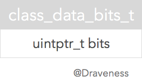
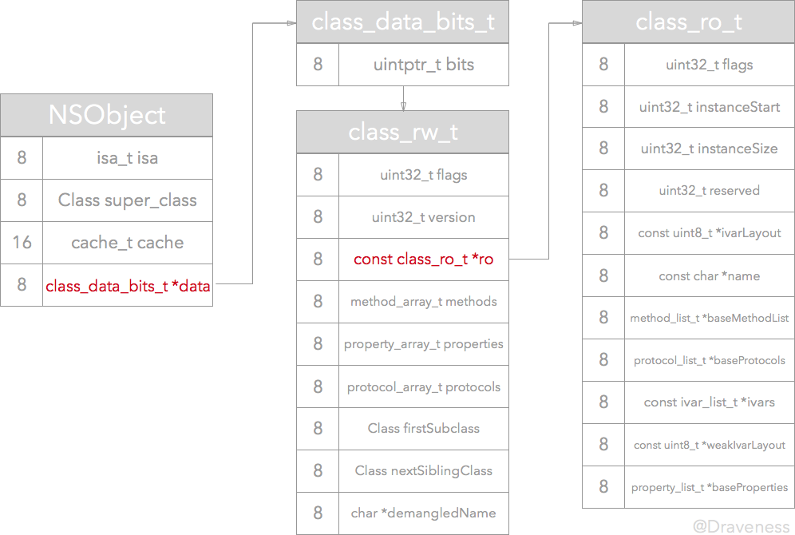
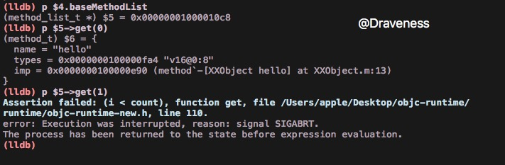
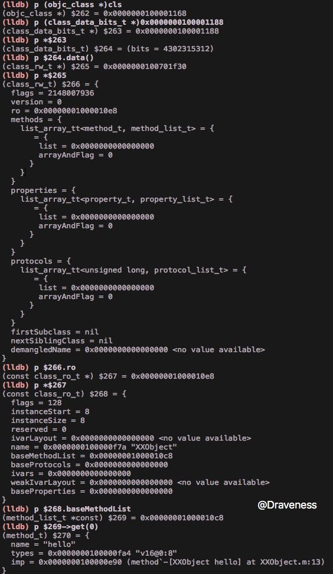
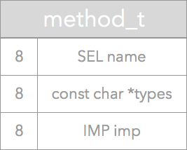

# ObjC 中方法的结构

> 因为 ObjC 的 runtime 只能在 Mac OS 下才能编译，所以文章中的代码都是在 Mac OS，也就是 `x86_64` 架构下运行的，对于在 arm64 中运行的代码会特别说明。

在上一篇分析 `isa` 的文章[从 NSObject 的初始化了解 isa](https://github.com/Draveness/iOS-Source-Code-Analyze/blob/master/objc/从%20NSObject%20的初始化了解%20isa.md)中曾经说到过实例方法被调用时，会通过其持有 `isa` 指针寻找对应的类，然后在其中的 `class_data_bits_t` 中查找对应的方法，在这一篇文章中会介绍方法在 ObjC 中是如何存储方法的。

这篇文章的首先会根据 ObjC 源代码来分析方法在内存中的存储结构，然后在 lldb 调试器中一步一步验证分析的正确性。

## 方法在内存中的位置

先来了解一下 ObjC 中类的结构图：

<p align="center">


+ `isa` 是指向元类的指针，不了解元类的可以看 [Classes and Metaclasses](http://www.sealiesoftware.com/blog/archive/2009/04/14/objc_explain_Classes_and_metaclasses.html)
+ `super_class` 指向当前类的父类
+ `cache` 用于缓存指针和 `vtable`，加速方法的调用
+ `bits` 就是存储类的方法、属性、遵循的协议等信息的地方

### `class_data_bits_t` 结构体

这一小结会分析类结构体中的 `class_data_bits_t bits`。

下面就是 ObjC 中 `class_data_bits_t` 的结构体，其中只含有一个 64 位的 `bits` 用于存储与类有关的信息：

<p align="center">


在 `objc_class` 结构体中的注释写到 `class_data_bits_t` 相当于 `class_rw_t` 指针加上 rr/alloc 的标志。

```objectivec
class_data_bits_t bits;    // class_rw_t * plus custom rr/alloc flags
```

它为我们提供了便捷方法用于返回其中的 `class_rw_t *` 指针：

```objectivec
class_rw_t* data() {
   return (class_rw_t *)(bits & FAST_DATA_MASK);
}
```

将 `bits` 与 `FAST_DATA_MASK` 进行位运算，只取其中的 `[3, 47]` 位转换成 `class_rw_t *` 返回。

> 在 x86_64 架构上，Mac OS **只使用了其中的 47 位来为对象分配地址**。而且由于地址要按字节在内存中按字节对齐，所以掩码的后三位都是 0。

因为 `class_rw_t *` 指针只存于第 `[3, 47]` 位，所以可以使用最后三位来存储关于当前类的其他信息：


```objectivec
#define FAST_IS_SWIFT           (1UL<<0)
#define FAST_HAS_DEFAULT_RR     (1UL<<1)
#define FAST_REQUIRES_RAW_ISA   (1UL<<2)
#define FAST_DATA_MASK          0x00007ffffffffff8UL
```

+ `isSwift()`
    + `FAST_IS_SWIFT` 用于判断 Swift 类
+ `hasDefaultRR()`
    + `FAST_HAS_DEFAULT_RR` 当前类或者父类含有默认的 `retain/release/autorelease/retainCount/_tryRetain/_isDeallocating/retainWeakReference/allowsWeakReference` 方法
+ `requiresRawIsa()`
    + `FAST_REQUIRES_RAW_ISA` 当前类的实例需要 raw `isa`

执行 `class_data_bits_t` 结构体中的 `data()` 方法或者调用 `objc_class` 中的 `data()` 方法会返回同一个 `class_rw_t *` 指针，因为 `objc_class` 中的方法只是对 `class_data_bits_t` 中对应方法的封装。

```objective
// objc_class 中的 data() 方法
class_data_bits_t bits;

class_rw_t *data() { 
   return bits.data();
}

// class_data_bits_t 中的 data() 方法
uintptr_t bits;

class_rw_t* data() {
   return (class_rw_t *)(bits & FAST_DATA_MASK);
}
```

### `class_rw_t` 和 `class_ro_t`

ObjC 类中的属性、方法还有遵循的协议等信息都保存在 `class_rw_t` 中：

```objectivec
struct class_rw_t {
    uint32_t flags;
    uint32_t version;

    const class_ro_t *ro;

    method_array_t methods;
    property_array_t properties;
    protocol_array_t protocols;

    Class firstSubclass;
    Class nextSiblingClass;
};
```

其中还有一个指向常量的指针 `ro`，其中存储了**当前类在编译期就已经确定的属性、方法以及遵循的协议**。

```objectivec
struct class_ro_t {
    uint32_t flags;
    uint32_t instanceStart;
    uint32_t instanceSize;
    uint32_t reserved;

    const uint8_t * ivarLayout;
    
    const char * name;
    method_list_t * baseMethodList;
    protocol_list_t * baseProtocols;
    const ivar_list_t * ivars;

    const uint8_t * weakIvarLayout;
    property_list_t *baseProperties;
};
```

**在编译期间**类的结构中的 `class_data_bits_t *data` 指向的是一个 `class_ro_t *` 指针：

<p align='center'>


然后在加载 *ObjC 运行时*的过程中在 `realizeClass` 方法中：

1. 从 `class_data_bits_t` 调用 `data` 方法，将结果从 `class_rw_t` 强制转换为 `class_ro_t` 指针
2. 初始化一个 `class_rw_t` 结构体
3. 设置结构体 `ro` 的值以及 `flag`
4. 最后设置正确的 `data`。

```objectivec
const class_ro_t *ro = (const class_ro_t *)cls->data();
class_rw_t *rw = (class_rw_t *)calloc(sizeof(class_rw_t), 1);
rw->ro = ro;
rw->flags = RW_REALIZED|RW_REALIZING;
cls->setData(rw);
```

下图是 `realizeClass` 方法执行过后的类所占用内存的布局，你可以与上面调用方法前的内存布局对比以下，看有哪些更改：

<p align='center'>


但是，在这段代码运行之后 `class_rw_t` 中的方法，属性以及协议列表均为空。这时需要 `realizeClass` 调用 `methodizeClass` 方法来**将类自己实现的方法（包括分类）、属性和遵循的协议加载到 `methods`、 `properties` 和 `protocols` 列表中**。

## XXObject

下面，我们将分析一个类 `XXObject` 在运行时初始化过程中内存的更改，这是 `XXObject` 的接口与实现：

```objectivec
// XXObject.h 文件
#import <Foundation/Foundation.h>

@interface XXObject : NSObject

- (void)hello;

@end

// XXObject.m 文件

#import "XXObject.h"

@implementation XXObject

- (void)hello {
    NSLog(@"Hello");
}

@end
```

> 这段代码是运行在 Mac OS X 10.11.3 (x86_64)版本中，而不是运行在 iPhone 模拟器或者真机上的，如果你在 iPhone 或者真机上运行，可能有一定差别。

<p align='center'>


这是主程序的代码：

```objectvec
#import <Foundation/Foundation.h>
#import "XXObject.h"

int main(int argc, const char * argv[]) {
    @autoreleasepool {
        Class cls = [XXObject class];
        NSLog(@"%p", cls);
    }
    return 0;
}
```

### 编译后内存中类的结构

因为**类在内存中的位置是编译期就确定的**，先运行一次代码获取 `XXObject` 在内存中的地址。

```objectivec
0x100001168
```

接下来，在整个 ObjC 运行时初始化之前，也就是 `_objc_init` 方法中加入一个断点：


然后在 lldb 中输入以下命令：

```
(lldb) p (objc_class *)0x100001168
(objc_class *) $0 = 0x0000000100001168
(lldb) p (class_data_bits_t *)0x100001188
(class_data_bits_t *) $1 = 0x0000000100001188
(lldb) p $1->data()
warning: could not load any Objective-C class information. This will significantly reduce the quality of type information available.
(class_rw_t *) $2 = 0x00000001000010e8
(lldb) p (class_ro_t *)$2 // 将 class_rw_t 强制转化为 class_ro_t
(class_ro_t *) $3 = 0x00000001000010e8
(lldb) p *$3
(class_ro_t) $4 = {
  flags = 128
  instanceStart = 8
  instanceSize = 8
  reserved = 0
  ivarLayout = 0x0000000000000000 <no value available>
  name = 0x0000000100000f7a "XXObject"
  baseMethodList = 0x00000001000010c8
  baseProtocols = 0x0000000000000000
  ivars = 0x0000000000000000
  weakIvarLayout = 0x0000000000000000 <no value available>
  baseProperties = 0x0000000000000000
}
```


现在我们获取了类经过编译器处理后的只读属性 `class_ro_t`：

```objectivec
(class_ro_t) $4 = {
  flags = 128
  instanceStart = 8
  instanceSize = 8
  reserved = 0
  ivarLayout = 0x0000000000000000 <no value available>
  name = 0x0000000100000f7a "XXObject"
  baseMethodList = 0x00000001000010c8
  baseProtocols = 0x0000000000000000
  ivars = 0x0000000000000000
  weakIvarLayout = 0x0000000000000000 <no value available>
  baseProperties = 0x0000000000000000
}
```

可以看到这里面只有 `baseMethodList` 和 `name` 是有值的，其它的 `ivarLayout`、 `baseProtocols`、 `ivars`、`weakIvarLayout` 和 `baseProperties` 都指向了空指针，因为类中没有实例变量，协议以及属性。所以这里的结构体符合我们的预期。

通过下面的命令查看 `baseMethodList` 中的内容：

```objectivec
(lldb) p $4.baseMethodList
(method_list_t *) $5 = 0x00000001000010c8
(lldb) p $5->get(0)
(method_t) $6 = {
  name = "hello"
  types = 0x0000000100000fa4 "v16@0:8"
  imp = 0x0000000100000e90 (method`-[XXObject hello] at XXObject.m:13)
}
(lldb) p $5->get(1)
Assertion failed: (i < count), function get, file /Users/apple/Desktop/objc-runtime/runtime/objc-runtime-new.h, line 110.
error: Execution was interrupted, reason: signal SIGABRT.
The process has been returned to the state before expression evaluation.
(lldb)
```



使用 `$5->get(0)` 时，成功获取到了 `-[XXObject hello]` 方法的结构体 `method_t`。而尝试获取下一个方法时，断言提示我们当前类只有一个方法。

### realizeClass

这篇文章中不会对 `realizeClass` 进行详细的分析，该方法的主要作用是对类进行第一次初始化，其中包括：

+ 分配可读写数据空间
+ 返回真正的类结构

```objectivec
static Class realizeClass(Class cls)
```

上面就是这个方法的签名，我们需要在这个方法中打一个条件断点，来判断当前类是否为 `XXObject`：


这里直接判断两个指针是否相等，而不使用 `[NSStringFromClass(cls) isEqualToString:@"XXObject"]` 是因为在这个时间点，这些方法都不能调用，在 ObjC 中没有这些方法，所以只能通过判断类指针是否相等的方式来确认当前类是 `XXObject`。

> 直接与指针比较是因为类在内存中的位置是编译期确定的，只要代码不改变，类在内存中的位置就会不变（已经说过很多遍了）。


这个断点就设置在这里，因为 `XXObject` 是一个正常的类，所以会走 `else` 分支分配可写的类数据。

> 运行代码时，因为每次都会判断当前类指针是不是指向的 `XXObject`，所以会等一会才会进入断点。

在这时打印类结构体中的 `data` 的值，发现其中的布局依旧是这样的：


在运行完这段代码之后:


我们再来打印类的结构:

```objectivec
(lldb) p (objc_class *)cls // 打印类指针
(objc_class *) $262 = 0x0000000100001168
(lldb) p (class_data_bits_t *)0x0000000100001188 // 在类指针上加 32 的 offset 打印 class_data_bits_t 指针
(class_data_bits_t *) $263 = 0x0000000100001188
(lldb) p *$263 // 访问 class_data_bits_t 指针的内容
(class_data_bits_t) $264 = (bits = 4302315312)
(lldb) p $264.data() // 获取 class_rw_t
(class_rw_t *) $265 = 0x0000000100701f30
(lldb) p *$265 // 访问 class_rw_t 指针的内容，发现它的 ro 已经设置好了
(class_rw_t) $266 = {
  flags = 2148007936
  version = 0
  ro = 0x00000001000010e8
  methods = {
    list_array_tt<method_t, method_list_t> = {
       = {
        list = 0x0000000000000000
        arrayAndFlag = 0
      }
    }
  }
  properties = {
    list_array_tt<property_t, property_list_t> = {
       = {
        list = 0x0000000000000000
        arrayAndFlag = 0
      }
    }
  }
  protocols = {
    list_array_tt<unsigned long, protocol_list_t> = {
       = {
        list = 0x0000000000000000
        arrayAndFlag = 0
      }
    }
  }
  firstSubclass = nil
  nextSiblingClass = nil
  demangledName = 0x0000000000000000 <no value available>
}
(lldb) p $266.ro // 获取 class_ro_t 指针
(const class_ro_t *) $267 = 0x00000001000010e8
(lldb) p *$267 // 访问 class_ro_t 指针的内容
(const class_ro_t) $268 = {
  flags = 128
  instanceStart = 8
  instanceSize = 8
  reserved = 0
  ivarLayout = 0x0000000000000000 <no value available>
  name = 0x0000000100000f7a "XXObject"
  baseMethodList = 0x00000001000010c8
  baseProtocols = 0x0000000000000000
  ivars = 0x0000000000000000
  weakIvarLayout = 0x0000000000000000 <no value available>
  baseProperties = 0x0000000000000000
}
(lldb) p $268.baseMethodList // 获取基本方法列表
(method_list_t *const) $269 = 0x00000001000010c8
(lldb) p $269->get(0) // 访问第一个方法
(method_t) $270 = {
  name = "hello"
  types = 0x0000000100000fa4 "v16@0:8"
  imp = 0x0000000100000e90 (method`-[XXObject hello] at XXObject.m:13)
}
(lldb) p $269->get(1) // 尝试访问第二个方法，越界
error: Execution was interrupted, reason: signal SIGABRT.
The process has been returned to the state before expression evaluation.
Assertion failed: (i < count), function get, file /Users/apple/Desktop/objc-runtime/runtime/objc-runtime-new.h, line 110.
(lldb)
```



> 最后一个操作实在是截取不到了

```objectivec
const class_ro_t *ro = (const class_ro_t *)cls->data();
class_rw_t *rw = (class_rw_t *)calloc(sizeof(class_rw_t), 1);
rw->ro = ro;
rw->flags = RW_REALIZED|RW_REALIZING;
cls->setData(rw);
```

在上述的代码运行之后，类的只读指针 `class_ro_t` 以及可读写指针 `class_rw_t` 都被正确的设置了。但是到这里，其 `class_rw_t` 部分的方法等成员都指针均为空，这些会在 `methodizeClass` 中进行设置：


在这里调用了 `method_array_t` 的 `attachLists` 方法，将 `baseMethods` 中的方法添加到 `methods` 数组之后。我们访问 `methods` 才会获取当前类的实例方法。

## 方法的结构

说了这么多，到现在我们可以简单看一下方法的结构，与类和对象一样，方法在内存中也是一个结构体。

```objectivec
struct method_t {
    SEL name;
    const char *types;
    IMP imp;
};
```

其中包含方法名，类型还有方法的实现指针 `IMP`：



上面的 `-[XXObject hello]` 方法的结构体是这样的：

```objectivec
name = "hello"
types = 0x0000000100000fa4 "v16@0:8"
imp = 0x0000000100000e90 (method`-[XXObject hello] at XXObject.m:13
```

方法的名字在这里没有什么好说的。其中，方法的类型是一个非常奇怪的字符串 `"v16@0:8"` 这在 ObjC 中叫做*类型编码*(Type Encoding)，你可以看这篇[官方文档](https://developer.apple.com/library/mac/documentation/Cocoa/Conceptual/ObjCRuntimeGuide/Articles/ocrtTypeEncodings.html)了解与类型编码相关的信息。

对于方法的实现，lldb 为我们标注了方法在文件中实现的位置。

## 小结

在分析方法在内存中的位置时，笔者最开始一直在尝试寻找**只读**结构体 `class_ro_t` 中的 `baseMethods` 第一次设置的位置（了解类的方法是如何被加载的）。尝试从 `methodizeClass` 方法一直向上找，直到 `_obj_init` 方法也没有找到设置只读区域的 `baseMethods` 的方法。

而且在 runtime 初始化之后，`realizeClass` 之前，从 `class_data_bits_t` 结构体中获取的 `class_rw_t` 一直都是错误的，这个问题在最开始非常让我困惑，直到后来在 `realizeClass` 中发现原来在这时并不是 `class_rw_t` 结构体，而是`class_ro_t`，才明白错误的原因。

后来突然想到类的一些方法、属性和协议实在编译期决定的（`baseMethods` 等成员以及类在内存中的位置都是编译期决定的），才感觉到豁然开朗。

1. 类在内存中的位置是在编译期间决定的，在之后修改代码，也不会改变内存中的位置。
2. 类的方法、属性以及协议在编译期间存放到了“错误”的位置，直到 `realizeClass` 执行之后，才放到了 `class_rw_t` 指向的只读区域 `class_ro_t`，这样我们即可以在运行时为 `class_rw_t` 添加方法，也不会影响类的只读结构。
3. 在 `class_ro_t` 中的属性在运行期间就不能改变了，再添加方法时，会修改 `class_rw_t` 中的 `methods` 列表，而不是 `class_ro_t` 中的 `baseMethods`，对于方法的添加会在之后的文章中分析。

## 参考资料

+ [Classes and Metaclasses](http://www.sealiesoftware.com/blog/archive/2009/04/14/objc_explain_Classes_and_metaclasses.html)
+ [Tagged Pointer](https://en.wikipedia.org/wiki/Tagged_pointer)
+ [类型编码](https://developer.apple.com/library/mac/documentation/Cocoa/Conceptual/ObjCRuntimeGuide/Articles/ocrtTypeEncodings.html)
+ [Type Encodings](http://nshipster.cn/type-encodings/)

